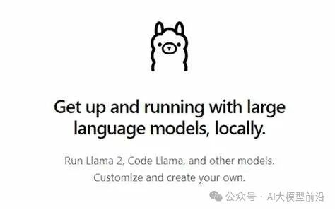
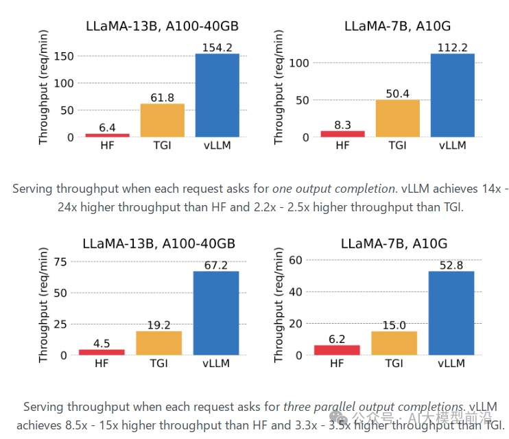
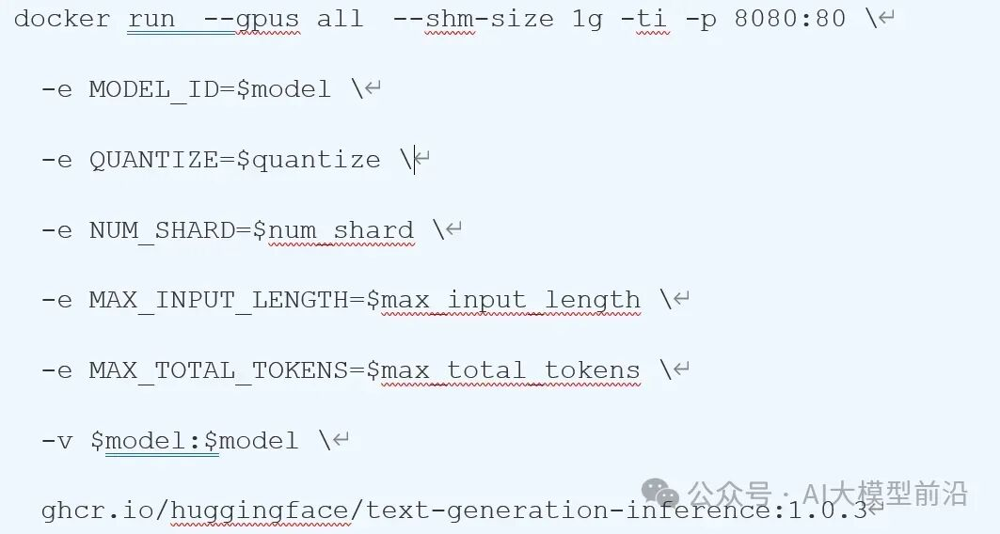
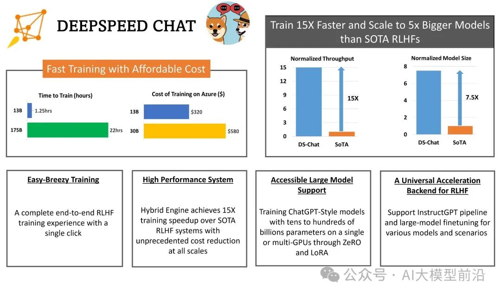

# 7种大模型的部署方法

我们如何在本地部署运行私有的开源大型语言模型（LLMs）呢？本文将向您梳理七种实用的方法及如何选择。

## **Hugging Face的Transformers**

这是一个强大的Python库，专为简化本地运行LLM而设计。其优势在于自动模型下载、提供丰富的代码片段，以及非常适合实验和学习。然而，它要求用户对机器学习和自然语言处理有深入了解，同时还需要编码和配置技能。

## **Llama.cpp**

基于C++的推理引擎，专为Apple Silicon打造，能够运行Meta的Llama2模型。它在GPU和CPU上的推理性能均得到优化。Llama.cpp的优点在于其高性能，支持在适度的硬件上运行大型模型（如Llama 7B），并提供绑定，允许您使用其他语言构建AI应用程序。其缺点是模型支持有限，且需要构建工具。

## **Llamafile**

由Mozilla开发的C++工具，基于llama.cpp库，为开发人员提供了创建、加载和运行LLM模型所需的各种功能。它简化了与LLM的交互，使开发人员能够轻松实现各种复杂的应用场景。Llamafile的优点在于其速度与Llama.cpp相当，并且可以构建一个嵌入模型的单个可执行文件。然而，由于项目仍处于早期阶段，不是所有模型都受支持，只限于Llama.cpp支持的模型。

## **Ollama**

作为Llama.cpp和Llamafile的用户友好替代品，Ollama提供了一个可执行文件，可在您的机器上安装一个服务。安装完成后，只需简单地在终端中运行即可。其优点在于易于安装和使用，支持llama和vicuña模型，并且运行速度极快。然而，Ollama的模型库有限，需要用户自己管理模型。具体教程：[《手机、电脑部署大模型》](https://mp.weixin.qq.com/s?__biz=Mzk0MDY2ODM3NQ==&mid=2247484121&idx=1&sn=e8a34458aafc5ee95844d94342a61862&chksm=c2df6661f5a8ef775a2a115816c0f1372309fbfced95bcf6c9117de12f0f6878ee24db8fda32&token=214879471〈=zh_CN&scene=21#wechat_redirect)

## **vLLM**

这是一个高吞吐量、内存高效的大型语言模型（LLMs）推理和服务引擎。它的目标是为所有人提供简便、快捷、经济的LLM服务。vLLM的优点包括高效的服务吞吐量、支持多种模型以及内存高效。然而，为了确保其性能，用户需要确保设备具备GPU、CUDA或RoCm。

## TGI（Text Generation Inference)

由HuggingFace推出的大模型推理部署框架，支持主流大模型和量化方案。TGI结合Rust和Python，旨在实现服务效率和业务灵活性的平衡。它具备许多特性，如简单的启动LLM、快速响应和高效的推理等。通过TGI，用户可以轻松地在本地部署和运行大型语言模型，满足各种业务需求。经过优化处理的TGI和Transformer推理代码在性能上存在差异，这些差异体现在多个层面：

- 并行计算能力：TGI与Transformer均支持并行计算，但TGI更进一步，通过Rust与Python的联合运用，实现了服务效率与业务灵活性的完美平衡。这使得TGI在处理大型语言模型时，能够更高效地运用计算资源，显著提升推理效率。
- 创新优化策略：TGI采纳了一系列先进的优化技术，如Flash Attention、Paged Attention等，这些技术极大地提升了推理的效率和性能。而传统的Transformer模型可能未能融入这些创新优化。
- 模型部署支持：TGI支持GPTQ模型服务的部署，使我们能在单卡上运行启用continuous batching功能的更大规模模型。传统的Transformer模型则可能缺乏此类支持。

尽管TGI在某些方面优于传统Transformer推理，但并不意味着应完全放弃Transformer推理。在特定场景下，如任务或数据与TGI优化策略不符，使用传统Transformer推理可能更合适。当前测试表明，TGI的推理速度暂时逊于vLLM。TGI推理支持以容器化方式运行，为用户提供了更为灵活和高效的部署选项。

## **DeepSpeed**

微软精心打造的开源深度学习优化库，以系统优化和压缩为核心，深度优化硬件设备、操作系统和框架等多个层面，更利用模型和数据压缩技术，极大提升了大规模模型的推理和训练效率。DeepSpeed-Inference，作为DeepSpeed在推理领域的扩展，特别针对大语言模型设计。它巧妙运用模型并行、张量并行和流水线并行等技术，显著提升了推理性能并降低了延迟。

## **总结**

选择部署框架的关键在于任务需求。只有根据实际需求来确定合适的框架，才能确保项目的顺利推进和成功实现。因此，在选择部署框架时，我们应该深入了解框架的特性、优缺点以及适用场景，综合考虑项目规模、技术栈、资源等因素，从而选择最适合的框架来支撑项目的实施。这样不仅可以提高开发效率，还能降低项目风险，确保项目的顺利推进和最终成功。

- 追求高性能推理？DeepSpeed是您的理想之选。其独特的ZeRO（零冗余优化器）、3D并行（数据并行、模型并行和流水线并行的完美融合）以及1比特Adam等技术，都极大提高了大模型训练和推理的效率。
- 期望一个易于使用的工具？ollama可能更适合您。简洁的命令行界面，让模型运行变得轻松自如。
- 需要创建嵌入模型的单个可执行文件？Llamafile将是您的得力助手。其便携性和单文件可执行的特点，让人赞不绝口。
- 在多种硬件环境下实现高效推理？TGI将是不二之选。其模型并行、张量并行和流水线并行等优化技术，确保了大模型推理的高效运行。
- 面对复杂的自然语言处理任务，如机器翻译、文本生成等？基于Transformer的模型将为您助力。其强大的表示能力，轻松捕捉文本中的长距离依赖关系。
- 处理大规模的自然语言处理任务，如文本分类、情感分析等？vLLM将是您的得力助手。作为大规模的预训练模型，它在各种NLP任务中都能展现出色的性能。