# Agent Skills

## 为什么有 Skills

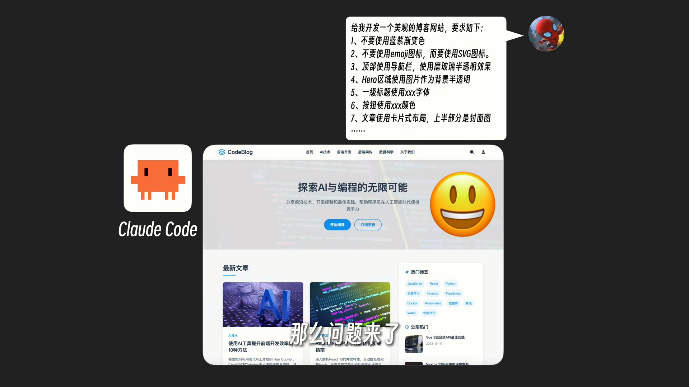

把上面这一堆要求告诉Claude Code，让它再重新开发一个“美观”的博客网站，这样情况就好多了，那么问题来了，我不想每次开发项目的时候都啰里啰唆的写这么一大段，能不能让ClaudeCode"记住"我的这些要求？

Claude Code提供了一个方法，我们可以把这一大段要求放到一个单独的文件中，以markdown格式书写，后续我们在让Claude Code干活的时候，他就把这个文件一起带上发给AI了，这样就不用每次都要写一遍了，但这样有一个新的问题，如果我只是在ClaudeCode里面聊聊天、提提问，反正不是开发网站，它也要把这一堆内容发给AI，这不是白白浪费token吗？能不能简化一下这个流程，只有当真正需要用到这个文件的时候Claude Code才把它发给AI呢?
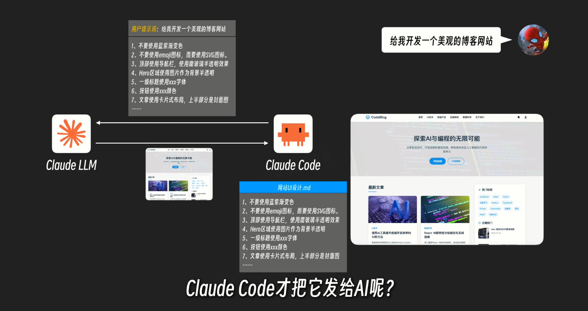

我们可以这样做,给这个文件取个名字然后加个描述,放在文件最开始的地方,同样还是以markdown格式书写,这两个字段简单介绍了这个文件叫啥，是干啥用的。然后Claude Code在与Al沟通的时候，我这里有个文档，它的名字和描述是这样的，如果你有需要可以问我要具体内容，后面AI收到用户的指令发现是要开发网站，这时候再告诉ClaudeCode把这个文件给我发来就可以了，经过这样一通改造，就避免了每次都要把这个文件传给AI浪费token的问题了。

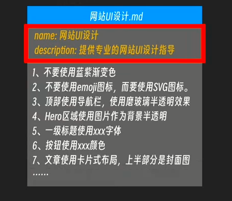

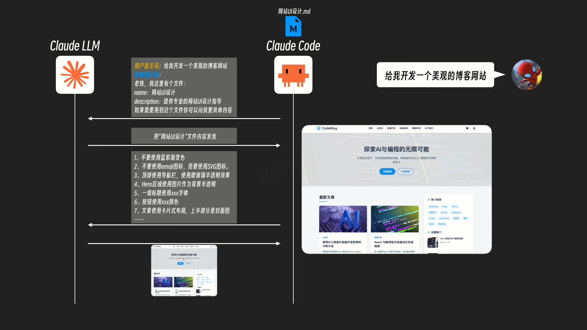

你发现这一招还挺好使，于是如法炮制，写了一堆不同的文档，比如「SVG动画制作.md」，用来详细指导AI如何制作网页SVG动画。「PPT制作.md」用来详细指导AI如何制作美观的PPT，「日报生成.md」用来详细指导AI如何书写符合你们公司风格规范的工作日报。Claude Code与AI交互的时候只需要把这些文档的名字和描述信息作为一个目录清单告诉AI，就像它当初把MCP服务清单发给AI那样，AI根据用户的提示词自行决定动态加载哪些文档，同样的Claude Code，同样的AI大模型，因为有了这一堆文档的加持，你手里的这一套比别人多了很多技能。它更擅长做出好看的网站UI，更擅长做SVG动画，更擅长做PPT、更擅长写日报。
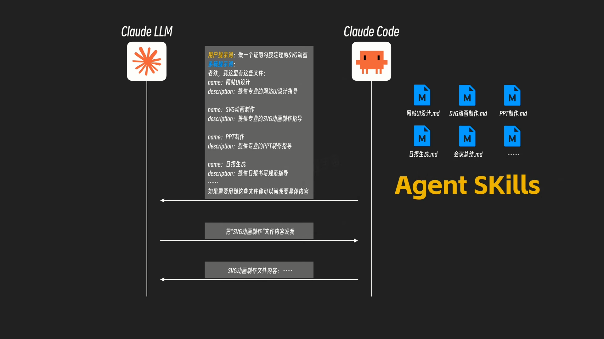

而刚刚这套技术的名字有一个闪亮的名字，它就是Agent Skills，这一个个文档就是一个个的Skill，也就是一个个的技能，简单理解的话，这些个Skill 就是一个个技能手册，Claude Code和AI根据这些手册就能完成特定的工作，为了规范管理，Claude Code通过文件夹的形式来管理这些技能，并且把每个Skill的主文件都统一命名为skil.md
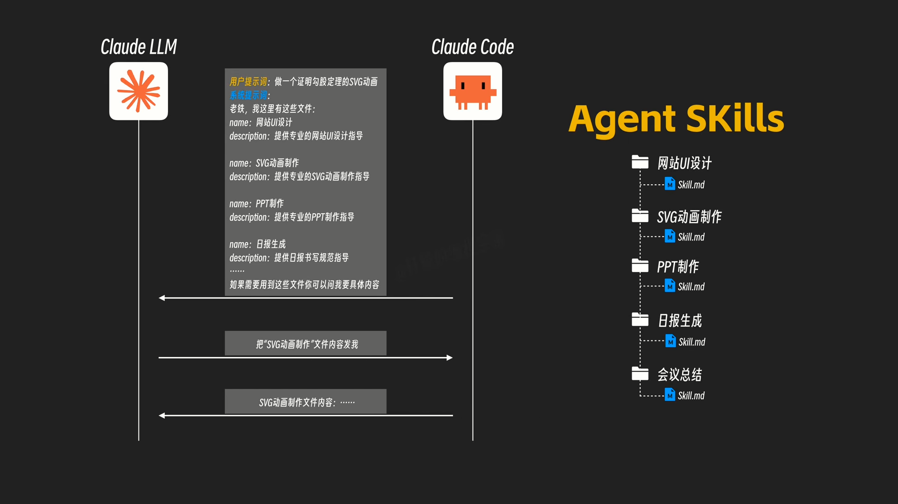

回到我们这个网站U设计的Skill，随着你不断的迭代，这个markdown文件也变得越来越长，因为好看的UI样式实在太多了，你很难用一个单一的markdown文档来全部写完，而且就算你能全部写在里面，但实际上AI只能用到其中一部分，其他大部分用不上的内容又白白浪费了上下文token了。
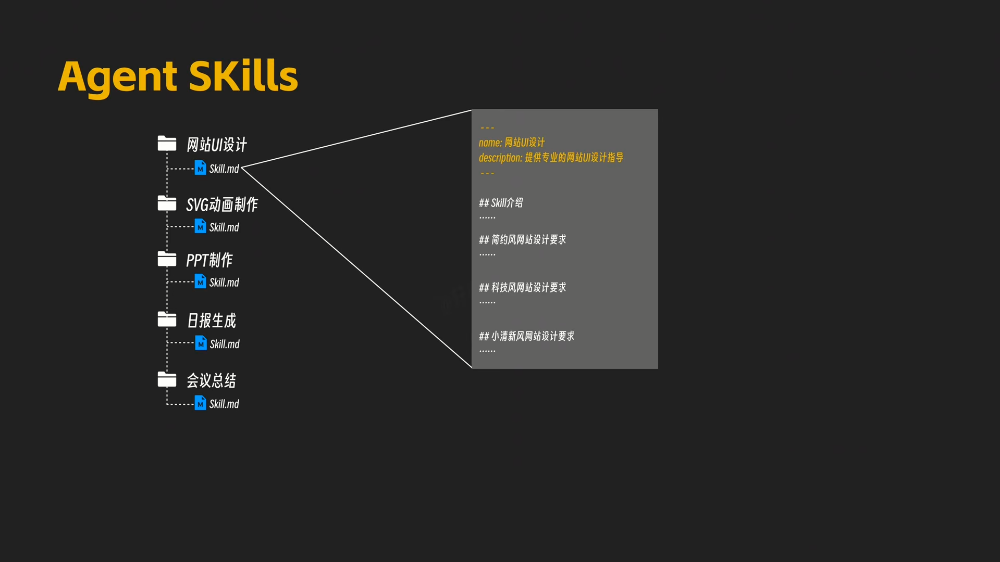

于是你打算把每一种风格单独拎出来写一个文件，然后在原来这个主文件里面做一个汇总，里面写上如果要做简约风网站就读取「简约风.md」，如果要做科技风网站就读取「科技风.md」。
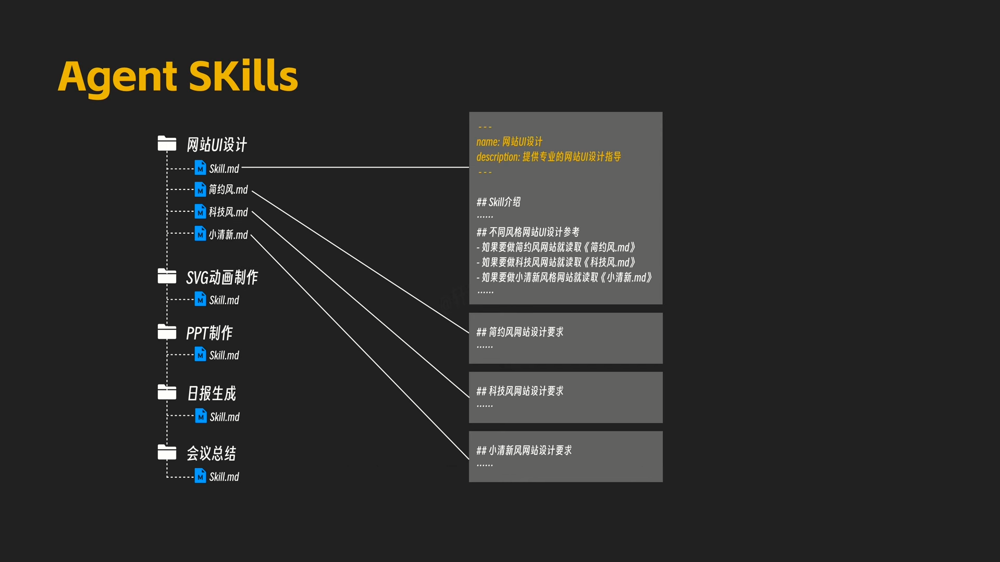

这样一来，当你让Claude Code做一个科技风的网站的时候，AI发现要先读取网站UI设计这个Skill，在读取这个主markdown文档之后，再根据需要进一步读取「科技风.md」这个文档，这样按需渐进式加载极大节省了token，让AI只有在必要的时候才读取相应的内容。
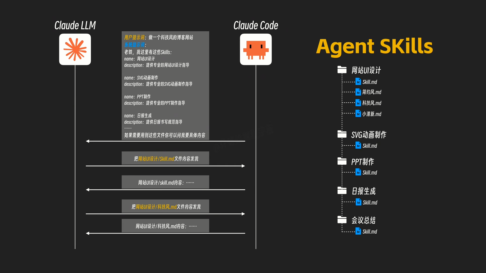

再后来，你发现需要对网站UI做更精细化的控制，比如按钮、段落、图标、配色、图表等等，用这样的单个文档方式也不太好维护，你决定技术升级，把这些细粒度的UI内容全部用数据表来进行管理，为了简单起见，你选择了用CSV表格文件来管理，然后你希望AI在开发网站的时候，按照下面这一套工作流来确定最终选择的样式，为了让AI知道如何搜索，上面的每一步你都写了详细的文字说明，你还专门编写了一个Pvthon脚本，并告诉AI如何执行这个脚本，来从这一堆CSV文件里面进行搜索， 现在AI大模型在Claude Code的配合下，在拿到你这个skill.md文档之后，就按照你写的流程，一步步执行里面的操作，执行Python脚本完成检索，最后拿到完整的UI设计信息，开始为你开发网站。事情发展到这里，这份Skill 不仅是提供简单的文字信息给AI作参考,还能指定工作流，还能提供程序让ClaudeCode来执行，完成更加复杂的工作了。
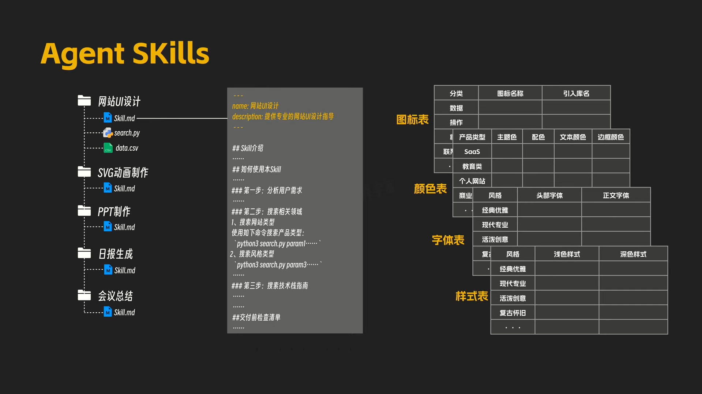

最后让我们来梳理一下整个的过程，首先每个Skill都需要一个Markdown文件，并且在文件的最开始有名字和描述两个字段，这属于这个skil的元数据Meta Data，Claude Code在启动时加载这些元数据，并将它们包含在系统提示词中，因为这两个字段本身内容比较短，所以一般不会占据太多token，第二，每个Markdown文件除了前面元数据之后的正文内容叫做指令，它本质上就是一段提示词，用来指导Claude Code如何做特定的事情， 只有当AI需要使用这个skil的时候才会加载它，官方称之为触发时加载，第三，资源和代码，skil相关的其他文件和代码脚本，只有当AI在使用Skill的过程中需要用到的时候才会动态加载，官方称之为按需加载。以上就是Anthropic推出的Agent Skills技术了。
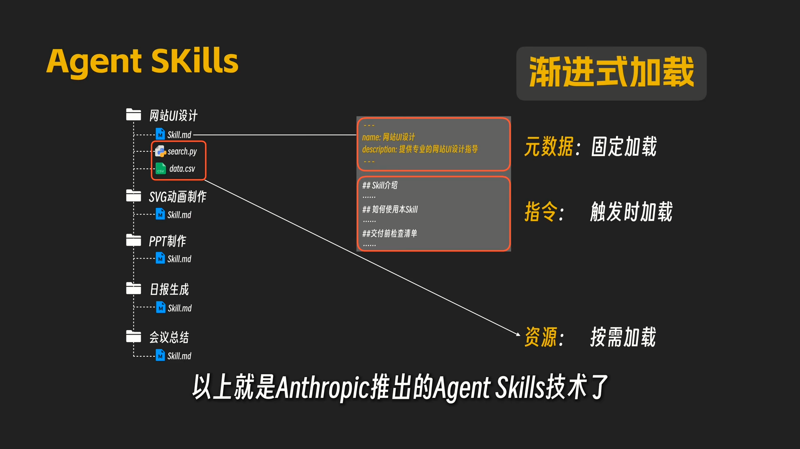

扒掉这些晦涩的名词概念，它其实就是一项提示词工程技术的应用，和之前的MCP技术也有很多类似之处。

