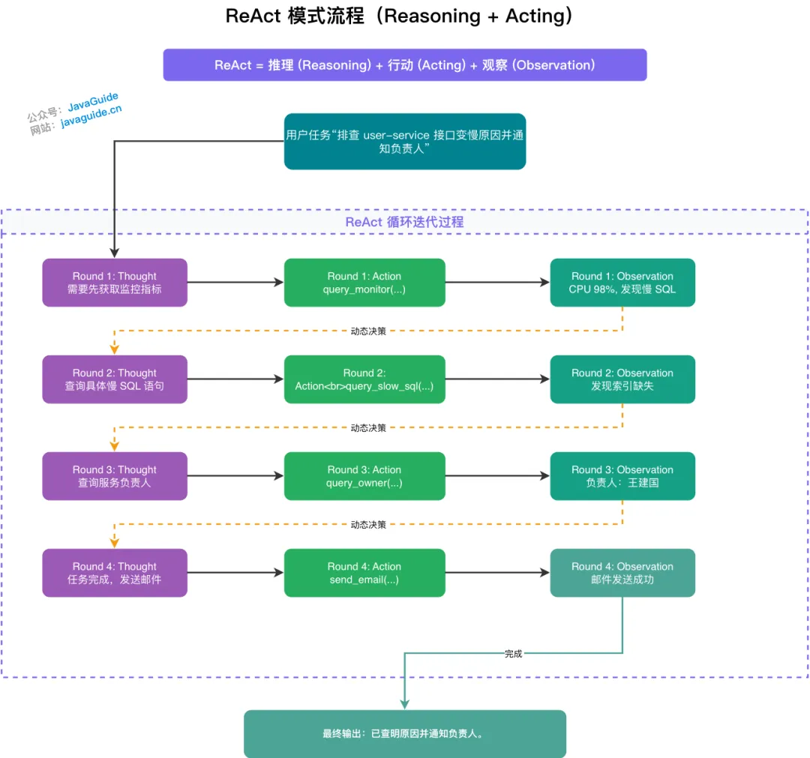
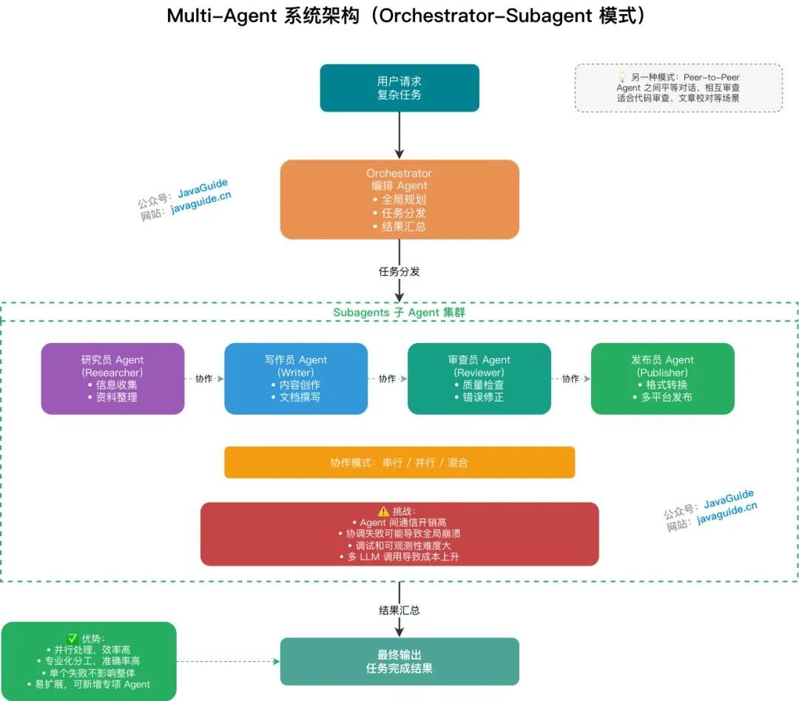
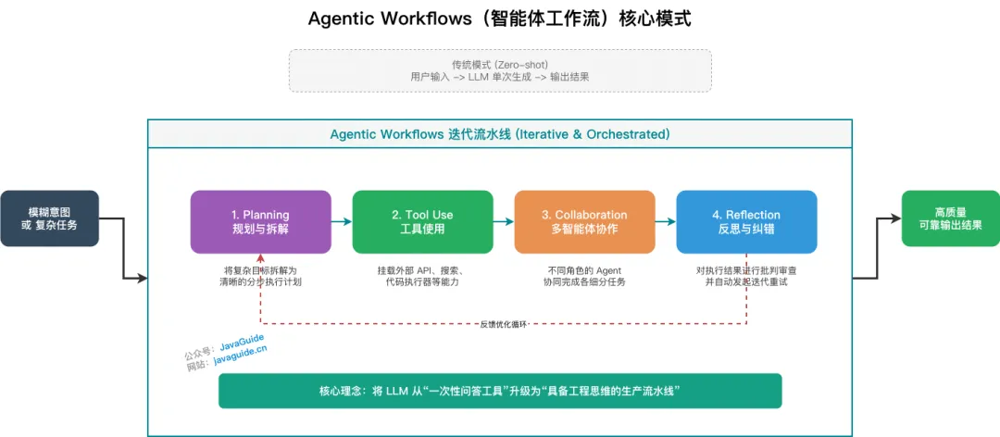

# Agent 不就是 LLM 加点工具？”，我：“ReAct、Reflection、A2A、Agentic Workflows……

上周去面试某大厂的核心业务线，因为平时主要是做后端开发的，我就在简历上重点写了一段基于 Spring AI 落地智能客服的经历。

面试官翻了翻简历，靠在椅背上漫不经心地问：“你们这个所谓的 Agent 智能客服，底层不就是拿大语言模型包了一层，然后挂几个现成的 API 插件吗？这能有什么工程难点？”

我一听这话就精神了，直接反问：“如果只是简单挂个插件，那遇到复杂故障排查时，ReAct 模式下的动态反馈闭环怎么控？长对话里的记忆机制怎么管理以防上下文截断？后续演进到 Multi-Agent 系统时，各个智能体之间的 A2A 通信协议又该怎么设计？您管这叫挂几个插件？”

空气突然安静了三秒。面试官收起了漫不经心的态度，坐直了身子说：“有点意思，那你详细说说你们这个 Agentic Workflows 是怎么落地的。”

段子归段子。今天 Guide 就带大家彻底梳理一下 AI Agent 的核心工程范式，希望对大家学习/面试有帮助：

1. ⭐️ 什么是 ReAct 模式？
2. ⭐️ 能否通过你的项目中实际的例子体现 ReAct 模式？
3. ⭐️ ReAct 是怎么实现的？
4. 什么是 Plan-and-Execute 模式？
5. 什么是 Reflection 模式？
6. 什么是 Multi-Agent 系统？
7. 什么是 A2A(Agent-to-Agent) 通信协议？
8. ⭐️ 什么是 Agentic Workflows(智能体工作流）?


## **⭐️ 什么是 ReAct 模式？**

ReAct（Reasoning + Acting）是当前 AI Agent 理论中最具基础性和代表性的范式，由 Shunyu Yao、Jeffrey Zhao 等大佬于 2022 年在论文《ReAct: Synergizing Reasoning and Acting in Language Models》中提出。该范式已成为现代 AI 代理设计的基准，影响了后续框架如 LangChain 和 LlamaIndex。

																													*ReAct-LLM*


**核心思想**：

将“思维链（CoT）推理”与“外部环境交互行动”相结合，弥补单纯 LLM 缺乏实时信息和容易产生幻觉的缺陷。通过交织推理和行动，ReAct 使模型生成更可靠、可追踪的任务解决轨迹，提高解释性和准确性。

**通俗理解**：

让 AI 在整体目标的指引下“走一步看一步”。它打破了一次性规划全部流程的局限，通过动态的交替循环边思考边验证。例如在排查线上服务变慢的故障时（后文会举例详细介绍），AI 不会死板地执行预设脚本，而是先查询监控指标，观察到 CPU 飙升及慢 SQL 告警后，再动态决定去深挖数据库日志定位全表扫描问题，最后基于真实的排查结果通知负责人。这种顺藤摸瓜的过程，生成了更可靠、可追踪且能动态纠错的任务解决轨迹。

**运作流程**：

这是一个基于反馈闭环的交替过程，主要包含以下三个核心步骤（Reasoning -> Acting -> Observation），循环往复直至任务完成或触发终止条件：

1. **思考（Reasoning）**：LLM 分析当前上下文，生成内部推理过程，决定采取何种行动。这类似于 CoT 提示，但更注重行动导向。例如，模型可能会输出：“任务是查找最新天气。我需要调用天气 API，因为我的知识截止于训练数据。”
2. **行动（Acting）**：根据推理结果，与外部环境交互，如调用 API 或搜索网络。这可以通过工具调用实现，例如执行“search_web(query='当前北京天气')”或“call_api(endpoint='/weather')”。
3. **观察（Observation）**：获取外部环境对行动的反馈结果，作为新输入传递给 LLM，触发新一轮思考。例如，如果行动返回“北京天气：晴，25°C”，模型会观察此信息，并推理下一步（如“基于天气，建议穿短袖”）。

**优缺点分析**：

- **优势**：显著减少幻觉（引入外部真实数据验证）、提升复杂任务的成功率、具备极高的可解释性与可调试性（完整的推理轨迹清晰可见）。
- **局限性**：多轮循环迭代会导致系统整体响应延迟增加，同时其表现高度依赖所集成的外部工具和 Skills 的质量与稳定性。


## **⭐️ 能否通过你的项目中实际的例子体现 ReAct 模式？**

**任务：** “帮我排查一下今天早上 `user-service` 接口变慢的原因，并把排查结果发给该服务的负责人。”

用 ReAct 的方式，AI 会经历如下动态博弈的过程：

1. **思考 (Thought)：** 用户要求排查接口变慢，我需要先获取 `user-service` 今天早上的监控指标或告警信息。
2. **行动 (Action)：** 调用监控查询工具 `query_monitor(service="user-service", time="morning")`
3. **观察 (Observation)：** 返回数据表明，9:00-9:30 期间 CPU 利用率飙升至 98%，同时伴随大量慢 SQL 告警。
4. **思考 (Thought)：** 既然有慢 SQL 告警，说明数据库查询可能存在瓶颈。我需要去日志系统查询具体的慢 SQL 语句是什么。_(注意：这一步是动态决定的，如果上一步发现是内存 OOM，现在的行动就会变成查 Heap Dump)_
5. **行动 (Action)：** 调用日志查询工具 `query_slow_sql(service="user-service", time="09:00-09:30")`
6. **观察 (Observation)：** 获取到慢 SQL：`SELECT * FROM users WHERE age > 20 ORDER BY created_at DESC`，并发现该查询没有命中索引，导致全表扫描。
7. **思考 (Thought)：** 根本原因已经找到（全表扫描导致 CPU 飙升）。接下来我需要找到 `user-service` 的负责人是谁，以便发送报告。
8. **行动 (Action)：** 调用企业通讯录工具 `query_service_owner(service="user-service")`
9. **观察 (Observation)：** 查出负责人是“王建国”，邮箱是 `wangjianguo@company.com`。
10. **思考 (Thought)：** 我现在收集齐了故障原因和联系人信息，可以组织排查报告并发送邮件了。
11. **行动 (Action)：** 调用邮件发送工具 `send_email(to="wangjianguo@company.com", subject="user-service 故障排查", body="发现由于缺少索引导致慢查询...")`
12. **观察 (Observation)：** 返回结果：邮件发送成功。
13. **思考 (Thought)：** 任务已全部闭环完成，可以向用户输出最终答复了。
14. **行动 (Action)：** 结束循环，用自然语言回复用户：“已查明原因是缺少索引导致的慢 SQL，并已向负责人王建国发送了邮件。”

如果采用非 ReAct 的模式（比如让 AI 一开始就写好计划），AI 可能会死板地执行“查日志 -> 找人 -> 发邮件”。但如果故障原因不在日志里，而在网络配置里，静态计划就会彻底崩溃。

在这个例子中，第 4 步的决定完全依赖于第 3 步的观察结果。ReAct 让 Agent 拥有了像人类工程师一样**顺藤摸瓜、根据证据修正排查方向**的能力。这是单纯的链式调用（Chain）无法做到的。

**💡 延伸思考**：在更成熟的 Agent 系统中，上述步骤 2、5 中对监控和日志的联合查询，可以被封装为一个名为 `diagnose_service_performance` 的 **Skill**——它内部自动编排"查监控 + 查慢 SQL + 分析瓶颈"三个工具的调用序列，并返回一份结构化的诊断摘要。Agent 在推理时只需调用这一个 Skill，而不必每次都拆解成多个独立步骤，既降低了上下文占用，也提升了在同类故障场景下的复用效率。这正是 Skills 作为 Tools 高阶封装形态的核心价值所在。


## **⭐️ ReAct 是怎么实现的？**

ReAct 的落地实现主要依赖以下五个核心组件协同工作：

1. **历史上下文（History）**：Agent 维护一个统一的交互日志，涵盖以往的推理步骤、执行动作以及反馈观察。这为 LLM 提供了即时"记忆"机制，确保决策时能回顾先前事件，从而规避冗余步骤或无限循环风险。
2. **实时环境输入（Real-time Environment Input）**：包括 Agent 当前捕获的外部变量，如系统警报信号或用户即时反馈。这些补充数据融入上下文，帮助 LLM 准确评估现状并调整策略。
3. **模型推理模块（LLM Reasoning Module）**：作为 ReAct 的核心引擎，处理逻辑分析与规划。每次迭代中，LLM 整合历史记录、环境输入及任务目标，输出行动方案。
4. **执行工具集与技能库（Tools & Skills）**：充当 Agent 的操作接口，与外部实体互动。其中原子工具（Tools）处理单一操作（如数据库查询、邮件发送）；技能（Skills）则是对多个相关工具的编排封装，提供面向特定业务场景的可复用能力模块（如"故障诊断技能"、"竞品分析技能"）。两者共同构成 Agent 的行动能力边界。
5. **反馈观察机制（Feedback Observation）**：行动完成后，从环境中采集的实际响应，包括成功输出、错误提示或无结果状态。这一信息将被追加至历史上下文中，成为后续推理的可靠基础。

这里以上面提到的例子来展示一下执行流程（采用逐轮叙述形式，便于追踪动态变化）：

																														*ReAct 模式流程*

**Round 1**

- 历史上下文：空
- 实时环境输入：空
- 核心 Prompt：`已知：当前历史上下文：{历史上下文} 实时环境输入：{实时环境输入} 用户目标："排查 user-service 变慢原因并通知负责人" 请做出下一步的决策，你必须最少使用一个工具来实现该决策。`
- 执行工具：`query_monitor` 查询 user-service 早上的监控指标
- 观察结果：CPU 飙升至 98%，伴随大量慢 SQL 告警。

**Round 2**

- 历史上下文：已获取监控指标（CPU 飙升，有慢 SQL）
- 执行工具：`query_slow_sql` 查询慢 SQL 日志
- 观察结果：发现语句未命中索引，导致全表扫描。

**Round 3**

- 历史上下文：监控指标 + 日志结论（全表扫描）
- 执行工具：`query_owner` 查询 user-service 负责人
- 观察结果：负责人为王建国，邮箱 `wangjianguo@company.com`。

**Round 4**

- 历史上下文：监控指标 + 日志结论 + 负责人信息
- 执行工具：`send_email` 向负责人发送排查报告
- 观察结果：邮件发送成功。

从底层来看，驱动 Agent Loop 运转的核心是一套动态组装的 Prompt：

```
已知：
当前历史上下文：&{历史上下文}
实时环境输入：&{实时环境输入}
用户目标："排查 user-service 变慢原因并通知负责人"

请做出下一步的决策：
（你可以选择调用工具或 Skill，或者在任务完成时直接输出最终结果）
```

**最终输出**：“已查明 user-service 接口变慢原因是由于慢 SQL 未命中索引导致全表扫描，已向负责人王建国发送了详细排查邮件。”


## **什么是 Plan-and-Execute 模式？**

Plan-and-Execute（计划与执行）模式由 LangChain 团队于 2023 年提出。

**核心思想：**让 LLM 充当规划者，先制定全局的分步计划，再由执行器按步骤逐一完成，而非“边想边做”。

- **优势**：非常适合步骤繁多、逻辑依赖明确的长期复杂任务，能有效避免 ReAct 模式在长任务中容易出现的“迷失”或“死循环”问题。例如，在处理多阶段项目管理时，先输出完整计划（如步骤 1: 收集数据；步骤 2: 分析；步骤 3: 生成报告），然后逐一执行。
- **缺点**：偏向静态工作流，执行过程中的动态调整和容错能力较弱。如果环境变化（如工具失败），可能需要重新规划，导致效率低下。

**与 ReAct 的对比**

| 维度       | ReAct                | Plan-and-Execute         |
| :--------- | :------------------- | :----------------------- |
| 规划方式   | 动态、逐步规划       | 静态、全局预规划         |
| 适用场景   | 动态环境、需实时纠偏 | 步骤明确的长期复杂任务   |
| 容错能力   | 强（每步可动态修正） | 弱（环境变化需重新规划） |
| 上下文管理 | 随迭代持续增长       | 执行步骤相对独立，更可控 |

**最佳实践**：两者并非互斥，可结合使用——**规划阶段**采用 CoT 生成全局步骤，**执行阶段**在每个步骤内嵌入 ReAct 子循环，兼顾全局结构性和局部灵活性。在执行层，还可以为每类子任务预注册对应的 Skill，让规划出的每一个步骤都能高效映射到可复用的能力模块上，进一步提升执行效率。


## **什么是 Reflection 模式？**

Reflection（反思）模式赋予 Agent **自我纠错与迭代优化**的能力，核心理念是：通过自然语言形式的口头反馈强化模型行为，而非调整模型权重（即零训练成本）。

**三大主流实现方案**

1. **Reflexion 框架**（Noah Shinn et al., 2023）：Agent 在任务失败后进行口头反思，将反思结论存入情节记忆缓冲区，供下次尝试时参考。例：代码调试中，上次失败后反思"变量 `count` 在调用前未初始化"，下次直接规避同类错误。
2. **Self-Refine 方法**：任务完成后，Agent 对自身输出进行批判性审查并迭代改进，平均可提升约 **20%** 的输出质量。流程：生成初稿 → 自我批评（"内容不够具体"）→ 修订输出 → 循环至满足质量标准。
3. **CRITIC 方法**：引入外部工具（搜索引擎、代码执行器等）对输出进行事实性验证，再基于验证结果自我修正，相比纯内部反思更具客观性。

**与其他范式的关系**

Reflection 通常不单独使用，而是作为增强层叠加在 ReAct 或 Plan-and-Execute 之上：**ReAct + Reflection** 使每轮观察后不仅更新行动计划，还进行显式自我反思，形成自适应 Agent。实际应用中显著提升了 Agent 在不确定环境下的鲁棒性，但会带来额外的 LLM 调用开销。


## **什么是 Multi-Agent 系统？**

Multi-Agent 系统是指多个独立 Agent 通过协作完成单一复杂任务的架构，每个 Agent 专注于特定角色或职能，类比人类的团队分工协作。

																			*Multi-Agent 系统架构（Orchestrator-Subagent 模式)*

**核心架构模式**

- **Orchestrator-Subagent 模式**（主流）：一个**编排 Agent（Orchestrator）** 负责全局规划和任务分发，多个**子 Agent（Subagent）** 并行或串行执行具体子任务，最终由 Orchestrator 汇总输出。
- **Peer-to-Peer 模式**：Agent 之间平等对话、相互审查（如 AutoGen 中的对话式 Agent），适合需要辩论或验证的场景（如代码审查、文章校对）。

**优缺点**：

- **优势**：并行处理，显著提升复杂任务效率；专业化分工，提升各模块准确率；单个 Agent 失败不影响整体架构；可扩展性强，易于新增专项 Agent。
- **缺点**：Agent 间通信开销高；协调失败可能导致任务全局崩溃；调试和可观测性难度大；多 LLM 调用导致成本显著上升。


## **什么是 A2A (Agent-to-Agent) 通信协议？**

当我们把单个 Agent 升级为 Multi-Agent（多智能体团队）时，必然面临一个工程难题：**Agent 之间怎么沟通？** 如果在智能体之间依然使用自然语言（就像人类和 ChatGPT 聊天那样）进行交互，会导致极高的 Token 消耗，且极易在关键参数传递时出现格式解析错误（即模型幻觉导致的数据丢失）。A2A 协议就是为了解决这一痛点而生的。

A2A (Agent-to-Agent) 通信协议架构

**核心思想：** A2A 协议是专门为 AI 智能体间高效、确定性协作而设计的通信规范。它要求 Agent 在相互交互时，收起“高情商”的自然语言废话，转而使用高度结构化、带有严格校验规则的数据载体（如定义了 Schema 的 JSON、XML 或特定的状态流转指令）。

**通俗理解：** 这就好比后端开发中的微服务架构。如果两个微服务通过互相解析带有感情色彩的 HTML 页面来交换数据，系统早就崩溃了；真实的微服务是通过 RESTful 或 RPC 接口，传递结构化的实体对象。A2A 协议就相当于给大模型之间定义了接口契约。 比如，“产品经理 Agent”写完了需求，它不会对“开发 Agent”说：“嗨，我写好了一个登陆模块，请你开发一下。” 而是通过 A2A 协议输出一段标准化的 JSON Payload，里面明确包含 `TaskID`、`Dependencies`、`AcceptanceCriteria` 等字段。开发 Agent 接收后，直接反序列化成内部上下文开始写代码。


## **⭐️ 什么是 Agentic Workflows（智能体工作流）？**

这是由人工智能先驱吴恩达（Andrew Ng）在近期重点倡导的宏观概念，它实际上是对上述所有范式的终极整合。

**核心思想：** 不要仅仅把 LLM 当作一个“一次性回答生成器”，而是围绕它设计一套工作流。Agentic Workflows 涵盖了四大核心设计模式：

1. **Reflection（反思）：** 让模型检查自己的工作。
2. **Tool Use（工具使用）：** 为 LLM 配备网络搜索、代码执行等工具（即 ReAct 中的 Acting）。
3. **Planning（规划）：** 让模型提出多步计划并执行（即 Plan-and-Execute）。
4. **Multi-agent Collaboration（多智能体协作）：** 多个不同的 Agent 共同工作。

Agentic Workflows（智能体工作流）核心模式

**通俗理解：** Agentic Workflows 告诉我们，构建强大的 AI 应用，并不是必须要等 GPT-5 或更底层的参数突破，而是用后端工程的思维，将“推理、记忆、反思、多实体协作”编排成一条流水线。这也是当前 AI 落地应用从“玩具”走向“工业级生产力”的最成熟路径。


