# MCP

## 什么是 MCP (Model Context Protocol)? 

首先，大语言模型没法直接调用本地工具，那就需要找个中介来帮忙，我们再写一个程序通过API的方式来访问大模型，这个程序在通过API访问的时候，告诉大模型说啊，我这里呢有某个工具，它有什么功能，它如何使用，你要调用的话就给我说一声，完事之后，把调用的结果同步给你。

现在你对这个程序问一句：“轩辕的编程宇宙共有多少粉丝”，它就会把这个问题连同爬虫工具的使用说明书一起发给AI了，AI 分析问题之后，发现需要用到这个工具，然后返回消息。里面写到需要用到爬虫工具，并且把给这个工具传什么参数也一起返回了，这个中介程序收到一看，转头就按照 AI 的要求调用了爬虫工具，并且把爬虫返回的结果又上报给了AI, AI 分析工具输出的内容之后，把最终的答复发给你。就这样绕了一大圈，实现了AI调用外部工具的功能。
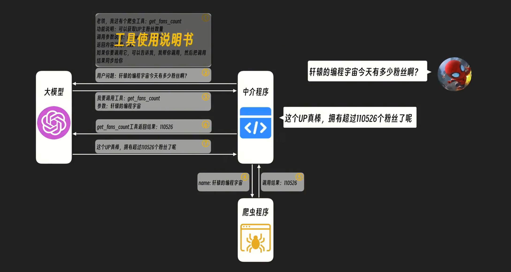

那么问题来了，这个说明书该怎么写呢？最简单的办法那就直接写在提示词里面，你可以自己定义一套格式，把这个工具的名称、功能、参数、返回值都描述清楚，并且约定好如果要调用某个工具，返回的内容应该长什么样，但几年前的时候AI遵循指令的效果并不好，你把说明书都给它了，白纸黑字的写着让它按照说明书上的方式跟你对接，但它完全可能就是不听话，实际返回乱七八糟的东西。搞得中介程序并不知道AI 想使用什么工具。

于是，OpenAI 整了个规范，把这个过程进行了标准化，工具使用说明书该放在哪里，格式是什么，如果要调用，返回给中介程序的格式又是什么等等这些都约定好。具体来说，它用一个JSON形式描述这些外部工具的信息，并且和用户输入的提示词分离，这样AI就能更清楚的知道这些工具的信息了，同时AI 返回的结果中也用专门的字段来明确指示了需要调用哪些工具，用什么样的参数去调用，这样就清楚明白多了。这就是 **Function Calling 技术**。
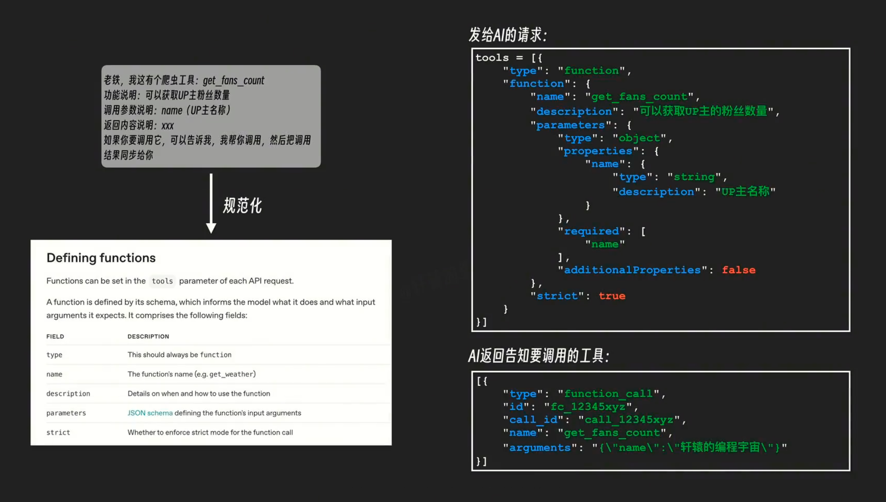

至于这个中介程序，一个典型的例子就是Dify这样的 AI 智能体开发平台，所有外部平台都可以通过HTTP 暴露接口出来，然后我们可以在Dify 上把外部工具的 API schema 配置好。Dify 就能拿着 API schema 信息转换为 Function Calling 所需的工具使用说明书格式，让 AI 调用外部的工具了。
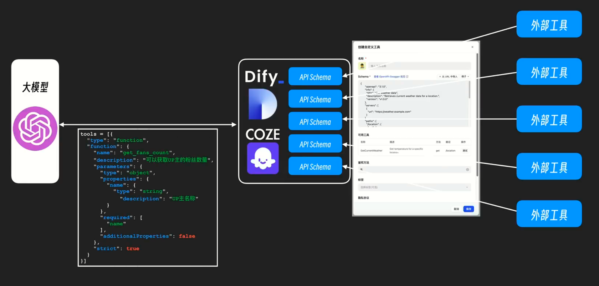

**Function Calling** 非常好用，但是有一个明显的缺点，就是这个工具使用说明书写起来是有点复杂的，对应到Dify 上，我们要为每一个外部工具都编写一个API schema 描述，非常麻烦。实际场景中，一个AI/智能体可能有几十上百个外部工具，每一个都要这样操作，而且接口一旦有变化都要更新维护，非常麻烦。另外还有一个问题就是让这些工具都要暴露接口， 安全也是一个问题。
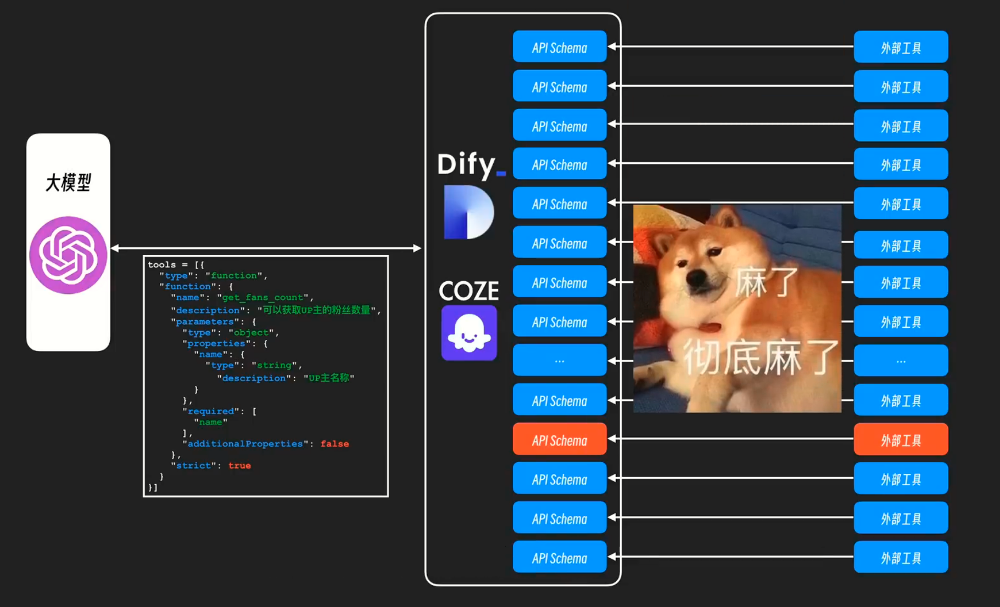

于是 **MCP（模型上下文协议）**方案出现了，既然每个工具函数都要这么描述一番很麻烦，那就封装一层。现在这些外部工具不需要直接这样通过 HTTP API 的方式暴露出来了，给你套一层壳，通过这个壳统一对外提供服务，然后中介程序再和这个壳打交道，这些工具被壳包裹之后，就成了一个个的Server,中介程序里面负责和Server打交道的这部分程序就是Client，它们之间使用的通信协议就是MCP协议（模型上下文协议），这些Server就是MCP Server，Client呢就是MCP Client，而这个容纳 MCPClient的中介程序就是MCP Host。典型的代表有Claude桌面程序、VSCode中的Cline插件等等。
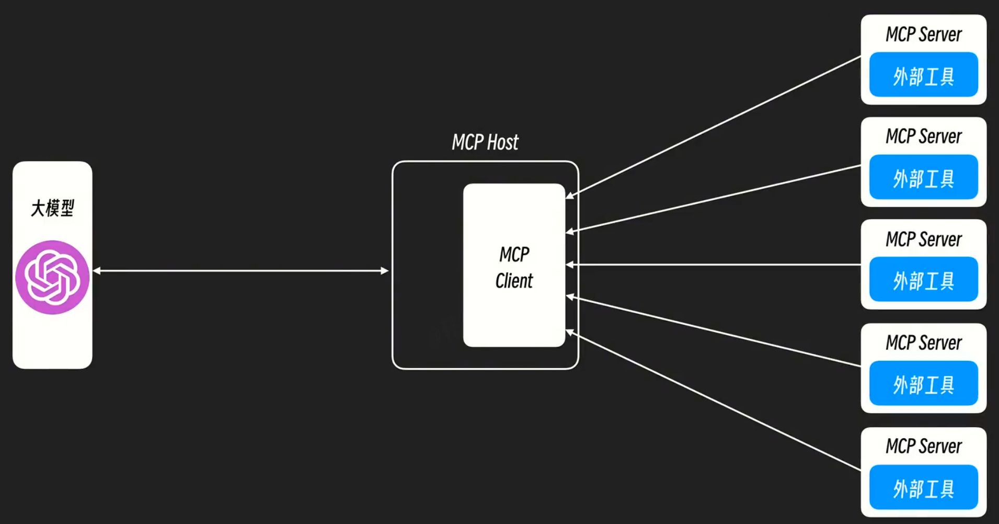

有了这个壳，现在要编写外部工具变得非常简单了，以 Python 为例，这里可以使用MCP官方的SDK可以快速开发一个外部工具出来。通过装饰器的这种编程方式，非常简洁的实现了一个工具函数。就这样，我们无需再去编写web server来暴露这个函数，也无需再编写繁琐的API schema文件去描述这个工具函数。这里面这些细节，MCP的SDK都给我们封装好了。
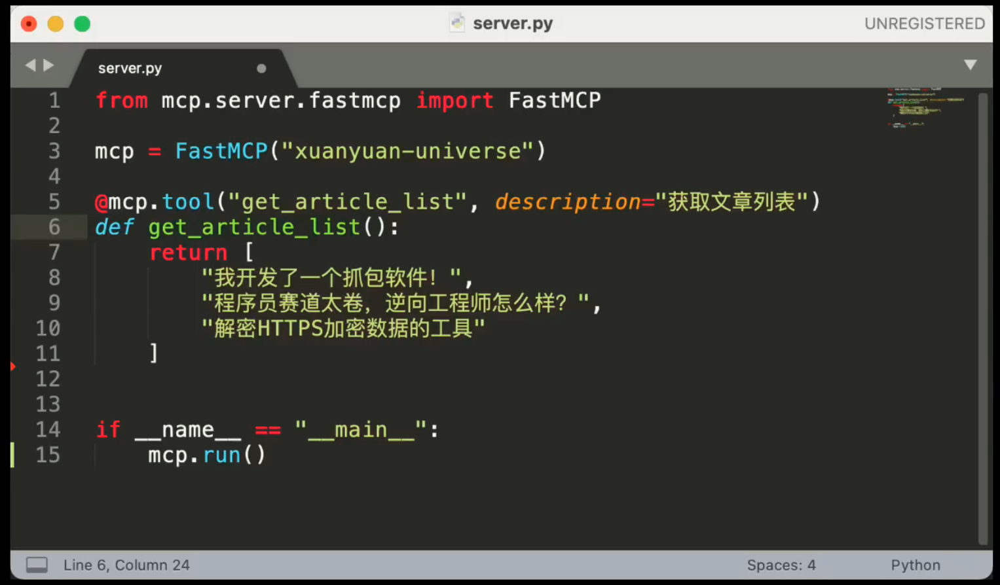

接下来我们看一下 MCP 底层是怎么工作的。要探究 MCP 这套方案的工作原理，这里涉及两块内容，第一个是MCP Client和MCP Server之间的通信，第二个是 MCP Client 与AI大模型之间的通信，把这两段链路的交互过程都搞清楚之后，就能揭开MCP神秘的面纱啦!


## MCP Client与MCP Server之间的通信

首先来看看MCP Client与MCP Server之间的通信，咱们来看官方文档怎么说。Anthropic的官方文档这里写的很详细，目前 MCP 支持两种通信方式，第一种是通过标准输入输出流来交互，在这种方式下，Server进程被Client进程创建出来作为子进程，然后通过标准输入输出交互。客户端给服务端发消息，就把数据写入到服务端进程的STDIN标准输入流中，而服务端响应的内容则通过STD0UT标准输出发出去，通过两条通路完成双工通信，这种方式适用于两者都在同一台计算机上的场景。

如果Server和Client不在同一台计算机上，那就得使用第二种方式，通过HTTP协议使用SSE的方式来进行通信，SSE是服务器发送事件的简称，我们使用 AI 那种一个字一个字往外蹦的效果就是通过SSE技术来实现的。使用SSE模式的时候，服务端这边会添加两个路由，一个用来建立持久的连接，让服务端可以随时返回数据给客户端，另一个就是客户端用来给服务端发送消息的，同样通过两条通路完成双工通信。

以上是两种通信方式，具体通信的协议内容则是基于JSON-RPC2.0来实现的。接下来我们抓包看一下它们之间的通信内容。
下面是写的一个简单的 MCP Server

```python
from mcp.server.fastmcp import FastMCP

# Create an MCP server
mcp = FastMCP("Weather Service")

# Tool implementation
@mcp.tool()
def get_weather(location: str) -> str:
    """Get the current weather for a specified location."""
    return f"Weather in {location}: Sunny, 72°F"

# Resource implementation
@mcp.resource("weather://{location}")
def weather_resource(location: str) -> str:
    """Provide weather data as a resource."""
    return f"Weather data for {location}: Sunny, 72°F"

# Prompt implementation
@mcp.prompt()
def weather_report(location: str) -> str:
    """Create a weather report prompt."""
    return f"""You are a weather reporter. Weather report for {location}?"""


# Run the server
if __name__ == "__main__":
    mcp.run(transport="sse")
```

首先通过Python 把这个程序跑起来，在 MCP SDK 这个壳的包装下，默认就会启动一个Web Server了，默认使用的端口是8000。
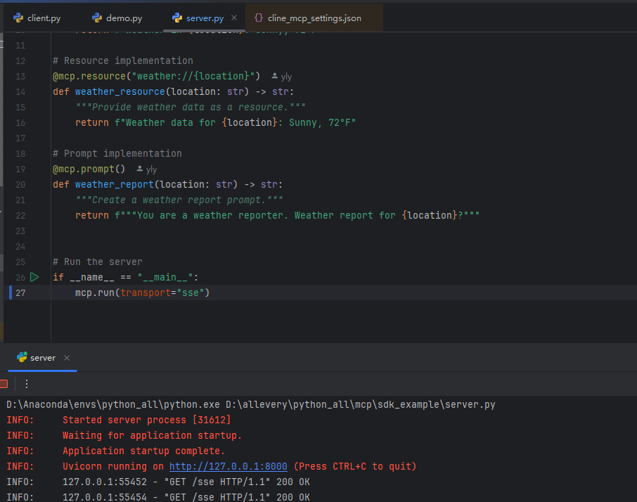

然后使用 Cline 这个插件，通过url参数指定连接本地的8000端口的MCP服务。
```json
{
  "mcpServers": {
    "Weather Service": {
      "disabled": false,
      "url": "http://localhost:8000/sse",
      "transportType": "sse"
    }
  }
}
```

提前使用抓包软件开始抓包。

然后在Cline 提问北京的天气如何？可以看到，AI 分析之后发现，需要用到Weather Service这个MCP服务里面的 get_weather 工具。

在TCP会话这里筛选一下8000端口的通信，可以看到这里有两个会话，这个HTTP会话代表的就是客户端发送消息给服务端。
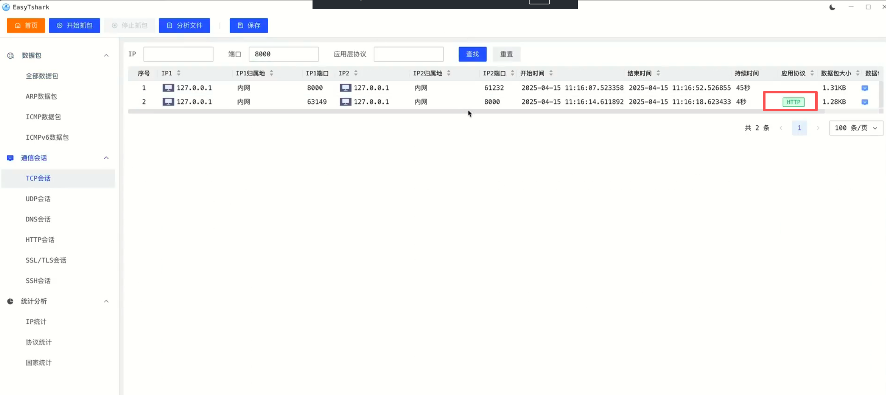


可以看下通信的数据流：
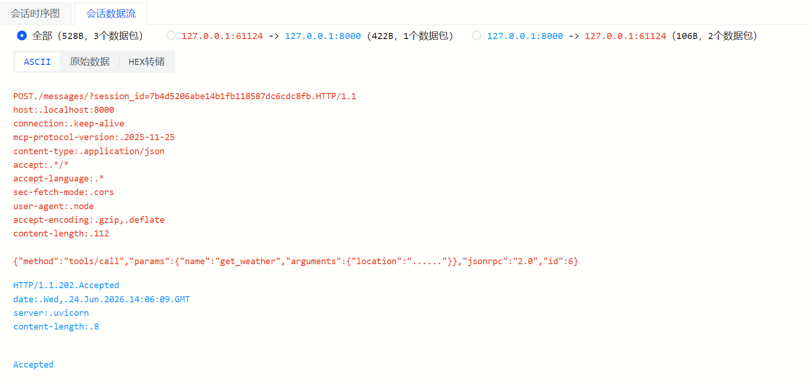

可以看到这里Client发送一个JSON过来，里面指定了调用的工具名称和参数。再看一下服务器返回的内容，在另一个会话中
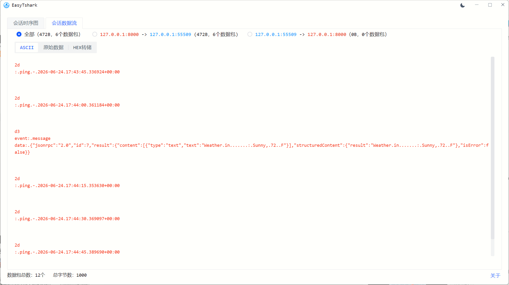

可以看到MCP server返回的正是我的这个函数中的内容。

上面这段过程只是在使用过程中的一些通信，除此之外，双方建立连接初始化的阶段也有一些通信。比如服务端会告诉客户端自己拥有哪些工具函数。

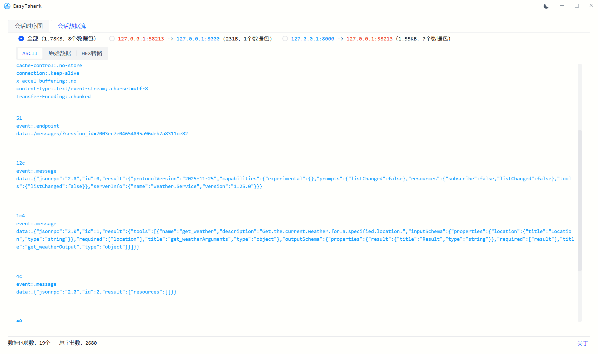


## MCP Client与AI大模型之间的通信

这一段通信使用的是HTTPS，是加了密的，为了看到内容我使用Fidler这个抓包软件做了代理。没想到这一抓让我发现了不得了的事情，前面讲Funiction Calling技术的时候提到过，中介程序把外部工具的使用说明书通过JSON的形式上传了上去,然而我在抓到的Cline插件与AI的通信数据中发现，Cline插件并没有使用Function Calling技术，而是用最开始的那种最笨的方法，把所有外部工具的详细信息直接写在了提示词里面。而且这里面还有很多cline内置的工具，整个加起来长达六万多个字符，一股脑的发给了AI。

我把这段长达六万多字符的内容做了一下格式化排版,我发现这里面有一个章节讲的是MCP服务的使用,Cine告诉A，如果你要调用MCP服务,请使用use_mcp_tool标签告诉我，并且按照下面这样的格式来指定具体调用的工具名称和参数。
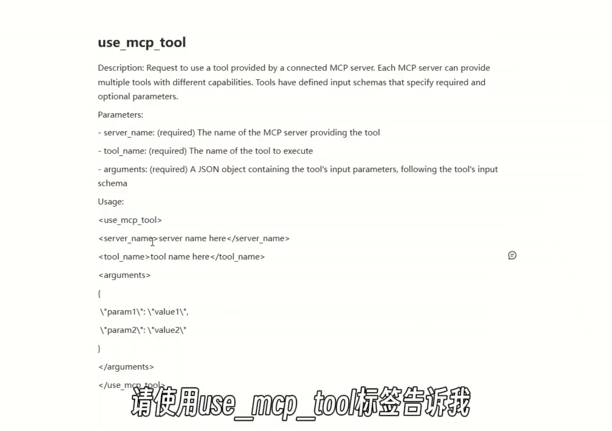

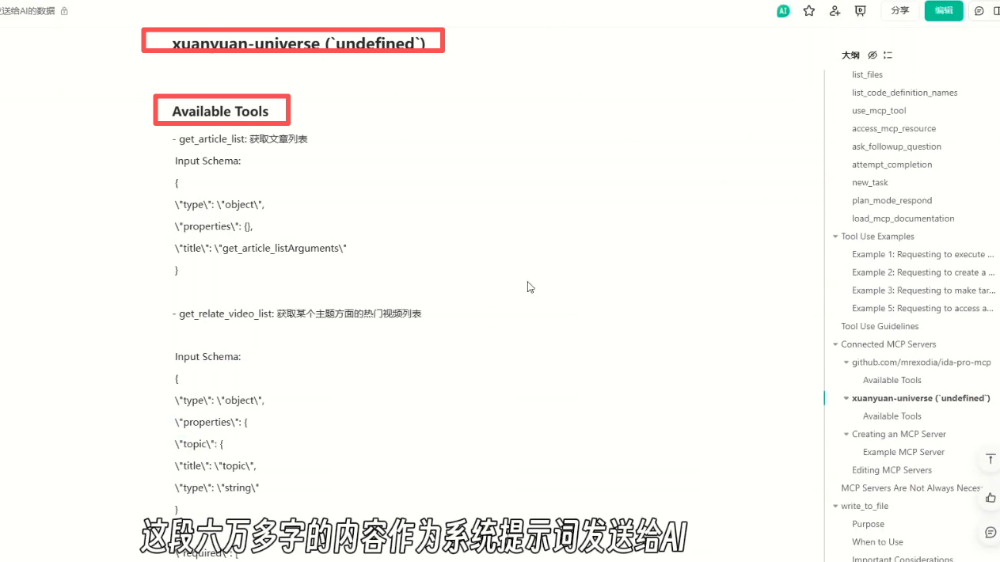

这段六万多字的肉容作为系统提示词发送给AI，至于我发给AI的问题，则在JSON中通过另一项来指定，角色设定为用户user。
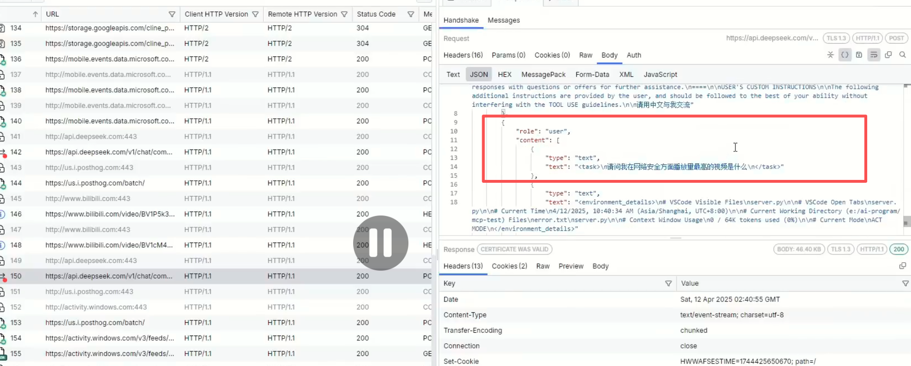

然后看看AI 返回的内容，可以看到，AI确实按照Cline上面约定的那样，使用use_mcp_tool标签指定了要调用的外部工具，包括名称、参数都写的清清楚楚。
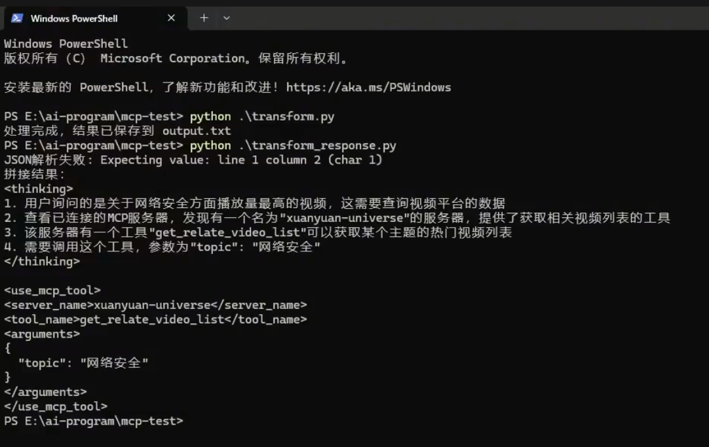

我查阅了Anthropic的官网，并没有发现MCP Client或者MCP Host如何与AI大模型之间进行通信的规定，目前来说，MCP协议只是规定了Client和Server之间的通信，至于和AI大模型之间的通信，则是更加开放灵活。直接像Cline这样塞到提示词里面也可以，还有的用Function Calling那样也可以。

用第一种方式的好处是，理论上来说任何指令遵循能力好的大模型都可以使用MCP技术。而第二种方式则对大模型有要求，必须是支持Function Calling技术的大模型才行。


## 为什么会出现 MCP

MCP（模型上下文协议） 是一个由 Anthropic 发起的开放标准协议。它的核心目标是解决 LLM 与外部数据源、工具之间的“最后一公里”连接问题。

在 mcp-sentiment 项目中，我们可以看到一个典型的 MCP Server 实现：

- 功能封装：它将 TextBlob 的情感分析能力封装成了一个标准化的接口。
- 协议暴露：通过 demo.launch(mcp_server=True)，Gradio 自动将这个函数转换为了符合 MCP 协议的服务器。
- 标准化交互：任何支持 MCP 的 Client（如 Claude Desktop、Cursor 或自研 Agent）都可以按照统一的 JSON-RPC 格式调用这个情感分析工具，而无需关心底层是用 Python 还是 Node.js 写的。

MCP 的出现是为了解决 AI 应用开发中日益严重的 “N×M 集成困境”：

1. 打破“烟囱式”集成的混乱
   - 过去：如果你有 3 个 Agent（Claude, GPT, Gemini）和 4 个数据源（GitHub, Slack, Postgres, Google Drive），你需要编写 $3 \times 4 = 12$​​ 种不同的连接器。每个厂商都在造自己的轮子。
   - 现在：通过 MCP，数据源只需开发 1 个 MCP Server，所有支持 MCP 的 Agent 都能直接连接。实现了 “一次开发，处处可用”。
2. 解耦“智能”与“上下文”
   - 痛点：LLM 本身是静态的，它不知道你的本地文件、数据库或实时业务状态。
   - 方案：MCP 将“上下文”的管理从 LLM 剥离出来，交给专门的 Server 处理。Agent 只需要通过 MCP 协议发出请求：“帮我查一下用户 X 的情感倾向”，Server 负责执行并返回结果。
3. 提升 AI Agent 的工程化落地能力
   - 在大厂实践中，MCP 允许企业将内部复杂的微服务、私有数据库快速转化为 LLM 可理解的 Tools。
   - 就像项目中的 sentiment_analysis，原本只是一个普通的 Python 函数，通过 MCP 瞬间变成了一个可以被全球 AI 助手调用的云端能力。

>MCP 是 AI 时代的 HTTP。 正如 HTTP 统一了 Web 服务的通信方式，MCP 正在统一 AI 应用与外部世界的交互方式。对于开发者而言，掌握 MCP 意味着你编写的工具可以无缝接入未来所有的 AI 生态系统中。


