过去一年，Agent 几乎成为 AI 领域最热门的话题。

各种 Demo 展示了令人惊艳的能力：

- 自动拆解任务
- 调用工具
- 编写代码
- 自主规划

**但真正进入企业生产环境后，很多 Agent 项目却停留在 Demo 阶段。**

**为什么？**

因为企业真正关心的问题不是：“模型会不会推理？”，而是：“它能不能稳定、安全、低成本地完成业务任务？”

本文结合腾讯、阿里、百度、eBay、火山引擎等公开实践，总结企业 Agent 落地必须解决的五道边界。

**本文主要讨论：**

1. 为什么 Agent Demo 很强，但企业落地困难？
2. 企业 Agent 必须建立哪五道边界？
3. MCP 为什么不是 Agent 治理终点？
4. 为什么 Agentic RL 可能成为下一阶段突破方向？

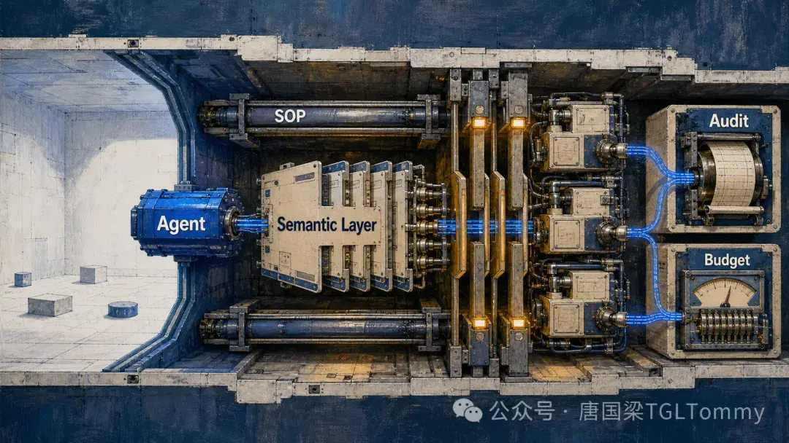

# 为什么 Agent 落不了地？ 真正瓶颈从模型能力转向系统边界

一套可上线的 Agent，通常沿着这样的主干运行：用户问题先进入意图理解与路由，再落到语义和上下文层；随后进入受控编排，由确定性系统执行；结果经过校验与审计，才变成回答或真实业务动作。

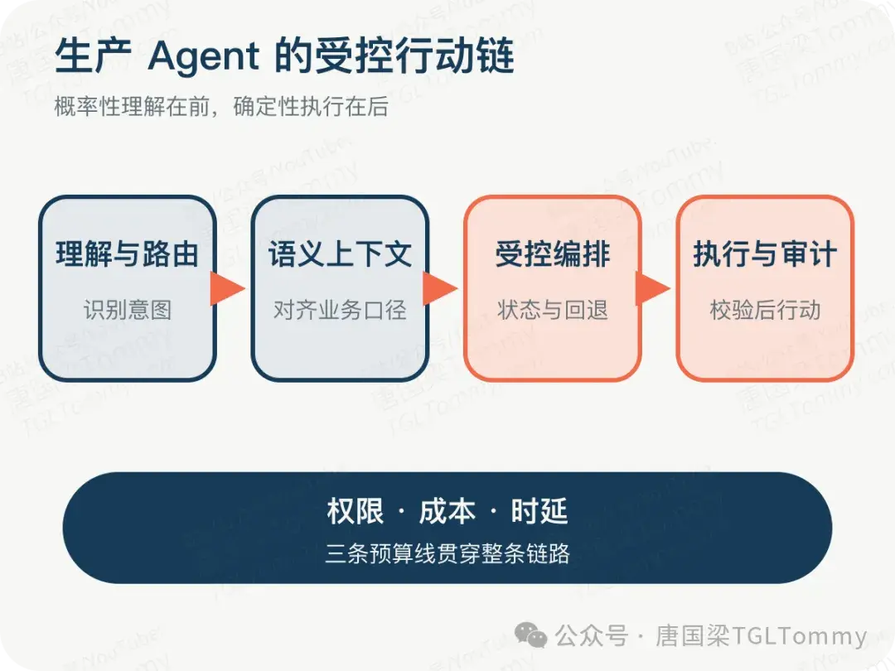

权限、成本和时延不是最后补上的监控指标，而是**从入口一直压到出口的三条预算线**。

这套架构的核心分工很清楚：模型负责概率性的理解与规划，系统负责确定性的计算、规则与控制。越靠近用户意图，模型越可以灵活；越靠近真实动作，流程越应该收紧。

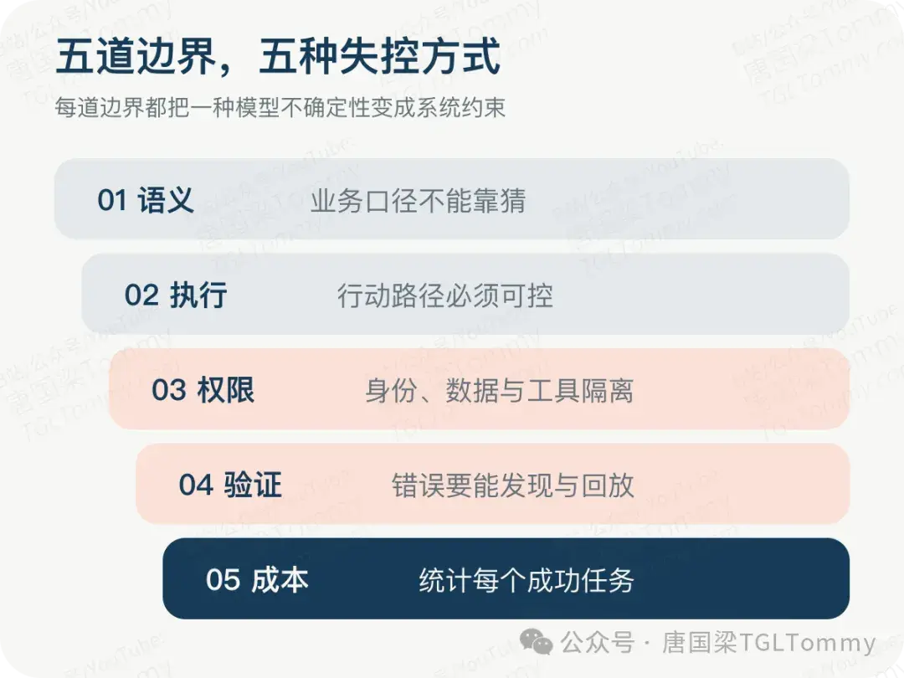

# **第一道边界：听懂人话，不等于懂业务**

用户问：“这个月销售额为什么下降？”模型认识每一个字，却未必知道销售额对应哪个指标、时间窗口如何定义、退款是否扣除、数据分布在哪些表里。

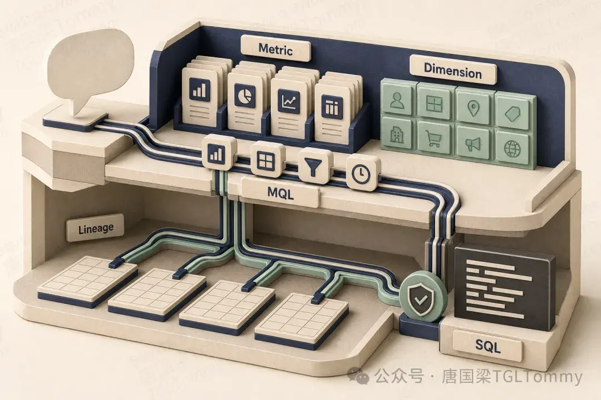

公开实践里，复杂企业级 Text-to-SQL 的开箱可用率或理想评测准确率，常落在六到七成区间。不同数字的评测口径并不相同，不能直接横向比较，但它们共同指向一个事实：**主要瓶颈往往不是 SQL 语法，而是业务语义映射。**

选错表、选错指标、选错时间口径，SQL 可以完全合法，结论却完全错误。

更稳妥的做法，是在模型与数据库之间加入**指标语义层**。以 Aloudata 的思路为例，自然语言先被翻译成指标查询语言 MQL：模型只声明指标、维度、过滤条件和时间范围，至于数据落在哪张表、如何关联、怎样聚合，由预先定义的语义与查询引擎决定。

这层拆分的价值，不是宣称自然语言理解能够百分之百正确，而是把“问题理解得对不对”和“查询执行得对不对”拆成两个可分别测试、分别追责的阶段。

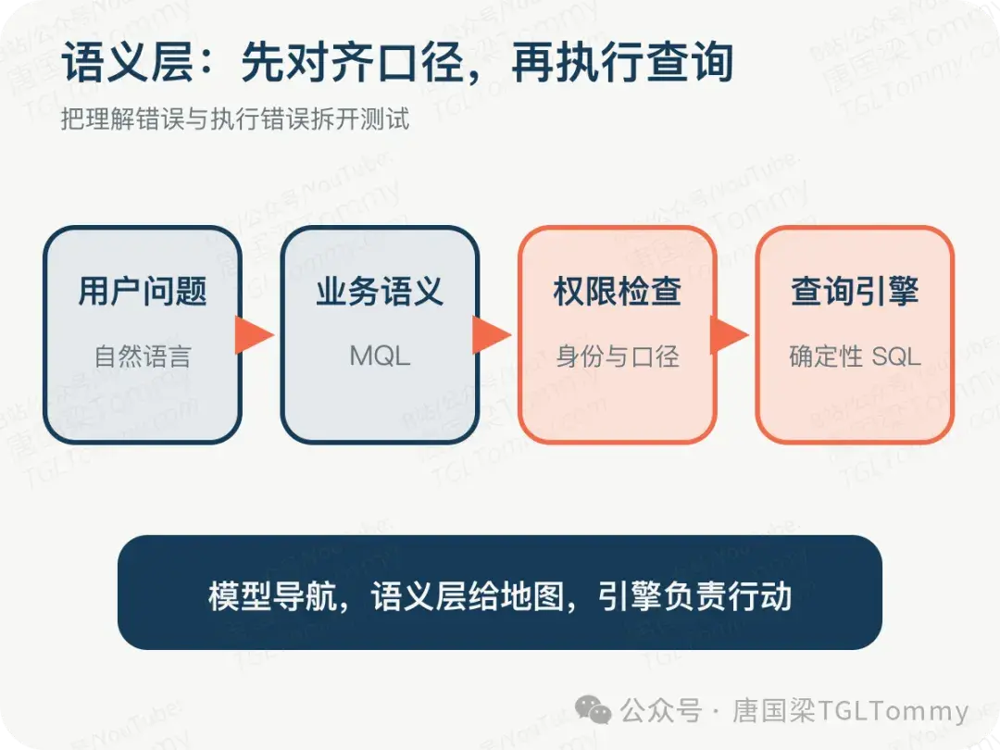

XiYan-SQL 用 Evidence、DateResolver 与 M-Schema 补充术语、时间口径和结构描述；Apache Gravitino 则把统一元数据、血缘与鉴权前移。路线不同，结论相同：**Agent 的第一步不该是写 SQL，而是确认业务语义。**

# 第二道边界：Tool Calling 很容易 可靠执行很难

Agent 越自主，搜索空间往往越大。树搜索、反思与多路径探索可以提高某些离线任务的完成率，但模型调用次数、路径长度、时延和成本也会同步增加。线上故障处理等不了几个小时，企业也承受不起每个任务都穷举答案。

eBay 的 On-call 支持系统给出了一种典型取舍：让专家维护标准作业流程 SOP，Agent 负责选择流程、补齐参数并按步骤执行；没有匹配流程时，再允许模型有限度地动态补全。执行时采用单路径推进，不遍历所有分支，以可预测的成本和时延换取可落地性。

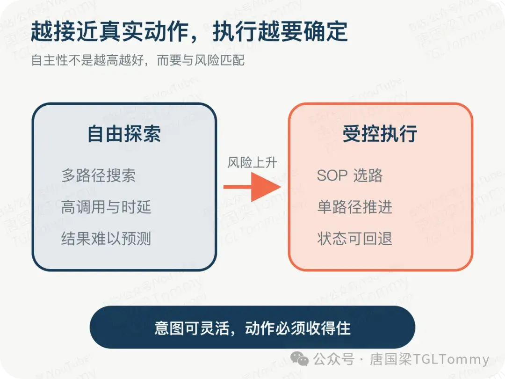

百度用显式状态图组织异常洞察，腾讯按任务阶段选择不同的搜索与执行方式，火山引擎把 Plan 和 ReAct 分开。它们都在做同一件事：**把状态、分支、超时、重试与回退从提示词里拿出来，写进可观察的编排系统。**

其中，“重新路由”尤其关键。用户可能在多轮对话里换了问题，Agent 也可能在执行中获得新证据。成熟系统要允许任务退回路由层重新分派，而不是沿着最初的误判一路走到底。

# 第三道边界：MCP 解决工具连接 但解决不了企业治理

MCP 已经能标准化工具接入与授权流程，但协议能力不等于企业治理已经落地。最终用户身份如何映射到数据权限，如何实现行列级控制、审批审计、运行隔离和资源配额，仍然需要业务系统真正实现。

腾讯内部的 MCP 实践没有直接开放公共生态，而是建立内部市场和受控运行环境：依赖从内部镜像获取，Server 在沙箱中运行，网络、文件系统与资源受到限制，软件包和访问凭证也要留痕。

真正费力的部分不是协议适配，而是**供应链安全、凭证代理、权限映射、版本兼容与审计**。

一套生产权限方案至少要回答五个问题：最终用户身份是否透传？行列与租户是否隔离？工具调用是否有预算？高风险动作是否审批留痕？输入与返回结果是否有注入防护和脱敏？

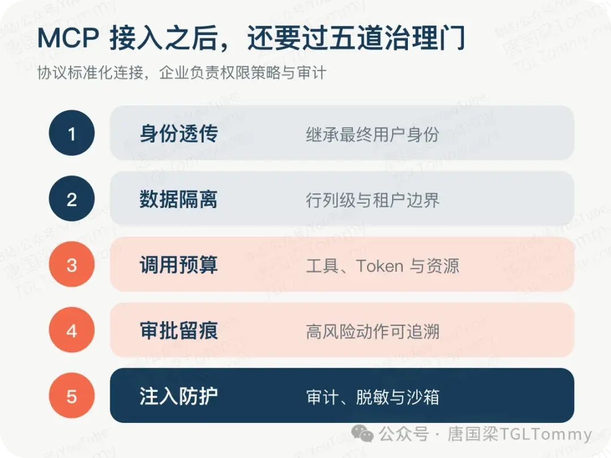

Schema 对客户端不可见，也不自动等于安全。如果服务端共用一个高权限账号，隐藏结构反而可能掩盖越权。最可靠的原则仍是：**让越权数据根本不要进入模型上下文。**

# 第四道边界：Agent 最大的问题 不是失败，而是不稳定

Agent 最危险的状态不是报错，而是给出一份结构完整、语言流畅、业务口径却完全错误的结果。

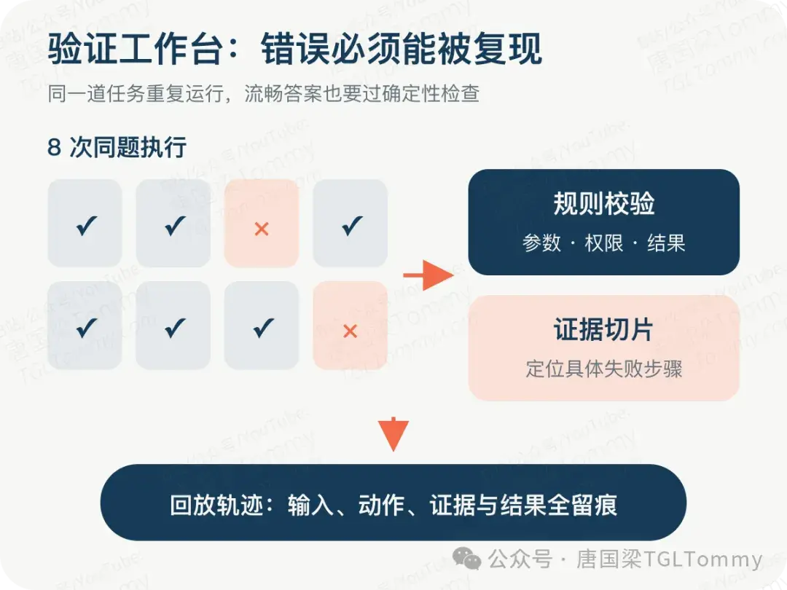

腾讯游戏公开分享引用的一组基准现象很有代表性：模型单次任务准确率可以达到约七成，但要求同一任务连续执行八次且全部正确时，比例可能降到两三成。这里衡量的是一致性，而不是多步链路误差累积。**单次跑通，替代不了稳定跑通。**

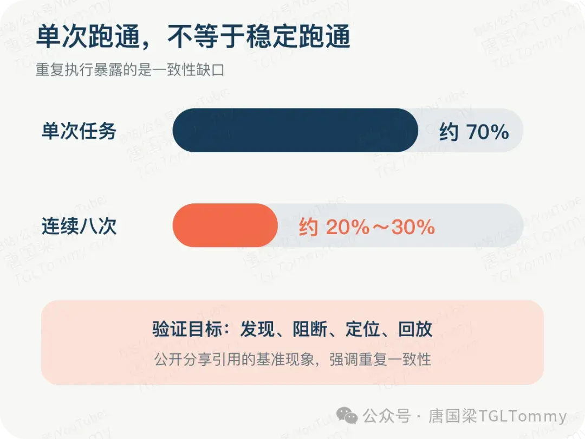

应对方式不是只加一个“验证 Agent”。如果验证者与执行者使用相近模型和相同上下文，它们可能共享同一批盲点。更可靠的方案是分层验证：工具调用前检查参数与权限，执行后用规则或算法核对结果，高风险长尾任务交给固定工作流，关键结论保留证据与回放链路。

在数据归因中，精确贡献度应该由算法引擎计算，模型负责识别分析类型、组织流程与解释结果。引擎算出“华南贡献了六成跌幅”，只能说明下滑主要发生在那里，**不能自动推出“华南导致了下滑”**。贡献度不是因果，这正是确定性计算与模型解释必须分开的地方。

验证边界真正的验收标准，不是系统有没有给答案，而是错误能否被发现、被阻断、被定位、被回放。

# **第五道边界：跑得通，不等于跑得起**

一次用户请求背后，可能包含多轮规划、检索、SQL、重排、重试和模型调用。模型单价低，并不代表完成一个真实任务的成本低。真正应该统计的是**每个成功任务的端到端成本**。

企业实践里有四类有效手段。第一，按问题深度分级，简单问题直接回答，复杂问题才进入多角度研究与假设验证。第二，用漏斗式检索先做便宜召回，再逐步缩小候选，最后才调用昂贵模型。第三，把 Schema、权限和查询能力下沉到服务端，减少客户端反复携带上下文。第四，把大规模精确计算交给数据库与计算平台，别让 Agent 把大表搬进上下文。

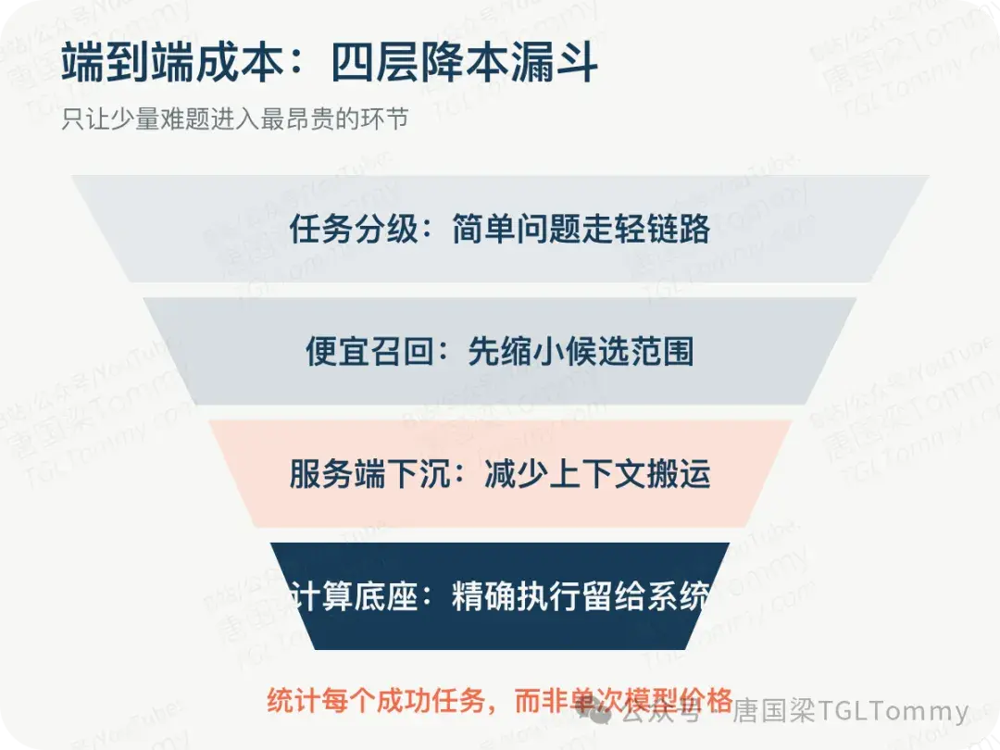

这里没有免费的午餐。XiYan-SQL 的公开实验显示，声明式 MCP 可以显著减少客户端 Token，并在特定 PostgreSQL 评测中提升准确率，但响应时间也随服务端计算增加，而且同样改造在 MySQL 上收益有限。**成本、时延、准确率与通用性必须一起看。**

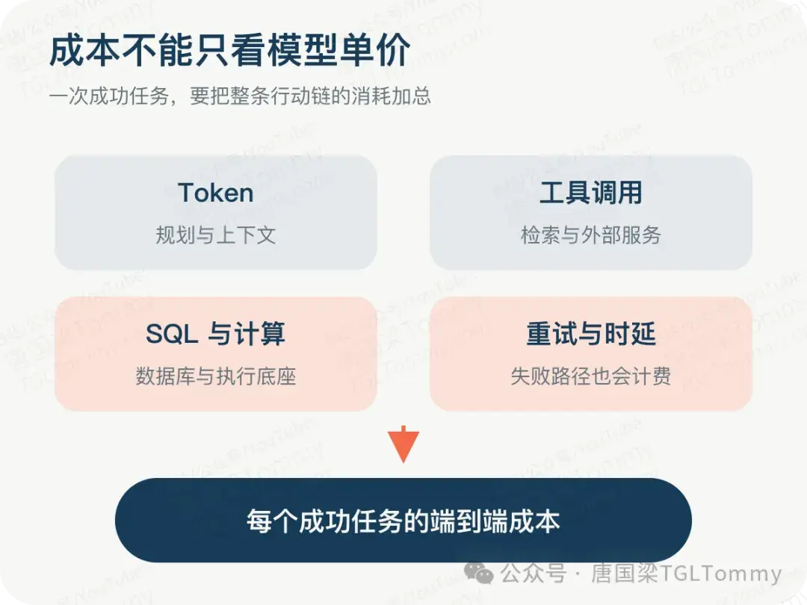

自主性每提高一级，验证范围也会扩大一级：从验证答案，到验证解释，再到验证假设、证据，最后还要判断系统是否值得主动发起这个任务。不是所有问题都应该走最重的 Agent 流程。

# 企业 Agent 上线前 必须回答的五个问题

如果你手上正好有一个 Agent 项目，可以用下面五问过一遍：

1. **语义从哪里来？** 是语义层与元数据，还是只写在提示词里？
2. **哪些步骤允许自由推理？** 哪些步骤必须固化成工作流或 SOP？
3. **工具权限继承了谁的身份？** 是最终用户，还是一个共享的高权限账号？
4. **错误如何被验证？** 能否被阻断、定位并回放？
5. **成功任务的完整成本是多少？** 是否同时统计 Token、工具调用、计算、时延与重试？

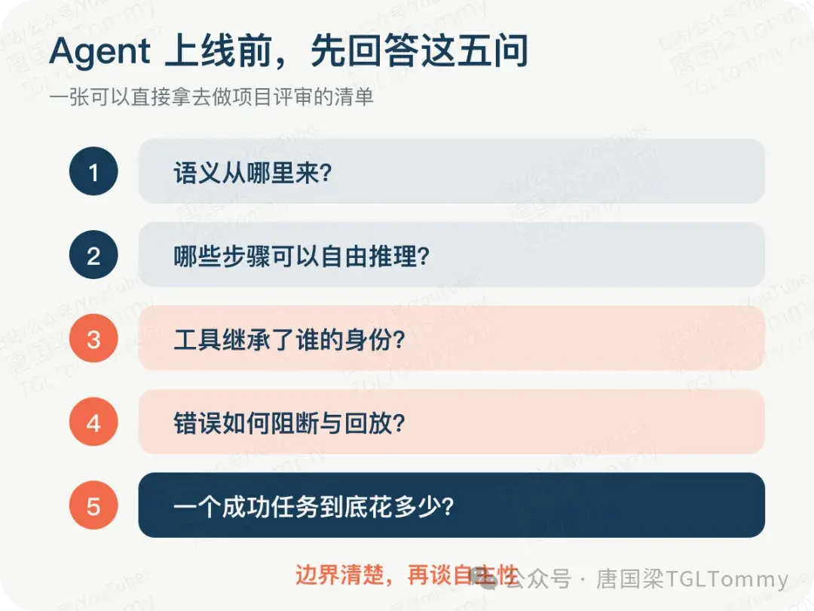

**一个成熟的 Agent，不是能做最多事情的那个，而是在明确边界里，能稳定完成正确事情的那个。**

五道边界都是在模型外部增加约束：模型不稳，就加校验；模型乱走，就用流程收住。它们能把系统送上生产，却也存在上限——校验可以拦住一次错误，却不能让模型下一次自然做对。

要继续突破稳定性上限，就需要回到模型训练本身，让它在长轨迹工具调用中学会该走哪一步、错在哪里，以及如何把最终结果的奖励分配到中间动作。这正是 Agentic RL 要处理的问题。

但在那之前，先别急着追求一个“无所不能”的 Agent。

**先把边界建好，再谈自主性。**

> 如果你正在研究 Agent 开发，可以思考： 1. 你的 Agent 有没有权限边界？ 2. 工具调用有没有审计？ 3. 错误结果能不能回放？