# 如何提升Agent的Planning能力

- Plan-and-Execute
- Task-Decoupled Planning
- Graph-based Planning
- Hierarchical Planning
- Reflexion

背景

Agent系统由多个组件构成，规划、记忆和工具使用等

> **Agent = LLM + Planning + Feedback + Tool use**

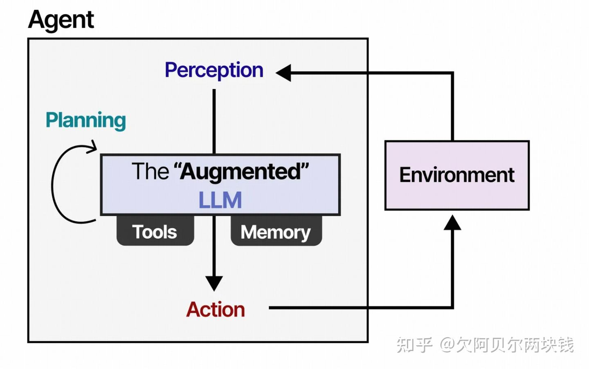

​                                                                                   *Agent组成部分*

### 什么是Agent的Planning的能力

在当前主流实践里，**Agent 的 Planning 能力是一个相对独立的模块，具有如下功能**：

- 把高层目标拆成**可执行子任务**（任务分解）
- **明确子任务的依赖关系与顺序**（依赖建模）
- **决定哪些可以并行、哪些必须串行**（调度与并行）
- **在执行出错或环境变化时触发「重规划」**（[Replanning](https://zhida.zhihu.com/search?content_id=273670737&content_type=Article&match_order=1&q=Replanning&zhida_source=entity)）

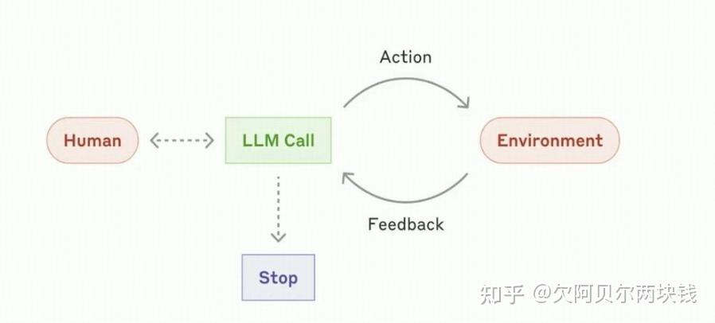

​                                                           *在执行任务中的一个*Agentic Loop过程

规划模块（[Planning Module](https://zhida.zhihu.com/search?content_id=273670737&content_type=Article&match_order=1&q=Planning+Module&zhida_source=entity)）是它们智能行为的核心，规划模块的设计理念是模拟人类的规划能力，让agent在不同的场景里可以可靠的完成任务。

### 为什么Agent的Planning很重要

LLM Agent**在执行多步骤任务时，随着步骤数增加，完成率急剧下降**——这被称为长程规划失败（[Long-horizon Planning Failure](https://zhida.zhihu.com/search?content_id=273670737&content_type=Article&match_order=1&q=Long-horizon+Planning+Failure&zhida_source=entity)）问题。简单的堆算力或者加步数也很难解决

> 实验数据 τ-bench（工具使用Agent基准）中，复杂多步任务的完成率随步骤数呈指数下降（10步以上任务完成率<20%）。

长程规划失败的根源是错误积累——**Agent在早期步骤中的小错误（选择了错误的工具、误解了部分信息）在后续步骤中被放大，最终导致整个任务失败，而没有内部执行的”检测和纠正”机制**。

## 如何提升Planning能力？主流解决方案整理

大致可以分为：**从 ReAct → Plan-and-Execute / Plan-and-Act → Task-Decoupled Planning / Graph-based**。

### 预备知识

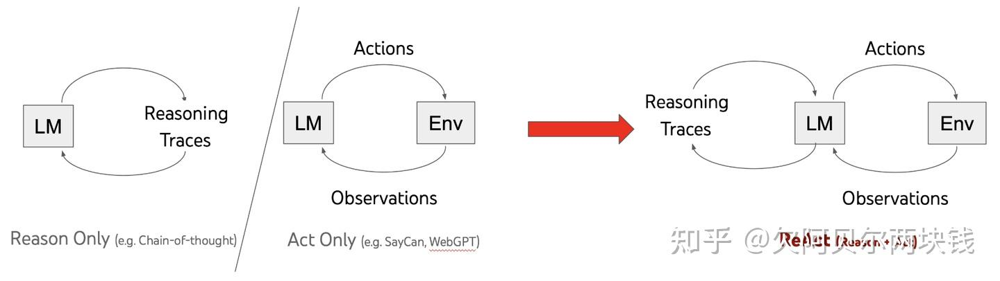

ReAct工作原理

ReAct智能体是这方面的一个典型设计，它通过**在prompt加入重复的思考、行动、观察循环**给到语言模型。 例如

```text
Thought: I should call Search() to see the current score of the game.
Act: Search("What is the current score of game X?")
Observation: The current score is 24-21
... (repeat N times)
```


#### 一个典型的 ReAct 风格agent轨迹

这利用了cot prompt来每一步做出单一动作选择。虽然这对于简单任务可能有效，但它有几个主要缺点：

- 每个工具调用都进行一次 LLM 调用。
- LLM 每次只计划一个子问题。**这可能导致不是最优的执行轨迹，因为它没有被强制要求“推理”整个任务**。

### 1.Plan-and-Execute

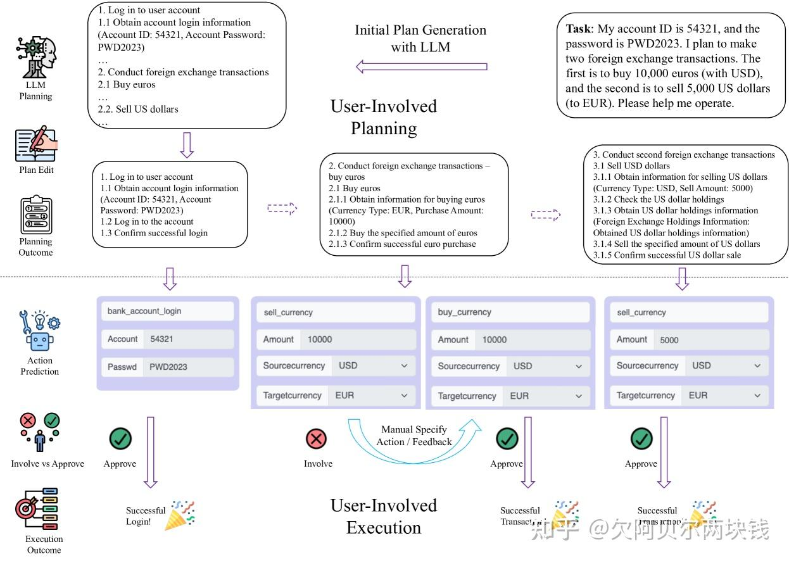

Plan-and-Execute LLM 智能体的人机协作示意图

参考 LangChain、LangGraph 的**先规划、后执行**思路，把Agent执行分成两步，规划和执行分开做，不混在一起：

- **先规划**：拿到任务后，一次性想好从头到尾所有步骤，规划好完整流程
- **再执行**：照着定好的计划一步步做，做完一步就更新当前进度
- **动态调整**：如果执行结果和计划不一样，只重新安排后面还没做的步骤就行

这种方法避免了在执行中同时进行规划、执行的可能造成的冲突，但缺点是：**现实情况一直在变，一开始定好的计划很容易过时，不得不反复修改规划，效率就变低了**

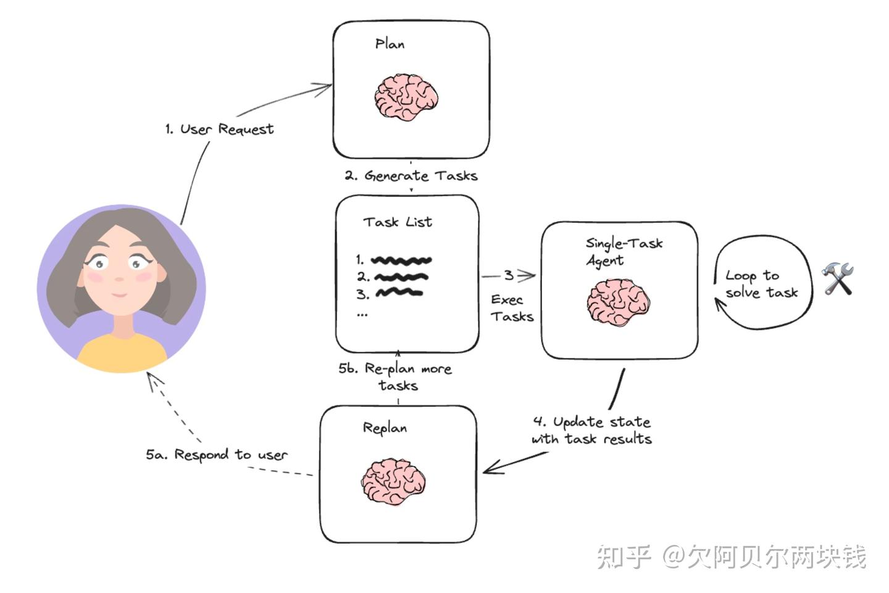

执行完成后，agent会再次被调用，并带上重新planning的提示，让它决定是直接给出回应还是生成后续计划（如果第一个planning没有达到预期效果）。这种agent设计让我们避免了每次工具调用都要调用大型规划器 LLM 的情况。它仍然受限于串行工具调用，并且每个任务都使用 LLM，因为它不支持变量赋值。

#### 具体实现

- **Planner（规划器）**
  - 输入：用户目标 + 约束 + 可用工具简介
  - 输出：**结构化计划**（而不是自然语言散文），常见格式：
    - 有编号的线性步骤列表
    - JSON 数组，每个元素含：`id`, `description`, `tool`, `deps`, `inputs`
- **Executor（执行器）**
  - 每次只执行一个 plan step：
    - 只看当前步的描述 + 相关依赖输出（例如 $E_1, E_2$）+ 工具 schema
    - 调用工具并返回结果

#### 为什么这样就能显著提升规划质量？

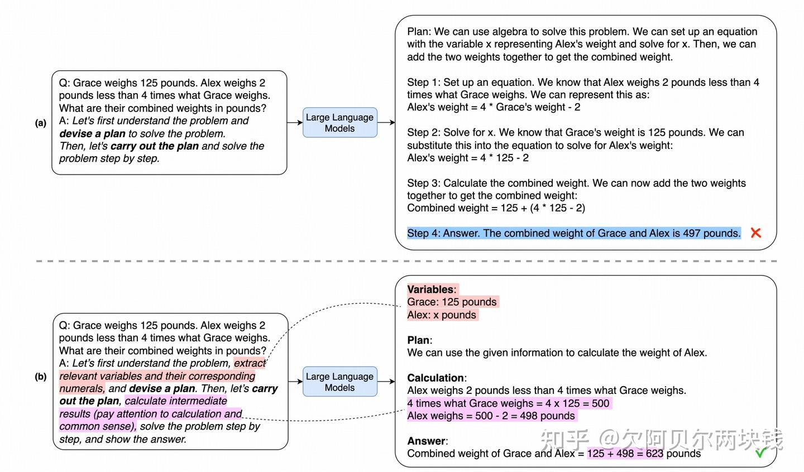

*GPT-3 的示例输入和输出，分别采用 (a) Plan-and-Solve Prompting, (b) 更详细的 Plan-and-Solve Prompting,显著提高了生成的推理过程的质量。*

- 规划在一个「干净」上下文里完成，全局视角好；
- 执行时上下文极小，**会被长上下文污染（context rot）**，稳定性更好；
- 很容易加上显式的失败检测和重试策略。

> Planner 可以选 [reasoning model](https://zhida.zhihu.com/search?content_id=273670737&content_type=Article&match_order=1&q=reasoning+model&zhida_source=entity)，Executor 用便宜一点的模型，节约token


### 2.Task-Decoupled Planning

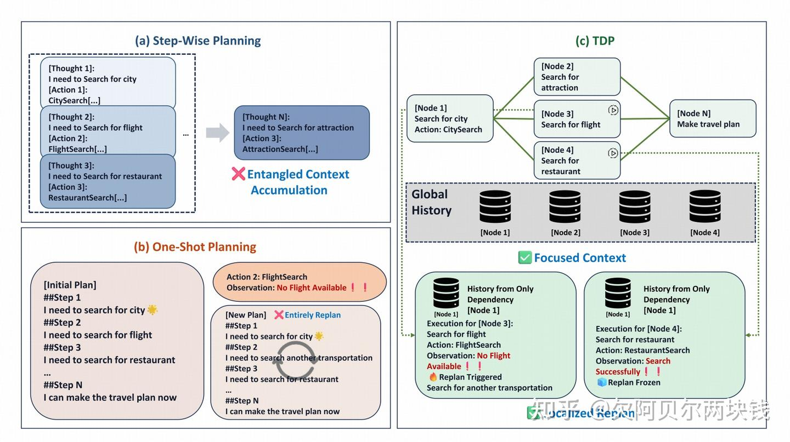

在 TravelPlanner 任务中，对分步规划 (a)、单次规划 (b) 和 TDP (c) 进行了比较。

TDP 论文提出的关键点是：**不要让一个单独的LLM 在「全局任务 + 全部历史」上做长链推理**

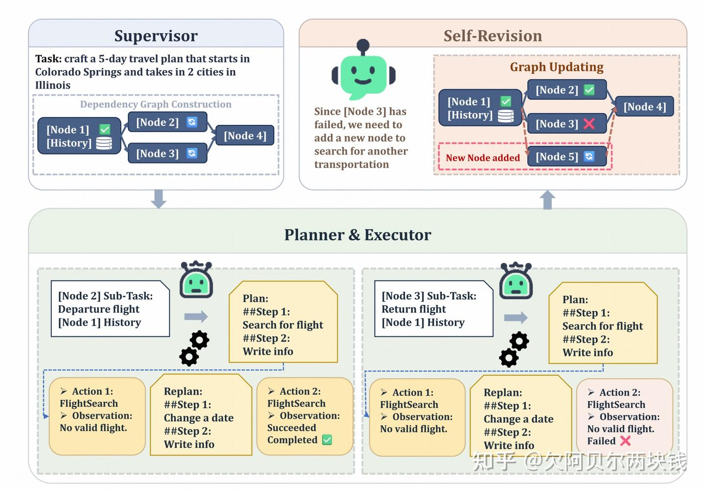

*TDP概述。主管将任务分解为依赖关系图；规划器和执行器分别求解每个解耦的子任务节点；执行完成后，自修订机制更新依赖关系图。*

#### 关键步骤

- 用一个 **Supervisor（全局监督/调度）**：
  - 把任务拆成带依赖的 DAG（有向无环图）节点；
  - **维护哪些节点已经完成，哪些就绪可执行**；
  - **按拓扑顺序调度就绪节点执行，可并行**。
- 对每个子任务节点：
  - 只给它「本节点的说明 + 前序节点输出 + 本地交互历史」；
  - 让一个本地 Planner+Executor 在**局部上下文**内做规划和执行；
  - 如果出错，只在本节点内局部重规划，不动别的节点。

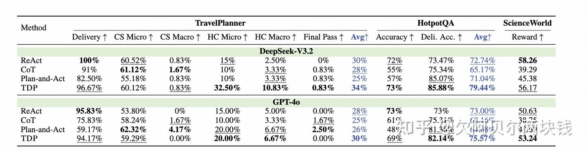

*TravelPlanner、HotpotQA 和 ScienceWorld 的主要结果。各部分中的最佳结果和次优结果分别以粗体和下划线标出。TravelPlanner 和 HotpotQA 各项指标的平均得分以蓝色突出显示。*

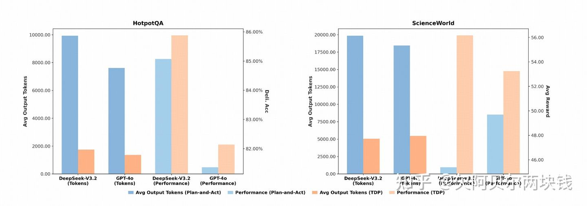

HotpotQA 和 ScienceWorld 的成本比较：平均产出代币数（左轴）和性能（右轴；交付准确率/平均奖励），Plan-and-Act 与 TDP 在 DeepSeek-V3.2 和 GPT-4o 下的对比。

> 实验证明，这种「任务解耦 + 节点局部上下文」方式，在 TravelPlanner / ScienceWorld / HotpotQA 等长任务上，**既提高成功率，又大幅节省 token**，甚至比 Plan-and-Act 少用 80% 输出 token 的同时性能更好。


### 3. 图结构 / Workflow 级规划（Graph-based Planning）

把计划明确表示为图，而非长段文字

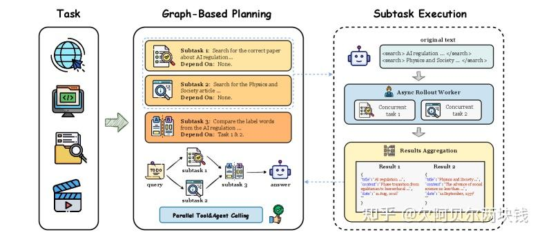

基于Graph-based Planning的图示。GAP 在规划阶段将任务分解为依赖感知的子任务，从而识别可并行化的工具操作。该系统支持并行工具和智能体调用，以提升计算效率

- 每个任务节点包含：

  - `id` / `tool` / `inputs`（可引用 `$E1` 等前序输出）
  - `deps: [id1, id2, ...]`

  

- **执行时做拓扑排序**：

  - 无依赖的节点并行跑；
  - 有依赖的等前序完成才执行；

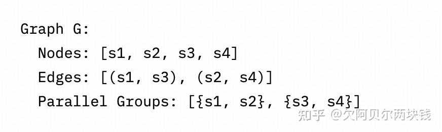

模型以结构化格式输出这个图结构，以支持下游的执行规划。

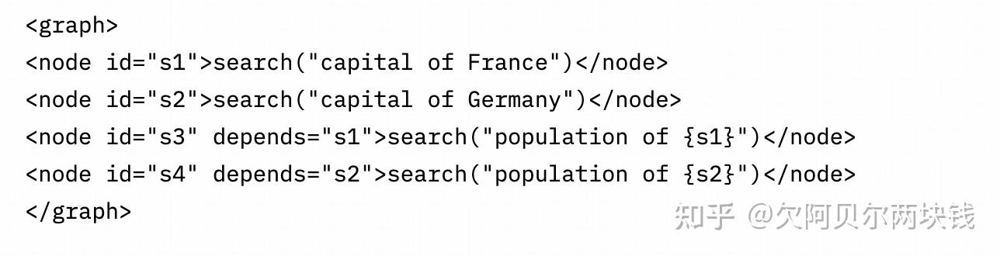

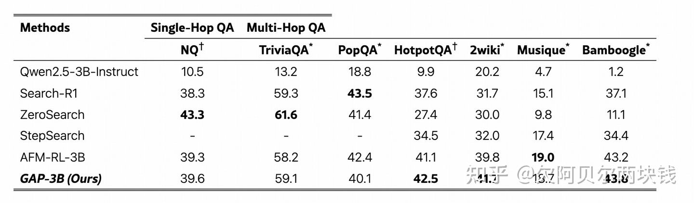

​                                           *在多个问答数据集上进行性能比较，以 Qwen2.5-3B-Instruct 作为基础模型。*

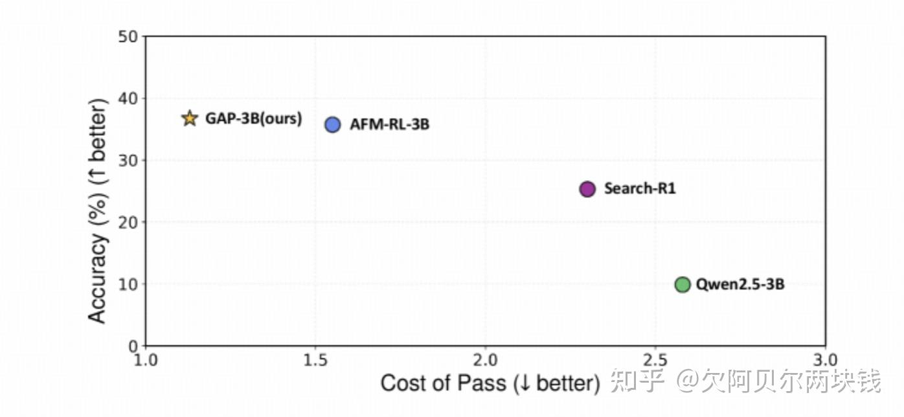

*在HotpotQA平台上对不同型号的GAP-3B进行了性能成本权衡比较。结果表明，GAP-3B在保证最高准确率的同时，成本最低，实现了最佳平衡。*

**优势**

- 自动并行，**降低整体延迟 3–4x，花费 ~1/6 token**（实测在多跳 QA 场景中类似数量级的收益）
- 调试简单：plan 和 execution 各自的 trace 清晰分离；
- 很容易插入验证、限流、审计等治理逻辑。


### 4.层次化规划（[Hierarchical Planning](https://zhida.zhihu.com/search?content_id=273670737&content_type=Article&match_order=1&q=Hierarchical+Planning&zhida_source=entity)）

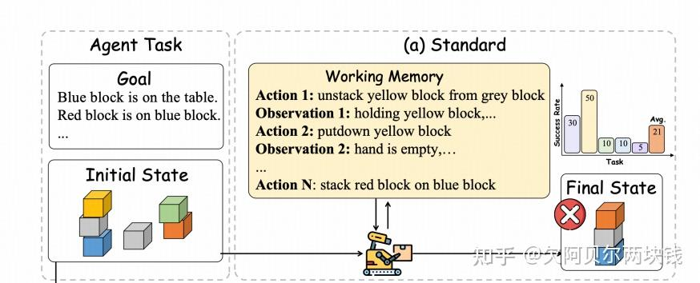

​                                                                           *基于 LLM 的智能体的生成范式*

> 层次化规划（Hierarchical Planning）采用**Planning层-Executor层**两级分层架构，实现复杂长程任务有序拆解、分步可控执行。

#### 核心架构

**1. 计划层 Planner**

- 将抽象高层目标拆解为多个清晰、可执行的子任务/子目标
- 为各子任务定义明确、可验证的完成条件
- 根据 Executor 的执行结果判断子任务是否完成，并负责后续任务的调度与必要的重新规划

**2. 执行层 Executor**

- 独立负责单个子任务的闭环执行，包括工具调用、结果处理与汇总
- 执行范围严格限定在当前子任务内
- 任务执行完成后，将执行结果及任务完成状态标准化反馈给 Planner

### 形式化表示

规划结果可以使用**有向无环图（DAG）**表示任务之间的依赖关系：

- **节点**：独立的子任务
- **有向边**：子任务之间的依赖关系
- **Executor**：负责执行 DAG 中的具体任务节点
- **Planner**：负责生成、维护 DAG，并根据任务依赖关系进行调度、状态判断和必要的重新规划


### 5. 重规划（Replanning）与自我反思（Reflexion）

#### Replanning策略

4 种常见的Replanning策略：

- **失败触发重规划**：只有当某步执行失败（报错 / 违反前置条件）时才重规划；
- **观察触发重规划**：每步执行后都允许 Planner 观察结果并调整余下计划；
- **周期性重规划**：每 N 步触发一次；
- **滑动窗口式重规划**：只对接下来 K 步做承诺，到边界再整体重规划。

#### Reflexion

而反思（[Reflection Pattern](https://zhida.zhihu.com/search?content_id=273670737&content_type=Article&match_order=1&q=Reflection+Pattern&zhida_source=entity) / Reflexion）则是另一层能力：**让 Agent 学会反思并修正自己的规划行为**：

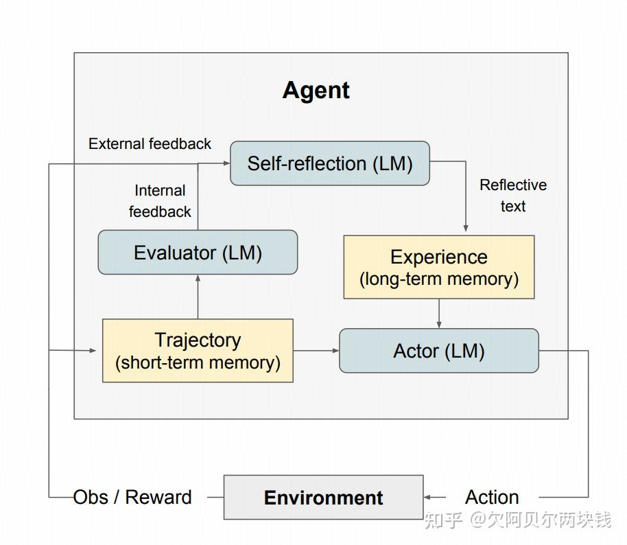

Reflexion 过程，通过让Agent在失败后进行反思（verbal reflection）来改善下一次尝试

- **执行者（Actor）**：依据环境状态观测输出推理内容与执行动作，与环境交互后获取反馈观测，逐步构建完整任务轨迹。

> **采用CoT、ReAct等经典推理架构，并搭配独立记忆模块补充上下文信息，辅助长流程决策**。

- **评估模块（Evaluator）**：**对行动主体的全过程轨迹（短期交互记忆）进行质量评判，输出对应奖励分值**。

> 针对不同类型任务，自适应**选用LLM语义评分、规则启发式奖励**等多样化奖励计算方式。

- **自我反思（Self-Reflection）**：由大模型承担全局复盘优化角色，**结合奖励信号、当前任务轨迹与长期历史记忆，生成指导性语言优化反馈，存入智能体持久记忆库**。

> 智能体根据过往经验沉淀持续迭代决策能力，不断提升后续任务表现。

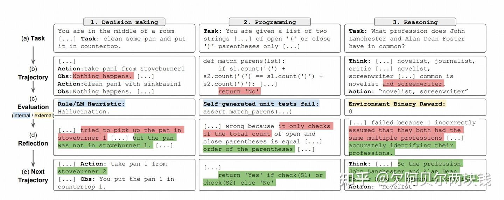

自我反思的智能体学习迭代优化其行为来解决决策、编程和推理等各种人物的例子。自我反思（Refelxion）通过引入自我评估、自我反思和记忆组件来拓展 ReAct 框架

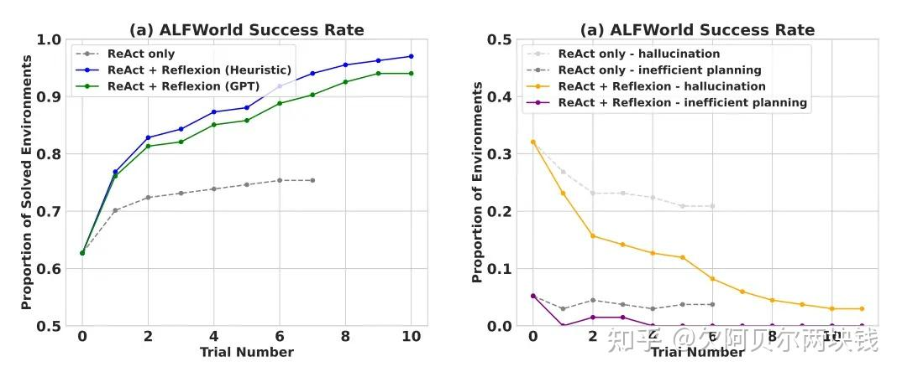

自我反思能够显著提高 AlfWorld 上的决策任务、HotPotQA 中的问题推理以及在 HumanEval 上的 Python 编程任务性能。在序列决策 (AlfWorld) 任务上进行评估时，ReAct + Reflexion 用启发式和 GPT 的自我评估进行二元分类，完成了 130/134 项任务，显着优于 ReAct

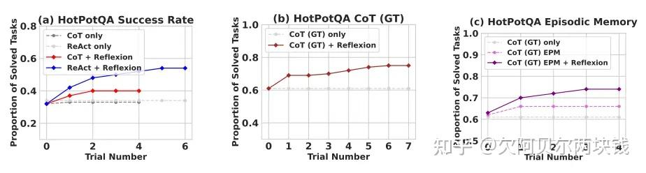

自我反思显著优于所有基线方法。仅对于推理以及添加由最近轨迹组成的情景记忆时，Reflexion + CoT 的性能分别优于仅 CoT 和具有情景记忆的 CoT

#### 什么时候可以用

- 智能体需要从尝试和错误中学习
- 需要很强的可解释性和记忆功能
- 序列决策、深度推理、coding场景

## 如何评估Planning真的变好了

不要只看任务是否完成，而要引入专门的 planning 指标和评估方法

### 1. 典型指标

- **Plan Quality（计划质量）**
  - 步骤是否完整覆盖目标（召回）
  - 是否存在逻辑矛盾 / 顺序错误 / 不可达分支
  - 平均步骤长度、冗余操作比率；
- **Plan Adherence（计划遵循度）**
  - Executor 实际执行的步骤序列，与计划差异有多大
  - 有多少跳步 / 回退 / 无计划动作
- **Step Efficiency（步效率）**
  - 完成同一任务所需步骤数 vs 最优/基线；
- **Cost & Latency**
  - 规划阶段 token / 时间 / 调用次数；
  - 整体流水线的吞吐与延迟。

### 2. 基准任务与对比

- 选一组代表性任务（Web 导航、报表生成、排程、代码修改等）；
- 对比以下架构：
  - ReAct（无显式规划）
  - 一层 Plan-and-Execute
  - Task-Decoupled / DAG / 多 Agent 版本
- 评估同一批任务上的：
  - 成功率
  - 平均步骤数
  - token 消耗
  - 人工介入率、回退率

### References

[1] The Agent Planning Module: A Hidden Architectural Seam. [https://tianpan.co/blog/2026-04-09-agent-planning-module-hidden-architectural-seam](https://link.zhihu.com/?target=https%3A//tianpan.co/blog/2026-04-09-agent-planning-module-hidden-architectural-seam)
[2] Beyond Entangled Planning: Task-Decoupled Planning for Long-Horizon Agents. [https://arxiv.org/html/2601.07577v1](https://link.zhihu.com/?target=https%3A//arxiv.org/html/2601.07577v1)
[3] Plan-and-Act: Improving Planning of Agents for Long-Horizon Tasks. [https://openreview.net/forum?id=ybA4EcMmUZ](https://link.zhihu.com/?target=https%3A//openreview.net/forum%3Fid%3DybA4EcMmUZ)
[4] MagicAgent: Towards Generalized Agent Planning. [https://arxiv.org/html/2602.19000v1](https://link.zhihu.com/?target=https%3A//arxiv.org/html/2602.19000v1)
[5] Experiential Reflective Learning for Self-Improving LLM Agents. [https://arxiv.org/html/2603.24639v1](https://link.zhihu.com/?target=https%3A//arxiv.org/html/2603.24639v1)
[6] Agentic AI Reflection Pattern Explained. [https://www.tungstenautomation.com/learn/blog/the-agentic-ai-reflection-pattern](https://link.zhihu.com/?target=https%3A//www.tungstenautomation.com/learn/blog/the-agentic-ai-reflection-pattern)
[7] LangChain Deep Agents: A Structured Runtime for Planning, Memory, and Context Isolation in Multi-Step AI Agents. [https://www.marktechpost.com/2026/03/15/langchain-releases-deep-agents-a-structured-runtime-for-planning-memory-and-context-isolation-in-multi-step-ai-agents/](https://link.zhihu.com/?target=https%3A//www.marktechpost.com/2026/03/15/langchain-releases-deep-agents-a-structured-runtime-for-planning-memory-and-context-isolation-in-multi-step-ai-agents/)
[8] Best LLM Evaluation Tools for AI Agents in 2026. [https://www.confident-ai.com/knowledge-base/compare/best-llm-evaluation-tools-for-ai-agents](https://link.zhihu.com/?target=https%3A//www.confident-ai.com/knowledge-base/compare/best-llm-evaluation-tools-for-ai-agents)
[9] Agent Evaluation Framework 2026: Metrics, Rubrics & Benchmarks. [Agent Evaluation Framework 2026: Metrics, Rubrics & Benchmarks | Galileo](https://link.zhihu.com/?target=https%3A//galileo.ai/blog/agent-evaluation-framework-metrics-rubrics-benchmarks)
[10] Bridging LLM Planning Agents and Formal Methods: A Case Study in Plan Verification. [Just a moment...](https://link.zhihu.com/?target=https%3A//dl.acm.org/doi/10.1109/ASEW67777.2025.00018)


