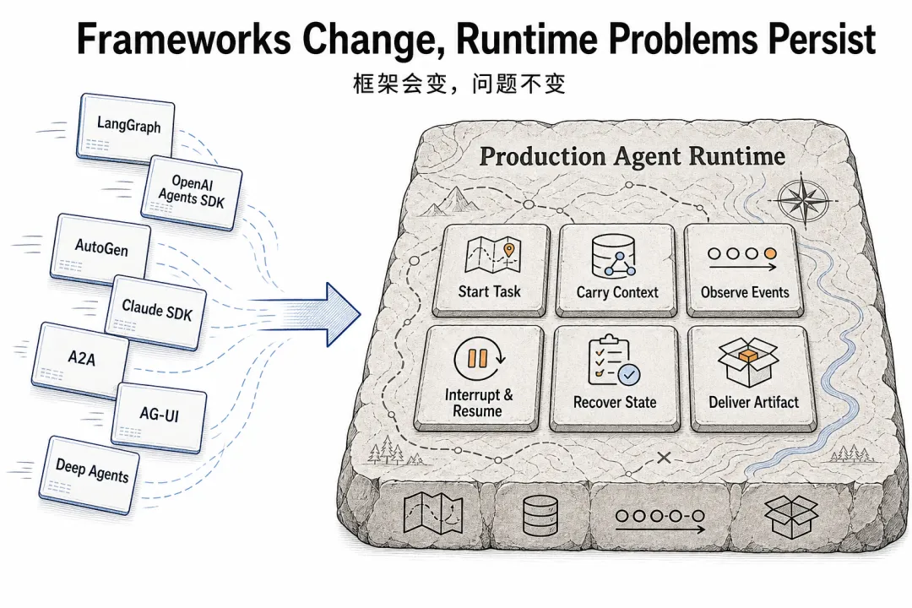

# 相比层出不穷的 Agent 框架，不变的 Agent Protocol 是什么

Agent 框架层出不穷，到底哪个值得长期投入？

LangGraph 讲`Checkpoint`，OpenAI 讲`Thread`和`Run`，A2A讲`Task`，AG-UI 讲`Event`，Deep Agents 又引入`Todo`、`Subagent`和`Virtual Filesystem`。名字越来越多，API 越来越像一套套独立世界观。

**框架名词在变，但底层问题始终围绕任务、上下文、步骤、事件、状态和产物展开。** *如果把这些名词往下拆，会发现它们其实都在回答同一个底层问题：*

**一个 Agent 任务，如何被启动、携带上下文、持续观测、中断恢复，以足够低的使用成本完成执行，并最终产生产物？**

换成协议视角，这个问题可以说得更直接：

**一个生产级 Agent Protocol 应该包括什么？为什么这些协议对象会比具体框架 API 更稳定？**

我不想每换一个 Agent 框架，就重新学习一套对象体系。我更关心的是，那些跨框架反复出现的稳定边界是什么。

框架会更迭，协议对象会换名字，但生产级 Agent 系统要解决的问题不会消失：

本文的目标不是介绍某一个框架怎么用，而是以 ***\*Agent Protocol\**** 为主线，把 Agent Runtime 拆成一组可协议化的对象、操作和状态机。

