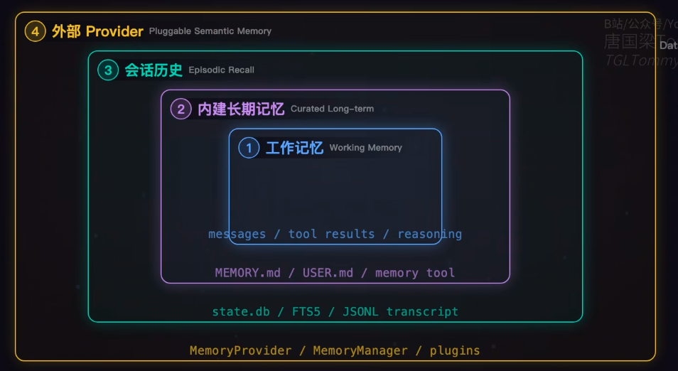

**You:**

Pluggable Semantic Memory 翻译一下

* * *

**ChatGPT:**

**Pluggable Semantic Memory** 可以翻译为：

> **可插拔语义记忆**

拆开理解：

* **Pluggable**：可插拔的、可插接的 → 强调可以灵活替换、接入不同的实现
* **Semantic**：语义的
* **Memory**：记忆

在 **AI Agent / 大模型** 语境下，更自然的理解是：

> **可插拔的语义记忆模块**

也就是：**Agent 的记忆能力可以作为独立模块接入或替换**，例如可以接入不同的向量数据库、RAG、知识库或长期记忆机制，而不需要修改 Agent 核心逻辑。

如果是放在**技术架构图/PPT**里，我更推荐写成 **「可插拔语义记忆」**。

* * *

**You:**



那你解释一下这四层

* * *

**ChatGPT:**

这张图其实是在讲 **Agent 的“记忆系统”分成 4 个层级**。从里到外，可以理解成：**当前正在想什么 → 长期记住什么 → 过去发生过什么 → 还可以接入外部记忆系统**。

### ① 工作记忆 Working Memory

这是**当前这一轮任务正在使用的临时记忆**。

图里写的是：

> `messages / tool results / reasoning`

也就是 Agent 当前执行任务时会产生的：

* 用户消息
* AI 历史消息
* Tool 调用结果
* 当前推理过程中的信息
* 当前任务的中间状态

例如你问 Agent：

> “帮我分析一下这个项目的技术架构。”

Agent 当前上下文里可能有：

```
用户问题
↓
已经读取的项目文档
↓
调用工具得到的结果
↓
当前分析结论
↓
下一步准备调用什么工具
```

这些都属于 **Working Memory**。

**特点：临时、短期、服务于当前任务。**

可以简单理解成：

> **“我现在脑子里正在想的东西。”**

---

### ② 内建长期记忆 Curated Long-term

这一层比工作记忆更持久。

图中举的例子：

> `MEMORY.md / USER.md / memory tool`

它保存的是经过**筛选、整理后值得长期记住的信息**。

比如：

```
用户喜欢简洁的技术解释
用户项目使用 Kafka
用户的智能体项目涉及 RAG
用户经常需要润色技术文档
```

这些信息没有必要每次都从头推导，但以后可能反复使用，所以可以保存下来。

这里的关键词是 **Curated（精选/整理过的）**。

也就是说，不是什么都记，而是：

```
当前对话
   ↓
判断哪些信息值得长期保留
   ↓
整理
   ↓
长期记忆
```

所以它和第一层最大的区别是：

|  | 工作记忆 | 内建长期记忆 |
| --- | --- | --- |
| 时间 | 当前任务 | 跨任务、跨会话 |
| 内容 | 当前上下文 | 稳定、重要的信息 |
| 例子 | 当前消息、Tool结果 | 用户偏好、项目背景 |
| 类比 | 脑子里正在想 | 脑子里长期记住的事情 |

---

### ③ 会话历史 Episodic Recall

这一层叫 **Episodic Recall**，可以理解成：

> **“我以前经历过什么。”**

图中：

> `state.db / FTS / JSONL transcript`

这里保存的是**过去发生过的完整事件/对话记录**。

例如：

```
8月20日：
用户问过 Kafka 消费能力

8月21日：
用户讨论过相机方位角

8月22日：
用户讨论过 Nginx → 甘肃级联网关

8月25日：
用户又回来继续讨论 Agent Memory
```

它和第二层的区别非常重要。

**第二层是“提炼出来的结论”，第三层是“原始经历”。**

例如：

> 第②层：  
> “用户的项目使用 Kafka，并且比较关注 Kafka 消费性能。”

而第③层可能保存：

> “8月19日用户曾问：当前 Kafka 每秒大约能处理多少条消息？是否可以增加并发消费线程？”

所以：

**② = 记住“是什么”**  
**③ = 记住“发生过什么”**

---

### ④ 外部 Provider Pluggable Semantic Memory

最外面这一层就是你刚才问的：

> **Pluggable Semantic Memory = 可插拔语义记忆**

它和前面三层最大的不同是：

**它不是固定的一套记忆，而是允许 Agent 接入外部的记忆系统。**

比如可以接：

```
Agent
  ↓
MemoryProvider
  ↓
┌─────────────────┐
│ 向量数据库       │
│ RAG             │
│ Elasticsearch   │
│ 知识库           │
│ 第三方 Memory    │
└─────────────────┘
```

这里的 **Semantic Memory（语义记忆）** 更强调：

> **按照“语义相关性”去找过去有用的信息。**

例如现在用户问：

> “我们之前 Kafka 消费能力的问题怎么解决的？”

系统不一定需要精确搜索“Kafka”三个字，而是可以通过语义检索找到：

> “增加 Kafka Consumer 并发度，同时可以降低单路算法调用频率。”

这就是语义记忆发挥作用的地方。

而 **Pluggable** 的意思就是：

> Agent 不把这个记忆系统写死，可以换。

例如：

```
MemoryProvider
      ↓
 ┌────┼───────────┐
 ↓    ↓           ↓
RAG  向量DB    Elasticsearch
```

---

## 四层放在一起就很好理解了

可以把它想成一个人的记忆：

```
④ 外部 Provider
   ↓
“我还可以接入一个外部知识/记忆系统”
   
③ 会话历史
   ↓
“我以前经历过什么？”

② 内建长期记忆
   ↓
“有哪些重要的事情值得长期记住？”

① 工作记忆
   ↓
“我现在正在处理什么？”
```

### 用一个具体例子

假设你让 Agent：

> **“继续帮我分析之前那个 Kafka 消费能力不足的问题。”**

它可能这样工作：

**① 工作记忆**

当前对话里知道：

> 用户现在问 Kafka 消费问题。

**② 长期记忆**

找到已经整理好的信息：

> 这个项目使用 Kafka，曾经出现过消费能力不足的问题。

**③ 会话历史**

进一步回忆以前具体发生过什么：

> 之前讨论过“增加消费线程/消费者实例”和“降低单路算法调用频率”。

**④ 外部语义记忆**

如果内建记忆里没有足够信息，就去外部 RAG / 向量库中检索：

> Kafka 消费端并发模型、Consumer Group、分区数等相关知识。

然后把这些信息重新放回：

```
① Working Memory
       ↓
    LLM / Agent
       ↓
   得出最终答案
```

---

### 最关键的一点

这张图**不是说“四个数据库”**，而是在划分**四种记忆职责**：

> **① Working Memory：当前任务的上下文**  
> **② Curated Long-term：提炼后长期保存的重要信息**  
> **③ Episodic Recall：过去完整的对话/事件经历**  
> **④ Pluggable Semantic Memory：可接入外部系统的语义检索记忆**

而且它们是**嵌套关系**，不是简单的四个并列模块。

你可以把整张图浓缩成一句话：

> **Agent 先记住“现在在干什么”，再记住“长期重要的信息”，能够回忆“过去发生过什么”，同时还可以通过可插拔的外部 Provider 获取更广泛的语义记忆。**