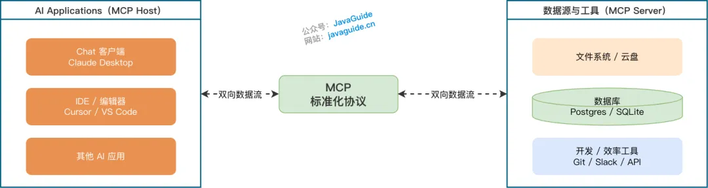
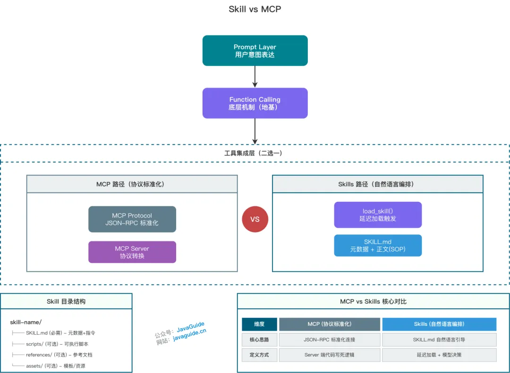
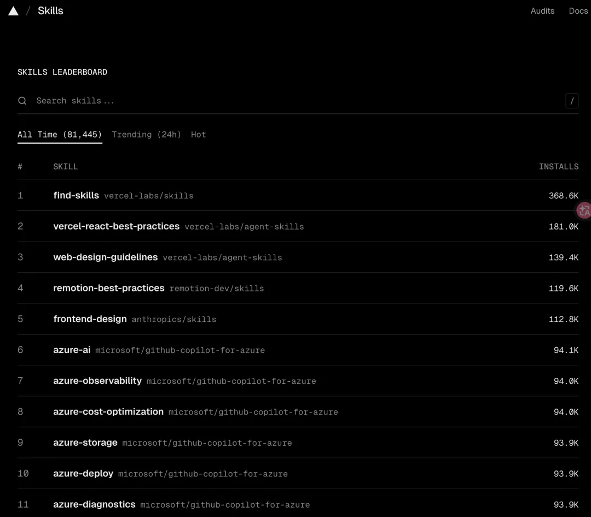
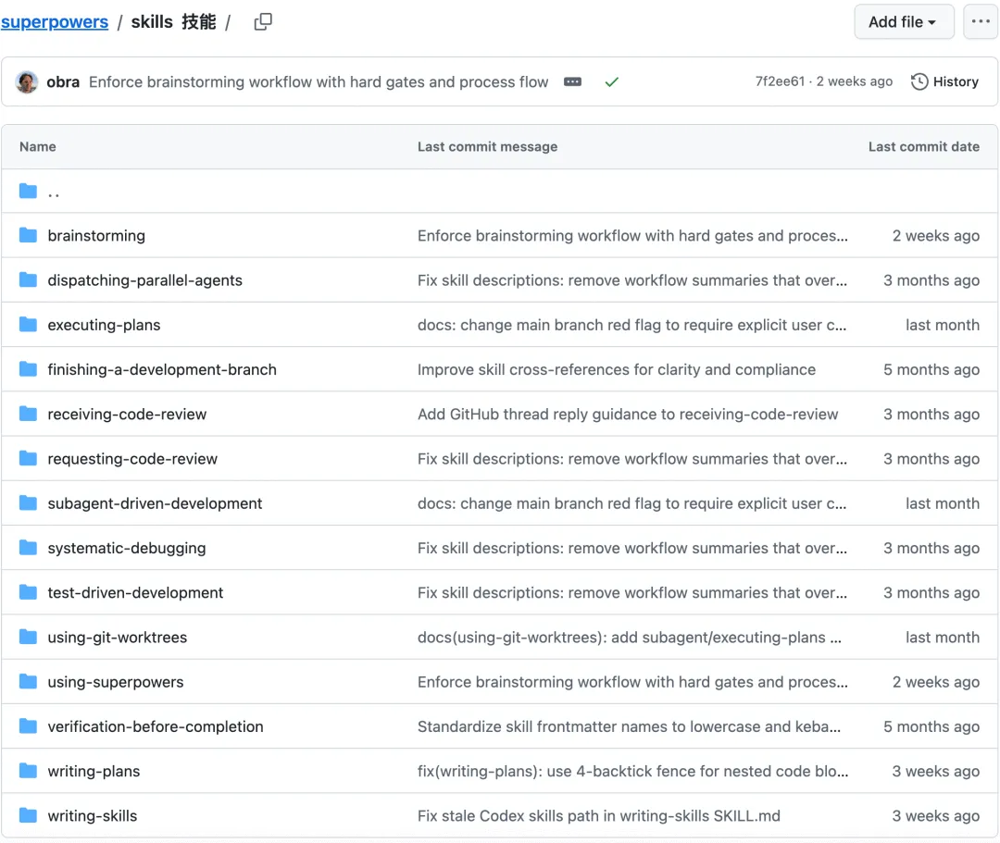
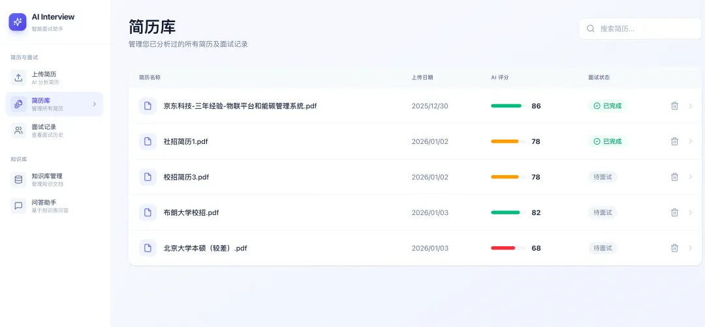
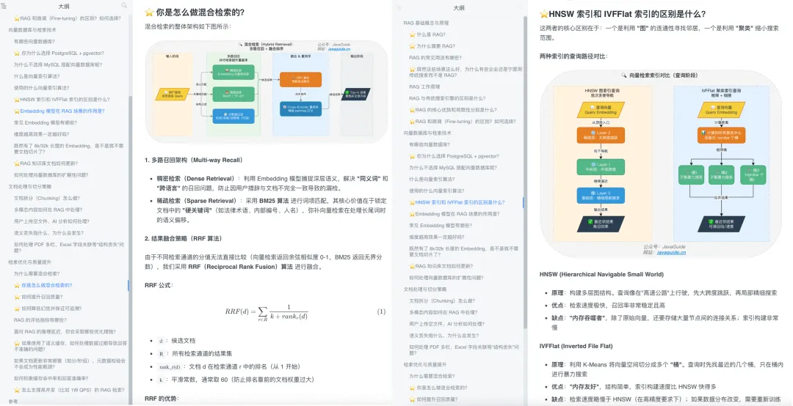

# 连Skills都没玩过，还敢说自己熟练掌握AI辅助编程？”，我：“呃…，Prompt不行吗？


上个月面某个核心业务线，面试官翻了翻我简历，停在"有 Agent 工作流落地经验"这行，问了一个场景题："我们数据平台要让 AI 自主排查慢查询、审查代码规范、生成报告，这些能力你怎么组织？用过 Skills 吗？"

我想了想，说："我一般会把审查标准写进系统 Prompt，再挂上对应的 Function Calling 接口，大模型按需去调。"

面试官没有立刻反驳，连问了三句话：

"工作流节点涨到二三十个的时候，你的 Prompt 大概多少 token？"

我没答上来。

"这套审查标准，换个项目还能直接用吗？"

"呃……要改。"

"你们团队的新人能看懂这个 Prompt，然后自己扩展它吗？"

沉默。

他才说："你的方案能跑，但本质上是把所有东西塞进一个方法里——上下文一长，模型注意力稀释，开始幻觉；需求一变，牵一发动全身；换个项目，从头再写。这不是工程化，这是凑合。"

面试没过。回来复盘才真正想清楚这件事：**我缺的不是提示词技巧，而是一套把能力模块化的工程思路**。更合理的做法，是把每一项专项能力（代码审查标准、慢查询排查流程、报告生成规范）分别写成独立的 `SKILL.md`——元数据常驻上下文，正文按需加载；新人能读懂，换项目能复用，Agent 按需激活执行，互不干扰。

这就是 Skills。

段子归段子，随着 AI 应用从简单的"单轮问答"走向复杂的"自动化工作流"，Skills 已经成为大模型应用架构中绕不开的工程概念，也是如今中高级研发工程师面试中的高频考点。今天 Guide 就带大家彻底搞懂这个概念：

1. ⭐️ **Skills 是什么？** 为什么它被称为“延迟加载”的 sub-agent？
2. ⭐️ **面试必考盲区：** Skills 和 Prompt、MCP、Function Calling 到底有什么本质区别？
3. ⭐️ **项目实战：** 优秀的 Skill 长什么样？如何在真实开发中用它来固化代码规范？

如果有理解不正确地方，欢迎大家评论区指正，狠狠拷打 Guide！

## **Skills**

### **Skills 是什么？**

用一句话概括：**Skill 是一个用自然语言定义的、具有特定领域上下文（Domain Context）的逻辑指令集，本质上是通过延迟加载（Lazy Loading）优化 Token 消耗的 sub-agent**。

在团队协作中，很多"隐性知识"都在老员工脑子里，比如代码规范、排查流程、Review 标准。Skills 的核心价值，就是**把这些隐性规则变成显性的文档（SOP），让 AI 能够自主阅读、理解并执行**。

与传统编程不同，Skills 不强制规定每一步的代码逻辑，而是**用自然语言将决策权下放给模型**——模型通过 `load_skill()` 动态加载 `SKILL.md` 后，将其中定义的规则、流程和约束**实时注入到推理上下文**中，指导后续的工具调用和决策。这既保留了 Agent 处理不确定性的优势，又避免了纯代码编排的僵化。

>为什么不用"基于 Function Calling 封装"？这个表述容易让人误以为 Skill 是某种 Function Calling 的语法糖。实际上，Skill 的核心机制是**上下文注入**——Agent 读取 Markdown 文档，把其中的规则和流程纳入推理上下文。Function Calling 只是 Agent 执行某些动作（如调脚本、查资源）时可能用到的底层手段，不是 Skills 本身的定义层。
>
>注意：`load_skill()` 是对"Agent 读取并激活 SKILL.md"这一过程的概念性描述，不同工具的实际触发方式会有差异。

**关键机制**：

- **延迟加载（Lazy Loading）**：元数据保持简短（通常远少于正文）常驻上下文，正文仅在触发时动态注入，避免挤占 Token
- **动态上下文注入**：不同于静态文档的"阅读"，Skills 是将规则实时注入推理上下文，直接影响模型决策


### **Skills 和 Prompt、MCP、Function Calling 有什么区别？**

这也是面试中常被问到的点，容易混淆：

**1. Skills vs Prompt**

| 维度         | Prompt                     | Skills                         |
| :----------- | :------------------------- | :----------------------------- |
| **本质**     | 单次对话的文本指令         | 可持久化、可发现的**能力单元** |
| **复用性**   | 随对话上下文丢失，难以维护 | 标准化封装，跨项目、多场景复用 |
| **加载机制** | 全量载入（挤占 Token）     | **延迟加载**（按需读取正文）   |

- **Prompt**：用户即时表达意图的载体（如"分析这份报表"）。
- **Skills**：包含**元数据（何时使用）+ 正文（如何执行）**的完整方案，通过 `load_skill()` 机制按需加载到上下文。

**2. Skills vs MCP**

这是最容易产生误解的地方。

| 维度         | MCP (Model Context Protocol)               | Skills                                         |
| :----------- | :----------------------------------------- | :--------------------------------------------- |
| **核心思路** | **标准化连接**：通过 JSON-RPC 统一数据格式 | **逻辑编排**：用自然语言描述复杂执行路径       |
| **定义方式** | 在 Server 端用代码（TS/Python）写死逻辑    | 在 `SKILL.md` 中用自然语言引导模型决策         |
| **环境依赖** | 需要运行一个 MCP Server 进程               | 依赖可执行环境（如本地 Shell 或沙箱）          |
| **哲学**     | **以协议为中心**：一次编写，所有 AI 通用   | **以模型为中心**：利用模型推理能力处理不确定性 |

- **MCP 解决的是连通性**：它像 USB-C，让 AI 能以统一格式读文件、查数据库。
- **Skills 解决的是编排逻辑**：它像一份说明书，告诉 AI 如何执行复杂任务流——这些任务完全可以包括调用多个 MCP 工具。
- **两者的关系**：它们**不是竞争关系**，而是解决不同层面的问题。MCP 负责把外部系统接入进来，Skills 负责决定什么时候用、怎么组合这些能力。一个高级 Skill 的底层往往就是调用多个 MCP 工具。

MCP 图解

Skills vs MCP

**3. Function Calling vs Skills**

| 维度         | Function Calling         | Skills                                                       |
| :----------- | :----------------------- | :----------------------------------------------------------- |
| **层级**     | 底层机制                 | 上层应用                                                     |
| **依赖关系** | 基础能力                 | 在执行时**可能使用** Function Calling（如加载文档、执行脚本、读取资源） |
| **粒度**     | 原子操作（单次工具调用） | 复合流程（多步骤决策 + 工具组合）                            |

Skills **没有创造新能力**，而是通过自然语言文档将能力组织成更易用的形式：

1. Agent 读取 `SKILL.md`，将规则和流程注入推理上下文。
2. 根据上下文指导，Agent 可能通过 Function Calling 执行脚本、读取资源或调用 MCP 工具。

**系统总结**：

| **组件**             | **一句话定义**             | **形象类比** | **关键理解**                                        |
| :------------------- | :------------------------- | :----------- | :-------------------------------------------------- |
| **Prompt**           | 即时意图表达的载体         | 用户说的话   | 单次、易失                                          |
| **Function Calling** | LLM 输出结构化调用的能力   | 神经信号     | **一切的基础**，实现非结构化 → 结构化转换           |
| **MCP**              | 标准化的工具接入协议       | USB-C 接口   | 解决外部系统"如何接入"（连通性）                    |
| **Skills**           | 用自然语言定义的 sub-agent | 任务说明书   | 解决复杂任务"如何编排"（执行逻辑），可调用 MCP 工具 |

**四层关系**：Function Calling 是地基 → Prompt 表达意图 → MCP 负责连通外部系统 → Skills 负责编排复杂任务流（可调用 MCP）

这里需要澄清一个常见误解：MCP 和 Skills **不是竞争关系**，也**不是非此即彼**。

- **MCP** 解决外部系统如何接入：让 AI 能以统一格式读文件、查数据库、调用 API。
- **Skills** 解决复杂任务如何编排：用自然语言定义执行流程，这些流程完全可以包含调用多个 MCP 工具。

在实际项目中，两者经常配合使用：一个 Skill 的正文里会指导 Agent 先用 MCP 读取数据库，再用 MCP 调用外部 API，最后生成报告。

**一句话总结**：Prompt 承载意图，Function Calling 实现交互，MCP 负责连通外部系统，Skills 负责编排复杂任务流——从'说什么'到'怎么做'再到'聪明地做'。


### **Skills 长什么样？你是怎么用的？**

从结构上看，Skill 很简单，核心就是一个 `SKILL.md` 文件，包含**元数据**（描述什么时候用）和**正文**（具体的执行 SOP）。

**设计上的亮点是“渐进式披露”**：

- **元数据**常驻上下文，AI 知道有哪些技能可用。
- **正文**按需加载，只有触发时才读取，避免挤占 Token。

复杂点的 Skill，还会有附加的资源目录、脚本和参考文档。

Skill 的完整目录结构是这样的：

```
skill-name/
├── SKILL.md          # 必需：元数据（何时使用）+ 正文（指令、流程、示例）
├── scripts/          # 可选：可执行脚本（Python/Bash），按需调用
├── references/       # 可选：参考文档，按需读取
└── assets/           # 可选：模板、图片等资源
```

**项目实战**：

我在项目中主要用 Skills 来**固化工程标准**。比如定义一个 `code-reviewer` Skill，明确要求从架构合理性、异常处理完整性、日志规范、安全风险、性能隐患等多个维度进行结构化审查。这样 AI 在 Review 代码时，就不再是“随缘点评”，而是严格执行团队标准。这对于保持代码质量的一致性非常有用。

除了 Code Review，我也会定义其他 Skill，例如：

- `api-endpoint-generator` - 按项目统一响应结构与异常模型生成标准化接口代码
- `database-access-review` - 审查数据库访问逻辑，关注索引使用与慢查询风险
- `refactor-analysis` - 先评估影响范围与依赖关系，再输出分步骤重构方案
- `security-audit` - 扫描 SQL 拼接、XSS、权限绕过等常见安全风险

**优秀 Skill 示例**：

- Code-Review-Expert（专家代码审查 Skill，以资深工程师视角进行结构化代码审查，覆盖：架构设计、SOLID 原则、安全性、性能问题、错误处理、边界条件）：**https://github.com/sanyuan0704/code-review-expert**
- Git Commit with Conventional Commits（一个基于 Conventional Commits 规范的智能提交工具，可自动分析 diff、智能暂存文件并生成语义化 commit message，安全高效完成标准化 Git 提交）：**https://github.com/github/awesome-copilot/blob/main/skills/git-commit/SKILL.md**
- TDD（测试驱动开发，先编写测试用例，观察它是否失败，然后编写最少的代码使其通过测试）：**https://github.com/obra/superpowers/blob/main/skills/test-driven-development/SKILL.md**

**https://skills.sh/** 这个网站上可以查找自己需要和热门的 Skiils。

                      																				*查找自己需要和热门的 Skiils*

这里 Guide 多提一下，回答这个问题的时候，你也可以说自己团队用到了一些开源的软件开发 Skills 集合，例如 Superpowers 中内置的。

																											*Superpowers 内置的 skills*

另外，很多 AI 编程 CLI 和 IDE 也会内置一些开箱即用的 Skills，例如 Claude Code 就内置了：

| 技能              | 功能                                             | 特点                                                        |
| :---------------- | :----------------------------------------------- | :---------------------------------------------------------- |
| **/simplify**     | 审查最近修改的文件（复用、质量、效率），自动修复 | 并行多代理审查，适合功能/修复后清理                         |
| **/batch <指令>** | 大规模批量修改代码库                             | 自动任务拆分，每个任务在隔离 git worktree 中执行，可批量 PR |
| **/debug [描述]** | 排查当前 Claude Code 会话问题                    | 读取 debug log                                              |

### **大模型实战项目推荐**

推荐一个基于 Spring Boot 4.0 + Java 21 + Spring AI 2.0 的 AI 智能面试辅助平台。系统提供三大核心功能：

1. **智能简历分析**：上传简历后，AI 自动进行多维度评分并给出改进建议
2. **模拟面试系统**：基于简历内容生成个性化面试题，支持实时问答和答案评估
3. **RAG 知识库问答**：上传技术文档构建私有知识库，支持向量检索增强的智能问答

系统架构

效果展示

**项目地址** （欢迎 Star 鼓励）：

- Github：**https://github.com/Snailclimb/interview-guide**
- Gitee：**https://gitee.com/SnailClimb/interview-guide**

完整代码完全免费开源，没有 Pro 版本或者付费版！

[《SpringAI 智能面试平台+RAG 知识库》](https://mp.weixin.qq.com/s?__biz=Mzg2OTA0Njk0OA==&mid=2247552320&idx=1&sn=a7e4e5a8d957446e6bb032d78b2fa5fb&scene=21#wechat_redirect)配套实战项目教程已经更新完毕，涉及到 Prompt Engineering、大模型集成、RAG（检索增强生成）、高性能对象存储与向量数据库。Spring AI 和 RAG 面试题已更新，两篇加起来接近 60 道题目。

RAG 面试题


