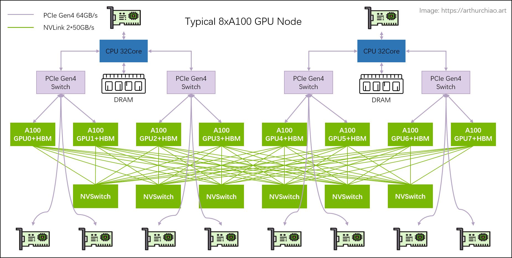
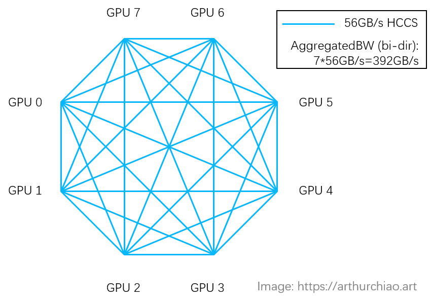

# GPU性能（数据表）快速参考（2023）

本文简要介绍了NVIDIA和华为/海思的热门GPU型号的性能，主要面向个人用户。

## **1 引言**

###  **1.1 NVIDIA GPU 的命名规则**

 GPU 型号名称的首字母表示其 GPU 架构，例如：

- **T** 表示 **Turing** 架构
- **A** 表示 **Ampere** 架构
- **V** 表示 **Volta** 架构
- **H** 表示 **Hopper** 架构（2022）
- **L** 表示 **Ada Lovelace** 架构

## **2 L2 / L4 / T4 / A10 / V100 对比**

| 型号                           | L2               | L4               | T4               | A10                        | A30                              | V100 PCIe/SMX2                   |
| ------------------------------ | ---------------- | ---------------- | ---------------- | -------------------------- | -------------------------------- | -------------------------------- |
| **适用场景**                   | 数据中心         | 数据中心         | 数据中心         | （桌面）图形密集型工作负载 | 桌面                             | 数据中心                         |
| **年份**                       | 2023             | 2023             | 2018             | 2020                       | —                                | 2017                             |
| **制造工艺**                   | —                | —                | 12nm             | 12nm                       | —                                | —                                |
| **架构**                       | Ada Lovelace     | Ada Lovelace     | Turing           | Ampere                     | Ampere                           | Volta                            |
| **最大功耗**                   | —                | 72W              | 70W              | 150W                       | 165W                             | 250/300W                         |
| **显存**                       | 24GB GDDR6       | 24GB             | 16GB GDDR6       | 24GB GDDR6                 | 24GB HBM2                        | 16/32GB HBM2                     |
| **显存带宽**                   | 300 GB/s         | 300 GB/s         | 400 GB/s         | 600 GB/s                   | 933 GB/s                         | 900 GB/s                         |
| **互联**                       | PCIe Gen4 64GB/s | PCIe Gen4 64GB/s | PCIe Gen3 32GB/s | PCIe Gen4 66 GB/s          | PCIe Gen4 64GB/s, NVLINK 200GB/s | PCIe Gen3 32GB/s, NVLINK 300GB/s |
| **FP32 浮点运算性能 (TFLOPS)** | 24.1             | 30.3             | 8.1              | 31.2                       | 10.3                             | 14/15.7                          |
| **TF32 浮点运算性能 (TFLOPS)** | 48.3             | 120*             | —                | —                          | —                                | —                                |
| **BF16 浮点运算性能 (TFLOPS)** | 95.6             | 242*             | —                | 125                        | 165                              | 不支持                           |
| **FP16 浮点运算性能 (TFLOPS)** | —                | 242*             | —                | 125                        | 165                              | —                                |
| **INT8 运算性能 (TFLOPS)**     | 193/193          | 485*             | —                | 250                        | 330                              | —                                |
| **INT4 运算性能 (TFLOPS)**     | —                | 不支持           | —                | —                          | 661                              | —                                |

> 带 `*` 的性能指标表示使用稀疏性 (sparsity) 技术提升后的数值。

Datasheets:

1. [L4](https://nvdam.widen.net/s/rvq98gbwsw/l4-datasheet-2595652)
2. [T4](https://www.nvidia.com/en-us/data-center/tesla-t4/)
3. [A10](https://www.nvidia.com/en-us/data-center/products/a10-gpu/)
4. [A30](https://www.nvidia.com/en-us/data-center/products/a30-gpu/)
5. [V100-PCIe/V100-SXM2/V100S-PCIe](https://www.nvidia.com/en-us/data-center/v100/)

## **3 A100 / A800 / H100 / H800 / 910B / H200 对比**

| 型号                           | A800 (PCIe/SXM) | A100 (PCIe/SXM)                  | 华为 Ascend 910B | H800 (PCIe/SXM) | H100 (PCIe/SXM)                   | H200 (PCIe/SXM)                   |
| ------------------------------ | --------------- | -------------------------------- | ---------------- | --------------- | --------------------------------- | --------------------------------- |
| **年份**                       | 2022            | 2020                             | 2023             | 2022            | 2022                              | 2024                              |
| **制造工艺**                   | 7nm             | 7nm                              | 7+nm             | 4nm             | 4nm                               | 4nm                               |
| **架构**                       | Ampere          | Ampere                           | 华为达芬奇       | Hopper          | Hopper                            | Hopper                            |
| **最大功耗**                   | 300/400 W       | 300/400 W                        | 400 W            | —               | 350/700 W                         | 700 W                             |
| **显存**                       | 80GB HBM2e      | 80GB HBM2e                       | 64GB HBM2e       | 80GB HBM3       | 80GB HBM3                         | 141GB HBM3e                       |
| **显存带宽**                   | —               | 1935/2039 GB/s                   | —                | —               | 2/3.35 TB/s                       | 4.8 TB/s                          |
| **GPU 互联（点对点最大带宽）** | NVLINK 400GB/s  | PCIe Gen4 64GB/s, NVLINK 600GB/s | HCCS 56GB/s      | NVLINK 400GB/s  | PCIe Gen5 128GB/s, NVLINK 900GB/s | PCIe Gen5 128GB/s, NVLINK 900GB/s |
| **GPU 互联（点对多总带宽）**   | NVLINK 400GB/s  | PCIe Gen4 64GB/s, NVLINK 600GB/s | HCCS 392GB/s     | NVLINK 400GB/s  | PCIe Gen5 128GB/s, NVLINK 900GB/s | PCIe Gen5 128GB/s, NVLINK 900GB/s |
| **FP32 浮点运算性能 (TFLOPS)** | —               | 19.5                             | —                | —               | 51 / 67*                          | 67*                               |
| **TF32 浮点运算性能 (TFLOPS)** | —               | 156 / 312*                       | —                | —               | 756 / 989*                        | 989*                              |
| **BF16 浮点运算性能 (TFLOPS)** | —               | 156 / 312*                       | —                | —               | 1513 / 1979*                      | 1979*                             |
| **FP16 浮点运算性能 (TFLOPS)** | —               | 312 / 624*                       | 320              | —               | 1513 / 1979*                      | 1979*                             |
| **FP8 浮点运算性能 (TFLOPS)**  | 不支持          | 不支持                           | —                | —               | 3026 / 3958*                      | 3958*                             |
| **INT8 运算性能 (TFLOPS)**     | —               | 624 / 1248*                      | 640              | —               | 3026 / 3958*                      | 3958*                             |

**注释**：

- 带 `*` 的数值表示使用稀疏性（sparsity）技术提升后的性能。
- H100 对比 A100：性能约提升 3 倍，价格约 2 倍。

**资料来源**：

- A100 / H100 / 华为 Ascend 910B 数据表
- 910 GPU 论文：*Ascend: a Scalable and Unified Architecture for Ubiquitous Deep Neural Network Computing, HPCA, 2021*

### **3.1 关于 GPU 间带宽的说明：HCCS 与 NVLINK 对比**

对于 8 卡的 A800 和 910B 模块：910B 的 HCCS 总带宽为 392GB/s，看起来与 A800 的 NVLink（400GB/s）相当。但实际上，它们有一些差异。说明如下：

- **NVIDIA NVLink**：采用全互联（full-mesh）拓扑，如下所示，因此每对 GPU 之间的双向最大带宽为 400GB/s。（注意，下图中 8 张 A100 模块的总带宽为 600GB/s，8 张 A800 模块采用类似的全互联拓扑）

  

- **华为 HCCS**：采用点对点（peer-to-peer）拓扑（没有类似 NVSwitch 的芯片），因此每对 GPU 之间的双向最大带宽为 **56GB/s**。

  

## **4 H20 / L20 / Ascend 910B 对比**

| 型号                           | 华为 Ascend 910B | L20 (PCIe)       | H20                               | H100 (PCIe/SXM)                   |
| ------------------------------ | ---------------- | ---------------- | --------------------------------- | --------------------------------- |
| **年份**                       | 2023             | 2023             | 2023                              | 2022                              |
| **制造工艺**                   | 7+nm             | 4nm              | 4nm                               | 4nm                               |
| **架构**                       | 华为达芬奇       | Ada Lovelace     | Hopper                            | Hopper                            |
| **最大功耗**                   | 400 W            | 350 W            | 500 W                             | 350/700 W                         |
| **显存**                       | 64GB HBM2e       | 48GB GDDR6       | 96GB HBM3                         | 80GB HBM3                         |
| **显存带宽**                   | —                | 864 GB/s         | 4.0 TB/s                          | 2/3.35 TB/s                       |
| **L2 Cache**                   | —                | 96 MB            | 60 MB                             | 50 MB                             |
| **GPU 互联（点对点最大带宽）** | HCCS 56GB/s      | PCIe Gen4 64GB/s | PCIe Gen5 128GB/s, NVLINK 900GB/s | PCIe Gen5 128GB/s, NVLINK 900GB/s |
| **GPU 互联（点对多总带宽）**   | HCCS 392GB/s     | PCIe Gen4 64GB/s | PCIe Gen5 128GB/s, NVLINK 900GB/s | PCIe Gen5 128GB/s, NVLINK 900GB/s |
| **FP32 浮点运算性能 (TFLOPS)** | —                | 59.8             | 44                                | 51 / 67                           |
| **TF32 浮点运算性能 (TFLOPS)** | —                | 59.8             | 74                                | 756 / 989                         |
| **BF16 浮点运算性能 (TFLOPS)** | —                | 119 / 119        | 148 / 148                         | 1513 / 1979*                      |
| **FP16 浮点运算性能 (TFLOPS)** | 320              | —                | —                                 | 1513 / 1979*                      |
| **FP8 浮点运算性能 (TFLOPS)**  | —                | —                | 296 / 296                         | 3026 / 3958*                      |
| **INT8 运算性能 (TFLOPS)**     | 640              | 239 / 239        | 296 / 296                         | 3026 / 3958*                      |

>- 带 `*` 的数值表示使用稀疏性（sparsity）技术提升后的性能。
>- L20 最大功耗 350W：数据来自 dcgm-exporter 收集。

## **5 关于美国针对中国的“芯片出口管制”说明**

### **5.1 2022 年 10 月出口管制**

根据《附加出口管制实施条例：特定先进计算与半导体制造物项；超级计算机与半导体终端用途；实体名单修改》，对于可出口到中国市场的芯片，需要满足以下条件：

- **总双向传输速率**必须低于 600 GB/s；并且
- **总处理性能**必须低于 4800 bit TOPS（TFLOPS），相当于：
  - FP16 < 300 TFLOPS
  - FP32 < 150 TFLOPS

A100 和 H100 受此限制，因此才有针对中国市场的定制版本：A800 和 H800。

### **5.2 2023 年 10 月出口管制**

 根据《附加出口管制实施条例更新与修正》，除了上述 2022 年 10 月管制外，还禁止销售满足以下任一条件的芯片到中国市场：

1. **总处理性能**在 2400~4800 bit TOPS 之间 **且** 性能密度在 1.6~5.92；
   - 2400 bit TOPS 相当于：FP16 150 TFLOPS，FP32 75 TFLOPS
2. **总处理性能** ≥ 1600 bit TOPS **且** 性能密度在 3.2~5.92

这些限制覆盖了大部分高性能 GPU，包括旧型号 A800。但也存在低计算能力但高传输速率的芯片空间，例如传闻中的 **H20 GPU（148 TFLOPS + 96GB HBM + 900GB/s NVLink）**。

