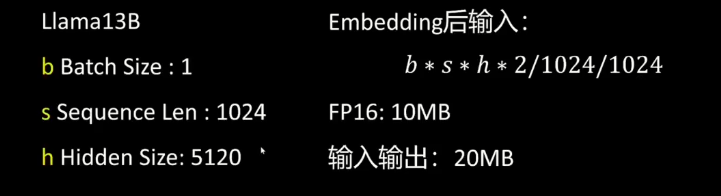
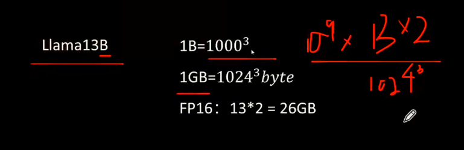
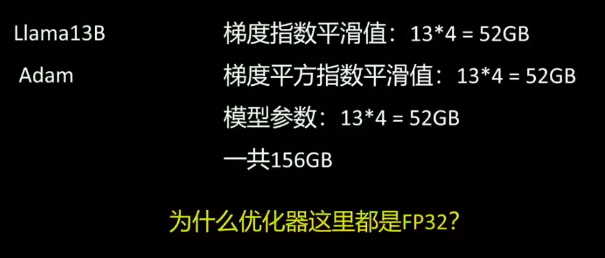
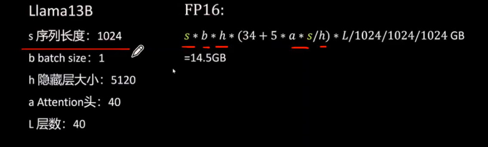
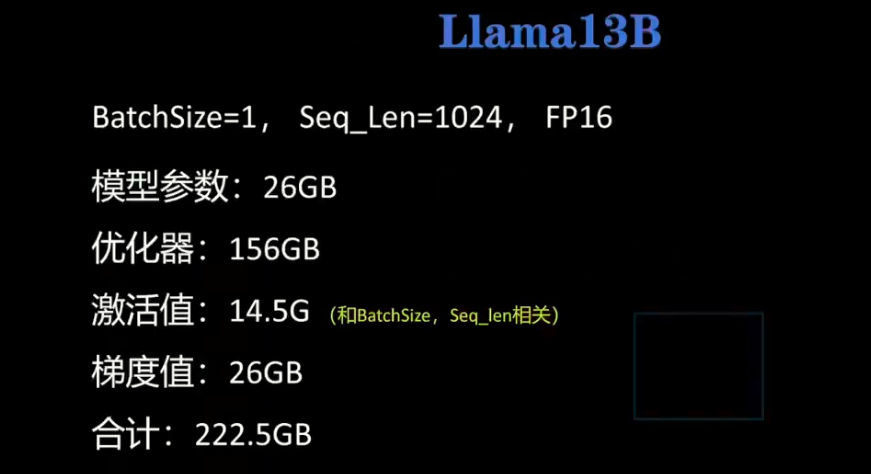

# 显存计算和量化

## 显存计算

### 基础知识

FP32 32Bits，4Bytes
FP16 16Bits， 2Bytes
1Byte = 8Bit

### 输入和输出

### 模型参数

### 优化器

### 激活值

### 梯度值

### 定义

222.5G是一个什么概念呢，H100 ≈ 80GB 显存（主流），需要四张 h100 才能做，这种情况下要怎么降低梯度的显存大小，比如lora 的训练参数从100万到1万，模型参数不会受影响，优化器直接1%，激活值没有影响，梯度值1%，使用lora 微调的时候，变成了42G。这还能降，这就涉及到模型的量化了，比如模型参数26GB可以降到13，就变成29GB了。

最后一个口诀，做Lora 微调的话，大概所需的 B 之前的参数 *2，也就是13 * 2 = 26GB。做全量微调的话大概就是* 20，这样我们可以快速估我们到底需要多少显存的计算。

## 常见的大模型微调框架

### 1. LLaMA-Factory（目前最流行的微调平台）

特点：

- UI + CLI
- 支持 LoRA / QLoRA / DPO / PPO
- 支持主流模型（Qwen / LLaMA / Baichuan 等）
- 基于 Transformers + PEFT

适合：

> 想快速做模型微调或智能体模型训练的人

