# LLM 中的 KV Cache、Prefix Cache、Prompt Cache 和 Semantic Cache

原文：[LLM 中的 KV Cache、Prefix Cache、Prompt Cache 和 Semantic Cache](https://x.com/_avichawla/status/2093265776266637739)

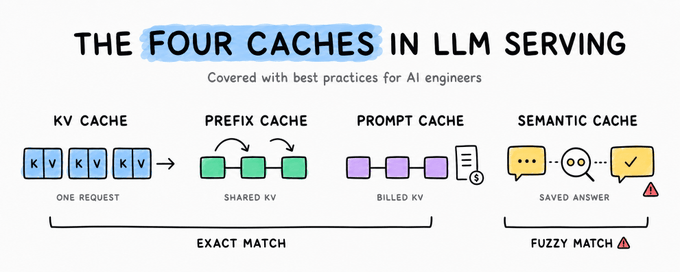

了解输入 Token 在哪里被重复计算，以及应该如何处理这些问题所需的一切知识。

本文从第一性原理出发，介绍四种缓存层，分析它们各自的权衡、相互作用时会发生什么，以及阻碍缓存复用的五个最常见问题。

在 LLM 技术栈中，有四种机制分别存储四种不同的对象，而它们全都被称为“缓存（Caching）”。

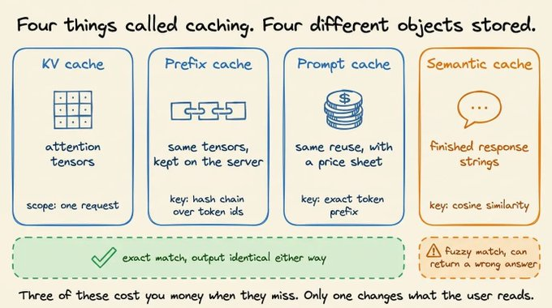

- **KV Cache** 为单个请求存储 Attention 计算产生的张量。
- **Prefix Caching（前缀缓存）** 将这些相同的张量存储在服务器端，并通过基于 Token ID 构建的哈希链作为索引。
- **Prompt Caching（提示词缓存）** 是服务商提供的、针对相同缓存查询的计费版本：读取缓存时按照基础输入价格的 **0.1 倍**计费，而写入缓存时则按照基础价格的 **1.25 倍**计费。
- **Semantic Cache（语义缓存）** 存储已经生成完成的响应字符串，并通过 Embedding 的余弦相似度作为索引。

前三种缓存都是**精确匹配（exact-match）**，并且不会影响结果的正确性，因此缓存未命中（cache miss）带来的代价只是**额外的费用和延迟**。第四种缓存属于**模糊匹配（fuzzy-match）**，它可能直接返回一个**错误的答案，并且 HTTP 状态码仍然是 200**。

所以，今天我们将逐一介绍这四种缓存，包括**每种缓存存储的内容，以及哪些因素会在不知不觉中导致缓存失效**。

这里的所有示例都可以在**单台机器上运行，包括 CPU**，使用的是一个 **3.6 亿参数（360M）模型**。此外，还包含一个 **Anthropic API** 示例，以及一个基于 **sentence-transformers** 构建的小型语义缓存示例。对于那些**只能存在于 Serving Engine（推理服务引擎）内部的机制**，我们会通过**伪代码**来演示其工作逻辑，而不会假装它们可以在普通笔记本上直接复现。

另外，**Transformers v5 对 Cache API 的接口进行了调整**，因此下面的代码片段默认使用 **v5 或更高版本**。

在 **v4** 中，对应的写法是：

- `DynamicCache()` 不传入 `config` 参数；
- 使用 `torch_dtype=`，而不是 `dtype=`。

```bash
pip install "transformers>=5.0" torch

# only for the quantized cache example
pip install optimum-quanto

# only for the semantic cache example
pip install sentence-transformers 

# only for the prompt caching example
pip install anthropic
```


## 1.KV Cache

在 **Prefill（预填充）**阶段，模型会针对 Prompt 中的每个 Token，在每一层计算对应的 **Key（K）和 Value（V）向量**，并将它们存储起来。

随后进入 **Decoding（解码）**阶段，模型会基于这些已经存储的向量进行 Attention，并且每生成一个新的 Token，就追加一组新的 K、V，而不需要在每一步都重新计算整个序列。

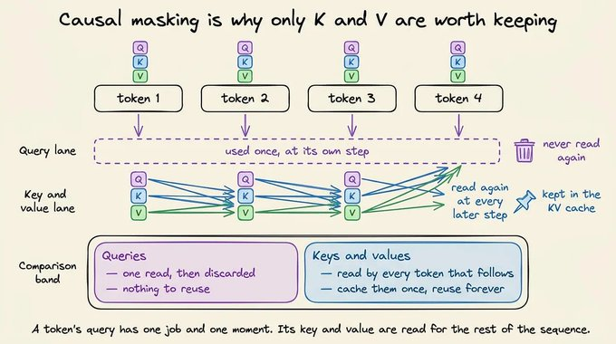

**Query（Q）不会被缓存，原因在于因果掩码（causal masking）。**

一个 Token 的 Query 向量只会在**处理该 Token 的那一步**被使用一次，之后就不会再被读取。

而它的 Key（K）和 Value（V）会被它后面的**每一个 Token**读取，因此 K 和 V 是最值得缓存的两个向量。

- **如果不存储 K、V**，那么每一个 Decode Step 都需要针对目前已经生成的**完整序列**进行一次矩阵-矩阵乘法（matrix-matrix multiply）。
- **如果存储 K、V**，那么每一步只需要针对**新生成的一个 Token**进行矩阵-向量乘法（matrix-vector multiply），所需的 FLOPs 会大幅减少。

下面的视频展示了 **使用 KV Cache 和不使用 KV Cache 时的 LLM 推理过程**： 

<video preload="none" tabindex="-1" playsinline="" aria-label="Embedded video" poster="https://pbs.twimg.com/amplify_video_thumb/2093227565351858176/img/siKASjLEtn2Jdqzt.jpg" style="width: 564.258px; height: 329.141px; background-color: black; top: 0px; left: 0px; transform: rotate(0deg) scale(1.005);"></video>


虽然 KV Cache 能够减少每个 Token 的计算量，但在每一个 Decode Step 中，都需要从 **HBM（High Bandwidth Memory，高带宽内存）**加载整个 Cache。

因此，Decode 阶段不再主要受计算能力限制（compute-bound），而是转变为受**内存带宽限制（memory bandwidth-bound）**。

Attention Kernel 的计算完成速度甚至快于 Cache 从 HBM 中读取和传输的速度，因此在大部分 Decode Step 中，GPU 都在**等待内存数据**。

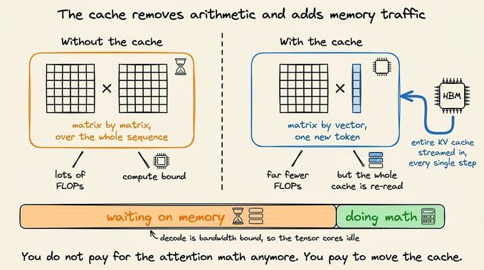


### KV Cache 随每个 Token 的增长

`transformers` 库将 Cache 作为一个**一等对象（first-class object）**提供，因此你可以保存它、查看它，并将其再次传入模型。

下面是一个最简的代码示例：

```python
import torch
from transformers import AutoTokenizer, AutoModelForCausalLM, DynamicCache

model_id = "HuggingFaceTB/SmolLM2-360M-Instruct"
tokenizer = AutoTokenizer.from_pretrained(model_id)
model = AutoModelForCausalLM.from_pretrained(
    model_id, dtype=torch.bfloat16, device_map="auto"
)

inputs = tokenizer("The capital of France is", return_tensors="pt")
inputs = inputs.to(model.device)

past_key_values = DynamicCache(config=model.config)

out = model.generate(
    **inputs,
    do_sample=False,
    max_new_tokens=20,
    past_key_values=past_key_values,
)

>>> print(tokenizer.decode(out[0], skip_special_tokens=True))
"""The capital of France is Paris. It is the largest city in
France and the second-largest city in the European Union."""

>>> print("prompt tokens: ", inputs["input_ids"].shape[1])
"prompt tokens: 5"

>>> print("total tokens: ", out.shape[1])
"total tokens:  25"

>>> print("cache length: ", past_key_values.get_seq_length())
"cache length:  24"
```

通常情况下，你调用 `generate` 方法时，Cache 会在内部自动创建和销毁，对你来说是不可见的。

这里我们自己创建了一个 `DynamicCache`，并将它传递给模型，这意味着在生成过程结束之后，我们仍然持有这个 Cache 的引用。

此时，`get_seq_length()` 会返回当前 Cache 中保存了多少个 Token 位置。

运行这段代码时，输出中的 Token 数量等于：

**Prompt 长度 + 生成的 Token 数量 − 1。**

最后一个 Token 的 Key 和 Value 虽然已经计算出来了，但之后没有任何 Token 会再对它们执行 Attention。

这段代码说明，Cache 会为**每一个已经处理过的 Token 保存一条记录**，并且在每一个 Decode Step 中，Cache 都会**恰好增加一条记录**。

这里使用 `DynamicCache` 作为默认 Cache，是因为它会随着生成过程的进行**动态增长**，而不是提前分配一块固定大小的内存。这样，对于较短的请求，就不会提前占用那些实际上永远不会用到的内存。

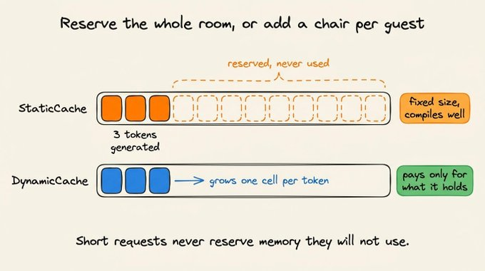

Cache 决定了一块 GPU 上能够同时容纳多少个请求。Cache 的大小由模型结构决定，并且会随着 Token 数量**线性增长**，因为模型的每一层都需要为每个 KV Head 保存对应的 Key 和 Value Tensor。

对于一个 **70B 参数模型**，在 **BF16** 精度下，单个 **128K 上下文**大约需要 **40 GB 的 KV Cache**，这个容量已经与整个模型采用 **4-bit 权重**时的大小相当。

下面是一些降低 KV Cache 占用的方法。

例如，**Grouped-Query Attention（GQA，分组查询注意力）\**会让一组 Query Head 共享一个 Key Head 和一个 Value Head，从而减小 KV Cache 的大小，同时提高\**每加载一个字节数据所对应的 FLOPs（每字节计算量）**。

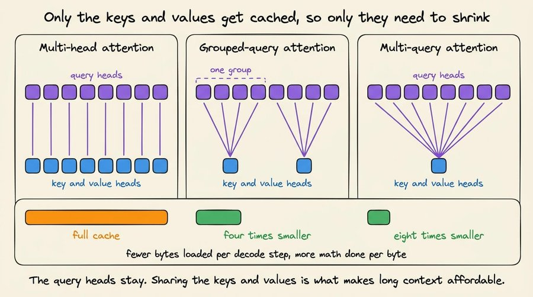

DeepSeek 系列中的 **Multi-head Latent Attention（MLA，多头潜在注意力）\**会将整个 KV Cache 压缩成一个\**潜在向量（latent vector）**。

**Cache Quantization（Cache 量化）\**则是用少量的数值精度损失来换取大约\**两倍的 Cache 容量**，而 `transformers` 已经实现了这一功能：

```python
# requires: pip install optimum-quanto
out = model.generate(
    **inputs,
    do_sample=False,
    max_new_tokens=20,
    cache_implementation="quantized",
    cache_config={"nbits": 4, "backend": "quanto"},
)
print(tokenizer.decode(out[0], skip_special_tokens=True))
```

通过两个参数，可以将默认的 Cache 替换为**量化 Cache（Quantized Cache）**。

KV 值会以更低的精度进行存储，从而降低内存占用，但代价是每次访问时都需要进行**量化和反量化（quantization and dequantization）**。

此外，后端还要求 **Group Size（分组大小）**能够被模型的 **Head Dimension（Head 维度）**整除，因此对于一些特殊的模型架构，如果配置不满足这一条件，可能会直接拒绝该配置。

对于较短的上下文而言，这些额外的计算开销可能会导致速度反而变慢，而不是变快。因此，**量化 Cache 更适合在显存不足时使用**。

### 请求结束后，Cache 也会被释放

上面所介绍的一切都发生在**一次请求调用**的过程中。

当请求结束后，推理引擎会释放这些 Cache Block。因此，对于一个进行到第 20 轮的多轮对话，在第 20 轮请求到来时，前面第 1～19 轮的内容需要**重新进行 Prefill**，并承担完整的计算成本。

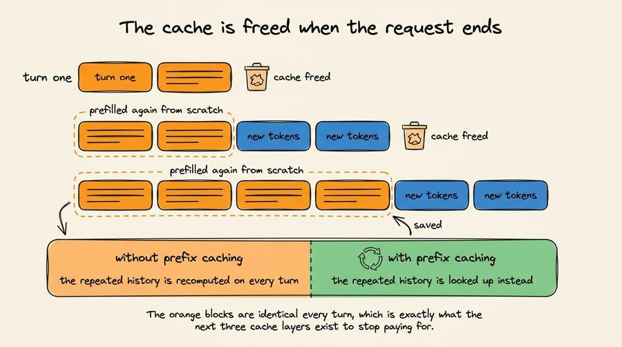

你也可以通过**在多轮对话之间自行保留 Cache**，来实现另一种方式。

```python
import torch
from transformers import AutoTokenizer, AutoModelForCausalLM, DynamicCache

model_id = "HuggingFaceTB/SmolLM2-360M-Instruct"
tokenizer = AutoTokenizer.from_pretrained(model_id)
model = AutoModelForCausalLM.from_pretrained(
    model_id, dtype=torch.bfloat16, device_map="auto"
)

past_key_values = DynamicCache(config=model.config)
messages = []

questions = ["What is the capital of France?", "And its population?"]

for prompt in questions:
    # Add to the history
    messages.append({"role": "user", "content": prompt})

   # Tokenize
    inputs = tokenizer.apply_chat_template(
        messages,
        add_generation_prompt=True,
        return_tensors="pt", return_dict=True
    ).to(model.device)

    # Generate
    input_length = inputs["input_ids"].shape[1]
    outputs = model.generate(
         **inputs, do_sample=False,
         max_new_tokens=64,
         past_key_values=past_key_values
    )

    # decode
    completion = tokenizer.decode(outputs[0, input_length:], skip_special_tokens=True)

    # Append to message history
    messages.append({"role": "assistant", "content": completion})
    print(f"turn tokens in: {input_length} | cache now: {past_key_values.get_seq_length()}")

# Output:
"turn tokens in: 42 | cache now: 55"
"turn tokens in: 71 | cache now: 92"
```

- `past_key_values` 对象只创建一次，放在循环外部，并在每次调用 `generate` 时都传入。这样一来，Cache 不会在第一轮请求结束时被释放，而是会一直保留到第二轮开始时，并且其中已经存有第一轮的数据。
- 每一轮都会重新构建完整的消息列表，并通过 `apply_chat_template` 重新渲染。这样，第二轮发送给模型的 Prompt 就包含了**第一轮的全部内容 + 新的问题**。
- 由于 Cache 中已经保存了第一轮的 Token，因此模型只需要对**新增的后缀部分（new suffix）**进行 Prefill。虽然打印出来的 `input_length` 每一轮都会增长，但实际需要执行的 Prefill 计算量并不会随之增长。
- 生成完成后，会将生成出来的 Token ID 从完整序列中切分出来，并追加回 `messages`。这样就保证了下一轮的 Prompt 是上一轮 Prompt 的**严格扩展（strict extension）**。

缓存之所以能够复用，是因为第二轮的 Token 序列以第一轮的 Token 序列作为开头，并且两者**完全一致，逐 Token 精确匹配**。如果你修改了历史记录中任何更早位置的内容，Cache 就会失效。

在这个代码示例中，Cache 属于**单个进程中的一个 Python 变量**。而在 Serving Engine（推理服务引擎）中，Cache 则属于一个**共享的缓存池**，成千上万个请求都会从这个缓存池中进行查找和复用。

接下来，我们来了解这一机制。

## 2.Prefix Caching（前缀缓存）

上面提到的共享缓存池，源于一个行为上的改变。

当一个请求结束时，推理引擎不会释放它的 KV Cache Block，而是将这些 KV Block 保留在内存中，并为它们建立索引，以便后续请求能够找到并复用它们。

这就是 **Prefix Caching（前缀缓存）**。

这个索引必须遵循前面聊天循环中讲到的同一规则：**只有当前面的 Token 完全一致时，Cache 才能被复用。**

vLLM 默认将缓存划分为 **每块 16 个 Token**，并通过一个 Hash 来标识每个 Block。这个 Hash 由两部分共同决定：

- **父 Block 的 Hash**
- **当前 Block 内的 Token ID**

也就是说，每个 Block 的标识不仅取决于自身的 Token，还取决于前一个 Block，从而形成一条 **Hash 链（hash chain）**。

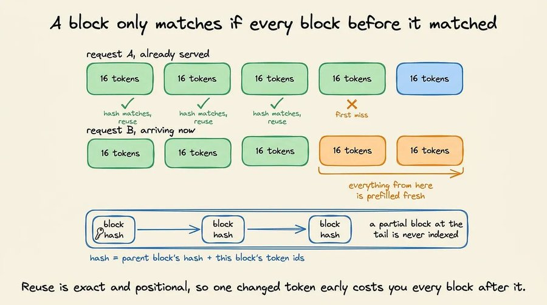

将**父 Block 的 Hash** 链接到**子 Block** 中，就可以把一次普通的 Block 查找变成一次**前缀查找（prefix lookup）**，因为只有当前面所有内容都匹配时，当前 Block 才能匹配成功。

调度器会按照顺序遍历传入请求中的各个 Block，并在遇到第一个 **Cache Miss** 时停止。

如果某个 Block **命中（Hit）**，其**引用计数（reference count）\**就会增加，这也意味着：只要有请求正在使用这个 Block，它就会被\**固定（pin）**，不会被淘汰。

从发生 **Cache Miss** 的 Block 开始，后面的所有内容都会重新分配缓存空间，并重新执行 **Prefill**。

### Lookup 代码

vLLM 在其调度器中运行这部分代码，并将其封装在负责管理实际 Tensor 的内存管理模块中。

下面的代码只保留了决定是否复用的两个部分，即：将 Token 序列转换为 Block Key 的函数，以及遍历这些 Key 来确定前缀中有多少内容可以跳过 Prefill 的函数。

```python
BLOCK_SIZE = 16

def block_hashes(token_ids, salt=None):
    """Chain-hash a token sequence into per-block keys."""

    hashes, parent = [], hash(salt)

    # Only complete blocks are hashed. A partial tail block is skipped.
    for start in range(0, len(token_ids) - BLOCK_SIZE + 1, BLOCK_SIZE):
        block = tuple(token_ids[start : start + BLOCK_SIZE])
        parent = hash((parent, block))
        hashes.append(parent)

    return hashes

def schedule(token_ids, cache):

    """Return how many tokens are reusable, and allocate the rest."""

    matched_blocks = 0

    for h in block_hashes(token_ids):
        if h not in cache:
            break                      # first miss ends all reuse
        cache[h].ref_count += 1        # pin it against eviction
        matched_blocks += 1

    reused_tokens = matched_blocks * BLOCK_SIZE
    to_prefill = token_ids[reused_tokens:]

    return reused_tokens, to_prefill
```

- `block_hashes` 方法将 Token 序列切分成固定的 16-Token Block。每个 Block 的 Key 都会通过 `hash((parent, block))` 将前一个 Block 的 Key 纳入其中，因此第 5 个 Key 编码的是第 1～5 个 Block 的信息，而不仅仅是第 5 个 Block 本身。
- `range` 的范围截止于 `len(token_ids) - BLOCK_SIZE + 1`，因此末尾任何不足一个完整 Block 的部分都会被舍弃。这些 Token 不会被建立索引，并且每次请求在此处结束时都会被重新计算。

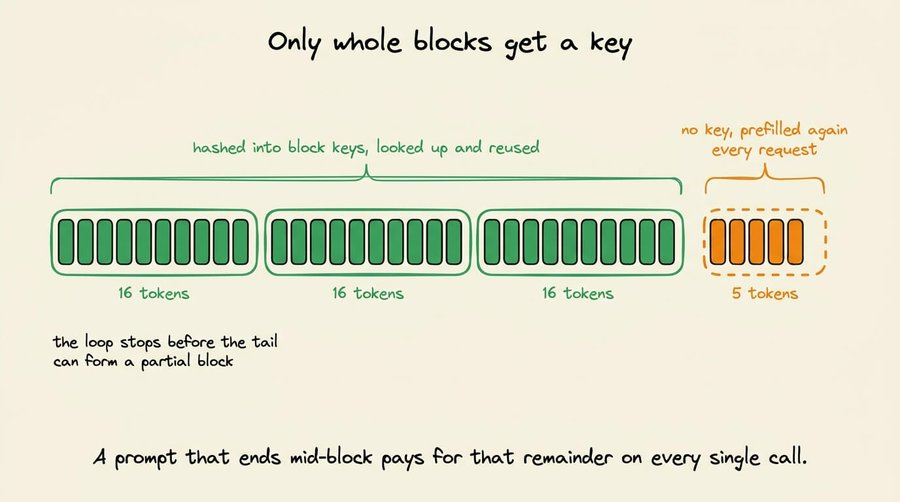

- `schedule` 方法会按照顺序遍历这些 key，并在遇到第一个缺失的 key 时停止。它不会尝试在序列后面继续匹配，因为后续 block 的 key 本身就依赖于前面那个匹配失败的 block。
- `ref_count += 1` 表示将该 block 标记为正在使用。只有 `count` 为 0 的 block 才会被驱逐（Eviction），这样可以避免正在运行的请求所使用的 Cache 被从底层直接移除。
- 成功匹配到的部分会被计为 `reused_tokens`，而从匹配结束之后的内容则需要重新进行 Prefill。

我们刚刚讨论的代码中，还有一个非常重要的地方：

```python
BLOCK_SIZE = 16

def block_hashes(token_ids, salt=None):
    """Chain-hash a token sequence into per-block keys."""

    hashes, parent = [], hash(salt)

    # Only complete blocks are hashed. A partial tail block is skipped.
    for start in range(0, len(token_ids) - BLOCK_SIZE + 1, BLOCK_SIZE):
        block = tuple(token_ids[start : start + BLOCK_SIZE])
        parent = hash((parent, block))
        hashes.append(parent)

    return hashes
```

注意上面函数中的 `salt` 参数。

当两个请求发送完全相同的文本时，它们会生成完全相同的 Block Key，因此最终会指向 GPU 内存中的同一组物理 KV Block。那些 Tensor 只有一份，两个请求都会读取它。

当两个请求来自同一个应用时，这正是你希望看到的行为。

但当它们来自不同的客户时，就需要做出一些决定。因此，将每个租户的值作为 `salt` 传入，会改变第一个父 Hash。这样，即使文本完全相同，不同租户也会生成不同的 Key，它们的请求也永远不会落到相同的 Block 上。

这样，每个租户都会获得自己独立的一份副本。代价是增加内存消耗并降低命中率，但可以实现隔离。

### transformers 中的实现

transformers 允许你对一个 Prompt 只进行一次 Prefill，然后在多个不同的后续生成中复用生成的 Cache。

```python
import copy
import torch
from transformers import AutoModelForCausalLM, AutoTokenizer, StaticCache

model_id = "HuggingFaceTB/SmolLM2-360M-Instruct"
tokenizer = AutoTokenizer.from_pretrained(model_id)
model = AutoModelForCausalLM.from_pretrained(
    model_id, dtype=torch.bfloat16, device_map="auto"
)

SHARED_PREFIX = """You are a careful assistant. 
                   Answer in one short sentence."""

prompt_cache = StaticCache(config=model.config, max_cache_len=1024)

prefix_inputs = tokenizer(SHARED_PREFIX, return_tensors="pt")
prefix_inputs = prefix_inputs.to(model.device)

# Prefill the shared prefix exactly once. No token is sampled here.
with torch.no_grad():
    prompt_cache = model(**prefix_inputs, past_key_values=prompt_cache)
    prompt_cache = prompt_cache.past_key_values

questions = ["What is the capital of France?", "Name one ocean."]

for question in questions:
    inputs = tokenizer(SHARED_PREFIX + question, return_tensors="pt")
    inputs = inputs.to(model.device)

    # each request gets its own copy
    past_key_values = copy.deepcopy(prompt_cache)   

    outputs = model.generate(
        **inputs, past_key_values=past_key_values, do_sample=False
    )
    print(tokenizer.decode(outputs[0], skip_special_tokens=True))
```

- 使用 `StaticCache` 而不是 `DynamicCache`，因为我们需要一个可以复制的固定分配。
- `model(...)` 调用就是一次 Prefill。这里不会采样任何 Token。我们运行共享前缀通过模型，纯粹是为了填充 Cache，然后保留返回的 `past_key_values`。
- 在循环内部，每个问题都会拼接到同一个前缀后面。完整字符串会被进行 Tokenize，因此每次前缀部分的 Token ID 都完全相同，这正是推理引擎的 Hash 链所检查的条件。
- `copy.deepcopy` 会为每个请求创建一份独立的 Prefill Cache 副本。生成过程会通过追加的方式原地修改 Cache，因此如果不进行复制，第一个问题就会破坏第二个问题所使用的前缀。在生产环境的推理引擎中，并不会复制这些 Tensor，而是共享物理 Block 并跟踪引用计数，这使得复用的成本几乎为零，而不是与前缀长度成正比。

### 淘汰对命中率的影响

如上所述，只有完整的 Block 才会被建立索引，因此末尾不足一个完整 Block 的部分每次都会被重新计算。

这意味着 Block 大小应该进行适当的调整：

- **更大的 Block**意味着更少的表查找次数和更好的内存局部性。
- **更小的 Block**意味着更细粒度的共享，以及更少的末尾空间浪费。

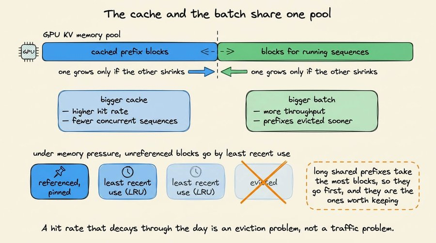

Eviction 会降低缓存命中率，这是符合预期的。

缓存和正在运行的 batch 共用同一块 GPU 内存池，因此，缓存越大，能够同时运行的序列就越少。在内存压力较大的情况下，vLLM 会按照**最近最少使用（LRU）**的策略，优先丢弃没有被引用的 block。

混合流量会让这个问题更加严重，因为**长共享前缀**会占用最多的 block，而一旦这些 block 被驱逐，实际造成的损失也最大。

在启用这个功能之前，有两点你需要知道：

- 它只节省 **Prefill** 阶段的计算，因此 **Decode 时间不会发生变化**。如果把整体速度提升都归因于 Cache，会高估它实际带来的加速效果。
- **Hashing 本身也需要消耗一定的计算资源**。因此，对于那些 prompt 真正具有高度唯一性的流量，基准测试测到的结果可能不是性能提升，而是**吞吐量下降**。

还有第三个问题，它取决于具体的工作负载，而且对 **RAG** 的影响最大。

一个 RAG Prompt 包含 System Instruction、检索到的 Chunks，然后是 Query，而这些 Chunks 会随着每个请求发生变化，并且不同请求之间的顺序也会发生变化。两个请求即使检索到了相同的文档，只是顺序不同，在链式 Hash 机制下也完全无法共享任何内容。

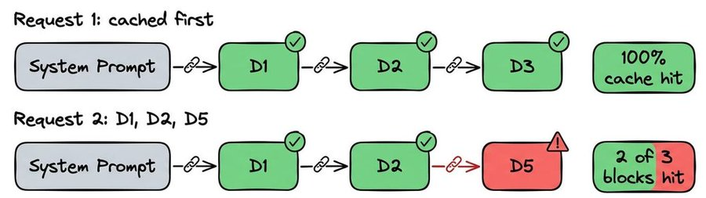

单独对每个 Chunk 进行 Prefill，然后将各个 Cache 拼接起来是不可行的。

拼接后的 Tensor 携带了错误的位置编码。每个 Chunk 都没有与其他 Chunk 进行过 Attention。同时，每个 Chunk 都会在模型认为的第 0 个位置产生自己的 Attention Sink。要使其正常工作，需要在边界处进行部分重新计算，而不能直接进行简单的拼接。

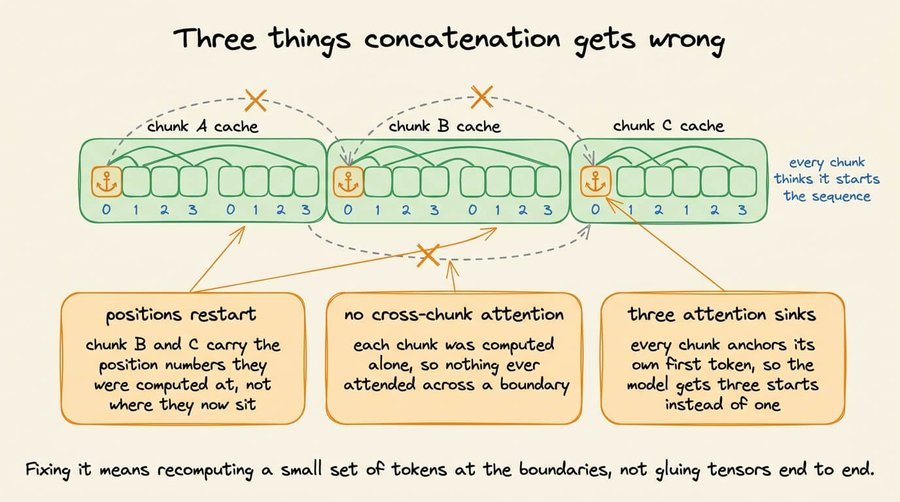

顺便说一句，这个问题已经有开源解决方案了。

[**LMCache**](https://github.com/LMCache/LMCache)

（开源）实现了 **CacheBlend**：它不是将各个 Chunk 的 Cache 首尾拼接起来，而是可以在任意位置复用这些 Cache，并且只重新计算少量 Token。这些 Token 根据预计算值与完整 Attention 本应产生的结果之间的偏差大小来选择。

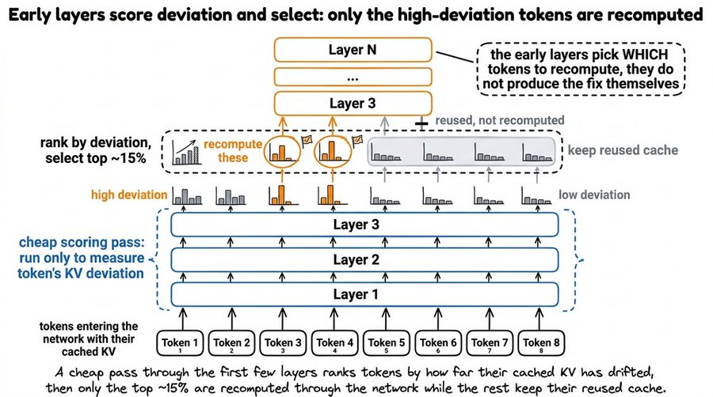


这个子集恢复了 Chunk 之间的 Attention，并修正了位置编码，因此输出可以保持完整 Prefill 的质量。

与重新计算全部内容相比，这可以将首 Token 延迟（Time to First Token）提升大约 **2～3 倍**，同时将重新计算的开销与从较慢存储中获取缓存 Chunk 的过程进行流水线并行。

它可以接入 vLLM，并从你的 Prompt 中读取 Chunk 的边界，因此即使每次检索到的文档顺序不同，检索流量仍然可以得到复用。

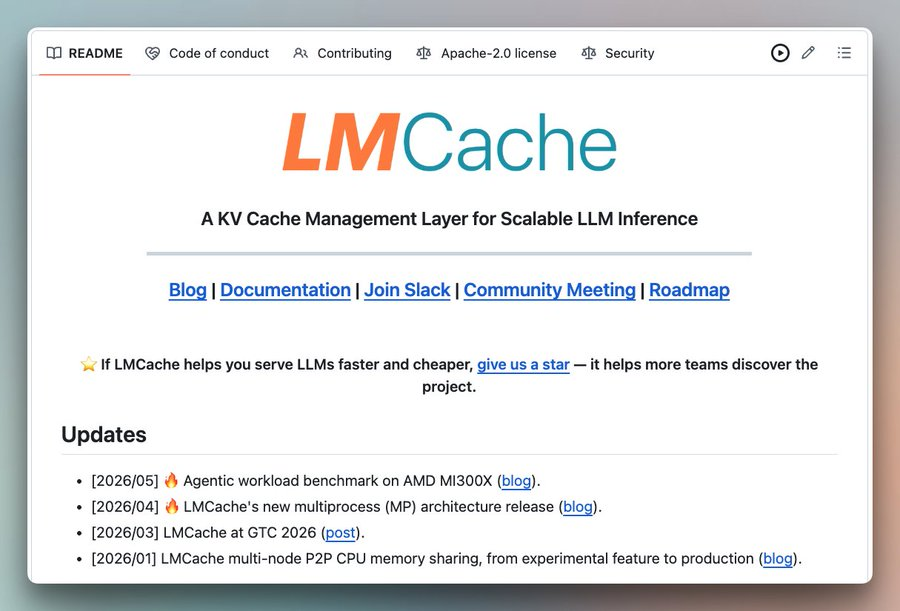

代码仓库：https://github.com/LMCache/LMCache


## 3.Prompt Caching（提示词缓存）

在托管模型上，你无法看到 Block Table 或淘汰策略。相反，你看到的是服务提供商自身前缀复用机制对应的价格表，以及两个用于控制的参数。

缓存的对象仍然是 KV Tensor，而不是你的 Prompt 文本，并且仍然要求完整渲染后的上下文进行精确的前缀匹配。

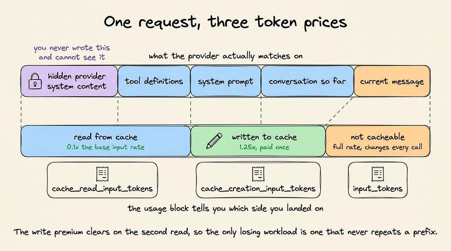

渲染后的上下文包含你从未编写过的服务提供商侧 System 内容，这也是为什么从外部看，最小长度和失效规则显得有些任意。

下面通过代码演示一个 Prompt Caching 的版本：

```python
import anthropic

client = anthropic.Anthropic()   # reads ANTHROPIC_API_KEY from the environment

# Must clear the model's minimum cacheable length or nothing is cached at all.
LONG_INSTRUCTIONS = "You are a precise technical editor. " * 400

def ask(question: str):
    return client.messages.create(
        model="claude-sonnet-4-6",
        max_tokens=512,
        system=[
            {
                "type": "text",
                "text": LONG_INSTRUCTIONS,
                "cache_control": {"type": "ephemeral"},   # everything above is cacheable
            }
        ],
        messages=[{"role": "user", "content": question}],
    )

for question in ["Summarize section 3.", "Now rewrite it for a beginner."]:
    resp = ask(question)
    u = resp.usage
    print(
        f"write={u.cache_creation_input_tokens} "
        f"read={u.cache_read_input_tokens} "
        f"uncached={u.input_tokens}"
    )

# Output:
"write=2823  read=0     uncached=14"
"write=0     read=2823  uncached=17"
```

这段代码中只有一行涉及 Cache。

你指定 `cache_control` 的位置决定了请求中的哪一部分会被写入 Cache，而 usage counters 则告诉你后续调用是否读取了该 Cache。

- 标记附加在你希望覆盖的最后一个 Block 上，而不是附加在某个范围上。它会创建一个 Cache Entry，覆盖从请求开始到该 Block（包括该 Block）在内的全部内容。
- User Message 位于标记下方，因此它处于缓存区域之外，因为它每次调用都会发生变化，所以不能放在缓存区域内。
- Usage counters 可以告诉你底层发生了什么。第一次调用会报告非零的 `cache_creation_input_tokens`，而读取次数为 0。第二次调用则相反，并且这些 Instructions 按输入价格的十分之一计费。
- 如果两个计数器都返回 0，说明前缀长度低于模型可缓存的最小长度，请求完全没有使用缓存。对此不会产生任何错误。

直观地来说（正如上面所讨论的），如果我们将 `cache_control` 下移到 User Message 上，那么读取次数将始终为 0，因为被标记的 Block 在每次调用时都会发生变化。

### Prompt Caching 的经济性

Anthropic 对写入 Cache Entry 收取基础输入价格的 **1.25 倍**，读取则按 **0.1 倍**计费；如果希望 Cache 保留更长时间，写入价格的倍数会更高。OpenAI 目前的模型也采用相同的两种价格倍数。

额外的写入成本会在后续请求中得到回收，因为在 TTL 内被复用的内容都无需重新计算。

一次读取只能找到之前某个请求写入的 Cache Entry，而写入只会发生在你设置的 Cache Breakpoint 处。

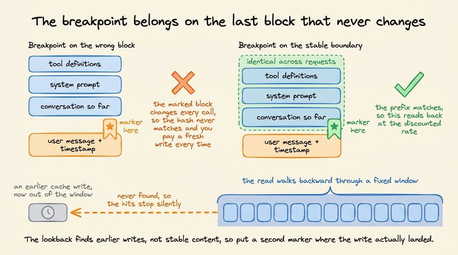

每次调用都会检查你设置的 Breakpoint，如果未命中，就会在有限数量的 Block 中向前回溯，寻找之前写入的 Cache。

Anthropic 将这个范围限制为 **20 个 Block**，因此，如果两次调用之间新增了超过 20 个 Block 的对话内容，就会使上一次写入超出查找范围，Cache 命中也就会停止。


## 4.Semantic Caching（语义缓存）

上面介绍的三种技术都可以节省 Prefill 的计算开销，但仍然需要运行模型。

Semantic Cache 会对传入的 Prompt 进行 Embedding，然后在已存储的 Prompt 中进行最近邻搜索；当相似度超过设定的阈值时，就直接返回已存储的 Response。

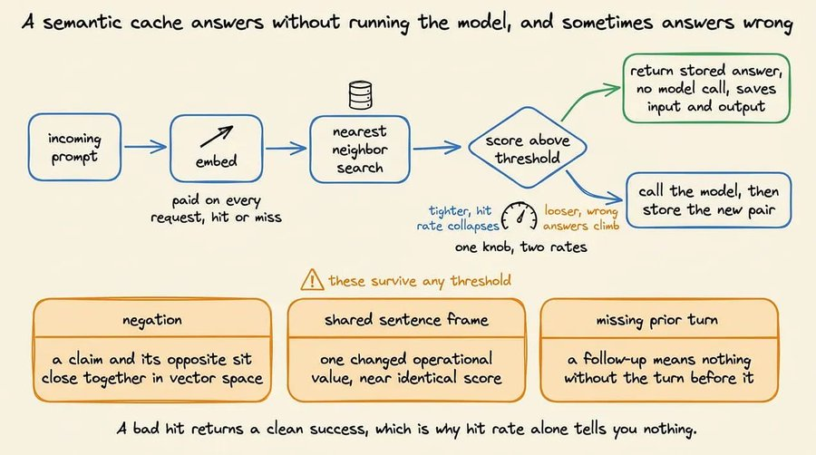

这也是为什么它不仅可以节省 Input Token，还可以节省 Output Token。同时，这也意味着每个请求都必须经历一次 Embedding 的往返过程，包括 Cache Miss 的请求。

下面用几行代码演示一个可运行的 Semantic Cache 示例：

```python
# requires: pip install sentence-transformers
import numpy as np
from sentence_transformers import SentenceTransformer

encoder = SentenceTransformer("all-MiniLM-L6-v2")

class SemanticCache:
    def __init__(self, threshold=0.95):
        self.threshold = threshold
        self.vectors = np.empty((0, encoder.get_sentence_embedding_dimension()))
        self.prompts, self.responses = [], []

    def _embed(self, text):
        return encoder.encode([text], normalize_embeddings=True)[0]

    def lookup(self, prompt):
        vec = self._embed(prompt)
        if len(self.prompts) == 0:
            return None, 0.0, vec
        scores = self.vectors @ vec           # cosine sim, vectors are unit length
        best = int(np.argmax(scores))
        if scores[best] >= self.threshold:
            return self.responses[best], float(scores[best]), vec
        return None, float(scores[best]), vec

    def store(self, prompt, response, vec):
        self.vectors = np.vstack([self.vectors, vec])
        self.prompts.append(prompt)
        self.responses.append(response)

cache = SemanticCache(threshold=0.95)

def answer(prompt, call_model):
    hit, score, vec = cache.lookup(prompt)
    if hit is not None:
        return hit, f"HIT  (score {score:.3f})"
    response = call_model(prompt)             # the expensive path
    cache.store(prompt, response, vec)
    return response, f"MISS (best {score:.3f})"

# Stand in for the model so this runs without an API key.
fake_model = lambda p: f"<answer for {p!r}>"

for q in ["How do I reset my password?",
          "How can I reset my password?",
          "Is the API rate limited?"]:
    _, status = answer(q, fake_model)
    print(f"{status}  {q}")


# Output:
"MISS (best 0.000)  How do I reset my password?"
"HIT  (score 0.961)  How can I reset my password?"
"MISS (best 0.112)  Is the API rate limited?"
```

上面这个类中的每个方法，都对应着你在生产环境中需要做出的一个决策：

- `normalize_embeddings=True` 会将每个向量归一化为单位长度，这样 `self.vectors @ vec` 就可以直接通过点积计算余弦相似度。如果跳过归一化，那么不同长度 Prompt 之间的分数就无法进行比较。
- `lookup` 会在返回结果的同时返回对应的 Embedding，这样后续 `answer` 可以直接存储它，而无需再次进行 Embedding。这一点很重要，因为每个请求都会产生 Embedding 的开销，无论命中还是未命中；如果计算两次，就会使使用缓存本身的固定成本翻倍。
- 暴力 `argmax` 对于演示来说没问题，但在大规模场景下并不合适。当条目数量超过几千个后，这里通常会变成**近似最近邻（Approximate Nearest Neighbor）**索引，这会在阈值之外额外引入一个自己的召回率设置。
- `store` 只会在 Cache Miss 的路径上调用，也就是模型完成回答之后。没有任何机制会在该答案成为未来所有相似度超过阈值的 Prompt 的 Response 之前，对答案进行验证。这凸显了这种技术最大的风险：Cache 并不知道存储的 Response 是否正确，它只知道新的 Prompt 与旧 Prompt 看起来是否相似。

下面的代码展示了最后这一点：

```python
pairs = [
    ("How do I reset my password?", "How can I reset my password?"),
    ("Is the API rate limited?",     "Is the API not rate limited?"),
    ("Refund policy for annual plans", "Refund policy for monthly plans"),
]

for a, b in pairs:
    va, vb = encoder.encode([a, b], normalize_embeddings=True)
    print(f"{float(va @ vb):.3f}   {a!r}  vs  {b!r}")
```

这是我们得到的输出：

```python
0.961   'How do I reset my password?'  vs  'How can I reset my password?'
0.952   'Is the API rate limited?'  vs  'Is the API not rate limited?'
0.887   'Refund policy for annual plans'  vs  'Refund policy for monthly plans'
```

- 第一组是真正的释义改写，应该共享同一个答案。
- 第二组只差一个否定词，却需要相反的答案。
- 第三组只差一个操作数值，却需要不同的答案。

尽管存在一些不匹配，但这三组的相似度分数都非常接近。释义改写和否定句之间的分数差距不到百分之一，这个差距太小，无法在真实流量中稳定可靠地维持。

- 如果提高阈值，命中率会大幅下降，同时每次调用仍然需要支付 Embedding 的成本。
- 如果降低阈值，命中率会提高，但自信地返回错误答案的比例也会随之上升。
- 根据不同来源，公开的默认值范围从 **0.75 到 0.97** 不等，这说明阈值取决于你的实际流量特征，而不是一个可以直接照搬的固定数值。

这种技术本身并不能做到完全可靠，因为正如上面的例子所展示的，一些错误可能绕过任何阈值设置，而问题源于 **Embedding 所表达的内容**。

## 四种技术总结

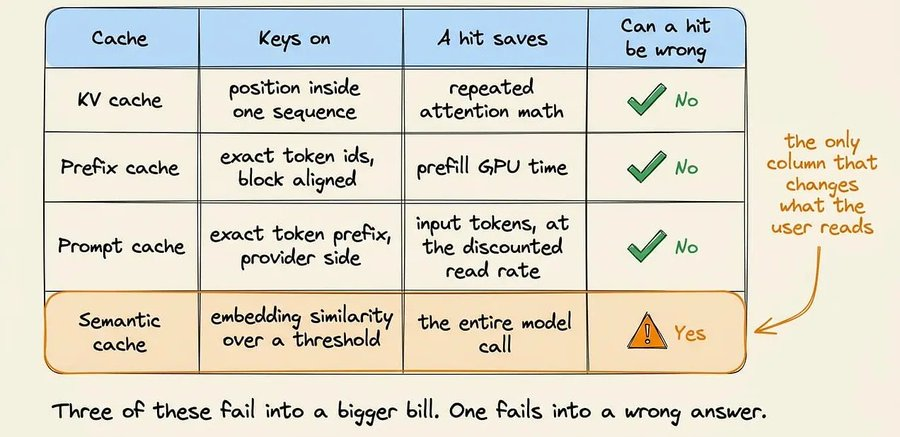

上面讨论的四种技术中，有三种对正确性没有影响，因此它们的 Cache Miss 只会体现在成本和延迟上，而不会影响其他方面。

Semantic Cache 的工作方式不同，因此在这里，命中率并不是一个合适的指标。

> 此外，还有第五种使用较少的缓存层：**精确匹配的 Response Cache**。当请求在字节层面完全一致时，它会直接返回已存储的答案。它和 Semantic Cache 一样，可以同时节省输入和输出，但不会产生误报风险，因为它完全不进行相似度匹配。你只需要先衡量请求在字节层面完全重复的比例，再决定是否需要使用 Embedding。当然，它也存在一些问题，相信到这里你应该已经能够发现。欢迎在回复中分享。

## 生产环境中的要点

在生产环境中使用这些技术之前，需要注意每种技术都存在一些可能导致失效的情况：

- 如果 Prompt 前面存在任何变量，例如 System Prompt 中的时间戳、请求 ID 或用户名，那么它后面的每个 Block 都会失效。始终将稳定内容放在前面，将可变内容放在最后，并在边界处设置标记。

  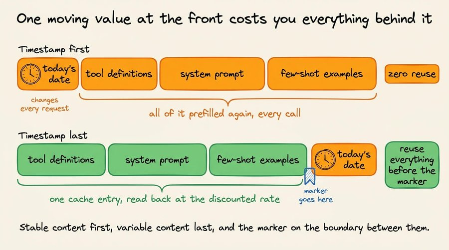

- Tool Schema 通常位于 System Prompt 之前，因此重新排序可能会使整个 Cache 失效。

- 检查那些会被渲染进 Prompt 的设置。在 Anthropic 中，切换 Web Search、Citations、Thinking 配置或 `tool_choice` 都会重写 Prompt 文本，并使后续 Block 失效。对两种不同的 Reasoning Effort 进行 A/B 测试，会将 Cache 一分为二。

- 总结历史记录会重写前缀，因此下一次调用需要以冷启动价格重新计算全部 Token。直接截断 Tool Output 可以保持前缀的字节级一致性，从而让 Cache 保持有效。

  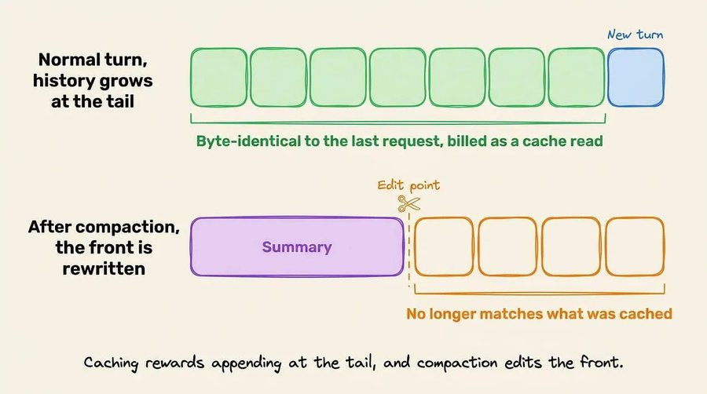

- Cache Entry 与模型绑定，因此即使将请求路由到更便宜的模型，也仍然需要以冷启动价格对已经累积的全部历史记录重新执行 Prefill。

  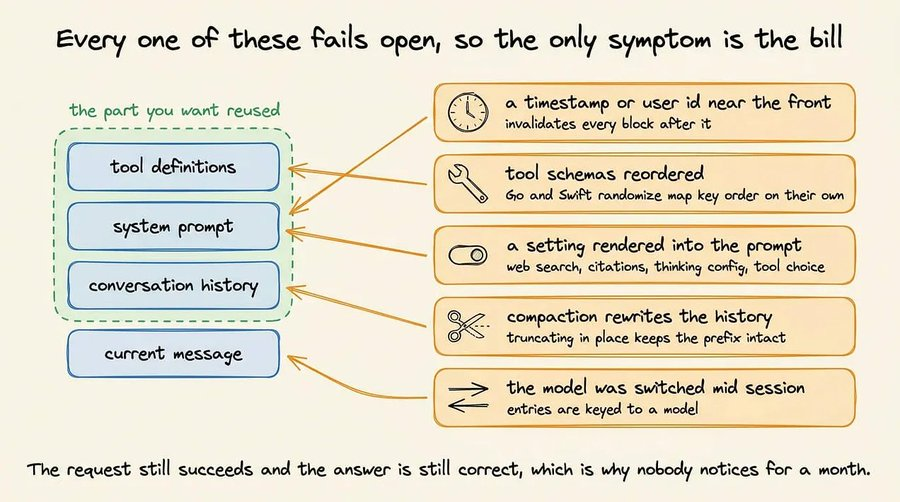

要准确确定两个 Prompt 从哪里开始不再匹配，应直接比较它们的 Token ID，而不是比较你记录下来的文本。下面是一个示例：

```
messages_turn_1 = [{"role": "user", "content": "What is the capital of France?"}]
messages_turn_2 = [{"role": "system", "content": "Today is Tuesday."},
                   {"role": "user", "content": "What is the capital of France?"}]

# tokenize=True 是默认值，并返回一个普通的 Token ID 列表
a = tokenizer.apply_chat_template(messages_turn_1)
b = tokenizer.apply_chat_template(messages_turn_2)

shared = 0
for x, y in zip(a, b):
    if x != y:
        break
    shared += 1

print(f"shared prefix: {shared} tokens of {len(a)} and {len(b)}")
print(f"first divergence at index {shared}: {a[shared:shared+8]} vs {b[shared:shared+8]}")

# 输出：
"""
shared prefix: 3 tokens of 35 and 26
diverges at index 3
  turn 1: [2683, 418, 253, 11173, 9042, 14260] You are a helpful AI assistant
  turn 2: [11814, 314, 27758, 30, 2, 198] Today is Tuesday.<|im_end|>
"""
```

两个在日志中看起来完全相同的 Prompt，可能会因为一个 Beginning-of-Sequence（BOS）Token、一个末尾换行符，或者重新序列化的 Tool Schema 而产生差异。

与其比较渲染后的文本，直接比较 Token ID 可以找到复用停止的准确位置；然后对差异位置两侧的少量 Token ID 进行解码，通常就能找到具体的文本差异。

上面的运行结果展示了一种常见情况。

第一轮没有指定 System Message，因此 Chat Template 自动填充了模型的默认内容。两个 Prompt 从索引 3 开始就出现了差异，因此无法进行任何复用。

**前三层本质上讲的是同一个概念，只是应用在三个不同的范围。**

- KV Cache 在单个请求持续期间保存 Attention 状态。
- Prefix Caching 在请求结束后继续保留这些状态，以便后续请求进行查找。
- Prompt Caching 则是服务提供商在自己的硬件上运行 Prefix Caching，并针对你复用的部分单独收取费用。

Semantic Cache 的工作方式不同。它根据 Embedding 相似度对 Response 文本进行索引，因此一旦命中，就会完全跳过模型，同时节省 Input Token 和 Output Token。命中也可能是错误的，而且发生这种情况时，仍然会以正常的成功状态返回。

轮到你了：这四种缓存层中，哪一种让你花费了最多的调试时间？


