# LLM输出一个token需要经历哪些步骤


从原理出发，带你了解清楚prompt输入到流式响应输出：**[tokenization](https://zhida.zhihu.com/search?content_id=274448078&content_type=Article&match_order=1&q=tokenization&zhida_source=entity)、embedding、attention、[prefill](https://zhida.zhihu.com/search?content_id=274448078&content_type=Article&match_order=1&q=prefill&zhida_source=entity)/decode拆分、KV Cache与量化**(quantization)。

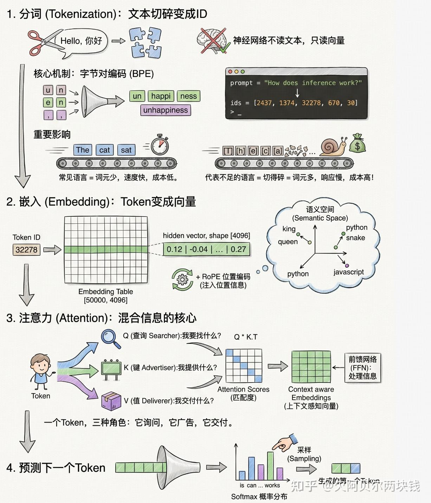

从你敲下按键到第一个词出现之间发生的事情，是现代计算中最精心设计的流水线之一。而最奇特的部分在于：同一个GPU、同一个请求中，模型会执行两种完全不同的任务来回答你。

一旦你看清楚这一点，就再也不会用同样的眼光看待 `generate()` 调用。

## 心智模型

一个大型语言模型（LLM）本质上是一个预测下一个token的神经网络。就只预测一个token。然后它把这个token拼接到你的prompt后面，再预测下一个。如此重复。

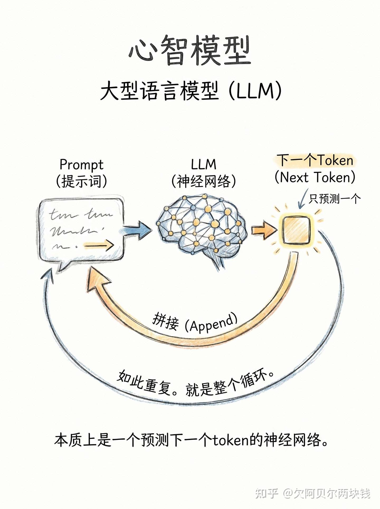

就是这样。这就是整个循环。

>  有趣的问题是：它到底如何预测下一个token？为什么第二个token出来得比第一个快得多？

## 步骤一：你的文本变成数字

神经网络不读英文。它们读向量。因此，你的提示词首先会经过**分词**（tokenization）：**将文本切碎，并为每一块分配一个整数 ID**。

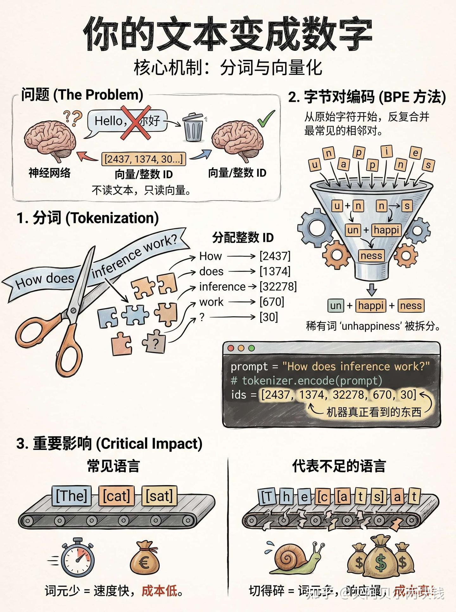

大多数现代 LLM 使用一种叫做**字节对编码**（Byte Pair Encoding, BPE）的方案。其思想是：从原始字符开始，反复合并最常见的相邻字符对，直到获得大约 5 万个词块组成的词汇表。像 `the` 这样的常见词得到一个token；像 `unhappiness` 这样的稀有词会被拆成 `un` + `happi` + `ness` 等片段。

```text
prompt = "How does inference work?"
ids = tokenizer.encode(prompt)
# ids -> [2437, 1374, 32278, 670, 30]
```

这一步的重要性远超人们通常的认识。**如果某些语言没有在分词器的训练数据中，语言会被切得更碎，这意味着更多的token数，进而导致处理同一句话时成本更高、响应更慢**。

## 步骤二：token变成一个向量

每个整数 ID 在一个称为**嵌入表**（embedding table）的大型矩阵中查找。如果你的模型词汇量是 5 万、隐藏维度是 4096，那么嵌入表的形状就是 `[50000, 4096]`。选中一行，就得到一个向量。

```text
# embedding_table has shape [vocab_size, hidden_dim]
vectors = embedding_table[ids]   # shape: [num_tokens, 4096]
```

这些向量并不是随机的。在训练过程中，模型会不断调整它们，使得语义相近的token在这个 4096 维空间中彼此靠近。`king` 和 `queen` 是邻居；`python` 和 `snake` 在一根轴上是邻居，`python` 和 `javascript` 在另一根轴上是邻居。

**embedding层也是位置信息被注入的地方，因为注意力机制本身并不知道哪个token在先。现代模型使用如 [RoPE](https://zhida.zhihu.com/search?content_id=274448078&content_type=Article&match_order=1&q=RoPE&zhida_source=entity)（旋转位置编码）等方案，根据token在序列中的位置旋转向量**。

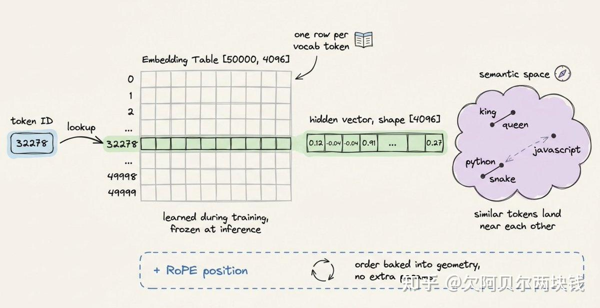

## 步骤三：注意力

现在真正的工作开始了。你的向量序列被送入一堆 Transformer 层（通常有 32 层或更多），一层接一层地处理。每一层大致做相同的事情：

- 使用**自注意力**（self-attention）在token之间混合信息；
- 使用**前馈网络**（[feed-forward network](https://zhida.zhihu.com/search?content_id=274448078&content_type=Article&match_order=1&q=feed-forward+network&zhida_source=entity)）在每个token内部混合信息。

自注意力是值得深入理解的部分。对于每个token，该层通过与其三个学习到的权重矩阵相乘，生成三个新向量：

```text
# x is the input to this layer, shape [num_tokens, hidden_dim]
Q = x @ Wq   # 查询（queries）
K = x @ Wk   # 键（keys）
V = x @ Wv   # 值（values）
```

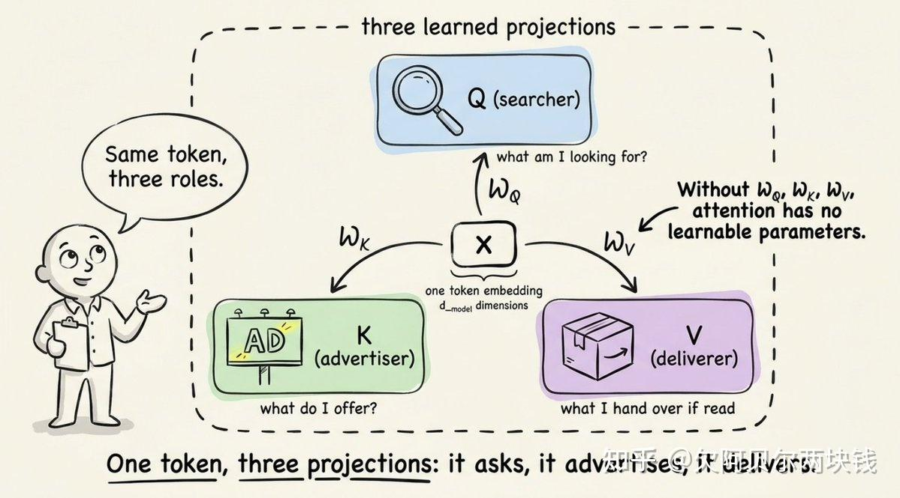

>  现在每个token都有三个视图：Q(query) K(key) V(value)。关键技巧在于：每个token使用它的query去查看所有其他token的key，匹配的强度决定了有多少那个其他token的值被混合进来。
>  

```text
# scores: how much each token attends to every other token
raw     = Q @ K.T
scaled  = raw / sqrt(hidden_dim) # 使 softmax 更稳定
weights = softmax(scaled)        # 每个token一行，总和为 1
attention_output = weights @ V
```

以下是上述过程的视觉表示：

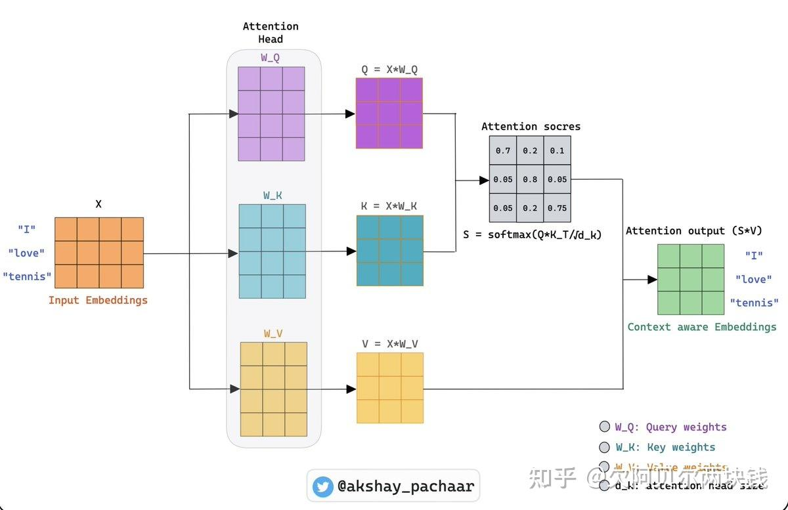

这就是神奇的地方。一个token通过环顾四周并拉取任何有用的信息，来决定它需要什么上下文。堆叠 32 层这样的结构，你就得到了一个能够跨成千上万个token追踪指代关系的模型。

注意力之后，每个token的向量会经过一个小型的两层前馈网络，这个网络承载了模型大部分的实际“知识”。**注意力负责移动信息，前馈网络则负责处理信息**。


## 步骤四：预测下一个token

在最后一层之后，模型取最后一个位置的向量，将其投影回词汇表大小，然后应用 softmax 得到每个可能的下一个token上的概率分布。从这个分布中采样，你就得到了第一个生成的token。

现在到了有趣的部分。

## Prefill&Decode

生成一个 200 token的响应并不是一个任务。它是两个在底层看起来完全不同的任务。

### 阶段 1：预填充（Prefill）

**当你提交prompt时，模型必须先处理所有输入token，然后才能生成任何内容。好消息是：它可以并行处理所有这些token。每个token的 Q、K、V 都是同时计算的。注意力作为大型矩阵乘矩阵运算运行**。

GPU 喜欢这种模式。矩阵乘矩阵正是它们的设计目标。这里的瓶颈是原始算术吞吐量：**GPU 以高利用率满载运行，全力进行数学运算**。

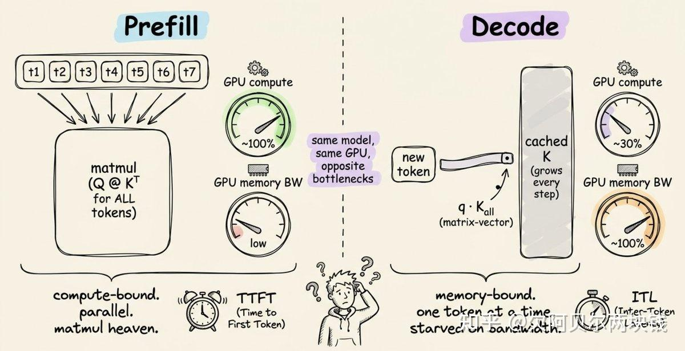

这一阶段的度量指标是**首token时间**（Time to First Token, TTFT）。它是第一个词出现在你屏幕上之前的空闲等待时间。

```python
# Prefill: process the whole prompt in one shot
hidden = embed(prompt_tokens) + positions
for layer in model.layers:
    Q, K, V = project(hidden)             # 一次性处理所有token
    hidden  = attention(Q, K, V) + hidden
    hidden  = feedforward(hidden) + hidden
    cache_kv(layer, K, V)                 # 存起来供后面使用
first_token = sample(project_to_vocab(hidden[-1]))
```

### 阶段 2：解码（Decode）

第一个token输出后，模型切换模式。为了生成第 51 个token，它只需要计算这一个新token的 Q、K 和 V。之前的 50 个token呢？它们的 K 和 V 向量没有变化。重新计算它们将是浪费。

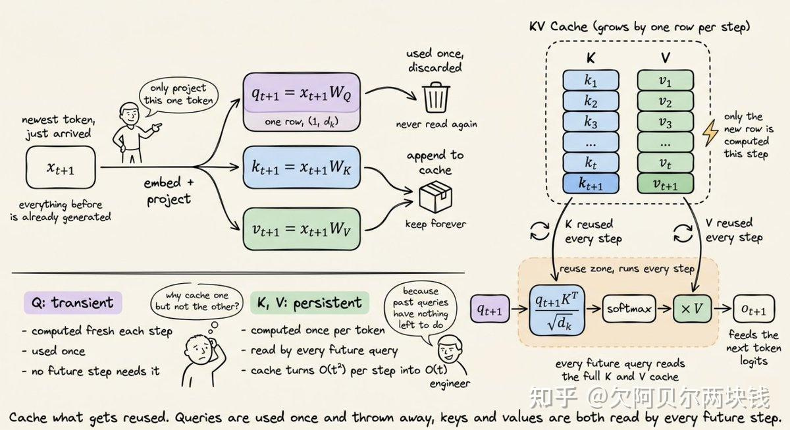

于是模型进入循环，一次一个token：

```python
# Decode: one token per iteration
token = first_token
steps = 0
while token != STOP and steps < MAX_STEPS:
    x = embed(token) + position(steps)
    for layer in model.layers:
        q, k, v = project(x)
        K_all, V_all = caches[layer].append(k, v) # 缓存的旧内容 + 新内容
        x = layer.forward(q, K_all, V_all, x)  # 注意力 + 前馈 + 残差连接
    token = sample(project_to_vocab(x))
    steps += 1
    yield token
```

**两者的区别**

- **Prefil**:是"查询矩阵(Q)*键矩阵(K)”(大规模并行计算)
- **Decode**:变成“查询向量*键矩阵(K)”(单token小计算)

计算量变得很小。

**但是 GPU 仍然必须从内存中加载每一个权重矩阵以及每一个缓存的 K 和 V 向量，来执行这个小计算。这里有个挑战就是芯片有大量空闲的计算能力，却只能干等着内存送来下一块数据**。

>  这就是为什么**解码是内存带宽受限**（memory-bound）而**预填充是计算受限**（compute-bound）的原因。同一个模型、同一块硬件，性能特征却完全不同。
>  

这一阶段的度量指标是**token间延迟**（Inter-Token Latency, ITL）：**流式输出中连续两个token之间的间隔。低的 ITL 能让模型感觉很快**。


## KV 缓存：让一切可行的优化

上面代码中的 `append_to_cache` 那一行承担了所有重活。如果没有 KV 缓存，生成一个 1000 token的响应意味着在每一步都要重新计算整个增长序列的注意力，复杂度是 $O(n^2)$​

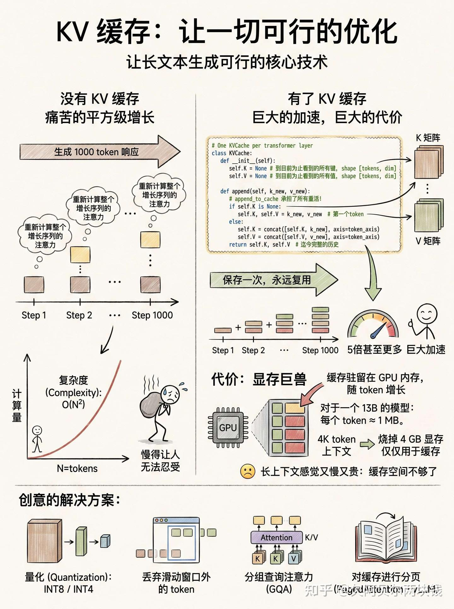

有了 KV 缓存，你可以保存 K 和 V 矩阵一次，然后永远复用它们。以下是其大致形态：

```python
# One KVCache per transformer layer 
class KVCache:
    def __init__(self):
        self.K = None # 到目前为止看到的所有键，   shape [tokens, dim]
        self.V = None # 到目前为止看到的所有值， shape [tokens, dim]

    def append(self, k_new, v_new):
        if self.K is None:
            self.K, self.V = k_new, v_new  # 第一个token
        else:
            self.K = concat([self.K, k_new], axis=token_axis)
            self.V = concat([self.V, v_new], axis=token_axis)
        return self.K, self.V  # 迄今完整的历史
```

这种加速是巨大的。对于长文本生成，通常能达到 5 倍甚至更多。但代价是：**缓存驻留在 GPU 内存中，并且随着每个token增长。每一层都保留自己的 K 和 V 张量。对于一个 13B 的模型，每个token大约需要 1 MB。一个 4K token的上下文就会烧掉 4 GB 的显存，仅仅用于缓存**。

这就是为什么长上下文感觉又慢又贵。不是模型脑子不够用了，而是缓存空间不够了。

>  解决方案很有创意：将缓存量化为 INT8 或 INT4；丢弃滑动窗口外的token；在注意力头之间共享 K 和 V（分组查询注意力，grouped-query attention）；或者像操作系统管理内存页面一样对缓存进行分页（PagedAttention —— vLLM 背后的技巧）。

## 前沿研究：缩减缓存自身大小

量化(Quantization)和分页(paging)将缓存视为固定成本。2025 年末预告的 DeepSeek V4 系列采取了更激进的路线：重新设计注意力机制，使缓存从一开始就很小。

他们的混合方案结合了两种压缩注意力变体，一种稀疏、一种密集，都在高度压缩的 KV 流上运行。在百万token上下文中，V4-Pro 报告的缓存大小约为前代的 10%，每个token的计算量约为V3的 27%。

这里的关键点不是具体的架构，而是 KV 缓存已经成为瓶颈，整个领域现在正围绕它来优化模型。当注意力机制本身都在为了最小化缓存而被重新设计时，你就知道约束条件已经转移了。

如果你想了解长上下文推理的发展方向，值得一读。完整的技术报告在这里：[DeepSeek-V4 论文](https://link.zhihu.com/?target=https%3A//example.com/)

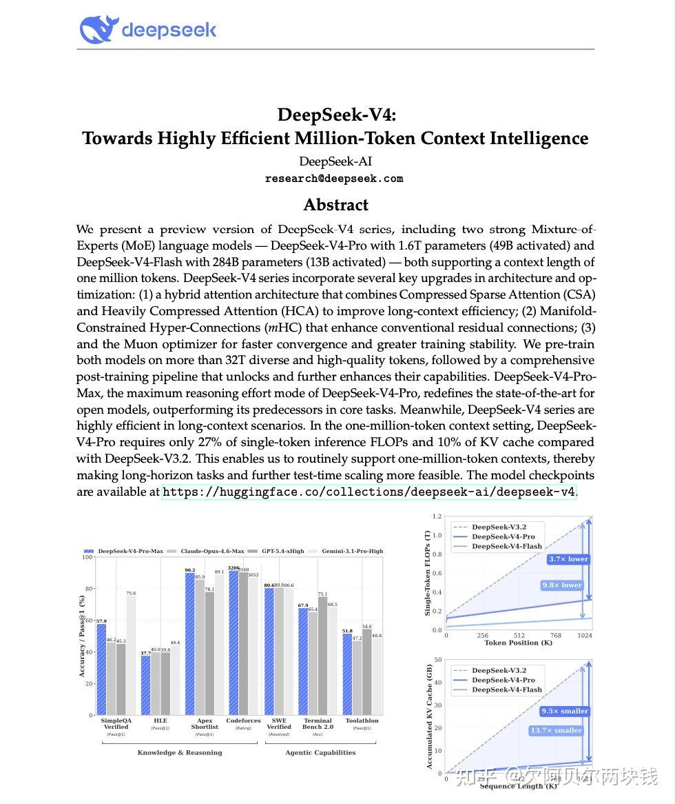

## 量化：用比特换速度

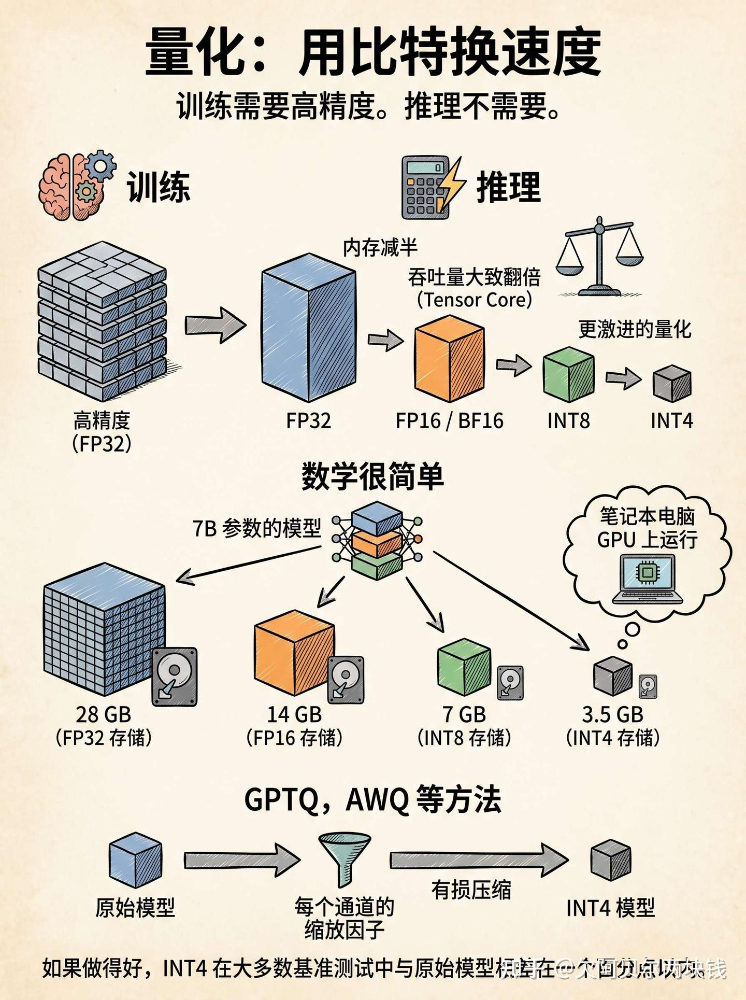

训练需要高精度。推理不需要。

大多数生产部署使用 FP16 或 BF16 而不是 FP32，这可以使内存减半，并在 Tensor Core 上大致提高一倍吞吐量。更激进的配置会进一步将权重量化为 INT8 甚至 INT4。

数学很简单。一个 7B 参数的模型需要：

- **28 GB 以 FP32 存储**
- **14 GB 以 FP16 存储**
- **7 GB 以 INT8 存储**
- **3.5 GB 以 INT4 存储**

最后一个数字解释了为什么你可以在笔记本电脑 GPU 上运行一个 7B 模型。GPTQ、AWQ 等方法会选择每个通道的缩放因子，以使有损压缩对质量的伤害尽可能小。

>  如果做得好，INT4 可以在大多数基准测试中与原始模型相差在一个百分点以内。

## 把它们拼在一起

这是一个提示词的完整旅程，从输入到输出：

1. **分词**：文本变成整数 ID。
2. **嵌入**：ID 变成向量。位置信息被折叠进去。
3. **预填充**：每一层并行处理所有输入token。计算受限。KV 缓存被填充。第一个输出token弹出。
4. **解码循环**：对于每个新token：投影新token的 Q；在缓存的 K 和 V 上做注意力；运行前馈网络；采样。将新的 K 和 V 追加到缓存。内存带宽受限。
5. **去分词**：token ID 被映射回字符，并流式传输到你的屏幕。

现代的推理服务框架如 vLLM、[TensorRT-LLM](https://zhida.zhihu.com/search?content_id=274448078&content_type=Article&match_order=1&q=TensorRT-LLM&zhida_source=entity) 和 Text Generation Inference 将这个循环与**连续批处理**（多个用户的token在同一个 GPU 步幅中交错）、**推测解码**（一个小模型起草token，大模型验证）和聪明的内存管理结合起来。这就是为什么一个 GPU 可以为几十个并发用户提供服务。

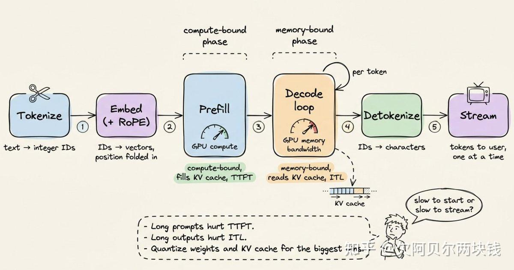

## 这应该会改变你的思考方式

一旦这个图景清晰起来，就会有一些实用的启示：

- **长提示词在 TTFT 上昂贵，长输出在 ITL 上昂贵**。它们压榨的是不同的资源。根据用户实际感受到的痛点进行优化。
- **上下文长度不是免费的**。将其翻倍不只会翻倍计算量，还会膨胀 KV 缓存并饿死批处理大小。
- **量化是你拥有的最高杠杆的旋钮**。从 FP16 降到 INT8 通常能将延迟减半，而质量损失可以忽略不计。
- **GPU 利用率可能具有误导性**。在预填充期间跑满 GPU 的模型，在解码期间可能只有 30% 的利用率。解决方法不是更多的计算，而是更快的内存或更小的缓存。

Transformer 架构吸引了所有注意力，但推理性能取决于那些枯燥的东西：**内存布局、缓存管理、数值精度**。真正的艺术在于从你手头的硬件中榨取出最多的性能。

>  现在，当有人告诉你他们的模型慢的时候，你会知道先问哪个问题：是**启动慢**（slow to start），还是**流式输出慢**（slow to stream）？
>
>  [https://x.com/akshay_pachaar/status/2050941458614751327](https://link.zhihu.com/?target=https%3A//x.com/akshay_pachaar/status/2050941458614751327)


