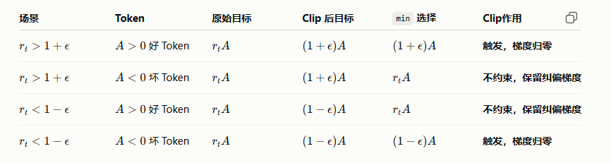

# PPO、GRPO为什么需要Clip？

> 在PPO/GRPO算法中，Clip机制是保障模型稳定训练的关键，设计本质为：
>
> Clip 机制根据 Token 的优劣（$A>0$ 或 $A<0$）以及新策略相对于旧策略的概率变化方向（$r_t>1$ 或 $r_t<1$），形成四种不同的作用模式：
>
> 1. **$A>0,\ r_t>1+\epsilon$：** 好 Token 的概率提升过快，Clip 限制继续向好方向过度更新，梯度被截断为 0。
> 2. **$A>0,\ r_t<1-\epsilon$：** 好 Token 的概率下降过多，属于错误方向的更新，Clip 不进行截断，保留纠偏梯度，推动模型重新提高该 Token 的概率。
> 3. **$A<0,\ r_t<1-\epsilon$：** 坏 Token 的概率下降过快，虽然方向正确，但 Clip 限制继续大幅降低其概率，梯度被截断为 0。
> 4. **$A<0,\ r_t>1+\epsilon$​：** 坏 Token 的概率反而提升过多，属于错误方向的更新，Clip 不进行截断，保留惩罚梯度，推动模型降低该 Token 的概率。
>
> **Clip 机制的核心思想是：对于已经朝正确方向但更新幅度过大的行为进行限制；而对于朝错误方向的行为不进行截断，使梯度继续发挥作用，从而将模型从错误方向拉回正确方向。**

## 公式回顾

GRPO的核心[目标函数](https://zhida.zhihu.com/search?content_id=270199229&content_type=Article&match_order=1&q=目标函数&zhida_source=entity)包含裁剪项：
$$
\mathcal{L}_{\mathrm{GRPO}}(\theta)
=
-\frac{1}{G}
\sum_{i=1}^{G}
\frac{1}{|o_i|}
\sum_{t=1}^{|o_i|}
\left[
\min
\left(
\frac{\pi_{\theta}(o_{i,t}\mid q,o_{i,<t})}
{\pi_{\theta_{\mathrm{old}}}(o_{i,t}\mid q,o_{i,<t})}
\hat{A}_{i,t},
\operatorname{clip}
\left(
\frac{\pi_{\theta}(o_{i,t}\mid q,o_{i,<t})}
{\pi_{\theta_{\mathrm{old}}}(o_{i,t}\mid q,o_{i,<t})}
,1-\epsilon,1+\epsilon
\right)
\hat{A}_{i,t}
\right)
-\beta D_{\mathrm{KL}}
\left[\pi_{\theta}\|\pi_{\mathrm{ref}}\right]
\right]
$$
其中：
$$
r_t(\theta)
=
\frac{
\pi_{\theta}(o_{i,t}\mid q,o_{i,<t})
}{
\pi_{\mathrm{old}}(o_{i,t}\mid q,o_{i,<t})
}
$$
**为重要性采样权重，数学上代表新策略和旧策略的逐token的概率比**（记为$r_t$）。

分三种情况，结合优势函数 $$A$$（衡量 token 优劣，$$A > 0$$ 为好 Token，$$A < 0$$ 为坏 Token），分析 Clip 机制在不同场景的作用。

## Clip机制的三种作用场景

**情况一：** $$r_t$$ 在正常区间 $$[1-\epsilon, \ 1+\epsilon]$$

此时新策略的变化处于预设的“安全区”内，**不触发 Clip 机制**，模型将按照原始梯度进行正常更新。

**情况二：** $$r_t > 1+\epsilon$$ （新策略概率显著增加）

该场景下模型试图“大幅度跨步”调整策略，Clip 机制会根据 Token 的优劣呈现不同作用：

1. $$A > 0$$ （**好 Token**）：新策略找到更优路径，且生成该好 Token 的概率大幅提升，按常规应给予大幅奖励，但此时 Clip 机制触发。因 $$A$$ 为正，**min 函数**会选择被截断的 $$(1+\epsilon)A$$，最终对应 Token 的**梯度归零**，**限制模型向好方向更新过快**，避免过拟合或策略调整幅度过大导致模型训练崩溃。

2. $$A < 0$$ （**坏 Token**）：模型生成烂 Token 的概率反而变大，属于**“执迷不悟”的错误行为**。尽管 Clip 将该项截断在 $$1+\epsilon$$，但因 $$A$$ 为负，$$r_tA$$ 会变得“极小”（负得更多），min 函数会选择未被截断的 $$r_tA$$。此时 **Clip 机制不起约束作用**，模型更新完全由 $$r_tA$$ 决定，不会限制对这种放大错误的行为进行惩罚。

**情况三：** $$r_t < 1-\epsilon$$ （新策略概率显著降低）

该场景下模型试图“大幅度躲避”原有策略，Clip 机制的作用同样随 Token 优劣变化：

1. $$A > 0$$ （**好 Token**）：**模型生成正确答案的概率下降，相当于“不小心丢掉好东西”，此时** Clip 机制不生效，**模型更新遵循标准的重要性采样梯度。从数学上看，更新幅度会随 $$r_t$$ 自然缩小**；从直觉上，模型虽意识到该 Token 为好 Token，但自身**置信度**较低，因此更新行为会更保守。

2. $$A < 0$$ （**坏 Token**）：模型生成烂 Token 的概率显著变小，属于“知错就改”的良好表现，此时 **Clip 机制触发**，对于这类已经“躲得足够远”的样本，其梯度会被置零。

>意义：对于已经朝正确方向调整且变化幅度已经过大的 Token，Clip 会将其梯度置零，使其在当前 Batch 中不再继续推动模型更新。这样可以避免模型对已经学会的行为继续过度调整，从而保护已有能力并提高训练稳定性。

