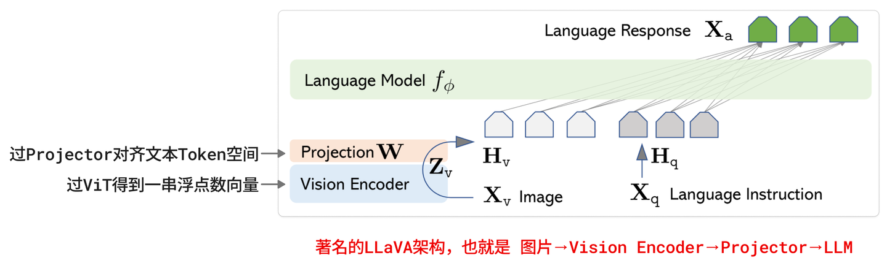
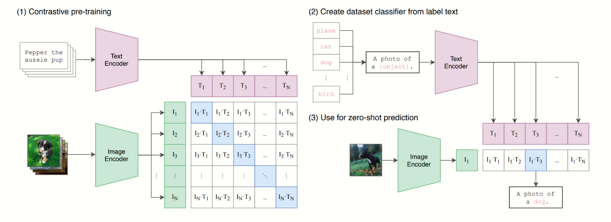
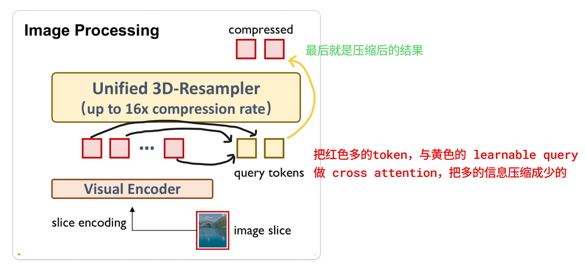
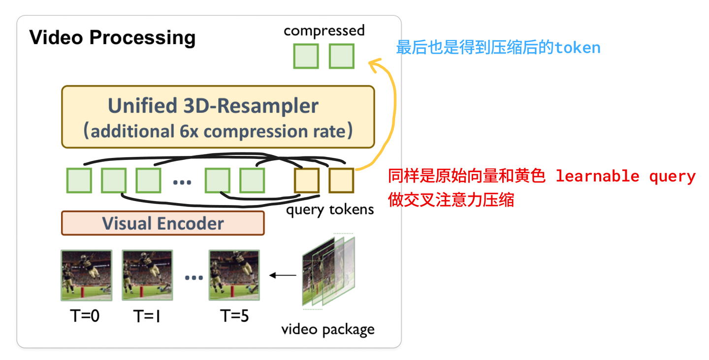
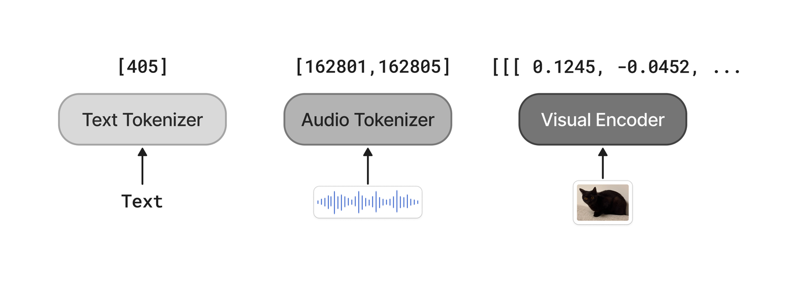

## Vision Tokenizer：其实它是伪 Tokenizer？

如果说文本 Tokenizer 是在查字典，音频 Tokenizer 是在做量化，那么视觉的处理方式则完全是个另类。

在目前最主流的多模态模型架构（如 Qwen-VL、MiniCPM-V）中，大部分视觉模型其实并没有真正的Tokenizer（指把数据变成 1, 2, 3 这种整数 ID）。

相反，它走的是一条连续特征直通的道路。



​                                                                           *LLaVA架构图*

### 1. 视觉的基础：ViT 的切片与编码

一切依然始于 ViT (Vision Transformer)。它的第一步操作我们很熟悉：

- **打碎成块 (Patching)** ：把一张图片像切豆腐一样，切成一个个固定大小的方块（比如 14  × 14 像素）。

- **特征提取 (Encoding)** ：这些方块被喂给 Vision Encoder（比如 CLIP 或 SigLIP）。

  

​                                                                                             *CLIP*

关键的分歧点来了： 在文本处理中，我们是把“苹果”映射成 ID `1001`。 但在视觉处理中，ViT 输出的直接就是一串浮点数向量（Embedding）。

```python
长这样
tensor([[[ 0.1245, -0.0452,  0.8821,  ...,  0.0012],
         [ 0.3312,  0.1098, -0.5521,  ..., -0.1243],
         ...
         [-0.0982,  0.4431,  0.2210,  ...,  0.6789]]])
```

你可以把这串向量理解为图片方块的数学指纹。这枚指纹里包含了“这是一只猫”、“毛色是白的”等抽象信息。

### 2. 投影层 (Projector)：跨越物种的翻译官

ViT 提取出来的指纹（比如维度是 1024 维），大模型（LLM）是看不懂的。因为大模型预期的输入维度可能高达 4096 维，而且处于完全不同的语义空间。

为了让图片能进入 LLM，我们需要一个翻译官，也就是投影层（Projector）。通常它是一个简单的线性层（Linear Layer）或 MLP。

> 它的作用简单粗暴：把 ViT 输出的图片向量，强行拉伸、变换，让它在数学形状上长得和文本向量一模一样。

经过投影层处理后的这些向量，在学术界被称为 Soft Tokens（软 Token）。

为什么叫软？

- **Hard Token (文本)** ：有一个具体的 ID（如 501）。对应词表里确定的某一行。
- **Soft Token (视觉)** ：它直接是一串浮点数，在词表里找不到对应的 ID。

当这些 Soft Tokens 被喂给大模型时，大模型根本不管它有没有 ID，直接把它当成已经 Embedding 好的文本向量来处理。

**所以在模型眼里，情况是这样的：**

> 输入序列 = `[图片向量1, 图片向量2, ..., 图片向量N]` + `[文本向量(一只小猫)]`

模型不需要知道图片对应哪个字，它只需要看到这些向量，脑海里就能浮现出画面的语义。这就是为什么我们说主流视觉模型是 Continuous（连续）的，而不是 Discrete（离散）的。

### 3. 3D-Resampler：视觉 Token 的极致压缩机

早期的多模态模型（比如原始的 CLIP）处理图片时，简单粗暴：不管你输入的是一张高清海报还是一张长长的购物小票，它直接给你暴力压缩成 224 × 224 或 336 × 336  的正方形。

这就像把一张报纸硬生生缩印到指甲盖那么大，字都糊成马赛克了，模型当然变成了文盲。

> 为了让小模型也能看懂高清大图和长视频，MiniCPM-V 4.5 搞出了一个 Token 处理机制——Unified 3D-Resampler（统一 3D 重采样器）。

为什么需要这个东西？因为视觉数据的Token 膨胀太恐怖了。

MiniCPM-V 系列采用了一种更符合直觉的策略——自适应切片：

- **不缩放，只切割**：如果你甩给模型一张长图，Tokenizer 绝不会把它挤压变形，而是根据原始长宽比，把它切成多个 448 × 448 的高清小方块（Slices）。
- **位置编码**：每个切片都会被打上坐标 ID。模型知道 Token A 在左上角，Token B 在右下角。

切片虽然保留了细节，但也带来了一个致命问题：**Token 数量爆炸**。

一张高清图切完可能会产生几千个 Token。对于大模型来说，这就像是让你一口气读完半本字典，显存瞬间就爆了。

为了解决这个问题，MiniCPM-V 4.5 引入了 Unified 3D-Resampler。

它的作用就像是一个高强度的信息抽取浓缩机。它不再机械地把每个像素块都转成 Token，而是通过交叉注意力机制，用一组可学习的 Query（查询向量）去榨干图像里的水分。

- **输入**：一个  448 × 448 的高清切片（注意，这里只是一个图片的一个切片，输入的图片宽高是任意的）。
- **输出**：仅 64 个压缩后的 Visual Tokens。 要知道，传统方法（如 MLP）通常需要 256 个 Token 才能表达同样的信息。MiniCPM 直接把 Token 密度压缩了 4 倍，且精度不减。



​                                                                    *MiniCPM4.5-V 图片处理*

### 4. 视频处理：连时间一起折叠

**视频本质上就是一堆连续的图片**。如果每一帧都单独切片编码，一段 1 分钟的视频能产生数万个 Token，直接撑爆 LLM 的上下文窗口。

MiniCPM-V 4.5 的 3D-Resampler 既然叫3D，是因为它把时间这个维度也算进去了。

它发现视频里相邻的几帧其实长得差不多（背景不动，只有人在动）。于是，Tokenizer 不再是一张张看图，而是一次性抓取一个时空块。

效果有多夸张？我们直接看论文里的实测数据： 处理一段 6秒钟、2fps、分辨率 448 × 448 的视频：

- **Qwen2.5-VL** 需要消耗 1,536 个 Token。
- **InternVL3** 需要消耗 3,072 个 Token。
- **MiniCPM-V 4.5** 仅仅需要 128个 Token。

MiniCPM-V 4.5 将视频的 Token 密度压缩了 12 到 24 倍。



​                                                                  *MiniCPM4.5-V 视频处理*

## 大一统的奥秘：为什么统一 Token 表示改变了一切？

讲完了文本、音频和视觉的切分，你可能会发现一个关键点：**无论输入的是文本、音频还是图片，它们经过各自的 Tokenizer、编码器或特征提取器后，最终都可以被转换成 Transformer 能够处理的 Token 序列或连续向量表示。**

这意味着，不同模态不再需要完全独立的模型来进行理解，而是可以被映射到统一的 Transformer 表示与计算框架中。

对于采用自回归生成范式的多模态大模型而言，这种统一表示进一步使得不同模态的信息可以共同参与上下文建模，并通过 **Next Token Prediction（下一 Token 预测）** 的方式进行生成。

简单来说：

```
文本 ──→ Text Tokens ──────┐
                          │
图片 ──→ Visual Tokens ────┤
                          ├──→ Transformer → 后续 Token
音频 ──→ Audio Tokens ─────┘
```



​                                                                                       *全模态 token 化*

### 1. 训练的极简化：让多模态共享同一种处理框架

在过去，我们要训练一个能听会看的模型，往往需要把语音识别、图像理解和语言模型等多个模块拼接起来，不同模态之间还需要额外设计复杂的接口。

但现在，多模态模型可以采用一种更加统一的思路：

- **统一编码**：文本、图片、音频等不同模态，分别经过各自的 Tokenizer 或编码器，将原始数据转换成模型可以处理的 Token 序列或连续向量表示。
- **统一输入**：对于 Transformer 而言，它不需要关心输入最初是文字、图片还是声音。经过编码和映射后，这些信息都可以作为序列中的输入表示，与其他模态的信息一起参与上下文建模。
- **统一建模**：模型不再需要针对每种模态设计一套完全独立的推理逻辑，而是可以在统一的 Transformer 框架中进行序列建模，根据上下文预测后续 Token 或生成相应的输出。

### 2. 推理的一体化：跨模态信息可以直接参与建模

传统的语音交互系统往往采用串联式架构：先通过语音识别（ASR）将声音转换成文本，再由语言模型进行理解和推理，最后通过文本转语音（TTS）生成声音。

而原生多模态模型则可以让不同模态的信息直接进入同一个模型的上下文。例如，音频经过编码后，可以形成模型能够处理的 Audio Tokens 或连续音频表示；视觉信息也可以经过 Vision Encoder 和 Projector / Resampler 转换成 Visual Tokens。它们随后可以与文本信息一起输入 Transformer，进行统一的上下文建模。