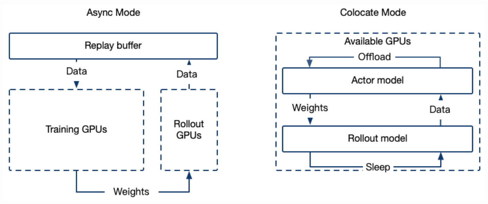
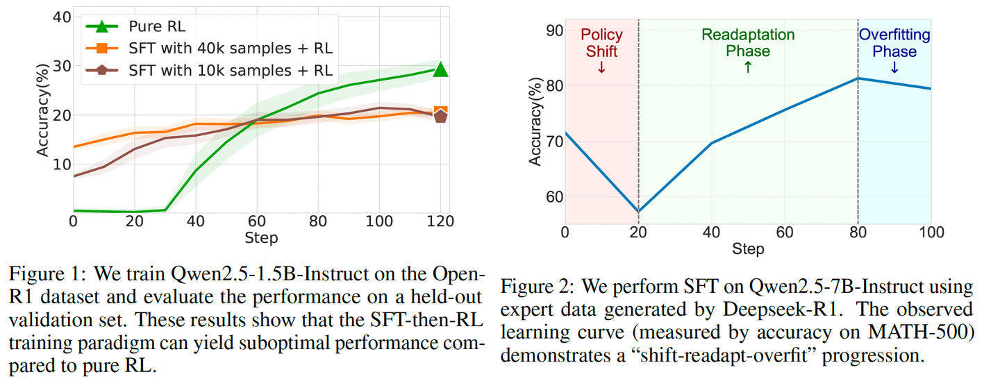
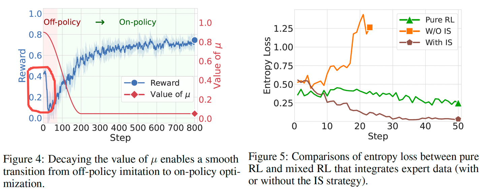
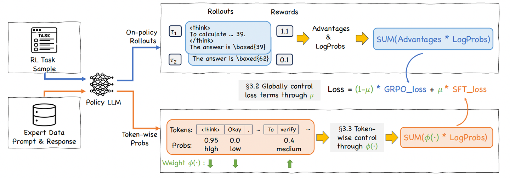

# 【多模态】Qwen3-VL的强化微调

## 0 环境安装

```bash
conda create -n swift python==3.10
conda init
conda activate swift

# 安装swift，源代码安装
git clone https://github.com/modelscope/ms-swift.git 
cd ms-swift 
pip install -e .

# 安装transformer==4.57.0和qwen-vl-utils==0.0.14，是qwen3-vl的要求
pip install transformers==4.57.0 qwen-vl-utils==0.0.14 vllm==0.11.0 -i https://mirrors.tuna.tsinghua.edu.cn/pypi/web/simple
```

qwen3-vl模型下载

```python
#模型下载
from modelscope import snapshot_download
model_dir = snapshot_download('Qwen/Qwen3-VL-8B-Instruct',cache_dir='预期下载的路径')
```

## 1 SFT阶段

微调模型最重要的步骤是准备好数据集，和数据对应的jsonl文件，训练数据可以是query-response-images格式的，其中"\<image>"表示这个位置是一张图片，图片的位置在后面images的列表里面，有多少个"\<image>"标签，“images“列表里面就多少个地址，报错一般就是地址不对，以及注意地址是一个列表。

```bash
#jsonl格式的数据
{"query": "<image>你是一个图片描述专家，请描述这张图", "response": "66666", "images": ["image_path"]}
{"query": "eeeee<image>eeeee<image>eeeee", "response": "fffff", "history": [], "images": ["image_path1", "image_path2"]}
{"query": "EEEEE", "response": "FFFFF", "history": [["query1", "response2"], ["query2", "response2"]], "images": []}
```

模型训练脚本train_sft.sh：

```sh
CUDA_VISIBLE_DEVICES=0,1,2,3 MAX_PIXELS=1605632 swift sft \
--model 本地模型路径 \ # 本地模型路径，填写绝对路径，例如/xxx/xxx/
--dataset train_data.jsonl \  # 训练数据集
#-- val_dataset eval_data.jsonl \ # 验证集
--sft_type lora \   # lora微调/full为全参微调
--lorap_lr_ratio 10 \ #lora+的方式
--freeze_vit false \   # 如果为true，不微调vit模块
--freeze_aligner false \  # 如果为true，不微调merger模块
--freeze_llm false \    # 如果为true，不微调llm模块
#--freeze_parameters_ratio 0. \ # freeze参数的比例，sft_type=full的时候可以设置
--per_device_train_batch_size 1 \  # 训练数据上的batch_size
--per_device_eval_batch_size 1 \   # eval_set上的batch_size
--split_dataset_ratio 0.1 \   # 训练集里面多大比例作为验证集，如果没有输入验证集的话
--output_dir /home/xxx/output_dir/ \
--num_train_epochs 6 \   # epoch数，完整见过训练集的次数，以epoch为单位，收敛即可
--save_steps 20 \
--eval_steps 20 \
--save_total_limit 2 \  # 最大保存模型次数，为2时会保存验证集loss最小的模型和最后一个模型，不一定loss最小的模型最好，收敛情况下最后一个模型可能更好
--logging_steps 10 \  
--seed 42 \
--learning_rate 1e-4 \  # 学习率
--init_weights true \
--lora_rank 8 \    # lora的r
--lora_alpha 32 \
--adam_beta1 0.9 \
--adam_beta2 0.95 \
--adam_epsilon 1e-08 \
--weight_decay 0.1 \
--gradient_accumulation_steps 16 \  # 每一个step模型见过的数据是per_device_train_batch_size*gradient_accumulation_steps，这两个相乘为16比较好
--max_grad_norm 1 \
--lr_scheduler_type cosine \
--warmup_ratio 0.05 \
--warmup_steps 0 \
--gradient_checkpointing false   # 开启梯度检查点为true时训练会变慢
```

- 如果想比较优雅，可以把system prompt单独传入:

  ```sh
  --system 'You are a helpful assistant. You first thinks about the reasoning process in the mind and then provides the user with the answer.' \
  
  或者
  --system './system_prompt.txt'
  ```

  merge_lora.sh执行后会生成checkpoint-xxx-merged/

  ```bash
  swift export \
      --adapters output/vx-xxx/checkpoint-xxx \
      --merge_lora true
  ```


## 2 GRPO阶段

### 2.1 奖励函数设计

- 可以先写一个随机奖励的函数来测试，如果这个函数生成的reward还有方差都正常，再替换就可以，注意导入from swift.plugin import ORM, orms，同时在最下面进行注册

  ```python
  # RandomReward.py
  
  import random
  import logging
  from typing import List
  from swift.plugin import ORM, orms
  
  # 配置日志
  logging.basicConfig(
      level=logging.INFO,
      format='[RandomReward] %(message)s',
      handlers=[
          logging.FileHandler("random_reward_debug.log"),
          logging.StreamHandler()
      ]
  )
  logger = logging.getLogger(__name__)
  
  class RandomReward(ORM):
      """
      调试专用：返回随机 reward
      目的：确认 Swift 是否正确调用 reward function，并传递梯度
      """
      def __call__(self, completions: List[str], solution: List[str], **kwargs) -> List[float]:
          batch_size = len(completions)
          # 生成 [0.1, 1.0] 之间的随机 reward
          rewards = [round(random.uniform(0.1, 1.0), 4) for _ in range(batch_size)]
  
          logger.info(f"Random rewards generated: {rewards}")
          logger.info(f"completions: {[(c[:50] + '...') if len(c) > 50 else c for c in completions]}")
          logger.info(f"solution: {[(s[:50] + '...') if len(s) > 50 else s for s in solution]}")
  
          return rewards
  
  # 注册到 swift
  orms['random_reward'] = RandomReward
  ```

  

### 2.2 roll-out使用Async的server模式

- GRPO的介绍可以参考[ms-swift文档的介绍](https://link.zhihu.com/?target=https%3A//swift.readthedocs.io/zh-cn/latest/Instruction/GRPO/GetStarted/GRPO.html)
- 特别的，有2种模式，Colocate(Internal) Mode和Async(External) Mode，Async模式训练与推理资源分离，启动单独的推理服务器



要进行训练，首先部署好roll-out的server：

```bash
CUDA_VISIBLE_DEVICES=4 MAX_PIXELS=1605632 swift rollout \
--model 模型地址 \
--max_new_tokens 4096 \
--infer_backend vllm \
--vllm_gpu_memory_utilization 0.9 \
--vllm_max_model_len 12288 \
--temperature 1.0 \ #这里要高点
--served_model_name Qwen3-VL-8B-Instruct \
--vllm_limit_mm_per_prompt '{"image": 2, "video": 0}' \ # 最多2张图，没有视频
--port 9008
```


### 2.3 GRPO的数据集格式

- 和SFT以及其他的RLHF的jsonl数据集格式要求不一样，grpo的jsonl需要"images"、“messages"和"solution"字段，其中solution里面放的内容是之前的response
- "messages"只需要有用户的输入，并且里面可以不需要"\<image\>"标签，图片会自动插入到文本前面
- `solution` 用于存放训练数据中的参考答案（即原 SFT 数据中的 `response`）。训练过程中，`solution` 的内容会传递给 reward function，作为计算 reward 的参考信息。

```bash
{
    "images": ["image_path1", "image_path2"],
    "messages": [
        {
            "role": "user",
            "content": "<image><image>你是一个图片信息提取专家，请从以上图片中提取出xxxx"
        }
    ],
    "solution": "。。。。"
}
```

### 2.4 GRPO训练

train_grpo.sh

```bash
CUDA_VISIBLE_DEVICES=0,1,2,3 \
MAX_PIXELS=1605632 \
NPROC_PER_NODE=4 \
swift rlhf \
    --rlhf_type grpo \
    --model SFT后的merged的模型地址 \
    --external_plugins RandomReward.py的路径 \
    --reward_funcs random_reward \
    --use_vllm true \
    --vllm_mode server \
    --vllm_server_host 127.0.0.1 \
    --vllm_server_port 9008 \  # roll-out server的端口
    --train_type lora \
    --torch_dtype bfloat16 \
    --dataset train_grpo.jsonl \
    --max_completion_length 4096 \
    --num_train_epochs 2 \
    --per_device_train_batch_size 1 \
    --per_device_eval_batch_size 1 \
    --learning_rate 1e-4 \
    --gradient_accumulation_steps 8 \
    --save_strategy 'steps' \
    --eval_strategy 'steps' \
    --eval_steps 10 \
    --save_steps 10 \
    --save_total_limit 2 \
    --logging_steps 1 \
    --output_dir output/grop_output \
    --warmup_ratio 0.01 \
    --num_generations 8 \
    --generation_batch_size 8 \
    --temperature 1.0 \
    --log_completions true \
    --async_generate true \
    --beta 0.001
```


## 3 CHORD训练

- 已有的SFT-then-RLHF的方法，容易在SFT阶段发生过拟合，不好控制停止SFT的时机




- 前面的是SFT-then-RLHF的范式，CHORD则是融合了SFT和RLHF，把SFT和在线GRPO的loss加权decay，同时使用和DFT类似的token级别的权重控制方法Importance Sampling，对于模型输出的prob的token和prob低的token，都赋予低的权重（prob高的已经学会了，继续高权重容易导致过拟合entropy collapse；prob低的本来模型就不太于倾向生成，不勉强）




- 对于CHORD的介绍具体可以参考[ms-swift的文档](https://link.zhihu.com/?target=https%3A//swift.readthedocs.io/en/latest/Instruction/GRPO/AdvancedResearch/CHORD.html)和原始的论文



chord.sh与grpo的类似：

```bash
CUDA_VISIBLE_DEVICES=0,1,2,3 \
MAX_PIXELS=1605632 \
NPROC_PER_NODE=4 \
swift rlhf \
    --rlhf_type grpo \
    --model Qwen3-VL-8B-Instruct地址 \
    --dataset SFT格式的jsonl地址 \
    --torch_dtype bfloat16 \
    --beta 0.0 \
    --num_train_epochs 4 \
    --per_device_train_batch_size 1 \
    --gradient_accumulation_steps 8 \
    --chord_sft_per_device_train_batch_size 1 \
    --chord_sft_dataset grpo格式的jsonl训练集 \
    --chord_enable_phi_function false \
    --chord_mu_warmup_steps 0 \
    --chord_mu_decay_steps 200 \
    --chord_mu_peak 0.9 \
    --chord_mu_valley 0.05 \
    --num_generations 8 \
    --train_type lora \
    --lorap_lr_ratio 10 \
    --freeze_vit true \
    --freeze_llm false \
    --external_plugins RandomReward.py的路径 \
    --reward_funcs random_reward \
    --use_vllm true \
    --vllm_mode colocate \
    --vllm_gpu_memory_utilization 0.4 \
    --vllm_max_model_len 8192 \
    --max_completion_length 4096 \
    --overlong_filter true \
    --offload_optimizer true \
    --offload_model true \
    --sleep_level 1 \
    --save_steps 20 \
    --learning_rate 1e-6 \
    --save_total_limit 2 \
    --logging_steps 1 \
    --warmup_ratio 0.05 \
    --log_completions true
```

- 效果上，用8b模型蒸馏qwen3-vl-256b的效果，如果原始的有92%的ACC，SFT的大约87%，CHORD可以到91%

