#                                                    位置编码演进

>**一句话总结**：位置编码从"固定加法"演进到"旋转乘法"再到"注意力偏置"，RoPE 用旋转矩阵让相对位置自然涌现，ALiBi 用线性惩罚让远距离 token 自动衰减，而 YaRN 则让模型突破训练时的上下文长度限制。

## 位置编码的演进全景

在第 5 章，我们学习了 Transformer 原始的 Sinusoidal 位置编码。那是 2017 年的方案。六年过去了，位置编码领域发生了翻天覆地的变化。

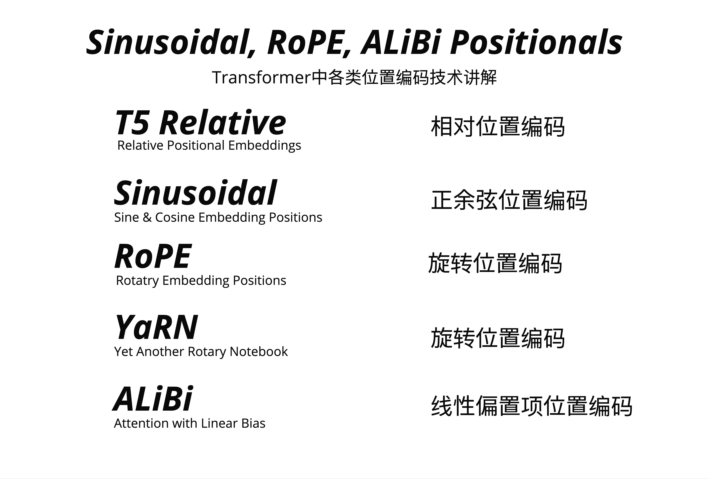

### 为什么需要更好的位置编码？

让我们先回顾一下 Sinusoidal 的局限性：

**绝对位置编码的问题**：

- 优势：计算速度较快
- 劣势：
  - 文字间相对位置信息不明显
  - 推理窗口受训练长度限制

**传统相对位置编码（如 T5）的问题**：

- 优势：可学习文字间相对信息
- 劣势：
  - 计算量增大
  - 部分实现方式与 KV Cache 不兼容

> **注意**：RoPE 也是一种相对位置编码，但它的设计允许 KV Cache 正常工作——这正是 LLaMA 选择 RoPE 的原因之一。

这就引出了一个核心问题：**我们能否设计一种位置编码，既能捕获相对位置信息，又能高效推理？**

### 五种主流方案

目前主流的位置编码方案有五种：

| 方案        | 英文全称                          | 中文名             | 代表模型         |
| :---------- | :-------------------------------- | :----------------- | :--------------- |
| T5 Relative | Relative Positional Embeddings    | 相对位置编码       | T5               |
| Sinusoidal  | Sine & Cosine Embedding Positions | 正余弦位置编码     | 原始 Transformer |
| **RoPE**    | Rotary Position Embedding         | 旋转位置编码       | LLaMA, GPT-NeoX  |
| **YaRN**    | Yet another RoPE extensioN        | RoPE 扩展          | Code Llama, Qwen |
| **ALiBi**   | Attention with Linear Bias        | 线性偏置项位置编码 | BLOOM, MPT       |

本章我们将深入讲解 RoPE、ALiBi 和 YaRN 这三种现代方案。

## Sinusoidal 回顾：加法的局限

在深入新方案之前，让我们快速回顾 Sinusoidal 的工作方式。

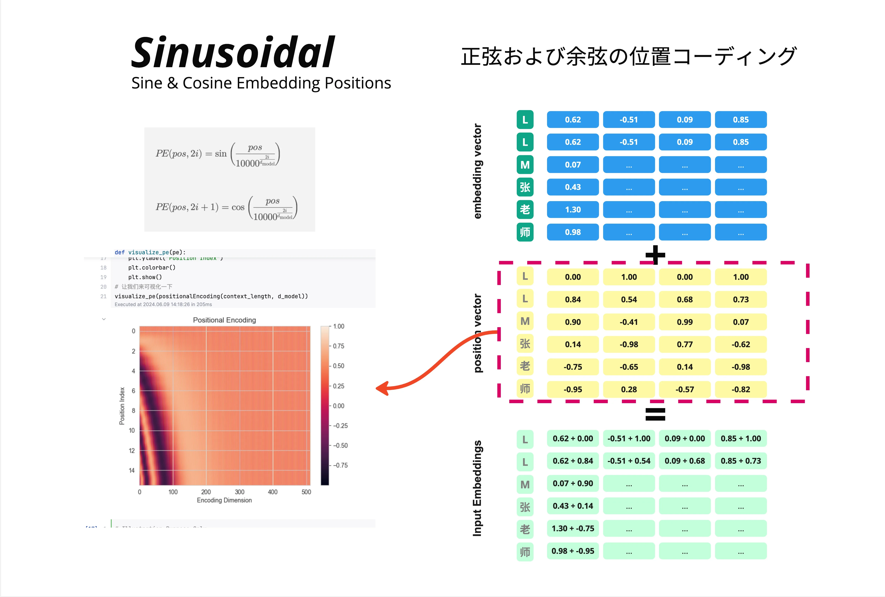

### Sinusoidal 的核心思想

Sinusoidal 位置编码的公式：

```
PE(pos, 2i) = sin(pos / 10000^(2i/d_model))
PE(pos, 2i+1) = cos(pos / 10000^(2i/d_model))
```

工作方式很简单：**把位置向量加到词向量上**。

以"LLM张老师"为例：

**Embedding 向量**（语义信息）：

| 字   | 维度1 | 维度2 | 维度3 | 维度4 |
| :--- | :---- | :---- | :---- | :---- |
| L    | 0.62  | -0.51 | 0.09  | 0.85  |
| L    | 0.62  | -0.51 | 0.09  | 0.85  |
| M    | 0.07  | ...   | ...   | ...   |

**Position 向量**（位置信息）：

| 位置 | 维度1 | 维度2 | 维度3 | 维度4 |
| :--- | :---- | :---- | :---- | :---- |
| 1    | 0.00  | 1.00  | 0.00  | 1.00  |
| 2    | 0.84  | 0.54  | 0.68  | 0.73  |
| 3    | 0.90  | -0.41 | 0.99  | 0.07  |

**Input Embeddings** = Embedding + Position

### 为什么"加法"有局限？

关键问题在于：**加法操作发生在进入 Attention 之前**。

当我们计算 Q 和 K 的点积时：
$$
Q=(x_m+PE_m)W_Q
$$

$$
K=(x_n+PE_n)W_K
$$
Attention 计算： $$ Q \cdot K^T $$​

代入：

$$
QK^T
=
((x_m+PE_m)W_Q)((x_n+PE_n)W_K)^T
$$

根据：

$$
(AB)^T=B^TA^T
$$

得到：

$$
QK^T
=
((x_m+PE_m)W_Q)
(W_K^T(x_n+PE_n)^T)
$$
这里如果继续展开：
$$
\begin{aligned}
&x_mW_QW_K^Tx_n^T\\
&+x_mW_QW_K^TPE_n^T\\
&+PE_mW_QW_K^Tx_n^T\\
&+PE_mW_QW_K^TPE_n^T
\end{aligned}
$$
展开后会得到四项交叉项，位置信息和语义信息混在一起，很难解耦。

更严重的问题是：**Sinusoidal 编码的是绝对位置**。模型学到的是"位置 5"的模式，而不是"相距 3 个位置"的模式。当推理长度超过训练长度时，模型会遇到从未见过的绝对位置，性能急剧下降。

> 这就是为什么早期的 GPT 模型有严格的上下文长度限制：训练多长，就只能用多长。

## 旋转位置编码

2021 年，苏剑林提出了 RoPE（Rotary Position Embedding），彻底改变了位置编码的范式。

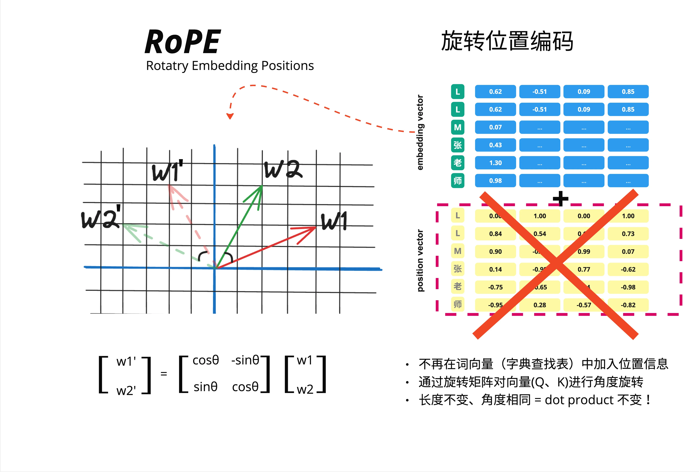

### 核心直觉：从加法到乘法

RoPE 的革命性想法：**不再把位置信息加到词向量上，而是用旋转矩阵对 Q、K 向量进行旋转**。

看图中的对比：

**Sinusoidal（加法）**：

- embedding vector + position vector = input embeddings

**RoPE（旋转）**：

- 不再在词向量（字典查找表）中加入位置信息
- 通过旋转矩阵对向量（Q、K）进行角度旋转
- 长度不变、角度相同 = dot product 不变！

这个"长度不变、角度相同"是什么意思？让我们用 2D 来理解。


### 旋转的几何直觉

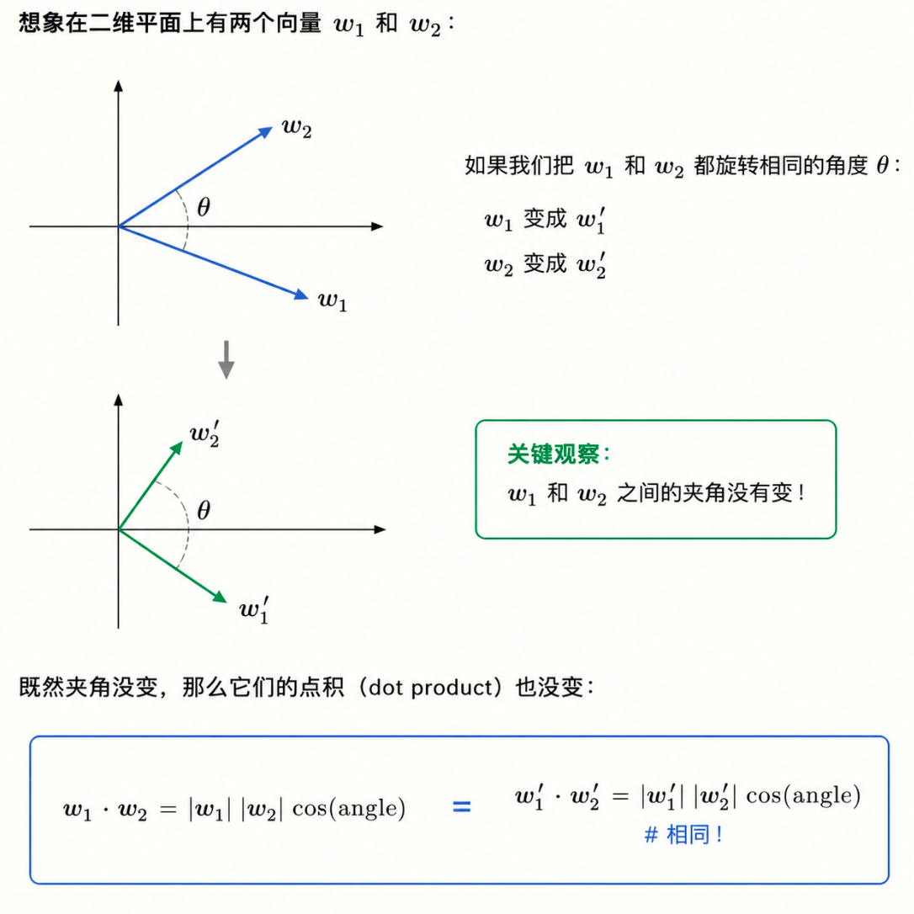

这就是 RoPE 的核心洞察：**如果我们把位置信息编码成旋转角度，那么相对位置自然就体现在两个向量的相对旋转角度中**。

### 旋转矩阵

2D 旋转矩阵的形式是：
$$
\begin{bmatrix}
w_1'\\
w_2'
\end{bmatrix}
=
\begin{bmatrix}
\cos\theta & -\sin\theta\\
\sin\theta & \cos\theta
\end{bmatrix}
\begin{bmatrix}
w_1\\
w_2
\end{bmatrix}
$$
对于位置 m 的 token，旋转角度是 m * theta。

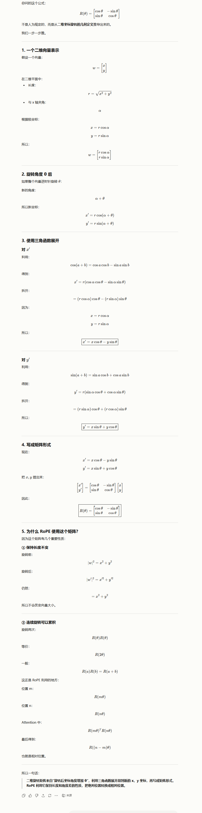

### 高维度的处理

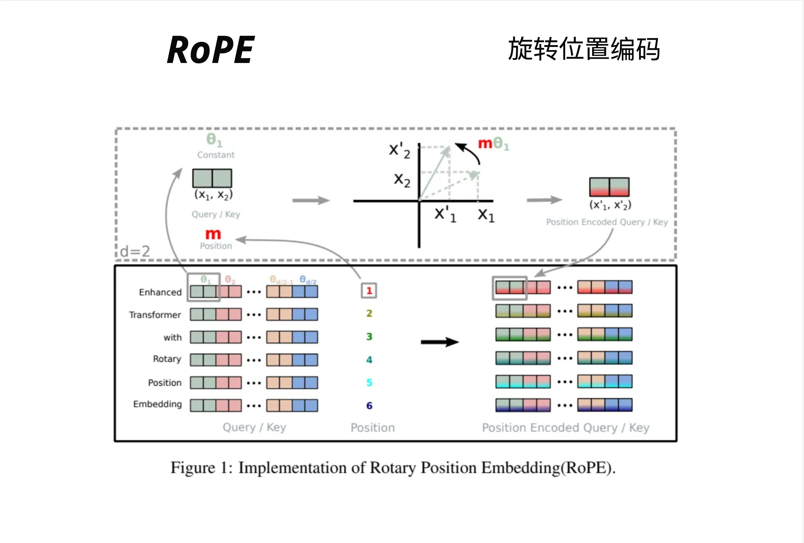

真实的词向量不是 2D 的，而是 768D 或 4096D。RoPE 的处理方式是：**把高维向量拆成多个 2D 子空间，每个子空间独立旋转**。

假设 d=6（6 维向量），会被拆成 d/2=3 对：

- 第 1-2 维：用角度 theta_1 旋转
- 第 3-4 维：用角度 theta_2 旋转
- 第 5-6 维：用角度 theta_d/2 旋转

每对维度使用不同的基础频率，类似于 Sinusoidal 中不同维度有不同频率的思想。

图中展示了完整的流程：

1. Query/Key 向量（左侧彩色方块）
2. 结合位置 m（1, 2, 3, 4, 5, 6...）
3. 在 2D 平面上旋转 **m * theta**
4. 得到 Position Encoded Query/Key（右侧彩色方块）

### 完整的旋转矩阵

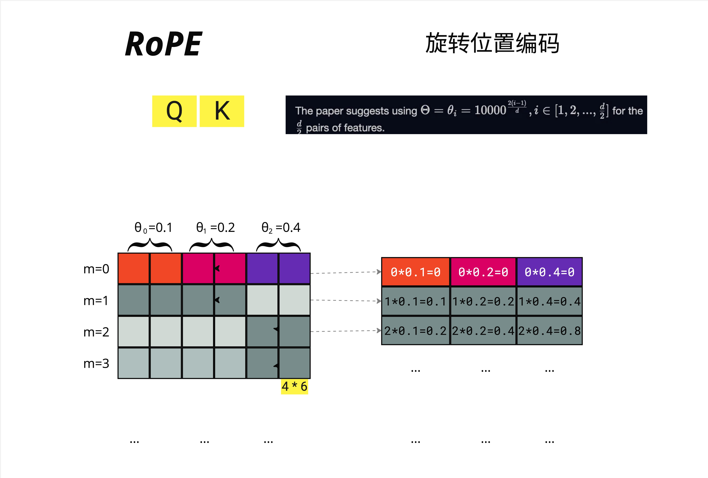

对于 d 维向量，完整的旋转矩阵是一个分块对角矩阵：
$$
R_m=
\begin{bmatrix}
\cos(m\theta_1) & -\sin(m\theta_1) & 0 & 0 & \cdots & 0 & 0 \\
\sin(m\theta_1) & \cos(m\theta_1) & 0 & 0 & \cdots & 0 & 0 \\
0 & 0 & \cos(m\theta_2) & -\sin(m\theta_2) & \cdots & 0 & 0 \\
0 & 0 & \sin(m\theta_2) & \cos(m\theta_2) & \cdots & 0 & 0 \\
\vdots & \vdots & \vdots & \vdots & \ddots & \vdots & \vdots \\
0 & 0 & 0 & 0 & \cdots & \cos(m\theta_{d/2}) & -\sin(m\theta_{d/2}) \\
0 & 0 & 0 & 0 & \cdots & \sin(m\theta_{d/2}) & \cos(m\theta_{d/2})
\end{bmatrix}
$$
每个 2x2 块是一个独立的旋转矩阵。
>m：当前 token 的位置编号（position index），也就是第几个 token。
>
>在 RoPE（旋转位置编码）中，$R_m$ 是位置 $m$ 对应的旋转矩阵，它分别作用在 Query 和 Key 上。
>
>具体是：$q_m=R_mq$ ， $k_m=R_mk$
>
>也就是说：
>
>原始 Query 向量 $q$，乘旋转矩阵 $R_m$，得到带位置信息的 Query：$q_m=R_mq$
>
>原始 Key 向量 $k$，乘旋转矩阵 $R_m$，得到带位置信息的 Key：$k_m=R_mk$
>

### 频率的选择

论文建议使用：

$$ \theta_i = 10000^{-\frac{2(i-1)}{d}},\quad i=1,2,\dots,\frac{d}{2} $$

例如，对于 d=6 的向量：

- theta_0 = 0.1
- theta_1 = 0.2
- theta_2 = 0.4

位置 m 对应的旋转角度：

| 位置 m | 第 1 对   | 第 2 对   | 第 3 对   |
| :----- | :-------- | :-------- | :-------- |
| m=0    | 0*0.1=0   | 0*0.2=0   | 0*0.4=0   |
| m=1    | 1*0.1=0.1 | 1*0.2=0.2 | 1*0.4=0.4 |
| m=2    | 2*0.1=0.2 | 2*0.2=0.4 | 2*0.4=0.8 |
| m=3    | ...       | ...       | ...       |


### 为什么 RoPE 能编码相对位置？

这是 RoPE 最精妙的地方。

假设位置 $m$ 的 Query 是 $q_m$，位置 $n$ 的 Key 是 $k_n$。

应用 RoPE 后：

$$
q_m'=R_m q_m
$$

（旋转 $m\theta$）

$$
k_n'=R_n k_n
$$

（旋转 $n\theta$）


计算注意力分数时：

$$
q_m'^T k_n'
$$


代入：

$$
=(R_m q_m)^T(R_n k_n)
$$


根据矩阵转置性质：

$$
(AB)^T=B^TA^T
$$


得到：

$$
=q_m^T R_m^T R_n k_n
$$


由于旋转矩阵满足：

$$
R_m^T R_n=R_{n-m}
$$


所以：

$$
=q_m^T R_{n-m} k_n
$$


关键来了：

$$
R_m^T R_n=R_{n-m}
$$

这是旋转矩阵的性质！


所以最终的注意力分数只依赖于相对位置：

$$
n-m
$$

而不是绝对位置：

$$
m,n
$$


这就是 RoPE 的魔法：

通过旋转操作，相对位置信息自然涌现，无需显式计算。

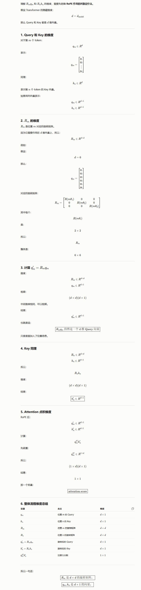


### RoPE 的长期衰减特性

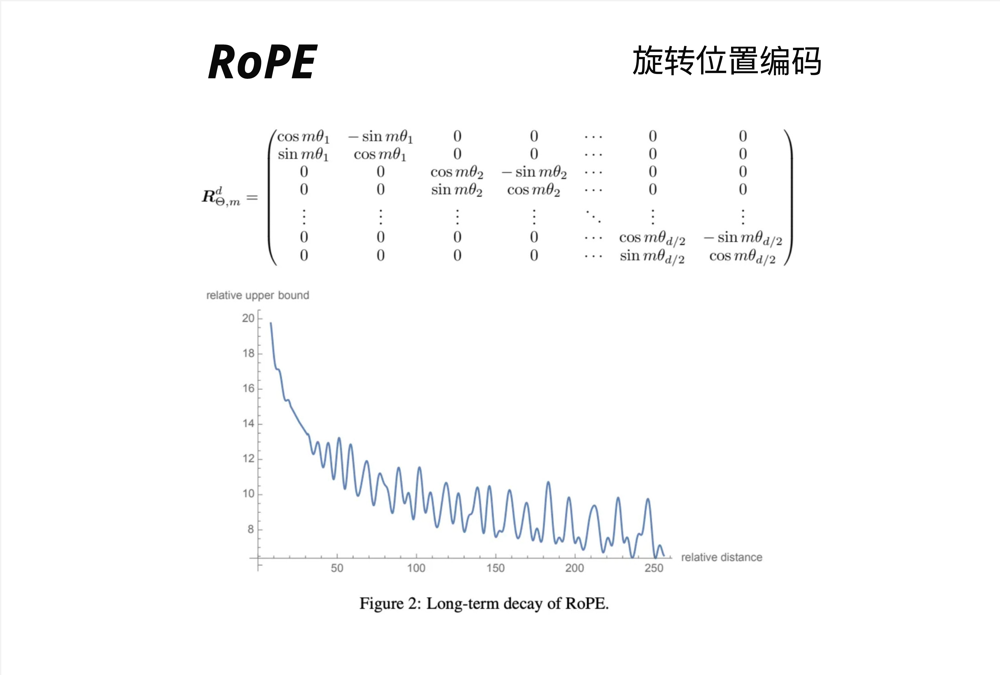

图中展示了 RoPE 的一个重要特性：**随着相对距离增加，注意力分数的上界会衰减**。

这意味着：

- 相邻的 token 可以获得更高的注意力
- 距离很远的 token 注意力会自然减弱

这符合语言的局部性原理：相邻的词通常关系更密切。

### RoPE 可视化：热力图

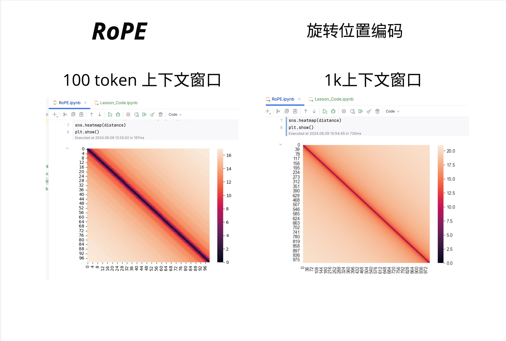

图中展示了不同上下文长度下的 RoPE 距离热力图：

- 100 token 上下文窗口
- 1k 上下文窗口
- 10k 上下文窗口

可以看到：

- 对角线附近颜色深（相对距离小，注意力高）
- 远离对角线颜色浅（相对距离大，注意力低）
- 随着上下文变长，整体模式保持一致

### 25.3.10 RoPE 的直观类比

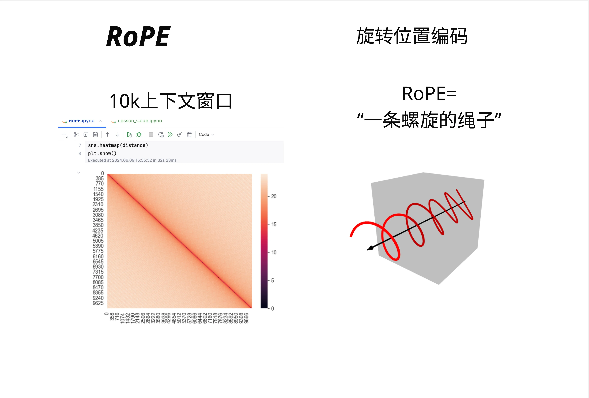

一个形象的类比：**RoPE 就像一条螺旋的绳子**。

- 每个位置对应绳子上的一个点
- 位置越远，旋转的角度越大
- 相邻的点之间角度差是固定的

这就是为什么 RoPE 能编码相对位置：你只需要知道两个点之间转了多少圈，就知道它们相距多远。


## 各方案对比

### 技术对比

| 特性          | Sinusoidal     | RoPE     | ALiBi      | YaRN     |
| :------------ | :------------- | :------- | :--------- | :------- |
| 位置信息注入  | 加到 embedding | 旋转 Q/K | 偏置注意力 | 旋转 Q/K |
| 编码类型      | 绝对位置       | 相对位置 | 相对位置   | 相对位置 |
| 外推能力      | 差             | 中等     | 强         | 强       |
| KV Cache 兼容 | 是             | 是       | 是         | 是       |
| 额外参数      | 无             | 无       | 无         | 无       |
| 计算开销      | 低             | 中       | 低         | 中       |

### 主流模型的选择

| 模型       | 位置编码           | 上下文长度 |
| :--------- | :----------------- | :--------- |
| GPT-3      | 学习式位置编码     | 2048       |
| LLaMA 1    | RoPE               | 2048       |
| LLaMA 2    | RoPE               | 4096       |
| Code Llama | RoPE + YaRN        | 16384      |
| Mistral    | RoPE               | 8192       |
| BLOOM      | ALiBi              | 2048       |
| MPT        | ALiBi              | 65536      |
| Qwen       | RoPE + Dynamic NTK | 8192-32768 |
| Claude     | 未公开             | 100k+      |
| GPT-4      | 未公开             | 128k       |

### 如何选择？

**选择 RoPE 如果**：

- 需要精确的位置信息
- 上下文长度适中（4k-8k）
- 想用 LLaMA 生态

**选择 ALiBi 如果**：

- 需要强外推能力
- 实现要简单
- 内存/计算资源有限

**选择 YaRN 如果**：

- 需要超长上下文（16k+）
- 已有 RoPE 模型，想扩展
- 有少量微调预算


