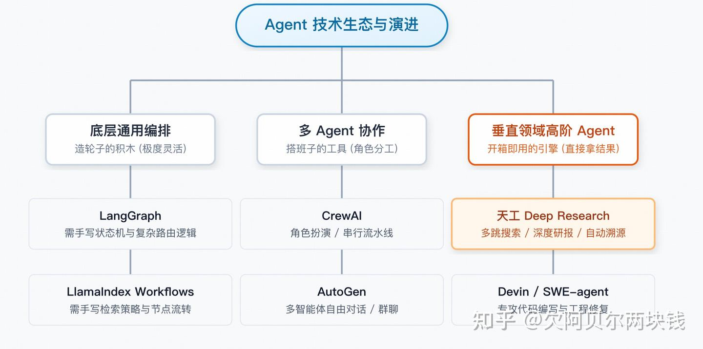
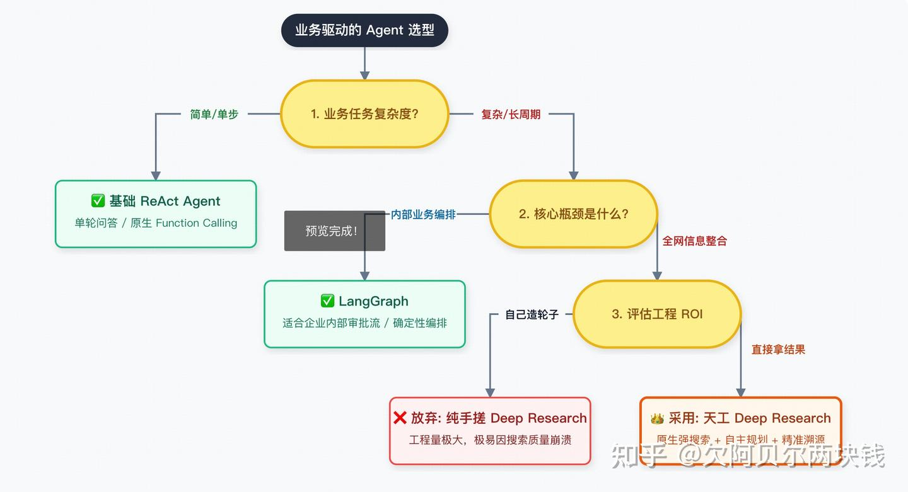
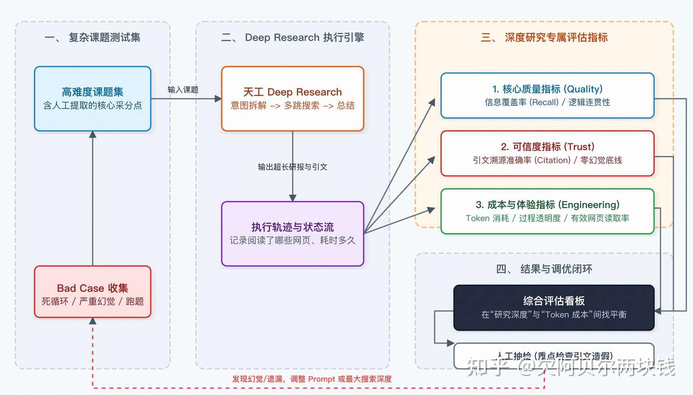

# 场景题案例-怎么设计你的多智能体（Multi-Agent）系统

## 写在前面

场景题 面试官的核心目的不是听你背诵框架说明书，而是考察你是否具备**“从技术选型 -> 业务落地 -> 质量评估”的完整工程化闭环思维**。

在面试中是一个极大的加分项，因为它展现了你对**工程 ROI（投入产出比）**和**长周期复杂任务（Long-horizon tasks）**的深刻理解。

> 在这里我们以实现一个行业竞品分析与深度研报生成为背景，来拆解面试中怎么回答此类问题，这个场景我们选择了之前在去年gaia leardboard排名靠前的开源框架(天工deep research agent)。

## 核心答题框架：全局视野 -> 架构级选型 -> 深度研究专属评估

### 一、 建立全局视野：Agent 生态的演进与分类

在做选型前，我们需要看清当前 Agent 生态的版图。目前的 Agent 解决方案已经从“底层通用框架”向“垂类research agent”演进，大致分为三类：

- **通用编排框架：** 比如 LangGraph、LlamaIndex Workflows。它们提供了图编排、状态机等底层能力，极度灵活，但你需要自己处理所有的边界条件、循环逻辑和错误重试。
- **多 Agent 协作框架：** 比如 CrewAI、AutoGen、Camel-AI等。侧重于定义多个角色（如程序员、测试员）进行wofkflow工作流或多智能体编排。
- **垂类Deep Research Agent、MiroFlow、Aworld等：主要于做research agent，专攻复杂信息搜集与整合的 Deep Research Agent**。它们在特定领域内，将底层编排、长程任务tool调用信源深度搜索封装到了极致。

## 二、 选型决策过程：为什么放弃手搓，选择天工 Deep Research？

在我们的实际业务中，核心场景是**“行业竞品分析与深度研报生成”**。这是一个典型的**长周期、重度依赖搜索、需要多步推理（Long-horizon & Multi-hop）**的复杂任务。

我的选型经历了这样的思考漏斗：

### 第一阶段：评估自研成本（LangGraph vs. 复杂业务）

一开始我们考虑用 LangGraph 自己搭。但很快发现，要实现一个及格的“研究员 Agent”，工程量极大。我们需要自己写逻辑去实现：**用户意图拆解 -> 关键词泛化 -> 多次调用搜索引擎 -> 网页防爬虫解析 -> 噪音过滤 -> 超长上下文的切片与总结**。只要中间一环（比如搜索返回了垃圾信息）断掉，整个 Agent 就崩溃了。

### 第二阶段：转向高阶架构选型

既然业务目标是“拿结果”而不是“造轮子”，我们决定评估现成的 Deep Research 方案。

### 第三阶段：为什么是天工 Deep Research？

最终选择天工 Deep Research Agent，核心看中了它在三个维度的压倒性优势：

1. **原生且强大的搜索基建：** 深度研究的上限取决于“搜索的质量”。天工deep research对于google、jina、以及bing等其他搜索引擎做了适配，同时扩展其他搜索工具也比较方便。
2. **内置的“慢思考”与多级反思树（Reflection）：** 它不需要我们去写复杂的流转图，原生具备“**搜到信息 -> 发现不够 -> 自动调整搜索词 -> 再次深挖**”的自主规划能力。
3. **超长上下文与引文溯源：** 研报场景最怕幻觉。天工的方案在长文本信息抽取和**“精准溯源（Citation）”**上做得非常成熟，生成的报告每一句话都能找到出处。

## 三、 生产级评估体系：如何评估一个 Deep Research Agent？

对于 Deep Research 这种可能运行几分钟甚至十几分钟的“重型 Agent”，传统的评估指标（如简单的任务完成率、秒级延迟）已经失效了。我们建立了一套专门针对**深度研究场景**的量化评估体系：

### 1. 核心效果指标（质量与可信度）

- **信息召回/覆盖率 (Information Recall Rate)：** 给定一个复杂课题（如“2025年固态电池产业化进度”），人工提炼出 10 个核心采分点。评估 Agent 最终的报告覆盖了几个点。
- **引文溯源准确率 (Citation Accuracy)：** 这是极其关键的指标。随机抽查报告中的数据和结论，点击引文链接，检查原文中是否真的有这句话（检测“伪造证据”级别的幻觉）。
- **逻辑连贯与去重率：** 评估 Agent 是否只是把搜到的网页“拼接”在一起，还是真正做到**了交叉验证、去重和逻辑梳理**。

### 2. 核心工程指标（成本与体验）

- **过程透明度 (Process Observability)：** 因为任务执行长达几分钟，用户不能干等。系统必须能实时吐出“**正在拆解子问题 -> 正在阅读第 15 个网页 -> 正在生成大纲**”的状态反馈。
- **Token 消耗与单次任务成本 (Cost per Research)：** Deep Research token消耗极大”。我们需要监控它是否在无意义的网页上陷入了死循环，通过限制最大搜索深度（Max Depth）来控制单次任务成本。
- **有效网页读取率：** 监控 Agent 搜索到的网页中，有多少被真正用于最终报告的生成，**以此衡量其“意图理解”和“过滤噪音”的能力**。

