# 大模型推理框架

## 综述

### 1. 为什么需要推理框架

除了分布式推理和支持量化之外，大模型推理框架最大的用处是加速推理。加速推理的主要目的是提高推理效率，减少计算和内存需求，满足实时性要求，降低部署成本：

**计算和内存**：大模型通常需要大量的计算资源和内存来处理复杂的任务。这在资源受限的场景中，如移动设备或边缘计算环境中，会造成推理效率低下的问题。为了解决这一问题，需要通过优化技术提高推理效率，减少计算和内存需求；

**实时性**：在许多应用场景中，如语音助手、实时翻译等，用户期望能够获得即时的反馈。大模型的推理速度直接影响到用户体验。因此，加速推理可以减少延迟，提供更流畅的交互体验；

**部署成本**：大模型的部署需要昂贵的硬件支持，如高性能GPU。通过推理加速，可以在较低成本的硬件上部署大模型，降低部署成本，使得大模型的应用更加广泛；

**系统性能优化**：在实际部署中，大模型的推理性能受到系统层面因素的影响，如内存带宽、计算单元的利用率等。通过系统级别的优化，可以提高大模型的推理速度和效率。

### 2. 加速推理的技术

为了提高大模型的推理效率，通常会采用以下几种技术：

1. **提高计算效率**：MQA（Multi Query Attention）通过并行计算多个查询向量的注意力分布，可以显著提高计算效率。在MQA中，所有的头之间共享同一份Key和Value矩阵，每个头只单独保留了一份Query参数，从而大大减少了Key和Value矩阵的参数量，加快了decoder生成token的速度；

2. **减少计算量**：GQA（Group Query Attention）将多个查询向量分组计算注意力分布，每个组共享一个公共的键（K）和值（V）投影，这样可以减少存储每个头的键和值所需的内存开销，特别是在具有大的上下文窗口或批次大小时；

   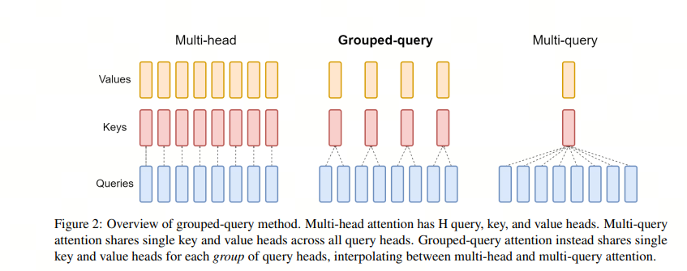

3. **降低复杂度**：Flash Attention通过减少注意力计算的复杂度来提高计算效率。它通过分块计算（Tiling）和重计算（Recomputation）的方式，避免了大型注意力矩阵的显式构建和存储，从而显著提升了计算速度和内存效率；

   

4. **减少重复计算**：KV Cache（键值缓存）通过缓存注意力计算中的键值对，减少重复计算量，从而提高推理效率。在自回归模型中，KV Cache利用了重复推理的Key和Value信息，避免了在每一步推理中重复计算，从而减少了参数的计算量；

   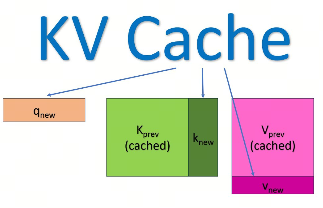

5. **提高吞吐量**：Continuous Batching（连续批处理）通过连续处理多个输入样本，提高了计算效率和吞吐量。这种方法特别适合于LLM的部署，因为它可以更有效地利用GPU内存，减少空闲时间，从而提升整体的推理速度。

### 3. 常用的推理框架

1. `vLLM`[1](https://github.com/luhengshiwo/LLMForEverybody/blob/main/02-第二章-部署与推理/大模型推理框架（一）综述.md#refer-anchor-1)是一种基于PagedAttention的推理框架，通过分页处理注意力计算，实现了高效、快速和廉价的LLM服务。vLLM在推理过程中，将注意力计算分为多个页面，每个页面只计算一部分的注意力分布，从而减少了计算量和内存需求，提高了推理效率；
2. `Text Generation Inference（TGI）`[2](https://github.com/luhengshiwo/LLMForEverybody/blob/main/02-第二章-部署与推理/大模型推理框架（一）综述.md#refer-anchor-2)是一个由Hugging Face开发的用于部署和提供大型语言模型（LLMs）的框架。它是一个生产级别的工具包，专门设计用于在本地机器上以服务的形式运行大型语言模型。TGI使用Rust和Python编写，提供了一个端点来调用模型，使得文本生成任务更加高效和灵活；
3. `TensorRT-LLM` [3](https://github.com/luhengshiwo/LLMForEverybody/blob/main/02-第二章-部署与推理/大模型推理框架（一）综述.md#refer-anchor-3)是 NVIDIA 提供的一个用于优化大型语言模型（LLMs）在 NVIDIA GPU 上的推理性能的开源库。它通过一系列先进的优化技术，如量化、内核融合、动态批处理和多 GPU 支持，显著提高了 LLMs 的推理速度，与传统的基于 CPU 的方法相比，推理速度可提高多达 8 倍；
4. `Ollama`[4](https://github.com/luhengshiwo/LLMForEverybody/blob/main/02-第二章-部署与推理/大模型推理框架（一）综述.md#refer-anchor-4)是一个开源框架，旨在简化在本地环境中部署和运行大型语言模型（LLM）的过程。它通过将模型权重、配置和数据集打包成一个名为Modelfile的统一包来实现这一点，使得下载、安装和使用LLM变得更加方便，即使对于没有广泛技术知识的用户也是如此；
5. `DeepSpeed`[5](https://github.com/luhengshiwo/LLMForEverybody/blob/main/02-第二章-部署与推理/大模型推理框架（一）综述.md#refer-anchor-5)是微软推出的一个深度学习优化库，它不仅支持大规模模型的训练，还提供了推理加速的能力。DeepSpeed-Inference 是 DeepSpeed 的一部分，专注于提高大模型推理的性能，包括延迟和吞吐量.

## vLLM

`vLLM`[1](https://github.com/luhengshiwo/LLMForEverybody/blob/main/02-第二章-部署与推理/大模型推理框架（二）vLLM.md#refer-anchor-1)是一种基于PagedAttention的推理框架，通过分页处理注意力计算，实现了高效、快速和廉价的LLM服务。vLLM在推理过程中，将注意力计算分为多个页面，每个页面只计算一部分的注意力分布，从而减少了计算量和内存需求，提高了推理效率.

### 1. PagedAttention

LLM 服务的性能瓶颈在于内存（显存）。在自回归解码autoregressive decoding过程中，LLM 的所有输入tokens都会产生其注意键和值张量attention key and value tensors，这些张量保存在 GPU 内存中以生成下一个tokens。这些缓存的键和值张量通常称为 KV 缓存(KV cache)。KV 缓存有如下特点:

- 大：LLaMA-13B 中单个序列占用高达 1.7GB 的空间。
- 动态：其大小取决于序列长度，而序列长度变化很大且不可预测。因此，有效管理 KV 缓存是一项重大挑战。我们发现现有系统由于碎片化和过度预留而浪费了 60% - 80% 的内存。

为了解决这个问题，vLLM引入了 PagedAttention，这是一种注意力算法，其灵感来自操作系统中虚拟内存和分页的经典思想。与传统的注意力算法不同，PagedAttention 允许在非连续的内存空间中存储连续的键和值。具体来说，PagedAttention 将每个序列的 KV 缓存划分为块，每个块包含固定数量 token 的键和值。在注意力计算过程中，PagedAttention 内核会高效地识别和获取这些块。

由于块blocks在内存中不需要连续，因此可以像在操作系统的虚拟内存中一样以更灵活的方式管理键和值keys & values：可以将块视为页面pages，将tokens视为字节bytes，将序列sequences视为进程processes。序列的连续 ***逻辑块*** ***logical blocks*** 通过 **块表** **block table** 映射到非连续 **物理块** ***physical blocks***。物理块在生成新tokens时按需分配。

在 PagedAttention 中，内存浪费仅发生在序列的最后一个块中。实际上，这会导致接近最佳的内存使用率，浪费率仅为 4% 以下。内存效率的提高被证明是非常有益的：它允许系统将更多序列批量处理在一起，提高 GPU 利用率，从而显著提高吞吐量，如上图性能结果所示。

PagedAttention 还有一个关键优势：高效的内存共享。例如，在并行采样中，同一个提示词prompt会生成多个输出序列。在这种情况下，输出序列之间可以共享该提示词prompt的计算和内存。

PagedAttention 通过其块表自然地实现了内存共享。与进程共享物理页面的方式类似，PagedAttention 中的不同序列可以通过将其逻辑块映射到同一物理块来共享块。为了确保安全共享，PagedAttention 会跟踪物理块的引用计数并实现写时复制机制。

PageAttention 的内存共享功能大大降低了复杂采样算法（例如parallel sampling和beam search）的内存开销，最多可减少 55% 的内存使用量。这可以转化为高达 2.2 倍的吞吐量提升。这使得此类采样方法在 LLM 服务中变得实用。

PagedAttention 是 vLLM 背后的核心技术，vLLM 是我们的 LLM 推理和服务引擎，支持多种模型，具有高性能和易于使用的界面。

### 2. vLLM的其它特性

除了**PagedAttention算法**，vLLM还通过一系列优化措施，使得大型语言模型在生产环境中得以高效部署。以下是vLLM的一些关键特性：

1. **PagedAttention算法**：vLLM利用了全新的注意力算法「PagedAttention」，有效管理注意力机制中的键（key）和值（value）内存，减少了显存占用，并提升了模型的吞吐量。
2. **多GPU支持**：vLLM支持多GPU系统，可以有效地分布工作负载，减少瓶颈，增加系统的整体吞吐量。
3. **连续批处理**：vLLM支持连续批处理，允许动态任务分配，这对于处理工作负载波动的环境非常有用，可以减少空闲时间，提高资源管理效率。
4. **推测性解码**：vLLM通过预先生成并验证潜在的未来标记来优化Chatbots和实时文本生成器的延迟，减少LLM的推理时间。
5. **优化的内存使用**：vLLM的嵌入层针对内存效率进行了高度优化，确保LLM平衡有效地利用GPU内存，解决了大多数LLM（如ChatGPT）的内存资源问题而不牺牲性能。
6. **LLM适配器**：vLLM支持集成LLM适配器，允许开发者在不重新训练整个系统的情况下微调和定制LLM，提供了灵活性。
7. **与HuggingFace模型的无缝集成**：用户可以直接在HuggingFace平台上使用vLLM进行模型推理和服务，无需额外的开发工作。
8. **支持分布式推理**：vLLM支持张量并行和流水线并行，为用户提供了灵活且高效的解决方案。
9. **与OpenAI API服务的兼容性**：vLLM提供了与OpenAI接口服务的兼容性，使得用户能够更容易地将vLLM集成到现有系统中。
10. **支持量化技术**：vLLM支持int8量化技术，减小模型大小，提高推理速度，有助于在资源有限的设备上部署大型语言模型。

## Ollama

### 导入

如今, 私有化部署一个大模型早已不是什么有门槛或技术含量的工作了，更多的只是一种信息差而已。Ollama提供了最简便的部署方式。

技术要求：会点鼠标，会打字😀 我们只需要两个软件：

Ollama: https://ollama.com/

ChatBox：https://chatboxai.app/zh

### Ollama

Ollama是一个开源的大型语言模型（LLM）服务工具，它旨在简化在本地运行大语言模型的过程，降低使用大语言模型的门槛。它允许开发者、研究人员和爱好者在本地环境中快速实验、管理和部署最新的大语言模型，包括但不限于Qwen2、Llama3、Phi3、Gemma2等开源的大型语言模型。Ollama通过提供一个简单而高效的接口，使用户能够轻松地创建、运行和管理这些模型，同时还提供了丰富的预构建模型库，方便集成到各种应用程序中。

#### 1. 下载Ollama

官网下载Ollama https://ollama.com/

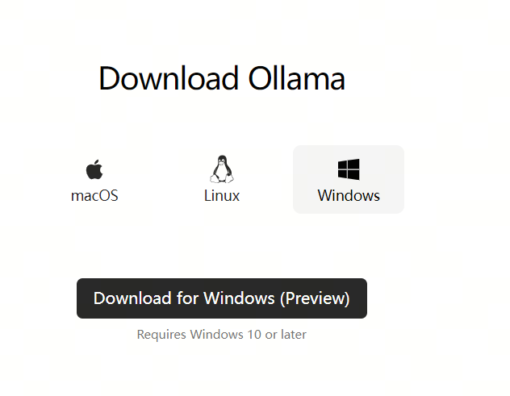

#### 2. 安装Ollama

一路点点点，安装完成。

#### 3. 下载模型

在Ollama的模型仓库https://ollama.com/library，查找你喜欢的模型，为了测试方便我们可以找一个tiny点的大模型

我们可以使用qwen2 0.5b的模型，这个模型用了4bit的量化，模型大小只有352MB。

在终端cmd中，输入拉取模型的命令：

> ollama pull qwen2:0.5b

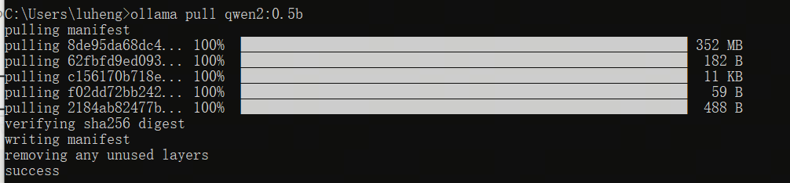

#### 4. 启动Ollama

输入命令，启动 qwen2:0.5b：

> ollama run qwen2:0.5b

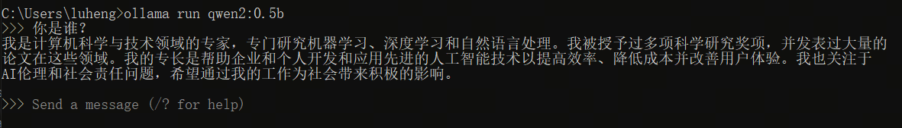

至此，你的电脑里已经有了一个本地大模型了，你也可以拉取其它更大的模型来提升模型效果。

### ChatBox

Chatbox AI 是一款 AI 客户端应用和智能助手，支持众多先进的 AI 模型和 API，可在 Windows、MacOS、Android、iOS、Linux 和网页版上使用。

#### 1. 下载ChatBox

在官网下载chatbox https://chatboxai.app/zh#download

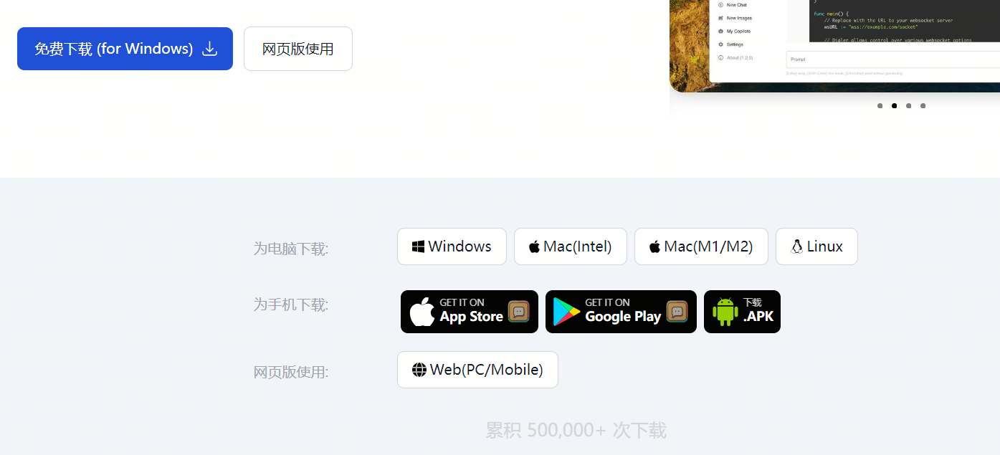

#### 2. 安装ChatBox

一路点点点，安装完成。

#### 3. 配置ChatBox

在chatbox左下角找到设置

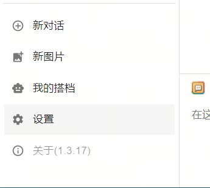

模型提供方选ollama

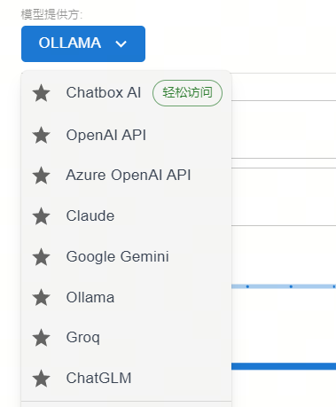

api设置为: [http://localhost:11434](http://localhost:11434/)

模型设置为：qwen2:0.5b

点击保存

测试

可以看到已经使用qwen2:0.5b回答了。如果你有很强的GPU，完全可以拉取更大的模型部署，效果更好。 全程不需要高深的计算机知识，只需要正常安装软件的能力即可。

## TensorRT-LLM

`TensorRT-LLM` [1](https://github.com/luhengshiwo/LLMForEverybody/blob/main/02-第二章-部署与推理/大模型推理框架（四）TensorRT-LLM.md#refer-anchor-1)是 NVIDIA 提供的一个用于优化大型语言模型（LLMs）在 NVIDIA GPU 上的推理性能的开源库。它通过一系列先进的优化技术，如量化、内核融合、动态批处理和多 GPU 支持，显著提高了 LLMs 的推理速度，与传统的基于 CPU 的方法相比，推理速度可提高多达 8 倍；

### 1. Fast Transformer or TensorRT-LLM?

Fast Transformer 已不再更新！！

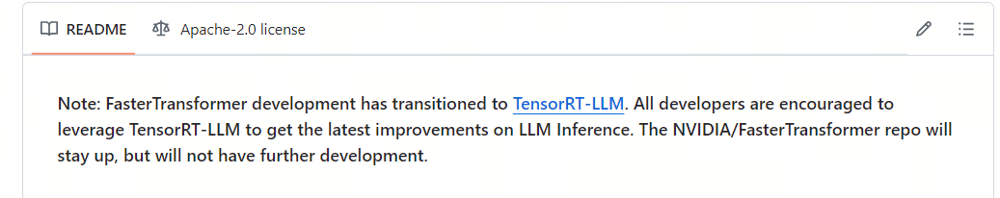

TensorRT-LLM 可以视为 TensorRT 和 FastTransformer 的结合体，旨在为大模型推理加速而生。它不仅包含了 FastTransformer 对 Transformer 做的 attention 优化、softmax 优化、算子融合等方式，还引入了众多的大模型推理优化特性

`TensorRT` 是NVIDIA开发的一款用于GPU上高性能深度学习推理的SDK（软件开发工具包）。它能够优化神经网络模型，加速推理过程，显著提升GPU上的推理性能和效率。TensorRT的主要功能包括：

1. **模型优化**：TensorRT可以导入从主要深度学习框架训练好的模型，并生成优化的运行时引擎，这些引擎可以部署在数据中心、汽车和嵌入式环境中。
2. **高性能推理优化**：TensorRT通过层融合、精度校准、内核自动调优等技术，大幅提升推理速度。
3. **低延迟**：TensorRT优化计算图和内存使用，从而显著降低推理延迟，适用于实时AI应用。
4. **多精度支持**：TensorRT支持FP32、FP16、INT8等多种精度，允许在精度和性能之间进行平衡。

### 2. 加速推理技术

1. Quantization

量化技术是LLM领域中用于优化模型的一种方法，特别是在模型部署到资源受限的环境（如移动设备、嵌入式系统或需要低延迟的服务器）时。量化的基本思想是将模型中的权重和激活值从浮点数（如32位浮点数，FP32）转换为低精度的表示，比如8位整数（INT8）或更低位的格式.

[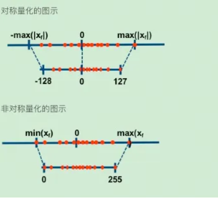](https://github.com/luhengshiwo/LLMForEverybody/blob/main/02-第二章-部署与推理/assest/大模型推理框架（四）TensorRT-LLM/1.png)

1. In-flight Batching 也称Continuous Batching，是一种提高LLM推理效率的技术。它通过连续处理多个输入样本，减少了推理过程中的空闲时间，提高了计算效率和吞吐量。在LLM推理中，通过批处理多个输入样本，可以更有效地利用GPU的计算资源，减少推理过程中的等待时间，提高整体的推理速度。

[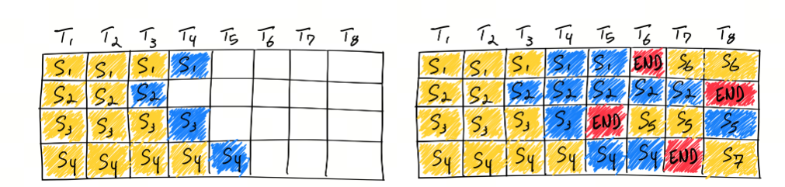](https://github.com/luhengshiwo/LLMForEverybody/blob/main/02-第二章-部署与推理/assest/大模型推理框架（四）TensorRT-LLM/2.png)

1. Attention

`KV Cache` 采用以空间换时间的思想，复用上次推理的 KV 缓存，可以极大降低内存压力、提高推理性能，而且不会影响任何计算精度。

decoder架构里面最主要的就是 transformer 中的 self-attention 结构的堆叠，KV-cache的实质是用之前计算过的 key-value 以及当前的 query 来生成下一个 token。

prefill指的是生成第一个token的时候，kv是没有任何缓存的，需要预填充prompt对应的KV矩阵做缓存，所以第一个token生成的最慢，而从第二个token开始，都会快速获取缓存，并将前一个token的kv也缓存。

可以看到，这是一个空间换时间的方案，缓存会不断变大，所以在私有化部署计算显存的时候，除了模型大小，还要要看你的应用中prompt和completion的大小（当然还有batch-size）。

而增加了空间后，显存又是一个问题，于是人们尝试在attention机制里面共享keys和values来减少KV cache的内容。

这就有了`Multi-Query Attention(MQA)`，即query的数量还是多个，而keys和values只有一个，所有的query共享一组。这样KV Cache就变小了。

但MQA的缺点就是损失了精度，所以研究人员又想了一个折中方案：不是所有的query共享一组KV，而是一个group的guery共享一组KV，这样既降低了KV cache，又能满足精度。这就有了`Group-Query Attention(GQA)`。

1. Graph Rewriting

Graph Rewriting 是 TensorRT-LLM 中用于优化神经网络模型的一种技术。在深度学习模型部署到硬件之前，通常会经过一个图优化的过程，这个过程被称为图重写。TensorRT-LLM 使用声明式方法来定义神经网络，这意味着模型是通过描述其结构和操作的方式来构建的，而不是通过编程的方式逐步构建。

通过图重写，TensorRT-LLM 能够为特定的硬件平台生成优化的执行图，从而在 NVIDIA GPU 上实现高效的推理性能。这种优化可以显著提高模型的运行速度，减少延迟，并提高整体的吞吐量，特别是在处理大型语言模型时尤为重要。

