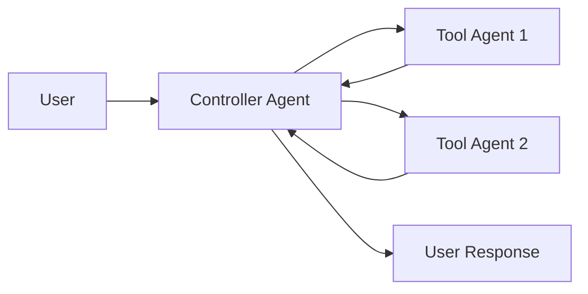
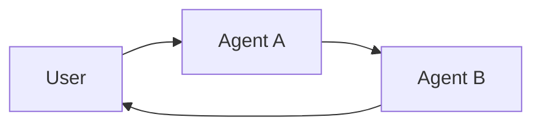
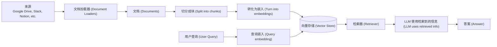
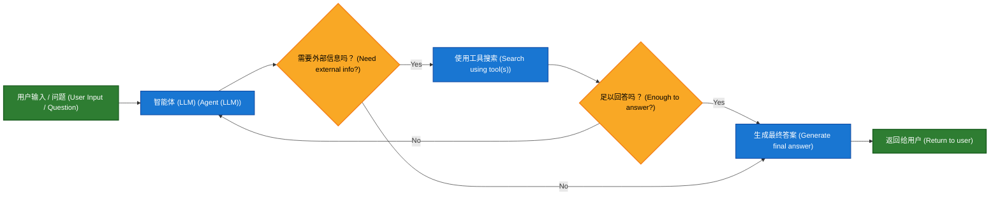
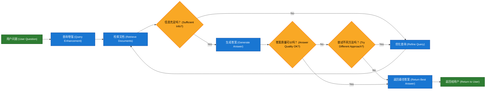

# LangChain 高级用法


## 守卫

> 为您的智能体实施安全检查和内容过滤

守卫通过在您的智能体执行的关键点验证和过滤内容，帮助您构建**安全、合规**的 AI 应用。它们可以在问题发生前检测敏感信息、强制执行内容策略、验证输出并防止不安全行为。

### 常见用例

- **防止 PII（个人身份信息）泄露**
- **检测和阻止提示注入 (prompt injection) 攻击**
- **阻止不当或有害内容**
- **强制执行业务规则和合规要求**
- **验证输出质量和准确性**

您可以使用 **[中间件 (middleware)](https://langchain-doc.cn/v1/python/langchain/middleware)** 来实施守卫，在策略性节点拦截执行——在智能体开始前、完成后，或围绕模型和工具调用时。

### 守卫的两种方法

守卫可以通过两种互补的方法实施：

| 方法                                        | 描述                                                         |
| :------------------------------------------ | :----------------------------------------------------------- |
| **确定性守卫 (Deterministic guardrails)**   | 使用基于规则的逻辑，如正则表达式、关键词匹配或明确检查。**快速、可预测、经济高效**，但可能会错过细微的违规行为。 |
| **基于模型的守卫 (Model-based guardrails)** | 使用 **LLMs 或分类器**通过语义理解来评估内容。可以捕获规则遗漏的**微妙问题**，但速度较慢且成本较高。 |

LangChain 提供了**内置守卫**（例如，[PII 检测](https://langchain-doc.cn/v1/python/langchain/guardrails.html#pii-detection)、[人工审核](https://langchain-doc.cn/v1/python/langchain/guardrails.html#human-in-the-loop)）和一个灵活的中间件系统，可使用任一方法构建**自定义守卫**。

### 内置守卫 (Built-in guardrails)

#### 个人身份信息 (PII) 检测

LangChain 提供了内置中间件用于检测和处理对话中的**个人身份信息 (PII)**。此中间件可以检测常见的 PII 类型，如电子邮件、信用卡、IP 地址等。

PII 检测中间件适用于需要合规要求的医疗保健和金融应用、需要清理日志的客户服务智能体，以及通常处理敏感用户数据的任何应用。

PII 中间件支持多种处理检测到的 PII 的策略：

| 策略 (`Strategy`) | 描述                      | 示例                  |
| :---------------- | :------------------------ | :-------------------- |
| `redact`          | 替换为 `[REDACTED_TYPE]`  | `[REDACTED_EMAIL]`    |
| `mask`            | 部分遮盖（例如，后 4 位） | `****-****-****-1234` |
| `hash`            | 替换为确定性哈希值        | `a8f5f167...`         |
| `block`           | 检测到时抛出异常          | 抛出错误              |

```python
from langchain.agents import create_agent
from langchain.agents.middleware import PIIMiddleware


agent = create_agent(
    model="openai:gpt-4o",
    tools=[customer_service_tool, email_tool],
    middleware=[
        # 在发送给模型之前，将用户输入中的电子邮件编辑掉
        PIIMiddleware(
            "email",
            strategy="redact",
            apply_to_input=True,
        ),
        # 遮盖用户输入中的信用卡
        PIIMiddleware(
            "credit_card",
            strategy="mask",
            apply_to_input=True,
        ),
        # 阻止 API 密钥 - 如果检测到则抛出错误
        PIIMiddleware(
            "api_key",
            detector=r"sk-[a-zA-Z0-9]{32}",
            strategy="block",
            apply_to_input=True,
        ),
    ],
)

# 当用户提供 PII 时，它将根据策略进行处理
result = agent.invoke({
    "messages": [{"role": "user", "content": "My email is john.doe@example.com and card is 4532-1234-5678-9010"}]
})
```

<details open="" style="color: rgb(60, 60, 67); font-family: Inter, ui-sans-serif, system-ui, sans-serif, &quot;Apple Color Emoji&quot;, &quot;Segoe UI Emoji&quot;, &quot;Segoe UI Symbol&quot;, &quot;Noto Color Emoji&quot;; font-size: 16px; font-style: normal; font-variant-ligatures: normal; font-variant-caps: normal; font-weight: 400; letter-spacing: normal; orphans: 2; text-align: start; text-indent: 0px; text-transform: none; widows: 2; word-spacing: 0px; -webkit-text-stroke-width: 0px; white-space: normal; background-color: rgb(255, 255, 255); text-decoration-thickness: initial; text-decoration-style: initial; text-decoration-color: initial;"><summary>**内置 PII 类型和配置**</summary><p style="line-height: 1.6; overflow-wrap: break-word;"><strong style="font-weight: 600;">内置 PII 类型：</strong></p><ul style="line-height: 1.6; overflow-wrap: break-word; padding-inline-start: 1.2em;"><li><code style="font-family: ui-monospace, Menlo, Monaco, Consolas, &quot;Liberation Mono&quot;, &quot;Courier New&quot;, monospace; margin: 0px; padding: 3px 6px; border-radius: 4px; background: none 0% 0% / auto repeat scroll padding-box border-box rgba(142, 150, 170, 0.14); font-size: 0.875em; overflow-wrap: break-word; transition: background-color 0.3s, color 0.3s;">email</code><span>&nbsp;</span>- 电子邮件地址</li><li><code style="font-family: ui-monospace, Menlo, Monaco, Consolas, &quot;Liberation Mono&quot;, &quot;Courier New&quot;, monospace; margin: 0px; padding: 3px 6px; border-radius: 4px; background: none 0% 0% / auto repeat scroll padding-box border-box rgba(142, 150, 170, 0.14); font-size: 0.875em; overflow-wrap: break-word; transition: background-color 0.3s, color 0.3s;">credit_card</code><span>&nbsp;</span>- 信用卡号（经过 Luhn 验证）</li><li><code style="font-family: ui-monospace, Menlo, Monaco, Consolas, &quot;Liberation Mono&quot;, &quot;Courier New&quot;, monospace; margin: 0px; padding: 3px 6px; border-radius: 4px; background: none 0% 0% / auto repeat scroll padding-box border-box rgba(142, 150, 170, 0.14); font-size: 0.875em; overflow-wrap: break-word; transition: background-color 0.3s, color 0.3s;">ip</code><span>&nbsp;</span>- IP 地址</li><li><code style="font-family: ui-monospace, Menlo, Monaco, Consolas, &quot;Liberation Mono&quot;, &quot;Courier New&quot;, monospace; margin: 0px; padding: 3px 6px; border-radius: 4px; background: none 0% 0% / auto repeat scroll padding-box border-box rgba(142, 150, 170, 0.14); font-size: 0.875em; overflow-wrap: break-word; transition: background-color 0.3s, color 0.3s;">mac_address</code><span>&nbsp;</span>- MAC 地址</li><li><code style="font-family: ui-monospace, Menlo, Monaco, Consolas, &quot;Liberation Mono&quot;, &quot;Courier New&quot;, monospace; margin: 0px; padding: 3px 6px; border-radius: 4px; background: none 0% 0% / auto repeat scroll padding-box border-box rgba(142, 150, 170, 0.14); font-size: 0.875em; overflow-wrap: break-word; transition: background-color 0.3s, color 0.3s;">url</code><span>&nbsp;</span>- URL</li></ul><p style="line-height: 1.6; overflow-wrap: break-word;"><strong style="font-weight: 600;">配置选项：</strong></p><table style="display: block; overflow-x: auto; margin: 1rem 0px; border-collapse: collapse;"><thead><tr><th style="padding: 0.6em 1em; border-color: rgb(184, 184, 186); border-style: solid; border-width: 0.666667px; border-image: none 100% / 1 / 0 stretch; transition: border-color 0.3s; text-align: left;">参数 (<code style="font-family: ui-monospace, Menlo, Monaco, Consolas, &quot;Liberation Mono&quot;, &quot;Courier New&quot;, monospace; margin: 0px; padding: 0.1rem 0.4rem; border-radius: 4px; background: none 0% 0% / auto repeat scroll padding-box border-box rgba(142, 150, 170, 0.14); font-size: 0.875em; overflow-wrap: break-word; transition: background-color 0.3s, color 0.3s;">Parameter</code>)</th><th style="padding: 0.6em 1em; border-color: rgb(184, 184, 186); border-style: solid; border-width: 0.666667px; border-image: none 100% / 1 / 0 stretch; transition: border-color 0.3s; text-align: left;">描述</th><th style="padding: 0.6em 1em; border-color: rgb(184, 184, 186); border-style: solid; border-width: 0.666667px; border-image: none 100% / 1 / 0 stretch; transition: border-color 0.3s; text-align: left;">默认值 (<code style="font-family: ui-monospace, Menlo, Monaco, Consolas, &quot;Liberation Mono&quot;, &quot;Courier New&quot;, monospace; margin: 0px; padding: 0.1rem 0.4rem; border-radius: 4px; background: none 0% 0% / auto repeat scroll padding-box border-box rgba(142, 150, 170, 0.14); font-size: 0.875em; overflow-wrap: break-word; transition: background-color 0.3s, color 0.3s;">Default</code>)</th></tr></thead><tbody><tr style="background: none 0% 0% / auto repeat scroll padding-box border-box rgb(246, 246, 247); transition: background-color 0.3s;"><td style="padding: 0.6em 1em; border-color: rgb(184, 184, 186); border-style: solid; border-width: 0.666667px; border-image: none 100% / 1 / 0 stretch; transition: border-color 0.3s; text-align: left;"><code style="font-family: ui-monospace, Menlo, Monaco, Consolas, &quot;Liberation Mono&quot;, &quot;Courier New&quot;, monospace; margin: 0px; padding: 0.1rem 0.4rem; border-radius: 4px; background: none 0% 0% / auto repeat scroll padding-box border-box rgba(142, 150, 170, 0.14); font-size: 0.875em; overflow-wrap: break-word; transition: background-color 0.3s, color 0.3s;">pii_type</code></td><td style="padding: 0.6em 1em; border-color: rgb(184, 184, 186); border-style: solid; border-width: 0.666667px; border-image: none 100% / 1 / 0 stretch; transition: border-color 0.3s; text-align: left;">要检测的 PII 类型（内置或自定义）</td><td style="padding: 0.6em 1em; border-color: rgb(184, 184, 186); border-style: solid; border-width: 0.666667px; border-image: none 100% / 1 / 0 stretch; transition: border-color 0.3s; text-align: left;">必需</td></tr><tr><td style="padding: 0.6em 1em; border-color: rgb(184, 184, 186); border-style: solid; border-width: 0.666667px; border-image: none 100% / 1 / 0 stretch; transition: border-color 0.3s; text-align: left;"><code style="font-family: ui-monospace, Menlo, Monaco, Consolas, &quot;Liberation Mono&quot;, &quot;Courier New&quot;, monospace; margin: 0px; padding: 0.1rem 0.4rem; border-radius: 4px; background: none 0% 0% / auto repeat scroll padding-box border-box rgba(142, 150, 170, 0.14); font-size: 0.875em; overflow-wrap: break-word; transition: background-color 0.3s, color 0.3s;">strategy</code></td><td style="padding: 0.6em 1em; border-color: rgb(184, 184, 186); border-style: solid; border-width: 0.666667px; border-image: none 100% / 1 / 0 stretch; transition: border-color 0.3s; text-align: left;">如何处理检测到的 PII (<code style="font-family: ui-monospace, Menlo, Monaco, Consolas, &quot;Liberation Mono&quot;, &quot;Courier New&quot;, monospace; margin: 0px; padding: 0.1rem 0.4rem; border-radius: 4px; background: none 0% 0% / auto repeat scroll padding-box border-box rgba(142, 150, 170, 0.14); font-size: 0.875em; overflow-wrap: break-word; transition: background-color 0.3s, color 0.3s;">"block"</code>,<span>&nbsp;</span><code style="font-family: ui-monospace, Menlo, Monaco, Consolas, &quot;Liberation Mono&quot;, &quot;Courier New&quot;, monospace; margin: 0px; padding: 0.1rem 0.4rem; border-radius: 4px; background: none 0% 0% / auto repeat scroll padding-box border-box rgba(142, 150, 170, 0.14); font-size: 0.875em; overflow-wrap: break-word; transition: background-color 0.3s, color 0.3s;">"redact"</code>,<span>&nbsp;</span><code style="font-family: ui-monospace, Menlo, Monaco, Consolas, &quot;Liberation Mono&quot;, &quot;Courier New&quot;, monospace; margin: 0px; padding: 0.1rem 0.4rem; border-radius: 4px; background: none 0% 0% / auto repeat scroll padding-box border-box rgba(142, 150, 170, 0.14); font-size: 0.875em; overflow-wrap: break-word; transition: background-color 0.3s, color 0.3s;">"mask"</code>,<span>&nbsp;</span><code style="font-family: ui-monospace, Menlo, Monaco, Consolas, &quot;Liberation Mono&quot;, &quot;Courier New&quot;, monospace; margin: 0px; padding: 0.1rem 0.4rem; border-radius: 4px; background: none 0% 0% / auto repeat scroll padding-box border-box rgba(142, 150, 170, 0.14); font-size: 0.875em; overflow-wrap: break-word; transition: background-color 0.3s, color 0.3s;">"hash"</code>)</td><td style="padding: 0.6em 1em; border-color: rgb(184, 184, 186); border-style: solid; border-width: 0.666667px; border-image: none 100% / 1 / 0 stretch; transition: border-color 0.3s; text-align: left;"><code style="font-family: ui-monospace, Menlo, Monaco, Consolas, &quot;Liberation Mono&quot;, &quot;Courier New&quot;, monospace; margin: 0px; padding: 0.1rem 0.4rem; border-radius: 4px; background: none 0% 0% / auto repeat scroll padding-box border-box rgba(142, 150, 170, 0.14); font-size: 0.875em; overflow-wrap: break-word; transition: background-color 0.3s, color 0.3s;">"redact"</code></td></tr><tr style="background: none 0% 0% / auto repeat scroll padding-box border-box rgb(246, 246, 247); transition: background-color 0.3s;"><td style="padding: 0.6em 1em; border-color: rgb(184, 184, 186); border-style: solid; border-width: 0.666667px; border-image: none 100% / 1 / 0 stretch; transition: border-color 0.3s; text-align: left;"><code style="font-family: ui-monospace, Menlo, Monaco, Consolas, &quot;Liberation Mono&quot;, &quot;Courier New&quot;, monospace; margin: 0px; padding: 0.1rem 0.4rem; border-radius: 4px; background: none 0% 0% / auto repeat scroll padding-box border-box rgba(142, 150, 170, 0.14); font-size: 0.875em; overflow-wrap: break-word; transition: background-color 0.3s, color 0.3s;">detector</code></td><td style="padding: 0.6em 1em; border-color: rgb(184, 184, 186); border-style: solid; border-width: 0.666667px; border-image: none 100% / 1 / 0 stretch; transition: border-color 0.3s; text-align: left;">自定义检测器函数或正则表达式模式</td><td style="padding: 0.6em 1em; border-color: rgb(184, 184, 186); border-style: solid; border-width: 0.666667px; border-image: none 100% / 1 / 0 stretch; transition: border-color 0.3s; text-align: left;"><code style="font-family: ui-monospace, Menlo, Monaco, Consolas, &quot;Liberation Mono&quot;, &quot;Courier New&quot;, monospace; margin: 0px; padding: 0.1rem 0.4rem; border-radius: 4px; background: none 0% 0% / auto repeat scroll padding-box border-box rgba(142, 150, 170, 0.14); font-size: 0.875em; overflow-wrap: break-word; transition: background-color 0.3s, color 0.3s;">None</code>（使用内置）</td></tr><tr><td style="padding: 0.6em 1em; border-color: rgb(184, 184, 186); border-style: solid; border-width: 0.666667px; border-image: none 100% / 1 / 0 stretch; transition: border-color 0.3s; text-align: left;"><code style="font-family: ui-monospace, Menlo, Monaco, Consolas, &quot;Liberation Mono&quot;, &quot;Courier New&quot;, monospace; margin: 0px; padding: 0.1rem 0.4rem; border-radius: 4px; background: none 0% 0% / auto repeat scroll padding-box border-box rgba(142, 150, 170, 0.14); font-size: 0.875em; overflow-wrap: break-word; transition: background-color 0.3s, color 0.3s;">apply_to_input</code></td><td style="padding: 0.6em 1em; border-color: rgb(184, 184, 186); border-style: solid; border-width: 0.666667px; border-image: none 100% / 1 / 0 stretch; transition: border-color 0.3s; text-align: left;">在模型调用前检查用户消息</td><td style="padding: 0.6em 1em; border-color: rgb(184, 184, 186); border-style: solid; border-width: 0.666667px; border-image: none 100% / 1 / 0 stretch; transition: border-color 0.3s; text-align: left;"><code style="font-family: ui-monospace, Menlo, Monaco, Consolas, &quot;Liberation Mono&quot;, &quot;Courier New&quot;, monospace; margin: 0px; padding: 0.1rem 0.4rem; border-radius: 4px; background: none 0% 0% / auto repeat scroll padding-box border-box rgba(142, 150, 170, 0.14); font-size: 0.875em; overflow-wrap: break-word; transition: background-color 0.3s, color 0.3s;">True</code></td></tr><tr style="background: none 0% 0% / auto repeat scroll padding-box border-box rgb(246, 246, 247); transition: background-color 0.3s;"><td style="padding: 0.6em 1em; border-color: rgb(184, 184, 186); border-style: solid; border-width: 0.666667px; border-image: none 100% / 1 / 0 stretch; transition: border-color 0.3s; text-align: left;"><code style="font-family: ui-monospace, Menlo, Monaco, Consolas, &quot;Liberation Mono&quot;, &quot;Courier New&quot;, monospace; margin: 0px; padding: 0.1rem 0.4rem; border-radius: 4px; background: none 0% 0% / auto repeat scroll padding-box border-box rgba(142, 150, 170, 0.14); font-size: 0.875em; overflow-wrap: break-word; transition: background-color 0.3s, color 0.3s;">apply_to_output</code></td><td style="padding: 0.6em 1em; border-color: rgb(184, 184, 186); border-style: solid; border-width: 0.666667px; border-image: none 100% / 1 / 0 stretch; transition: border-color 0.3s; text-align: left;">在模型调用后检查 AI 消息</td><td style="padding: 0.6em 1em; border-color: rgb(184, 184, 186); border-style: solid; border-width: 0.666667px; border-image: none 100% / 1 / 0 stretch; transition: border-color 0.3s; text-align: left;"><code style="font-family: ui-monospace, Menlo, Monaco, Consolas, &quot;Liberation Mono&quot;, &quot;Courier New&quot;, monospace; margin: 0px; padding: 0.1rem 0.4rem; border-radius: 4px; background: none 0% 0% / auto repeat scroll padding-box border-box rgba(142, 150, 170, 0.14); font-size: 0.875em; overflow-wrap: break-word; transition: background-color 0.3s, color 0.3s;">False</code></td></tr><tr><td style="padding: 0.6em 1em; border-color: rgb(184, 184, 186); border-style: solid; border-width: 0.666667px; border-image: none 100% / 1 / 0 stretch; transition: border-color 0.3s; text-align: left;"><code style="font-family: ui-monospace, Menlo, Monaco, Consolas, &quot;Liberation Mono&quot;, &quot;Courier New&quot;, monospace; margin: 0px; padding: 0.1rem 0.4rem; border-radius: 4px; background: none 0% 0% / auto repeat scroll padding-box border-box rgba(142, 150, 170, 0.14); font-size: 0.875em; overflow-wrap: break-word; transition: background-color 0.3s, color 0.3s;">apply_to_tool_results</code></td><td style="padding: 0.6em 1em; border-color: rgb(184, 184, 186); border-style: solid; border-width: 0.666667px; border-image: none 100% / 1 / 0 stretch; transition: border-color 0.3s; text-align: left;">在执行后检查工具结果消息</td><td style="padding: 0.6em 1em; border-color: rgb(184, 184, 186); border-style: solid; border-width: 0.666667px; border-image: none 100% / 1 / 0 stretch; transition: border-color 0.3s; text-align: left;"><code style="font-family: ui-monospace, Menlo, Monaco, Consolas, &quot;Liberation Mono&quot;, &quot;Courier New&quot;, monospace; margin: 0px; padding: 0.1rem 0.4rem; border-radius: 4px; background: none 0% 0% / auto repeat scroll padding-box border-box rgba(142, 150, 170, 0.14); font-size: 0.875em; overflow-wrap: break-word; transition: background-color 0.3s, color 0.3s;">False</code></td></tr></tbody></table></details>

请参阅 **[中间件文档](https://langchain-doc.cn/v1/python/langchain/middleware#pii-detection)** 了解 PII 检测功能的完整详情。

#### 人工审核 (Human-in-the-loop)

LangChain 提供了内置中间件，要求在执行敏感操作之前进行**人工批准**。这是针对高风险决策最有效的守卫之一。

人工审核中间件适用于以下情况：金融交易和转账、删除或修改生产数据、向外部方发送通信，以及任何具有重大业务影响的操作。

```python
from langchain.agents import create_agent
from langchain.agents.middleware import HumanInTheLoopMiddleware
from langgraph.checkpoint.memory import InMemorySaver
from langgraph.types import Command


agent = create_agent(
    model="openai:gpt-4o",
    tools=[search_tool, send_email_tool, delete_database_tool],
    middleware=[
        HumanInTheLoopMiddleware(
            interrupt_on={
                # 要求批准敏感操作
                "send_email": True,
                "delete_database": True,
                # 自动批准安全操作
                "search": False,
            }
        ),
    ],
    # 在中断期间持久化状态
    checkpointer=InMemorySaver(),
)

# 人工审核需要一个线程 ID 来进行持久化
config = {"configurable": {"thread_id": "some_id"}}

# 在执行敏感工具之前，智能体将暂停并等待批准
result = agent.invoke(
    {"messages": [{"role": "user", "content": "Send an email to the team"}]},
    config=config
)

result = agent.invoke(
    Command(resume={"decisions": [{"type": "approve"}]}),
    config=config # 相同的线程 ID 以恢复暂停的对话
)
```

> 💡 **提示：**
> 请参阅 **[人工审核文档](https://langchain-doc.cn/v1/python/langchain/human-in-the-loop)** 了解实施批准工作流程的完整详情。


### 自定义守卫 (Custom guardrails)

对于更复杂的守卫，您可以创建**自定义中间件**，在智能体执行之前或之后运行。这使您可以完全控制验证逻辑、内容过滤和安全检查。

#### 智能体执行前守卫 (Before agent guardrails)

使用“**智能体执行前**”的钩子 (hooks) 在每次调用开始时验证请求一次。这对于会话级别的检查（如身份验证、速率限制或在任何处理开始前阻止不当请求）非常有用。

**类的语法**

```python
from typing import Any

from langchain.agents.middleware import AgentMiddleware, AgentState, hook_config
from langgraph.runtime import Runtime

class ContentFilterMiddleware(AgentMiddleware):
    """Deterministic guardrail: Block requests containing banned keywords."""

    def __init__(self, banned_keywords: list[str]):
        super().__init__()
        self.banned_keywords = [kw.lower() for kw in banned_keywords]

    @hook_config(can_jump_to=["end"])
    def before_agent(self, state: AgentState, runtime: Runtime) -> dict[str, Any] | None:
        # Get the first user message
        if not state["messages"]:
            return None

        first_message = state["messages"][0]
        if first_message.type != "human":
            return None

        content = first_message.content.lower()

        # Check for banned keywords
        for keyword in self.banned_keywords:
            if keyword in content:
                # Block execution before any processing
                return {
                    "messages": [{
                        "role": "assistant",
                        "content": "I cannot process requests containing inappropriate content. Please rephrase your request."
                    }],
                    "jump_to": "end"
                }

        return None

# Use the custom guardrail
from langchain.agents import create_agent

agent = create_agent(
    model="openai:gpt-4o",
    tools=[search_tool, calculator_tool],
    middleware=[
        ContentFilterMiddleware(
            banned_keywords=["hack", "exploit", "malware"]
        ),
    ],
)

# This request will be blocked before any processing
result = agent.invoke({
    "messages": [{"role": "user", "content": "How do I hack into a database?"}]
})
```

**修饰符的语法**

```python
from typing import Any

from langchain.agents.middleware import before_agent, AgentState, hook_config
from langgraph.runtime import Runtime

banned_keywords = ["hack", "exploit", "malware"]

@before_agent(can_jump_to=["end"])
def content_filter(state: AgentState, runtime: Runtime) -> dict[str, Any] | None:
    """Deterministic guardrail: Block requests containing banned keywords."""
    # Get the first user message
    if not state["messages"]:
        return None

    first_message = state["messages"][0]
    if first_message.type != "human":
        return None

    content = first_message.content.lower()

    # Check for banned keywords
    for keyword in banned_keywords:
        if keyword in content:
            # Block execution before any processing
            return {
                "messages": [{
                    "role": "assistant",
                    "content": "I cannot process requests containing inappropriate content. Please rephrase your request."
                }],
                "jump_to": "end"
            }

    return None

# Use the custom guardrail
from langchain.agents import create_agent

agent = create_agent(
    model="openai:gpt-4o",
    tools=[search_tool, calculator_tool],
    middleware=[content_filter],
)

# This request will be blocked before any processing
result = agent.invoke({
    "messages": [{"role": "user", "content": "How do I hack into a database?"}]
})
```

#### 智能体执行后守卫 (After agent guardrails)

使用“**智能体执行后**”的钩子在返回给用户之前验证最终输出一次。这对于基于模型的安全检查、质量验证或对完整的智能体响应进行最终合规扫描非常有用。
**类的语法**

```python
from langchain.agents.middleware import AgentMiddleware, AgentState, hook_config
from langgraph.runtime import Runtime
from langchain_core.messages import AIMessage
from langchain.chat_models import init_chat_model
from typing import Any

class SafetyGuardrailMiddleware(AgentMiddleware):
    """Model-based guardrail: Use an LLM to evaluate response safety."""

    def __init__(self):
        super().__init__()
        self.safety_model = init_chat_model("openai:gpt-4o-mini")

    @hook_config(can_jump_to=["end"])
    def after_agent(self, state: AgentState, runtime: Runtime) -> dict[str, Any] | None:
        # Get the final AI response
        if not state["messages"]:
            return None

        last_message = state["messages"][-1]
        if not isinstance(last_message, AIMessage):
            return None

        # Use a model to evaluate safety
        safety_prompt = f"""Evaluate if this response is safe and appropriate.
        Respond with only 'SAFE' or 'UNSAFE'.

        Response: {last_message.content}"""

        result = self.safety_model.invoke([{"role": "user", "content": safety_prompt}])

        if "UNSAFE" in result.content:
            return {
                "messages": [{
                    "role": "assistant",
                    "content": "I cannot provide that response. Please rephrase your request."
                }],
                "jump_to": "end"
            }

        return None

# Use the safety guardrail
from langchain.agents import create_agent

agent = create_agent(
    model="openai:gpt-4o",
    tools=[search_tool, calculator_tool],
    middleware=[SafetyGuardrailMiddleware()],
)

result = agent.invoke({
    "messages": [{"role": "user", "content": "How do I make explosives?"}]
})
```

**修饰词的语法**

```python
from langchain.agents.middleware import after_agent, AgentState, hook_config
from langgraph.runtime import Runtime
from langchain_core.messages import AIMessage
from langchain.chat_models import init_chat_model
from typing import Any

safety_model = init_chat_model("openai:gpt-4o-mini")

@after_agent(can_jump_to=["end"])
def safety_guardrail(state: AgentState, runtime: Runtime) -> dict[str, Any] | None:
    """Model-based guardrail: Use an LLM to evaluate response safety."""
    # Get the final AI response
    if not state["messages"]:
        return None

    last_message = state["messages"][-1]
    if not isinstance(last_message, AIMessage):
        return None

    # Use a model to evaluate safety
    safety_prompt = f"""Evaluate if this response is safe and appropriate.
    Respond with only 'SAFE' or 'UNSAFE'.

    Response: {last_message.content}"""

    result = safety_model.invoke([{"role": "user", "content": safety_prompt}])

    if "UNSAFE" in result.content:
        return {
            "messages": [{
                "role": "assistant",
                "content": "I cannot provide that response. Please rephrase your request."
            }],
            "jump_to": "end"
        }

    return None

# Use the safety guardrail
from langchain.agents import create_agent

agent = create_agent(
    model="openai:gpt-4o",
    tools=[search_tool, calculator_tool],
    middleware=[safety_guardrail],
)

result = agent.invoke({
    "messages": [{"role": "user", "content": "How do I make explosives?"}]
})
```

#### 组合多个守卫

您可以通过将多个守卫添加到中间件数组中来**堆叠**它们。它们按顺序执行，允许您构建分层保护：

```python
from langchain.agents import create_agent
from langchain.agents.middleware import PIIMiddleware, HumanInTheLoopMiddleware

agent = create_agent(
    model="openai:gpt-4o",
    tools=[search_tool, send_email_tool],
    middleware=[
        # 第 1 层: 确定性输入过滤器（智能体执行前）
        ContentFilterMiddleware(banned_keywords=["hack", "exploit"]),

        # 第 2 层: PII 保护（模型执行前和后）
        PIIMiddleware("email", strategy="redact", apply_to_input=True),
        PIIMiddleware("email", strategy="redact", apply_to_output=True),

        # 第 3 层: 敏感工具的人工批准
        HumanInTheLoopMiddleware(interrupt_on={"send_email": True}),

        # 第 4 层: 基于模型的安全检查（智能体执行后）
        SafetyGuardrailMiddleware(),
    ],
)
```

### 附加资源

- [**中间件文档**](https://langchain-doc.cn/v1/python/langchain/middleware) - 自定义中间件的完整指南
- [**中间件 API 参考**](https://reference.langchain.com/python/langchain/middleware/) - 自定义中间件的完整指南
- [**人工审核**](https://langchain-doc.cn/v1/python/langchain/human-in-the-loop) - 为敏感操作添加人工审核
- [**测试智能体**](https://langchain-doc.cn/v1/python/langchain/test) - 测试安全机制的策略


## 运行时

### 概述 (Overview)

LangChain 的 **`create_agent`** 实际上是在 **LangGraph** 的运行时环境下运行的。

LangGraph 暴露了一个 **`Runtime`** 对象，其中包含以下信息：

1. **Context (上下文)**: 静态信息，例如用户 ID、数据库连接，或代理调用所需的其他依赖项。
2. **Store (存储)**: 一个 **`BaseStore`** 实例，用于**长期记忆**。
3. **Stream writer (流写入器)**: 一个用于通过 `"custom"` 流模式进行信息流式传输的对象。

你可以在**工具 (tools)** 和**中间件 (middleware)** 中访问运行时信息。

### 访问 (Access)

使用 **`create_agent`** 创建代理时，你可以指定一个 **`context_schema`** 来定义存储在代理 **`Runtime`** 中的 **`context`** 结构。

在调用代理时，通过传入 **`context`** 参数来提供运行的相关配置：

```python
from dataclasses import dataclass

from langchain.agents import create_agent


@dataclass
class Context:
    user_name: str

agent = create_agent(
    model="openai:gpt-5-nano",
    tools=[...],
    context_schema=Context  # [!code highlight]
)

agent.invoke(
    {"messages": [{"role": "user", "content": "What's my name?"}]},
    context=Context(user_name="John Smith")  # [!code highlight]
)
```

#### 在工具内部 (Inside tools)

你可以在工具内部访问运行时信息，以实现：

- 访问上下文
- 读取或写入长期记忆
- 写入**自定义流**（例如，工具进度/更新）

使用 **`ToolRuntime`** 参数来访问工具内部的 **`Runtime`** 对象。

```python
from dataclasses import dataclass
from langchain.tools import tool, ToolRuntime  # [!code highlight]

@dataclass
class Context:
    user_id: str

@tool
def fetch_user_email_preferences(runtime: ToolRuntime[Context]) -> str:  # [!code highlight]
    """Fetch the user's email preferences from the store."""
    user_id = runtime.context.user_id  # [!code highlight]

    preferences: str = "The user prefers you to write a brief and polite email."
    if runtime.store:  # [!code highlight]
        if memory := runtime.store.get(("users",), user_id):  # [!code highlight]
            preferences = memory.value["preferences"]

    return preferences
```

#### 在中间件内部 (Inside middleware)

你可以在中间件中访问运行时信息，以便根据用户上下文创建**动态提示**、**修改消息**或**控制代理行为**。

使用 **`request.runtime`** 来访问中间件装饰器内部的 **`Runtime`** 对象。运行时对象在传递给中间件函数的 **`ModelRequest`** 参数中可用。

```python
from dataclasses import dataclass

from langchain.messages import AnyMessage
from langchain.agents import create_agent, AgentState
from langchain.agents.middleware import dynamic_prompt, ModelRequest, before_model, after_model
from langgraph.runtime import Runtime


@dataclass
class Context:
    user_name: str

# Dynamic prompts
@dynamic_prompt
def dynamic_system_prompt(request: ModelRequest) -> str:
    user_name = request.runtime.context.user_name
    system_prompt = f"You are a helpful assistant. Address the user as {user_name}."
    return system_prompt

# Before model hook
@before_model
def log_before_model(state: AgentState, runtime: Runtime[Context]) -> dict | None:  
    print(f"Processing request for user: {runtime.context.user_name}")
    return None

# After model hook
@after_model
def log_after_model(state: AgentState, runtime: Runtime[Context]) -> dict | None:  
    print(f"Completed request for user: {runtime.context.user_name}")  
    return None

agent = create_agent(
    model="openai:gpt-5-nano",
    tools=[...],
    middleware=[dynamic_system_prompt, log_before_model, log_after_model], 
    context_schema=Context
)

agent.invoke(
    {"messages": [{"role": "user", "content": "What's my name?"}]},
    context=Context(user_name="John Smith")
)
```

> **注意**: [在 GitHub 上编辑此页面的源代码。](https://github.com/langchain-ai/docs/edit/main/src/v1/langchain/runtime.mdx)

> **提示**: [以编程方式连接这些文档](https://langchain-doc.cn/use-these-docs)到 Claude、VSCode 等，通过 MCP 获得实时答案。


## 智能体中的上下文工程

### 概述 (Overview)

构建代理（或任何大型语言模型应用程序）的**难点在于使其足够可靠**。尽管它们可能适用于原型，但在实际用例中却经常失败。

#### 为什么代理会失败？ (Why do agents fail?)

当代理失败时，通常是因为代理内部的大型语言模型（LLM）调用采取了**错误的行动**或**没有达到我们的预期**。LLM 失败的原因有两个：

1. 底层 **LLM 的能力不足**
2. **没有将“正确的”上下文**传递给 LLM

通常情况下，代理不可靠的**首要原因**实际上是第二个。

**上下文工程（Context engineering）就是以正确的格式提供正确的信息和工具**，以便 LLM 能够完成任务。这是 **AI 工程师的头号工作**。这种缺乏“正确”上下文的情况是提高代理可靠性的**最大障碍**，而 LangChain 的代理抽象设计独特，正是为了促进上下文工程。

> **提示：** 对上下文工程不熟悉？请从[概念性概述](https://langchain-doc.cn/v1/python/concepts/context)开始，了解不同类型的上下文及其使用时机。

#### 代理循环 (The agent loop)

一个典型的代理循环包括两个主要步骤：

1. **模型调用（Model call）**- 用提示（prompt）和可用工具调用 LLM，返回一个响应或一个执行工具的请求
2. **工具执行（Tool execution）**- 执行 LLM 请求的工具，返回工具结果

这个循环会一直持续，直到 LLM 决定结束。

### 你可以控制什么 (What you can control)

为了构建可靠的代理，你需要控制代理循环的每个步骤中发生的事情，以及步骤之间发生的事情。

| 上下文类型                                                   | 你控制的内容                                                 | 瞬态（Transient）还是持久性（Persistent） |
| :----------------------------------------------------------- | :----------------------------------------------------------- | :---------------------------------------- |
| **[模型上下文](https://langchain-doc.cn/v1/python/langchain/context-engineering.html#model-context)** | 进入模型调用的内容（指令、消息历史、工具、响应格式）         | 瞬态                                      |
| **[工具上下文](https://langchain-doc.cn/v1/python/langchain/context-engineering.html#tool-context)** | 工具可以访问和产生的内容（对状态、存储、运行时上下文的读/写） | 持久性                                    |
| **[生命周期上下文](https://langchain-doc.cn/v1/python/langchain/context-engineering.html#life-cycle-context)** | 模型调用和工具调用之间发生的内容（摘要、安全防护、日志记录等） | 持久性                                    |

#### 数据源 (Data sources)

在整个过程中，你的代理会访问（读取/写入）不同的数据源：

| 数据源                             | 别名     | 范围     | 示例                                          |
| :--------------------------------- | :------- | :------- | :-------------------------------------------- |
| **运行时上下文 (Runtime Context)** | 静态配置 | 会话范围 | 用户 ID、API 密钥、数据库连接、权限、环境设置 |
| **状态 (State)**                   | 短期记忆 | 会话范围 | 当前消息、已上传文件、认证状态、工具结果      |
| **存储 (Store)**                   | 长期记忆 | 跨会话   | 用户偏好、提取的见解、记忆、历史数据          |


#### 工作原理 (How it works)

LangChain 的[中间件](https://langchain-doc.cn/v1/python/langchain/middleware)是底层机制，它使得使用 LangChain 的开发者能够实际进行上下文工程。

中间件允许你**挂接到**代理生命周期中的任何步骤，并执行以下操作：

- **更新上下文**
- **跳转到**代理生命周期中的不同步骤

在整个指南中，你会频繁看到中间件 API 作为实现上下文工程的手段被使用。


### 模型上下文 (Model Context)

控制每次模型调用中包含的内容——指令、可用工具、使用的模型和输出格式。这些决策直接影响可靠性和成本。

- **[系统提示](https://langchain-doc.cn/v1/python/langchain/context-engineering.html#system-prompt)**
  开发者提供给 LLM 的基本指令。
- **[消息](https://langchain-doc.cn/v1/python/langchain/context-engineering.html#messages)**
  发送给 LLM 的完整消息列表（对话历史）。
- **[工具](https://langchain-doc.cn/v1/python/langchain/context-engineering.html#tools)**
  代理可用于执行操作的实用程序。
- **[模型](https://langchain-doc.cn/v1/python/langchain/context-engineering.html#model)**
  实际被调用的模型（包括配置）。
- **[响应格式](https://langchain-doc.cn/v1/python/langchain/context-engineering.html#response-format)**
  模型最终响应的模式规范。

所有这些类型的模型上下文都可以从**状态**（短期记忆）、**存储**（长期记忆）或**运行时上下文**（静态配置）中获取。

#### 系统提示 (System Prompt)

系统提示设置了 LLM 的行为和能力。不同的用户、上下文或会话阶段需要不同的指令。成功的代理会利用记忆、偏好和配置，为当前的会话状态提供正确的指令。

##### 状态 (State)

从状态中访问消息计数或会话上下文：

```python
from langchain.agents import create_agent
from langchain.agents.middleware import dynamic_prompt, ModelRequest

@dynamic_prompt
def state_aware_prompt(request: ModelRequest) -> str:
    # request.messages 是 request.state["messages"] 的快捷方式
    message_count = len(request.messages)

    base = "You are a helpful assistant."

    if message_count > 10:
        base += "\nThis is a long conversation - be extra concise."

    return base

agent = create_agent(
    model="openai:gpt-4o",
    tools=[...],
    middleware=[state_aware_prompt]
)
```

##### 存储 (Store)

从长期记忆中访问用户偏好：

```python
from dataclasses import dataclass
from langchain.agents import create_agent
from langchain.agents.middleware import dynamic_prompt, ModelRequest
from langgraph.store.memory import InMemoryStore

@dataclass
class Context:
    user_id: str

@dynamic_prompt
def store_aware_prompt(request: ModelRequest) -> str:
    user_id = request.runtime.context.user_id

    # 从 Store 读取：获取用户偏好
    store = request.runtime.store
    user_prefs = store.get(("preferences",), user_id)

    base = "You are a helpful assistant."

    if user_prefs:
        style = user_prefs.value.get("communication_style", "balanced")
        base += f"\nUser prefers {style} responses."

    return base

agent = create_agent(
    model="openai:gpt-4o",
    tools=[...],
    middleware=[store_aware_prompt],
    context_schema=Context,
    store=InMemoryStore()
)
```

##### 运行时上下文 (Runtime Context)

从运行时上下文中访问用户 ID 或配置：

```python
from dataclasses import dataclass
from langchain.agents import create_agent
from langchain.agents.middleware import dynamic_prompt, ModelRequest

@dataclass
class Context:
    user_role: str
    deployment_env: str

@dynamic_prompt
def context_aware_prompt(request: ModelRequest) -> str:
    # 从 Runtime Context 读取：用户角色和环境
    user_role = request.runtime.context.user_role
    env = request.runtime.context.deployment_env

    base = "You are a helpful assistant."

    if user_role == "admin":
        base += "\nYou have admin access. You can perform all operations."
    elif user_role == "viewer":
        base += "\nYou have read-only access. Guide users to read operations only."

    if env == "production":
        base += "\nBe extra careful with any data modifications."

    return base

agent = create_agent(
    model="openai:gpt-4o",
    tools=[...],
    middleware=[context_aware_prompt],
    context_schema=Context
)
```

#### 消息 (Messages)

消息构成了发送给 LLM 的提示。**管理消息内容**至关重要，以确保 LLM 拥有正确的信息来做出良好响应。

##### 状态 (State)

当与当前查询相关时，从状态中注入已上传文件上下文：

```python
from langchain.agents import create_agent
from langchain.agents.middleware import wrap_model_call, ModelRequest, ModelResponse
from typing import Callable

@wrap_model_call
def inject_file_context(
    request: ModelRequest,
    handler: Callable[[ModelRequest], ModelResponse]
) -> ModelResponse:
    """Inject context about files user has uploaded this session."""
    # 从 State 读取：获取已上传文件的元数据
    uploaded_files = request.state.get("uploaded_files", [])

    if uploaded_files:
        # 构建关于可用文件的上下文
        file_descriptions = []
        for file in uploaded_files:
            file_descriptions.append(
                f"- {file['name']} ({file['type']}): {file['summary']}"
            )

        file_context = f"""Files you have access to in this conversation:
    {chr(10).join(file_descriptions)}

    Reference these files when answering questions."""

        # 在最新消息之前注入文件上下文
        messages = [
            *request.messages,
            {"role": "user", "content": file_context},
        ]
        request = request.override(messages=messages)

    return handler(request)

agent = create_agent(
    model="openai:gpt-4o",
    tools=[...],
    middleware=[inject_file_context]
)
```

##### 存储 (Store)

从存储中注入用户的电子邮件写作风格以指导起草：

```python
from dataclasses import dataclass
from langchain.agents import create_agent
from langchain.agents.middleware import wrap_model_call, ModelRequest, ModelResponse
from typing import Callable
from langgraph.store.memory import InMemoryStore

@dataclass
class Context:
    user_id: str

@wrap_model_call
def inject_writing_style(
    request: ModelRequest,
    handler: Callable[[ModelRequest], ModelResponse]
) -> ModelResponse:
    """Inject user's email writing style from Store."""
    user_id = request.runtime.context.user_id

    # 从 Store 读取：获取用户的写作风格示例
    store = request.runtime.store
    writing_style = store.get(("writing_style",), user_id)

    if writing_style:
        style = writing_style.value
        # 从存储的示例构建风格指南
        style_context = f"""Your writing style:
    - Tone: {style.get('tone', 'professional')}
    - Typical greeting: "{style.get('greeting', 'Hi')}"
    - Typical sign-off: "{style.get('sign_off', 'Best')}"
    - Example email you've written:
    {style.get('example_email', '')}"""

        # 附加到末尾 - 模型对最后的消息更关注
        messages = [
            *request.messages,
            {"role": "user", "content": style_context}
        ]
        request = request.override(messages=messages)

    return handler(request)

agent = create_agent(
    model="openai:gpt-4o",
    tools=[...],
    middleware=[inject_writing_style],
    context_schema=Context,
    store=InMemoryStore()
)
```

##### 运行时上下文 (Runtime Context)

根据用户的管辖范围，从运行时上下文中注入合规规则：

```python
from dataclasses import dataclass
from langchain.agents import create_agent
from langchain.agents.middleware import wrap_model_call, ModelRequest, ModelResponse
from typing import Callable

@dataclass
class Context:
    user_jurisdiction: str
    industry: str
    compliance_frameworks: list[str]

@wrap_model_call
def inject_compliance_rules(
    request: ModelRequest,
    handler: Callable[[ModelRequest], ModelResponse]
) -> ModelResponse:
    """Inject compliance constraints from Runtime Context."""
    # 从 Runtime Context 读取：获取合规性要求
    jurisdiction = request.runtime.context.user_jurisdiction
    industry = request.runtime.context.industry
    frameworks = request.runtime.context.compliance_frameworks

    # 构建合规性约束
    rules = []
    if "GDPR" in frameworks:
        rules.append("- Must obtain explicit consent before processing personal data")
        rules.append("- Users have right to data deletion")
    if "HIPAA" in frameworks:
        rules.append("- Cannot share patient health information without authorization")
        rules.append("- Must use secure, encrypted communication")
    if industry == "finance":
        rules.append("- Cannot provide financial advice without proper disclaimers")

    if rules:
        compliance_context = f"""Compliance requirements for {jurisdiction}:
    {chr(10).join(rules)}"""

        # 附加到末尾 - 模型对最后的消息更关注
        messages = [
            *request.messages,
            {"role": "user", "content": compliance_context}
        ]
        request = request.override(messages=messages)

    return handler(request)

agent = create_agent(
    model="openai:gpt-4o",
    tools=[...],
    middleware=[inject_compliance_rules],
    context_schema=Context
)
```

> **注意：瞬态与持久性消息更新：**
>
> 上述示例使用 `wrap_model_call` 进行**瞬态**更新——修改发送给模型的单次调用消息，而**不更改**状态中保存的内容。
>
> 对于修改状态的**持久性**更新（例如[生命周期上下文](https://langchain-doc.cn/v1/python/langchain/context-engineering.html#summarization)中的摘要示例），请使用 `before_model` 或 `after_model` 等生命周期钩子来**永久**更新对话历史记录。有关更多详细信息，请参阅[中间件文档](https://langchain-doc.cn/v1/python/langchain/middleware)。

#### 工具 (Tools)

工具允许模型与数据库、API 和外部系统交互。你定义和选择工具的方式直接影响模型是否能有效完成任务。

##### 定义工具 (Defining tools)

每个工具都需要一个清晰的名称、描述、参数名称和参数描述。这些不仅仅是元数据——它们指导模型关于何时以及如何使用工具的推理。

```python
from langchain.tools import tool

@tool(parse_docstring=True)
def search_orders(
    user_id: str,
    status: str,
    limit: int = 10
) -> str:
    """Search for user orders by status.

    Use this when the user asks about order history or wants to check
    order status. Always filter by the provided status.

    Args:
        user_id: Unique identifier for the user
        status: Order status: 'pending', 'shipped', or 'delivered'
        limit: Maximum number of results to return
    """
    # Implementation here
    pass
```

好的，这是将您的内容转换为**标准 Markdown (MD)** 语法并**翻译成中文**的结果。

### 选择工具

并非所有工具都适用于所有情况。**过多的工具**可能会使模型不堪重负（上下文过载）并增加错误；**过少的工具**则会限制其能力。**动态工具选择**根据身份验证状态、用户权限、功能标志或对话阶段来调整可用的工具集。

#### 状态 (State)

仅在达到特定的对话里程碑后才启用高级工具：

```python
from langchain.agents import create_agent
from langchain.agents.middleware import wrap_model_call, ModelRequest, ModelResponse
from typing import Callable

@wrap_model_call
def state_based_tools(
    request: ModelRequest,
    handler: Callable[[ModelRequest], ModelResponse]
) -> ModelResponse:
    """Filter tools based on conversation State."""
    # Read from State: check if user has authenticated
    state = request.state  # [!code highlight]
    is_authenticated = state.get("authenticated", False)  # [!code highlight]
    message_count = len(state["messages"])

    # Only enable sensitive tools after authentication
    if not is_authenticated:
        tools = [t for t in request.tools if t.name.startswith("public_")]
        request = request.override(tools=tools)  # [!code highlight]
    elif message_count < 5:
        # Limit tools early in conversation
        tools = [t for t in request.tools if t.name != "advanced_search"]
        request = request.override(tools=tools)  # [!code highlight]

    return handler(request)

agent = create_agent(
    model="openai:gpt-4o",
    tools=[public_search, private_search, advanced_search],
    middleware=[state_based_tools]
)
```

#### 存储 (Store)

根据存储中的**用户偏好**或**功能标志**来过滤工具：

```python
from dataclasses import dataclass
from langchain.agents import create_agent
from langchain.agents.middleware import wrap_model_call, ModelRequest, ModelResponse
from typing import Callable
from langgraph.store.memory import InMemoryStore

@dataclass
class Context:
    user_id: str

@wrap_model_call
def store_based_tools(
    request: ModelRequest,
    handler: Callable[[ModelRequest], ModelResponse]
) -> ModelResponse:
    """Filter tools based on Store preferences."""
    user_id = request.runtime.context.user_id

    # Read from Store: get user's enabled features
    store = request.runtime.store
    feature_flags = store.get(("features",), user_id)

    if feature_flags:
        enabled_features = feature_flags.value.get("enabled_tools", [])
        # Only include tools that are enabled for this user
        tools = [t for t in request.tools if t.name in enabled_features]
        request = request.override(tools=tools)

    return handler(request)

agent = create_agent(
    model="openai:gpt-4o",
    tools=[search_tool, analysis_tool, export_tool],
    middleware=[store_based_tools],
    context_schema=Context,
    store=InMemoryStore()
)
```

#### 运行时上下文 (Runtime Context)

根据运行时上下文中的**用户权限**来过滤工具：

```python
from dataclasses import dataclass
from langchain.agents import create_agent
from langchain.agents.middleware import wrap_model_call, ModelRequest, ModelResponse
from typing import Callable

@dataclass
class Context:
    user_role: str

@wrap_model_call
def context_based_tools(
    request: ModelRequest,
    handler: Callable[[ModelRequest], ModelResponse]
) -> ModelResponse:
    """Filter tools based on Runtime Context permissions."""
    # Read from Runtime Context: get user role
    user_role = request.runtime.context.user_role

    if user_role == "admin":
        # Admins get all tools
        pass
    elif user_role == "editor":
        # Editors can't delete
        tools = [t for t in request.tools if t.name != "delete_data"]
        request = request.override(tools=tools)
    else:
        # Viewers get read-only tools
        tools = [t for t in request.tools if t.name.startswith("read_")]
        request = request.override(tools=tools)

    return handler(request)

agent = create_agent(
    model="openai:gpt-4o",
    tools=[read_data, write_data, delete_data],
    middleware=[context_based_tools],
    context_schema=Context
)
```

有关更多示例，请参阅 [动态选择工具 (Dynamically selecting tools)](https://langchain-doc.cn/v1/python/langchain/middleware#dynamically-selecting-tools)。

### 模型 (Model)

不同的模型具有不同的**优势**、**成本**和**上下文窗口**。为手头的任务选择合适的模型，这可能会在代理运行期间发生变化。

#### 状态 (State)

根据状态中**对话的长度**使用不同的模型：

```python
from langchain.agents import create_agent
from langchain.agents.middleware import wrap_model_call, ModelRequest, ModelResponse
from langchain.chat_models import init_chat_model
from typing import Callable

# Initialize models once outside the middleware
large_model = init_chat_model("anthropic:claude-sonnet-4-5")
standard_model = init_chat_model("openai:gpt-4o")
efficient_model = init_chat_model("openai:gpt-4o-mini")

@wrap_model_call
def state_based_model(
    request: ModelRequest,
    handler: Callable[[ModelRequest], ModelResponse]
) -> ModelResponse:
    """Select model based on State conversation length."""
    # request.messages is a shortcut for request.state["messages"]
    message_count = len(request.messages)  # [!code highlight]

    if message_count > 20:
        # Long conversation - use model with larger context window
        model = large_model
    elif message_count > 10:
        # Medium conversation
        model = standard_model
    else:
        # Short conversation - use efficient model
        model = efficient_model

    request = request.override(model=model)  # [!code highlight]

    return handler(request)

agent = create_agent(
    model="openai:gpt-4o-mini",
    tools=[...],
    middleware=[state_based_model]
)
```

#### 存储 (Store)

使用存储中**用户首选的模型**：

```python
from dataclasses import dataclass
from langchain.agents import create_agent
from langchain.agents.middleware import wrap_model_call, ModelRequest, ModelResponse
from langchain.chat_models import init_chat_model
from typing import Callable
from langgraph.store.memory import InMemoryStore

@dataclass
class Context:
    user_id: str

# Initialize available models once
MODEL_MAP = {
    "gpt-4o": init_chat_model("openai:gpt-4o"),
    "gpt-4o-mini": init_chat_model("openai:gpt-4o-mini"),
    "claude-sonnet": init_chat_model("anthropic:claude-sonnet-4-5"),
}

@wrap_model_call
def store_based_model(
    request: ModelRequest,
    handler: Callable[[ModelRequest], ModelResponse]
) -> ModelResponse:
    """Select model based on Store preferences."""
    user_id = request.runtime.context.user_id

    # Read from Store: get user's preferred model
    store = request.runtime.store
    user_prefs = store.get(("preferences",), user_id)

    if user_prefs:
        preferred_model = user_prefs.value.get("preferred_model")
        if preferred_model and preferred_model in MODEL_MAP:
            request = request.override(model=MODEL_MAP[preferred_model])

    return handler(request)

agent = create_agent(
    model="openai:gpt-4o",
    tools=[...],
    middleware=[store_based_model],
    context_schema=Context,
    store=InMemoryStore()
)
```

#### 运行时上下文 (Runtime Context)

根据运行时上下文中的**成本限制**或**环境**选择模型：

```python
from dataclasses import dataclass
from langchain.agents import create_agent
from langchain.agents.middleware import wrap_model_call, ModelRequest, ModelResponse
from langchain.chat_models import init_chat_model
from typing import Callable

@dataclass
class Context:
    cost_tier: str
    environment: str

# Initialize models once outside the middleware
premium_model = init_chat_model("anthropic:claude-sonnet-4-5")
standard_model = init_chat_model("openai:gpt-4o")
budget_model = init_chat_model("openai:gpt-4o-mini")

@wrap_model_call
def context_based_model(
    request: ModelRequest,
    handler: Callable[[ModelRequest], ModelResponse]
) -> ModelResponse:
    """Select model based on Runtime Context."""
    # Read from Runtime Context: cost tier and environment
    cost_tier = request.runtime.context.cost_tier
    environment = request.runtime.context.environment

    if environment == "production" and cost_tier == "premium":
        # Production premium users get best model
        model = premium_model
    elif cost_tier == "budget":
        # Budget tier gets efficient model
        model = budget_model
    else:
        # Standard tier
        model = standard_model

    request = request.override(model=model)

    return handler(request)

agent = create_agent(
    model="openai:gpt-4o",
    tools=[...],
    middleware=[context_based_model],
    context_schema=Context
)
```

有关更多示例，请参阅 [动态模型 (Dynamic model)](https://langchain-doc.cn/v1/python/langchain/agents#dynamic-model)。

### 响应格式 (Response Format)

**结构化输出**将非结构化文本转换为经过验证的结构化数据。当需要提取特定字段或为下游系统返回数据时，自由格式的文本是不够的。

**工作原理：** 当您提供一个 **schema** 作为响应格式时，模型的最终响应将保证符合该 schema。代理会运行模型/工具调用循环，直到模型完成工具调用，然后将最终响应强制转换为所提供的格式。

#### 定义格式

Schema 定义用于指导模型。字段名称、类型和描述精确指定了输出应遵循的格式。

```python
from pydantic import BaseModel, Field

class CustomerSupportTicket(BaseModel):
    """Structured ticket information extracted from customer message."""

    category: str = Field(
        description="Issue category: 'billing', 'technical', 'account', or 'product'"
    )
    priority: str = Field(
        description="Urgency level: 'low', 'medium', 'high', or 'critical'"
    )
    summary: str = Field(
        description="One-sentence summary of the customer's issue"
    )
    customer_sentiment: str = Field(
        description="Customer's emotional tone: 'frustrated', 'neutral', or 'satisfied'"
    )
```

好的，这是将您的内容转换为标准 Markdown 格式并翻译成中文的结果。由于原文中的 `<Tabs>`、`<Tab>`、`[!code highlight]`、`<Note>`、`<Callout>`、`<Tip>` 标签以及图片居中和尺寸控制的 HTML/JSX/Docusaurus 语法无法直接转换为纯粹的标准 Markdown，我将它们替换为最接近的标准 Markdown 结构（如代码块、引用块、列表等）。

### 格式选择（Selecting formats）

动态响应格式选择会根据**用户偏好**、**对话阶段**或**角色**来调整模式（schema）——在早期返回简单格式，在复杂性增加时返回详细格式。

#### 状态（State）

配置基于对话**状态**的结构化输出：

```python
from langchain.agents import create_agent
from langchain.agents.middleware import wrap_model_call, ModelRequest, ModelResponse
from pydantic import BaseModel, Field
from typing import Callable

class SimpleResponse(BaseModel):
    """Simple response for early conversation."""
    answer: str = Field(description="A brief answer")

class DetailedResponse(BaseModel):
    """Detailed response for established conversation."""
    answer: str = Field(description="A detailed answer")
    reasoning: str = Field(description="Explanation of reasoning")
    confidence: float = Field(description="Confidence score 0-1")

@wrap_model_call
def state_based_output(
    request: ModelRequest,
    handler: Callable[[ModelRequest], ModelResponse]
) -> ModelResponse:
    """Select output format based on State."""
    # request.messages is a shortcut for request.state["messages"]
    message_count = len(request.messages)  # 高亮

    if message_count < 3:
        # Early conversation - use simple format
        request = request.override(response_format=SimpleResponse)  # 高亮
    else:
        # Established conversation - use detailed format
        request = request.override(response_format=DetailedResponse)  # 高亮

    return handler(request)

agent = create_agent(
    model="openai:gpt-4o",
    tools=[...],
    middleware=[state_based_output]
)
```

#### 存储（Store）

配置基于 Store 中**用户偏好**的输出格式：

```python
from dataclasses import dataclass
from langchain.agents import create_agent
from langchain.agents.middleware import wrap_model_call, ModelRequest, ModelResponse
from pydantic import BaseModel, Field
from typing import Callable
from langgraph.store.memory import InMemoryStore

@dataclass
class Context:
    user_id: str

class VerboseResponse(BaseModel):
    """Verbose response with details."""
    answer: str = Field(description="Detailed answer")
    sources: list[str] = Field(description="Sources used")

class ConciseResponse(BaseModel):
    """Concise response."""
    answer: str = Field(description="Brief answer")

@wrap_model_call
def store_based_output(
    request: ModelRequest,
    handler: Callable[[ModelRequest], ModelResponse]
) -> ModelResponse:
    """Select output format based on Store preferences."""
    user_id = request.runtime.context.user_id

    # Read from Store: get user's preferred response style
    store = request.runtime.store
    user_prefs = store.get(("preferences",), user_id)

    if user_prefs:
        style = user_prefs.value.get("response_style", "concise")
        if style == "verbose":
            request = request.override(response_format=VerboseResponse)
        else:
            request = request.override(response_format=ConciseResponse)

    return handler(request)

agent = create_agent(
    model="openai:gpt-4o",
    tools=[...],
    middleware=[store_based_output],
    context_schema=Context,
    store=InMemoryStore()
)
```

#### 运行时上下文（Runtime Context）

配置基于运行时上下文（例如**用户角色**或**环境**）的输出格式：

```python
from dataclasses import dataclass
from langchain.agents import create_agent
from langchain.agents.middleware import wrap_model_call, ModelRequest, ModelResponse
from pydantic import BaseModel, Field
from typing import Callable

@dataclass
class Context:
    user_role: str
    environment: str

class AdminResponse(BaseModel):
    """Response with technical details for admins."""
    answer: str = Field(description="Answer")
    debug_info: dict = Field(description="Debug information")
    system_status: str = Field(description="System status")

class UserResponse(BaseModel):
    """Simple response for regular users."""
    answer: str = Field(description="Answer")

@wrap_model_call
def context_based_output(
    request: ModelRequest,
    handler: Callable[[ModelRequest], ModelResponse]
) -> ModelResponse:
    """Select output format based on Runtime Context."""
    # Read from Runtime Context: user role and environment
    user_role = request.runtime.context.user_role
    environment = request.runtime.context.environment

    if user_role == "admin" and environment == "production":
        # Admins in production get detailed output
        request = request.override(response_format=AdminResponse)
    else:
        # Regular users get simple output
        request = request.override(response_format=UserResponse)

    return handler(request)

agent = create_agent(
    model="openai:gpt-4o",
    tools=[...],
    middleware=[context_based_output],
    context_schema=Context
)
```

### 工具上下文（Tool Context）

工具比较特殊，它们**既能读取也能写入上下文**。

在最基本的情况下，当工具执行时，它接收大型语言模型（LLM）的请求参数，并返回一个工具消息。工具执行其工作并产生一个结果。

工具还可以为模型获取重要信息，使其能够执行和完成任务。

#### 读取（Reads）

大多数实际工具需要的不仅仅是 LLM 的参数。它们需要**用户 ID**用于数据库查询、**API 密钥**用于外部服务，或者**当前会话状态**来做决策。工具从 **State**、**Store** 和 **Runtime Context** 中读取这些信息。

##### 状态（State）

从 **State** 读取以检查当前会话信息：

```python
from langchain.tools import tool, ToolRuntime
from langchain.agents import create_agent

@tool
def check_authentication(
    runtime: ToolRuntime
) -> str:
    """Check if user is authenticated."""
    # Read from State: check current auth status
    current_state = runtime.state
    is_authenticated = current_state.get("authenticated", False)

    if is_authenticated:
        return "User is authenticated"
    else:
        return "User is not authenticated"

agent = create_agent(
    model="openai:gpt-4o",
    tools=[check_authentication]
)
```

##### 存储（Store）

从 **Store** 读取以访问持久化的用户偏好：

```python
from dataclasses import dataclass
from langchain.tools import tool, ToolRuntime
from langchain.agents import create_agent
from langgraph.store.memory import InMemoryStore

@dataclass
class Context:
    user_id: str

@tool
def get_preference(
    preference_key: str,
    runtime: ToolRuntime[Context]
) -> str:
    """Get user preference from Store."""
    user_id = runtime.context.user_id

    # Read from Store: get existing preferences
    store = runtime.store
    existing_prefs = store.get(("preferences",), user_id)

    if existing_prefs:
        value = existing_prefs.value.get(preference_key)
        return f"{preference_key}: {value}" if value else f"No preference set for {preference_key}"
    else:
        return "No preferences found"

agent = create_agent(
    model="openai:gpt-4o",
    tools=[get_preference],
    context_schema=Context,
    store=InMemoryStore()
)
```

##### 运行时上下文（Runtime Context）

从 **Runtime Context** 读取配置，例如 **API 密钥**和**用户 ID**：

```python
from dataclasses import dataclass
from langchain.tools import tool, ToolRuntime
from langchain.agents import create_agent

@dataclass
class Context:
    user_id: str
    api_key: str
    db_connection: str

@tool
def fetch_user_data(
    query: str,
    runtime: ToolRuntime[Context]
) -> str:
    """Fetch data using Runtime Context configuration."""
    # Read from Runtime Context: get API key and DB connection
    user_id = runtime.context.user_id
    api_key = runtime.context.api_key
    db_connection = runtime.context.db_connection

    # Use configuration to fetch data
    results = perform_database_query(db_connection, query, api_key)

    return f"Found {len(results)} results for user {user_id}"

agent = create_agent(
    model="openai:gpt-4o",
    tools=[fetch_user_data],
    context_schema=Context
)

# Invoke with runtime context
result = agent.invoke(
    {"messages": [{"role": "user", "content": "Get my data"}]},
    context=Context(
        user_id="user_123",
        api_key="sk-...",
        db_connection="postgresql://..."
    )
)
```

#### 写入（Writes）

工具的结果可以用来帮助代理完成给定的任务。工具既可以直接**将结果返回给模型**，也可以**更新代理的内存**，以便在未来的步骤中提供重要的上下文。

##### 状态（State）

使用 Command 写入 **State** 来跟踪会话特定的信息：

```python
from langchain.tools import tool, ToolRuntime
from langchain.agents import create_agent
from langgraph.types import Command

@tool
def authenticate_user(
    password: str,
    runtime: ToolRuntime
) -> Command:
    """Authenticate user and update State."""
    # Perform authentication (simplified)
    if password == "correct":
        # Write to State: mark as authenticated using Command
        return Command(
            update={"authenticated": True},
        )
    else:
        return Command(update={"authenticated": False})

agent = create_agent(
    model="openai:gpt-4o",
    tools=[authenticate_user]
)
```

##### 存储（Store）

写入 **Store** 以持久化跨会话的数据：

```python
from dataclasses import dataclass
from langchain.tools import tool, ToolRuntime
from langchain.agents import create_agent
from langgraph.store.memory import InMemoryStore

@dataclass
class Context:
    user_id: str

@tool
def save_preference(
    preference_key: str,
    preference_value: str,
    runtime: ToolRuntime[Context]
) -> str:
    """Save user preference to Store."""
    user_id = runtime.context.user_id

    # Read existing preferences
    store = runtime.store
    existing_prefs = store.get(("preferences",), user_id)

    # Merge with new preference
    prefs = existing_prefs.value if existing_prefs else {}
    prefs[preference_key] = preference_value

    # Write to Store: save updated preferences
    store.put(("preferences",), user_id, prefs)

    return f"Saved preference: {preference_key} = {preference_value}"

agent = create_agent(
    model="openai:gpt-4o",
    tools=[save_preference],
    context_schema=Context,
    store=InMemoryStore()
)
```

请参阅 [Tools](https://langchain-doc.cn/v1/python/langchain/tools) 了解在工具中访问 State、Store 和 Runtime Context 的完整示例。

### 生命周期上下文（Life-cycle Context）

控制核心代理步骤**之间**发生的事情——拦截数据流以实现**横切关注点**，例如**摘要**、**防护栏**和**日志记录**。

正如您在 [Model Context](https://langchain-doc.cn/v1/python/langchain/context-engineering.html#model-context) 和 [Tool Context](https://langchain-doc.cn/v1/python/langchain/context-engineering.html#tool-context) 中所见，[middleware](https://langchain-doc.cn/v1/python/langchain/middleware) 是使上下文工程实用化的机制。中间件允许您在代理生命周期中的任何步骤进行 Hook，并执行以下操作之一：

1. **更新上下文** - 修改 **State** 和 **Store** 以持久化更改、更新对话历史或保存洞察。
2. **跳跃生命周期** - 根据上下文跳转到代理循环中的不同步骤（例如，如果满足条件则跳过工具执行，或使用修改后的上下文重复模型调用）。

#### 示例：摘要（Summarization）

最常见的生命周期模式之一是当对话历史变得过长时**自动精简**。与 [Model Context](https://langchain-doc.cn/v1/python/langchain/context-engineering.html#messages) 中所示的**瞬时消息修剪**不同，摘要功能会**持久更新 State**——永久地用一个摘要替换旧消息，并保存以供未来的所有轮次使用。

LangChain 提供了内置的中间件来实现这一点：

```python
from langchain.agents import create_agent
from langchain.agents.middleware import SummarizationMiddleware

agent = create_agent(
    model="openai:gpt-4o",
    tools=[...],
    middleware=[
        SummarizationMiddleware(
            model="openai:gpt-4o-mini",
            max_tokens_before_summary=4000,  # 达到 4000 个 token 时触发摘要
            messages_to_keep=20,  # 摘要后保留最后 20 条消息
        ),
    ],
)
```

当对话超过 token 限制时，`SummarizationMiddleware` 会自动执行以下操作：

1. 使用单独的 LLM 调用**总结**旧消息。
2. 在 **State** 中用一个**摘要消息**替换它们（永久性）。
3. 保留最近的消息不变以供上下文使用。

总结后的对话历史将**永久更新**——未来的轮次将看到摘要而不是原始消息。

> **注意：**
> 有关内置中间件的完整列表、可用的 Hook 以及如何创建自定义中间件，请参阅 [Middleware documentation](https://langchain-doc.cn/v1/python/langchain/middleware)。

### 最佳实践（Best practices）

1. **从简单开始** - 从静态提示和工具开始，仅在需要时才添加动态。
2. **增量测试** - 一次添加一个上下文工程功能。
3. **监控性能** - 跟踪模型调用、token 使用量和延迟。
4. **使用内置中间件** - 利用 [`SummarizationMiddleware`](https://langchain-doc.cn/v1/python/langchain/middleware#summarization)、[`LLMToolSelectorMiddleware`](https://langchain-doc.cn/v1/python/langchain/middleware#llm-tool-selector) 等。
5. **记录您的上下文策略** - 明确传递了哪些上下文以及原因。
6. **理解瞬时与持久**：模型上下文的更改是**瞬时**的（单次调用），而生命周期上下文的更改会**持久化**到 State 中。

### 相关资源（Related resources）

- [Context conceptual overview](https://langchain-doc.cn/v1/python/concepts/context) - 了解上下文类型以及何时使用它们。

- [Middleware](https://langchain-doc.cn/v1/python/langchain/middleware) - 完整的中间件指南。

- [Tools](https://langchain-doc.cn/v1/python/langchain/tools) - 工具创建和上下文访问。

- [Memory](https://langchain-doc.cn/v1/python/concepts/memory) - 短期和长期内存模式。

- [Agents](https://langchain-doc.cn/v1/python/langchain/agents) - 核心代理概念。

  

## 模型上下文协议 (MCP)

[**模型上下文协议 (MCP)**](https://modelcontextprotocol.io/introduction) 是一种开放协议，它**标准化了应用程序如何向 LLM 提供工具和上下文**。LangChain 代理可以使用 [`langchain-mcp-adapters`](https://langchain-doc.cn/v1/python/langchain/[https://github.com/langchain-ai/langchain-mcp-adapters](https://github.com/langchain-ai/langchain-mcp-adapters)) 库来使用在 MCP 服务器上定义的工具。

### 安装

安装 `langchain-mcp-adapters` 库，以便在 LangGraph 中使用 MCP 工具：

```bash
# 使用 pip
pip install langchain-mcp-adapters
```

```bash
# 使用 uv
uv add langchain-mcp-adapters
```


### 传输类型

MCP 支持用于客户端-服务器通信的不同传输机制：

- **stdio**：客户端将服务器作为子进程启动，并通过标准输入/输出进行通信。最适合本地工具和简单的设置。
- **Streamable HTTP**：服务器作为独立进程运行，处理 HTTP 请求。支持远程连接和多个客户端。
- **Server-Sent Events (SSE)**：Streamable HTTP 的一个变体，针对实时流式通信进行了优化


### 使用 MCP 工具

`langchain-mcp-adapters` 使代理能够使用在一个或多个 MCP 服务器上定义的工具。

```python
# 访问多个 MCP 服务器
from langchain_mcp_adapters.client import MultiServerMCPClient
from langchain.agents import create_agent


client = MultiServerMCPClient(
    {
        "math": {
            "transport": "stdio",  # 本地子进程通信
            "command": "python",
            # 您的 math_server.py 文件的绝对路径
            "args": ["/path/to/math_server.py"],
        },
        "weather": {
            "transport": "streamable_http",  # 基于 HTTP 的远程服务器
            # 确保您在 8000 端口启动了您的天气服务器
            "url": "http://localhost:8000/mcp",
        }
    }
)

tools = await client.get_tools()
agent = create_agent(
    "anthropic:claude-sonnet-4-5",
    tools
)
math_response = await agent.ainvoke(
    {"messages": [{"role": "user", "content": "what's (3 + 5) x 12?"}]}
)
weather_response = await agent.ainvoke(
    {"messages": [{"role": "user", "content": "what is the weather in nyc?"}]}
)
```

> `MultiServerMCPClient` **默认是无状态的**。每次工具调用都会创建一个新的 MCP `ClientSession`，执行工具，然后进行清理。

### 自定义 MCP 服务器

要创建您自己的 MCP 服务器，您可以使用 `mcp` 库。该库提供了一种简单的方式来定义[工具](https://modelcontextprotocol.io/docs/learn/server-concepts#tools-ai-actions)并将其作为服务器运行。

```bash
# 使用 pip
pip install mcp
```

```bash
# 使用 uv
uv add mcp
```

使用以下参考实现来测试您的代理与 MCP 工具服务器的交互。

```python
# Math server (stdio transport)
from mcp.server.fastmcp import FastMCP

mcp = FastMCP("Math")

@mcp.tool()
def add(a: int, b: int) -> int:
    """Add two numbers"""
    return a + b

@mcp.tool()
def multiply(a: int, b: int) -> int:
    """Multiply two numbers"""
    return a * b

if __name__ == "__main__":
    mcp.run(transport="stdio")
```

```python
# Weather server (streamable HTTP transport)
from mcp.server.fastmcp import FastMCP

mcp = FastMCP("Weather")

@mcp.tool()
async def get_weather(location: str) -> str:
    """Get weather for location."""
    return "It's always sunny in New York"

if __name__ == "__main__":
    mcp.run(transport="streamable-http")
```

### 有状态的工具使用

对于在工具调用之间维护上下文的**有状态**服务器，请使用 `client.session()` 来创建持久化的 `ClientSession`。

```python
# 使用 MCP ClientSession 进行有状态的工具使用
from langchain_mcp_adapters.tools import load_mcp_tools

client = MultiServerMCPClient({...})
async with client.session("math") as session:
    tools = await load_mcp_tools(session)
```

### 附加资源

- [MCP 文档](https://modelcontextprotocol.io/introduction)
- [MCP 传输文档](https://modelcontextprotocol.io/docs/concepts/transports)
- [`langchain-mcp-adapters`](https://langchain-doc.cn/v1/python/langchain/[https://github.com/langchain-ai/langchain-mcp-adapters](https://github.com/langchain-ai/langchain-mcp-adapters))


## 人机交互

**人机交互 (HITL)** 中间件允许您在**代理工具调用**中添加人工监督。

当模型提出一个可能需要人工审查的操作时——例如，写入文件或执行 SQL——该中间件可以暂停执行并等待决策。

它是通过对照一个**可配置的策略**检查每个工具调用来实现的。如果需要干预，中间件会发出一个[中断 (interrupt)](https://reference.langchain.com/python/langgraph/types/#langgraph.types.interrupt) 来停止执行。图的状态会使用 LangGraph 的[持久化层](https://langchain-doc.cn/v1/python/langgraph/persistence)进行保存，以便执行可以**安全地暂停并稍后恢复**。

随后的人工决策将决定接下来发生什么：该操作可以**按原样批准** (`approve`)、**修改后运行** (`edit`)，或**带反馈拒绝** (`reject`)。

### 中断决策类型 (Interrupt decision types)

中间件定义了三种内置的人类响应中断的方式：

| 决策类型  | 描述                                     | 示例用例                       |
| :-------- | :--------------------------------------- | :----------------------------- |
| `approve` | 该操作按原样批准并执行，不进行任何更改。 | 完全按照草稿发送电子邮件       |
| `edit`    | 工具调用经过修改后执行。                 | 在发送电子邮件前更改收件人     |
| `reject`  | 工具调用被拒绝，并将解释添加到对话中。   | 拒绝电子邮件草稿并解释如何重写 |

每种工具可用的决策类型取决于您在 `interrupt_on` 中配置的策略。

当多个工具调用同时暂停时，每个操作都需要单独的决策。决策必须以与操作在中断请求中出现的**相同顺序**提供。

> **提示：**
> 在**编辑**工具参数时，请保守地进行更改。对原始参数进行重大修改可能会导致模型重新评估其方法，并可能多次执行工具或采取意外操作。


### 配置中断 (Configuring interrupts)

要使用 **HITL**，请在创建代理时将该中间件添加到代理的 `middleware` 列表中。

您需要通过一个映射进行配置，该映射将**工具操作**映射到**允许的决策类型**。当工具调用与映射中的操作匹配时，中间件将中断执行。

```python
from langchain.agents import create_agent
from langchain.agents.middleware import HumanInTheLoopMiddleware # [!code highlight]
from langgraph.checkpoint.memory import InMemorySaver # [!code highlight]


agent = create_agent(
    model="openai:gpt-4o",
    tools=[write_file_tool, execute_sql_tool, read_data_tool],
    middleware=[
        HumanInTheLoopMiddleware( # [!code highlight]
            interrupt_on={
                "write_file": True,  # 允许所有决策（批准、编辑、拒绝）
                "execute_sql": {"allowed_decisions": ["approve", "reject"]},  # 不允许编辑
                # 安全操作，无需批准
                "read_data": False,
            },
            # 中断消息的前缀 - 与工具名称和参数结合形成完整消息
            # 例如, "Tool execution pending approval: execute_sql with query='DELETE FROM...'"
            # 单个工具可以通过在其中断配置中指定 "description" 来覆盖此项
            description_prefix="Tool execution pending approval",
        ),
    ],
    # 人在回路需要检查点来处理中断。
    # 在生产环境中，请使用持久性检查点，如 AsyncPostgresSaver。
    checkpointer=InMemorySaver(),  # [!code highlight]
)
```

> **信息：**
>
> 您**必须**配置一个检查点来在中断时持久化图状态。
>
> 在生产环境中，请使用持久性检查点，如 [`AsyncPostgresSaver`](https://langchain-doc.cn/v1/python/langchain/[https:/reference.langchain.com/python/langgraph/checkpoints/#langgraph.checkpoint.postgres.aio.AsyncPostgresSaver](https://reference.langchain.com/python/langgraph/checkpoints/#langgraph.checkpoint.postgres.aio.AsyncPostgresSaver))。对于测试或原型设计，请使用 [`InMemorySaver`](https://langchain-doc.cn/v1/python/langchain/[https:/reference.langchain.com/python/langgraph/checkpoints/#langgraph.checkpoint.memory.InMemorySaver](https://reference.langchain.com/python/langgraph/checkpoints/#langgraph.checkpoint.memory.InMemorySaver))。
>
> 在调用代理时，请传入一个包含**线程 ID** 的 `config`，以将执行与对话线程关联。
>
> 详情请参阅 [LangGraph 中断文档](https://langchain-doc.cn/v1/python/langgraph/interrupts)。

### 响应中断 (Responding to interrupts)

当您调用代理时，它会运行直到完成或触发中断。当工具调用与您在 `interrupt_on` 中配置的策略匹配时，就会触发中断。在这种情况下，调用结果将包含一个 `__interrupt__` 字段，其中包含需要审查的操作。然后，您可以将这些操作呈现给审阅者，并在提供决策后恢复执行。

```python
from langgraph.types import Command

# 人在回路利用 LangGraph 的持久化层。
# 您必须提供一个线程 ID (thread ID) 以将执行与对话线程关联起来，
# 从而使对话能够暂停和恢复（这对于人工审查是必需的）。
config = {"configurable": {"thread_id": "some_id"}} # [!code highlight]
# 运行图直到遇到中断。
result = agent.invoke(
    {
        "messages": [
            {
                "role": "user",
                "content": "Delete old records from the database",
            }
        ]
    },
    config=config # [!code highlight]
)

# 中断包含完整的 HITL 请求，带有 action_requests 和 review_configs
print(result['__interrupt__'])
# > [
# >     Interrupt(
# >         value={
# >           'action_requests': [
# >               {
# >                   'name': 'execute_sql',
# >                   'arguments': {'query': 'DELETE FROM records WHERE created_at < NOW() - INTERVAL \'30 days\';'},
# >                   'description': 'Tool execution pending approval\n\nTool: execute_sql\nArgs: {...}'
# >               }
# >            ],
# >            'review_configs': [
# >               {
# >                    'action_name': 'execute_sql',
# >                    'allowed_decisions': ['approve', 'reject']
# >               }
# >            ]
# >         }
# >     )
# > ]


# 以批准决策恢复
agent.invoke(
    Command( # [!code highlight]
        resume={"decisions": [{"type": "approve"}]}  # 或 "edit", "reject" [!code highlight]
    ), # [!code highlight]
    config=config # 相同的线程 ID 以恢复暂停的对话
)
```

#### 决策类型 (Decision types)

##### ✅ `approve`

使用 `approve` 来按原样批准工具调用并执行它，不进行任何更改。

```python
agent.invoke(
    Command(
        # 决策以列表形式提供，每个待审查操作一个。
        # 决策的顺序必须与
        # `__interrupt__` 请求中列出的操作顺序匹配。
        resume={
            "decisions": [
                {
                    "type": "approve",
                }
            ]
        }
    ),
    config=config  # 相同的线程 ID 以恢复暂停的对话
)
```

##### ✏️ `edit`

使用 `edit` 来在执行前修改工具调用。提供包含新的工具名称和参数的已编辑操作。

```python
agent.invoke(
    Command(
        # 决策以列表形式提供，每个待审查操作一个。
        # 决策的顺序必须与
        # `__interrupt__` 请求中列出的操作顺序匹配。
        resume={
            "decisions": [
                {
                    "type": "edit",
                    # 包含工具名称和参数的已编辑操作
                    "edited_action": {
                        # 要调用的工具名称。
                        # 通常与原始操作相同。
                        "name": "new_tool_name",
                        # 传递给工具的参数。
                        "args": {"key1": "new_value", "key2": "original_value"},
                    }
                }
            ]
        }
    ),
    config=config  # 相同的线程 ID 以恢复暂停的对话
)
```

> **提示：**
> 在**编辑**工具参数时，请保守地进行更改。对原始参数进行重大修改可能会导致模型重新评估其方法，并可能多次执行工具或采取意外操作。

##### ❌ `reject`

使用 `reject` 来拒绝工具调用并提供反馈而不是执行。

```python
agent.invoke(
    Command(
        # 决策以列表形式提供，每个待审查操作一个。
        # 决策的顺序必须与
        # `__interrupt__` 请求中列出的操作顺序匹配。
        resume={
            "decisions": [
                {
                    "type": "reject",
                    # 关于操作为何被拒绝的解释
                    "message": "No, this is wrong because ..., instead do this ...",
                }
            ]
        }
    ),
    config=config  # 相同的线程 ID 以恢复暂停的对话
)
```

`message` 会作为反馈添加到对话中，以帮助代理理解操作被拒绝的原因以及它应该做什么。

##### 多个决策 (Multiple decisions)

当有多个操作待审查时，请按它们出现在中断中的**相同顺序**为每个操作提供一个决策：

```python
{
    "decisions": [
        {"type": "approve"},
        {
            "type": "edit",
            "edited_action": {
                "name": "tool_name",
                "args": {"param": "new_value"}
            }
        },
        {
            "type": "reject",
            "message": "This action is not allowed"
        }
    ]
}
```

### 执行生命周期 (Execution lifecycle)

中间件定义了一个 `after_model` 钩子，它在模型生成响应之后但在执行任何工具调用之前运行：

1. 代理调用模型以生成响应。
2. 中间件检查响应中的工具调用。
3. 如果任何调用需要人工输入，中间件会构建一个包含 `action_requests` 和 `review_configs` 的 `HITLRequest`，并调用 [interrupt](https://reference.langchain.com/python/langgraph/types/#langgraph.types.interrupt)。
4. 代理等待人工决策。
5. 根据 `HITLResponse` 决策，中间件执行已批准或已编辑的调用，为已拒绝的调用合成 [ToolMessage](https://reference.langchain.com/python/langchain/messages/#langchain.messages.ToolMessage)，并恢复执行。

### 自定义 HITL 逻辑 (Custom HITL logic)

对于更专业的工作流程，您可以直接使用 [interrupt](https://reference.langchain.com/python/langgraph/types/#langgraph.types.interrupt) 原语和 [middleware](https://langchain-doc.cn/v1/python/langchain/middleware) 抽象来构建**自定义 HITL 逻辑**。

请回顾上方的[执行生命周期](https://langchain-doc.cn/v1/python/langchain/human-in-the-loop.html#-执行生命周期-execution-lifecycle)，以了解如何将中断集成到代理的操作中。


## 多智能体系统

**多智能体系统**将复杂的应用拆分成多个协同工作以解决问题的**专业化智能体**。

它不依赖于单个智能体来处理每一步，**多智能体架构**允许您将更小、更专注的智能体组合成一个协调的工作流程。

当出现以下情况时，多智能体系统非常有用：

- 单个智能体拥有**太多工具**，导致其难以决定使用哪个工具。
- **上下文或记忆**对于单个智能体来说变得过于庞大，无法有效跟踪。
- 任务需要**专业化**（例如，一个规划者、一个研究员、一个数学专家）。

### 多智能体模式

| 模式                        | 工作原理                                                     | 控制流                                     | 示例用例                   |
| :-------------------------- | :----------------------------------------------------------- | :----------------------------------------- | :------------------------- |
| **工具调用 (Tool Calling)** | 一个**主管 (supervisor)** 智能体将其他智能体作为*工具*来调用。“工具”智能体不直接与用户交谈——它们只运行任务并返回结果。 | **集中式**：所有路由都通过调用智能体进行。 | 任务编排、结构化工作流程。 |
| **交接 (Handoffs)**         | 当前智能体决定将**控制权转移**给另一个智能体。活动的智能体发生变化，用户可以继续直接与新的智能体交互。 | **分散式**：智能体可以改变谁是活动的。     | 多领域对话、专家接管。     |

> 教程：构建一个主管智能体
>
> 了解如何使用主管模式构建一个个人助理，其中中央主管智能体协调专业的工人智能体。
>
> 本教程演示了：
>
> - 为不同领域（日历和电子邮件）创建专业化的子智能体
> - 将子智能体封装为工具，进行集中式编排
> - 为敏感操作添加人工审核 (human-in-the-loop review)

### 选择模式

| 问题                                   | 工具调用 | 交接 |
| :------------------------------------- | :------- | :--- |
| 需要对工作流程进行**集中式控制**吗？   | ✅ 是     | ❌ 否 |
| 希望智能体**直接与用户交互**吗？       | ❌ 否     | ✅ 是 |
| 需要**复杂、像人一样的专家间对话**吗？ | ❌ 有限   | ✅ 强 |

> **提示：** 您可以混合使用这两种模式——使用**交接**进行智能体切换，并让每个智能体**调用子智能体作为工具**来执行专业化任务。

### 自定义智能体上下文

多智能体设计的核心是**上下文工程 (context engineering)**——决定每个智能体看到哪些信息。LangChain 允许您对以下内容进行精细控制：

- 传递给每个智能体的对话或状态的**哪些部分**。
- 为子智能体**量身定制的专业提示**。
- 包含/排除**中间推理**。
- 为每个智能体**定制输入/输出格式**。

您系统的质量**严重依赖**于上下文工程。目标是确保每个智能体都能访问执行其任务所需的**正确数据**，无论它是作为工具还是作为活动智能体。

### 工具调用 (Tool Calling)

在**工具调用**中，一个智能体（“**控制器**”）将其他智能体视为在需要时调用的*工具*。控制器管理编排，而工具智能体执行特定任务并返回结果。

**流程：**

1. **控制器**接收输入并决定调用哪个工具（子智能体）。
2. **工具智能体**根据控制器的指令运行其任务。
3. **工具智能体**将结果返回给控制器。
4. **控制器**决定下一步或完成任务。



> **提示：** 用作工具的智能体通常**不期望**继续与用户对话。
>
> 它们的角色是执行任务并将结果返回给控制器智能体。
>
> 如果您需要子智能体能够与用户对话，请改用**交接**模式。

#### 实现

下面是一个最小的示例，其中主智能体通过工具定义获得了对单个子智能体的访问权限：

```python
from langchain.tools import tool
from langchain.agents import create_agent


subagent1 = create_agent(model="...", tools=[...])

@tool(
    "subagent1_name",
    description="subagent1_description"
)
def call_subagent1(query: str):
    result = subagent1.invoke({
        "messages": [{"role": "user", "content": query}]
    })
    return result["messages"][-1].content

agent = create_agent(model="...", tools=[call_subagent1])
```

在此模式中：

1. 当主智能体决定任务与子智能体的描述匹配时，它会调用 `call_subagent1`。
2. 子智能体独立运行并返回其结果。
3. 主智能体接收结果并继续编排。

#### 何处自定义

有几个点可以控制主智能体与其子智能体之间上下文的传递方式：

1. **子智能体名称** (`"subagent1_name"`)：这是主智能体引用子智能体的方式。因为它会影响提示，所以请仔细选择。
2. **子智能体描述** (`"subagent1_description"`)：这是主智能体“了解”子智能体的内容。它直接决定了主智能体何时决定调用它。
3. **对子智能体的输入**：您可以自定义此输入，以更好地塑造子智能体解释任务的方式。在上面的示例中，我们直接传递了智能体生成的 `query`。
4. **来自子智能体的输出**：这是**返回给主智能体的响应**。您可以调整返回的内容，以控制主智能体如何解释结果。在上面的示例中，我们返回了最终消息文本，但您也可以返回额外的状态或元数据。

#### 控制对子智能体的输入

控制主智能体传递给子智能体的输入有两个主要杠杆：

- **修改提示** – 调整主智能体的提示或工具元数据（即，子智能体的名称和描述），以更好地指导其何时以及如何调用子智能体。
- **上下文注入** – 通过调整工具调用以从智能体的状态中提取信息，来添加无法在静态提示中捕获的输入（例如，完整的消息历史记录、先前的结果、任务元数据）。

```python
from langchain.agents import AgentState
from langchain.tools import tool, ToolRuntime

class CustomState(AgentState):
    example_state_key: str

@tool(
    "subagent1_name",
    description="subagent1_description"
)
def call_subagent1(query: str, runtime: ToolRuntime[None, CustomState]):
    # 应用所需的任何逻辑，将消息转换为合适的输入
    subagent_input = some_logic(query, runtime.state["messages"])
    result = subagent1.invoke({
        "messages": subagent_input,
        # 您也可以根据需要在此处传递其他状态键。
        # 确保在主智能体和子智能体的状态模式中都定义了这些键。
        "example_state_key": runtime.state["example_state_key"]
    })
    return result["messages"][-1].content
```

#### 控制来自子智能体的输出

塑造主智能体从子智能体接收回的内容的两个常见策略：

- 修改提示– 优化子智能体的提示，以准确指定应返回什么。
  - 当输出不完整、过于冗长或缺少关键细节时很有用。
  - 一个常见的失败模式是子智能体执行了工具调用或推理，但**没有将结果包含在最终消息中**。提醒它控制器（和用户）只能看到最终输出，因此所有相关信息都必须包含在其中。
- 自定义输出格式化– 在将子智能体的响应返回给主智能体之前，在代码中对其进行调整或丰富。
  - 示例：除了最终文本之外，将特定的状态键传递回主智能体。
  - 这需要将结果包装在一个 [`Command`](https://langchain-doc.cn/v1/python/langchain/[https:/reference.langchain.com/python/langgraph/types/#langgraph.types.Command](https://reference.langchain.com/python/langgraph/types/#langgraph.types.Command))（或等效结构）中，以便您可以将自定义状态与子智能体的响应合并。

```python
from typing import Annotated
from langchain.agents import AgentState
from langchain.tools import InjectedToolCallId
from langgraph.types import Command


@tool(
    "subagent1_name",
    description="subagent1_description"
)
# 我们需要将 `tool_call_id` 传递给子智能体，以便它可以使用它来响应工具调用结果
def call_subagent1(
    query: str,
    tool_call_id: Annotated[str, InjectedToolCallId],
# 您需要返回一个 `Command` 对象，才能包含除最终工具调用之外的更多内容
) -> Command:
    result = subagent1.invoke({
        "messages": [{"role": "user", "content": query}]
    })
    return Command(update={
        # 这是我们传回的示例状态键
        "example_state_key": result["example_state_key"],
        "messages": [
            ToolMessage(
                content=result["messages"][-1].content,
                # 我们需要包含工具调用 ID，以便它与正确的工具调用匹配
                tool_call_id=tool_call_id
            )
        ]
    })
```

### 交接 (Handoffs)

在**交接**中，智能体可以直接将控制权相互传递。“活动”智能体发生变化，用户与当前拥有控制权的智能体进行交互。

**流程：**

1. **当前智能体**决定它需要另一个智能体的帮助。
2. 它将控制权（和状态）传递给**下一个智能体**。
3. **新的智能体**直接与用户交互，直到它决定再次交接或完成。




## 检索

大型语言模型 (LLM) 功能强大，但它们有两个主要的局限性：

- **有限的上下文** — 它们无法一次性消化整个语料库。
- **静态的知识** — 它们的训练数据是固定在某个时间点的。

大型语言模型 (LLM) 功能强大，但它们有两个主要的局限性：

- **有限的上下文** — 它们无法一次性消化整个语料库。
- **静态的知识** — 它们的训练数据是固定在某个时间点的。

**检索**通过在查询时获取相关的外部知识来解决这些问题。这是**检索增强生成 (Retrieval-Augmented Generation, RAG)** 的基础：用特定于上下文的信息来增强 LLM 的答案。

### 构建知识库

**知识库**是用于检索的文档或结构化数据的存储库。

如果您需要一个自定义知识库，您可以使用 LangChain 的文档加载器 (document loaders) 和向量存储 (vector stores) 从您自己的数据中构建一个。

> **注意：**
>
> 如果您已经拥有一个知识库（例如，SQL 数据库、CRM 或内部文档系统），您**不需要**重建它。您可以：
>
> - 将其作为 **工具** 连接到 Agentic RAG 中的智能体。
> - 查询它并将检索到的内容作为上下文提供给 LLM [（2 步 RAG）](https://langchain-doc.cn/v1/python/langchain/retrieval.html#2-step-rag)。

请参阅以下教程来构建一个可搜索的知识库和最小的 RAG 工作流程：

> 教程：语义搜索 (Semantic search)
>
> 了解如何使用 LangChain 的文档加载器、嵌入和向量存储从您自己的数据中创建一个可搜索的知识库。
>
> 在本教程中，您将基于一个 PDF 文件构建一个搜索引擎，从而能够检索与查询相关的段落。您还将在此引擎之上实现一个最小的 RAG 工作流程，以了解如何将外部知识集成到 LLM 的推理中。

### 从检索到 RAG

**检索**允许 LLM 在运行时访问相关上下文。但大多数实际应用会更进一步：它们将**检索与生成相结合**以产生有依据的、上下文感知的答案。

这是**检索增强生成 (RAG)** 背后的核心思想。检索管道成为一个将搜索与生成相结合的更广泛系统的基础。

### 检索管道

一个典型的检索工作流程如下所示：



每个组件都是**模块化**的：您可以互换加载器、切分器、嵌入或向量存储，而无需重写应用程序的逻辑。

### 构成要素

| 组件名称                          | 描述                                                         |
| :-------------------------------- | :----------------------------------------------------------- |
| **文档加载器 (Document loaders)** | 从外部源（Google Drive、Slack、Notion 等）摄取数据，返回标准化的 [`Document`](https://langchain-doc.cn/v1/python/langchain/[https:/reference.langchain.com/python/langchain_core/documents/#langchain_core.documents.base.Document](https://reference.langchain.com/python/langchain_core/documents/#langchain_core.documents.base.Document)) 对象。 |
| **文本切分器 (Text splitters)**   | 将大文档拆分成更小的块，这些块将可以单独检索，并适应模型的上下文窗口。 |
| **嵌入模型 (Embedding models)**   | 嵌入模型将文本转化为一个数字向量，使得含义相似的文本在该向量空间中彼此靠近。 |
| **向量存储 (Vector stores)**      | 用于存储和搜索嵌入的专用数据库。                             |
| **检索器 (Retrievers)**           | 检索器是一个接口，给定一个非结构化查询，它会返回文档。       |

### RAG 架构

RAG 可以通过多种方式实现，具体取决于您系统的需求。我们将在以下部分概述每种类型。

| 架构                           | 描述                                                        | 控制 | 灵活性 | 延迟   | 示例用例                    |
| :----------------------------- | :---------------------------------------------------------- | :--- | :----- | :----- | :-------------------------- |
| **2 步 RAG**                   | 检索总是在生成之前发生。简单且可预测。                      | ✅ 高 | ❌ 低   | ⚡ 快   | 常见问题 (FAQs)、文档机器人 |
| **Agentic RAG (智能体式 RAG)** | 由 LLM 驱动的智能体决定在推理期间**何时**以及**如何**检索。 | ❌ 低 | ✅ 高   | ⏳ 可变 | 可访问多个工具的研究助理    |
| **混合 RAG (Hybrid)**          | 结合了两种方法的特点，并带有验证步骤。                      | ⚖️ 中 | ⚖️ 中   | ⏳ 可变 | 带有质量验证的领域特定问答  |

> **信息：延迟**
>
> 在 **2 步 RAG** 中，延迟通常更**可预测**，因为 LLM 调用的最大次数是已知且受限制的。这种可预测性假设 LLM 推理时间是主导因素。然而，实际延迟也可能受到检索步骤性能的影响——例如 API 响应时间、网络延迟或数据库查询——这些会根据所使用的工具和基础设施而有所不同。

#### 2 步 RAG (2-step RAG)

在 **2 步 RAG** 中，**检索步骤总是在生成步骤之前执行**。这种架构直接且可预测，适用于许多将相关文档检索作为生成答案的明确先决条件的应用程序。


> 教程：检索增强生成 (RAG)
>
> 了解如何使用**检索增强生成**构建一个问答聊天机器人，该机器人可以根据您的数据回答问题。
>
> 本教程介绍了两种方法：
>
> - **RAG 智能体**：使用灵活的工具运行搜索——非常适合通用用途。
> - **2 步 RAG 链**：每次查询只需要一次 LLM 调用——对于简单任务来说快速且高效。

#### Agentic RAG (智能体式 RAG)

**智能体式检索增强生成 (Agentic RAG)** 结合了检索增强生成和基于智能体的推理的优点。智能体（由 LLM 驱动）不是在回答之前检索文档，而是**逐步推理**，并决定在交互过程中**何时**以及**如何**检索信息。

> **提示：** 智能体实现 RAG 行为所需要的只是访问一个或多个可以获取外部知识的**工具**——例如文档加载器、Web API 或数据库查询。



```python
import requests
from langchain.tools import tool
from langchain.chat_models import init_chat_model
from langchain.agents import create_agent


@tool
def fetch_url(url: str) -> str:
    """Fetch text content from a URL"""
    response = requests.get(url, timeout=10.0)
    response.raise_for_status()
    return response.text

system_prompt = """\
Use fetch_url when you need to fetch information from a web-page; quote relevant snippets.
"""

agent = create_agent(
    model="claude-sonnet-4-5-20250929",
    tools=[fetch_url], # A tool for retrieval [!code highlight]
    system_prompt=system_prompt,
)
```


扩展示例：用于 LangGraph 的 llms.txt 的 Agentic RAG
此示例实现了一个 **Agentic RAG 系统**，用于协助用户查询 LangGraph 文档。该智能体首先加载 [llms.txt](https://llmstxt.org/)，其中列出了可用的文档 URL，然后可以动态地使用 `fetch_documentation` 工具来根据用户的问题检索和处理相关内容。

```python
import requests
from langchain.chat_models import init_chat_model
from langchain.agents import create_agent
from langchain.messages import HumanMessage
from langchain.tools import tool
from markdownify import markdownify

ALLOWED_DOMAINS = ["https://langchain-ai.github.io/"]
LLMS_TXT = 'https://langchain-ai.github.io/langgraph/llms.txt'


@tool
def fetch_documentation(url: str) -> str:
    """Fetch and convert documentation from a URL"""
    if not any(url.startswith(domain) for domain in ALLOWED_DOMAINS):
        return (
            "Error: URL not allowed. "
            f"Must start with one of: {', '.join(ALLOWED_DOMAINS)}"
        )
    response = requests.get(url, timeout=10.0)
    response.raise_for_status()
    return markdownify(response.text)


try:
    llms_txt_content = requests.get(LLMS_TXT, timeout=10.0).text
except Exception as e:
    print(f"Warning: Failed to fetch llms.txt: {e}")
    llms_txt_content = "Documentation URLs available at runtime."

system_prompt = f"""
You are an expert Python developer and technical assistant.
Your primary role is to help users with questions about LangGraph and related tools.

Instructions:

If a user asks a question you're unsure about — or one that likely involves API usage,
behavior, or configuration — you MUST use the fetch_documentation tool to consult the relevant docs.
When citing documentation, summarize clearly and include relevant context from the content.
Do not use any URLs outside of the allowed domain.
If a documentation fetch fails, tell the user and proceed with your best expert understanding.
You can access official documentation from the following approved sources:

{llms_txt_content}

You MUST consult the documentation to get up to date documentation
before answering a user's question about LangGraph.

Your answers should be clear, concise, and technically accurate.
"""

tools = [fetch_documentation]

model = init_chat_model("gpt-4", max_tokens=6000)

agent = create_agent(model=model, tools=tools, system_prompt=system_prompt, name="Agentic RAG", )

response = agent.invoke({
    'messages': [
        HumanMessage(content=(
            "Write a short example of a langgraph agent using the "
            "prebuilt create react agent. the agent should be able "
            "to look up stock pricing information."
        ))
    ]
})

print(response['messages'][-1].content)
```

>教程：检索增强生成 (RAG)
>
>了解如何使用**检索增强生成**构建一个问答聊天机器人，该机器人可以根据您的数据回答问题。
>
>本教程介绍了两种方法：
>
>- **RAG 智能体**：使用灵活的工具运行搜索——非常适合通用用途。
>- **2 步 RAG 链**：每次查询只需要一次 LLM 调用——对于简单任务来说快速且高效。

#### 混合 RAG (Hybrid RAG)

**混合 RAG** 结合了 2 步 RAG 和 Agentic RAG 的特点。它引入了中间步骤，例如查询预处理、检索验证和生成后检查。这些系统比固定的管道提供更高的灵活性，同时保持对执行的一定控制。

典型组件包括：

- **查询增强**：修改输入问题以提高检索质量。这可能涉及重写不清晰的查询、生成多个变体或用额外上下文扩展查询。
- **检索验证**：评估检索到的文档是否相关和充分。如果不是，系统可能会优化查询并再次检索。
- **答案验证**：检查生成的答案的准确性、完整性以及与源内容的对齐程度。如果需要，系统可以重新生成或修改答案。

该架构通常支持这些步骤之间的多次迭代：



这种架构适用于：

- 带有模糊或未明确说明的查询的应用程序
- 需要验证或质量控制步骤的系统
- 涉及多个来源或迭代优化的工作流程

> 教程：带有自我修正的 Agentic RAG
>
> 一个结合了智能体推理、检索和自我修正的**混合 RAG** 示例。


## 长期记忆

LangChain 智能体使用 [LangGraph 持久化](https://langchain-doc.cn/v1/python/langgraph/persistence#memory-store)来实现**长期记忆**。这是一个更高级的主题，需要了解 LangGraph 才能使用。

### 内存存储 (Memory storage)

LangGraph 将长期记忆作为 JSON 文档存储在**存储 (store)** 中，具体请参考 [LangGraph 内存存储](https://langchain-doc.cn/v1/python/langgraph/persistence#memory-store)。

每条记忆都组织在一个自定义的 **`namespace`**（类似于文件夹）和一个独特的 **`key`**（类似于文件名）下。命名空间通常包含用户或组织 ID 或其他标签，以便于组织信息。

这种结构支持记忆的**层次化组织**。随后可以通过内容过滤器支持**跨命名空间搜索**。

```python
from langgraph.store.memory import InMemoryStore


def embed(texts: list[str]) -> list[list[float]]:
    # 替换为实际的嵌入函数或 LangChain 嵌入对象
    return [[1.0, 2.0] * len(texts)]


# InMemoryStore 将数据保存到内存字典中。在生产环境中使用基于数据库的存储。
store = InMemoryStore(index={"embed": embed, "dims": 2}) # [!code highlight]
user_id = "my-user"
application_context = "chitchat"
namespace = (user_id, application_context) # [!code highlight]
store.put( # [!code highlight]
    namespace,
    "a-memory",
    {
        "rules": [
            "User likes short, direct language",
            "User only speaks English & python",
        ],
        "my-key": "my-value",
    },
)
# 通过 ID 获取 "memory"
item = store.get(namespace, "a-memory") # [!code highlight]
# 在此命名空间内搜索 "memories"，过滤内容等价性，并按向量相似度排序
items = store.search( # [!code highlight]
    namespace, filter={"my-key": "my-value"}, query="language preferences"
)
```

有关内存存储的更多信息，请参阅 [持久化](https://langchain-doc.cn/v1/python/langgraph/persistence#memory-store) 指南。

### 在工具中读取长期记忆

```python
from dataclasses import dataclass

from langchain_core.runnables import RunnableConfig
from langchain.agents import create_agent
from langchain.tools import tool, ToolRuntime
from langgraph.store.memory import InMemoryStore


@dataclass
class Context:
    user_id: str

# InMemoryStore 将数据保存到内存字典中。在生产环境中使用基于数据库的存储。
store = InMemoryStore() # [!code highlight]

# 使用 put 方法向 store 写入示例数据
store.put( # [!code highlight]
    ("users",),  # 用于将相关数据分组的命名空间（用于用户数据的 users 命名空间）
    "user_123",  # 命名空间内的 Key（用户 ID 作为 Key）
    {
        "name": "John Smith",
        "language": "English",
    }  # 为给定用户存储的数据
)

@tool
def get_user_info(runtime: ToolRuntime[Context]) -> str:
    """Look up user info."""
    # 访问 store - 与提供给 `create_agent` 的 store 相同
    store = runtime.store # [!code highlight]
    user_id = runtime.context.user_id
    # 从 store 检索数据 - 返回带有 value 和 metadata 的 StoreValue 对象
    user_info = store.get(("users",), user_id) # [!code highlight]
    return str(user_info.value) if user_info else "Unknown user"

agent = create_agent(
    model="claude-sonnet-4-5-20250929",
    tools=[get_user_info],
    # 将 store 传递给智能体 - 使智能体能够在运行工具时访问 store
    store=store, # [!code highlight]
    context_schema=Context
)

# 运行智能体
agent.invoke(
    {"messages": [{"role": "user", "content": "look up user information"}]},
    context=Context(user_id="user_123") # [!code highlight]
)
```

### 从工具中写入长期记忆

```python
from dataclasses import dataclass
from typing_extensions import TypedDict

from langchain.agents import create_agent
from langchain.tools import tool, ToolRuntime
from langgraph.store.memory import InMemoryStore


# InMemoryStore 将数据保存到内存字典中。在生产环境中使用基于数据库的存储。
store = InMemoryStore() # [!code highlight]

@dataclass
class Context:
    user_id: str

# TypedDict 定义了供 LLM 使用的用户信息结构
class UserInfo(TypedDict):
    name: str

# 允许智能体更新用户信息的工具（适用于聊天应用）
@tool
def save_user_info(user_info: UserInfo, runtime: ToolRuntime[Context]) -> str:
    """Save user info."""
    # 访问 store - 与提供给 `create_agent` 的 store 相同
    store = runtime.store # [!code highlight]
    user_id = runtime.context.user_id # [!code highlight]
    # 在 store 中存储数据 (namespace, key, data)
    store.put(("users",), user_id, user_info) # [!code highlight]
    return "Successfully saved user info."

agent = create_agent(
    model="claude-sonnet-4-5-20250929",
    tools=[save_user_info],
    store=store, # [!code highlight]
    context_schema=Context
)

# 运行智能体
agent.invoke(
    {"messages": [{"role": "user", "content": "My name is John Smith"}]},
    # 在 context 中传入 user_id 以识别正在更新谁的信息
    context=Context(user_id="user_123") # [!code highlight]
)

# 您可以直接访问 store 来获取该值
store.get(("users",), "user_123").value
```


