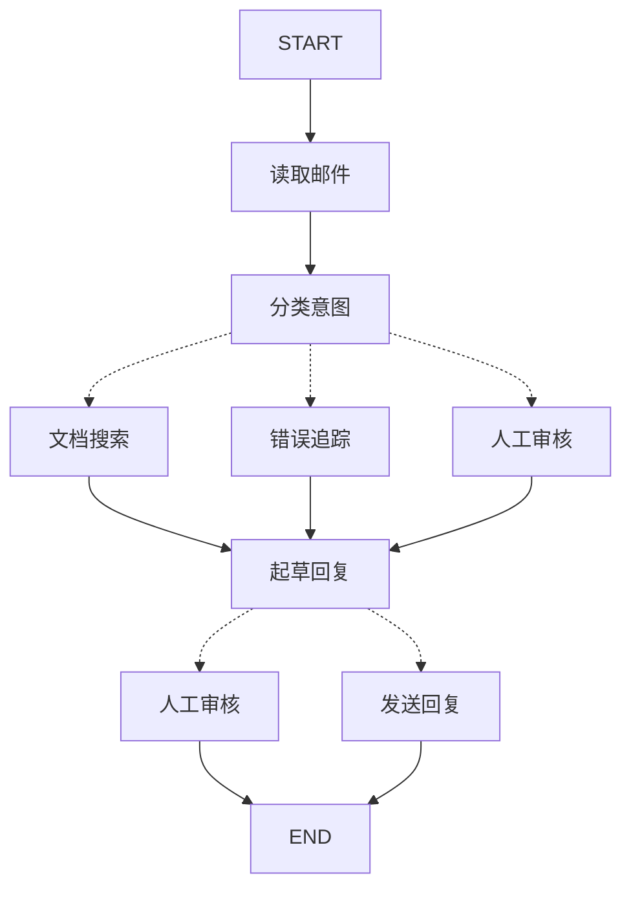
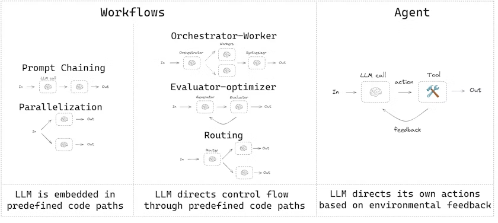
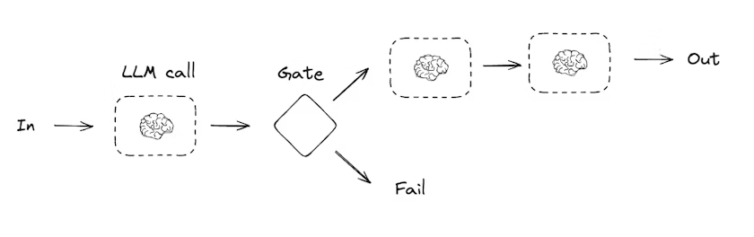
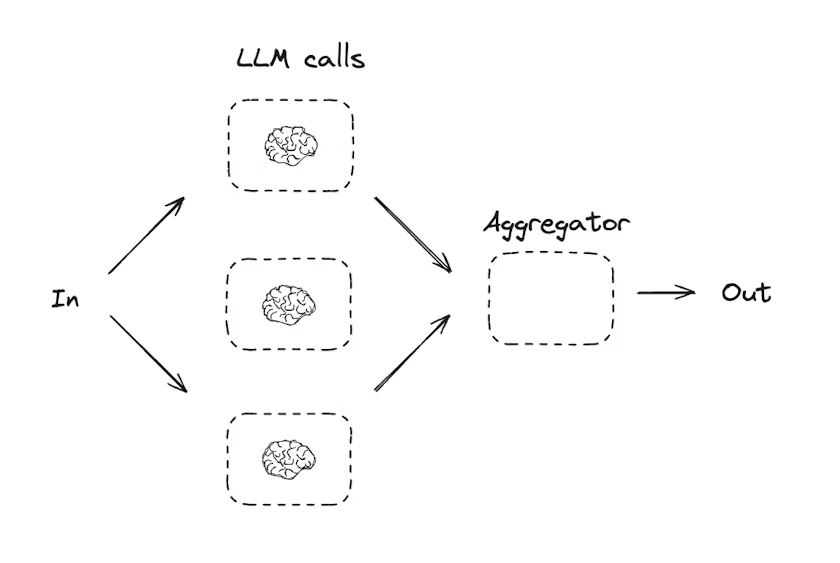
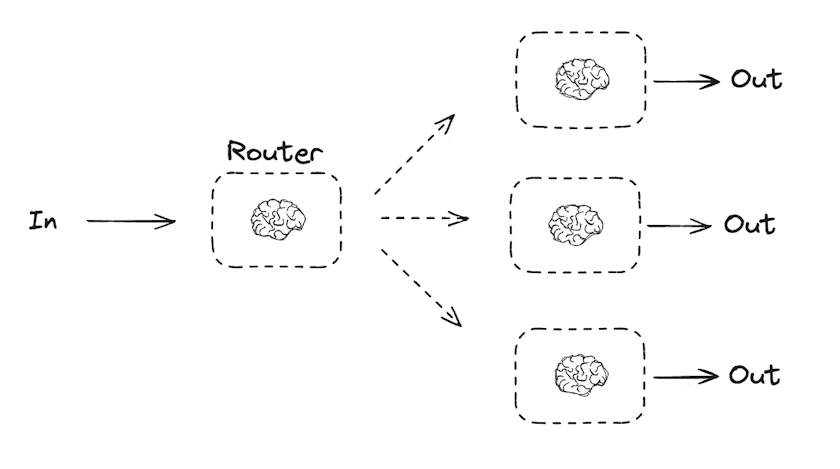
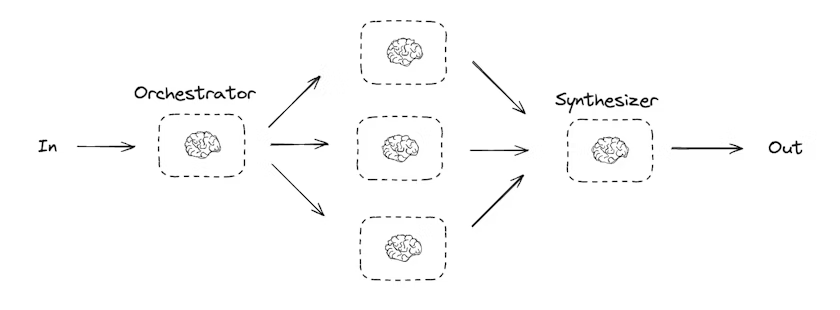
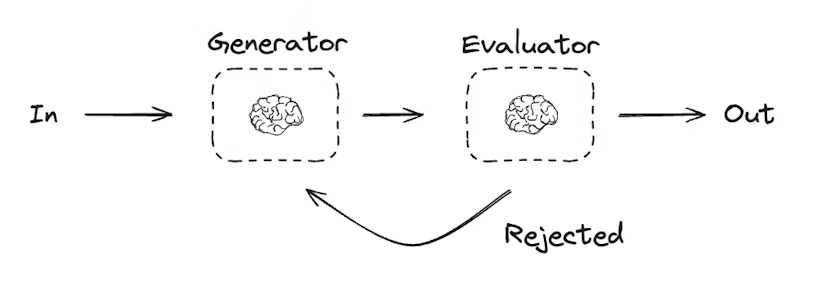
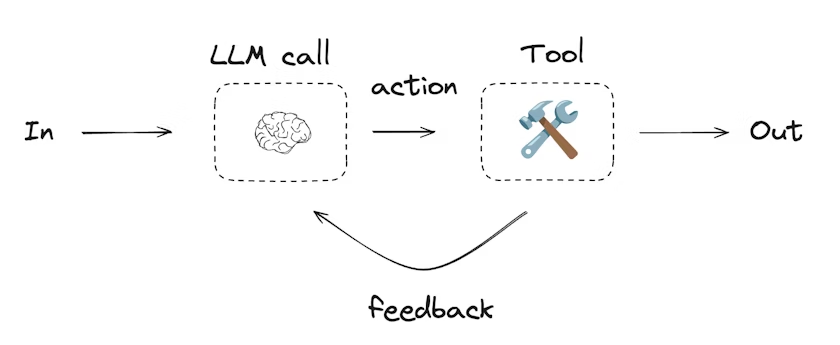

# LangGraph 基础

## LangGraph 概述

**LangGraph v1.0现已发布！**

有关完整的变更列表和如何升级代码的说明，请参阅[发布说明](https://langchain-doc.cn/v1/python/langgraph/releases/langgraph-v1)和[迁移指南](https://langchain-doc.cn/v1/python/langgraph/migrate/langgraph-v1)。

如果您遇到任何问题或有反馈，请[提交issue](https://github.com/langchain-ai/docs/issues/new?template=02-langgraph.yml&labels=langgraph)以便我们改进。要查看v0.x文档，请[访问存档内容](https://github.com/langchain-ai/langgraph/tree/main/docs/docs)。

### 什么是LangGraph？

LangGraph是一个低级编排框架和运行时，用于构建、管理和部署长时间运行的有状态代理。它受到包括Klarna、Replit、Elastic等塑造代理未来的公司的信任。

LangGraph非常低级，完全专注于代理**编排**。在使用LangGraph之前，我们建议您熟悉一些用于构建代理的组件，从[模型](https://langchain-doc.cn/v1/python/langchain/models)和[工具](https://langchain-doc.cn/v1/python/langchain/tools)开始。

在文档中，我们通常会使用[LangChain](https://langchain-doc.cn/v1/python/langchain/overview)组件来集成模型和工具，但您不需要使用LangChain来使用LangGraph。如果您刚开始接触代理或想要更高级的抽象，我们建议您使用LangChain的[代理](https://langchain-doc.cn/v1/python/langchain/agents)，它们为常见的LLM和工具调用循环提供了预构建的架构。

LangGraph专注于对代理编排重要的底层功能：持久执行、流式传输、人机协作等。

### 安装

#### Python

```bash
pip install -U langgraph
```

或使用uv：

```bash
uv add langgraph
```

#### JavaScript

```bash
npm install @langchain/langgraph @langchain/core
```

或使用pnpm：

```bash
pnpm add @langchain/langgraph @langchain/core
```

或使用yarn：

```bash
yarn add @langchain/langgraph @langchain/core
```

或使用bun：

```bash
bun add @langchain/langgraph @langchain/core
```

然后，创建一个简单的Hello World示例：

#### Python

```python
from langgraph.graph import StateGraph, MessagesState, START, END

def mock_llm(state: MessagesState):
    return {"messages": [{"role": "ai", "content": "hello world"}]}

graph = StateGraph(MessagesState)
graph.add_node(mock_llm)
graph.add_edge(START, "mock_llm")
graph.add_edge("mock_llm", END)
graph = graph.compile()

graph.invoke({"messages": [{"role": "user", "content": "hi!"}]})
```

#### JavaScript

```typescript
import { MessagesAnnotation, StateGraph, START, END } from "@langchain/langgraph";

const mockLlm = (state: typeof MessagesAnnotation.State) => {
  return { messages: [{ role: "ai", content: "hello world" }] };
};

const graph = new StateGraph(MessagesAnnotation)
  .addNode("mock_llm", mockLlm)
  .addEdge(START, "mock_llm")
  .addEdge("mock_llm", END)
  .compile();

await graph.invoke({ messages: [{ role: "user", content: "hi!" }] });
```


### 核心优势

LangGraph为任何长时间运行的有状态工作流或代理提供低级支持基础设施。LangGraph不抽象提示或架构，并提供以下核心优势：

- [持久执行](https://langchain-doc.cn/v1/python/langgraph/durable-execution)：构建能够在故障中持久存在并可以长时间运行的代理，从停止的地方继续执行。
- [人机协作](https://langchain-doc.cn/v1/python/langgraph/interrupts)：通过在任何点检查和修改代理状态来纳入人工监督。
- [全面的记忆](https://langchain-doc.cn/v1/python/concepts/memory)：创建具有短期工作记忆（用于持续推理）和跨会话长期记忆的有状态代理。
- [使用LangSmith进行调试](https://langchain-doc.cn/langsmith/home)：通过可视化工具深入了解复杂的代理行为，这些工具可以跟踪执行路径、捕获状态转换并提供详细的运行时指标。
- [生产就绪的部署](https://langchain-doc.cn/langsmith/deployments)：使用专为处理有状态、长时间运行的工作流的独特挑战而设计的可扩展基础设施，自信地部署复杂的代理系统。

### LangGraph生态系统

虽然LangGraph可以独立使用，但它也可以与任何LangChain产品无缝集成，为开发人员提供构建代理的全套工具。为了改善您的LLM应用程序开发，请将LangGraph与以下产品配对：

- [LangSmith](http://www.langchain.com/langsmith) — 有助于代理评估和可观察性。调试性能不佳的LLM应用程序运行，评估代理轨迹，获得生产环境中的可见性，并随着时间的推移提高性能。
- [LangSmith](https://langchain-doc.cn/langsmith/home) — 使用专为长时间运行的有状态工作流设计的部署平台，轻松部署和扩展代理。在团队中发现、重用、配置和共享代理，并通过[Studio](https://langchain-doc.cn/langsmith/studio)中的可视化原型设计快速迭代。
- [LangChain](https://langchain-doc.cn/v1/python/langchain/overview) - 提供集成和可组合组件，简化LLM应用程序开发。包含基于LangGraph构建的代理抽象。

### 鸣谢

LangGraph的灵感来自[Pregel](https://research.google/pubs/pub37252/)和[Apache Beam](https://beam.apache.org/)。公共接口从[NetworkX](https://networkx.org/documentation/latest/)汲取灵感。LangGraph由LangChain Inc构建，LangChain的创建者，但可以在不使用LangChain的情况下使用。


## 安装LangGraph

### 基本安装

要安装基础的LangGraph包：

#### Python

```bash
pip install -U langgraph
```

或使用uv：

```bash
uv add langgraph
```

#### JavaScript

```bash
npm install @langchain/langgraph @langchain/core
```

或使用pnpm：

```bash
pnpm add @langchain/langgraph @langchain/core
```

或使用yarn：

```bash
yarn add @langchain/langgraph @langchain/core
```

或使用bun：

```bash
bun add @langchain/langgraph @langchain/core
```

### 安装LangChain（可选）

使用LangGraph时，您通常需要访问LLM并定义工具。您可以以任何适合您的方式进行。

一种方法是使用[LangChain](https://langchain-doc.cn/v1/python/langchain/overview)（我们在文档中会使用这种方式）。

#### Python

```bash
pip install -U langchain
```

或使用uv：

```bash
uv add langchain
```

#### JavaScript

```bash
npm install langchain
```

或使用pnpm：

```bash
pnpm add langchain
```

或使用yarn：

```bash
yarn add langchain
```

或使用bun：

```bash
bun add langchain
```

### 安装特定的LLM提供商包

要使用特定的LLM提供商包，您需要单独安装它们。

请参考[集成](https://langchain-doc.cn/v1/python/integrations/providers/overview)页面获取提供商特定的安装说明。


## 快速开始

本快速入门演示了如何使用LangGraph Graph API或Functional API构建计算器代理。

- 如果您更喜欢将代理定义为节点和边的图形，请使用[Graph API](https://langchain-doc.cn/v1/python/langgraph/quickstart.html#使用-graph-api)。
- 如果您更喜欢将代理定义为单个函数，请使用[Functional API](https://langchain-doc.cn/v1/python/langgraph/quickstart.html#使用-functional-api)。

有关概念信息，请参阅[Graph API概述](https://langchain-doc.cn/v1/python/langgraph/graph-api)和[Functional API概述](https://langchain-doc.cn/v1/python/langgraph/functional-api)。

**提示：** 对于本示例，您需要设置[Claude (Anthropic)](https://www.anthropic.com/)账户并获取API密钥。然后，在终端中设置`ANTHROPIC_API_KEY`环境变量。

### 使用Graph API

#### 1. 定义工具和模型

在本示例中，我们将使用Claude Sonnet 4.5模型并定义加法、乘法和除法工具。

```python
from langchain.tools import tool
from langchain.chat_models import init_chat_model


model = init_chat_model(
    "claude-sonnet-4-5-20250929",
    temperature=0
)


# 定义工具
@tool
def multiply(a: int, b: int) -> int:
    """将`a`和`b`相乘。

    参数：
        a: 第一个整数
        b: 第二个整数
    """
    return a * b


@tool
def add(a: int, b: int) -> int:
    """将`a`和`b`相加。

    参数：
        a: 第一个整数
        b: 第二个整数
    """
    return a + b


@tool
def divide(a: int, b: int) -> float:
    """将`a`除以`b`。

    参数：
        a: 第一个整数
        b: 第二个整数
    """
    return a / b


# 增强LLM的工具能力
tools = [add, multiply, divide]
tools_by_name = {tool.name: tool for tool in tools}
model_with_tools = model.bind_tools(tools)
```


```typescript
import { ChatAnthropic } from "@langchain/anthropic";
import { tool } from "@langchain/core/tools";
import * as z from "zod";

const model = new ChatAnthropic({
  model: "claude-sonnet-4-5-20250929",
  temperature: 0,
});

// 定义工具
const add = tool(({ a, b }) => a + b, {
  name: "add",
  description: "Add two numbers",
  schema: z.object({
    a: z.number().describe("First number"),
    b: z.number().describe("Second number"),
  }),
});

const multiply = tool(({ a, b }) => a * b, {
  name: "multiply",
  description: "Multiply two numbers",
  schema: z.object({
    a: z.number().describe("First number"),
    b: z.number().describe("Second number"),
  }),
});

const divide = tool(({ a, b }) => a / b, {
  name: "divide",
  description: "Divide two numbers",
  schema: z.object({
    a: z.number().describe("First number"),
    b: z.number().describe("Second number"),
  }),
});

// 增强LLM的工具能力
const toolsByName = {
  [add.name]: add,
  [multiply.name]: multiply,
  [divide.name]: divide,
};
const tools = Object.values(toolsByName);
const modelWithTools = model.bindTools(tools);
```

#### 2. 定义状态

图形的状态用于存储消息和LLM调用次数。

**提示：** LangGraph中的状态在代理执行过程中持续存在。带有`operator.add`的`Annotated`类型确保新消息被追加到现有列表中，而不是替换它。

```python
from langchain.messages import AnyMessage
from typing_extensions import TypedDict, Annotated
import operator


class MessagesState(TypedDict):
    messages: Annotated[list[AnyMessage], operator.add]
    llm_calls: int
```


```typescript
import { StateGraph, START, END } from "@langchain/langgraph";
import { MessagesZodMeta } from "@langchain/langgraph";
import { registry } from "@langchain/langgraph/zod";
import { type BaseMessage } from "@langchain/core/messages";

const MessagesState = z.object({
  messages: z
    .array(z.custom<BaseMessage>())
    .register(registry, MessagesZodMeta),
  llmCalls: z.number().optional(),
});
```

#### 3. 定义模型节点

模型节点用于调用LLM并决定是否调用工具。

```python
from langchain.messages import SystemMessage


def llm_call(state: dict):
    """LLM决定是否调用工具"""

    return {
        "messages": [
            model_with_tools.invoke(
                [
                    SystemMessage(
                        content="你是一个有用的助手，负责对一组输入执行算术运算。"
                    )
                ]
                + state["messages"]
            )
        ],
        "llm_calls": state.get('llm_calls', 0) + 1
    }
```


```typescript
import { SystemMessage } from "@langchain/core/messages";
async function llmCall(state: z.infer<typeof MessagesState>) {
  return {
    messages: await modelWithTools.invoke([
      new SystemMessage(
        "你是一个有用的助手，负责对一组输入执行算术运算。"
      ),
      ...state.messages,
    ]),
    llmCalls: (state.llmCalls ?? 0) + 1,
  };
}
```

#### 4. 定义工具节点

工具节点用于调用工具并返回结果。

```python
from langchain.messages import ToolMessage


def tool_node(state: dict):
    """执行工具调用"""

    result = []
    for tool_call in state["messages"][-1].tool_calls:
        tool = tools_by_name[tool_call["name"]]
        observation = tool.invoke(tool_call["args"])
        result.append(ToolMessage(content=observation, tool_call_id=tool_call["id"]))
    return {"messages": result}
```


```typescript
import { isAIMessage, ToolMessage } from "@langchain/core/messages";
async function toolNode(state: z.infer<typeof MessagesState>) {
  const lastMessage = state.messages.at(-1);

  if (lastMessage == null || !isAIMessage(lastMessage)) {
    return { messages: [] };
  }

  const result: ToolMessage[] = [];
  for (const toolCall of lastMessage.tool_calls ?? []) {
    const tool = toolsByName[toolCall.name];
    const observation = await tool.invoke(toolCall);
    result.push(observation);
  }

  return { messages: result };
}
```

#### 5. 定义结束逻辑

条件边函数用于根据LLM是否进行了工具调用来路由到工具节点或结束。

```python
from typing import Literal
from langgraph.graph import StateGraph, START, END


def should_continue(state: MessagesState) -> Literal["tool_node", END]:
    """决定是否继续循环或停止，基于LLM是否进行了工具调用"""

    messages = state["messages"]
    last_message = messages[-1]

    # 如果LLM进行了工具调用，则执行操作
    if last_message.tool_calls:
        return "tool_node"

    # 否则，我们停止（回复用户）
    return END
```


```typescript
async function shouldContinue(state: z.infer<typeof MessagesState>) {
  const lastMessage = state.messages.at(-1);
  if (lastMessage == null || !isAIMessage(lastMessage)) return END;

  // 如果LLM进行了工具调用，则执行操作
  if (lastMessage.tool_calls?.length) {
    return "toolNode";
  }

  // 否则，我们停止（回复用户）
  return END;
}
```

#### 6. 构建并编译代理

代理使用`StateGraph`类构建，并使用`compile`方法编译。

```python
# 构建工作流
agent_builder = StateGraph(MessagesState)

# 添加节点
agent_builder.add_node("llm_call", llm_call)
agent_builder.add_node("tool_node", tool_node)

# 添加边连接节点
agent_builder.add_edge(START, "llm_call")
agent_builder.add_conditional_edges(
    "llm_call",
    should_continue,
    ["tool_node", END]
)
agent_builder.add_edge("tool_node", "llm_call")

# 编译代理
agent = agent_builder.compile()

# 显示代理
from IPython.display import Image, display
display(Image(agent.get_graph(xray=True).draw_mermaid_png()))

# 调用
from langchain.messages import HumanMessage
messages = [HumanMessage(content="3加4等于多少。")]
messages = agent.invoke({"messages": messages})
for m in messages["messages"]:
    m.pretty_print()
```


```typescript
const agent = new StateGraph(MessagesState)
  .addNode("llmCall", llmCall)
  .addNode("toolNode", toolNode)
  .addEdge(START, "llmCall")
  .addConditionalEdges("llmCall", shouldContinue, ["toolNode", END])
  .addEdge("toolNode", "llmCall")
  .compile();

// 调用
import { HumanMessage } from "@langchain/core/messages";
const result = await agent.invoke({
  messages: [new HumanMessage("3加4等于多少。")],
});

for (const message of result.messages) {
  console.log(`[${message.getType()}]: ${message.text}`);
}
```

**提示：** 要了解如何使用LangSmith跟踪您的代理，请参阅[LangSmith文档](https://langchain-doc.cn/langsmith/trace-with-langgraph)。

恭喜！您已经使用LangGraph Graph API构建了第一个代理。

### 使用Functional API

#### 1. 定义工具和模型

在本示例中，我们将使用Claude Sonnet 4.5模型并定义加法、乘法和除法工具。

```python
from langchain.tools import tool
from langchain.chat_models import init_chat_model


model = init_chat_model(
    "claude-sonnet-4-5-20250929",
    temperature=0
)


# 定义工具
@tool
def multiply(a: int, b: int) -> int:
    """将`a`和`b`相乘。

    参数：
        a: 第一个整数
        b: 第二个整数
    """
    return a * b


@tool
def add(a: int, b: int) -> int:
    """将`a`和`b`相加。

    参数：
        a: 第一个整数
        b: 第二个整数
    """
    return a + b


@tool
def divide(a: int, b: int) -> float:
    """将`a`除以`b`。

    参数：
        a: 第一个整数
        b: 第二个整数
    """
    return a / b


# 增强LLM的工具能力
tools = [add, multiply, divide]
tools_by_name = {tool.name: tool for tool in tools}
model_with_tools = model.bind_tools(tools)

from langgraph.graph import add_messages
from langchain.messages import (
    SystemMessage,
    HumanMessage,
    ToolCall,
)
from langchain_core.messages import BaseMessage
from langgraph.func import entrypoint, task
```


```typescript
import { ChatAnthropic } from "@langchain/anthropic";
import { tool } from "@langchain/core/tools";
import * as z from "zod";

const model = new ChatAnthropic({
  model: "claude-sonnet-4-5-20250929",
  temperature: 0,
});

// 定义工具
const add = tool(({ a, b }) => a + b, {
  name: "add",
  description: "Add two numbers",
  schema: z.object({
    a: z.number().describe("First number"),
    b: z.number().describe("Second number"),
  }),
});

const multiply = tool(({ a, b }) => a * b, {
  name: "multiply",
  description: "Multiply two numbers",
  schema: z.object({
    a: z.number().describe("First number"),
    b: z.number().describe("Second number"),
  }),
});

const divide = tool(({ a, b }) => a / b, {
  name: "divide",
  description: "Divide two numbers",
  schema: z.object({
    a: z.number().describe("First number"),
    b: z.number().describe("Second number"),
  }),
});

// 增强LLM的工具能力
const toolsByName = {
  [add.name]: add,
  [multiply.name]: multiply,
  [divide.name]: divide,
};
const tools = Object.values(toolsByName);
const modelWithTools = model.bindTools(tools);
```

#### 2. 定义模型节点

模型节点用于调用LLM并决定是否调用工具。

**提示：** `@task`装饰器将函数标记为可以作为代理一部分执行的任务。任务可以在入口点函数内同步或异步调用。

```python
@task
def call_llm(messages: list[BaseMessage]):
    """LLM决定是否调用工具"""
    return model_with_tools.invoke(
        [
            SystemMessage(
                content="你是一个有用的助手，负责对一组输入执行算术运算。"
            )
        ]
        + messages
    )
```


```typescript
import { task, entrypoint } from "@langchain/langgraph";
import { SystemMessage } from "@langchain/core/messages";
const callLlm = task({ name: "callLlm" }, async (messages: BaseMessage[]) => {
  return modelWithTools.invoke([
    new SystemMessage(
      "你是一个有用的助手，负责对一组输入执行算术运算。"
    ),
    ...messages,
  ]);
});
```

#### 3. 定义工具节点

工具节点用于调用工具并返回结果。

```python
@task
def call_tool(tool_call: ToolCall):
    """执行工具调用"""
    tool = tools_by_name[tool_call["name"]]
    return tool.invoke(tool_call)
```


```typescript
import type { ToolCall } from "@langchain/core/messages/tool";
const callTool = task({ name: "callTool" }, async (toolCall: ToolCall) => {
  const tool = toolsByName[toolCall.name];
  return tool.invoke(toolCall);
});
```

#### 4. 定义代理

代理使用`@entrypoint`函数构建。

**注意：** 在Functional API中，您不需要显式定义节点和边，而是在单个函数内编写标准控制流逻辑（循环、条件）。

```python
@entrypoint()
def agent(messages: list[BaseMessage]):
    model_response = call_llm(messages).result()

    while True:
        if not model_response.tool_calls:
            break

        # 执行工具
        tool_result_futures = [
            call_tool(tool_call) for tool_call in model_response.tool_calls
        ]
        tool_results = [fut.result() for fut in tool_result_futures]
        messages = add_messages(messages, [model_response, *tool_results])
        model_response = call_llm(messages).result()

    messages = add_messages(messages, model_response)
    return messages

# 调用
messages = [HumanMessage(content="3加4等于多少。")]
for chunk in agent.stream(messages, stream_mode="updates"):
    print(chunk)
    print("\n")
```


```typescript
import { addMessages } from "@langchain/langgraph";
import { type BaseMessage, isAIMessage } from "@langchain/core/messages";

const agent = entrypoint({ name: "agent" }, async (messages: BaseMessage[]) => {
  let modelResponse = await callLlm(messages);

  while (true) {
    if (!modelResponse.tool_calls?.length) {
      break;
    }

    // 执行工具
    const toolResults = await Promise.all(
      modelResponse.tool_calls.map((toolCall) => callTool(toolCall))
    );
    messages = addMessages(messages, [modelResponse, ...toolResults]);
    modelResponse = await callLlm(messages);
  }

  return messages;
});

// 调用
import { HumanMessage } from "@langchain/core/messages";

const result = await agent.invoke([new HumanMessage("3加4等于多少。")]);

for (const message of result) {
  console.log(`[${message.getType()}]: ${message.text}`);
}
```

**提示：** 要了解如何使用LangSmith跟踪您的代理，请参阅[LangSmith文档](https://langchain-doc.cn/langsmith/trace-with-langgraph)。

恭喜！您已经使用LangGraph Functional API构建了第一个代理。

## 运行本地服务器

本指南向你展示如何在本地运行LangGraph应用程序。

### 先决条件

在开始之前，请确保你具备以下条件：

- [LangSmith](https://smith.langchain.com/settings)的API密钥 - 免费注册

### 1. 安装LangGraph CLI

#### Python

```bash
# 需要Python >= 3.11
pip install -U "langgraph-cli[inmem]"
```

```bash
# 需要Python >= 3.11
uv add langgraph-cli[inmem]
```

#### JavaScript

```shell
npx @langchain/langgraph-cli
```

### 2. 创建LangGraph应用 🌱

#### Python

从[`new-langgraph-project-python`模板](https://github.com/langchain-ai/new-langgraph-project)创建一个新应用。这个模板演示了你可以用自己的逻辑扩展的单节点应用程序。

```shell
langgraph new path/to/your/app --template new-langgraph-project-python
```

**附加模板**
如果你使用`langgraph new`而不指定模板，你将看到一个交互式菜单，允许你从可用模板列表中进行选择。

#### JavaScript

从[`new-langgraph-project-js`模板](https://github.com/langchain-ai/new-langgraphjs-project)创建一个新应用。这个模板演示了你可以用自己的逻辑扩展的单节点应用程序。

```shell
npm create langgraph
```

### 3. 安装依赖

在你的新LangGraph应用的根目录中，以`edit`模式安装依赖，以便服务器使用你的本地更改：

#### Python

```bash
cd path/to/your/app
pip install -e .
```

```bash
cd path/to/your/app
uv add .
```

#### JavaScript

```shell
cd path/to/your/app
npm install
```

### 4. 创建`.env`文件

你将在新LangGraph应用的根目录中找到一个`.env.example`文件。在新LangGraph应用的根目录中创建一个`.env`文件，并将`.env.example`文件的内容复制到其中，填写必要的API密钥：

```bash
LANGSMITH_API_KEY=lsv2...
```

### 5. 启动LangGraph服务器 🚀

在本地启动LangGraph API服务器：

#### Python

```shell
langgraph dev
```

#### JavaScript

```shell
npx @langchain/langgraph-cli dev
```

示例输出：

```
>    Ready!
>
>    - API: [http://localhost:2024](http://localhost:2024/)
>
>    - Docs: http://localhost:2024/docs
>
>    - LangGraph Studio Web UI: https://smith.langchain.com/studio/?baseUrl=http://127.0.0.1:2024
```

`langgraph dev`命令以内存模式启动LangGraph服务器。此模式适合开发和测试目的。对于生产使用，请部署具有持久存储后端访问权限的LangGraph服务器。有关更多信息，请参阅[托管概述](https://langchain-doc.cn/langsmith/platform-setup)。

### 6. 在Studio中测试你的应用程序

[Studio](https://langchain-doc.cn/langsmith/studio)是一个专门的UI，你可以连接到LangGraph API服务器以可视化、交互和调试你的本地应用程序。通过访问`langgraph dev`命令输出中提供的URL在Studio中测试你的图：

```
>    - LangGraph Studio Web UI: https://smith.langchain.com/studio/?baseUrl=http://127.0.0.1:2024
```

对于在自定义主机/端口上运行的LangGraph服务器，请更新baseURL参数。

**Safari兼容性**
使用命令的`--tunnel`标志创建安全隧道，因为Safari在连接到localhost服务器时有限制：

```shell
langgraph dev --tunnel
```

### 7. 测试API

#### Python

**Python SDK（异步）**

1. 安装LangGraph Python SDK：

```shell
pip install langgraph-sdk
```

1. 向助手发送消息（无线程运行）：

```python
from langgraph_sdk import get_client
import asyncio

client = get_client(url="http://localhost:2024")

async def main():
    async for chunk in client.runs.stream(
        None,  # 无线程运行
        "agent", # 助手名称。在langgraph.json中定义。
        input={
        "messages": [{
            "role": "human",
            "content": "什么是LangGraph？",
            }],
        },
    ):
        print(f"接收类型为: {chunk.event} 的新事件...")
        print(chunk.data)
        print("\n\n")

asyncio.run(main())
```

**Python SDK（同步）**

1. 安装LangGraph Python SDK：

```shell
pip install langgraph-sdk
```

1. 向助手发送消息（无线程运行）：

```python
from langgraph_sdk import get_sync_client

client = get_sync_client(url="http://localhost:2024")

for chunk in client.runs.stream(
    None,  # 无线程运行
    "agent", # 助手名称。在langgraph.json中定义。
    input={
        "messages": [{
            "role": "human",
            "content": "什么是LangGraph？",
        }],
    },
    stream_mode="messages-tuple",
):
    print(f"接收类型为: {chunk.event} 的新事件...")
    print(chunk.data)
    print("\n\n")
```

**REST API**

```bash
curl -s --request POST \
    --url "http://localhost:2024/runs/stream" \
    --header 'Content-Type: application/json' \
    --data "{
        \"assistant_id\": \"agent\",
        \"input\": {
            \"messages\": [
                {
                    \"role\": \"human\",
                    \"content\": \"什么是LangGraph？\" 
                }
            ]
        },
        \"stream_mode\": \"messages-tuple\" 
    }"
```

#### JavaScript

**JavaScript SDK**

1. 安装LangGraph JS SDK：

```shell
npm install @langchain/langgraph-sdk
```

1. 向助手发送消息（无线程运行）：

```js
const { Client } = await import("@langchain/langgraph-sdk");

// 只有在调用langgraph dev时更改了默认端口时才设置apiUrl
const client = new Client({ apiUrl: "http://localhost:2024"});

const streamResponse = client.runs.stream(
    null, // 无线程运行
    "agent", // 助手ID
    {
        input: {
            "messages": [
                { "role": "user", "content": "什么是LangGraph？"}
            ]
        },
        streamMode: "messages-tuple",
    }
);

for await (const chunk of streamResponse) {
    console.log(`接收类型为: ${chunk.event} 的新事件...`);
    console.log(JSON.stringify(chunk.data));
    console.log("\n\n");
}
```

**REST API**

```bash
curl -s --request POST \
    --url "http://localhost:2024/runs/stream" \
    --header 'Content-Type: application/json' \
    --data "{
        \"assistant_id\": \"agent\",
        \"input\": {
            \"messages\": [
                {
                    \"role\": \"human\",
                    \"content\": \"什么是LangGraph？\" 
                }
            ]
        },
        \"stream_mode\": \"messages-tuple\" 
    }"
```

### 下一步

现在你已经在本地运行了LangGraph应用程序，通过探索部署和高级功能来进一步推进你的旅程：

- [部署快速入门](https://langchain-doc.cn/langsmith/deployment-quickstart)：使用LangSmith部署你的LangGraph应用。
- [LangSmith](https://langchain-doc.cn/langsmith/home)：了解LangSmith的基础概念。

#### Python

- [Python SDK参考](https://reference.langchain.com/python/platform/python_sdk/)：探索Python SDK API参考。

#### JavaScript

- [JS/TS SDK参考](https://reference.langchain.com/javascript/modules/_langchain_langgraph-sdk.html)：探索JS/TS SDK API参考。


## 使用LangGraph思考

LangGraph可以改变你构建代理的思维方式。当你使用LangGraph构建代理时，首先需要将其分解为称为**节点**的离散步骤。然后，描述每个节点的不同决策和转换。最后，通过共享的**状态**将节点连接在一起，每个节点都可以读取和写入这个状态。在本教程中，我们将指导你通过构建客户支持电子邮件代理的思考过程来理解LangGraph。

### 从你想要自动化的流程开始

假设你需要构建一个处理客户支持电子邮件的AI代理。产品团队给你提供了以下要求：

该代理应该：

- 读取传入的客户电子邮件
- 按紧急程度和主题分类
- 搜索相关文档来回答问题
- 起草适当的回复
- 将复杂问题升级给人类代理
- 在需要时安排后续跟进

需要处理的示例场景：

1. 简单的产品问题："如何重置我的密码？"
2. 错误报告："当我选择PDF格式时，导出功能崩溃"
3. 紧急账单问题："我的订阅被重复收费了！"
4. 功能请求："你能为移动应用添加深色模式吗？"
5. 复杂技术问题："我们的API集成间歇性失败，出现504错误"

在LangGraph中实现代理，通常遵循以下五个步骤。

### 步骤1：将工作流映射为离散步骤

首先确定流程中的不同步骤。每个步骤将成为一个**节点**（执行特定任务的函数）。然后勾勒这些步骤如何相互连接。



箭头显示可能的路径，但实际选择哪条路径的决定发生在每个节点内部。

现在你已经确定了工作流中的组件，让我们了解每个节点需要做什么：

- 读取邮件：提取和解析邮件内容
- 分类意图：使用LLM对紧急程度和主题进行分类，然后路由到适当的操作
- 文档搜索：查询知识库以获取相关信息
- 错误追踪：在跟踪系统中创建或更新问题
- 起草回复：生成适当的回复
- 人工审核：升级给人类代理进行批准或处理
- 发送回复：发送电子邮件回复

提示：注意一些节点决定下一步去哪里（分类意图、起草回复、人工审核），而其他节点总是继续到同一个下一步（读取邮件总是转到分类意图，文档搜索总是转到起草回复）。

### 步骤2：确定每个步骤需要做什么

对于图中的每个节点，确定它代表什么类型的操作以及它正常工作需要什么上下文。

#### LLM步骤

当步骤需要理解、分析、生成文本或做出推理决策时：

**分类意图节点**

- 静态上下文（提示）：分类类别、紧急程度定义、响应格式
- 动态上下文（来自状态）：邮件内容、发件人信息
- 期望结果：确定路由的结构化分类

**起草回复节点**

- 静态上下文（提示）：语气指南、公司政策、回复模板
- 动态上下文（来自状态）：分类结果、搜索结果、客户历史
- 期望结果：可供审核的专业电子邮件回复

#### 数据步骤

当步骤需要从外部源检索信息时：

**文档搜索节点**

- 参数：根据意图和主题构建的查询
- 重试策略：是，对瞬态故障使用指数退避
- 缓存：可以缓存常见查询以减少API调用

**客户历史查询**

- 参数：来自状态的客户电子邮件或ID
- 重试策略：是，但如果不可用则回退到基本信息
- 缓存：是，使用生存时间来平衡新鲜度和性能

#### 操作步骤

当步骤需要执行外部操作时：

**发送回复节点**

- 何时执行：在批准后（人工或自动）
- 重试策略：是，对网络问题使用指数退避
- 不应缓存：每次发送都是唯一的操作

**错误追踪节点**

- 何时执行：当意图为"错误"时总是执行
- 重试策略：是，关键是不要丢失错误报告
- 返回：要包含在回复中的工单ID

#### 用户输入步骤

当步骤需要人工干预时：

**人工审核节点**

- 决策上下文：原始邮件、草拟回复、紧急程度、分类
- 预期输入格式：批准布尔值加上可选的编辑回复
- 何时触发：高紧急度、复杂问题或质量问题

### 步骤3：设计状态

状态是所有节点可访问的共享[内存](https://langchain-doc.cn/v1/python/concepts/memory)。将其视为代理用来跟踪工作过程中学习和决定的所有内容的笔记本。

#### 什么应该包含在状态中？

对于每个数据项，问自己这些问题：

- **包含在状态中**：它需要在步骤之间持久化吗？如果是，它应该在状态中。
- **不存储**：你可以从其他数据派生它吗？如果是，在需要时计算它，而不是将其存储在状态中。

对于我们的电子邮件代理，我们需要跟踪：

- 原始邮件和发件人信息（无法重建）
- 分类结果（多个下游节点需要）
- 搜索结果和客户数据（重新获取成本高）
- 草拟回复（需要在审核过程中持久化）
- 执行元数据（用于调试和恢复）

#### 保持状态原始，按需格式化提示

一个关键原则：状态应该存储原始数据，而不是格式化文本。在需要时在节点内格式化提示。

这种分离意味着：

- 不同节点可以根据需要以不同方式格式化相同数据
- 你可以更改提示模板而无需修改状态模式
- 调试更清晰 - 你可以确切地看到每个节点收到了什么数据
- 你的代理可以在不破坏现有状态的情况下发展

让我们定义我们的状态：

```python
from typing import TypedDict, Literal

# 定义电子邮件分类的结构
class EmailClassification(TypedDict):
    intent: Literal["question", "bug", "billing", "feature", "complex"]
    urgency: Literal["low", "medium", "high", "critical"]
    topic: str
    summary: str

class EmailAgentState(TypedDict):
    # 原始邮件数据
    email_content: str
    sender_email: str
    email_id: str

    # 分类结果
    classification: EmailClassification | None

    # 原始搜索/API结果
    search_results: list[str] | None  # 原始文档块列表
    customer_history: dict | None  # 来自CRM的原始客户数据

    # 生成的内容
    draft_response: str | None
    messages: list[str] | None
```


```typescript
import * as z from "zod";

// 定义电子邮件分类的结构
const EmailClassificationSchema = z.object({
  intent: z.enum(["question", "bug", "billing", "feature", "complex"]),
  urgency: z.enum(["low", "medium", "high", "critical"]),
  topic: z.string(),
  summary: z.string(),
});

const EmailAgentState = z.object({
  // 原始邮件数据
  emailContent: z.string(),
  senderEmail: z.string(),
  emailId: z.string(),

  // 分类结果
  classification: EmailClassificationSchema.optional(),

  // 原始搜索/API结果
  searchResults: z.array(z.string()).optional(),  // 原始文档块列表
  customerHistory: z.record(z.any()).optional(),  // 来自CRM的原始客户数据

  // 生成的内容
  responseText: z.string().optional(),
});

type EmailAgentStateType = z.infer<typeof EmailAgentState>;
type EmailClassificationType = z.infer<typeof EmailClassificationSchema>;
```

注意，状态只包含原始数据 - 没有提示模板，没有格式化字符串，没有指令。分类输出直接以单个字典形式从LLM存储。

### 步骤4：构建节点

现在我们将每个步骤实现为函数。LangGraph中的节点只是一个Python或JavaScript函数，它接受当前状态并返回对它的更新。

#### 适当处理错误

不同的错误需要不同的处理策略：

| 错误类型                                 | 谁来修复     | 策略                       | 何时使用                    |
| ---------------------------------------- | ------------ | -------------------------- | --------------------------- |
| 瞬态错误（网络问题、速率限制）           | 系统（自动） | 重试策略                   | 通常在重试后解决的临时故障  |
| LLM可恢复错误（工具故障、解析问题）      | LLM          | 在状态中存储错误并循环返回 | LLM可以看到错误并调整其方法 |
| 用户可修复错误（缺少信息、不明确的指令） | 人类         | 使用`interrupt()`暂停      | 需要用户输入才能继续        |
| 意外错误                                 | 开发者       | 让它们冒泡                 | 需要调试的未知问题          |

##### 瞬态错误

添加重试策略以自动重试网络问题和速率限制：

```python
from langgraph.types import RetryPolicy

workflow.add_node(
    "search_documentation",
    search_documentation,
    retry_policy=RetryPolicy(max_attempts=3, initial_interval=1.0)
)
```

```typescript
import type { RetryPolicy } from "@langchain/langgraph";

workflow.addNode(
"searchDocumentation",
searchDocumentation,
{
    retryPolicy: { maxAttempts: 3, initialInterval: 1.0 },
},
);
```

##### LLM可恢复错误

在状态中存储错误并循环返回，以便LLM可以看到出了什么问题并再次尝试：

```python
from langgraph.types import Command


def execute_tool(state: State) -> Command[Literal["agent", "execute_tool"]]:
    try:
        result = run_tool(state['tool_call'])
        return Command(update={"tool_result": result}, goto="agent")
    except ToolError as e:
        # 让LLM看到出了什么问题并再次尝试
        return Command(
            update={"tool_result": f"工具错误: {str(e)}"},
            goto="agent"
        )
```

```typescript
import { Command } from "@langchain/langgraph";

async function executeTool(state: State) {
  try {
    const result = await runTool(state.toolCall);
    return new Command({
    update: { toolResult: result },
    goto: "agent",
    });
  } catch (error) {
    // 让LLM看到出了什么问题并再次尝试
    return new Command({
    update: { toolResult: `工具错误: ${error}` },
    goto: "agent"
    });
  }
}
```

##### 用户可修复错误

在需要时暂停并从用户那里收集信息（如账户ID、订单号或澄清）：

```python
from langgraph.types import Command


def lookup_customer_history(state: State) -> Command[Literal["draft_response"]]:
    if not state.get('customer_id'):
        user_input = interrupt({
            "message": "需要客户ID",
            "request": "请提供客户的账户ID以查询其订阅历史"
        })
        return Command(
            update={"customer_id": user_input['customer_id']},
            goto="lookup_customer_history"
        )
    # 现在继续查询
    customer_data = fetch_customer_history(state['customer_id'])
    return Command(update={"customer_history": customer_data}, goto="draft_response")
```

```typescript
import { Command, interrupt } from "@langchain/langgraph";

async function lookupCustomerHistory(state: State) {
  if (!state.customerId) {
    const userInput = interrupt({
    message: "需要客户ID",
    request: "请提供客户的账户ID以查询其订阅历史",
    });
    return new Command({
    update: { customerId: userInput.customerId },
    goto: "lookupCustomerHistory",
    });
  }
  // 现在继续查询
  const customerData = await fetchCustomerHistory(state.customerId);
  return new Command({
    update: { customerHistory: customerData },
    goto: "draftResponse",
  });
}
```

##### 意外错误

让它们冒泡以供调试。不要捕获你无法处理的内容：

```python
def send_reply(state: EmailAgentState):
    try:
        email_service.send(state["draft_response"])
    except Exception:
        raise  # 暴露意外错误
```

```typescript
async function sendReply(state: EmailAgentStateType): Promise<void> {
  try {
    await emailService.send(state.responseText);
  } catch (error) {
    throw error;  // 暴露意外错误
  }
}
```


#### 实现我们的电子邮件代理节点（todo）


## 工作流与智能体

在 LangChain 中，您可以构建工作流和智能体，它们分别适用于不同类型的应用场景。本指南将介绍这两种模式以及何时使用它们。

### 工作流

工作流是预定义的执行路径，其中每个步骤都按照特定顺序执行。它们适用于问题和解决方案可预测的情况。工作流可以包含条件分支、循环和并行执行。

                     		                                                                                         *workflow.png*

#### 为什么使用 LangGraph 构建工作流？

LangGraph 为构建 LLM 应用工作流提供了几个关键优势：

- **持久性**：工作流状态会自动保存，支持中断和恢复执行
- **流式处理**：实时查看工作流的执行过程和中间结果
- **调试**：跟踪每个步骤的状态变化和执行路径
- **部署**：轻松部署为服务或嵌入到现有应用程序中

#### 安装

在开始之前，确保安装了 LangGraph：

```bash
pip install langgraph
```

对于 TypeScript：

```bash
npm install @langchain/langgraph
```

#### 初始化 LLM

让我们首先设置我们的 LLM。我们将使用 Anthropic 的模型，因为它们在结构化输出和工具使用方面表现出色。

```python
from langchain_anthropic import ChatAnthropic

# 初始化 LLM
llm = ChatAnthropic(model="claude-3-opus-20240229")
```

对于 JavaScript：

```typescript
import { ChatAnthropic } from "@langchain/anthropic";

// 初始化 LLM
const llm = new ChatAnthropic({
  model: "claude-3-opus-20240229",
});
```

#### 结构化输出

在构建工作流时，我们经常需要从 LLM 获取结构化输出。我们可以使用 Pydantic 来定义输出模式。

```python
from pydantic import BaseModel, Field

# 定义结构化输出的模型
class MultiplierResponse(BaseModel):
    result: int = Field(description="乘法运算的结果")

# 使用结构化输出增强 LLM
llm_with_structured_output = llm.with_structured_output(MultiplierResponse)

# 调用 LLM 并获取结构化输出
response = llm_with_structured_output.invoke("计算 5 乘以 3 的结果")
print(response.result)  # 输出: 15
```

对于 TypeScript，我们使用 Zod 来定义模式：

```typescript
import * as z from "zod";

// 定义结构化输出的模型
const multiplierResponseSchema = z.object({
  result: z.number().describe("乘法运算的结果"),
});

// 使用结构化输出增强 LLM
const llmWithStructuredOutput = llm.withStructuredOutput(multiplierResponseSchema);

// 调用 LLM 并获取结构化输出
const response = await llmWithStructuredOutput.invoke("计算 5 乘以 3 的结果");
console.log(response.result);  // 输出: 15
```

#### 工具

工具是可以由 LLM 或工作流调用的函数。它们允许我们扩展 LLM 的能力，使其能够执行计算、访问外部系统等。

```python
from langchain.tools import tool

# 定义一个工具
@tool
def multiply(a: int, b: int) -> int:
    """计算 `a` 和 `b` 的乘积。

    Args:
        a: 第一个整数
        b: 第二个整数
    """
    return a * b

# 使用工具
tool_result = multiply.invoke({"a": 5, "b": 3})
print(tool_result)  # 输出: 15
```

对于 TypeScript：

```typescript
import { tool } from "@langchain/core/tools";
import * as z from "zod";

// 定义一个工具
const multiply = tool(
  ({ a, b }) => {
    return a * b;
  },
  {
    name: "multiply",
    description: "计算两个数字的乘积",
    schema: z.object({
      a: z.number().describe("第一个数字"),
      b: z.number().describe("第二个数字"),
    }),
  }
);

// 使用工具
const toolResult = await multiply.invoke({ a: 5, b: 3 });
console.log(toolResult);  // 输出: 15
```


### 常见工作流模式

以下是一些常见的工作流模式及其使用场景：

#### 提示链

提示链是按顺序执行的一系列提示。它们适用于需要将一个步骤的输出作为下一个步骤的输入的情况。

   		     
   																							prompt_chain.png

让我们构建一个简单的提示链，用于生成一个笑话，然后检查笑点是否合适，如果不合适则改进它：

```python
from typing import Annotated
from langgraph.graph import StateGraph, START, END
from langgraph.types import StateGraph
from pydantic import BaseModel, Field
from typing_extensions import TypedDict, Literal
from operator import add

# 定义图状态
class State(TypedDict):
    joke: str
    topic: str
    punchline: str
    needs_improvement: bool

# 定义用于评估笑话的结构化输出模型
class PunchlineEvaluation(BaseModel):
    needs_improvement: bool = Field(
        description="判断笑话是否需要改进。如果笑点明显或平庸，返回 true。"
    )

# 使用结构化输出增强 LLM
evaluator = llm.with_structured_output(PunchlineEvaluation)

# 节点

def generate_joke(state: State):
    """生成一个关于给定主题的笑话"""
    joke = llm.invoke(f"写一个关于 {state['topic']} 的笑话")
    return {"joke": joke.content}

def check_punchline(state: State):
    """检查笑话是否需要改进"""
    evaluation = evaluator.invoke(f"评估这个笑话的笑点: {state['joke']}")
    return {"needs_improvement": evaluation.needs_improvement}

def improve_joke(state: State):
    """改进笑话"""
    improved_joke = llm.invoke(f"改进这个笑话，使其更有趣: {state['joke']}")
    return {"joke": improved_joke.content}

def polish_joke(state: State):
    """润色笑话，确保质量"""
    polished_joke = llm.invoke(f"润色这个笑话，使其更加完美: {state['joke']}")
    return {"joke": polished_joke.content}

# 条件边函数，根据笑话是否需要改进来决定路由

def should_improve_joke(state: State):
    """根据笑话是否需要改进来决定路由"""
    if state["needs_improvement"]:
        return "improve_joke"
    else:
        return "polish_joke"

# 构建工作流
workflow_builder = StateGraph(State)

# 添加节点
workflow_builder.add_node("generate_joke", generate_joke)
workflow_builder.add_node("check_punchline", check_punchline)
workflow_builder.add_node("improve_joke", improve_joke)
workflow_builder.add_node("polish_joke", polish_joke)

# 添加边来连接节点
workflow_builder.add_edge(START, "generate_joke")
workflow_builder.add_edge("generate_joke", "check_punchline")
workflow_builder.add_conditional_edges(
    "check_punchline",
    should_improve_joke,
    {  # 由 should_improve_joke 返回的值 : 要访问的下一个节点的名称
        "improve_joke": "improve_joke",
        "polish_joke": "polish_joke"
    }
)
workflow_builder.add_edge("improve_joke", "polish_joke")
workflow_builder.add_edge("polish_joke", END)

# 编译工作流
workflow = workflow_builder.compile()

# 显示工作流
from IPython.display import display, Image
display(Image(workflow.get_graph().draw_mermaid_png()))

# 调用
state = workflow.invoke({"topic": "编程"})
print(state["joke"])
```

对于 Functional API：

```python
from langgraph.graph import task, entrypoint
from pydantic import BaseModel, Field
from typing import Optional

# 定义用于评估笑话的结构化输出模型
class PunchlineEvaluation(BaseModel):
    needs_improvement: bool = Field(
        description="判断笑话是否需要改进。如果笑点明显或平庸，返回 true。"
    )

# 使用结构化输出增强 LLM
evaluator = llm.with_structured_output(PunchlineEvaluation)

# 节点
@task
def generate_joke(topic: str):
    """生成一个关于给定主题的笑话"""
    joke = llm.invoke(f"写一个关于 {topic} 的笑话")
    return joke.content

@task
def check_punchline(joke: str):
    """检查笑话是否需要改进"""
    evaluation = evaluator.invoke(f"评估这个笑话的笑点: {joke}")
    return evaluation.needs_improvement

@task
def improve_joke(joke: str):
    """改进笑话"""
    improved_joke = llm.invoke(f"改进这个笑话，使其更有趣: {joke}")
    return improved_joke.content

@task
def polish_joke(joke: str):
    """润色笑话，确保质量"""
    polished_joke = llm.invoke(f"润色这个笑话，使其更加完美: {joke}")
    return polished_joke.content

@entrypoint()
def workflow(topic: str):
    joke = generate_joke(topic).result()
    needs_improvement = check_punchline(joke).result()
    
    if needs_improvement:
        joke = improve_joke(joke).result()
    
    joke = polish_joke(joke).result()
    return joke

# 调用
joke = workflow.invoke("编程")
print(joke)

# 流式处理
for step in workflow.stream("编程", stream_mode="updates"):
    print(step)
    print("\n")
```

对于 TypeScript：

```typescript
import { Annotation, StateGraph } from "@langchain/langgraph";
import * as z from "zod";

// 定义图状态
const StateAnnotation = Annotation.Root({
  joke: Annotation<string>,
  topic: Annotation<string>,
  punchline: Annotation<string>,
  needsImprovement: Annotation<boolean>,
});

// 定义用于评估笑话的结构化输出模型
const punchlineEvaluationSchema = z.object({
  needsImprovement: z.boolean().describe(
    "判断笑话是否需要改进。如果笑点明显或平庸，返回 true。"
  ),
});

// 使用结构化输出增强 LLM
const evaluator = llm.withStructuredOutput(punchlineEvaluationSchema);

// 节点
async function generateJoke(state: typeof StateAnnotation.State) {
  // 生成一个关于给定主题的笑话
  const joke = await llm.invoke(`写一个关于 ${state.topic} 的笑话`);
  return { joke: joke.content };
}

async function checkPunchline(state: typeof StateAnnotation.State) {
  // 检查笑话是否需要改进
  const evaluation = await evaluator.invoke(`评估这个笑话的笑点: ${state.joke}`);
  return { needsImprovement: evaluation.needsImprovement };
}

async function improveJoke(state: typeof StateAnnotation.State) {
  // 改进笑话
  const improvedJoke = await llm.invoke(`改进这个笑话，使其更有趣: ${state.joke}`);
  return { joke: improvedJoke.content };
}

async function polishJoke(state: typeof StateAnnotation.State) {
  // 润色笑话，确保质量
  const polishedJoke = await llm.invoke(`润色这个笑话，使其更加完美: ${state.joke}`);
  return { joke: polishedJoke.content };
}

// 条件边函数，根据笑话是否需要改进来决定路由
function shouldImproveJoke(state: typeof StateAnnotation.State) {
  // 根据笑话是否需要改进来决定路由
  if (state.needsImprovement) {
    return "improveJoke";
  } else {
    return "polishJoke";
  }
}

// 构建工作流
const workflow = new StateGraph(StateAnnotation)
  .addNode("generateJoke", generateJoke)
  .addNode("checkPunchline", checkPunchline)
  .addNode("improveJoke", improveJoke)
  .addNode("polishJoke", polishJoke)
  .addEdge("__start__", "generateJoke")
  .addEdge("generateJoke", "checkPunchline")
  .addConditionalEdges(
    "checkPunchline",
    shouldImproveJoke,
    {
      "improveJoke": "improveJoke",
      "polishJoke": "polishJoke"
    }
  )
  .addEdge("improveJoke", "polishJoke")
  .addEdge("polishJoke", "__end__")
  .compile();

// 调用
const state = await workflow.invoke({ topic: "编程" });
console.log(state.joke);

// 流式处理
const stream = await workflow.stream({ topic: "编程" }, {
  streamMode: "updates",
});

for await (const step of stream) {
  console.log(step);
  console.log("\n");
}
```

对于 TypeScript Functional API：

```typescript
import { task, entrypoint } from "@langchain/langgraph";
import * as z from "zod";

// 定义用于评估笑话的结构化输出模型
const punchlineEvaluationSchema = z.object({
  needsImprovement: z.boolean().describe(
    "判断笑话是否需要改进。如果笑点明显或平庸，返回 true。"
  ),
});

// 使用结构化输出增强 LLM
const evaluator = llm.withStructuredOutput(punchlineEvaluationSchema);

// 节点
const generateJoke = task("generateJoke", async (topic: string) => {
  // 生成一个关于给定主题的笑话
  const joke = await llm.invoke(`写一个关于 ${topic} 的笑话`);
  return joke.content;
});

const checkPunchline = task("checkPunchline", async (joke: string) => {
  // 检查笑话是否需要改进
  const evaluation = await evaluator.invoke(`评估这个笑话的笑点: ${joke}`);
  return evaluation.needsImprovement;
});

const improveJoke = task("improveJoke", async (joke: string) => {
  // 改进笑话
  const improvedJoke = await llm.invoke(`改进这个笑话，使其更有趣: ${joke}`);
  return improvedJoke.content;
});

const polishJoke = task("polishJoke", async (joke: string) => {
  // 润色笑话，确保质量
  const polishedJoke = await llm.invoke(`润色这个笑话，使其更加完美: ${joke}`);
  return polishedJoke.content;
});

// 构建工作流
const workflow = entrypoint(
  "jokeWorkflow",
  async (topic: string) => {
    let joke = await generateJoke(topic);
    const needsImprovement = await checkPunchline(joke);
    
    if (needsImprovement) {
      joke = await improveJoke(joke);
    }
    
    joke = await polishJoke(joke);
    return joke;
  }
);

// 调用
const joke = await workflow.invoke("编程");
console.log(joke);

// 流式处理
const stream = await workflow.stream("编程", {
  streamMode: "updates",
});

for await (const step of stream) {
  console.log(step);
  console.log("\n");
}
```

#### 并行化

并行化工作流允许我们同时执行多个任务，这对于需要处理大量数据或进行多个独立计算的情况非常有用。

        

​                                                                   parallelization.png

让我们构建一个简单的并行工作流，同时调用多个 LLM 并聚合结果：

```python
from typing import Annotated
from langgraph.graph import StateGraph, START, END
from operator import add
from langgraph.types import StateGraph
from typing_extensions import TypedDict

# 定义图状态
class State(TypedDict):
    prompt: str
    result_1: str
    result_2: str
    result_3: str
    final_result: str

# 节点
def call_llm_1(state: State):
    """调用第一个 LLM"""
    result = llm.invoke(f"从角度 1 回答: {state['prompt']}")
    return {"result_1": result.content}

def call_llm_2(state: State):
    """调用第二个 LLM"""
    result = llm.invoke(f"从角度 2 回答: {state['prompt']}")
    return {"result_2": result.content}

def call_llm_3(state: State):
    """调用第三个 LLM"""
    result = llm.invoke(f"从角度 3 回答: {state['prompt']}")
    return {"result_3": result.content}

def aggregator(state: State):
    """聚合三个 LLM 的结果"""
    return {
        "final_result": f"结果 1: {state['result_1']}\n\n结果 2: {state['result_2']}\n\n结果 3: {state['result_3']}"
    }

# 构建工作流
workflow_builder = StateGraph(State)

# 添加节点
workflow_builder.add_node("call_llm_1", call_llm_1)
workflow_builder.add_node("call_llm_2", call_llm_2)
workflow_builder.add_node("call_llm_3", call_llm_3)
workflow_builder.add_node("aggregator", aggregator)

# 添加边来连接节点
workflow_builder.add_edge(START, "call_llm_1")
workflow_builder.add_edge(START, "call_llm_2")
workflow_builder.add_edge(START, "call_llm_3")
workflow_builder.add_edge("call_llm_1", "aggregator")
workflow_builder.add_edge("call_llm_2", "aggregator")
workflow_builder.add_edge("call_llm_3", "aggregator")
workflow_builder.add_edge("aggregator", END)

# 编译工作流
workflow = workflow_builder.compile()

# 显示工作流
from IPython.display import display, Image
display(Image(workflow.get_graph().draw_mermaid_png()))

# 调用
state = workflow.invoke({"prompt": "什么是人工智能？"})
print(state["final_result"])
```

对于 Functional API：


```python
from langgraph.graph import task, entrypoint
import asyncio

# 节点
@task
def call_llm_1(prompt: str):
    """调用第一个 LLM"""
    result = llm.invoke(f"从角度 1 回答: {prompt}")
    return result.content

@task
def call_llm_2(prompt: str):
    """调用第二个 LLM"""
    result = llm.invoke(f"从角度 2 回答: {prompt}")
    return result.content

@task
def call_llm_3(prompt: str):
    """调用第三个 LLM"""
    result = llm.invoke(f"从角度 3 回答: {prompt}")
    return result.content

@entrypoint()
def parallel_workflow(prompt: str):
    # 并行调用三个 LLM
    result_1_future = call_llm_1(prompt)
    result_2_future = call_llm_2(prompt)
    result_3_future = call_llm_3(prompt)
    
    # 等待所有结果
    result_1 = result_1_future.result()
    result_2 = result_2_future.result()
    result_3 = result_3_future.result()
    
    # 聚合结果
    return f"结果 1: {result_1}\n\n结果 2: {result_2}\n\n结果 3: {result_3}"

# 调用
result = parallel_workflow.invoke("什么是人工智能？")
print(result)

# 流式处理
for step in parallel_workflow.stream("什么是人工智能？", stream_mode="updates"):
    print(step)
    print("\n")
```

对于 TypeScript：

```typescript
import { Annotation, StateGraph } from "@langchain/langgraph";

// 定义图状态
const StateAnnotation = Annotation.Root({
  prompt: Annotation<string>,
  result1: Annotation<string>,
  result2: Annotation<string>,
  result3: Annotation<string>,
  finalResult: Annotation<string>,
});

// 节点
async function callLlm1(state: typeof StateAnnotation.State) {
  // 调用第一个 LLM
  const result = await llm.invoke(`从角度 1 回答: ${state.prompt}`);
  return { result1: result.content };
}

async function callLlm2(state: typeof StateAnnotation.State) {
  // 调用第二个 LLM
  const result = await llm.invoke(`从角度 2 回答: ${state.prompt}`);
  return { result2: result.content };
}

async function callLlm3(state: typeof StateAnnotation.State) {
  // 调用第三个 LLM
  const result = await llm.invoke(`从角度 3 回答: ${state.prompt}`);
  return { result3: result.content };
}

async function aggregator(state: typeof StateAnnotation.State) {
  // 聚合三个 LLM 的结果
  return {
    finalResult: `结果 1: ${state.result1}\n\n结果 2: ${state.result2}\n\n结果 3: ${state.result3}`
  };
}

// 构建工作流
const workflow = new StateGraph(StateAnnotation)
  .addNode("callLlm1", callLlm1)
  .addNode("callLlm2", callLlm2)
  .addNode("callLlm3", callLlm3)
  .addNode("aggregator", aggregator)
  .addEdge("__start__", "callLlm1")
  .addEdge("__start__", "callLlm2")
  .addEdge("__start__", "callLlm3")
  .addEdge("callLlm1", "aggregator")
  .addEdge("callLlm2", "aggregator")
  .addEdge("callLlm3", "aggregator")
  .addEdge("aggregator", "__end__")
  .compile();

// 调用
const state = await workflow.invoke({ prompt: "什么是人工智能？" });
console.log(state.finalResult);

// 流式处理
const stream = await workflow.stream({ prompt: "什么是人工智能？" }, {
  streamMode: "updates",
});

for await (const step of stream) {
  console.log(step);
  console.log("\n");
}
```

对于 TypeScript Functional API：

```typescript
import { task, entrypoint } from "@langchain/langgraph";

// 节点
const callLlm1 = task("callLlm1", async (prompt: string) => {
  // 调用第一个 LLM
  const result = await llm.invoke(`从角度 1 回答: ${prompt}`);
  return result.content;
});

const callLlm2 = task("callLlm2", async (prompt: string) => {
  // 调用第二个 LLM
  const result = await llm.invoke(`从角度 2 回答: ${prompt}`);
  return result.content;
});

const callLlm3 = task("callLlm3", async (prompt: string) => {
  // 调用第三个 LLM
  const result = await llm.invoke(`从角度 3 回答: ${prompt}`);
  return result.content;
});

// 构建工作流
const workflow = entrypoint(
  "parallelWorkflow",
  async (prompt: string) => {
    // 并行调用三个 LLM
    const [result1, result2, result3] = await Promise.all([
      callLlm1(prompt),
      callLlm2(prompt),
      callLlm3(prompt)
    ]);
    
    // 聚合结果
    return `结果 1: ${result1}\n\n结果 2: ${result2}\n\n结果 3: ${result3}`;
  }
);

// 调用
const result = await workflow.invoke("什么是人工智能？");
console.log(result);

// 流式处理
const stream = await workflow.stream("什么是人工智能？", {
  streamMode: "updates",
});

for await (const step of stream) {
  console.log(step);
  console.log("\n");
}
```

#### 路由

路由工作流允许我们根据输入或中间结果动态选择执行路径。它们适用于需要根据条件分支执行不同操作的情况。



​                                                                                            routing.png

让我们构建一个简单的路由工作流，根据问题类型将请求路由到不同的 LLM：

```python
from typing import Annotated
from langgraph.graph import StateGraph, START, END
from operator import add
from langgraph.types import StateGraph
from typing_extensions import TypedDict, Literal
from pydantic import BaseModel, Field

# 定义图状态
class State(TypedDict):
    question: str
    question_type: str
    result: str

# 定义用于路由的结构化输出模型
class Route(BaseModel):
    question_type: Literal["technical", "philosophical", "creative"] = Field(
        description="问题的类型：technical（技术问题）、philosophical（哲学问题）或 creative（创意问题）"
    )

# 使用结构化输出增强 LLM
router_llm = llm.with_structured_output(Route)

# 节点
def router(state: State):
    """确定问题类型"""
    route = router_llm.invoke(f"确定这个问题的类型: {state['question']}")
    return {"question_type": route.question_type}

def llm_call_1(state: State):
    """回答技术问题"""
    result = llm.invoke(f"以技术专家的身份回答: {state['question']}")
    return {"result": result.content}

def llm_call_2(state: State):
    """回答哲学问题"""
    result = llm.invoke(f"以哲学家的身份回答: {state['question']}")
    return {"result": result.content}

def llm_call_3(state: State):
    """回答创意问题"""
    result = llm.invoke(f"以创意专家的身份回答: {state['question']}")
    return {"result": result.content}

# 条件边函数，根据问题类型来决定路由
def route_decision(state: State):
    """根据问题类型来决定路由"""
    return state["question_type"]

# 构建工作流
workflow_builder = StateGraph(State)

# 添加节点
workflow_builder.add_node("router", router)
workflow_builder.add_node("llm_call_1", llm_call_1)
workflow_builder.add_node("llm_call_2", llm_call_2)
workflow_builder.add_node("llm_call_3", llm_call_3)

# 添加边来连接节点
workflow_builder.add_edge(START, "router")
workflow_builder.add_conditional_edges(
    "router",
    route_decision,
    {  # 由 route_decision 返回的值 : 要访问的下一个节点的名称
        "technical": "llm_call_1",
        "philosophical": "llm_call_2",
        "creative": "llm_call_3"
    }
)
workflow_builder.add_edge("llm_call_1", END)
workflow_builder.add_edge("llm_call_2", END)
workflow_builder.add_edge("llm_call_3", END)

# 编译工作流
workflow = workflow_builder.compile()

# 显示工作流
from IPython.display import display, Image
display(Image(workflow.get_graph().draw_mermaid_png()))

# 调用
state = workflow.invoke({"question": "什么是量子计算？"})
print(state["result"])
```

对于 Functional API：

```python
from langgraph.graph import task, entrypoint
from typing_extensions import Literal
from pydantic import BaseModel, Field

# 定义用于路由的结构化输出模型
class Route(BaseModel):
    question_type: Literal["technical", "philosophical", "creative"] = Field(
        description="问题的类型：technical（技术问题）、philosophical（哲学问题）或 creative（创意问题）"
    )

# 使用结构化输出增强 LLM
router_llm = llm.with_structured_output(Route)

# 节点
@task
def llm_call_1(question: str):
    """回答技术问题"""
    result = llm.invoke(f"以技术专家的身份回答: {question}")
    return result.content

@task
def llm_call_2(question: str):
    """回答哲学问题"""
    result = llm.invoke(f"以哲学家的身份回答: {question}")
    return result.content

@task
def llm_call_3(question: str):
    """回答创意问题"""
    result = llm.invoke(f"以创意专家的身份回答: {question}")
    return result.content

@task
def router(question: str):
    """确定问题类型"""
    route = router_llm.invoke(f"确定这个问题的类型: {question}")
    return route.question_type

@entrypoint()
def workflow(question: str):
    question_type = router(question).result()
    
    if question_type == "technical":
        result = llm_call_1(question).result()
    elif question_type == "philosophical":
        result = llm_call_2(question).result()
    elif question_type == "creative":
        result = llm_call_3(question).result()
    else:
        result = "无法确定问题类型"
    
    return result

# 调用
result = workflow.invoke("什么是量子计算？")
print(result)

# 流式处理
for step in workflow.stream("什么是量子计算？", stream_mode="updates"):
    print(step)
    print("\n")
```

对于 TypeScript：

```typescript
import { Annotation, StateGraph } from "@langchain/langgraph";
import * as z from "zod";

// 定义图状态
const StateAnnotation = Annotation.Root({
  question: Annotation<string>,
  questionType: Annotation<string>,
  result: Annotation<string>,
});

// 定义用于路由的结构化输出模型
const routeSchema = z.object({
  questionType: z.enum(["technical", "philosophical", "creative"]).describe(
    "问题的类型：technical（技术问题）、philosophical（哲学问题）或 creative（创意问题）"
  ),
});

// 使用结构化输出增强 LLM
const routerLlm = llm.withStructuredOutput(routeSchema);

// 节点
async function router(state: typeof StateAnnotation.State) {
  // 确定问题类型
  const route = await routerLlm.invoke(`确定这个问题的类型: ${state.question}`);
  return { questionType: route.questionType };
}

async function llmCall1(state: typeof StateAnnotation.State) {
  // 回答技术问题
  const result = await llm.invoke(`以技术专家的身份回答: ${state.question}`);
  return { result: result.content };
}

async function llmCall2(state: typeof StateAnnotation.State) {
  // 回答哲学问题
  const result = await llm.invoke(`以哲学家的身份回答: ${state.question}`);
  return { result: result.content };
}

async function llmCall3(state: typeof StateAnnotation.State) {
  // 回答创意问题
  const result = await llm.invoke(`以创意专家的身份回答: ${state.question}`);
  return { result: result.content };
}

// 条件边函数，根据问题类型来决定路由
function routeDecision(state: typeof StateAnnotation.State) {
  // 根据问题类型来决定路由
  return state.questionType;
}

// 构建工作流
const workflow = new StateGraph(StateAnnotation)
  .addNode("router", router)
  .addNode("llmCall1", llmCall1)
  .addNode("llmCall2", llmCall2)
  .addNode("llmCall3", llmCall3)
  .addEdge("__start__", "router")
  .addConditionalEdges(
    "router",
    routeDecision,
    {
      "technical": "llmCall1",
      "philosophical": "llmCall2",
      "creative": "llmCall3"
    }
  )
  .addEdge("llmCall1", "__end__")
  .addEdge("llmCall2", "__end__")
  .addEdge("llmCall3", "__end__")
  .compile();

// 调用
const state = await workflow.invoke({ question: "什么是量子计算？" });
console.log(state.result);

// 流式处理
const stream = await workflow.stream({ question: "什么是量子计算？" }, {
  streamMode: "updates",
});

for await (const step of stream) {
  console.log(step);
  console.log("\n");
}
```

对于 TypeScript Functional API：

```typescript
import { task, entrypoint } from "@langchain/langgraph";
import * as z from "zod";

// 定义用于路由的结构化输出模型
const routeSchema = z.object({
  questionType: z.enum(["technical", "philosophical", "creative"]).describe(
    "问题的类型：technical（技术问题）、philosophical（哲学问题）或 creative（创意问题）"
  ),
});

// 使用结构化输出增强 LLM
const routerLlm = llm.withStructuredOutput(routeSchema);

// 节点
const llmCall1 = task("llmCall1", async (question: string) => {
  // 回答技术问题
  const result = await llm.invoke(`以技术专家的身份回答: ${question}`);
  return result.content;
});

const llmCall2 = task("llmCall2", async (question: string) => {
  // 回答哲学问题
  const result = await llm.invoke(`以哲学家的身份回答: ${question}`);
  return result.content;
});

const llmCall3 = task("llmCall3", async (question: string) => {
  // 回答创意问题
  const result = await llm.invoke(`以创意专家的身份回答: ${question}`);
  return result.content;
});

const llmCallRouter = task("router", async (question: string) => {
  // 确定问题类型
  const route = await routerLlm.invoke(`确定这个问题的类型: ${question}`);
  return route.questionType;
});

// 构建工作流
const workflow = entrypoint(
  "routingWorkflow",
  async (question: string) => {
    const questionType = await llmCallRouter(question);
    
    if (questionType === "technical") {
      return llmCall1(question);
    } else if (questionType === "philosophical") {
      return llmCall2(question);
    } else if (questionType === "creative") {
      return llmCall3(question);
    } else {
      return "无法确定问题类型";
    }
  }
);

// 调用
const result = await workflow.invoke("什么是量子计算？");
console.log(result);

// 流式处理
const stream = await workflow.stream("什么是量子计算？", {
  streamMode: "updates",
});

for await (const step of stream) {
  console.log(step);
  console.log("\n");
}
```

#### 协调器-工作者

协调器-工作者工作流使用一个中央协调器来管理多个工作者。协调器负责规划任务并将其分配给工作者，工作者执行任务，然后协调器汇总结果。这种模式适用于需要分解复杂任务的情况。



​                                                                          orchestrator_worker.png

让我们构建一个简单的协调器-工作者工作流，用于生成报告：

```python
from typing import Annotated
from langgraph.graph import StateGraph, START, END
from operator import add
from langgraph.types import StateGraph
from typing_extensions import TypedDict
from pydantic import BaseModel, Field

# 定义用于规划的结构化输出模型
class Section(BaseModel):
    name: str = Field(description="报告部分的名称")
    description: str = Field(description="报告部分的描述")

class Sections(BaseModel):
    sections: list[Section] = Field(description="报告的各个部分")

# 使用结构化输出增强 LLM
planner = llm.with_structured_output(Sections)

# 定义图状态
class State(TypedDict):
    topic: str  # 报告主题
    sections: list[Section]  # 报告部分列表
    completed_sections: Annotated[list, operator.add]  # 完成的部分
    final_report: str  # 最终报告

# 节点
def orchestrator(state: State):
    """协调器，为报告生成计划"""
    
    # 生成查询
    report_sections = planner.invoke(
        [
            SystemMessage(content="为报告生成一个计划。"),
            HumanMessage(content=f"这是报告主题: {state['topic']}"),
        ]
    )
    
    return {"sections": report_sections.sections}

def llm_call(state: State):
    """工作者，写入报告的一个部分"""
    
    # 生成部分内容
    results = []
    for section in state["sections"]:
        section_content = llm.invoke(
            [
                SystemMessage(
                    content="按照提供的名称和描述撰写报告部分。每个部分不要包含前言。使用 Markdown 格式。"
                ),
                HumanMessage(
                    content=f"这是部分名称: {section.name} 和描述: {section.description}"
                ),
            ]
        )
        results.append(section_content.content)
    
    return {"completed_sections": results}

def synthesizer(state: State):
    """合成器，从部分内容合成完整报告"""
    
    # 已完成部分的列表
    completed_sections = state["completed_sections"]
    
    # 格式化已完成的部分为字符串，用作最终部分的上下文
    completed_report_sections = "\n\n---\n\n".join(completed_sections)
    
    return {"final_report": completed_report_sections}

# 构建工作流
orchestrator_worker_builder = StateGraph(State)

# 添加节点
orchestrator_worker_builder.add_node("orchestrator", orchestrator)
orchestrator_worker_builder.add_node("llm_call", llm_call)
orchestrator_worker_builder.add_node("synthesizer", synthesizer)

# 添加边来连接节点
orchestrator_worker_builder.add_edge(START, "orchestrator")
orchestrator_worker_builder.add_edge("orchestrator", "llm_call")
orchestrator_worker_builder.add_edge("llm_call", "synthesizer")
orchestrator_worker_builder.add_edge("synthesizer", END)

# 编译工作流
orchestrator_worker = orchestrator_worker_builder.compile()

# 显示工作流
from IPython.display import display, Image
display(Image(orchestrator_worker.get_graph().draw_mermaid_png()))

# 调用
state = orchestrator_worker.invoke({"topic": "创建关于 LLM 缩放定律的报告"})

from IPython.display import Markdown
Markdown(state["final_report"])
```

对于 Functional API：

```python
from langgraph.graph import task, entrypoint
from pydantic import BaseModel, Field

# 定义用于规划的结构化输出模型
class Section(BaseModel):
    name: str = Field(description="报告部分的名称")
    description: str = Field(description="报告部分的描述")

class Sections(BaseModel):
    sections: list[Section] = Field(description="报告的各个部分")

# 使用结构化输出增强 LLM
planner = llm.with_structured_output(Sections)

# 节点
@task
def orchestrator(topic: str):
    """协调器，为报告生成计划"""
    
    # 生成查询
    report_sections = planner.invoke(
        [
            SystemMessage(content="为报告生成一个计划。"),
            HumanMessage(content=f"这是报告主题: {topic}"),
        ]
    )
    
    return report_sections.sections

@task
def llm_call(section: Section):
    """工作者，写入报告的一个部分"""
    
    # 生成部分内容
    section_content = llm.invoke(
        [
            SystemMessage(
                content="按照提供的名称和描述撰写报告部分。每个部分不要包含前言。使用 Markdown 格式。"
            ),
            HumanMessage(
                content=f"这是部分名称: {section.name} 和描述: {section.description}"
            ),
        ]
    )
    
    return section_content.content

@task
def synthesizer(completed_sections: list[str]):
    """合成器，从部分内容合成完整报告"""
    
    # 格式化已完成的部分为字符串，用作最终部分的上下文
    return "\n\n---\n\n".join(completed_sections)

@entrypoint()
def orchestrator_worker(topic: str):
    sections = orchestrator(topic).result()
    section_futures = [llm_call(section) for section in sections]
    final_report = synthesizer(
        [section_fut.result() for section_fut in section_futures]
    ).result()
    return final_report

# 调用
report = orchestrator_worker.invoke("创建关于 LLM 缩放定律的报告")
from IPython.display import Markdown
Markdown(report)
```

对于 TypeScript：

```typescript
import { Annotation, StateGraph } from "@langchain/langgraph";
import * as z from "zod";

// 定义用于规划的结构化输出模型
const sectionSchema = z.object({
  name: z.string().describe("报告部分的名称。"),
  description: z.string().describe(
    "报告部分的主要主题和概念的简要概述。"
  ),
});

const sectionsSchema = z.object({
  sections: z.array(sectionSchema).describe("报告的各个部分。"),
});

// 使用结构化输出增强 LLM
const planner = llm.withStructuredOutput(sectionsSchema);

// 定义图状态
const StateAnnotation = Annotation.Root({
  topic: Annotation<string>,
  sections: Annotation<z.infer<typeof sectionSchema>[]>,
  completedSections: Annotation<string[]>({
    default: () => [],
    reducer: (a, b) => a.concat(b),
  }),
  finalReport: Annotation<string>,
});

// 节点
async function orchestrator(state: typeof StateAnnotation.State) {
  // 生成查询
  const reportSections = await planner.invoke([
    { role: "system", content: "为报告生成一个计划。" },
    { role: "user", content: `这是报告主题: ${state.topic}` },
  ]);
  
  return { sections: reportSections.sections };
}

async function llmCall(state: typeof StateAnnotation.State) {
  // 生成部分内容
  const results = await Promise.all(
    state.sections.map(async (section) => {
      const sectionContent = await llm.invoke([
        {
          role: "system",
          content: "按照提供的名称和描述撰写报告部分。每个部分不要包含前言。使用 Markdown 格式。",
        },
        {
          role: "user",
          content: `这是部分名称: ${section.name} 和描述: ${section.description}`,
        },
      ]);
      return sectionContent.content;
    })
  );
  
  return { completedSections: results };
}

async function synthesizer(state: typeof StateAnnotation.State) {
  // 已完成部分的列表
  const completedSections = state.completedSections;
  
  // 格式化已完成的部分为字符串，用作最终部分的上下文
  const completedReportSections = completedSections.join("\n\n---\n\n");
  
  return { finalReport: completedReportSections };
}

// 构建工作流
const orchestratorWorker = new StateGraph(StateAnnotation)
  .addNode("orchestrator", orchestrator)
  .addNode("llmCall", llmCall)
  .addNode("synthesizer", synthesizer)
  .addEdge("__start__", "orchestrator")
  .addEdge("orchestrator", "llmCall")
  .addEdge("llmCall", "synthesizer")
  .addEdge("synthesizer", "__end__")
  .compile();

// 调用
const state = await orchestratorWorker.invoke({ topic: "创建关于 LLM 缩放定律的报告" });
console.log(state.finalReport);
```

对于 TypeScript Functional API：

```typescript
import * as z from "zod";
import { task, entrypoint } from "@langchain/langgraph";

// 定义用于规划的结构化输出模型
const sectionSchema = z.object({
  name: z.string().describe("报告部分的名称。"),
  description: z.string().describe(
    "报告部分的主要主题和概念的简要概述。"
  ),
});

const sectionsSchema = z.object({
  sections: z.array(sectionSchema).describe("报告的各个部分。"),
});

// 使用结构化输出增强 LLM
const planner = llm.withStructuredOutput(sectionsSchema);

// 节点
const orchestrator = task("orchestrator", async (topic: string) => {
  // 生成查询
  const reportSections = await planner.invoke([
    { role: "system", content: "为报告生成一个计划。" },
    { role: "user", content: `这是报告主题: ${topic}` },
  ]);
  
  return reportSections.sections;
});

const llmCall = task("sectionWriter", async (section: z.infer<typeof sectionSchema>) => {
  // 生成部分内容
  const result = await llm.invoke([
    {
      role: "system",
      content: "撰写报告部分。",
    },
    {
      role: "user",
      content: `这是部分名称: ${section.name} 和描述: ${section.description}`,
    },
  ]);
  
  return result.content;
});

const synthesizer = task("synthesizer", async (completedSections: string[]) => {
  // 从部分内容合成完整报告
  return completedSections.join("\n\n---\n\n");
});

// 构建工作流
const workflow = entrypoint(
  "orchestratorWorker",
  async (topic: string) => {
    const sections = await orchestrator(topic);
    const completedSections = await Promise.all(
      sections.map((section) => llmCall(section))
    );
    return synthesizer(completedSections);
  }
);

// 调用
const stream = await workflow.stream("创建关于 LLM 缩放定律的报告", {
  streamMode: "updates",
});

for await (const step of stream) {
  console.log(step);
}
```

#### 在 LangGraph 中创建工作者

协调器-工作者工作流很常见，LangGraph 为此提供了内置支持。`Send` API 允许您动态创建工作者节点并向它们发送特定输入。每个工作者都有自己的状态，所有工作者的输出都写入一个共享的状态键，该键可被协调器图访问。这使协调器可以访问所有工作者的输出，并将它们合成为最终输出。下面的示例迭代一个部分列表，并使用 `Send` API 将一个部分发送给每个工作者。

```python
from langgraph.types import Send
from typing_extensions import TypedDict
from pydantic import BaseModel, Field
from langgraph.graph import StateGraph, START, END
from langchain.schema import SystemMessage, HumanMessage
from operator import add
from typing import Annotated

# 定义用于规划的结构化输出模型
class Section(BaseModel):
    name: str = Field(description="报告部分的名称")
    description: str = Field(description="报告部分的描述")

class Sections(BaseModel):
    sections: list[Section] = Field(description="报告的各个部分")

# 使用结构化输出增强 LLM
planner = llm.with_structured_output(Sections)

# 图状态
class State(TypedDict):
    topic: str  # 报告主题
    sections: list[Section]  # 报告部分列表
    completed_sections: Annotated[
        list, operator.add
    ]  # 所有工作者并行写入此键
    final_report: str  # 最终报告

# 工作者状态
class WorkerState(TypedDict):
    section: Section
    completed_sections: Annotated[list, operator.add]

# 节点
def orchestrator(state: State):
    """协调器，为报告生成计划"""

    # 生成查询
    report_sections = planner.invoke(
        [
            SystemMessage(content="为报告生成一个计划。"),
            HumanMessage(content=f"这是报告主题: {state['topic']}"),
        ]
    )

    return {"sections": report_sections.sections}

def llm_call(state: WorkerState):
    """工作者，写入报告的一个部分"""

    # 生成部分内容
    section = llm.invoke(
        [
            SystemMessage(
                content="按照提供的名称和描述撰写报告部分。每个部分不要包含前言。使用 Markdown 格式。"
            ),
            HumanMessage(
                content=f"这是部分名称: {state['section'].name} 和描述: {state['section'].description}"
            ),
        ]
    )

    # 将更新后的部分写入已完成部分
    return {"completed_sections": [section.content]}

def synthesizer(state: State):
    """合成器，从部分内容合成完整报告"""

    # 已完成部分的列表
    completed_sections = state["completed_sections"]

    # 格式化已完成的部分为字符串，用作最终部分的上下文
    completed_report_sections = "\n\n---\n\n".join(completed_sections)

    return {"final_report": completed_report_sections}

# 条件边函数，创建 llm_call 工作者，每个工作者写入报告的一个部分
def assign_workers(state: State):
    """为计划中的每个部分分配一个工作者"""

    # 通过 Send() API 并行启动部分撰写
    return [Send("llm_call", {"section": s}) for s in state["sections"]]

# 构建工作流
orchestrator_worker_builder = StateGraph(State)

# 添加节点
orchestrator_worker_builder.add_node("orchestrator", orchestrator)
orchestrator_worker_builder.add_node("llm_call", llm_call)
orchestrator_worker_builder.add_node("synthesizer", synthesizer)

# 添加边来连接节点
orchestrator_worker_builder.add_edge(START, "orchestrator")
orchestrator_worker_builder.add_conditional_edges(
    "orchestrator", assign_workers, ["llm_call"]
)
orchestrator_worker_builder.add_edge("llm_call", "synthesizer")
orchestrator_worker_builder.add_edge("synthesizer", END)

# 编译工作流
orchestrator_worker = orchestrator_worker_builder.compile()

# 显示工作流
from IPython.display import display, Image
display(Image(orchestrator_worker.get_graph().draw_mermaid_png()))

# 调用
state = orchestrator_worker.invoke({"topic": "创建关于 LLM 缩放定律的报告"})

from IPython.display import Markdown
Markdown(state["final_report"])
```

对于 TypeScript：

```typescript
import { Annotation, StateGraph, Send } from "@langchain/langgraph";
import * as z from "zod";

// 定义用于规划的结构化输出模型
const sectionSchema = z.object({
  name: z.string().describe("报告部分的名称。"),
  description: z.string().describe(
    "报告部分的主要主题和概念的简要概述。"
  ),
});

const sectionsSchema = z.object({
  sections: z.array(sectionSchema).describe("报告的各个部分。"),
});

// 使用结构化输出增强 LLM
const planner = llm.withStructuredOutput(sectionsSchema);

// 图状态
const StateAnnotation = Annotation.Root({
  topic: Annotation<string>,
  sections: Annotation<z.infer<typeof sectionSchema>[]>,
  completedSections: Annotation<string[]>({
    default: () => [],
    reducer: (a, b) => a.concat(b),
  }),
  finalReport: Annotation<string>,
});

// 工作者状态
const WorkerStateAnnotation = Annotation.Root({
  section: Annotation<z.infer<typeof sectionSchema>>,
  completedSections: Annotation<string[]>({
    default: () => [],
    reducer: (a, b) => a.concat(b),
  }),
});

// 节点
async function orchestrator(state: typeof StateAnnotation.State) {
  // 生成查询
  const reportSections = await planner.invoke([
    { role: "system", content: "为报告生成一个计划。" },
    { role: "user", content: `这是报告主题: ${state.topic}` },
  ]);

  return { sections: reportSections.sections };
}

async function llmCall(state: typeof WorkerStateAnnotation.State) {
  // 生成部分内容
  const section = await llm.invoke([
    {
      role: "system",
      content: "按照提供的名称和描述撰写报告部分。每个部分不要包含前言。使用 Markdown 格式。",
    },
    {
      role: "user",
      content: `这是部分名称: ${state.section.name} 和描述: ${state.section.description}`,
    },
  ]);

  // 将更新后的部分写入已完成部分
  return { completedSections: [section.content] };
}

async function synthesizer(state: typeof StateAnnotation.State) {
  // 已完成部分的列表
  const completedSections = state.completedSections;

  // 格式化已完成的部分为字符串，用作最终部分的上下文
  const completedReportSections = completedSections.join("\n\n---\n\n");

  return { finalReport: completedReportSections };
}

// 条件边函数，创建 llmCall 工作者，每个工作者写入报告的一个部分
function assignWorkers(state: typeof StateAnnotation.State) {
  // 通过 Send() API 并行启动部分撰写
  return state.sections.map((section) =>
    new Send("llmCall", { section })
  );
}

// 构建工作流
const orchestratorWorker = new StateGraph(StateAnnotation)
  .addNode("orchestrator", orchestrator)
  .addNode("llmCall", llmCall)
  .addNode("synthesizer", synthesizer)
  .addEdge("__start__", "orchestrator")
  .addConditionalEdges(
    "orchestrator",
    assignWorkers,
    ["llmCall"]
  )
  .addEdge("llmCall", "synthesizer")
  .addEdge("synthesizer", "__end__")
  .compile();

// 调用
const state = await orchestratorWorker.invoke({
  topic: "创建关于 LLM 缩放定律的报告"
});
console.log(state.finalReport);
```

#### 评估器-优化器

在评估器-优化器工作流中，一个 LLM 调用创建响应，另一个评估该响应。如果评估器或[人在环路](https://langchain-doc.cn/v1/python/langgraph/interrupts)确定响应需要改进，则提供反馈并重新创建响应。这个循环持续直到生成可接受的响应。

评估器-优化器工作流通常用于任务有特定成功标准但需要迭代才能满足该标准的情况。例如，在两种语言之间翻译文本时，并非总是完美匹配。可能需要几次迭代才能生成在两种语言中具有相同含义的翻译。

evaluator_optimizer.png

```python
from typing import Annotated
from langgraph.graph import StateGraph, START, END
from operator import add
from langgraph.types import StateGraph
from typing_extensions import TypedDict, Literal
from pydantic import BaseModel, Field

# 定义图状态
class State(TypedDict):
    joke: str
    topic: str
    feedback: str
    funny_or_not: str

# 定义用于评估的结构化输出模型
class Feedback(BaseModel):
    grade: Literal["funny", "not funny"] = Field(
        description="判断笑话是否有趣。",
    )
    feedback: str = Field(
        description="如果笑话不有趣，提供如何改进的反馈。",
    )

# 使用结构化输出增强 LLM
evaluator = llm.with_structured_output(Feedback)

# 节点
def llm_call_generator(state: State):
    """LLM 生成笑话"""

    if state.get("feedback"):
        msg = llm.invoke(
            f"写一个关于 {state['topic']} 的笑话，但考虑到反馈: {state['feedback']}"
        )
    else:
        msg = llm.invoke(f"写一个关于 {state['topic']} 的笑话")
    return {"joke": msg.content}

def llm_call_evaluator(state: State):
    """LLM 评估笑话"""

    grade = evaluator.invoke(f"评价笑话 {state['joke']}")
    return {"funny_or_not": grade.grade, "feedback": grade.feedback}

# 条件边函数，根据评估器的反馈决定路由回笑话生成器还是结束
def route_joke(state: State):
    """根据评估器的反馈决定路由回笑话生成器还是结束"""

    if state["funny_or_not"] == "funny":
        return "Accepted"
    elif state["funny_or_not"] == "not funny":
        return "Rejected + Feedback"

# 构建工作流
optimizer_builder = StateGraph(State)

# 添加节点
optimizer_builder.add_node("llm_call_generator", llm_call_generator)
optimizer_builder.add_node("llm_call_evaluator", llm_call_evaluator)

# 添加边来连接节点
optimizer_builder.add_edge(START, "llm_call_generator")
optimizer_builder.add_edge("llm_call_generator", "llm_call_evaluator")
optimizer_builder.add_conditional_edges(
    "llm_call_evaluator",
    route_joke,
    {  # 由 route_joke 返回的值 : 要访问的下一个节点的名称
        "Accepted": END,
        "Rejected + Feedback": "llm_call_generator",
    },
)

# 编译工作流
optimizer_workflow = optimizer_builder.compile()

# 显示工作流
from IPython.display import display, Image
display(Image(optimizer_workflow.get_graph().draw_mermaid_png()))

# 调用
state = optimizer_workflow.invoke({"topic": "猫"})
print(state["joke"])
```

对于 Functional API：

```python
from langgraph.graph import task, entrypoint
from typing_extensions import Literal
from pydantic import BaseModel, Field
from typing import Optional

# 定义用于评估的结构化输出模型
class Feedback(BaseModel):
    grade: Literal["funny", "not funny"] = Field(
        description="判断笑话是否有趣。",
    )
    feedback: str = Field(
        description="如果笑话不有趣，提供如何改进的反馈。",
    )

# 使用结构化输出增强 LLM
evaluator = llm.with_structured_output(Feedback)

# 节点
@task
def llm_call_generator(topic: str, feedback: Optional[Feedback] = None):
    """LLM 生成笑话"""
    if feedback:
        msg = llm.invoke(
            f"写一个关于 {topic} 的笑话，但考虑到反馈: {feedback.feedback}"
        )
    else:
        msg = llm.invoke(f"写一个关于 {topic} 的笑话")
    return msg.content

@task
def llm_call_evaluator(joke: str):
    """LLM 评估笑话"""
    feedback = evaluator.invoke(f"评价笑话 {joke}")
    return feedback

@entrypoint()
def optimizer_workflow(topic: str):
    feedback = None
    while True:
        joke = llm_call_generator(topic, feedback).result()
        feedback = llm_call_evaluator(joke).result()
        if feedback.grade == "funny":
            break

    return joke

# 调用
for step in optimizer_workflow.stream("猫", stream_mode="updates"):
    print(step)
    print("\n")
```

对于 TypeScript：

```typescript
import * as z from "zod";
import { Annotation, StateGraph } from "@langchain/langgraph";

// 定义图状态
const StateAnnotation = Annotation.Root({
  joke: Annotation<string>,
  topic: Annotation<string>,
  feedback: Annotation<string>,
  funnyOrNot: Annotation<string>,
});

// 定义用于评估的结构化输出模型
const feedbackSchema = z.object({
  grade: z.enum(["funny", "not funny"]).describe(
    "判断笑话是否有趣。"
  ),
  feedback: z.string().describe(
    "如果笑话不有趣，提供如何改进的反馈。"
  ),
});

// 使用结构化输出增强 LLM
const evaluator = llm.withStructuredOutput(feedbackSchema);

// 节点
async function llmCallGenerator(state: typeof StateAnnotation.State) {
  // LLM 生成笑话
  let msg;
  if (state.feedback) {
    msg = await llm.invoke(
      `写一个关于 ${state.topic} 的笑话，但考虑到反馈: ${state.feedback}`
    );
  } else {
    msg = await llm.invoke(`写一个关于 ${state.topic} 的笑话`);
  }
  return { joke: msg.content };
}

async function llmCallEvaluator(state: typeof StateAnnotation.State) {
  // LLM 评估笑话
  const grade = await evaluator.invoke(`评价笑话 ${state.joke}`);
  return { funnyOrNot: grade.grade, feedback: grade.feedback };
}

// 条件边函数，根据评估器的反馈决定路由回笑话生成器还是结束
function routeJoke(state: typeof StateAnnotation.State) {
  // 根据评估器的反馈决定路由回笑话生成器还是结束
  if (state.funnyOrNot === "funny") {
    return "Accepted";
  } else if (state.funnyOrNot === "not funny") {
    return "Rejected + Feedback";
  }
}

// 构建工作流
const optimizerWorkflow = new StateGraph(StateAnnotation)
  .addNode("llmCallGenerator", llmCallGenerator)
  .addNode("llmCallEvaluator", llmCallEvaluator)
  .addEdge("__start__", "llmCallGenerator")
  .addEdge("llmCallGenerator", "llmCallEvaluator")
  .addConditionalEdges(
    "llmCallEvaluator",
    routeJoke,
    {
      // 由 routeJoke 返回的值 : 要访问的下一个节点的名称
      "Accepted": "__end__",
      "Rejected + Feedback": "llmCallGenerator",
    }
  )
  .compile();

// 调用
const state = await optimizerWorkflow.invoke({ topic: "猫" });
console.log(state.joke);
```


```typescript
import * as z from "zod";
import { task, entrypoint } from "@langchain/langgraph";

// 定义用于评估的结构化输出模型
const feedbackSchema = z.object({
  grade: z.enum(["funny", "not funny"]).describe(
    "判断笑话是否有趣。"
  ),
  feedback: z.string().describe(
    "如果笑话不有趣，提供如何改进的反馈。"
  ),
});

// 使用结构化输出增强 LLM
const evaluator = llm.withStructuredOutput(feedbackSchema);

// 节点
const llmCallGenerator = task("jokeGenerator", async (params: {
  topic: string;
  feedback?: z.infer<typeof feedbackSchema>;
}) => {
  // LLM 生成笑话
  const msg = params.feedback
    ? await llm.invoke(
        `写一个关于 ${params.topic} 的笑话，但考虑到反馈: ${params.feedback.feedback}`
      )
    : await llm.invoke(`写一个关于 ${params.topic} 的笑话`);
  return msg.content;
});

const llmCallEvaluator = task("jokeEvaluator", async (joke: string) => {
  // LLM 评估笑话
  return evaluator.invoke(`评价笑话 ${joke}`);
});

// 构建工作流
const workflow = entrypoint(
  "optimizerWorkflow",
  async (topic: string) => {
    let feedback: z.infer<typeof feedbackSchema> | undefined;
    let joke: string;

    while (true) {
      joke = await llmCallGenerator({ topic, feedback });
      feedback = await llmCallEvaluator(joke);

      if (feedback.grade === "funny") {
        break;
      }
    }

    return joke;
  }
);

// 调用
const stream = await workflow.stream("猫", {
  streamMode: "updates",
});

for await (const step of stream) {
  console.log(step);
  console.log("\n");
}
```

### 智能体

智能体通常是通过 LLM 使用[工具](https://langchain-doc.cn/v1/python/langchain/tools)执行操作来实现的。它们在连续的反馈循环中运行，用于问题和解决方案不可预测的情况。智能体比工作流具有更多的自主性，可以决定使用哪些工具以及如何解决问题。您仍然可以定义可用的工具集和智能体行为的指导方针。

agent.png

要开始使用智能体，请参阅[快速入门](/v1/python/langchain/quickstart)或在 LangChain 中了解更多关于[它们如何工作](/v1/python/langchain/agents)的信息。

```python
from langchain.tools import tool


# 定义工具
@tool
def multiply(a: int, b: int) -> int:
    """计算 `a` 和 `b` 的乘积。

    Args:
        a: 第一个整数
        b: 第二个整数
    """
    return a * b


@tool
def add(a: int, b: int) -> int:
    """计算 `a` 和 `b` 的和。

    Args:
        a: 第一个整数
        b: 第二个整数
    """
    return a + b


@tool
def divide(a: int, b: int) -> float:
    """计算 `a` 除以 `b` 的商。

    Args:
        a: 第一个整数
        b: 第二个整数
    """
    return a / b


# 使用工具增强 LLM
tools = [add, multiply, divide]
tools_by_name = {tool.name: tool for tool in tools}
llm_with_tools = llm.bind_tools(tools)
```


```python
from langgraph.graph import MessagesState
from langchain.messages import SystemMessage, HumanMessage, ToolMessage
from typing_extensions import Literal


# 节点
def llm_call(state: MessagesState):
"""LLM 决定是否调用工具"""

    return {
        "messages": [
            llm_with_tools.invoke(
                [
                    SystemMessage(
                        content="你是一个有用的助手，负责对一组输入执行算术运算。"
                    )
                ]
                + state["messages"]
            )
        ]
    }


def tool_node(state: dict):
"""执行工具调用"""

    result = []
    for tool_call in state["messages"][-1].tool_calls:
        tool = tools_by_name[tool_call["name"]]
        observation = tool.invoke(tool_call["args"])
        result.append(ToolMessage(content=observation, tool_call_id=tool_call["id"]))
    return {"messages": result}


# 条件边函数，根据 LLM 是否进行了工具调用来决定路由到工具节点还是结束
def should_continue(state: MessagesState) -> Literal["tool_node", END]:
"""根据 LLM 是否进行了工具调用来决定是否继续循环或停止"""

    messages = state["messages"]
    last_message = messages[-1]

    # 如果 LLM 进行了工具调用，则执行操作
    if last_message.tool_calls:
        return "tool_node"

    # 否则，我们停止（回复用户）
    return END


# 构建工作流
agent_builder = StateGraph(MessagesState)

# 添加节点
agent_builder.add_node("llm_call", llm_call)
agent_builder.add_node("tool_node", tool_node)

# 添加边来连接节点
agent_builder.add_edge(START, "llm_call")
agent_builder.add_conditional_edges(
"llm_call",
should_continue,
["tool_node", END]
)
agent_builder.add_edge("tool_node", "llm_call")

# 编译智能体
agent = agent_builder.compile()

# 显示智能体
from IPython.display import display, Image
display(Image(agent.get_graph(xray=True).draw_mermaid_png()))

# 调用
messages = [HumanMessage(content="计算 3 加 4。")]
messages = agent.invoke({"messages": messages})
for m in messages["messages"]:
m.pretty_print()
```


```python
from langgraph.graph import add_messages
from langchain.messages import (
    SystemMessage,
    HumanMessage,
    BaseMessage,
    ToolCall,
)


@task
def call_llm(messages: list[BaseMessage]):
    """LLM 决定是否调用工具"""
    return llm_with_tools.invoke(
        [
            SystemMessage(
                content="你是一个有用的助手，负责对一组输入执行算术运算。"
            )
        ]
        + messages
    )


@task
def call_tool(tool_call: ToolCall):
    """执行工具调用"""
    tool = tools_by_name[tool_call["name"]]
    return tool.invoke(tool_call)


@entrypoint()
def agent(messages: list[BaseMessage]):
    llm_response = call_llm(messages).result()

    while True:
        if not llm_response.tool_calls:
            break

        # 执行工具
        tool_result_futures = [
            call_tool(tool_call) for tool_call in llm_response.tool_calls
        ]
        tool_results = [fut.result() for fut in tool_result_futures]
        messages = add_messages(messages, [llm_response, *tool_results])
        llm_response = call_llm(messages).result()

    messages = add_messages(messages, llm_response)
    return messages

# 调用
messages = [HumanMessage(content="计算 3 加 4。")]
for chunk in agent.stream(messages, stream_mode="updates"):
    print(chunk)
    print("\n")
```


```typescript
import { tool } from "@langchain/core/tools";
import * as z from "zod";

// 定义工具
const multiply = tool(
  ({ a, b }) => {
    return a * b;
  },
  {
    name: "multiply",
    description: "计算两个数字的乘积",
    schema: z.object({
      a: z.number().describe("第一个数字"),
      b: z.number().describe("第二个数字"),
    }),
  }
);

const add = tool(
  ({ a, b }) => {
    return a + b;
  },
  {
    name: "add",
    description: "计算两个数字的和",
    schema: z.object({
      a: z.number().describe("第一个数字"),
      b: z.number().describe("第二个数字"),
    }),
  }
);

const divide = tool(
  ({ a, b }) => {
    return a / b;
  },
  {
    name: "divide",
    description: "计算两个数字的商",
    schema: z.object({
      a: z.number().describe("第一个数字"),
      b: z.number().describe("第二个数字"),
    }),
  }
);

// 使用工具增强 LLM
const tools = [add, multiply, divide];
const toolsByName = Object.fromEntries(tools.map((tool) => [tool.name, tool]));
const llmWithTools = llm.bindTools(tools);
```


```typescript
import { MessagesAnnotation, StateGraph } from "@langchain/langgraph";
import { ToolNode } from "@langchain/langgraph/prebuilt";
import {
  SystemMessage,
  ToolMessage
} from "@langchain/core/messages";

// 节点
async function llmCall(state: typeof MessagesAnnotation.State) {
// LLM 决定是否调用工具
const result = await llmWithTools.invoke([
{
role: "system",
content: "你是一个有用的助手，负责对一组输入执行算术运算。"
},
...state.messages
]);

return {
messages: [result]
};
}

const toolNode = new ToolNode(tools);

// 条件边函数，决定路由到工具节点还是结束
function shouldContinue(state: typeof MessagesAnnotation.State) {
const messages = state.messages;
const lastMessage = messages.at(-1);

// 如果 LLM 进行了工具调用，则执行操作
if (lastMessage?.tool_calls?.length) {
return "toolNode";
}
// 否则，我们停止（回复用户）
return "__end__";
}

// 构建工作流
const agentBuilder = new StateGraph(MessagesAnnotation)
.addNode("llmCall", llmCall)
.addNode("toolNode", toolNode)
// 添加边来连接节点
.addEdge("__start__", "llmCall")
.addConditionalEdges(
"llmCall",
shouldContinue,
["toolNode", "__end__"]
)
.addEdge("toolNode", "llmCall")
.compile();

// 调用
const messages = [{
role: "user",
content: "计算 3 加 4。"
}];
const result = await agentBuilder.invoke({ messages });
console.log(result.messages);
```


```typescript
import { task, entrypoint, addMessages } from "@langchain/langgraph";
import { BaseMessageLike, ToolCall } from "@langchain/core/messages";

const callLlm = task("llmCall", async (messages: BaseMessageLike[]) => {
  // LLM 决定是否调用工具
  return llmWithTools.invoke([
    {
      role: "system",
      content: "你是一个有用的助手，负责对一组输入执行算术运算。"
    },
    ...messages
  ]);
});

const callTool = task("toolCall", async (toolCall: ToolCall) => {
  // 执行工具调用
  const tool = toolsByName[toolCall.name];
  return tool.invoke(toolCall.args);
});

const agent = entrypoint(
  "agent",
  async (messages) => {
    let llmResponse = await callLlm(messages);

    while (true) {
      if (!llmResponse.tool_calls?.length) {
        break;
      }

      // 执行工具
      const toolResults = await Promise.all(
        llmResponse.tool_calls.map((toolCall) => callTool(toolCall))
      );

      messages = addMessages(messages, [llmResponse, ...toolResults]);
      llmResponse = await callLlm(messages);
    }

    messages = addMessages(messages, [llmResponse]);
    return messages;
  }
);

// 调用
const messages = [{
  role: "user",
  content: "计算 3 加 4。"
}];

const stream = await agent.stream([messages], {
  streamMode: "updates",
});

for await (const step of stream) {
  console.log(step);
}
```


