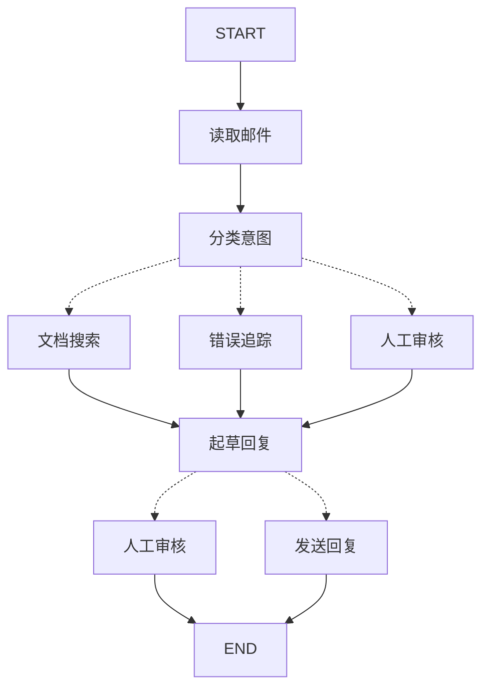

# LangGraph 基础

## LangGraph 概述

**LangGraph v1.0现已发布！**

有关完整的变更列表和如何升级代码的说明，请参阅[发布说明](https://langchain-doc.cn/v1/python/langgraph/releases/langgraph-v1)和[迁移指南](https://langchain-doc.cn/v1/python/langgraph/migrate/langgraph-v1)。

如果您遇到任何问题或有反馈，请[提交issue](https://github.com/langchain-ai/docs/issues/new?template=02-langgraph.yml&labels=langgraph)以便我们改进。要查看v0.x文档，请[访问存档内容](https://github.com/langchain-ai/langgraph/tree/main/docs/docs)。

### 什么是LangGraph？

LangGraph是一个低级编排框架和运行时，用于构建、管理和部署长时间运行的有状态代理。它受到包括Klarna、Replit、Elastic等塑造代理未来的公司的信任。

LangGraph非常低级，完全专注于代理**编排**。在使用LangGraph之前，我们建议您熟悉一些用于构建代理的组件，从[模型](https://langchain-doc.cn/v1/python/langchain/models)和[工具](https://langchain-doc.cn/v1/python/langchain/tools)开始。

在文档中，我们通常会使用[LangChain](https://langchain-doc.cn/v1/python/langchain/overview)组件来集成模型和工具，但您不需要使用LangChain来使用LangGraph。如果您刚开始接触代理或想要更高级的抽象，我们建议您使用LangChain的[代理](https://langchain-doc.cn/v1/python/langchain/agents)，它们为常见的LLM和工具调用循环提供了预构建的架构。

LangGraph专注于对代理编排重要的底层功能：持久执行、流式传输、人机协作等。

### 安装

#### Python

```bash
pip install -U langgraph
```

或使用uv：

```bash
uv add langgraph
```

#### JavaScript

```bash
npm install @langchain/langgraph @langchain/core
```

或使用pnpm：

```bash
pnpm add @langchain/langgraph @langchain/core
```

或使用yarn：

```bash
yarn add @langchain/langgraph @langchain/core
```

或使用bun：

```bash
bun add @langchain/langgraph @langchain/core
```

然后，创建一个简单的Hello World示例：

#### Python

```python
from langgraph.graph import StateGraph, MessagesState, START, END

def mock_llm(state: MessagesState):
    return {"messages": [{"role": "ai", "content": "hello world"}]}

graph = StateGraph(MessagesState)
graph.add_node(mock_llm)
graph.add_edge(START, "mock_llm")
graph.add_edge("mock_llm", END)
graph = graph.compile()

graph.invoke({"messages": [{"role": "user", "content": "hi!"}]})
```

#### JavaScript

```typescript
import { MessagesAnnotation, StateGraph, START, END } from "@langchain/langgraph";

const mockLlm = (state: typeof MessagesAnnotation.State) => {
  return { messages: [{ role: "ai", content: "hello world" }] };
};

const graph = new StateGraph(MessagesAnnotation)
  .addNode("mock_llm", mockLlm)
  .addEdge(START, "mock_llm")
  .addEdge("mock_llm", END)
  .compile();

await graph.invoke({ messages: [{ role: "user", content: "hi!" }] });
```


### 核心优势

LangGraph为任何长时间运行的有状态工作流或代理提供低级支持基础设施。LangGraph不抽象提示或架构，并提供以下核心优势：

- [持久执行](https://langchain-doc.cn/v1/python/langgraph/durable-execution)：构建能够在故障中持久存在并可以长时间运行的代理，从停止的地方继续执行。
- [人机协作](https://langchain-doc.cn/v1/python/langgraph/interrupts)：通过在任何点检查和修改代理状态来纳入人工监督。
- [全面的记忆](https://langchain-doc.cn/v1/python/concepts/memory)：创建具有短期工作记忆（用于持续推理）和跨会话长期记忆的有状态代理。
- [使用LangSmith进行调试](https://langchain-doc.cn/langsmith/home)：通过可视化工具深入了解复杂的代理行为，这些工具可以跟踪执行路径、捕获状态转换并提供详细的运行时指标。
- [生产就绪的部署](https://langchain-doc.cn/langsmith/deployments)：使用专为处理有状态、长时间运行的工作流的独特挑战而设计的可扩展基础设施，自信地部署复杂的代理系统。

### LangGraph生态系统

虽然LangGraph可以独立使用，但它也可以与任何LangChain产品无缝集成，为开发人员提供构建代理的全套工具。为了改善您的LLM应用程序开发，请将LangGraph与以下产品配对：

- [LangSmith](http://www.langchain.com/langsmith) — 有助于代理评估和可观察性。调试性能不佳的LLM应用程序运行，评估代理轨迹，获得生产环境中的可见性，并随着时间的推移提高性能。
- [LangSmith](https://langchain-doc.cn/langsmith/home) — 使用专为长时间运行的有状态工作流设计的部署平台，轻松部署和扩展代理。在团队中发现、重用、配置和共享代理，并通过[Studio](https://langchain-doc.cn/langsmith/studio)中的可视化原型设计快速迭代。
- [LangChain](https://langchain-doc.cn/v1/python/langchain/overview) - 提供集成和可组合组件，简化LLM应用程序开发。包含基于LangGraph构建的代理抽象。

### 鸣谢

LangGraph的灵感来自[Pregel](https://research.google/pubs/pub37252/)和[Apache Beam](https://beam.apache.org/)。公共接口从[NetworkX](https://networkx.org/documentation/latest/)汲取灵感。LangGraph由LangChain Inc构建，LangChain的创建者，但可以在不使用LangChain的情况下使用。


## 安装LangGraph

### 基本安装

要安装基础的LangGraph包：

#### Python

```bash
pip install -U langgraph
```

或使用uv：

```bash
uv add langgraph
```

#### JavaScript

```bash
npm install @langchain/langgraph @langchain/core
```

或使用pnpm：

```bash
pnpm add @langchain/langgraph @langchain/core
```

或使用yarn：

```bash
yarn add @langchain/langgraph @langchain/core
```

或使用bun：

```bash
bun add @langchain/langgraph @langchain/core
```

### 安装LangChain（可选）

使用LangGraph时，您通常需要访问LLM并定义工具。您可以以任何适合您的方式进行。

一种方法是使用[LangChain](https://langchain-doc.cn/v1/python/langchain/overview)（我们在文档中会使用这种方式）。

#### Python

```bash
pip install -U langchain
```

或使用uv：

```bash
uv add langchain
```

#### JavaScript

```bash
npm install langchain
```

或使用pnpm：

```bash
pnpm add langchain
```

或使用yarn：

```bash
yarn add langchain
```

或使用bun：

```bash
bun add langchain
```

### 安装特定的LLM提供商包

要使用特定的LLM提供商包，您需要单独安装它们。

请参考[集成](https://langchain-doc.cn/v1/python/integrations/providers/overview)页面获取提供商特定的安装说明。


## 快速开始

本快速入门演示了如何使用LangGraph Graph API或Functional API构建计算器代理。

- 如果您更喜欢将代理定义为节点和边的图形，请使用[Graph API](https://langchain-doc.cn/v1/python/langgraph/quickstart.html#使用-graph-api)。
- 如果您更喜欢将代理定义为单个函数，请使用[Functional API](https://langchain-doc.cn/v1/python/langgraph/quickstart.html#使用-functional-api)。

有关概念信息，请参阅[Graph API概述](https://langchain-doc.cn/v1/python/langgraph/graph-api)和[Functional API概述](https://langchain-doc.cn/v1/python/langgraph/functional-api)。

**提示：** 对于本示例，您需要设置[Claude (Anthropic)](https://www.anthropic.com/)账户并获取API密钥。然后，在终端中设置`ANTHROPIC_API_KEY`环境变量。

### 使用Graph API

#### 1. 定义工具和模型

在本示例中，我们将使用Claude Sonnet 4.5模型并定义加法、乘法和除法工具。

```python
from langchain.tools import tool
from langchain.chat_models import init_chat_model


model = init_chat_model(
    "claude-sonnet-4-5-20250929",
    temperature=0
)


# 定义工具
@tool
def multiply(a: int, b: int) -> int:
    """将`a`和`b`相乘。

    参数：
        a: 第一个整数
        b: 第二个整数
    """
    return a * b


@tool
def add(a: int, b: int) -> int:
    """将`a`和`b`相加。

    参数：
        a: 第一个整数
        b: 第二个整数
    """
    return a + b


@tool
def divide(a: int, b: int) -> float:
    """将`a`除以`b`。

    参数：
        a: 第一个整数
        b: 第二个整数
    """
    return a / b


# 增强LLM的工具能力
tools = [add, multiply, divide]
tools_by_name = {tool.name: tool for tool in tools}
model_with_tools = model.bind_tools(tools)
```


```typescript
import { ChatAnthropic } from "@langchain/anthropic";
import { tool } from "@langchain/core/tools";
import * as z from "zod";

const model = new ChatAnthropic({
  model: "claude-sonnet-4-5-20250929",
  temperature: 0,
});

// 定义工具
const add = tool(({ a, b }) => a + b, {
  name: "add",
  description: "Add two numbers",
  schema: z.object({
    a: z.number().describe("First number"),
    b: z.number().describe("Second number"),
  }),
});

const multiply = tool(({ a, b }) => a * b, {
  name: "multiply",
  description: "Multiply two numbers",
  schema: z.object({
    a: z.number().describe("First number"),
    b: z.number().describe("Second number"),
  }),
});

const divide = tool(({ a, b }) => a / b, {
  name: "divide",
  description: "Divide two numbers",
  schema: z.object({
    a: z.number().describe("First number"),
    b: z.number().describe("Second number"),
  }),
});

// 增强LLM的工具能力
const toolsByName = {
  [add.name]: add,
  [multiply.name]: multiply,
  [divide.name]: divide,
};
const tools = Object.values(toolsByName);
const modelWithTools = model.bindTools(tools);
```

#### 2. 定义状态

图形的状态用于存储消息和LLM调用次数。

**提示：** LangGraph中的状态在代理执行过程中持续存在。带有`operator.add`的`Annotated`类型确保新消息被追加到现有列表中，而不是替换它。

```python
from langchain.messages import AnyMessage
from typing_extensions import TypedDict, Annotated
import operator


class MessagesState(TypedDict):
    messages: Annotated[list[AnyMessage], operator.add]
    llm_calls: int
```


```typescript
import { StateGraph, START, END } from "@langchain/langgraph";
import { MessagesZodMeta } from "@langchain/langgraph";
import { registry } from "@langchain/langgraph/zod";
import { type BaseMessage } from "@langchain/core/messages";

const MessagesState = z.object({
  messages: z
    .array(z.custom<BaseMessage>())
    .register(registry, MessagesZodMeta),
  llmCalls: z.number().optional(),
});
```

#### 3. 定义模型节点

模型节点用于调用LLM并决定是否调用工具。

```python
from langchain.messages import SystemMessage


def llm_call(state: dict):
    """LLM决定是否调用工具"""

    return {
        "messages": [
            model_with_tools.invoke(
                [
                    SystemMessage(
                        content="你是一个有用的助手，负责对一组输入执行算术运算。"
                    )
                ]
                + state["messages"]
            )
        ],
        "llm_calls": state.get('llm_calls', 0) + 1
    }
```


```typescript
import { SystemMessage } from "@langchain/core/messages";
async function llmCall(state: z.infer<typeof MessagesState>) {
  return {
    messages: await modelWithTools.invoke([
      new SystemMessage(
        "你是一个有用的助手，负责对一组输入执行算术运算。"
      ),
      ...state.messages,
    ]),
    llmCalls: (state.llmCalls ?? 0) + 1,
  };
}
```

#### 4. 定义工具节点

工具节点用于调用工具并返回结果。

```python
from langchain.messages import ToolMessage


def tool_node(state: dict):
    """执行工具调用"""

    result = []
    for tool_call in state["messages"][-1].tool_calls:
        tool = tools_by_name[tool_call["name"]]
        observation = tool.invoke(tool_call["args"])
        result.append(ToolMessage(content=observation, tool_call_id=tool_call["id"]))
    return {"messages": result}
```


```typescript
import { isAIMessage, ToolMessage } from "@langchain/core/messages";
async function toolNode(state: z.infer<typeof MessagesState>) {
  const lastMessage = state.messages.at(-1);

  if (lastMessage == null || !isAIMessage(lastMessage)) {
    return { messages: [] };
  }

  const result: ToolMessage[] = [];
  for (const toolCall of lastMessage.tool_calls ?? []) {
    const tool = toolsByName[toolCall.name];
    const observation = await tool.invoke(toolCall);
    result.push(observation);
  }

  return { messages: result };
}
```

#### 5. 定义结束逻辑

条件边函数用于根据LLM是否进行了工具调用来路由到工具节点或结束。

```python
from typing import Literal
from langgraph.graph import StateGraph, START, END


def should_continue(state: MessagesState) -> Literal["tool_node", END]:
    """决定是否继续循环或停止，基于LLM是否进行了工具调用"""

    messages = state["messages"]
    last_message = messages[-1]

    # 如果LLM进行了工具调用，则执行操作
    if last_message.tool_calls:
        return "tool_node"

    # 否则，我们停止（回复用户）
    return END
```


```typescript
async function shouldContinue(state: z.infer<typeof MessagesState>) {
  const lastMessage = state.messages.at(-1);
  if (lastMessage == null || !isAIMessage(lastMessage)) return END;

  // 如果LLM进行了工具调用，则执行操作
  if (lastMessage.tool_calls?.length) {
    return "toolNode";
  }

  // 否则，我们停止（回复用户）
  return END;
}
```

#### 6. 构建并编译代理

代理使用`StateGraph`类构建，并使用`compile`方法编译。

```python
# 构建工作流
agent_builder = StateGraph(MessagesState)

# 添加节点
agent_builder.add_node("llm_call", llm_call)
agent_builder.add_node("tool_node", tool_node)

# 添加边连接节点
agent_builder.add_edge(START, "llm_call")
agent_builder.add_conditional_edges(
    "llm_call",
    should_continue,
    ["tool_node", END]
)
agent_builder.add_edge("tool_node", "llm_call")

# 编译代理
agent = agent_builder.compile()

# 显示代理
from IPython.display import Image, display
display(Image(agent.get_graph(xray=True).draw_mermaid_png()))

# 调用
from langchain.messages import HumanMessage
messages = [HumanMessage(content="3加4等于多少。")]
messages = agent.invoke({"messages": messages})
for m in messages["messages"]:
    m.pretty_print()
```


```typescript
const agent = new StateGraph(MessagesState)
  .addNode("llmCall", llmCall)
  .addNode("toolNode", toolNode)
  .addEdge(START, "llmCall")
  .addConditionalEdges("llmCall", shouldContinue, ["toolNode", END])
  .addEdge("toolNode", "llmCall")
  .compile();

// 调用
import { HumanMessage } from "@langchain/core/messages";
const result = await agent.invoke({
  messages: [new HumanMessage("3加4等于多少。")],
});

for (const message of result.messages) {
  console.log(`[${message.getType()}]: ${message.text}`);
}
```

**提示：** 要了解如何使用LangSmith跟踪您的代理，请参阅[LangSmith文档](https://langchain-doc.cn/langsmith/trace-with-langgraph)。

恭喜！您已经使用LangGraph Graph API构建了第一个代理。

### 使用Functional API

#### 1. 定义工具和模型

在本示例中，我们将使用Claude Sonnet 4.5模型并定义加法、乘法和除法工具。

```python
from langchain.tools import tool
from langchain.chat_models import init_chat_model


model = init_chat_model(
    "claude-sonnet-4-5-20250929",
    temperature=0
)


# 定义工具
@tool
def multiply(a: int, b: int) -> int:
    """将`a`和`b`相乘。

    参数：
        a: 第一个整数
        b: 第二个整数
    """
    return a * b


@tool
def add(a: int, b: int) -> int:
    """将`a`和`b`相加。

    参数：
        a: 第一个整数
        b: 第二个整数
    """
    return a + b


@tool
def divide(a: int, b: int) -> float:
    """将`a`除以`b`。

    参数：
        a: 第一个整数
        b: 第二个整数
    """
    return a / b


# 增强LLM的工具能力
tools = [add, multiply, divide]
tools_by_name = {tool.name: tool for tool in tools}
model_with_tools = model.bind_tools(tools)

from langgraph.graph import add_messages
from langchain.messages import (
    SystemMessage,
    HumanMessage,
    ToolCall,
)
from langchain_core.messages import BaseMessage
from langgraph.func import entrypoint, task
```


```typescript
import { ChatAnthropic } from "@langchain/anthropic";
import { tool } from "@langchain/core/tools";
import * as z from "zod";

const model = new ChatAnthropic({
  model: "claude-sonnet-4-5-20250929",
  temperature: 0,
});

// 定义工具
const add = tool(({ a, b }) => a + b, {
  name: "add",
  description: "Add two numbers",
  schema: z.object({
    a: z.number().describe("First number"),
    b: z.number().describe("Second number"),
  }),
});

const multiply = tool(({ a, b }) => a * b, {
  name: "multiply",
  description: "Multiply two numbers",
  schema: z.object({
    a: z.number().describe("First number"),
    b: z.number().describe("Second number"),
  }),
});

const divide = tool(({ a, b }) => a / b, {
  name: "divide",
  description: "Divide two numbers",
  schema: z.object({
    a: z.number().describe("First number"),
    b: z.number().describe("Second number"),
  }),
});

// 增强LLM的工具能力
const toolsByName = {
  [add.name]: add,
  [multiply.name]: multiply,
  [divide.name]: divide,
};
const tools = Object.values(toolsByName);
const modelWithTools = model.bindTools(tools);
```

#### 2. 定义模型节点

模型节点用于调用LLM并决定是否调用工具。

**提示：** `@task`装饰器将函数标记为可以作为代理一部分执行的任务。任务可以在入口点函数内同步或异步调用。

```python
@task
def call_llm(messages: list[BaseMessage]):
    """LLM决定是否调用工具"""
    return model_with_tools.invoke(
        [
            SystemMessage(
                content="你是一个有用的助手，负责对一组输入执行算术运算。"
            )
        ]
        + messages
    )
```


```typescript
import { task, entrypoint } from "@langchain/langgraph";
import { SystemMessage } from "@langchain/core/messages";
const callLlm = task({ name: "callLlm" }, async (messages: BaseMessage[]) => {
  return modelWithTools.invoke([
    new SystemMessage(
      "你是一个有用的助手，负责对一组输入执行算术运算。"
    ),
    ...messages,
  ]);
});
```

#### 3. 定义工具节点

工具节点用于调用工具并返回结果。

```python
@task
def call_tool(tool_call: ToolCall):
    """执行工具调用"""
    tool = tools_by_name[tool_call["name"]]
    return tool.invoke(tool_call)
```


```typescript
import type { ToolCall } from "@langchain/core/messages/tool";
const callTool = task({ name: "callTool" }, async (toolCall: ToolCall) => {
  const tool = toolsByName[toolCall.name];
  return tool.invoke(toolCall);
});
```

#### 4. 定义代理

代理使用`@entrypoint`函数构建。

**注意：** 在Functional API中，您不需要显式定义节点和边，而是在单个函数内编写标准控制流逻辑（循环、条件）。

```python
@entrypoint()
def agent(messages: list[BaseMessage]):
    model_response = call_llm(messages).result()

    while True:
        if not model_response.tool_calls:
            break

        # 执行工具
        tool_result_futures = [
            call_tool(tool_call) for tool_call in model_response.tool_calls
        ]
        tool_results = [fut.result() for fut in tool_result_futures]
        messages = add_messages(messages, [model_response, *tool_results])
        model_response = call_llm(messages).result()

    messages = add_messages(messages, model_response)
    return messages

# 调用
messages = [HumanMessage(content="3加4等于多少。")]
for chunk in agent.stream(messages, stream_mode="updates"):
    print(chunk)
    print("\n")
```


```typescript
import { addMessages } from "@langchain/langgraph";
import { type BaseMessage, isAIMessage } from "@langchain/core/messages";

const agent = entrypoint({ name: "agent" }, async (messages: BaseMessage[]) => {
  let modelResponse = await callLlm(messages);

  while (true) {
    if (!modelResponse.tool_calls?.length) {
      break;
    }

    // 执行工具
    const toolResults = await Promise.all(
      modelResponse.tool_calls.map((toolCall) => callTool(toolCall))
    );
    messages = addMessages(messages, [modelResponse, ...toolResults]);
    modelResponse = await callLlm(messages);
  }

  return messages;
});

// 调用
import { HumanMessage } from "@langchain/core/messages";

const result = await agent.invoke([new HumanMessage("3加4等于多少。")]);

for (const message of result) {
  console.log(`[${message.getType()}]: ${message.text}`);
}
```

**提示：** 要了解如何使用LangSmith跟踪您的代理，请参阅[LangSmith文档](https://langchain-doc.cn/langsmith/trace-with-langgraph)。

恭喜！您已经使用LangGraph Functional API构建了第一个代理。

## 运行本地服务器

本指南向你展示如何在本地运行LangGraph应用程序。

### 先决条件

在开始之前，请确保你具备以下条件：

- [LangSmith](https://smith.langchain.com/settings)的API密钥 - 免费注册

### 1. 安装LangGraph CLI

#### Python

```bash
# 需要Python >= 3.11
pip install -U "langgraph-cli[inmem]"
```

```bash
# 需要Python >= 3.11
uv add langgraph-cli[inmem]
```

#### JavaScript

```shell
npx @langchain/langgraph-cli
```

### 2. 创建LangGraph应用 🌱

#### Python

从[`new-langgraph-project-python`模板](https://github.com/langchain-ai/new-langgraph-project)创建一个新应用。这个模板演示了你可以用自己的逻辑扩展的单节点应用程序。

```shell
langgraph new path/to/your/app --template new-langgraph-project-python
```

**附加模板**
如果你使用`langgraph new`而不指定模板，你将看到一个交互式菜单，允许你从可用模板列表中进行选择。

#### JavaScript

从[`new-langgraph-project-js`模板](https://github.com/langchain-ai/new-langgraphjs-project)创建一个新应用。这个模板演示了你可以用自己的逻辑扩展的单节点应用程序。

```shell
npm create langgraph
```

### 3. 安装依赖

在你的新LangGraph应用的根目录中，以`edit`模式安装依赖，以便服务器使用你的本地更改：

#### Python

```bash
cd path/to/your/app
pip install -e .
```

```bash
cd path/to/your/app
uv add .
```

#### JavaScript

```shell
cd path/to/your/app
npm install
```

### 4. 创建`.env`文件

你将在新LangGraph应用的根目录中找到一个`.env.example`文件。在新LangGraph应用的根目录中创建一个`.env`文件，并将`.env.example`文件的内容复制到其中，填写必要的API密钥：

```bash
LANGSMITH_API_KEY=lsv2...
```

### 5. 启动LangGraph服务器 🚀

在本地启动LangGraph API服务器：

#### Python

```shell
langgraph dev
```

#### JavaScript

```shell
npx @langchain/langgraph-cli dev
```

示例输出：

```
>    Ready!
>
>    - API: [http://localhost:2024](http://localhost:2024/)
>
>    - Docs: http://localhost:2024/docs
>
>    - LangGraph Studio Web UI: https://smith.langchain.com/studio/?baseUrl=http://127.0.0.1:2024
```

`langgraph dev`命令以内存模式启动LangGraph服务器。此模式适合开发和测试目的。对于生产使用，请部署具有持久存储后端访问权限的LangGraph服务器。有关更多信息，请参阅[托管概述](https://langchain-doc.cn/langsmith/platform-setup)。

### 6. 在Studio中测试你的应用程序

[Studio](https://langchain-doc.cn/langsmith/studio)是一个专门的UI，你可以连接到LangGraph API服务器以可视化、交互和调试你的本地应用程序。通过访问`langgraph dev`命令输出中提供的URL在Studio中测试你的图：

```
>    - LangGraph Studio Web UI: https://smith.langchain.com/studio/?baseUrl=http://127.0.0.1:2024
```

对于在自定义主机/端口上运行的LangGraph服务器，请更新baseURL参数。

**Safari兼容性**
使用命令的`--tunnel`标志创建安全隧道，因为Safari在连接到localhost服务器时有限制：

```shell
langgraph dev --tunnel
```

### 7. 测试API

#### Python

**Python SDK（异步）**

1. 安装LangGraph Python SDK：

```shell
pip install langgraph-sdk
```

1. 向助手发送消息（无线程运行）：

```python
from langgraph_sdk import get_client
import asyncio

client = get_client(url="http://localhost:2024")

async def main():
    async for chunk in client.runs.stream(
        None,  # 无线程运行
        "agent", # 助手名称。在langgraph.json中定义。
        input={
        "messages": [{
            "role": "human",
            "content": "什么是LangGraph？",
            }],
        },
    ):
        print(f"接收类型为: {chunk.event} 的新事件...")
        print(chunk.data)
        print("\n\n")

asyncio.run(main())
```

**Python SDK（同步）**

1. 安装LangGraph Python SDK：

```shell
pip install langgraph-sdk
```

1. 向助手发送消息（无线程运行）：

```python
from langgraph_sdk import get_sync_client

client = get_sync_client(url="http://localhost:2024")

for chunk in client.runs.stream(
    None,  # 无线程运行
    "agent", # 助手名称。在langgraph.json中定义。
    input={
        "messages": [{
            "role": "human",
            "content": "什么是LangGraph？",
        }],
    },
    stream_mode="messages-tuple",
):
    print(f"接收类型为: {chunk.event} 的新事件...")
    print(chunk.data)
    print("\n\n")
```

**REST API**

```bash
curl -s --request POST \
    --url "http://localhost:2024/runs/stream" \
    --header 'Content-Type: application/json' \
    --data "{
        \"assistant_id\": \"agent\",
        \"input\": {
            \"messages\": [
                {
                    \"role\": \"human\",
                    \"content\": \"什么是LangGraph？\" 
                }
            ]
        },
        \"stream_mode\": \"messages-tuple\" 
    }"
```

#### JavaScript

**JavaScript SDK**

1. 安装LangGraph JS SDK：

```shell
npm install @langchain/langgraph-sdk
```

1. 向助手发送消息（无线程运行）：

```js
const { Client } = await import("@langchain/langgraph-sdk");

// 只有在调用langgraph dev时更改了默认端口时才设置apiUrl
const client = new Client({ apiUrl: "http://localhost:2024"});

const streamResponse = client.runs.stream(
    null, // 无线程运行
    "agent", // 助手ID
    {
        input: {
            "messages": [
                { "role": "user", "content": "什么是LangGraph？"}
            ]
        },
        streamMode: "messages-tuple",
    }
);

for await (const chunk of streamResponse) {
    console.log(`接收类型为: ${chunk.event} 的新事件...`);
    console.log(JSON.stringify(chunk.data));
    console.log("\n\n");
}
```

**REST API**

```bash
curl -s --request POST \
    --url "http://localhost:2024/runs/stream" \
    --header 'Content-Type: application/json' \
    --data "{
        \"assistant_id\": \"agent\",
        \"input\": {
            \"messages\": [
                {
                    \"role\": \"human\",
                    \"content\": \"什么是LangGraph？\" 
                }
            ]
        },
        \"stream_mode\": \"messages-tuple\" 
    }"
```

### 下一步

现在你已经在本地运行了LangGraph应用程序，通过探索部署和高级功能来进一步推进你的旅程：

- [部署快速入门](https://langchain-doc.cn/langsmith/deployment-quickstart)：使用LangSmith部署你的LangGraph应用。
- [LangSmith](https://langchain-doc.cn/langsmith/home)：了解LangSmith的基础概念。

#### Python

- [Python SDK参考](https://reference.langchain.com/python/platform/python_sdk/)：探索Python SDK API参考。

#### JavaScript

- [JS/TS SDK参考](https://reference.langchain.com/javascript/modules/_langchain_langgraph-sdk.html)：探索JS/TS SDK API参考。


## 使用LangGraph思考

LangGraph可以改变你构建代理的思维方式。当你使用LangGraph构建代理时，首先需要将其分解为称为**节点**的离散步骤。然后，描述每个节点的不同决策和转换。最后，通过共享的**状态**将节点连接在一起，每个节点都可以读取和写入这个状态。在本教程中，我们将指导你通过构建客户支持电子邮件代理的思考过程来理解LangGraph。

### 从你想要自动化的流程开始

假设你需要构建一个处理客户支持电子邮件的AI代理。产品团队给你提供了以下要求：

该代理应该：

- 读取传入的客户电子邮件
- 按紧急程度和主题分类
- 搜索相关文档来回答问题
- 起草适当的回复
- 将复杂问题升级给人类代理
- 在需要时安排后续跟进

需要处理的示例场景：

1. 简单的产品问题："如何重置我的密码？"
2. 错误报告："当我选择PDF格式时，导出功能崩溃"
3. 紧急账单问题："我的订阅被重复收费了！"
4. 功能请求："你能为移动应用添加深色模式吗？"
5. 复杂技术问题："我们的API集成间歇性失败，出现504错误"

在LangGraph中实现代理，通常遵循以下五个步骤。

### 步骤1：将工作流映射为离散步骤

首先确定流程中的不同步骤。每个步骤将成为一个**节点**（执行特定任务的函数）。然后勾勒这些步骤如何相互连接。



箭头显示可能的路径，但实际选择哪条路径的决定发生在每个节点内部。

现在你已经确定了工作流中的组件，让我们了解每个节点需要做什么：

- 读取邮件：提取和解析邮件内容
- 分类意图：使用LLM对紧急程度和主题进行分类，然后路由到适当的操作
- 文档搜索：查询知识库以获取相关信息
- 错误追踪：在跟踪系统中创建或更新问题
- 起草回复：生成适当的回复
- 人工审核：升级给人类代理进行批准或处理
- 发送回复：发送电子邮件回复

提示：注意一些节点决定下一步去哪里（分类意图、起草回复、人工审核），而其他节点总是继续到同一个下一步（读取邮件总是转到分类意图，文档搜索总是转到起草回复）。

### 步骤2：确定每个步骤需要做什么

对于图中的每个节点，确定它代表什么类型的操作以及它正常工作需要什么上下文。

#### LLM步骤

当步骤需要理解、分析、生成文本或做出推理决策时：

**分类意图节点**

- 静态上下文（提示）：分类类别、紧急程度定义、响应格式
- 动态上下文（来自状态）：邮件内容、发件人信息
- 期望结果：确定路由的结构化分类

**起草回复节点**

- 静态上下文（提示）：语气指南、公司政策、回复模板
- 动态上下文（来自状态）：分类结果、搜索结果、客户历史
- 期望结果：可供审核的专业电子邮件回复

#### 数据步骤

当步骤需要从外部源检索信息时：

**文档搜索节点**

- 参数：根据意图和主题构建的查询
- 重试策略：是，对瞬态故障使用指数退避
- 缓存：可以缓存常见查询以减少API调用

**客户历史查询**

- 参数：来自状态的客户电子邮件或ID
- 重试策略：是，但如果不可用则回退到基本信息
- 缓存：是，使用生存时间来平衡新鲜度和性能

#### 操作步骤

当步骤需要执行外部操作时：

**发送回复节点**

- 何时执行：在批准后（人工或自动）
- 重试策略：是，对网络问题使用指数退避
- 不应缓存：每次发送都是唯一的操作

**错误追踪节点**

- 何时执行：当意图为"错误"时总是执行
- 重试策略：是，关键是不要丢失错误报告
- 返回：要包含在回复中的工单ID

#### 用户输入步骤

当步骤需要人工干预时：

**人工审核节点**

- 决策上下文：原始邮件、草拟回复、紧急程度、分类
- 预期输入格式：批准布尔值加上可选的编辑回复
- 何时触发：高紧急度、复杂问题或质量问题

### 步骤3：设计状态

状态是所有节点可访问的共享[内存](https://langchain-doc.cn/v1/python/concepts/memory)。将其视为代理用来跟踪工作过程中学习和决定的所有内容的笔记本。

#### 什么应该包含在状态中？

对于每个数据项，问自己这些问题：

- **包含在状态中**：它需要在步骤之间持久化吗？如果是，它应该在状态中。
- **不存储**：你可以从其他数据派生它吗？如果是，在需要时计算它，而不是将其存储在状态中。

对于我们的电子邮件代理，我们需要跟踪：

- 原始邮件和发件人信息（无法重建）
- 分类结果（多个下游节点需要）
- 搜索结果和客户数据（重新获取成本高）
- 草拟回复（需要在审核过程中持久化）
- 执行元数据（用于调试和恢复）

#### 保持状态原始，按需格式化提示

一个关键原则：状态应该存储原始数据，而不是格式化文本。在需要时在节点内格式化提示。

这种分离意味着：

- 不同节点可以根据需要以不同方式格式化相同数据
- 你可以更改提示模板而无需修改状态模式
- 调试更清晰 - 你可以确切地看到每个节点收到了什么数据
- 你的代理可以在不破坏现有状态的情况下发展

让我们定义我们的状态：

```python
from typing import TypedDict, Literal

# 定义电子邮件分类的结构
class EmailClassification(TypedDict):
    intent: Literal["question", "bug", "billing", "feature", "complex"]
    urgency: Literal["low", "medium", "high", "critical"]
    topic: str
    summary: str

class EmailAgentState(TypedDict):
    # 原始邮件数据
    email_content: str
    sender_email: str
    email_id: str

    # 分类结果
    classification: EmailClassification | None

    # 原始搜索/API结果
    search_results: list[str] | None  # 原始文档块列表
    customer_history: dict | None  # 来自CRM的原始客户数据

    # 生成的内容
    draft_response: str | None
    messages: list[str] | None
```


```typescript
import * as z from "zod";

// 定义电子邮件分类的结构
const EmailClassificationSchema = z.object({
  intent: z.enum(["question", "bug", "billing", "feature", "complex"]),
  urgency: z.enum(["low", "medium", "high", "critical"]),
  topic: z.string(),
  summary: z.string(),
});

const EmailAgentState = z.object({
  // 原始邮件数据
  emailContent: z.string(),
  senderEmail: z.string(),
  emailId: z.string(),

  // 分类结果
  classification: EmailClassificationSchema.optional(),

  // 原始搜索/API结果
  searchResults: z.array(z.string()).optional(),  // 原始文档块列表
  customerHistory: z.record(z.any()).optional(),  // 来自CRM的原始客户数据

  // 生成的内容
  responseText: z.string().optional(),
});

type EmailAgentStateType = z.infer<typeof EmailAgentState>;
type EmailClassificationType = z.infer<typeof EmailClassificationSchema>;
```

注意，状态只包含原始数据 - 没有提示模板，没有格式化字符串，没有指令。分类输出直接以单个字典形式从LLM存储。

### 步骤4：构建节点

现在我们将每个步骤实现为函数。LangGraph中的节点只是一个Python或JavaScript函数，它接受当前状态并返回对它的更新。

#### 适当处理错误

不同的错误需要不同的处理策略：

| 错误类型                                 | 谁来修复     | 策略                       | 何时使用                    |
| ---------------------------------------- | ------------ | -------------------------- | --------------------------- |
| 瞬态错误（网络问题、速率限制）           | 系统（自动） | 重试策略                   | 通常在重试后解决的临时故障  |
| LLM可恢复错误（工具故障、解析问题）      | LLM          | 在状态中存储错误并循环返回 | LLM可以看到错误并调整其方法 |
| 用户可修复错误（缺少信息、不明确的指令） | 人类         | 使用`interrupt()`暂停      | 需要用户输入才能继续        |
| 意外错误                                 | 开发者       | 让它们冒泡                 | 需要调试的未知问题          |

##### 瞬态错误

添加重试策略以自动重试网络问题和速率限制：

```python
from langgraph.types import RetryPolicy

workflow.add_node(
    "search_documentation",
    search_documentation,
    retry_policy=RetryPolicy(max_attempts=3, initial_interval=1.0)
)
```

```typescript
import type { RetryPolicy } from "@langchain/langgraph";

workflow.addNode(
"searchDocumentation",
searchDocumentation,
{
    retryPolicy: { maxAttempts: 3, initialInterval: 1.0 },
},
);
```

##### LLM可恢复错误

在状态中存储错误并循环返回，以便LLM可以看到出了什么问题并再次尝试：

```python
from langgraph.types import Command


def execute_tool(state: State) -> Command[Literal["agent", "execute_tool"]]:
    try:
        result = run_tool(state['tool_call'])
        return Command(update={"tool_result": result}, goto="agent")
    except ToolError as e:
        # 让LLM看到出了什么问题并再次尝试
        return Command(
            update={"tool_result": f"工具错误: {str(e)}"},
            goto="agent"
        )
```

```typescript
import { Command } from "@langchain/langgraph";

async function executeTool(state: State) {
  try {
    const result = await runTool(state.toolCall);
    return new Command({
    update: { toolResult: result },
    goto: "agent",
    });
  } catch (error) {
    // 让LLM看到出了什么问题并再次尝试
    return new Command({
    update: { toolResult: `工具错误: ${error}` },
    goto: "agent"
    });
  }
}
```

##### 用户可修复错误

在需要时暂停并从用户那里收集信息（如账户ID、订单号或澄清）：

```python
from langgraph.types import Command


def lookup_customer_history(state: State) -> Command[Literal["draft_response"]]:
    if not state.get('customer_id'):
        user_input = interrupt({
            "message": "需要客户ID",
            "request": "请提供客户的账户ID以查询其订阅历史"
        })
        return Command(
            update={"customer_id": user_input['customer_id']},
            goto="lookup_customer_history"
        )
    # 现在继续查询
    customer_data = fetch_customer_history(state['customer_id'])
    return Command(update={"customer_history": customer_data}, goto="draft_response")
```

```typescript
import { Command, interrupt } from "@langchain/langgraph";

async function lookupCustomerHistory(state: State) {
  if (!state.customerId) {
    const userInput = interrupt({
    message: "需要客户ID",
    request: "请提供客户的账户ID以查询其订阅历史",
    });
    return new Command({
    update: { customerId: userInput.customerId },
    goto: "lookupCustomerHistory",
    });
  }
  // 现在继续查询
  const customerData = await fetchCustomerHistory(state.customerId);
  return new Command({
    update: { customerHistory: customerData },
    goto: "draftResponse",
  });
}
```

##### 意外错误

让它们冒泡以供调试。不要捕获你无法处理的内容：

```python
def send_reply(state: EmailAgentState):
    try:
        email_service.send(state["draft_response"])
    except Exception:
        raise  # 暴露意外错误
```

```typescript
async function sendReply(state: EmailAgentStateType): Promise<void> {
  try {
    await emailService.send(state.responseText);
  } catch (error) {
    throw error;  // 暴露意外错误
  }
}
```


##### todo

## 工作流与智能体

在 LangChain 中，您可以构建工作流和智能体，它们分别适用于不同类型的应用场景。本指南将介绍这两种模式以及何时使用它们。

### 工作流

工作流是预定义的执行路径，其中每个步骤都按照特定顺序执行。它们适用于问题和解决方案可预测的情况。工作流可以包含条件分支、循环和并行执行。

                     		                                                                                         *workflow.png*

#### 为什么使用 LangGraph 构建工作流？

LangGraph 为构建 LLM 应用工作流提供了几个关键优势：

- **持久性**：工作流状态会自动保存，支持中断和恢复执行
- **流式处理**：实时查看工作流的执行过程和中间结果
- **调试**：跟踪每个步骤的状态变化和执行路径
- **部署**：轻松部署为服务或嵌入到现有应用程序中

#### 安装

在开始之前，确保安装了 LangGraph：

```bash
pip install langgraph
```

对于 TypeScript：

```bash
npm install @langchain/langgraph
```

#### 初始化 LLM

让我们首先设置我们的 LLM。我们将使用 Anthropic 的模型，因为它们在结构化输出和工具使用方面表现出色。

```python
from langchain_anthropic import ChatAnthropic

# 初始化 LLM
llm = ChatAnthropic(model="claude-3-opus-20240229")
```

对于 JavaScript：

```typescript
import { ChatAnthropic } from "@langchain/anthropic";

// 初始化 LLM
const llm = new ChatAnthropic({
  model: "claude-3-opus-20240229",
});
```

#### 结构化输出

在构建工作流时，我们经常需要从 LLM 获取结构化输出。我们可以使用 Pydantic 来定义输出模式。

```python
from pydantic import BaseModel, Field

# 定义结构化输出的模型
class MultiplierResponse(BaseModel):
    result: int = Field(description="乘法运算的结果")

# 使用结构化输出增强 LLM
llm_with_structured_output = llm.with_structured_output(MultiplierResponse)

# 调用 LLM 并获取结构化输出
response = llm_with_structured_output.invoke("计算 5 乘以 3 的结果")
print(response.result)  # 输出: 15
```

对于 TypeScript，我们使用 Zod 来定义模式：

```typescript
import * as z from "zod";

// 定义结构化输出的模型
const multiplierResponseSchema = z.object({
  result: z.number().describe("乘法运算的结果"),
});

// 使用结构化输出增强 LLM
const llmWithStructuredOutput = llm.withStructuredOutput(multiplierResponseSchema);

// 调用 LLM 并获取结构化输出
const response = await llmWithStructuredOutput.invoke("计算 5 乘以 3 的结果");
console.log(response.result);  // 输出: 15
```

#### 工具

工具是可以由 LLM 或工作流调用的函数。它们允许我们扩展 LLM 的能力，使其能够执行计算、访问外部系统等。

```python
from langchain.tools import tool

# 定义一个工具
@tool
def multiply(a: int, b: int) -> int:
    """计算 `a` 和 `b` 的乘积。

    Args:
        a: 第一个整数
        b: 第二个整数
    """
    return a * b

# 使用工具
tool_result = multiply.invoke({"a": 5, "b": 3})
print(tool_result)  # 输出: 15
```

对于 TypeScript：

```typescript
import { tool } from "@langchain/core/tools";
import * as z from "zod";

// 定义一个工具
const multiply = tool(
  ({ a, b }) => {
    return a * b;
  },
  {
    name: "multiply",
    description: "计算两个数字的乘积",
    schema: z.object({
      a: z.number().describe("第一个数字"),
      b: z.number().describe("第二个数字"),
    }),
  }
);

// 使用工具
const toolResult = await multiply.invoke({ a: 5, b: 3 });
console.log(toolResult);  // 输出: 15
```


### 常见工作流模式

以下是一些常见的工作流模式及其使用场景：


