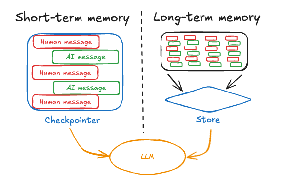

# LangGraph 的短期记忆与长期记忆

[一文看懂 LangGraph 的短期记忆与长期记忆：原理、实战与避坑清单](https://aistudio.baidu.com/blog/detail/737084298395525)

## 为什么你的 Agent 不是“健忘”就是“臃肿”？

构建对话或多步骤 Agent，最常见的两类“记忆病”是：

- 上下文丢失：上一轮刚确认过的用户偏好，下一轮又问一遍；
- 记忆膨胀：把所有历史塞进提示词，延迟上天还容易跑偏。

LangGraph 将“耐久执行 + 记忆 + 人在回路 + 时间旅行”作为核心能力之一，给出了一套工程化的记忆分层：短期记忆用于推理过程中的工作内存；长期记忆用于跨会话/跨任务的事实沉淀与检索。理解这两种记忆的边界与实现，是把 Agent 从 Demo 带到生产的关键。

读完本篇你将能：

- 用日常类比准确解释短期记忆 vs 长期记忆；
- 画出“状态-检查点-线程-时间旅行”的机制链路；
- 选择合适的持久化与检索策略，避免“要么忘、要么堵”。

## 核心技术概念解析

### 一、两类记忆的本质差异

- 短期记忆（工作内存）
  - 术语：Graph State/State channels、MessagesState、超步（superstep）
  - 通俗解释：像你脑海里“当前要处理的问题和临时笔记”，随着每一步推理/工具调用被更新。
  - 在 LangGraph 中：作为状态在节点之间传递；可选通过“检查点”在每个超步保存快照，用于恢复、回放、时间旅行。
- 长期记忆（持久化知识/事实）
  - 术语：持久化存储、检索（RAG/检索器）、Memory Agent（模板）
  - 通俗解释：像你的“个人知识库与联系人卡片”，跨会话保留，按需检索到当前对话。

官方描述“Comprehensive memory: short-term working memory 和 long-term persistent memory across sessions”，明确两层记忆并存[1]。

#### 1. short-term working memory（短期工作记忆）

指：

> 当前一次任务执行过程中的临时状态。

例如 LangGraph：

```
State = {
    "messages": [...],
    "current_step": 2,
    "tool_result": ...
}
```

特点：

- 只服务当前 graph 执行
- 随节点执行不断更新
- 可以通过 checkpoint 保存和恢复
- 类似人脑“正在思考时记住的信息”

例如：

```
用户：
帮我查天气

当前状态：
用户问题
↓
调用天气工具
↓
工具结果
↓
生成回答
```

这些都是短期记忆。

#### 2. long-term persistent memory（长期持久记忆）

指：

> 跨多次会话仍然保存的信息。

例如：

```
用户第一次聊天：

用户喜欢喝咖啡
住在北京


第二个月再次聊天：

AI:
你之前喜欢咖啡，我推荐这家店
```

这些信息不会随着一次 graph 执行结束消失。

通常存：

- 数据库
- 向量数据库
- 文件系统

通过检索（RAG）取回来。

------

所以这句话核心意思：

```
Memory
 |
 +-- Short-term memory
 |      当前任务状态
 |      Graph State / Checkpoint
 |
 +-- Long-term memory
        跨会话知识
        数据库 / RAG
```

LangGraph 两者都支持：

- **checkpoint → 保存短期记忆（当前执行状态）**
- **store / retriever → 保存长期记忆（跨会话信息）**

简单一句话：

> 短期记忆解决“这一次任务做到哪了”；长期记忆解决“以前知道什么”。


### 二、短期记忆的机制：状态 → 检查点 → 线程 → 时间旅行

- 状态与超步
  - 每次节点运行推进一个“超步”（superstep），当前全局状态可被保存为快照（StateSnapshot）。
- 检查点（Checkpointer）
  - 在每个超步持久化当前图状态，形成可恢复的快照历史；支持崩溃恢复、断点续跑、人类在回路与时间旅行[5][6]。
  - 版本进展：checkpointer 体系在 0.2.x 引入 2.0.0 相关变更（证实该能力为核心并持续演进）[3][4]。
- 线程（thread_id）
  - 每条会话/任务轨迹以 thread_id 作为唯一标识，所有检查点归档在对应线程下；调用图时需通过 config 传入 thread_id，以区分并发/多会话[5][6]。
- 时间旅行（Time travel）
  - 获取状态历史（如 get_state_history），可“倒带”至某一快照并分叉执行，用于纠错、尝试不同策略或 A/B 推理路径[7][8]。
- Interrupts（中断）
  - 人在回路点可中断，待人审阅/编辑状态后再恢复执行；与检查点/线程配合实现可控的人工监督[2]。

可视化：短期记忆在一次执行中的演变

- 节点1（推理）→ 节点2（工具调用）→ 节点3（总结）
- 每步结束：保存检查点 C1、C2、C3（均挂在 thread_id=T-123 名下）
- 出错/需要回滚：读取历史 C2，切换路径至节点2’ → 节点4（替代方案）


### 三、长期记忆的机制：显式提取/存储 → 检索 → 注入上下文

- 写入策略（hot-path 决策）
  - “是否值得记住”往往由 Agent 自己在对话热路径决定（如侦测到“用户偏好/个人资料/长期目标”），通过工具调用或专门节点将事实写入持久层；LangGraph Studio 提供 Memory Agent 模板直观展示此模式[9]。
- 存储后端（常见）
  - 结构化/键值：SQLite/Postgres/Redis 等（可快速落地、好管理）
  - 检索型：向量数据库（FAISS、pgvector 等）用于知识/长文本片段检索
- 检索融合
  - 在下一次询问前，先从“长期记忆库/知识库”检索相关事实，注入到提示词/状态，再继续推理（RAG 思路）。

生活化类比：

- 短期记忆：你桌面上正在处理的纸张（状态），每完成一步就拍照存档（检查点），档案按文件夹（thread_id）归类，随时可以从某一张照片“复原现场”（时间旅行）。
- 长期记忆：你的文件柜和知识库（数据库+向量检索），只有当你决定“这个值得存/以后要用”时才归档；下次先翻柜子，再回到桌面工作。



### 四、典型代码路径（示意，类名以所用版本为准）

- 配置 checkpointer 与线程，获得可恢复/可时间旅行的短期记忆

```
# 伪代码/示意：类名与导入路径以所用版本为准（参考 checkpointer 2.0.0 变更）
from langgraph.graph import StateGraph, MessagesState, START, END
# from langgraph.checkpoint.sqlite import SqliteSaver  # 常见持久化后端之一
# saver = SqliteSaver.from_conn_string("checkpoints.sqlite")

graph = StateGraph(MessagesState)
# ... add nodes & edges ...
app = graph.compile( # checkpointer=saver  # 开启跨会话的状态持久化
)

# 指定线程 ID，让检查点归档在该会话轨迹下
config = {"configurable": {"thread_id": "user-42"}}
result = app.invoke({"messages": [{"role": "user", "content": "Hi"}]}, config=config)

# 时间旅行（示意）
# history = app.get_state_history(thread_id="user-42")
# app.resume_from(checkpoint=history[-2])  # 回到上上步并分叉新路径
```

- 长期记忆：热路径“决定保存” + 检索注入（Memory Agent 模板思路）
  - 设计一个工具 save_memory(user_id, fact)，把“可复用的用户事实/偏好”写入外部库；
  - 每次对话前，用 retriever(user_id, query) 取出相关事实，拼入提示；
  - 好处：避免一股脑堆入所有历史，减少 token 与跑偏风险[9]。

### 五、短期 vs 长期：对比与选型

|    维度    |          短期记忆（工作内存/状态）          |           长期记忆（外部存储+检索）            |
| :--------: | :-----------------------------------------: | :--------------------------------------------: |
|  核心载体  | Graph State（MessagesState/自定义状态通道） |        数据库/向量库中的事实或文档片段         |
|  生命周期  |  随执行推进；可用检查点持久化并跨会话恢复   |             跨会话/跨任务长期保留              |
|  写入方式  |     自动（每超步快照）；可中断/时间旅行     |      显式（Agent 决策工具调用/专用节点）       |
|  读取方式  |    恢复/回放/时间旅行（thread_id 定位）     |      检索（相似度/过滤），按需注入上下文       |
|  典型后端  | 内存/SQLite/Postgres/Redis（checkpointer）  | SQLite/Postgres/Redis/向量库（FAISS/pgvector） |
|  适用场景  |    多步推理、容错、人类在回路、路径分叉     |      用户画像、偏好、知识库、跨会话上下文      |
| 风险与成本 |        快照过多→存储膨胀；恢复一致性        |       检索质量/漂移、数据隐私、治理成本        |

## 对比与价值分析（工程边界与最佳实践）

- 为什么不能用“长期记忆”替代一切？
  - 如果把每条对话都落库并在每轮无脑检索注入，既增加 token 成本，也会引入大量噪声，削弱 LLM 归纳能力。短期记忆的“轻量状态 + 逐步快照”更适合推理阶段的局部一致性与可回滚。
- 为什么仅靠“短期记忆”也不够？
  - 跨会话的个性化/事实无法靠状态延续（线程结束就不可见），需要显式“决定保存”的长期记忆，以便在未来任务检索复用。
- 常见局限与应对
  - 快照膨胀：设置检查点保留策略（按阶段/关键节点落点），或周期性“总结+压缩”状态通道；
  - 长期库污染：记忆写入走“可解释规则”（明确何种事实可存），并配数据治理（TTL/撤回/用户导出，合规要求）；
  - 检索漂移：为不同事实类型建立独立命名空间/索引，检索时做双重筛选（语义+结构化过滤）。

## 案例研究：为客服 Agent 加“会记人”的大脑

- 场景：客服 Agent 要识别老用户偏好（语气、常用产品、前次问题）并个性化响应。
- 解决方案：
  1. 短期记忆：用 MessagesState 组织当前轮对话与工具调用结果；开启检查点，支持错误回滚与人审；
  2. 长期记忆：在对话结束前，由 Agent 自定“是否值得记住”并调用 save_memory(user_id, fact) 落库；下一轮服务开局先 retriever(user_id, “开场画像”) 注入提示词；
- 伪代码骨架：
  - 节点 route：判断是否需要保存记忆（例如侦测到“用户偏好变化”）→ 工具 save_memory；
  - 节点 respond：按“检索到的用户画像 + 当前短期上下文”生成回答；
  - 中断点：需要升级/人工审核时打断，审核后时间旅行至分叉路径。

## 进阶内容：让记忆既聪明又克制

- 记忆蒸馏/归纳：定期用总结节点把大量历史压缩成“稳定事实”，减少检索噪声；
- TTL 与撤回：对“短期重要但长期无用”的事实设定过期；提供用户“遗忘权”；
- 指标驱动：衡量记忆命中率、对话满意度、token 成本变化，与 A/B 的时间旅行能力结合；
- 生态集成：LangGraph 可独立于 LangChain 运行，也可配合其向量库/检索器组合 RAG；Memory Agent 模板可快速验证“热路径记忆决策”[1][9]。

## 总结

关键结论

- 短期记忆是“工作内存”：围绕状态推进、可检查点、可时间旅行，用于多步推理的一致性与可恢复。
- 长期记忆是“知识/画像库”：由 Agent 显式决策保存，结合检索按需注入，避免上下文臃肿。
- 两者协同才是正解：短期管过程、长期管沉淀；一自动一显式，分别优化延迟、成本与准确性。
- 工程边界重在“克制”：合理的快照频率、记忆治理（TTL/撤回）、分域检索与过滤，胜过“全量存/全量取”。