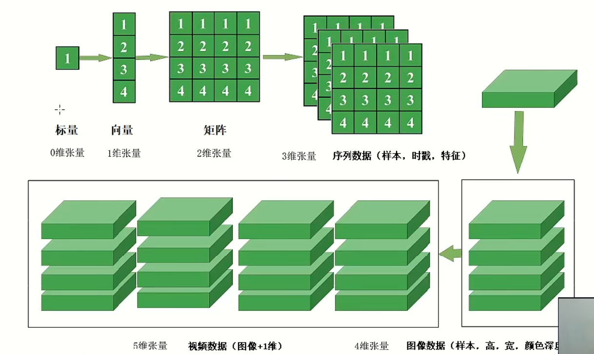

# Numpy数组与矩阵


## 一、张量的定义



向量和矩阵在机器学习中是使用最频繁的两类张量，向量可以表达某个数据集的一行或者一列，而矩阵
则可以处理神经网络。其实向量就是一个一维数组，在Python中也可以称为列表。如果两个向量的数量
一致，则可以进行加减乘除和点积运算。


## 二、基础操作

>KNN模型训练

1、将一个列表转换为aray,并查看其属性


## 三、数组变维与切片

```python
import numpy as np

# 一维数组
a1 = np.array([11, 22, 33, 44, 55, 66])

# 二维数组
a2 = np.array([[11, 12, 13, 14],
               [21, 22, 23, 24],
               [31, 32, 33, 34]])

# 三维数组（2页，3行，4列）
a3 = np.zeros((2, 3, 4), dtype=int)

# print(a1, a2, a3)

# reshape: 重塑形状为 3 维（2, 2, 6）
print(a3.reshape(2, 2, 6))  # 调整为3维，2行，6列

# 转置：将最后两个维度交换
print("转置", a3.T)         # 调整为3维，6行，2列

# 索引与切片示例
print(a2[1, 2])     # 取第2行第3列 => 23
print(a2[::-1])     # 行倒置
print(a2[2, 0:3])   # 第3行前3列
print(a2[:2])       # 取第0行和第1行
print(a2[-1])       # 最后一行
print(a2[2::-1])    # 前3行倒置
print(a2[:, :])     # 所有行和列
print(a2[:, 1])     # 所有行的第2列
```


## 四、矩阵乘法


