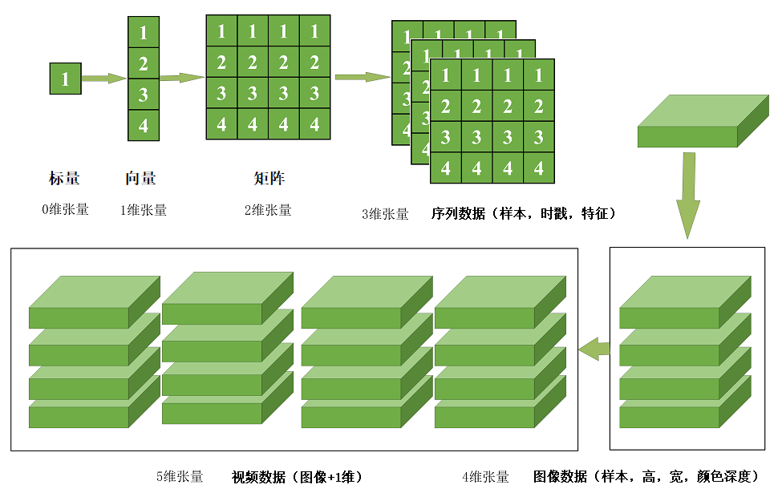
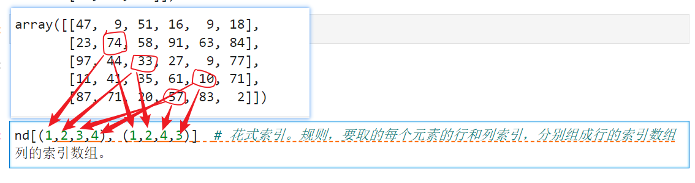
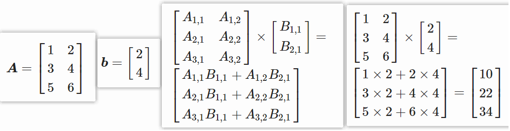
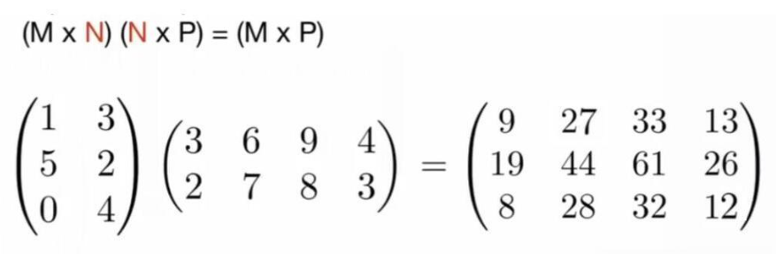

# Numpy数组与向量运算


### 一、Numpy的基本介绍和配置

#### 1.1 numpy基本介绍

numpy是Python语言的一个第三方科学计算库，它的意思是“Numeric Python”，它是一个由多维数组对象和用于处理数组的函数集合组成的库。

numpy支持N维数组运算、处理大型矩阵、成熟的广播函数库、矢量计算、线性代数等常见科学运算操作，而且处理效率非常高，特别是针对数组运算，所以是非常常用的一个科学计算和数据分析用的库。



#### 1.2 numpy的优势

numpy的数组在运算时是非常高效的，特别是在多维向量运算时远比python数组快得多。我们可以通过一个简单的例子来对比python数组和numpy数组的运行效率哪个更高，代码如下：

```python
import numpy as np
import random
import time

py_list = []
for i in range(100000000):
    py_list.append(random.random())   # 生成100000000个元素的随机数列表

np_list = np.array(py_list)  # 将100000000个元素的随机数列表放入到ndarray中

# 原生python list求和
st1 = time.time()  # 记录开始时间
sum(py_list)        # 直接使用python列表提供的sum方法对列表求和
print("用原生python列表计算耗时为：", time.time() - st1)

# 用ndarray求和
st2 = time.time()
np.sum(np_list)     # 利用numpy提供的sum方法对列表求和
print("用ndarray计算耗时为：", time.time() - st2)
```

> python为什么慢？
>
> 1. 标准的python中用列表保存一组值，可以当作数组使用。但由于列表的元素可以是任何对象，因此列表中保存的是对象的指针（地址）。对于数值运算来说，这种结构显然比较浪费内存和CPU运算。
> 2. Python提供了array模块，能直接保存数值，但由于它不支持多维数组，也没有各种运算函数，因为也不适合做数值运算。

### 二、Numpy基础使用

#### 2.1 生成numpy数组

在numpy中，最重要的对象是被称为叫ndarray的N维数组类型。ndarray中的每个元素在内存中使用相同大小的块，它描述相同类型的元素集合。这个集合中的元素是基于零的索引来进行访问。

- 创建一个基本的numpy数组

```python
import numpy as np

my_array = np.array([1, 2, 3])
print(my_array)
```

实际上上面的代码是将一个python数组转化为了一个numpy数组。

除了可以将python数组转化为一个numpy数组外，numpy还内置了几种常见的创建数组的方式。

- 创建指定形状的全0的二维数组

```python
ndarr1 = np.zeros(shape=(3, 4), dtype=np.int_)  # np.int_是numpy里面自带的整型类型
print(ndarr1)  # 打印出来的结果是：[[0 0 0 0] [0 0 0 0] [0 0 0 0]]
```

- 创建指定形状全1的二维数组

```python
nd2 = np.ones(shape=(3, 4), dtype=np.float_)  # 注意，指定的是float类型
print(nd2)  # 输出结果为：[[1. 1. 1. 1.] [1. 1. 1. 1.] [1. 1. 1. 1.]]
```

这些方法的主要意义是方便用户快速创建指定大小的全零数组，并将其作为其他计算和操作的基础。

- 生成指定维数的多维数组，比如三维数组

```python
np.full(shape=(3, 4, 5), fill_value=1.23)  
# 生成一个三维数组，第一维有3行，第二维有4行，第三维有5个元素。
# 所有的元素都用1.23来填充。

# 运行结果如下：
# array([[[1.23, 1.23, 1.23, 1.23, 1.23],
#         [1.23, 1.23, 1.23, 1.23, 1.23],
#         [1.23, 1.23, 1.23, 1.23, 1.23],
#         [1.23, 1.23, 1.23, 1.23, 1.23]],
#        [[1.23, 1.23, 1.23, 1.23, 1.23],
#         [1.23, 1.23, 1.23, 1.23, 1.23],
#         [1.23, 1.23, 1.23, 1.23, 1.23],
#         [1.23, 1.23, 1.23, 1.23, 1.23]],
#        [[1.23, 1.23, 1.23, 1.23, 1.23],
#         [1.23, 1.23, 1.23, 1.23, 1.23],
#         [1.23, 1.23, 1.23, 1.23, 1.23],
#         [1.23, 1.23, 1.23, 1.23, 1.23]]])
```

- 生成随机数组

```python
np.random.randint(1, 100, 20)  # 生成一个1-100之间，20个随机的整数值

# 运行结果如下：
# array([83, 26, 69, 60, 86, 92,  2, 21, 13, 28,
#        71, 61, 49, 28, 34, 71, 13, 63, 68, 25])
```

- 生成0-1之间的随机数

```
np.random.rand(3,5)  # 生成3行5列的0-1之间的随机数运行结果如下：array([[0.99575551, 0.15548124, 0.22529574, 0.51938085, 0.45664922],       [0.90502429, 0.3120783 , 0.8739342 , 0.94432649, 0.68055903],       [0.47818137, 0.17935855, 0.03667778, 0.1575434 , 0.03999879]])
```

- 生成等差数列

```python
np.arange(1, 100, step=2)  
# 生成差值为2的等差序列
# 运行结果如下：
# array([ 1,  3,  5,  7,  9, 11, 13, 15, 17, 19, 21, 23, 25, 27, 29, 31, 33,
#        35, 37, 39, 41, 43, 45, 47, 49, 51, 53, 55, 57, 59, 61, 63, 65, 67,
#        69, 71, 73, 75, 77, 79, 81, 83, 85, 87, 89, 91, 93, 95, 97, 99])

np.linspace(1, 10, num=20)  
# 生成从1-10之间的有20个数的等差数列
# 运行结果如下：
# array([ 1.        ,  1.47368421,  1.94736842,  2.42105263,  2.89473684,
#         3.36842105,  3.84210526,  4.31578947,  4.78947368,  5.26315789,
#         5.73684211,  6.21052632,  6.68421053,  7.15789474,  7.63157895,
#         8.10526316,  8.57894737,  9.05263158,  9.52631579, 10.        ])

# 注意，两者的区别是：
# 1. arange是左开右闭，并且可以通过参数指定等差的步长。
# 2. linspace是左开右开，通过参数指定的是等差数列的值的个数，无法指定步长
```

- 创建单位数组

```python
np.eye(4)  
# 创建一个4行4列的数组，对角线全为1
# 输出结果：
# array([[1., 0., 0., 0.],
#        [0., 1., 0., 0.],
#        [0., 0., 1., 0.],
#        [0., 0., 0., 1.]])
```

- 创建对角数组

```python
np.diag([2, 3, 4, 8])  
# 根据列表参数创建对角数组
# 输出结果：
# array([[2, 0, 0, 0],
#        [0, 3, 0, 0],
#        [0, 0, 4, 0],
#        [0, 0, 0, 8]])
```

#### 2.2 其他运算操作

数组的聚合运算：

```python
a = np.array([[1, 2, 3, 4],
              [2, 3, 4, 5],
              [5, 6, 7, 8]])

print(np.sum(a))
print(np.average(a))
print(np.mean(a))
print(np.std(a))
print(np.var(a))
print(np.min(a))
print(np.max(a))
print(np.median(a))
```

转换方向：

```python
print(np.rot90(a))        # 旋转90度
print(np.rot90(a, k=3))   # 旋转270度
```

特殊运算：

```python
print(np.power(a, 2))   # 各数的平方
print(np.exp(a))         # e的各数次方
print(np.log(a))         # 自然对数
print(np.log2(a))        # 2为底数
print(np.log10(a))       # 10为底数
```

#### 2.2 查看数组属性

新建一个数组，并查看数组的各个常见属性。

```python
nd = np.random.rand(3, 5)  
# 生成随机数组，示例结果：
# array([[0.68500603, 0.33329822, 0.95843204, 0.88017799, 0.27872737],
#        [0.33032208, 0.26202034, 0.64646861, 0.79371605, 0.18761317],
#        [0.06157604, 0.2343893 , 0.55365721, 0.60644976, 0.81372911]])

# 查看数组的形状
nd.shape   # (3, 5)

# 查看数组的长度
nd.size    # 15

# 查看数组元素类型
nd.dtype   # dtype('float64')

# 查看数组的维度
nd.ndim    # 2
```

#### 2.3 常见数据类型

在numpy中，常见的数据类型包括int，float，str，和datetime64等类型。

```python
np.array([1, 2, 3, 4], dtype="float16")  
# 创建数组时指定数据类型
# 输出结果：
# array([1., 2., 3., 4.], dtype=float16)

# 文本型数据类型
np.array(list('hello'))
# 输出结果：
# array(['h', 'e', 'l', 'l', 'o'], dtype='<U1')

# 也可以进行数据类型的转换
nd = np.random.rand(10, 2)

nd.dtype  
# float64

np.asarray(nd, dtype="float16")   
# 将nd数组由float64位变为float16位，精度减小

np.asarray(nd, dtype="int8")     
# 将nd数组变成int类型，结果全部是0，因为小数位数舍去了

# 通过对象自身的astype进行类型转换
nd.astype(dtype="float32")
```

时间类型的用法
datetime64 类型是 Numpy 中一种用于表示日期和时间的数据类型。下面是一个使用方法的示例：

```python
import numpy as np

# 创建一个 datetime 对象表示 2022-01-01 12:00:00
dt = np.datetime64('2022-01-01T12:00:00')

# 输出对象以及其数据类型
print(dt)
print(type(dt))

# 创建一个包含多个 datetime 对象的数组
dt_arr = np.array(['2022-01-01T12:00:00', 
                   '2022-01-02T06:30:00', 
                   '2022-01-03T14:15:00'], dtype='datetime64')
print(dt_arr)
```

#### 2.4 数组元素的索引

##### 2.4.1 一维数组的索引

一维数组的索引方式跟python中的列表元素的索引方式是相同的，都是通过0开始的数字来进行索引，也支持倒序-1开始的索引。

##### 2.4.2 多维数组的索引

- 二维数组的索引操作

```python
nd = np.random.randint(1, 100, size=(5, 6))  
# 输出内容示例：
# array([[47,  9, 51, 16,  9, 18],
#        [23, 74, 58, 91, 63, 84],
#        [97, 44, 33, 27,  9, 77],
#        [11, 41, 35, 61, 10, 71],
#        [87, 71, 20, 57, 83,  2]])

nd[0, 1:]  
# 第1行第2个到最后一个数
# 输出内容示例：array([ 9, 51, 16,  9, 18])

nd[:, 0]  
# 所有行的第一个数字
# 输出内容示例：array([47, 23, 97, 11, 87])

nd[1:4, 1:5]  
# 第2到4行，第2到5列的数字
# 输出内容示例：
# array([[74, 58, 91, 63],
#        [44, 33, 27,  9],
#        [41, 35, 61, 10]])

nd[::2, ::-1]  
# 隔一行取，并且每行的数字反序输出
# 输出内容示例：
# array([[18,  9, 16, 51,  9, 47],
#        [77,  9, 27, 33, 44, 97],
#        [ 2, 83, 57, 20, 71, 87]])

nd[2:, (1, 4, 5)]   
# 指定选择某几列的数字
# 输出内容示例：
# array([[44,  9, 77],
#        [41, 10, 71],
#        [71, 83,  2]])

nd[(1, 3, 4), 2:]  
# 指定选择某几行的数字
# 输出内容示例：
# array([[58, 91, 63, 84],
#        [35, 61, 10, 71],
#        [20, 57, 83,  2]])

# 单条件筛选，筛选出所有大于50的数字
print(nd[nd > 50])

# 多条件筛选，筛选出所有大于50但小于70的数字
print(nd[(nd > 50) & (nd < 70)])

# 多条件筛选，筛选出小于10或者是大于90的数字
print(nd[(nd < 10) | (nd > 90)])

nd[(1, 2, 3, 4), (1, 2, 4, 3)]  
# 花式索引。规则：要取的每个元素的行和列索引，分别组成行的索引数组和列的索引数组
# 输出内容示例：array([74, 33, 10, 57])
```

注意，花式索引的用法如下：



- 三维数组的索引操作

```python
nd = np.arange(18).reshape(2, 3, 3)  
# 生成一个三维数组
# 输出内容示例：
# array([[[ 0,  1,  2],
#         [ 3,  4,  5],
#         [ 6,  7,  8]],
#        [[ 9, 10, 11],
#         [12, 13, 14],
#         [15, 16, 17]]])

# 取三维数组每组的第一行数据
# 参数包含3个部分
# 第一个参数指定要取哪些组
# 第二个参数指定要取第几行
# 第三个参数指定要取哪几列的值
nd[:, 0, :]  
# 输出内容示例：
# array([[ 0,  1,  2],
#        [ 9, 10, 11]])

nd[:, :, 0]   
# 取所有行的第一列的值
# 输出内容示例：
# array([[ 0,  3,  6],
#        [ 9, 12, 15]])

nd[:, ::2, ::2]   
# 隔一行隔一列取值
# 输出内容示例：
# array([[[ 0,  2],
#         [ 6,  8]],
#        [[ 9, 11],
#         [15, 17]]])
```

#### 2.5 变换数组形态

数组的形态变换主要涉及到重塑、展平、堆叠、拼接和分割。

##### 2.5.1 重塑reshape（重点）

使用reshape可以将一个数组转化为一个任意形状的数组。注意，转换时必须使元素能够对齐。

```python
nd = np.arange(18)  
# 生成一个18个元素的一维数组

nd.reshape(3, 6)  
# 将一维变成二维
# 输出结果：
# array([[ 0,  1,  2,  3,  4,  5],
#        [ 6,  7,  8,  9, 10, 11],
#        [12, 13, 14, 15, 16, 17]])

nd.reshape(2, 3, 3)  
# 元素个数能对齐可以生成
# 输出结果：
# array([[[ 0,  1,  2],
#         [ 3,  4,  5],
#         [ 6,  7,  8]],
#        [[ 9, 10, 11],
#         [12, 13, 14],
#         [15, 16, 17]]])

nd.reshape(2, 4, 3)  
# 维度相乘和总的数值个数不符，元素无法对齐
# 输出结果：
# --------------------------------------------------------------------------- 
# ValueError Traceback (most recent call last)
# ~\AppData\Local\Temp\ipykernel_26616\1265043701.py in <module>
# ----> 1 nd.reshape(2,4,3)
# ValueError: cannot reshape array of size 18 into shape (2,4,3)

nd.reshape(2, 9)  
# 从三维降到二维
# 输出结果：
# array([[ 0,  1,  2,  3,  4,  5,  6,  7,  8],
#        [ 9, 10, 11, 12, 13, 14, 15, 16, 17]])

nd.reshape(-1, 2, 3)  
# 任一维度设置成-1表示该维度自动计算
# 输出结果：
# array([[[ 0,  1,  2],
#         [ 3,  4,  5]],
#        [[ 6,  7,  8],
#         [ 9, 10, 11]],
#        [[12, 13, 14],
#         [15, 16, 17]]])

# 注意，一次只能有一个维度的值设置为-1让numpy自行计算。
```

##### 2.5.2 展平flatten（重点）

展平操作就是将多维数组变成一维的数组，俗称降维操作。

```python
nd.flatten()    
# 横向展平，将多维降为一维
# 输出内容：
# array([ 0,  1,  2,  3,  4,  5,  6,  7,  8,  9, 10, 11, 12, 13, 14, 15, 16, 17])

nd.flatten(order='F')   
# 按列方向进行拼接展平
# 输出内容：
# array([ 0,  6, 12,  1,  7, 13,  2,  8, 14,  3,  9, 15,  4, 10, 16,  5, 11, 17])
```

##### 2.5.6 拼接concatenate（重点）

concatenate和stack非常类似，都是用于把多个数组进行拼接。唯一区别是concatenate是使用参数来控制拼接方向。

```python
np.concatenate([nd1, nd2], axis=0)    # 0轴是竖直方向进行拼接，必须保证两个数组的列数一致np.concatenate([nd1, nd2], axis=1)    # 1轴是水平方向进行拼接，必须保证两个数组的行数一致
```

#### 2.6 数组的运算

数组运算又叫通用函数运算，是指numpy的数组中的每个值都参与运算。这里面又分为数组与值之间的运算和数组与数组之间的运算两种情况。

通用函数运算会使用到numpy的广播机制，所谓广播机制是指当我们使用通用函数对两个数组进行计算时，通用函数会对这两个数组的对应元素进行运算，因此它要求这两个数组shape相同。如果形状不同时不一定能进行运算，要看情况。

一、数组与单个值之间的运算

```python
nd1 = np.arange(18).reshape(3, 6)

nd1 * 3    
# 直接将nd1中的每个元素乘以3
```

二、数组与数组之间的运算

- 数组形状一致

```python
nd1 = np.arange(12).reshape(3, 4)
nd2 = np.arange(12).reshape(3, 4)

nd1 * nd2     
# 两个数组形状一致，则会将每个数组对应位置的数字进行运算
# 输出结果：
# array([[  0,   1,   4,   9],
#        [ 16,  25,  36,  49],
#        [ 64,  81, 100, 121]])
```

数组形状一致，可以利用广播机制对对应位置的数字进行运算。

- 数组形状不同

当两个NumPy数组的维度不同时，这两个Numpy数组不一定能够进行运算，是否能够运算取决于Numpy的广播机制。广播机制规则如下：
\1. 如果两个数组的维数不同，则向较少维度的数组添加一个”1″以匹配两个数组的形状；
\2. 如果两个数组在某个维度上的大小不同，但至少有一个数组的该维度大小为 1，则使用带有大小 1 的该维度的数组进行操作，以匹配另一个数组的形状；
\3. 如果两个数组在某个维度上的大小不同且都不为 1，则无法进行广播。对于不同形状的数组，通常需要通过重塑数组来进行匹配。

```python
# 广播规则一，维数不同，reshape较少维度数组以适配两个数组的形状
import numpy as np

a = np.array([1, 2, 3])  
# 形状为一维 (3,)，会自动reshape到(1, 3), 相当于执行了 a.reshape(1,3)
b = np.array([[4], [5], [6]])  
# 形状为 (3, 1), 注意，必须有一个维度的值为1，否则无法计算

# 可以进行广播计算
result = a + b
print(result)


# 广播规则二，维数相同，但两个数组在某个维度上的大小不同，且至少有一个数组的该维度大小为 1
import numpy as np

a = np.array([[1, 2, 3],[2, 3, 4]])  
# 形状为 (2, 3)
b = np.array([[10], [11]])  
# 形状为 (2, 1)

# 可以进行广播计算
result = a + b
print(result)


# 广播规则三，如果两个数组在某个维度上的大小不同且都不为 1，则无法进行广播
import numpy as np

a = np.array([[1, 2, 3],[2, 3, 4]])  
# 形状为 (2, 3)
b = np.array([[10, 11], [11, 12]])  
# 形状为 (2, 2)

# 无法进行广播计算
result = a + b
print(result)
```

如果是多维数组之间进行运算，应尽量保证形状相同，否则因为numpy去调整数组的形状后，很容易产生计算错误。

### 三、矩阵运算

矩阵乘法规则：矩阵A的列数必须等于矩阵B的行数，才能相乘。 A(M行，N列) * B(N行，P列) = C(M行，P列)， 且，A中行号i与B中列号j相同时相乘，再求和即可。





结果矩阵中，9的来源为：`1*3+3*2=9`，19的来源为：`5*3+2*2=19`，12的来源为：`0*4+4*3=12`

```python
# 定义数组A为3行4列
A = np.array([[11, 12, 13, 14],
              [21, 22, 23, 24],
              [31, 32, 33, 34]])

# 定义数组B为4行2列
B = np.array([[41, 42], 
              [51, 52], 
              [61, 62], 
              [71, 72]])

# 则最终矩阵乘法的结果为3行2列
print(np.dot(A, B))

# 输出结果为：
# [[2850 2900]
#  [5090 5180]
#  [7330 7460]]
```

其实明白了运算规则，即使使用最原始的Python也一样可以快速搞定

```python
# A中的每一行与B中的第一列相乘，得到结果C中的第一列，
# A中的每一行与B中的第二列相乘，得到结果C中的第二列

listA = [[11, 12, 13, 14],
         [21, 22, 23, 24],
         [31, 32, 33, 34]]

listB = [[41, 42],
         [51, 52],
         [61, 62],
         [71, 72]]

listC = [[0, 0],
         [0, 0],
         [0, 0]]  # 初始化为3行2列的列表

# 循环B的列数
for b in range(0, len(listB[0])):
    # 循环A的行数
    for a in range(0, len(listA)):
        sum = 0
        # 循环A的列数，由A的行和列取得每个数，并与B的列相乘再求和
        for ai in range(0, len(listA[a])):
            sum += (listA[a][ai] * listB[ai][b])
        listC[a][b] = sum

print(listC)
```


