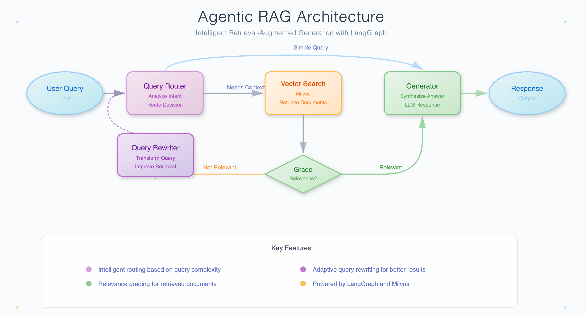
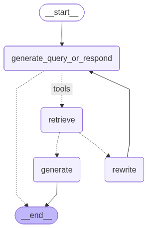

# 使用 Milvus 和 LangGraph 的 Agents RAG

> 原文：https://milvus.io/docs/zh/agentic_rag_with_milvus_and_langgraph.md

本指南演示了如何使用 LangGraph 和 Milvus 构建高级检索增强生成（RAG）系统。与简单检索和生成的传统 RAG 系统不同，Agent RAG 系统可以就何时检索信息、如何处理无关文档以及何时重写查询以获得更好的结果做出智能决策。


​                                                                           *使用 LangGraph 和 Milvus 的代理 RAG 系统的架构*


LangGraph 是一个用于构建、管理和部署长时间运行的有状态智能体的低层编排框架，支持多智能体工作流、持久化、流式处理和 human-in-the-loop 等能力。[Milvus](https://milvus.io/)是世界上最先进的开源向量数据库，用于支持嵌入式相似性搜索和人工智能应用。

在本教程中，我们将构建一个 Agents RAG 系统，它可以

- 决定是否检索文档或直接响应简单查询
- 对检索到的文档进行相关性分级
- 当检索到的文档不相关时重写问题
- 根据相关上下文生成高质量的答案

## 前提条件

运行本笔记本之前，请确保已安装以下依赖项：

```shell
pip install --upgrade langchain langchain-core langchain-community langchain-text-splitters langgraph langchain-milvus milvus-lite langchain-openai bs4
```


## 准备数据

我们使用 Langchain[WebBaseLoader](https://python.langchain.com/docs/integrations/document_loaders/web_base/)从[Lilian Weng 的博文](https://lilianweng.github.io/)中加载文档，并使用[RecursiveCharacterTextSplitter](https://python.langchain.com/docs/how_to/recursive_text_splitter/) 将它们分割成块。

```python
from langchain_community.document_loaders import WebBaseLoader
from langchain_text_splitters import RecursiveCharacterTextSplitter

urls = [
    "https://lilianweng.github.io/posts/2023-06-23-agent/",
    "https://lilianweng.github.io/posts/2023-03-15-prompt-engineering/",
    "https://lilianweng.github.io/posts/2023-10-25-adv-attack-llm/",
]

docs = [WebBaseLoader(url).load() for url in urls]
docs_list = [item for sublist in docs for item in sublist]

text_splitter = RecursiveCharacterTextSplitter.from_tiktoken_encoder(
    chunk_size=1000, chunk_overlap=200
)
doc_splits = text_splitter.split_documents(docs_list)

print(f"Total document chunks: {len(doc_splits)}")
```

```sh
USER_AGENT environment variable not set, consider setting it to identify your requests.


Total document chunks: 47
```


## 使用 Milvus 创建一个检索工具

现在，我们将使用 Milvus 创建一个向量存储来索引我们的文档块，并创建一个我们的 Agents 可以使用的检索工具。
```python
from langchain_milvus import Milvus
from langchain_openai import OpenAIEmbeddings
from langchain.tools.retriever import create_retriever_tool

embeddings = OpenAIEmbeddings()

vectorstore = Milvus.from_documents(
    documents=doc_splits,
    embedding=embeddings,
    connection_args={
        "uri": "./milvus_agentic_rag.db",
    },
    drop_old=True,
)

retriever = vectorstore.as_retriever(search_kwargs={"k": 3})

retriever_tool = create_retriever_tool(
    retriever,
    "retrieve_blog_posts",
    "Search and return information about AI agents, prompt engineering, and adversarial attacks on LLMs from Lilian Weng's blog posts.",
)

print(retriever_tool.invoke({"query": "What is Tree of Thought strategy?"})[:1000])

```

>对于`connection_args` ：
>
>- 将`uri` 设置为本地文件，如`./milvus_agentic_rag.db` ，是最方便的方法，因为它会自动利用[Milvus Lite](https://milvus.io/docs/milvus_lite.md)将所有数据存储在此文件中。
>- 如果数据规模较大，可以在[docker 或 kubernetes](https://milvus.io/docs/quickstart.md) 上设置性能更强的 Milvus 服务器。在此设置中，请使用服务器 uri，例如`http://localhost:19530` ，作为您的`uri` 。
>- 如果你想使用[Zilliz Cloud](https://zilliz.com/cloud)（Milvus 的全托管云服务），请调整`uri` 和`token` ，它们与 Zilliz Cloud 中的[公共端点和 Api 密钥](https://docs.zilliz.com/docs/on-zilliz-cloud-console#free-cluster-details)相对应。


## 构建 Agents RAG 图

### 定义图状态

我们将使用 LangGraph 的`MessagesState` 来维护对话中的消息列表。

```python
from langgraph.graph import MessagesState
from langchain_openai import ChatOpenAI

# Initialize the language model
llm = ChatOpenAI(model="gpt-4o-mini", temperature=0)
```

### 节点 1：生成查询或响应

该节点决定是使用检索工具搜索信息，还是直接回复用户。

```python
def generate_query_or_respond(state: MessagesState):
    """
    Decide whether to retrieve information or respond directly.

    Args:
        state: Current graph state with messages

    Returns:
        Updated state with the model's response
    """
    response = llm.bind_tools([retriever_tool]).invoke(state["messages"])
    return {"messages": [response]}


# Test with a simple greeting
test_state = {"messages": [{"role": "user", "content": "Hello!"}]}
result = generate_query_or_respond(test_state)
print("Response to greeting:", result["messages"][-1].content)

# Test with a question that needs retrieval
test_state = {
    "messages": [
        {
            "role": "user",
            "content": "What is Chain of Thought prompting and how does it work?",
        }
    ]
}
result = generate_query_or_respond(test_state)
if hasattr(result["messages"][-1], "tool_calls") and result["messages"][-1].tool_calls:
    print("Model decided to use retrieval tool")
    print("Tool call:", result["messages"][-1].tool_calls[0])
```

### 节点 2：对文档进行分级

该节点评估检索到的文档是否与用户的问题相关。
```python
from pydantic import BaseModel, Field
from typing import Literal


class GradeDocuments(BaseModel):
    """Binary score for relevance check on retrieved documents."""

    binary_score: str = Field(
        description="Documents are relevant to the question, 'yes' or 'no'"
    )


def grade_documents(state: MessagesState) -> Literal["generate", "rewrite"]:
    """
    Determines whether the retrieved documents are relevant to the question.

    Args:
        state: Current graph state with messages

    Returns:
        Decision to generate answer or rewrite question
    """
    print("---CHECK DOCUMENT RELEVANCE TO QUESTION---")

    # Get the question and retrieved documents
    question = state["messages"][0].content
    docs = state["messages"][-1].content

    # Create structured LLM grader
    structured_llm_grader = llm.with_structured_output(GradeDocuments)

    # Grade prompt
    grade_prompt = f"""You are a grader assessing relevance of a retrieved document to a user question.
    
    Retrieved document:
    {docs}
    
    User question:
    {question}
    
    If the document contains keyword(s) or semantic meaning related to the user question, grade it as relevant.
    Give a binary score 'yes' or 'no' to indicate whether the document is relevant to the question."""

    score = structured_llm_grader.invoke(
        [{"role": "user", "content": grade_prompt}]
    ).binary_score

    if score == "yes":
        print("---DECISION: DOCS RELEVANT---")
        return "generate"
    else:
        print("---DECISION: DOCS NOT RELEVANT---")
        return "rewrite"

```


### 节点 3：重写问题

如果文档不相关，该节点会重写问题，以改善检索结果。

```python
def rewrite_question(state: MessagesState):
    """
    Transform the query to produce a better question.

    Args:
        state: Current graph state with messages

    Returns:
        Updated state with rewritten question
    """
    print("---TRANSFORM QUERY---")

    question = state["messages"][0].content

    rewrite_prompt = f"""You are an expert at query expansion and transformation.
    
    Look at the input question and try to reason about the underlying semantic intent / meaning.
    
    Here is the initial question:
    {question}
    
    Formulate an improved question that will retrieve better documents from a vector database:"""

    response = llm.invoke([{"role": "user", "content": rewrite_prompt}])

    return {"messages": [{"role": "user", "content": response.content}]}
```


### 节点 4：生成答案

该节点根据检索到的相关文档生成最终答案。
```python
def generate(state: MessagesState):
    """
    Generate answer based on retrieved documents.

    Args:
        state: Current graph state with messages

    Returns:
        Updated state with generated answer
    """
    print("---GENERATE ANSWER---")

    question = state["messages"][0].content
    docs = state["messages"][-1].content

    # RAG generation prompt
    rag_prompt = f"""You are an assistant for question-answering tasks.
    
    Use the following pieces of retrieved context to answer the question.
    
    If you don't know the answer, just say that you don't know.
    
    Use three sentences maximum and keep the answer concise.
    
    Question: {question}
    
    Context: {docs}
    
    Answer:"""

    response = llm.invoke([{"role": "user", "content": rag_prompt}])

    return {"messages": [response]}

```

### 组装图

现在，我们将把所有节点连接起来，创建我们的 Agents RAG 工作流程。
```python
from langgraph.graph import StateGraph, START, END
from langgraph.prebuilt import ToolNode, tools_condition

workflow = StateGraph(MessagesState)

workflow.add_node("generate_query_or_respond", generate_query_or_respond)
workflow.add_node("retrieve", ToolNode([retriever_tool]))
workflow.add_node("rewrite", rewrite_question)
workflow.add_node("generate", generate)

workflow.add_edge(START, "generate_query_or_respond")

workflow.add_conditional_edges(
    "generate_query_or_respond",
    tools_condition,
    {
        "tools": "retrieve",  # If tool call, go to retrieve
        END: END,  # If no tool call, end (direct response)
    },
)

workflow.add_conditional_edges(
    "retrieve",
    grade_documents,
    {
        "generate": "generate",  # If relevant, generate answer
        "rewrite": "rewrite",  # If not relevant, rewrite question
    },
)

workflow.add_edge("rewrite", "generate_query_or_respond")

workflow.add_edge("generate", END)

graph = workflow.compile()

```

让我们将图结构可视化，以了解工作流程：

```python
from IPython.display import Image, display

# Visualize the graph
display(Image(graph.get_graph().draw_mermaid_png()))
```




## 运行代理 RAG 系统

现在，让我们用不同类型的查询来测试我们的 Agents RAG 系统。

### 测试 1：简单问候语（无需检索）

```python
inputs = {"messages": [{"role": "user", "content": "Hello! How are you?"}]}

print("=" * 50)
print("Test 1: Simple greeting")
print("=" * 50)

for output in graph.stream(inputs):
    for key, value in output.items():
        print(f"Node '{key}':")
        if "messages" in value:
            value["messages"][-1].pretty_print()
    print("\n")
```

### 测试 2：需要检索的问题

```python
inputs = {
    "messages": [
        {
            "role": "user",
            "content": "What are the main components and building blocks of an AI agent system?",
        }
    ]
}

print("=" * 50)
print("Test 2: Question requiring retrieval")
print("=" * 50)

for output in graph.stream(inputs):
    for key, value in output.items():
        print(f"Node '{key}':")
        if "messages" in value:
            print(value["messages"][-1])
    print("-" * 50)
```

### 测试 3：可能触发重写的问题

```python
inputs = {
    "messages": [
        {
            "role": "user",
            "content": "How do we defend against potential risks in AI systems?",
        }
    ]
}

print("=" * 50)
print("Test 3: Question that might need rewriting")
print("=" * 50)

for output in graph.stream(inputs):
    for key, value in output.items():
        print(f"Node '{key}':")
        if "messages" in value:
            print(value["messages"][-1])
    print("-" * 50)
```

## 总结

在本教程中，我们使用 LangGraph 和 Milvus 构建了一个代理 RAG 系统，它可以智能地决定何时检索信息、评估文档相关性并重写查询以获得更好的结果。与传统的 RAG 系统相比，这种方法具有显著优势，包括通过智能路由提供更好的用户体验、通过文档分级提供更高质量的答案，以及通过查询重写改进检索。您可以通过添加更复杂的分级逻辑、实施多种检索策略或整合其他工具和数据源来进一步扩展该系统。


