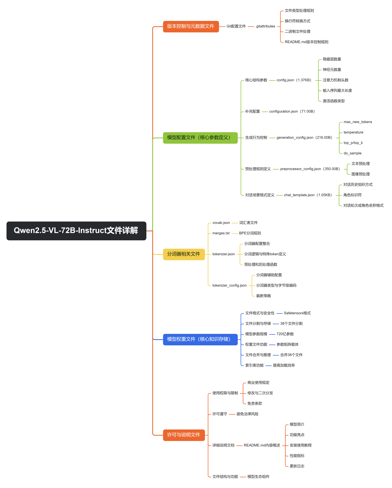

# 一文详解大模型相关文件（以Qwen2.5-VL-72B-Instruct为例）




## 一、版本控制与元数据文件

.gitattributes（1.52KB）
这是 Git 版本控制系统的配置文件，用于定义不同文件类型的处理规则。例如，它可能指定文本文件的换行符转换方式（如 Windows 与 Linux 系统的换行符兼容）、二进制文件（如模型权重）不进行差异比较等，确保团队协作或版本更新时文件的一致性。一般提到 “Update README.md”，说明该文件可能关联了 README.md 的版本控制规则。

```
*.msgpack filter=lfs diff=lfs merge=lfs -text
*.npy filter=lfs diff=lfs merge=lfs -text
*.npz filter=lfs diff=lfs merge=lfs -text
*.onnx filter=lfs diff=lfs merge=lfs -text
*.ot filter=lfs diff=lfs merge=lfs -text
*.parquet filter=lfs diff=lfs merge=lfs -text
*.pb filter=lfs diff=lfs merge=lfs -text
*.pickle filter=lfs diff=lfs merge=lfs -text
*.pkl filter=lfs diff=lfs merge=lfs -text
*.pt filter=lfs diff=lfs merge=lfs -text
*.pth filter=lfs diff=lfs merge=lfs -text
*.rar filter=lfs diff=lfs merge=lfs -text
*.safetensors filter=lfs diff=lfs merge=lfs -text
saved_model/**/* filter=lfs diff=lfs merge=lfs -text
*.tar.* filter=lfs diff=lfs merge=lfs -text
*.tar filter=lfs diff=lfs merge=lfs -text
*.tflite filter=lfs diff=lfs merge=lfs -text
*.tgz filter=lfs diff=lfs merge=lfs -text
*.wasm filter=lfs diff=lfs merge=lfs -text
*.xz filter=lfs diff=lfs merge=lfs -text
*.zip filter=lfs diff=lfs merge=lfs -text
*.zst filter=lfs diff=lfs merge=lfs -text
*tfevents* filter=lfs diff=lfs merge=lfs -text
```


## 二、模型配置文件（核心参数定义）

这类文件决定了模型的结构、运行逻辑和交互方式，是模型加载和使用的基础。

- config.json（1.37KB）

  存储模型的核心结构参数，例如：

  - 隐藏层数量、每一层的神经元数量（决定模型的深度和宽度）；

  - 注意力机制的头数（影响模型对文本 / 图像中不同特征的捕捉能力）；

  - 输入序列的最大长度（限制模型可处理的文本或图像输入规模）；

  - 激活函数类型（如 ReLU、SwiGLU 等，决定神经元的计算逻辑）。

    这些参数直接影响模型的性能和兼容性，加载模型时需通过该文件确认结构是否匹配。

- configuration.json（71.00B）

  体量极小，可能是针对特定场景的补充配置，例如模型在多模态任务（图像 + 文本）中的模态融合方式、输入格式的极简定义等，作为 config.json 的辅助说明。

- generation_config.json（216.00B）

  控制模型生成文本时的行为，具体参数可能包括：

  - max_new_tokens：生成文本的最大长度；

  - temperature：控制生成的随机性（值越高越随机，越低越确定）；

  - top_p/top_k：限制生成时的候选词范围（如 top_k=50 表示仅从概率前 50 的词中选择）；

  - do_sample：是否启用随机采样（而非贪心解码）。

    这些参数决定了模型输出的风格和可控性，例如对话场景需较低的 temperature 以保证回答连贯，创意写作可能需要更高的随机性。

- preprocessor_config.json（350.00B）

  定义输入数据的预处理规则，针对多模态模型的特殊性：

  - 文本预处理：是否去除标点、大小写转换规则等；

  - 图像预处理：分辨率缩放（如统一调整为 224x224 像素）、像素值归一化（如将 0-255 范围转换为 - 1 到 1）、通道顺序（RGB 或 BGR）等。

    确保输入的文本和图像格式符合模型训练时的标准，避免因输入格式错误导致推理失败。

- chat_template.json（1.05KB）

  专门用于对话场景的格式定义文件，例如：

  - 规定对话历史的组织方式（如"[Round 1] User: ... Assistant: ..."）；
  - 区分用户输入、系统提示（System Prompt）和模型回复的标识符；
  - 限制对话轮次或角色名称的格式。
  - 确保模型在多轮对话中能正确理解上下文逻辑，避免混淆角色或遗漏历史信息。
    

## 三、分词器相关文件（文本处理核心）

分词器是将自然语言转换为模型可理解的数字序列的关键组件，以下文件共同实现这一功能：

- vocab.json（2.78MB）

  模型的词汇表，记录了所有可识别的 token（如单词、子词、符号）及其对应的数字索引。例如，“apple” 可能对应索引 123，“[SEP]”（分隔符）对应索引 456。词汇表的大小和覆盖范围直接影响模型对文本的理解能力（如是否包含专业术语、多语言词汇等）。

- merges.txt（1.67MB）

  用于 BPE（字节对编码）分词算法的合并规则文件。BPE 是一种将高频字符组合逐步合并为子词的算法，例如 “unhappiness” 可能被拆分为 “un + happiness”，而 “happiness” 又拆分为 “happy + ness”。merges.txt 记录了所有可能的合并步骤，确保分词时能按训练时的规则拆分或组合文本，保证输入序列的一致性。

- tokenizer.json（7.03MB）

  分词器的完整配置文件，整合了 vocab.json、merges.txt 的信息，还包含：

  - 分词逻辑（如是否保留空格、如何处理未知字符 [UNK]）；

  - 特殊 token 的定义（如[CLS]用于句首标记、[PAD]用于填充短序列）；

  - 预处理和后处理函数（如将 token 转换为索引的映射表）。

    加载分词器时，通常直接调用该文件即可完成文本到 token 的转换。

- tokenizer_config.json（5.70KB）

  分词器的辅助配置，例如：

  - 分词器类型（如 BPE、WordPiece）；

  - 是否启用字节级编码（处理多语言或生僻字符时更灵活）；

  - 截断策略（当文本长度超过 max_length 时，保留前半部分还是后半部分）。

    确保分词器的行为与模型训练时一致，避免因分词差异导致性能下降。

## 四、模型权重文件（核心知识存储）

- model-00001-of-00038.safetensors  至  model-00038-of-00038.safetensors

  这些是模型的核心权重文件，采用 Safetensors 格式（一种比 PyTorch 原生.pt 格式更安全的张量存储格式，可防止恶意代码注入）。

  - 由于模型参数规模达 72B（720 亿），单个文件无法存储，因此分割为 38 个部分，每个部分大小在 2.24GB 到 4.00GB 之间，总大小约 140GB 左右（计算：36 个 3.81-4.00GB 文件 + 最后 2 个较小文件）。
  - 权重文件包含模型通过训练学到的参数（如神经网络中的权重矩阵、偏置项），是模型 “知识” 的载体：例如，图像识别部分的权重能提取物体边缘、颜色等特征，文本部分的权重能理解语法和语义关系，多模态融合部分的权重能关联图像内容与文本描述。
  - 加载模型时，需将 38 个文件按顺序合并，还原完整的参数矩阵，才能进行推理。

- model.safetensors.index.json（108.89KB）

  权重文件的索引表，记录了 38 个分割文件的元信息：

  - 每个文件包含的参数片段（如 “model-00001” 对应第 1-10 层的权重）；

  - 每个文件的路径、大小、校验和（确保文件未损坏或被篡改）。

    加载模型时，程序通过该索引快速定位所需的权重片段，无需逐个扫描文件，提高加载效率。

## 五、许可与说明文件

- LICENSE（6.96KB）

  规定模型的使用权限和限制，例如：

  - 是否允许商业使用（非商用需注明来源，商用可能需申请授权）；
  - 是否允许修改模型权重或二次分发（如禁止将修改后的模型以相同名称发布）；
  - 免责条款（如模型输出的准确性不做保证，用户需自行验证）。
  - 使用模型前需遵守许可条款，避免法律风险。

- README.md（21.05KB）

  模型的详细说明文档，通常包含：

  - 模型简介（如 72B 参数的多模态模型，支持图像理解 + 文本生成）；

  - 功能亮点（如更强的图像细节识别、更长的文本上下文处理）；

  - 安装和使用教程（如通过 Transformers 库加载的代码示例）；

  - 性能指标（如在某图像问答数据集上的准确率）；

  - 更新日志（如页面提到的 “remove self referencing base model”，即修复了基础模型的自引用问题）。

    是用户快速了解和上手模型的核心参考资料。


## 总结

这些文件从结构定义（config.json）、数据处理（分词器文件、preprocessor_config）、生成控制（generation_config）、交互格式（chat_template）、核心知识（权重文件）到使用规范（LICENSE、README），形成了完整的模型生态。无论是开发者加载模型进行推理，还是研究者修改模型结构，都需依赖这些文件的协同工作，确保模型的兼容性、稳定性和功能性。


