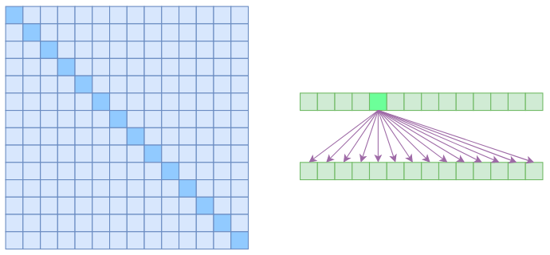
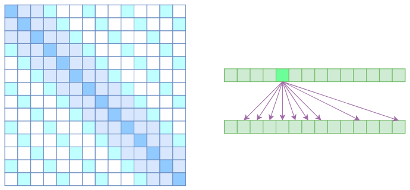

# 为节约而生：从标准Attention到稀疏Attention

如今NLP领域，Attention大行其道，当然也不止NLP，在CV领域Attention也占有一席之地（Non Local、SAGAN等）。在18年初[《〈Attention is All You Need〉浅读（简介+代码）》](https://www.spaces.ac.cn/archives/4765)一文中，我们就已经讨论过Attention机制，Attention的核心在于Q,K,V三个向量序列的交互和融合，其中Q,K的交互给出了两两向量之间的某种相关度（权重），而最后的输出序列则是把V按照权重求和得到的。

显然，众多NLP&CV的成果已经充分肯定了Attention的有效性。本文我们将会介绍Attention的一些变体，这些变体的共同特点是——“为节约而生”——既节约时间，也节约显存。

## 背景简述

[《Attention is All You Need》](https://papers.cool/arxiv/1706.03762)一文讨论的我们称之为“乘性Attention”，目前用得比较广泛的也就是这种Attention：

Attention(Q,K,V)=softmax(QK⊤dk−−√)V(1)

另外还有加性Attention，但加性Attention并行不大容易实现（或者实现起来占用显存多），所以一般只用来将变长向量序列编码为固定长度的向量（取代简单的Pooling），而很少用来做序列到序列的编码。而在乘性Attention中，用得最广泛的当数Self Attention了，这种情况下Q,K,V都是同一个X经过线性变换之后的结果，这样一来输出结果就是跟X一样长的向量序列，并且能够直接捕捉X中任意两个向量的关联，而且易于并行，这都是Self Attention的优点。

然而，从理论上来讲，Self Attention的计算时间和显存占用量都是O(n2)级别的（n是序列长度），这就意味着如果序列长度变成原来的2倍，显存占用量就是原来的4倍，计算时间也是原来的4倍。当然，假设并行核心数足够多的情况下，计算时间未必会增加到原来的4倍，但是显存的4倍却是实实在在的，无可避免，这也是微调Bert的时候时不时就来个OOM的原因了。

## 稀疏Attention

我们说Self Attention是O(n2)的，那是因为它要对序列中的任意两个向量都要计算相关度，得到一个n2大小的相关度矩阵：

标准Self Attention的注意力矩阵（左）和关联图示（右）

在上图中，左边显示了注意力矩阵，右边显示了关联性，这表明每个元素都跟序列内所有元素有关联。

所以，如果要节省显存，加快计算速度，那么一个基本的思路就是减少关联性的计算，也就是认为每个元素只跟序列内的一部分元素相关，这就是**稀疏Attention**的基本原理。本文所要介绍的稀疏Attention，源于OpenAI的论文[《Generating Long Sequences with Sparse Transformers》](https://papers.cool/arxiv/1904.10509)，但没有按照原论文的方式来介绍，而是用一种笔者认为更加自然的思路来介绍。

### Atrous Self Attention[ #](https://www.spaces.ac.cn/archives/6853#Atrous Self Attention)

第一个要引入的概念是Atrous Self Attention，中文可以称之为“膨胀自注意力”、“空洞自注意力”、“带孔自注意力”等。这个名称跟后面的Local Self Attention一样，都是笔者根据它的特性自行命名的，原论文[《Generating Long Sequences with Sparse Transformers》](https://papers.cool/arxiv/1904.10509)并没有出现过这两个概念，但我认为将它们单独引出来是有意义的。

很显然，Atrous Self Attention就是启发于“膨胀卷积（Atrous Convolution）”，如下右图所示，它对相关性进行了约束，强行要求每个元素只跟它相对距离为k,2k,3k,…的元素关联，其中k>1是预先设定的超参数。从下左的注意力矩阵看，就是强行要求相对距离不是k的倍数的注意力为0（白色代表0）：

Atrous Self Attention的注意力矩阵（左）和关联图示（右）

由于现在计算注意力是“跳着”来了，所以实际上每个元素只跟大约n/k个元素算相关性，这样一来理想情况下运行效率和显存占用都变成了O(n2/k)，也就是说能直接降低到原来的1/k。

### Local Self Attention[ #](https://www.spaces.ac.cn/archives/6853#Local Self Attention)

另一个要引入的过渡概念是Local Self Attention，中文可称之为“局部自注意力”。其实自注意力机制在CV领域统称为“Non Local”，而显然Local Self Attention则要放弃全局关联，重新引入局部关联。具体来说也很简单，就是约束每个元素只与前后k个元素以及自身有关联，如下图所示：

Local Self Attention的注意力矩阵（左）和关联图示（右）

从注意力矩阵来看，就是相对距离超过k的注意力都直接设为0。

其实Local Self Attention就跟普通卷积很像了，都是保留了一个2k+1大小的窗口，然后在窗口内进行一些运算，不同的是普通卷积是把窗口展平然后接一个全连接层得到输出，而现在是窗口内通过注意力来加权平均得到输出。对于Local Self Attention来说，每个元素只跟2k+1个元素算相关性，这样一来理想情况下运行效率和显存占用都变成了O((2k+1)n)∼O(kn)了，也就是说随着n而线性增长，这是一个很理想的性质——当然也直接牺牲了长程关联性。

### Sparse Self Attention[ #](https://www.spaces.ac.cn/archives/6853#Sparse Self Attention)

到此，就可以很自然地引入OpenAI的Sparse Self Attention了。我们留意到，Atrous Self Attention是带有一些洞的，而Local Self Attention正好填补了这些洞，所以一个简单的方式就是将Local Self Attention和Atrous Self Attention交替使用，两者累积起来，理论上也可以学习到全局关联性，也省了显存。

（简单画个草图就可以知道，假如第一层用Local Self Attention的话，那么输出的每个向量都融合了局部的几个输入向量，然后第二层用Atrous Self Attention，虽然它是跳着来，但是因为第一层的输出融合了局部的输入向量，所以第二层的输出理论上可以跟任意的输入向量相关，也就是说实现了长程关联。）

但是OpenAI没有这样做，它直接将两个Atrous Self Attention和Local Self Attention合并为一个，如下图：

Sparse Self Attention的注意力矩阵（左）和关联图示（右）

从注意力矩阵上看就很容易理解了，就是除了相对距离不超过k的、相对距离为k,2k,3k,…的注意力都设为0，这样一来Attention就具有“局部紧密相关和远程稀疏相关”的特性，这对很多任务来说可能是一个不错的先验，因为真正需要密集的长程关联的任务事实上是很少的。

## 代码实现

上面的Atrous Self Attention、Local Self Attention、Sparse Self Attention都算是稀疏Attention，直观上来看就是注意力矩阵变得很稀疏了。那怎么实现它们呢？如果直接在注意力矩阵中对为零的部分进行mask的话，那在数学上（功能上）是没有问题的，但这样做并不能提速，也不能省显存。

### 官方实现[ #](https://www.spaces.ac.cn/archives/6853#官方实现)

OpenAI也开源了自己的实现，位于：https://github.com/openai/sparse_attention

这是基于tensorflow的，还用到了它们自己的一个稀疏矩阵库[blocksparse](https://github.com/openai/blocksparse/)。不过这玩意似乎封装得很奇怪，我不知道怎么将它迁移到Keras，而且它用了很多Python 3的特性，不能直接用于Python 2。如果用Python 3和纯Tensorflow的朋友可以试试。

还有一个问题是OpenAI原论文主要是用稀疏Attention来生成超长序列，所以它在论文中和代码中都把注意力矩阵的所有上三角部分都mask了（避免用到未来信息），但未必所有用到稀疏Attention的都是生成场景，而且对于基本概念的介绍来说，这是不必要的，这也是笔者不按原论文的思路来介绍的原因之一。

### Keras实现[ #](https://www.spaces.ac.cn/archives/6853#Keras实现)

对于Keras，笔者根据自己构思的写法实现了上述三种稀疏Attention，并且和原来写过的Attention代码统一规范化了一下，还是放在原来的位置：
https://github.com/bojone/attention/blob/master/attention_keras.py

经过实验，发现在笔者的写法中，这三种稀疏Attention相比全量Attention确实能节省一些内存，但遗憾的是，除了Atrous Self Attention外，剩下两种Attention的实现都不能提速，反而降低了一点速度，这是因为实现过程中没有充分利用稀疏性所致的，而OpenAI的blocksparse则是经过高度优化，而且是直接写的CUDA代码，这没法比。但不管速度如何，三种稀疏Attention功能上应该是没毛病的。

## 文章小结

也没什么好总结的了，就介绍并实现了三种稀疏Attention。除了省显存外，稀疏的Attention应该能够更好地适应一些任务，毕竟大多数任务的关联主要都在局部的，而且是从局部到整体的形式。尤其是最后一个Sparse Self Attention所体现的“局部紧密相关和远程稀疏相关”，应当能满足大多数任务的特点，如果有相应任务的读者，不妨试用一下。

***转载到请包括本文地址：**https://www.spaces.ac.cn/archives/6853*

***更详细的转载事宜请参考：***[《科学空间FAQ》](https://www.spaces.ac.cn/archives/6508#文章如何转载/引用)