# KNN-K近邻分类算法

#### 一、KNN概述

**KNN（K Nearest Neighbor）**算法，也叫 **K 近邻算法**，最初是 Cover 在1968年提出，是最简单的机器学习算法。这里 K 近邻，就是 K 个最近的邻居的意思。**KNN 算法的核心思想是，对一个未知样本的标签，可以使用 K 个特征和它最接近的已知样本的标签来推断**。比如，”你的收入等于五个你最亲密朋友的收入的平均值“，这句话，其实就是 KNN 算法的应用，这里 K=5。

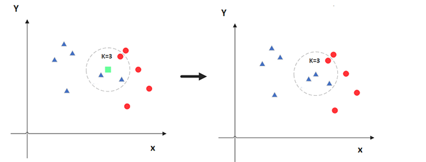

**KNN 算法既可用于分类问题，也可用于回归问题**：

- 对于分类问题，是使用和未知样本特征最接近的 K 个已知样本的标签中的占比最多的标签值，作为未知样本的标签值
- 对于回归问题，是使用和未知样本特征最接近的 K 个已知样本的标签的加权平均数，作为位置样本的标签值

**两个样本的特征相似度可以用特征的距离来表示，KNN 算法一般用的欧式距离**。欧式距离可以用勾股定理推导而来，其公式如下，

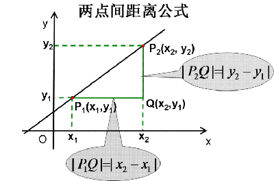

- 二维平面上的点 a $(x*1, y_1)$ 和 点 b $(x_2, y_2)$ 之间的欧式距离：$d*{ab}=\sqrt{\left(x_1-x_2\right)^2+\left(y_1-y_2\right)^2}$
- 三维平面上的点 a $(x*1, y_1, z_1)$ 和 点 b $(x_2, y_2, z_2)$ 之间的欧式距离：$d*{ab}=\sqrt{\left(x_1-x_2\right)^2+\left(y_1-y_2\right)^2+\left(z_1-z_2\right)^2}$
- n维平面上的点 a $(x*1, x_2,…,x_n)$ 和 点 b $(y_1, y_2, …, y_n)$ 之间的欧式距离：$d*{ab}=\sqrt{\left(x*1-y_1\right)^2+\left(x_2-y_2\right)^2+\cdots+\left(x_n-y_n\right)^2}=\sqrt{\sum*{i=1}^n\left(x_i-y_i\right)^2}$

#### 二、KNN的工作流程

以分类问题为例，下面说说 KNN 算法的工作流程：

1. 确定超参数 k 的值（超参数，机器学习模型中需要手动指定的参数）
2. 计算已知类别数据集中的点与当前点之间的距离
3. 按距离递增对已知样本进行排序
4. 选取与当前点距离最小的 k 个样本点
5. 统计前 k 个样本点所在的类别出现的频率
6. 返回前 k 个样本点出现频率最高的类别作为当前点的预测分类

#### 三、KNN的应用

假设我们现在有⼏部电影

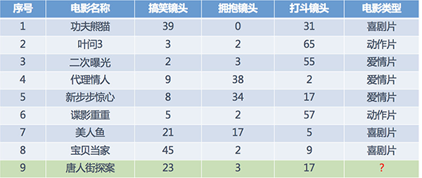

其中 9 号电影不知道类别，想要预测它的类别，我们可以使用 K 近邻算法。

- 分别计算每个电影和被预测电影的距离
- 找到最近的 5 部电影
- 取5部电影中占比最多的类型

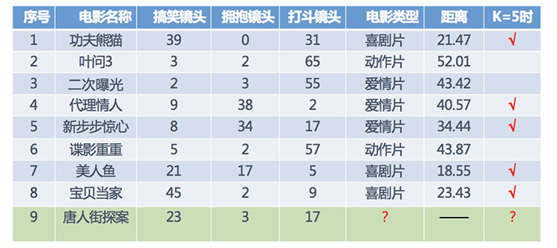

所以，当K为5时，唐人街探案被分类为3部喜剧片，2部爱情片，所以为喜剧片。

#### 四、使用Python代码实现

```python
import math

x = [[39, 0, 31], [3, 2, 65], [2, 3, 55], [9, 38, 2], [8, 34, 17], [5, 2, 57], [21, 17, 5], [45, 2, 9]]
y = ['xi', 'dong', 'ai', 'ai', 'ai', 'dong', 'xi', 'xi']  # 对应上述数据的电影种类
x_hat = [23, 3, 17]

dict = {}
for i in range(len(x)):
    dist = math.sqrt((x[i][0] - x_hat[0])**2 + (x[i][1] - x_hat[1])**2 + (x[i][2] - x_hat[2])**2)
    dict[dist] = y[i]

# 对字典进行排序，生成 [(), ()]，用于判定属于哪一类
list = sorted(dict.items(), key=lambda d: d[0])

for k in range(5):
    print(list[k][1])
```

#### 五、使用sklearn实现

Scikit-learn 简称 sklearn，是一个功能强大、易于使用的机器学习库。

Scikit-learn 提供了丰富的机器学习算法和工具，包括 分类、回归、聚类、降维、模型选择、预处理, 全面覆盖了 数据获取、数据预处理、模型选择、模型训练、模型评估、模型优化 这几个主要的机器学习工作流程。

```python
from sklearn.neighbors import KNeighborsClassifier

X = [[39, 0, 31], [3, 2, 65], [2, 3, 55], [9, 38, 2], [8, 34, 17], [5, 2, 57], [21, 17, 5], [45, 2, 9]]
# y = [1, 2, 3, 3, 3, 2, 1, 1]        # 对应类别
y = ['xi', 'dong', 'ai', 'ai', 'ai', 'dong', 'xi', 'xi']   # 或写成这样也可

estimator = KNeighborsClassifier(n_neighbors=5)
estimator.fit(X, y)

result = estimator.predict([[23, 3, 17]])
print(result)        # 输出为：['xi']
```

#### 六、距离度量

##### 1、距离公式基本性质

使用 KNN 来估计未知样本的标签，需要衡量两个样本点特征之间的相似性。两个样本特征的相似性可以使用样本点的距离来衡量。前面我们用的最常见的欧式距离。在机器学习中，对于两个点的距离的度量可以有很多公式，假如用函数 dist() 来表示，那么所有距离公式都需满足 **非负性、同一性、对称性、三角不等性** 这些基本性质:

- 非负性，任意两个点 $X_i$ 和 $X_j$ 的距离始终是非负数，$\operatorname{dist}\left(X_i, X_j\right)>=0$
- 同一性，如果两个点的坐标相同 $X_i = X_j$，则它们之间的距离为0，$\operatorname{dist}\left(X_i, X_j\right)=0$
- 对称性，两个点之间的距离与它们的顺序无关，$\operatorname{dist}\left(X_i, X_j\right)=\operatorname{dist}\left(X_j, X_i\right)$
- 三角不等性，对于任意三个点$X_1$, $X_2$和$X_3$，有 $\operatorname{dist}\left(X_1, X_2\right) <= \operatorname{dist}\left(X_1, X_3\right) + \operatorname{dist}\left(X_3, X_2\right)$

##### 2、欧式距离

欧式距离（Euclidean distance）就是两点之间的直线距离，是一种常用的距离度量方式，我们小学、初中和高中接触到的两个点在空间中的距离一般都是指欧氏距离。

- **二维**平面上的点 a $(x*1, y_1)$ 和 点 b $(x_2, y_2)$ 之间的欧式距离：$d*{ab}=\sqrt{\left(x_1-x_2\right)^2+\left(y_1-y_2\right)^2}$
- **三维**平面上的点 a $(x*1, y_1, z_1)$ 和 点 b $(x_2, y_2, z_2)$ 之间的欧式距离：$d*{ab}=\sqrt{\left(x_1-x_2\right)^2+\left(y_1-y_2\right)^2+\left(z_1-z_2\right)^2}$
- **n维**平面上的点 a $(x*1, x_2,…,x_n)$ 和 点 b $(y_1, y_2, …, y_n)$ 之间的欧式距离：$d*{ab}=\sqrt{\left(x*1-y_1\right)^2+\left(x_2-y_2\right)^2+\cdots+\left(x_n-y_n\right)^2}=\sqrt{ \sum\nolimits_{i=1}^{n} (x_i - y_i)^2 }$

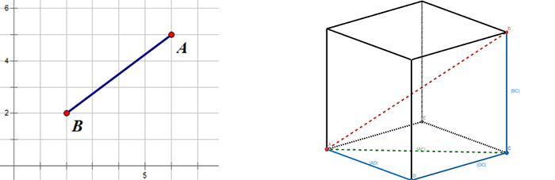

##### 3、曼哈顿距离

曼哈顿距离就是用计算在城市地图上两个点之间的行走距离，这个距离只能沿着街道和大道行走，不能直接穿过建筑物或其他障碍物。比如，要从一个十字路口开车到另一个十字路口，驾驶距离显然不是两点间的直线距离。这个实际驾驶距离就是“曼哈顿距离(Manhattan Distance)”。曼哈顿距离常用于计算城市地图上路线的长度，因此曼哈顿距离也称为“城市街区距离”(City Block distance)。

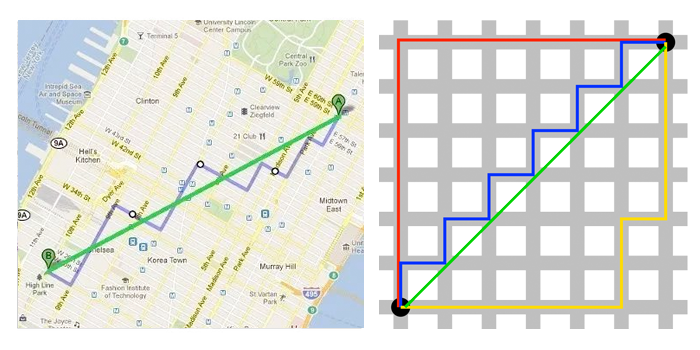

- **二维**平面上的点 a $(x_1, y_1)$ 和 点 b $(x_2, y_2)$ 之间的曼哈顿距离：

  $d_{ab}=\left|x_1-x_2\right|+\left|y_1-y_2\right|$

- **n维**平面上的点 a $(x_1, x_2, …, x_n)$ 和 点 b $(y_1, y_2, …, y_n)$ 之间的曼哈顿距离：

  $ d*{ab}=\sum*{i=1}^n\left|x*{i}-y*{i}\right|$

##### 4、切比雪夫距离

在国际象棋棋盘上，国王可以直行、横行、斜行，所以国王走一步可以移动到相邻 8 个方格中的任意一个。那么国王从格子(x1, y1)走到格子(x2, y2)最少需要多少步？这个就叫切比雪夫距离(Chebyshev Distance)。在二维空间中，两个点之间的切比雪夫距离为它们横坐标之差的绝对值与纵坐标之差的绝对值的最大值。

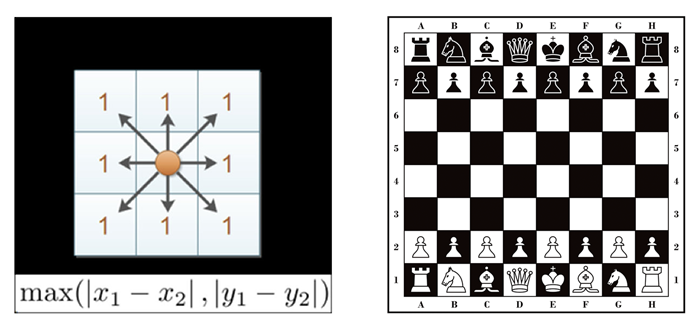

- **二维**平面上的点 a $(x_1, y_1)$ 和 点 b $(x_2, y_2)$ 之间的切比雪夫距离：

  $d_{ab}=\max \left(\left|x_1-x_2\right|,\left|y_1-y_2\right|\right)$

- **n维**平面上的点 a $(x_1, x_2, …, x_n)$ 和 点 b $(y_1, y_2, …, y_n)$ 之间切比雪夫距离：

  $d*{ab}=\max \left(\left|x*{i}-y_{i}\right|\right)$

##### 5、闵可夫斯基距离

闵可夫斯基距离 (Minkowski Distance)，也被称为闵氏距离，它不仅仅是一种距离，而是将多个距离公式（曼哈顿距离、欧式距离、切比雪夫距离）总结成为的一个公式，是对多个距离度量公式的概括性的表述。

两个n维空间中的点 a $(x*1,x_2,…,x_n)$ 与 b $(y_1,y_2,…,y_n)$间的闵氏距离为：$d*{ab}=\sqrt[p]{\sum*{i=1}^n\left|x*{i}-y_{i}\right|^p}$

其中p是一个可变参数：

- 当p=1时，就是曼哈顿距离；
- 当p=2时，就是欧氏距离；
- 当p→∞时，就是切比雪夫距离。

根据p的不同，闵氏距离可以表示某一种的距离。

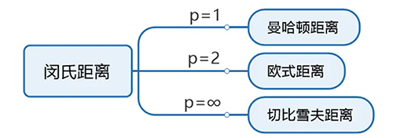

**闵氏距离的缺点：**

- **未考虑各个分量的量纲不同**，将各个分量的量纲(scale)，也就是“单位”相同的看待了

  - 比如，二维空间(身高[单位:cm], 体重[单位:kg])，有三个样本：a(180, 50)、b(190, 50)、c(180, 60)，可得 a 与 b 的闵氏距离等于a 与 c 的闵氏距离（无论是曼哈顿距离、欧氏距离或切比雪夫距离）。但实际上身高的 10cm 并不能和体重的 10kg 划等号。

- **未考虑各个分量的分布不同**（期望，方差等）

- **高维空间中，闵式距离会出现维度灾难**。随着维度的增加，数据点变得越来越稀疏，闵式距离难以有效区分样本点的差别，如下图所示，其中1、2两个点的距离和1、5两个点的距离的差距随着纬度的增加而变小。

  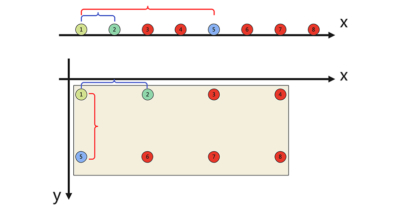

所以，通常会使用到标准欧式距离、余弦距离、汉明距离、杰卡德距离等算法来运算。

#### 七、离散特征的距离计算

我们常将样本的特征划分为”连续特征” (continuous feature)和”离散特征” (categorical feature)，前者在定义域上有无穷多个可能的取值，后者在定义域上是有限个取值，所谓离散特征也就是分类特征。

对于离散类型的特征：

- **若特征值之间存在序关系，则可以将其转化为连续值**，例如：成绩等级“优”、“良”、“差”，可转化为{1, 0.5, 0}。

  - 闵可夫斯基距离可以用于有序特征

- **若特征值之间不存在序关系，则通常将其转化为向量的形式**，例如：性别属性“男”、“女”，可转化为(1, 0)、(0, 1)，这种转换也叫做 one-hot 编码。

  - 经过 one-hot 编码的特征不适合使用闵可夫斯基距离

    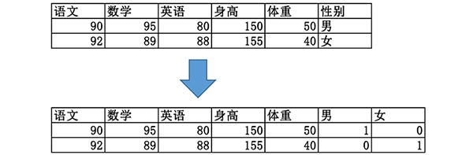

#### 八、K值的选择

在使用 KNN 算法的时候，有一个超参数 K 需要我们手动指定，那么参数 K 到底取什么值比较合适呢？

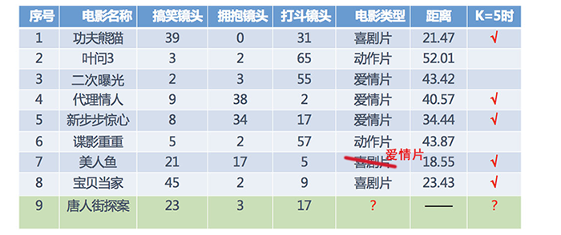

- **K值过小，容易受到异常点的影响**
- **k值过大，容易受到样本分布不均衡的影响**

（1）选择较⼩的K值，就相当于⽤较⼩的领域中的训练实例进⾏预测， 意味着整体模型变得复杂，容易发⽣过拟合

（2）选择较⼤的K值，就相当于⽤较⼤领域中的训练实例进⾏预测， 意味着整体的模型变得简单，容易发生欠拟合。

（3）K=N（N为训练样本个数），完全不会采用， 因为此时⽆论输⼊实例是什么，都只是简单的预测它属于在训练实例中最多的类，模型过于简单，忽略了训练实例中⼤量有⽤信息。

在实际应⽤中，**选择 K 的值常用方法**如下：

（1）**交叉验证法**：交叉验证（cross-validation）是通过将训练集分割成几部分，并轮流在其中的一部分上验证模型的性能，这种方法对模型的评估结果会比较稳定，具有较好的泛化性能，可以用来选择最优的K值。在每一次的验证过程中，你可以尝试一个不同的K值，并选择那个在交叉验证中得分最高的K值。

（2）**误差曲线法**：对于不同的K值，计算训练误差和验证误差，并绘制出随K变化的误差曲线。选择那个使验证误差最小的K值。通常这个验证误差曲线会呈现”U”形，如果K太小，模型会过拟合；如果K太大，模型又会欠拟合。