# 机器学习和运算

教材内容

### 一、人工智能简介

#### 1、什么是人工智能

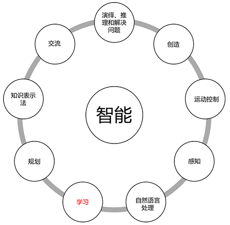

人工智能是一种 **模拟人类智能的技术**，它可以让计算机像人类一样 **推理、规划、学习、解决问题、抽象思考、理解复杂概念**。

- 推理：今天—>没有太阳， 没有太阳—>阴天，今天—>阴天
- 规划：是指通过思考制定目标、达成目标的能力，比如，设计城市规划、制定公司发展计划、规划旅游路线等等
- 学习：是指通过接收信息、经验和知识来提升自己的能力，比如，学会开车、学会游泳、练习打羽毛球获得世界冠军等等

#### 2、人工智能发展

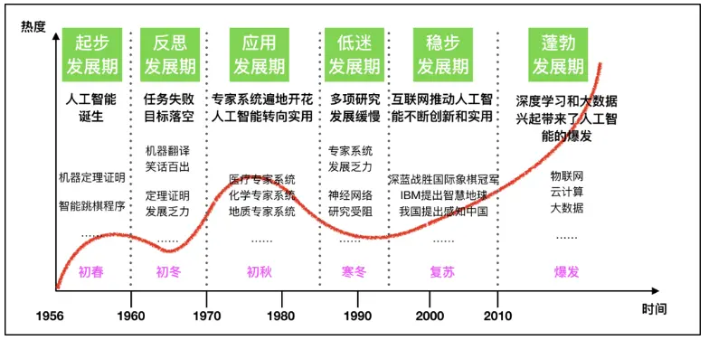

#### 3、人工智能发展三要素

- 数据：用于训练AI
- 算法：用于提升效率和准确率
- 算力：用于提升速度

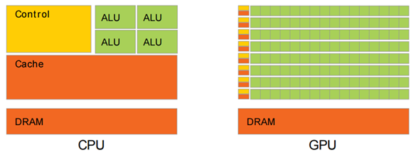

CPU（中央处理器）和 GPU（图形处理器）

（1）结构：CPU有几个处理器核心，每个核心可以处理多种任务；而GPU有数千个小型处理器核心，可用于高度并行的计算。

（2）用途：CPU主要用于处理通用计算任务，如浏览网页、运行办公软件等。而GPU主要用于处理专用计算任务，如图像处理、科学计算等。

（3）性能：GPU在执行大规模并行计算任务时比CPU更快，因为它可以同时处理多个数据流；但是在单线程计算和通用计算任务方面，CPU更具优势。

#### 4、人工智能、机器学习和深度学习

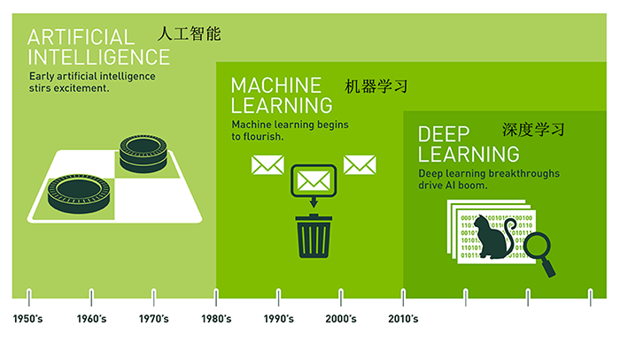

- 人工智能、机器学习、深度学习的关系
  - 机器学习是人工智能的一个实现途径
  - 深度学习是机器学习的一个方法发展而来

#### 5、人工智能主要分支

感知、认知与行动是人工智能的三个关键能力，在这里我们将根据这些能力/应用对这三个技术领域进行介绍：

- 计算机视觉(CV)：图像采集、图像处理、图像提取、图像推理、图像生成
- 自然语言处理(NLP)，含语音识别：让计算机处理、理解、生成文本的技术，语音处理部分主要包含语音识别和语音生成
- 机器人（Robot）：研究机器人的设计、制造、运作和应用，以及控制它们的计算机系统、传感反馈和信息处理

### 二、机器学习

#### 1、机器学习定义

机器学习是研究如何 让计算机可以像人一样进行学习 的技术、方法和理论。也就是像人可以从历史经验中，获取新的知识和技能。理论一点的说就是，让计算机对大量历史数据进行分析，提取数据中的规律，进而利用规律对未知数据进行推断。

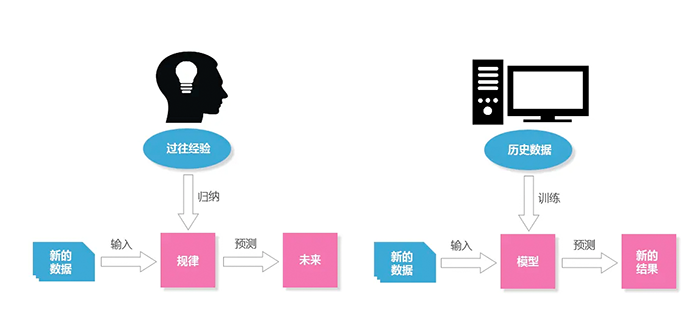

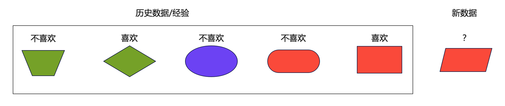

#### 2、机器学习主要流程

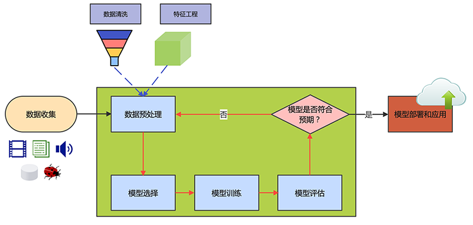

机器学习的工作流程通常可以分为以下几个步骤：

（1）**数据收集**：收集并整理有关问题的数据，例如图像、文本、表格等等。

（2）**数据预处理**：对数据进行清洗、归一化、特征提取等操作，以便于后续的建模和分析。

（3）**模型选择**：选择适合问题的模型，例如线性回归、决策树、神经网络等等。

（4）**模型训练**：使用已有数据对模型进行训练，以便于模型能够学习数据之间的关系。

（5）**模型评估**：使用测试数据对模型进行评估，以衡量模型的性能和准确性。

（6）**模型优化**：根据模型评估的结果，对模型进行优化，例如调整模型超参数、增加训练数据等等。

（7）**模型部署和应用**：将训练好的模型部署为服务，应用到实际问题中，例如进行图像分类、文本分类、预测等等。

#### 3、机器学习算法分类

根据数据集和训练方式的不同，机器学习算法一般可以分为：

- 监督学习，Supervised Learning
- 无监督学习，Unsupervised Learning
- 强化学习，Reinforcement Learning

| 类别         | 监督学习                                   | 无监督学习                               | 强化学习                                       |
| :----------- | :----------------------------------------- | :--------------------------------------- | :--------------------------------------------- |
| **训练数据** | 标记的输入数据                             | 未标记的输入数据                         | 无特定的训练数据，通过与环境的交互获得反馈     |
| **学习目标** | 预测目标变量，例如分类或回归问题           | 发现数据内在的结构和模式，例如聚类和降维 | 学习一个策略，以最大化从环境中获得的奖励       |
| **反馈**     | 明确的反馈（例如，错误的预测和实际的输出） | 无明确反馈                               | 递延反馈，即动作的结果可能在未来某个时刻才体现 |
| **示例算法** | 决策树，逻辑回归，神经网络                 | K-means聚类，主成分分析（PCA）           | Q-Learning，Deep Q Network（DQN）              |
| **应用领域** | 图像识别，语音识别，预测模型               | 客户分群，特征提取，异常检测             | 游戏AI，自动驾驶，机器人控制                   |

#### 4、欠拟合vs过拟合

模型评估用于评价训练好的的模型的表现效果，其表现效果大致可以分为3类：过拟合、欠拟合、拟合。

在训练过程中，你可能会遇到如下问题：训练数据训练的很好啊，误差也不大，但在测试集上面效果却不好，这可能就出现了拟合问题。

##### （1) 欠拟合 under-fitting

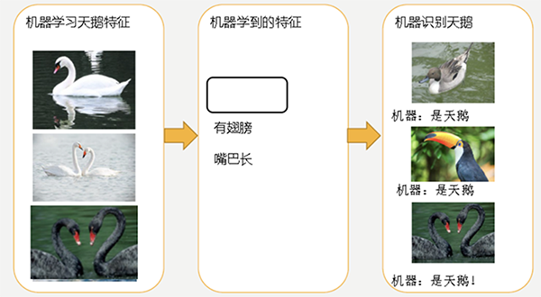

因为机器学习到的天鹅特征太少了，导致区分标准太粗糙，不能准确识别出天鹅。

欠拟合：模型学习的太过粗糙，学习到的特征太少，没有把训练集中的样本数据特征关系学出来。

##### (2) 过拟合 over-fitting

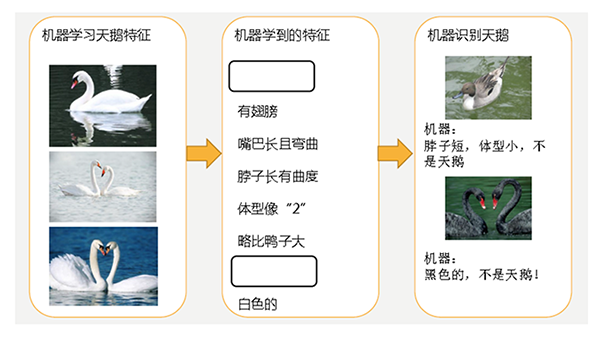

机器已经基本能区别天鹅和其他动物了。然后，很不巧已有的天鹅图片全是白天鹅的，于是机器经过学习后，会认为天鹅的羽毛都是白的，以后看到羽毛是黑的天鹅就会认为那不是天鹅。

过拟合：机器学习模型在训练样本中表现得过于优越，学习到了一些噪音规律，导致在测试数据集中表现不佳。

### 三、编码与运算

在AI领域，无论是传统AI，还是大模型，其本质就是对计算机可以支持的数据进行数值化处理。目前计算机能够处理的数据主要可以分为：数字、文字、图片、音频、视频，而无论哪一种数据，最终都需要转换为计算机能够进行运算的 **数值**。

#### 1、为什么必须要数值

在统计学和数学领域，最简单的预测公式为一元线性回归：y=wx+b，既根据历史数据的x和y，来拟合出一个相对来说比较均衡的 w 和 b 的参数（也叫权重），比如 拟合出来为 y = 5x + 3，则要进行预测，就可以根据 x 的值，来预测 y，比如如果 x的值为 10，则 y 的预测结果为 53。是AI领域最基础最简单的一个公式。

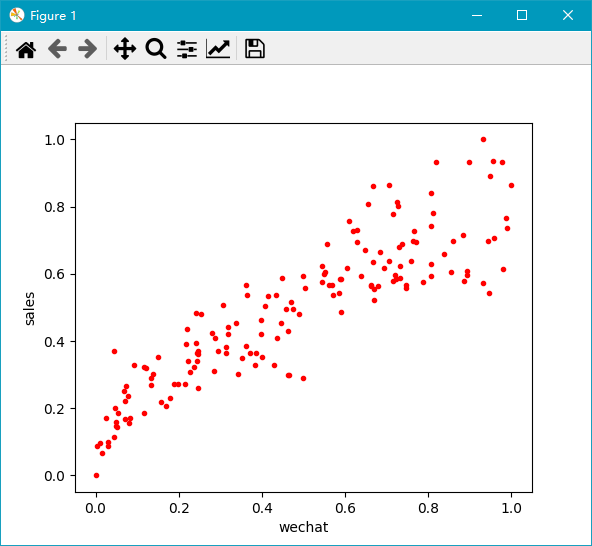

上述图中，红点对应的就是 X 和 Y 的分布，这叫训练样本 （有 x 和 y 的值），进而拟合出差异最小的 w 和 b 的值，于是得到一条直线函数：y = 0.66x + 0.17，于是，根据 x 的值就可以预测 y 的值，如下图所示：

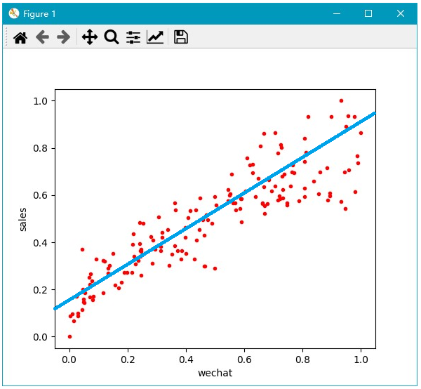

所以，在计算机或者AI的眼里，它并不认识文字，图片，语音这些东西，它更不知道哪张图片好看，哪张图片难看，它的眼里，只有数字。所有的AI推理，均是一种基于 输入值 的预测值，它可能简单到只有 y = wx + b (一元线性回归)，也可能复杂到 $y=w_1x_1 + w_2x_2 + w_3x_3 … + b$（多元线性回归），当然也可以是非线性回归预测。

##### （1）数字如何运算

比如销售额，股票价格，利润，气象数据，成绩等等，一般针对数字来说，需要进行**归一化处理**，让数据最终归于`0~1或-1~1`的区间，比如以下是最简单的归一化公式（可以归一化到 0 - 1 区间）：

也可以将上述公式的分子中，minA 换成 meanA（即集合的平均值），则可以得到一个 -1 到 1的范围。
$$
x' = \frac{x - \text{meanA}}{\text{maxA} - \text{minA}}
$$

##### （2）文字如何运算

文字本身不是数字，计算机无法直接进行运算，则需要将其分词处理后转换为**词向量**，才可以进行关联运算。

##### （3）图片如何运算

图片本身在计算机内部存储的就是数字（RGB像素编码，0-255的颜色值），所以只需要做归一化处理即可，确定范围 / 最大值，不确定范围则可以使用softmax进行归一化处理，但是图像颜色值都是 0-255的范围，都是这届 / 255即可实现归一化。

##### （4）音频与视频：

音频在计算机内部是声道频率的采样数据，本身就是数字，所以处理起来并不复杂。（请看示例）

视频是音频和图片，再加时间帧的结合，所以编码方式是三者的共同处理，所以这里也提出来一个新的数据类型：**时序数据**

#### 2、文字编码与词向量

##### （1）、查看已经训练好的模型的词向量

比如以下LLama3大模型里面的文字编码格式（称为Token）,这样的编号可以进行运算吗？

```
"RefPtr": 77729,
".globalData": 77730,
"grave": 77731,
"imesteps": 77732,
"foundland": 77733,
"Salir": 77734,
"artists": 77735,
"ĠcreateAction": 77736,
"ĠSanto": 77737,
"ĠнеÑĤ": 77738,
"ĉĉĉĠĠĠĠĠĠĠĠĠĠĠĠĠĠĠ": 77739,
"-song": 77740,
"Ġnuisance": 77741,
"Ġimpover": 77742,
"_)čĊ": 77743,
"Ġcrowdfunding": 77744,
"Ġtimp": 77745,
"Pictures": 77746,
"Ġlodging": 77747
```

答案是：不能，所以不能说把文字转成了一个数字编号就能参与运算了，这是不行的。词向量才能进行运算。那么什么叫词向量：

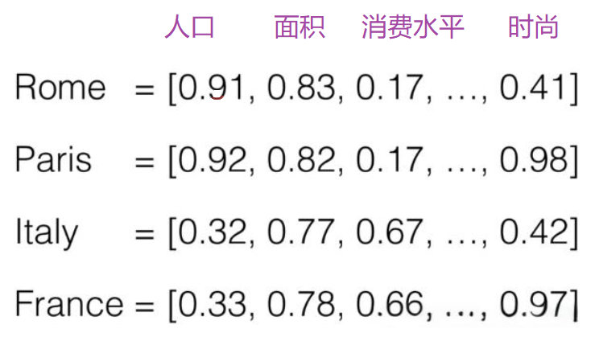

人为添加一个维度标识，只是为了便于大家理解，词向量的训练和生成，不需要在意具体是什么标识，只要看得到一堆数值就行了。

使用Python的word2vec（词向量）库给大家进行一下可视化展示，我的电脑上有很多已经训练好的词向量库（基于大量的中英文语料库进行训练，得到的一个库：

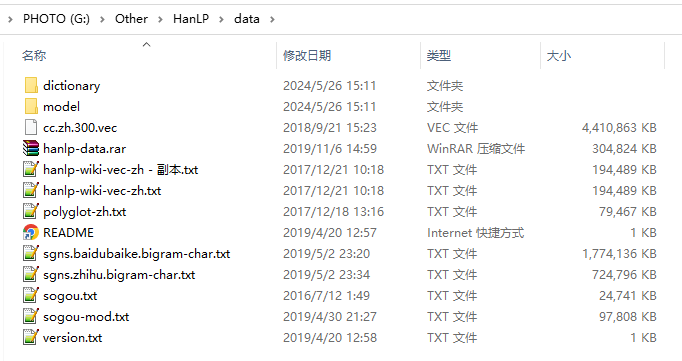

现在我们挑选大小相对较小的hanlp-wiki-vec-zh.txt来打开看看，大概长这样（有大约300个数字，也就意味着是300维空间）：

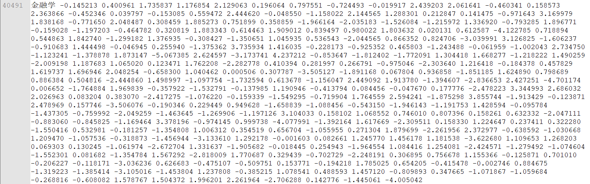

词向量空间在计算机内部是300维空间（没错，就是xyz的三维，对应的三百维），大约长成这个样子：

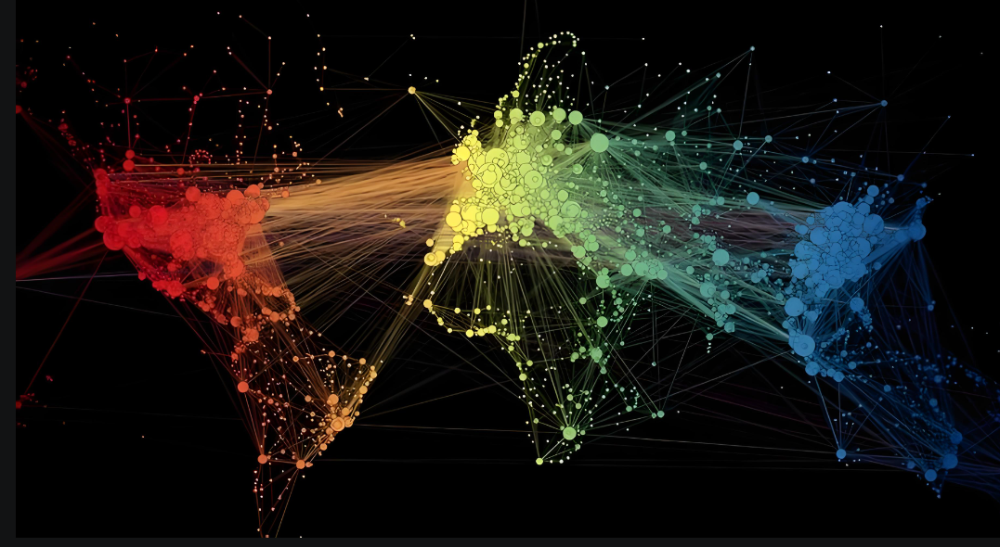

> 图片来源： https://zhuanlan.zhihu.com/p/48167933?utm_source=qq

事实上，人只能看得懂三维空间的数据，上图只可意会，无法真实表达300维空间的样子，大家意会其概念就行。比如我们在二维坐标系中，通过 [x, y] 两个坐标点就可以唯一确定一个点的位置，在三维坐标系中则需要通过 [x, y, z] 三个坐标点就可以唯一确定一个点的位置，以此类推，在300维坐标系统中，则需要 [x1, x2, x3, x4, x5, ……. x300] 一共300个坐标点，是不是就可以确定一个唯一点了？

上图的意思就是 “金融学” 这个词在向量空间中的坐标，先不管是什么，大家是不是能够直观的感受到，中文被转换成了数字。那么我们也可以使用Python来编程实现这个过程：

```python
from gensim.models.keyedvectors import KeyedVectors

# 加载中文词向量文件
word_vectors = KeyedVectors.load_word2vec_format(
    r'G:\Other\HanLP\data\hanlp-wiki-vec-zh.txt', 
    binary=False
)

# 输出词向量
print(word_vectors['金融学'])
```

最终也同样可以获得上述结果。接下来我们可以来尝试一下，找到与”金融学“最相似（距离最近）的一个词：

```python
# 找到5个与金融学距离最近的词
similar = word_vectors.most_similar(positive = ['金融学'], topn = 5)
print(similar)
```

输出结果为：

```
[('会计学', 0.6112884283065796), ('经济学', 0.5791643261909485), ('管理学', 0.522872269153595), ('管理科学', 0.4868156909942627), ('商学', 0.477636456489563)]
```

当然，我们也可以查看”金融学“与”管理学“和与”大象“之间的距离

```python
# 查看 金融学 与 管理学 和与 大象 之间的距离
distance = word_vectors.similarity("金融学", "管理学")
print(distance)
distance = word_vectors.similarity("金融学", "大象")
print(distance)
```

输出结果为：

```
0.522872270.013983104
```

##### （2）训练自已的词向量

目前训练词向量比较主流的方案是：FastText（Facebook开源）和Word2Vec（Google开源），对于中文语料库，则需要先进行分词处理才能开始训练，训练词向量主要使用Skip-Gram和CBOW两种模型，在第三阶段NLP部分将详细介绍。

```python
import jieba
from gensim.models import Word2Vec

# 定义语料
content = [
    "长江是中国第一大河，干流全长6397公里（以沱沱河为源），一般称6300公里。流域总面积一百八十余万平方公里，年平均入海水量约九千六百余亿立方米。以干流长度和入海水量论，长江均居世界第三位。",
    "黄河，中国古代也称河，发源于中华人民共和国青海省巴颜喀拉山脉，流经青海、四川、甘肃、宁夏、内蒙古、陕西、山西、河南、山东9个省区，最后于山东省东营垦利县注入渤海。干流河道全长5464千米，仅次于长江，为中国第二长河。黄河还是世界第五长河。",
    "黄河,是中华民族的母亲河。作为中华文明的发祥地,维系炎黄子孙的血脉.是中华民族民族精神与民族情感的象征。",
    "黄河被称为中华文明的母亲河。公元前2000多年华夏族在黄河领域的中原地区形成、繁衍。",
    "在兰州的“黄河第一桥”内蒙古托克托县河口镇以上的黄河河段为黄河上游。",
    "黄河上游根据河道特性的不同，又可分为河源段、峡谷段和冲积平原三部分。",
    "黄河,是中华民族的母亲河,也是非常重要的交通要塞。"
]

# 结巴分词
seg = [jieba.lcut(sentence) for sentence in content]

# 训练 Word2Vec 模型
model = Word2Vec(
    sentences=seg,     # 分词后的语料
    sg=1,              # 使用 skip-gram 模型（1=skip-gram, 0=CBOW）
    window=5,          # 上下文窗口大小
    min_count=2,       # 最小词频阈值
    negative=1,        # 负采样数量
    sample=0.001,      # 高频词的随机下采样
    hs=1,              # 使用分层 softmax
    workers=4          # 并行线程数
)

# 保存模型
model.save("./wordvec2.bin")

```

上述训练的过程还存在很多需要优化的地方，比如中英文语境中有很多词是无意义的，比如about，an, do, did, etc, 的，嗯，呵，嘛，嘿嘿，在于，尚且等待，此类词称为停用词，在训练之前应将其排除。

词向量训练完成后，也可以按照上述类似的方案来查看词向量的值，代码如下：

```python
from gensim.models import Word2Vec

# 加载模型
model = Word2Vec.load("./word2vec.bin")

# 查看 “黄河” 的词向量
river = model.wv.get_vector('黄河')
print("黄河 的词向量：")
print(river)

# 判断 “黄河” 与 “母亲河” 的相似度
sim = model.wv.similarity("黄河", "母亲河")
print("\n‘黄河’ 与 ‘母亲河’ 的相似度：", sim)

# 预测最接近的词
most_similar = model.wv.most_similar(
    positive=["黄河", "母亲河"], 
    negative=["长江"]
)
print("\n与 ‘黄河’ 和 ‘母亲河’ 最相似、但排除 ‘长江’ 后的词：")
for word, score in most_similar:
    print(f"{word}: {score:.4f}")
```

#### 3、计算机视觉

计算机视觉是一种⽤摄像机和电脑及其他相关设备，对⽣物视觉的模拟。它的主要任务让计算机理解图⽚或者视频中的内容，就像⼈类和许多其他⽣物每天所做的那样。可将其分为三⼤经典任务：图像分类、⽬标检测、图像分割

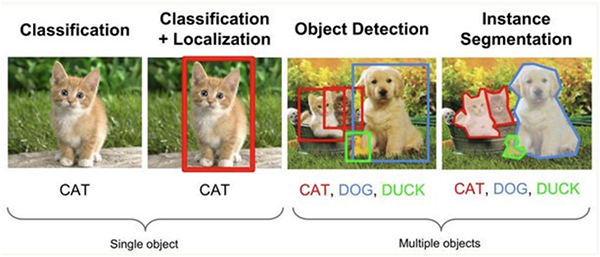

- 图像分类（Classification）：是指将图像结构化为某⼀类别的信息，⽤事先确定好的类别(category)来描述图⽚。
- ⽬标检测（Detection）：分类任务关⼼整体，给出的是整张图⽚的内容描述，⽽检测则关注特定的物体⽬标，要求同时获得这⼀⽬标的类别信息和位置信息（classification + localization）。
- 图像分割（Segmentation）：分割是对图像的像素级描述，它赋予每个像素类别（实例）意义，适⽤于理解要求较⾼的场景，如⽆⼈驾驶中对道路和⾮道路的分割。

当然，随着大模型的兴起，图像描述和图像生成也可以作为计算机视觉的一个新的领域和分支来考虑。

那么针对一张图片，计算机内部又是如何将其变成数字的呢？我们可以使用OpenCV打开一张图片，就可以看到RGB的色彩像素值了：


```python
import cv2

# 读取图片
image = cv2.imread("./woniu_run.jpg")

# 每个像素点的 RGB 值（红、绿、蓝），范围是 0~255，0 代表黑色，255 代表白色
print(image)

# 打印某一个具体的像素点的值
# 这里 image[0][9] 表示第 (1, 10) 个像素点（行索引 0，列索引 9）
print(image[0][9])
```

输出的结果类似于：

```
[[[107 122 141]  [108 123 142]  [118 133 152]  ...  [198 196 196]  [206 204 204]  [221 219 219]]][114 128 147]     # 该像素点的颜色为 (114, 128 ,147)，代表红色为147, 绿色为128，蓝色为114 (默认为BGR格式打开)
```

当然，我们也可以将图片转换为RGB打开，使用以下代码即可转换完成（但是这个过程不影响AI的运算），所以不是重点

```python
# 将颜色值转换为RGB
image_rgb = cv2.cvtColor(image, cv2.COLOR_BGR2RGB)
print(image_rgb[0][9])
```

重点是，为了减少运算，因为计算机识别图像不需要靠丰富的颜色，而是轮廓和距离等信息，所以通常将彩色图片转换为灰度图（单通道颜色）或进行二值化处理（颜色只有黑和白，即：只有0和255两种颜色），这样可以减少大量的运算量，使用以下代码可以处理灰度化和二值化：

（1）灰度化（颜色不区分RGB，而是在0-255之间取一个值），灰度化使用以下公式完成：

Gray=0.299×*R*+0.587×*G*+0.114×*B

```python
import cv2

# 读取图片
image = cv2.imread("./woniu_run.jpg")

# 将彩色图像转换为灰度图（RGB → 灰度）
image_gray = cv2.cvtColor(image, cv2.COLOR_RGB2GRAY)

# 打印某个像素点的灰度值
# 灰度值范围是 0~255，数值越大表示越亮
print(image_gray[0][9])  # 示例：输出 126

# 显示灰度图
cv2.imshow("Gray", image_gray)
cv2.waitKey(0)
cv2.destroyAllWindows()
```


（2）二值化处理

灰度图就是传统意义上的黑白照片，但是这样的运算量还是过多，因为像素值完全分布在0-255之间，特征并不明显，所以通常在进行计算机识别时，还会进一步，转换为纯粹的黑和白两种颜色：

```python
import cv2
image = cv2.imread("./woniu_run.jpg")
# 要二值化，先灰度化，将三通道变成单通道
image_gray = cv2.cvtColor(image, cv2.COLOR_RGB2GRAY)
# 二值化时设定阈值为128，即小于128的变成0，黑色，大于128的变成255，白色
retval, image_thr = cv2.threshold(image_gray, 128, 255, cv2.THRESH_BINARY)
print(image_thr[0])   # 查看某一排像素的颜色值
# 显示灰度图
cv2.imshow("Gray", image_thr)
cv2.waitKey(0)
```

二值后，一个像素点的颜色，不仅从RGB的三种变成了一种，同时每一个颜色的聚会只有0和255两种，没有中间灰度，这样在计算距离或相似度时，反差就更加强烈，更便于体现差别：

```
[  0   0 255 255 255   0   0   0   0   0 255 255 255   0 255 255 255 255   0   0 255   0 255 255 255 255   0   0   0 255 255 255 255 255   0   0 255 255 255 255 255   0   0   0   0   0   0   0   0 255 255 255 255 255 255 255 255 255 255 255 255 255   0   0   0   0   0   0   0   0 255 255 255   0 255 255 255 255 255 255 255 255 255 255 255 255 255 255 255 255 ]
```


机器学习的六个核心算法：https://mp.weixin.qq.com/s/o_PPJESRFLfIxHz3UsSfpw


# 数据归一化处理

### 一、Softmax归一化

Softmax是一种数学函数，通常用于将一组任意实数转换为表示概率分布的实数。其本质上是一种归一化函数，可以将一组任意的实数值转化为在[0, 1]之间的概率值，因为softmax将它们转换为0到1之间的值，所以它们可以被解释为概率。如果其中一个输入很小或为负，softmax将其变为小概率，如果输入很大，则将其变为大概率，但它将始终保持在0到1之间。

Softmax是逻辑回归的一种推广，可以用于多分类任务，其公式与逻辑回归的sigmoid函数非常相似。只有当分类是互斥的，才可以在分类器中使用softmax函数，也就是说只能是多元分类（即数据只有一个标签），而不能是多标签分类（即一条数据可能有多个标签）。

许多多层神经网络输出层的最后一层是一个全连接层，输出是一个实数向量，这个向量通常代表了每个类别的得分或置信度。为了将这些得分转换为概率分布，通常会使用softmax函数。因为它将分数转换为规范化的概率分布，可以显示给用户或用作其他系统的输入。所以通常附加一个softmax函数在神经网络的最后一层之后。

softmax函数的输入是一个包含K个元素的向量，其中不带箭头的z表示向量的一个元素:

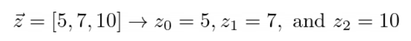

Softmax的分子将指数函数应用于向量的每个元素，对于最高的输入值返回最高的输出值。因为它的范围是(0，∞)，所以任何负数也变成正数。就是说，e的任意次方，必然是0或者一个正数。这样就可以很好的解决归一化后取值为0-1之间。

> 自然对数e的值为2.71828，也可以引用python中的math.e，输出为更精确的值：2.718281828459045

Softmax分母中的求和是通过确保函数的和为1来标准化每个元素，创建一个概率分布。所有的指数元素加在一起，所以当每个指数元素除以这个和时，它将是它的一个百分比。[5,7,10]的指数元素之和如下:

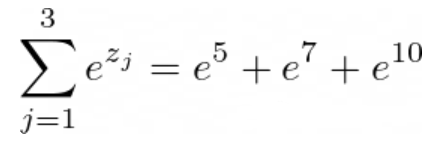

比如要计算第2个向量7的归一化结果，则运算过程如下：
$$
\sigma([5,7,10])_2 = \frac{e^7}{e^5 + e^7 + e^{10}} = 0.047
$$
当然，公式也可以由以下方式来表达，本质是一样的：

给定一个n维向量，softmax函数将其映射为一个概率分布。标准的softmax函数由下面的公式定义[1]：

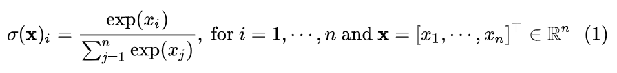

直观上看，标准softmax函数用一个自然底数 e 先拉大了输入值之间的差异，然后使用一个配分将其归一化为一个概率分布。在分类问题中，我们希望模型分配给正确的类别的概率接近1，其他的概率接近0，如果使用线性的归一化方法，很难达到这种效果，而softmax有一个先拉开差异再归一化的“两步走”战略，因此在分类问题中优势显著。

事实上，在势能函数和配分函数中，可以采用的底数不仅仅是自然底数 e ，也可以采用一些其他的底数。原则上，任意 >0 的数都可以作为这里的底数，越大的底数越能起到“拉开差异”的作用。


### 二、使用Python原生实现

任意假定一个向量（在Python中可以使用列表或元组来表示），比如 list = [5, 7, 10, 9, 8, 2, 12, 15, 6]，现通过Softmax函数分别计算每一个向量的概率分布，代码如下：

```python
import math

def softmax(list):
    # 先求分母的总和，输出为：3466538.535767658
    sum = 0
    for m in list:
        sum += math.pow(math.e, m)
        # sum += math.exp(m)   # 或直接调用 math.exp 完成运算

    # 再遍历每一个元素，求出其概率，并添加到新的列表中
    result = []
    for n in list:
        z = math.pow(math.e, n) / sum
        # result.append("{:.8f}".format(z))  # 保留8位小数，该操作会将其转换为字符串
        # result.append(format(z, ".8f"))
        result.append(round(z, 8))           # 会出现科学计数法表示，不影响使用

    return result

if __name__ == '__main__':
    list = [5, 7, 10, 9, 8, 2, 12, 15, 6]
    list = softmax(list)
    print(list)

```

以上代码的输出结果为：

```
[4.281e-05, 0.00031635, 0.00635402, 0.00233751, 0.00085992, 2.13e-06, 0.04695023, 0.94302064, 0.00011638]
```

> 以上代码涉及两次针对list列表的遍历和运算，所以可以使用列表推导式进行代码简化。

### 三、使用numpy库来实现

#### 1、最简化版本

```python
def softmax_3(list):
    numpy.set_printoptions(suppress=True)
    matrix = numpy.array(list, dtype=float)

    sum = 0
    for n in matrix:
        sum += math.exp(n)
    print(sum)

    for i in range(matrix.size):
        # 直接修改 matrix 元素的值为概率值，覆盖了 matrix 原本的值，节省内存空间
        matrix[i] = math.exp(matrix[i]) / sum

    return matrix
```

#### 2、只为利用一下numpy的特征

```python
import numpy
import math

def softmax_2(list):
    # 禁止使用科学计数法来表示数字，看起来比较不方便
    numpy.set_printoptions(suppress=True)

    # 构建为二维数组 [[5, 7, 10, 9, 8, 2, 12, 15, 6]]
    matrix = numpy.array([list])
    
    m, n = numpy.shape(matrix)  # m表示第一维的个数，n为9，表示第二维的个数

    # numpy.zeros，生成一个均为0的二维矩阵，里面有第一维是m个，第二维是n个， [[0. 0. 0. 0. 0. 0. 0. 0. 0.]]
    zeros = numpy.zeros((m, n), dtype=float)
    print(zeros)

    # numpy.mat 将其转换为 matrix 矩阵类型，便于后续运算
    out_matrix = numpy.mat(zeros)

    sum = 0
    for i in range(0, n):
        out_matrix[0, i] = math.exp(matrix[0, i])
        sum += out_matrix[0, i]

    for j in range(0, n):
        out_matrix[0, j] = out_matrix[0, j] / sum

    return out_matrix

```

输出结果为：

```
[[0.00004281 0.00031635 0.00635402 0.00233751 0.00085992 0.00000213  0.04695023 0.94302064 0.00011638]]
```

### 四、其他数据标准化

#### 1、Min-Max标准化

这种方法将数据线性地映射到[0,1]的范围内。
$$
x' = \frac{x - \min(A)}{\max(A) - \min(A)}
$$

#### 2、平均值标准化

这种方法将数据线性地映射到[-1,1]的范围内。
$$
x' = \frac{x - \text{mean}(A)}{\max(A) - \min(A)}
$$

#### 3、Z-Score标准化

这种方法将数据转化为标准正态分布，均值为0，标准差为1。
$$
z = \frac{x - \text{mean}}{\text{std}}
$$
其中 x 是原始数据，mean 是原始数据的均值，std 是原始数据的标准差。

#### 4、均值方差标准化

这种方法将数据转化为均值为0，方差为1的分布
$$
z = \frac{x - \text{mean}}{\sqrt{\text{var}}}
$$
其中 x 是原始数据，mean 是原始数据的均值，var 是原始数据的方差。

#### 5、Sigmoid标准化

这种方法将数据通过 Sigmoid 函数映射到[0,1]范围内
$$
g(z) = \frac{1}{1 + e^{-z}}
$$
请使用Python或Numpy将以上公式用代码实现，并观察其规律。

#### 五、在SKLearn中实现标准化

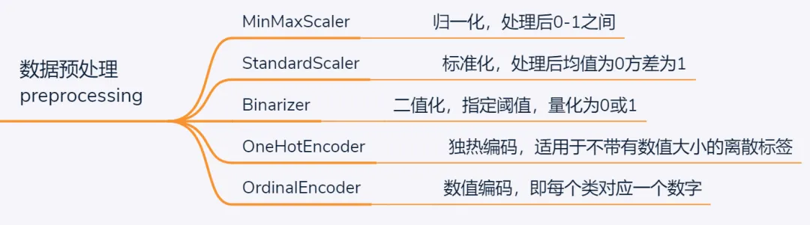

- MinMaxScaler：归一化去量纲处理，适用于数据有明显的上下限，不会存在严重的异常值，例如考试得分0-100之间的数据可首选归一化处理
- StandardScaler：标准化去量纲处理，适用于可能存在极大或极小的异常值，此时用MinMaxScaler时，可能因单个异常点而将其他数值变换的过于集中，而用标准正态分布去量纲则可有效避免这一问题
- Binarizer：二值化处理，适用于将连续变量离散化
- OneHotEncoder：独热编码，一种经典的编码方式，适用于离散标签间不存在明确的大小相对关系时。例如对于民族特征进行编码时，若将其编码为0-55的数值，则对于以距离作为度量的模型则意味着民族之间存在”大小”和”远近”关系，而用独热编码则将每个民族转换为一个由1个”1”和55个”0”组成的向量。弊端就是当分类标签过多时，容易带来维度灾难，而特征又过于稀疏
- Ordinary：数值编码，适用于某些标签编码为数值后不影响模型理解和训练时。例如，当民族为待分类标签时，则可将其简单编码为0-55之间的数字

```python
from sklearn.preprocessing import MinMaxScaler
import numpy

nd1 = numpy.array([1, 2, 3, 4, 5, 6])
nd2 = nd1.reshape(-1, 1)

mm = MinMaxScaler()
list3 = mm.fit_transform(nd2)

print(list3)
```


# 数学与空间思维

#### 一、数组与几何维度

##### 1、数组维度

在计算机中，我们可以定义一维数组，二维数组，三维数组，N维数组，比如可以使用Python定义如下数组：

```python
# 定义一维数组，即 Python 的列表，为 6 个元素
array_1d = [1, 2, 3, 4, 5, 6]

# 定义二维数组，一共 3 行 5 列，共 15 个元素
array_2d = [
    [11, 12, 13, 14, 15],
    [21, 22, 23, 24, 25],
    [31, 32, 33, 34, 35]
]

# 定义三维数组，一共 4 个 3 行 5 列，共 60 个元素
array_3d = [
    [
        [111, 112, 113, 114, 114],
        [121, 122, 123, 124, 125],
        [131, 132, 133, 134, 135]
    ],
    [
        [211, 212, 213, 214, 214],
        [221, 222, 223, 224, 225],
        [231, 232, 233, 234, 235]
    ],
    [
        [311, 312, 313, 314, 314],
        [321, 322, 323, 324, 325],
        [331, 332, 333, 334, 335]
    ],
    [
        [411, 412, 413, 414, 414],
        [421, 422, 423, 424, 425],
        [431, 432, 433, 434, 435]
    ]
]

# 通常情况下，三维数组最好由二维数组来定义比较直观
```

也就是说，数组的维度，主要取决于有几个列表层级，与层级中的元素个数无关，比如虽然是4个3行5列共60个元素，但是还是三维。

##### 2、几何维度

考察几何维度，我们需要至少三个坐标系来绘制以下坐标点：

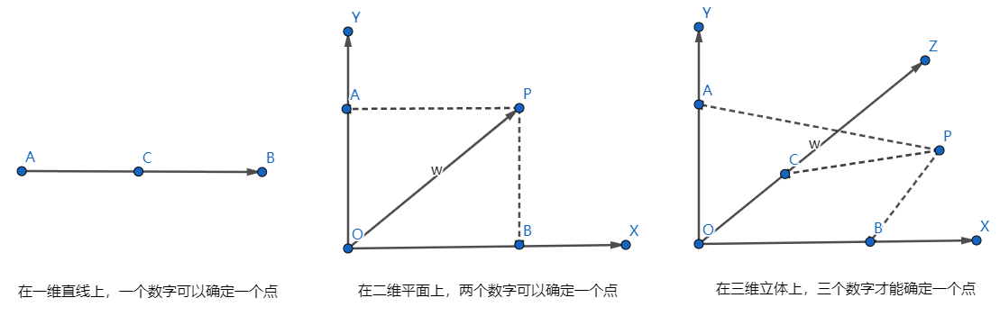

推而广之，在N维平面上，那么就需要N个坐标点才能唯一确定一个点。但是无论维度是多少，在Python中，均可以使用一维数组来表示，比如在一维线条上，一个标量数字就可以确定一个点，在二维平面上，则可以使用 [x, y] 来表示，在三维立体上，则使用 [x, y , z] 来表示该点的坐标，那么在 N维空间中，则通过 [x1, x2, x3, … xN] 就可以表达某个点。

从坐标原点绘制一点线到某个点，则该线条称为向量（N维空间则叫N维向量），如下图所示：

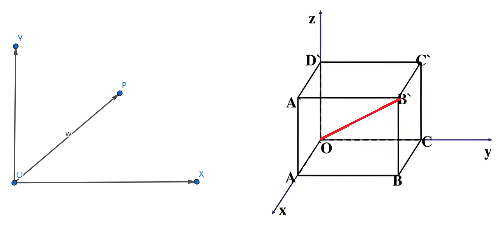

#### 二、向量与距离计算

##### 1、向量值计算

我们都清楚在二维坐标系中，一个坐标点的向量计算遵循勾股定理，也就是说，任意给定一个坐标点（x, y)，计算该向量值为：

那么，在三维坐标系统中，任意一个坐标点的坐标必然为：(x ,y , z)，那么该坐标点的向量值为：
$$
\left|\vec{x, y, z}\right| = \sqrt{x^2 + y^2 + z^2}
$$
三维中的点，可以用以下方式来直观表达：

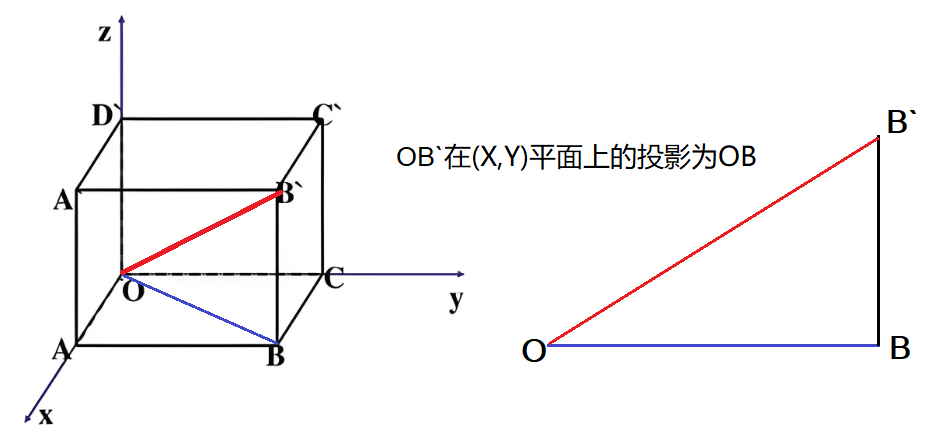

向量：OB’ 的值的计算，可以看成是 OB’ 与 (X，Y) 这个平面上的投影 OB ，而OB为 $\large |\overrightarrow{x,y}| = \sqrt{x^2+y^2}$， 则OB’的值为：
$$
OB' = \sqrt{OB^2 + BB'^2} = \sqrt{\left(\sqrt{x^2 + y^2}\right)^2 + z^2} = \sqrt{x^2 + y^2 + z^2}
$$
推而广之，任意维度的几何向量的值，均为：
$$
\vec{P} = \sqrt{x_1^2 + x_2^2 + x_3^2 + \dots + x_n^2}
$$

##### 2、向量距离计算

现在假设坐标系上有两个点：A(x1, y1)，和B(x2, y2)，那么这两个点的距离是如何计算的呢？公式为：
$$
\text{Distance}(A, B) = \sqrt{(x_1 - x_2)^2 + (y_1 - y_2)^2}
$$
比如有点：A=(3, 4)，B=(2,6)，则A和B的距离为：$\large \sqrt{1+4} = \sqrt{5}$，这个坐标可以画出以下图案，看看是否正确：

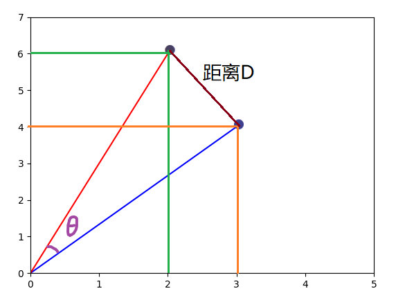

同样的，在三维坐标系统中，两个点之间的距离计算公式为：
$$
\text{Distance}(A, B, C) = \sqrt{(x_1 - x_2)^2 + (y_1 - y_2)^2 + (z_1 - z_2)^2}
$$
在N维坐标系统中，两个点之间的距离计算公式为：
$$
\text{Distance}(A, B, C, \dots, N) = \sqrt{(x_1 - x_2)^2 + (y_1 - y_2)^2 + \dots + (n_1 - n_2)^2}
$$

##### 3、向量和运算

在二维坐标平面中，直角坐标系遵循勾股定理，也就是说针对某一个点，比如（3, 4)，其向量长度为5。

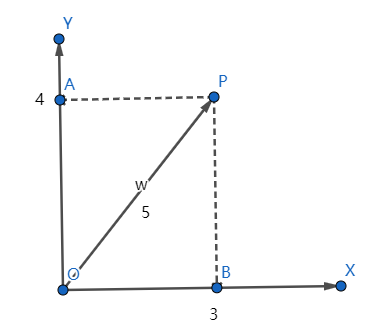

既然向量是存在几何意义的，那么向量和与向量积也同样存在几何意义。比如两个点的向量和，可以这样进行运算，并展示在二维平面上，假设平面上有两个点：a = (ax, ay) ，b = (bx, by) ，则 a + b = (ax + bx, ay + by)，也就意味着，平面上的两个点求和，其实计算的是其向量和，并且向量和为一个新的点：

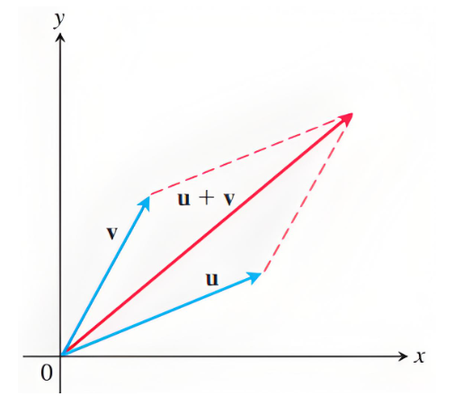

我们可以假设两个点的坐标为：a=(3, 5)，向量为v，b=(7,2)，向量为u，则a+b=(10, 7)，根据勾股定理可以计算出：
$$
a + b = \sqrt{100 + 49} = 12.2
$$
当然，我们也可以分别计算向量v和u的长度，进而得到 u+v 的值：
$$
u + v = \sqrt{9 + 25} + \sqrt{49 + 4} = \sqrt{34} + \sqrt{53} = 5.83 + 7.28 = 13.11
$$
上述结果说明，向量之和并非单纯的两个向量的数值相加，那还有什么？从上图中可以看出，向量之和虚拟出来了一个平行四边形，什么情况下，u+v=a+b呢？当u和v两个向量的夹角为0时的极限值时，两者相等。所以这里提出了一个夹角的概念。

##### 2、向量积

我们再来看看向量的点积运算，在二维平面上，存在a和b两个向量，a=(ax, ay)，b=(bx, by)，那么$\large a*b = ax*bx+ay*by=n$，也就是说向量之积为一个标量，两条向量之间的夹角为 $\theta$，这又有什么意义呢？

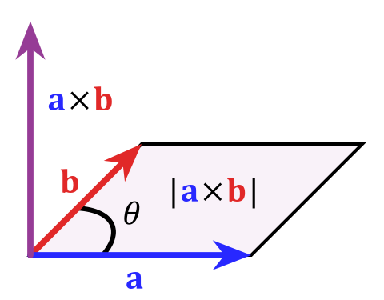

我们现在假设有两个点为：A=[3,4]，B=[2,6]，则ubun=30，并可计算出 A向量的线条为5，B向量的线条为$\sqrt{40}$。我们来进行一下验证。可以使用Matplotlib将这两个点绘制出来：

```python
fig, ax = plt.subplots()
# 绘制原点到指定点的线条
ax.plot([0, 3], [0, 4], color='blue')
ax.plot([0, 2], [0, 6], color='red')
# 设置坐标轴的范围
ax.set_xlim(0, 5)
ax.set_ylim(0, 7)
plt.show()
```

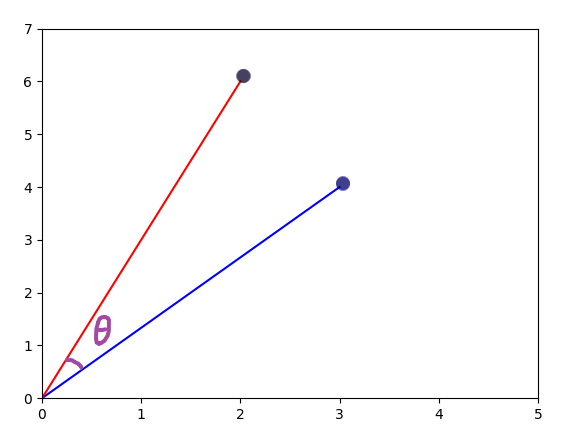

先说结论：向量 a x b 即可以由两个点的坐标相乘再相加计算出来，即 $\large a*b = ax*bx+ay*by$，同时还可以由 $\large |\overrightarrow{a}|* |\overrightarrow{b}| * cos\theta$ 计算得出，这就使夹角的余弦值有了意义，什么意义呢？继续往下来验证：

仍然以 A=[3,4]，B=[2,6] 两个点为原型，通过坐标点相加再相乘的方式，可以计算出 A * B = 30，那么现在来计算一下，为什么还可以由向量a和b以及夹角的余弦值求出：

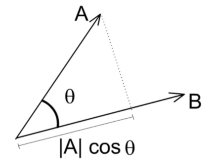

上图中，向量A在向量B上的映射，可以理解为 $\large |\overrightarrow{a}| *cos\theta$ ，根据直角坐标系统的三角函数的定义：$Cos\theta$ = 邻边 / 斜边 ，我们开始计算为什么：$\large a*b = |\overrightarrow{a}| *|\overrightarrow{b}|* cos\theta$，对于坐标A来说，其向量值为：5，坐标B的向量值为：$\sqrt{40}$，那么有：

$a \cdot b = 5 \cdot \sqrt{40} \cdot \cos\theta = 30$，可以计算出：$\cos\theta = \frac{6}{\sqrt{40}} = \frac{6}{6.325} = 0.9486$

也就是说，向量A和向量B的夹角的余弦值为：0.9486，而0度的余弦值为最大值1，所以0.9486可以看做是一个空间向量上的两个点之间的夹角的余弦值，设想一下极限情况下，如果为1，则说明两个向量没有夹角，是否意味着两个向量是完全一致的呢？所以在向量空间中，评估两个向量是否相似，也可以使用余弦相似度来进行评估。

补充一下三角函数知识：

| 基本函数 | 英文        | 缩写  | 表达式 | 语言描述            |
| :------- | :---------- | :---- | :----- | :------------------ |
| 正弦函数 | *sine*      | *sin* | *a/c*  | *∠\*A**的对边比斜边 |
| 余弦函数 | *cosine*    | *cos* | *b/c*  | *∠\*A**的邻边比斜边 |
| 正切函数 | *tangent*   | *tan* | *a/b*  | *∠\*A**的对边比邻边 |
| 余切函数 | *cotangent* | *cot* | *b/a*  | *∠\*A**的邻边比对边 |
| 正割函数 | *secant*    | *sec* | *c/b*  | *∠\*A**的斜边比邻边 |
| 余割函数 | *cosecant*  | *csc* | *c/a*  | *∠\*A**的斜边比对边 |

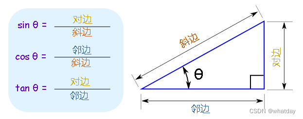

#### 三、导数与梯度下降

##### 1、什么是导数

导数的几何意义是切线的斜率。在平面坐标系中，函数图像上某一点的切线斜率等于该点的导数值。因此，通过求导可以确定曲线在某一点的切线斜率，进一步分析曲线的形状和变化趋势。

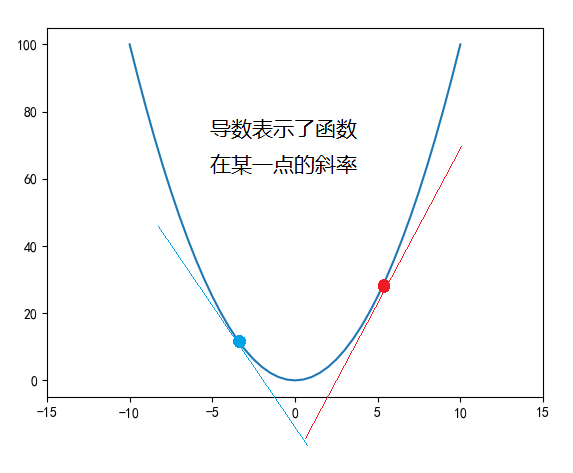

某个点的导数计算公式可以写为：$\large P’ = \frac{\Delta{y}}{\Delta{x}}$ 也可以写作为：$\large P’ = \frac{dy}{dx}$，即计算切线的斜率。但是由于在一条曲线上，导数都是在动态变化的，所以通常导数也使用一个函数来表示。比如 y’ = 2x + 1 之类的。

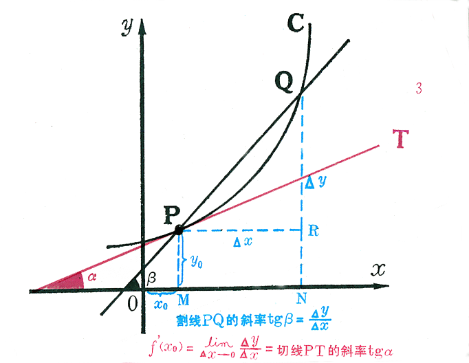

导数还有以下作用：

（1） 判断单调性：通过求函数的导数，可以判断函数的单调性。如果函数在某个区间内的导数大于零，则函数在该区间内单调递增；如果导数小于零，则函数单调递减。

（2）判断极值和拐点：导数为零的点可能是函数的极值点或拐点。在极值点处，函数值从递增变为递减或从递减变为递增，因此极值点是函数值变化趋势的转折点。通过求导并令导数为零，我们可以找到可能的极值点或拐点，进一步分析这些点的性质。

（3）优化问题：在实际问题中，我们经常遇到需要找到函数的最值问题，如成本最低、利润最大等。通过求导找到函数的极值点，结合实际情况进行分析，可以找到最优解。

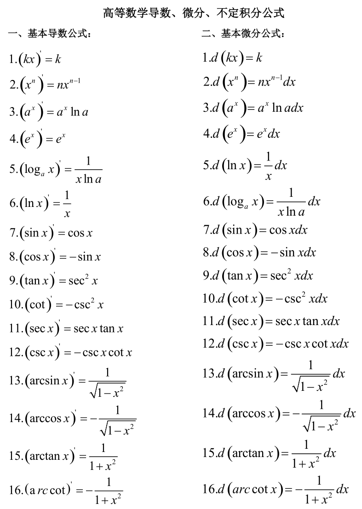

##### 2、梯度下降

梯度下降可以说是机器学习的精髓，各种机器学习所产生的奇迹，都必须建立在梯度下降的机制之下才有了让人感觉智能的结果。

比如针对方程：f(x) = x^2 + 2x + 3，根据上述导数计算规则，其导函数 f(x)’ = 2x+2，基于导函数可以获取x取值时导函数y的取值。比如x为0时，y’=2，此时原函数单调递增，x=-1时，y’=0，此时原函数获得最小值2，x=-3时，y’=-4，此时，原函数单调递减。

梯度下降就是根据导函数来计算，如果导函数的值为正，则说明成上升趋势，这样就不可能找到最小值，如果导函数为负数，则说明成下降趋势，就有可能找到最小值。

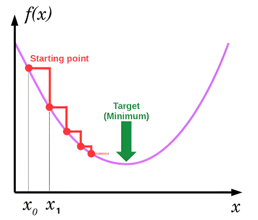

那么每次调整的幅度就不能过大，过大的话就可能刚好跳过了最小值，也不能过小，否则运算量就会变大。在AI领域，我们将这个幅度称为学习速率。具体的调整需要根据具体情况来测试，没有标准答案。

> 画图工具：Windows自带画图，Matplotlib画图，在线画图：https://www.geogebra.org/graphing


