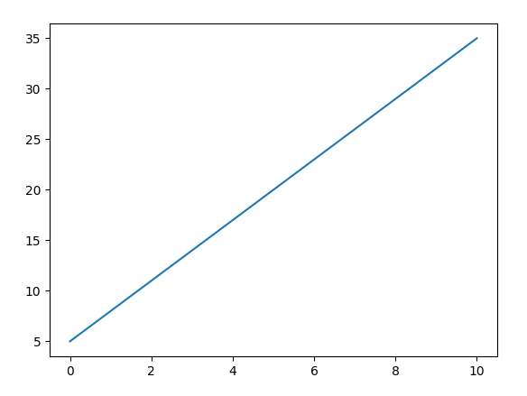
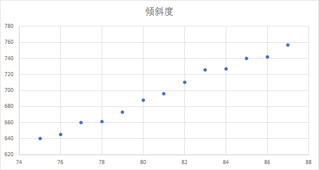
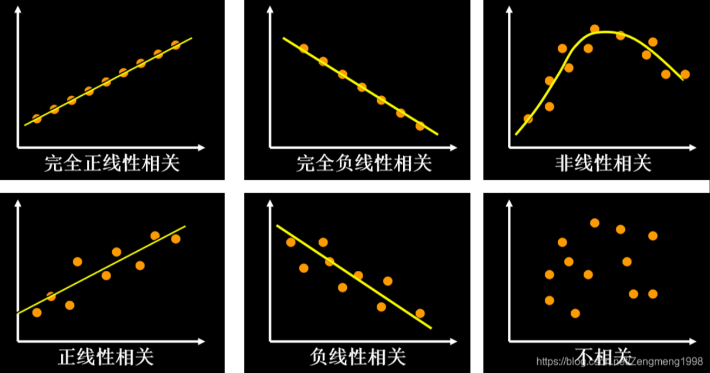
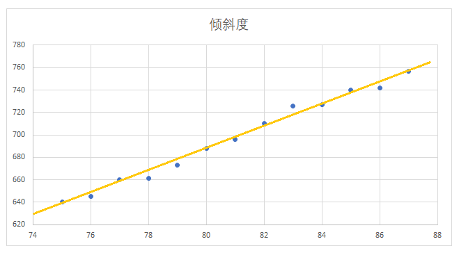
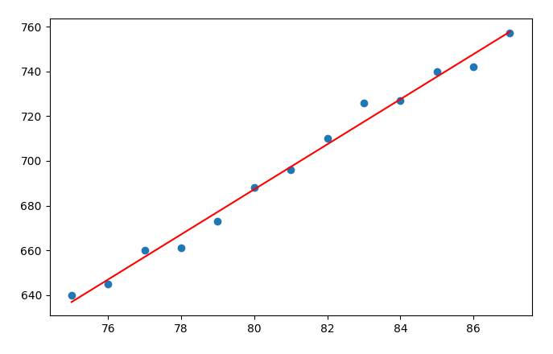

# 一元线性回归原理

#### 一、线性回归

线性回归的核心目的，就是利用现有的历史数据，来拟合出一条直线，使这条直线为最优解（损失最小，或者离每一个历史数据的距离最近），分为一元线性回归和多元线性回归。在现实生活中，往往一个结果的预测是取决于多个因素，比如小孩的身高，取决于多个因素，如遗传、民族、睡眠、营养、锻炼等，那么些时，身高的预测值（y’)就需要受这5个因素的影响（x1, x2, x3, x4, x4），称为多元线性回归，但是如果要从这些因素中，找到一个主要因素，也可以化简为一元线性回归的问题来进行求解。

一元线性回归是分析只有一个自变量（自变量x和因变量y）线性相关关系的方法。一个经济指标的数值往往受许多因素影响，若其中只有一个因素是主要的，起决定性作用，则可用一元线性回归进行预测分析。比如根据店铺的历史广告投入来预测销售额，根据历年房价数据来预测未来房价，当然，一元线性回归是计算机领域最为简单的预测模型，也是最重要的基础。一元线性回归的公式为：
$$
y = ax + b
$$
在机器学习邻域通常表示为 y = wx + b ， w 代表权重 weight（也称为斜率），b 代表偏置 bias（即在Y轴上的截距）。比如 y = 3x + 5 ，可以在坐标系中绘制以下直线：



而根据 y = 3x + 5 这一公式，就可以预测下一个 X 时对应的 Y 的值。所以，一元线性回归的核心目的，就是求解 w 和 b 的值，求出这个值，那么根据方程式就可以进行预测了。预测，是数据分析和机器学习中很重要的目的。

#### 二、一元线性回归求解

##### 1、问题的提出

让我们基于以下一个简单的历史数据：比萨斜塔的倾斜度历史数据，来预测未来的倾斜度：

| 年份       | 75   | 76   | 77   | 78   | 79   | 80   | 81   | 82   | 83   | 84   | 85   | 86   | 87   |
| :--------- | :--- | :--- | :--- | :--- | :--- | :--- | :--- | :--- | :--- | :--- | :--- | :--- | :--- |
| **倾斜度** | 640  | 645  | 660  | 661  | 673  | 688  | 696  | 710  | 726  | 727  | 740  | 742  | 757  |

在Excel 中，可以快速绘制一个散点图，观察其基本规律：



从上图中可以看出，倾斜度的变化趋势比较接近于一条直线，但是并非直线，所以此时，如果要预测88年的倾斜度，便可以使用一元线性回归进行处理。

##### 2、方差与标准差

对于一组数据来说，方差（variance）是将各个变量值与其均值离差平方的平均数。它反映了样本中各个观测值到其均值的平均离散程度；标准差（standard deviation）是方差的平方根。
$$
\text{stddev} = \sqrt{ \frac{1}{n} \sum_{i=1}^{n} (x_i - \bar{x})^2 }
$$
基于此公式计算一下比萨倾斜度的方差与标准差：先求得倾斜度的整体平均值为：697.31，则方差为：

则标准差为：$std=\sqrt{1435.29}=37.885$

标准差越小，说明各个数据的差异越小（比如极端情况，所有数据全部相同，则方差和标准差为 0），标准差越大，则说明数据差异越大。那么如何评估 37.885 在这个数据样本中的差异大小呢，可以 让 37.885 / 697.31 = 5.4%，算是相对比较小的差异。

使用Python代码计算标准差：

```python
import numpy as np

x = np.array([640, 645, 660, 661, 673, 688, 696, 710, 726, 727, 740, 742, 757])
# y = np.array([75,76,77,78,79,80,81,82,83,84,85,86,87])

print(np.var(x))    # 方差
print(np.std(x))    # 标准差
```

输出结果为：

```
1435.2899408284025
37.885220612112086
```

##### 3、相关系数

相关系数 r 显示了一个线性关系的强度和方向（正或负）。当两个变量之间存在正向相关时，r为正。当变量之间的关系为负相关时，r也为负数。如果数据点正好描述了一条直线，r等于1或-1。当完全没有相关关系时，r将等于零。如果某组数据点的相关系数相当低（0.5>r>-0.5），那么线性回归可能不会给我们带来非常可信的结果。只有当r高于0.5或低于-0.5时才值得做线性回归。



> 图片来源：https://blog.csdn.net/Zengmeng1998/article/details/109568202

相关系统 r 的计算公式为：
$$
\huge
r = \frac{ \sum_{i=1}^{n} (x_i - \bar{x})(y_i - \bar{y}) }
         { \sqrt{ \sum_{i=1}^{n} (x_i - \bar{x})^2 \sum_{i=1}^{n} (y_i - \bar{y})^2 } }
$$
x 方向为年份，所以 x 的平均值为：(75+76+77+78+79+80+81+82+….+87) = 81

y 方向为倾斜度，所以 y 的平均值为：697.31，代入公式计算如下：
$$
\large
r = \frac{(75 - 81)(640 - 697.31) + (76 - 81)(645 - 697.31) + \cdots}
         {\sqrt{ \big((75 - 81)^2 + (76 - 81)^2 + \cdots \big)
                 \big((640 - 697.31)^2 + (645 - 697.31)^2 + \cdots \big) }}
= \frac{1833}{\sqrt{182 \times 18658.77}}
= \frac{1833}{1842.8}
= 0.99468
$$
由此看出，X与Y的线性相关系数为：99.5%，是非常高的相关性，完全可以使用线性回归来进行模型拟合。

也可以在Python中使用Numpy进行计算：

```python
import numpy as np

x = np.array([75, 76, 77, 78, 79, 80, 81, 82, 83, 84, 85, 86, 87])    # x是年份，如果换成序号：1,2,3,4,5.... 结果是否会有变化？
y = np.array([640, 645, 660, 661, 673, 688, 696, 710, 726, 727, 740, 742, 757])

print(np.corrcoef(x, y)[0, 1])
```

##### 4、最小二乘法

截止目前，只是让大家了解了关于一元线性回归方程的一些计算方式和关联分析，还未真正求解到 y = ax + b 方程中 w 和 b 的值。我们希望找到一个数字 w 和 b，使得绘制出的一条直线与倾斜度的点的距离越短越好。即满足以下公式：$d_i = \sum{(y_i-\hat{y_i})^2}$ 求得的距离值为最小，这就是：最小二乘法，（与求方差类似，但是方差是与平均值的距离，此处为预测的 y 与真值 y 的距离），类似但不一样。



最小二乘法的计算公式为（S代表标准差）：
$$
\huge
a = r \cdot \frac{s_y}{s_x}
$$

$$
\huge
b = \bar{y} - a \bar{x}
$$

代入公式计算可得：$a=0.995*\frac{37.885}{3.742}=10.07$，$b=697.31-10.07*81=-118.36$

最后得到拟合后的方程为：y = 10.07x - 118.36，基于此，代入 x 的值为 88，来预测 88年的倾斜度：

```
y = 10.07 * 88 - 118.36 = 767.8   (预测值)
```

可以使用MatplotLib将两条线绘制在一个坐标轴上进行可视化评估：

```python
import numpy as np
import matplotlib.pyplot as plt

x = np.array([75, 76, 77, 78, 79, 80, 81, 82, 83, 84, 85, 86, 87])
y = np.array([640, 645, 660, 661, 673, 688, 696, 710, 726, 727, 740, 742, 757])

plt.scatter(x, y)
plt.plot(x, 10.07 * x - 118.36, color='r')
plt.show()
```



#### 三、使用SKlearn求解

```python
import numpy as np
from sklearn.linear_model import LinearRegression
from sklearn.model_selection import train_test_split

x = np.array([75, 76, 77, 78, 79, 80, 81, 82, 83, 84, 85, 86, 87]).reshape(-1, 1)
y = np.array([640, 645, 660, 661, 673, 688, 696, 710, 726, 727, 740, 742, 757]).reshape(-1, 1)

x_train, x_test, y_train, y_test = train_test_split(x, y, test_size=0.001, random_state=0)

regressor = LinearRegression()
regressor.fit(x_train, y_train)

print('斜率:', regressor.coef_[0])
print('截距:', regressor.intercept_)
print("预测88年：", regressor.predict(np.array([88]).reshape(-1, 1)))
```

输出结果为：

```
斜率: [10.07142857]截距: [-118.36904762]预测88年： [[767.91666667]
```