# 图像的卷积与意义

## 卷积的传统定义

卷积一词最开始出现在信号与线性系统中，其物理意义是描述当信号激励一个线性时不变系统后发生的变化。

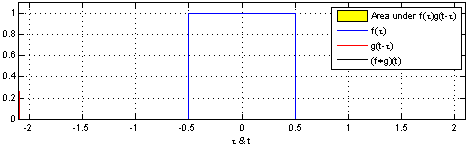

## 计算机视觉的卷积运算

在计算机视觉领域中，数字图像是一个二维的离散信号，对数字图像做卷积操作其实就是利用卷积核（卷积模板）在图像上滑动，将图像点上的像素灰度值与对应的卷积核上的数值相乘，然后将所有相乘后的值相加作为卷积核中间像素对应的图像上像素的灰度值，并最终滑动完所有图像的过程。 

下图是一个直观求卷积的示意图，从左到右看，原像素经过卷积由1变成-8。

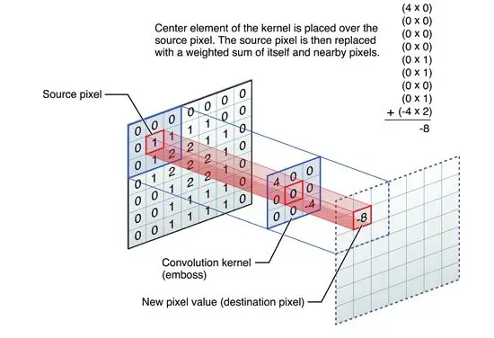

然后通过滑动卷积核，就可以得到整张图片的卷积结果，如下图所示。

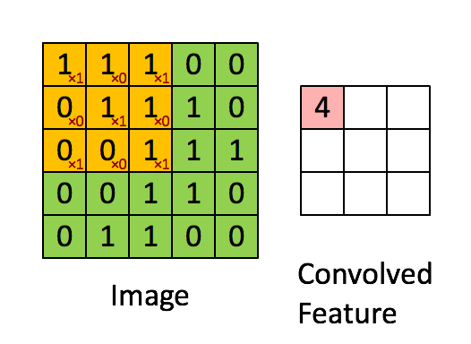

## 边界补充

上面的图片演示了图像的卷积操作，但是直观的看出，卷积后的图片和卷积前的图片尺寸不一致，为了保证图片大小的一致性，需要先对原始图片做边界填充处理，一般有四种方法。

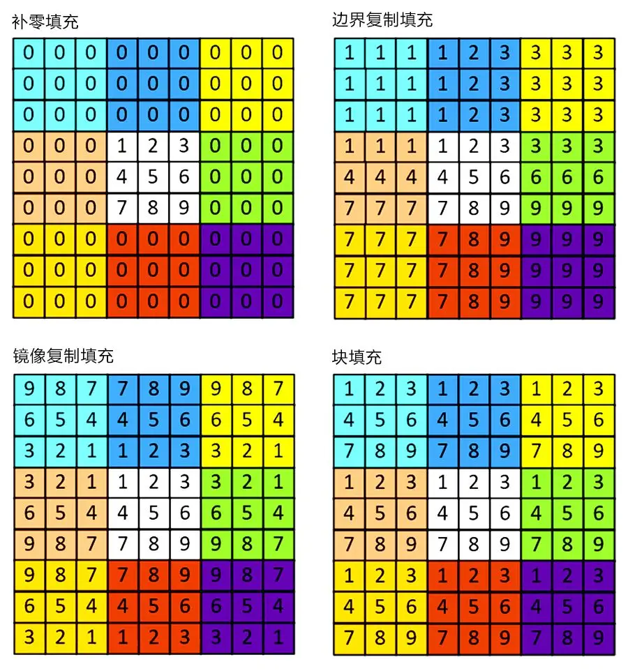

## 卷积核的规则

1. 卷积核的大小一般是奇数，这样的话它是按照中间的像素点中心对称的，所以卷积核一般都是3×3，5×5或者7×7。有中心了，也有了半径的称呼，例如5×5大小的核的半径就是2。 

2. 卷积核所有的元素之和一般要等于1，这是为了原始图像的能量（亮度）守恒。其实也有卷积核元素相加不为1的情况。

3. 如果滤波器矩阵所有元素之和大于1，那么滤波后的图像就会比原图像更亮，反之，如果小于1，那么得到的图像就会变暗。如果和为0，图像不会变黑，但也会非常暗。 

4. 对于滤波后的结构，可能会出现负数或者大于255的数值。对这种情况，我们将他们直接截断到0（小于0时）或255（大于255时）即可。对于负数，也可以取绝对值。

   

## 不同卷积核下图像卷积意义

图像处理中，平滑、模糊、去燥、锐化、边缘提取等等工作，其实都可以通过卷积操作来完成，下面几个典型的卷积核效果如下：

**没有任何效果的卷积核**

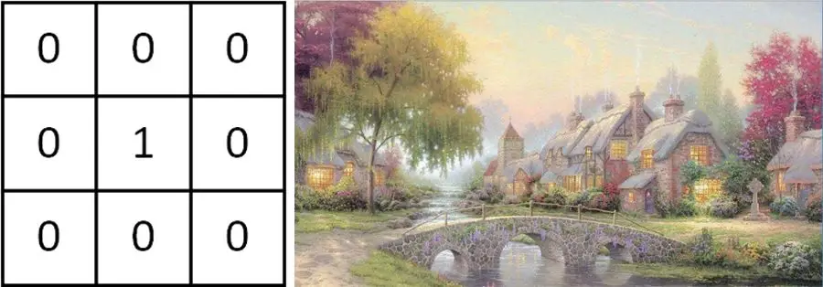

**均值滤波**

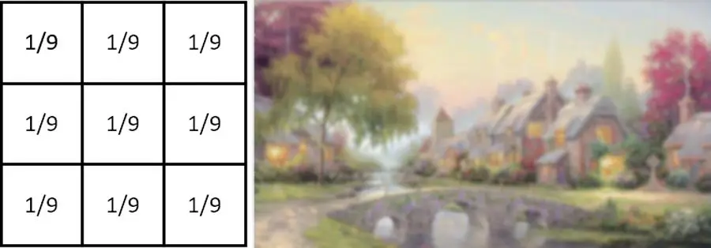

**高斯滤波**

**锐化**

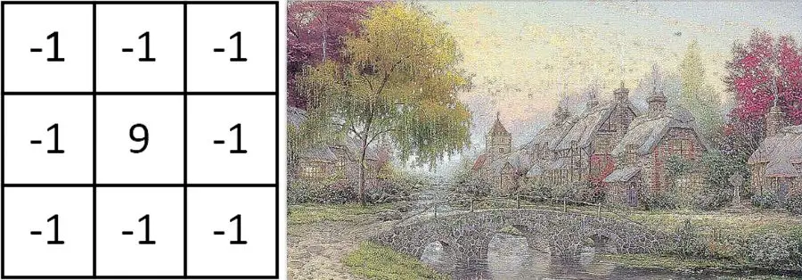

**水平梯度Prewitt**

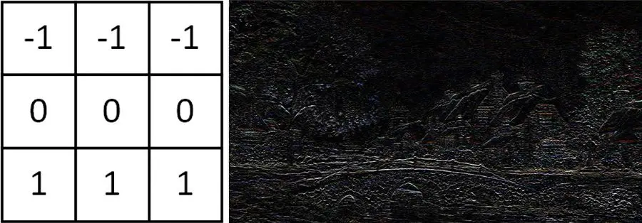

**垂直梯度Prewitt**

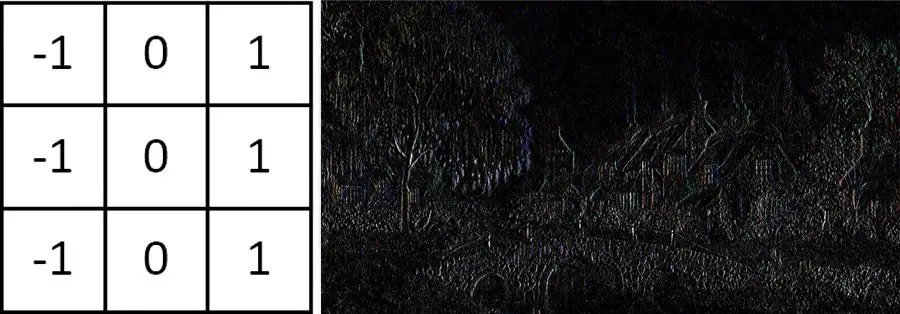

**梯度Laplacian**

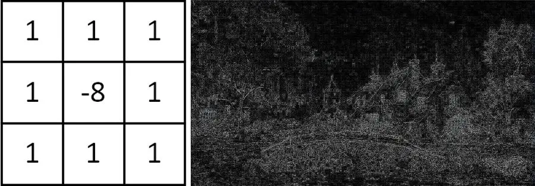

从以上示例可以看出，**不同的卷积核作用于图像，可以更清晰的获得图像的某种特征**，如轮廓、颜色等。

## 卷积核提取图像特征的原理

在卷积神经网络中，卷积核对输入的图像数据分区域进行卷积运算，通过运算的结果判定该图像区域是否符合某种预设特征（如判断人脸、鼻子、眼睛、嘴巴）。

下图示意对老鼠的屁股进行特征识别举例：

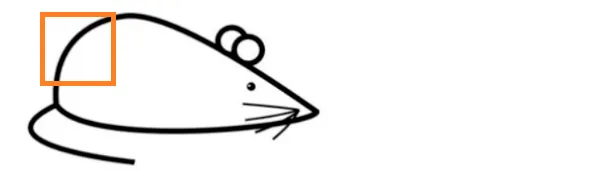

上图橙色框标注，其对应的矩阵假设为：

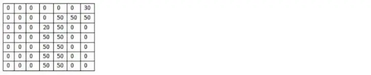

老鼠屁股，就是我们要提取的特征，依据老鼠屁股轮廓，设卷积核为：

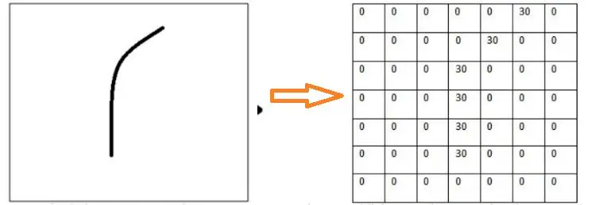

然后将卷积核作用于图片，直接进行卷积运算，就会发现对于识别的特征计算出来的值非常大：

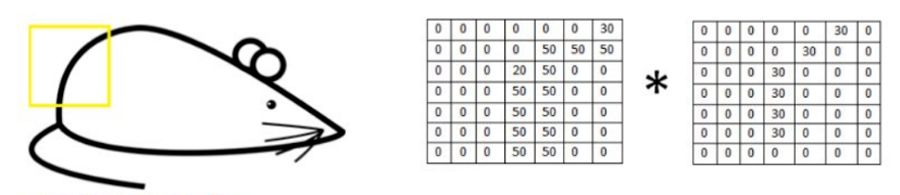

对于上面的卷积：

(50×30)+(50×30)+(50×30)+(20×30)+(50×30)=6600

对于不能识别的特征，计算的值非常小：

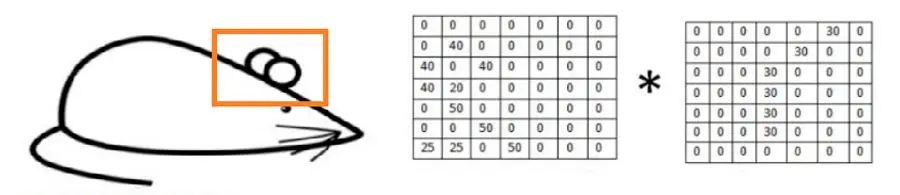

曲线的卷积核与其卷积后的到的值为0。

综上所述，提取图片特征的关键是寻找合理的卷积核。卷积神经网络训练的过程，就是提供合理的样本，让程序通过样本自动为各种卷积核给出阈值的过程，这个过程的本质，就是统计！

