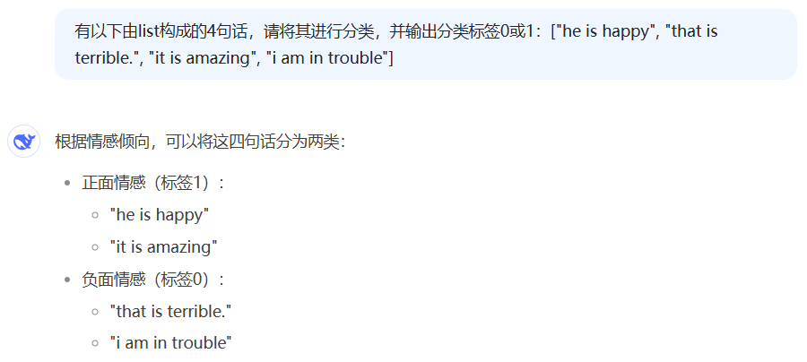

# Transformers 框架应用

#### 一、安装与配置

##### 1、安装框架

Transformers是由HuggingFace发布的人工智能Python库，也是AI预训练领域最常使用的编程框架之一。transformers库支持多种深度学习框架，如PyTorch和TensorFlow。

```
pip install transformers
```

以下代码可以用于安装验证：

```python
import transformers
print("transformers version:", transformers.__version__)

import torch
print("torch version:", torch.__version__)
print("cuda is available:", torch.cuda.is_available())
print("cuDNN is available:", torch.backends.cudnn.enabled)
print("GPU numbers:", torch.cuda.device_count())
print("GPU name:", torch.cuda.get_device_name(0))
print("GPU capability:", torch.cuda.get_device_capability(0))
print("GPU memory:", torch.cuda.get_device_properties(0).total_memory)
print("GPU compute capability:", torch.cuda.get_device_properties(0).major, torch.cuda.get_device_properties(0).minor)

# 验证TensorFlow安装
import tensorflow as tf
print("tensorflow version:", tf.__version__)
print("GPU is available:", tf.test.is_gpu_available())
print("GPU name:", tf.test.gpu_device_name())
print("GPU memory:", tf.config.experimental.list_physical_devices('GPU'))
print("GPU number:", len(tf.config.experimental.list_physical_devices('GPU')))
```

##### 2、加载预训练模型

transformers库提供了丰富的预训练模型，如BERT、GPT、Llama、ChatGPT、RoBERTa、Qwen、Gemma等几十万款模型（实际模型并没有这么多，有很多模型是重复的不同版本）。

```python
from transformers import BertModel

# 加载预训练模型，会自动下载（可能需要科学上网）
# bert-base-uncased 是 BERT 模型的一个变体，它使用小写字母进行训练，具有较小的模型大小和计算复杂度
model = BertModel.from_pretrained("bert-base-uncased")
print(model.config)
```

可能的输出为：

```python
BertConfig {
  "_name_or_path": "bert-base-uncased",
  "architectures": [
    "BertForMaskedLM"
  ],
  "attention_probs_dropout_prob": 0.1,
  "classifier_dropout": null,
  "gradient_checkpointing": false,
  "hidden_act": "gelu",
  "hidden_dropout_prob": 0.1,
  "hidden_size": 768,
  "initializer_range": 0.02,
  "intermediate_size": 3072,
  "layer_norm_eps": 1e-12,
  "max_position_embeddings": 512,
  "model_type": "bert",
  "num_attention_heads": 12,
  "num_hidden_layers": 12,
  "pad_token_id": 0,
  "position_embedding_type": "absolute",
  "transformers_version": "4.38.2",
  "type_vocab_size": 2,
  "use_cache": true,
  "vocab_size": 30522
}
```

所有预训练模型均可在HuggingFace上加载（这一操作与ModelScope类似）：https://huggingface.co/models

同样，我们也可以尝试加载其他一些模型，如：

```python
# 在线加载一些既定的小模型文件，如不指定目录，模型一般保存于用户主目录下的 .cache 目录中
from transformers import GPT2Model, RobertaModel

gpt2_model = GPT2Model.from_pretrained("gpt2")
print(gpt2_model.config)

roberta_model = RobertaModel.from_pretrained("roberta-base")
print(roberta_model.config)

# 如果模型不存在于缓存目录中，则先下载再运行
from transformers import Qwen2Model

qwen_model = Qwen2Model.from_pretrained("Qwen/Qwen2.5-0.5B")
print(qwen_model.config)

# 也可以使用更加通用的 AutoModelForCausalLM 类进行加载
from transformers import AutoModelForCausalLM

model = AutoModelForCausalLM.from_pretrained("Qwen/Qwen2.5-0.5B")
print(model.config)

# 如果模型已经存在于本地某个目录中，可以直接进行加载
from transformers import AutoModelForCausalLM

model = AutoModelForCausalLM.from_pretrained(
    r"D:\AIModels\qwen\Qwen2___5-1___5B-Instruct",
    device_map="cuda:0",
    local_files_only=True
)
print(model.config)
```

##### 3、模型参数解释

使用model.config可以读取到模型目录下的config.json中的文件内容，有一些参数对于我们了解模型结构也是非常重要的：

| 参数名                  | 配置值           | 参数说明                                                     |
| :---------------------- | :--------------- | :----------------------------------------------------------- |
| architectures           | Qwen2ForCausalLM | 模型的架构名称，**Qwen2ForCausalLM**是 Qwen 推理模型，在模型初始化方式将会实际使用 |
| attention_dropout       | 0.0              | 注意力机制中的 Dropout 操作概率，**0.0**代表不对注意力权重进行随机置零操作，即保留所有的注意力权重 |
| bos_token_id            | 151643           | 文本序列开始 Token ID 标记（Begin of Sentence Token ID），代表文本片段开始位置 |
| eos_token_id            | 151645           | 文本序列结束 Token ID 标记（End of Sentence Token ID），代表文本片段结束位置 |
| hidden_act              | silu             | 模型隐藏层使用**SiLU**激活函数（其他激活函数：ReLU，Tanh，Sigmoid 等） |
| hidden_size             | 1536             | 隐藏层的维度（或每个隐藏层中神经元的数量），数值越大意味着模型能学习更复杂的特征和模式 |
| initializer_range       | 0.02             | 模型训练时初始化权重的标准差，**0.02**代表权重从均值为 0、标准差为 0.02 的正态分布中随机初始化 |
| intermediate_size       | 8960             | 前馈神经网络中间层的维度，通常要比**hidden_size**大得多，用于增加模型学习能力 |
| max_position_embeddings | 32768            | 模型可以处理的最大序列长度，**32768**代表模型可以处理最长为 32768 个 Token 的输入序列 |
| max_window_layers       | 21               | 模型在处理长序列时，最多可以应用多少层的滑动窗口策略，即可以对长序列进行多少次分隔和处理 |
| model_type              | qwen2            | Qwen2 模型类型标识，用于映射 Qwen2Config 和 Qwen2ForCausalLM 等实际类 |
| num_attention_heads     | 12               | 多头注意力机制中注意力头的数量，**12**代表每个隐藏层中使用 12 个注意力头 |
| num_hidden_layers       | 28               | 模型隐藏层的数量                                             |
| num_key_value_heads     | 2                | 多头自注意力机制中键（Key）和值（Value）的注意力头数量，共**12**个注意头而键值只有**2**个头，则意味着查询（Query）头可以共享相同的键和值头 |
| rms_norm_eps            | 1e-06            | 使用 RMSNorm 归一化技术处理，分母增加一个极小值，避免除以零的情况，保证归一化的有效性 |
| rope_theta              | 1000000.0        | RoPE 旋转位置编码的周期性因子，用于捕捉长距离依赖关系，提高模型的数值稳定性 |
| sliding_window          | 32768            | 模型在处理长序列时采用的滑动窗口序列长度，即通过滑动窗口的方式处理超过**max_position_embeddings**的长序列策略 |
| tie_word_embeddings     | true             | 模型的输入和输出层之间共享词嵌入矩阵标识                     |
| torch_dtype             | bfloat16         | 模型权重采用 bfloat16 浮点数格式（1 位符号位+8 位指数位+7 位尾数位），它区别于 float16 半精度浮点数格式（1 位符号位 5 位指数位+10 位尾数位），通过增加指数位数以提高数字精度 |
| transformers_version    | 4.43.1           | Transformers 推理模型的版本号，通常是指最低版本，`pip install "transformers>=4.43.1"`，我们依赖包版本为`4.45.1` |
| use_cache               | true             | 模型推理过程中使用缓存机制标识，用于缓存中间结果，避免重复计算 |
| use_sliding_window      | false            | 模型处理长序列时是否使用滑动窗口机制，**false**代表禁用滑动窗口机制，则意味着模型将尝试一次性处理整个长序列，可能会导致内存占用和计算复杂度增加 |
| vocab_size              | 151936           | 模型词汇表的大小，**AutoTokenizer** 我们将会介绍             |

> 资料来源：https://www.cnblogs.com/obullxl/p/18508576/NTopic2024102601

我们也可以通过AutoConfig加载模型配置信息：

```python
from transformers import AutoConfig

config = AutoConfig.from_pretrained(r"D:\AIModels\qwen\Qwen2___5-1___5B-Instruct\config.json")
print(config.vocab_size)   # 输出 151936
```

##### 4、利用ModelScope下载模型

```python
# 先安装 ModelScope ： pip install modelscope
# 再访问：https://modelscope.cn/ 搜索自己感兴趣的模型，然后使用以下代码下载：
from modelscope import snapshot_download

snapshot_download(model_id='Qwen/Qwen2.5-1.5B-Instruct', cache_dir=r"D:\AIModels")
```

snapshot_download 会直接到 modelscope 魔塔社区下载指定的模型，并且不需要科学上网，速度飞快，还支持断点续传，是国内用户下载各类预训练模型的最佳途径。

#### 二、文本处理

##### 1、文本编码

在使用预训练模型处理文本之前，我们需要将文本转换为模型可以理解的格式。这就需要使用tokenizer对文本进行分词、编码等操作。transformers库为每种预训练模型提供了相应的tokenizer类，使用方法非常简单。

例如，使用BERT的tokenizer进行文本编码，可以使用以下代码：

```python
from transformers import BertTokenizer

tokenizer = BertTokenizer.from_pretrained("bert-base-uncased")
text = "here is some text to encode"
encoded_input = tokenizer(text, return_tensors='pt')
print(encoded_input)
```

##### 2、文本分类

```python
from transformers import BertForSequenceClassification
from transformers import BertTokenizer
import torch

# 准备输入文本和对应的标签
model = BertForSequenceClassification.from_pretrained("bert-base-uncased", num_labels=2)
input_text = ["he is happy", "This is terrible.", "it is amazing", "i am in trouble"]

# 使用 tokenizer 对输入文本进行编码：将文本转换为模型可以理解的向量（input_ids 和 attention_mask）
tokenizer = BertTokenizer.from_pretrained("bert-base-uncased")
encoded_inputs = tokenizer(input_text, padding=True, truncation=True, return_tensors="pt")

# 将编码结果输入到模型中，得到分类结果：
with torch.no_grad():
    outputs = model(**encoded_inputs)
    logits = outputs.logits
    # 对 logits 进行 argmax 操作，得到预测的类别
    predictions = torch.argmax(logits, dim=-1)

print(predictions)
```

毫无疑问，大家可以看出，直接利用预训练模型进行分类（尤其是很基础的bert模型），目前是不具备实用价值的，有三种方案可以解决，第一种方案是直接由提示词工程交由大模型实现分类（以下是由DeepSeek进行的分类）：



第二种方案则是基于预训练大模型进行二次训练，这样也可以实现效果非常不错的分类（下一章节详细介绍训练方法）。

第三种方案则是使用专门的情感分析模型来识别上述英文语句的正面或负面情感。（后续的Pipeline实验将会进行这一操作）。

##### 3、文本生成

```python
# 从 transformers 库中导入 GPT2LMHeadModel 和 GPT2Tokenizer
# GPT2LMHeadModel 是 GPT-2 模型的一个版本，专门用于语言建模任务
# GPT2Tokenizer 是用于 GPT-2 模型的分词器
from transformers import GPT2LMHeadModel, GPT2Tokenizer
import torch

# 一个预训练的 GPT-2 模型。("gpt2") 表示使用的是预训练的 "gpt2" 模型
model = GPT2LMHeadModel.from_pretrained("gpt2")

# 定义一个字符串 text，它将作为我们生成文本的起始
text = "Once upon a time,"

# 使用同样的预训练模型 "gpt2" 的分词器对输入文本进行编码。编码后的结果被存储在 input_ids 中：
tokenizer = GPT2Tokenizer.from_pretrained("gpt2")
input_ids = tokenizer.encode(text, return_tensors="pt")

# 将编码后的 input_ids 输入到模型中，然后生成文本
# model.generate 函数的参数 max_length=50 表示生成的文本的最大长度为 50
# num_return_sequences=1 表示只生成一条序列
# 然后使用分词器的 batch_decode 函数将生成的文本解码，得到可以阅读的文本
with torch.no_grad():
    outputs = model.generate(input_ids, max_length=50, num_return_sequences=1)
    generated_texts = tokenizer.batch_decode(outputs, skip_special_tokens=True)

for i, generated_text in enumerate(generated_texts):
    print(f"Generated text {i + 1}: {generated_text}")
```

生成的文本内容为（不忍直视）：

```
Generated text 1: Once upon a time, the world was a place of great beauty and great danger. The world was a place of great danger, and the world was a place of great danger. The world was a place of great danger, and the world was a
```

当然，这是因为加载的GPT2模型规模太小，并且仅仅只是对文本进行续写，并不能很好的理解其上正文，无法很好的胜任任务，我们不妨换Qwen2.5模型来进行文本生成：

```python
from transformers import AutoModelForCausalLM, AutoTokenizer
import torch

device = torch.device("cuda:0")
text = "在一个月黑风高的下午，"

model = AutoModelForCausalLM.from_pretrained(
    r"D:\AIModels\qwen\Qwen2___5-1___5B-Instruct",
    device_map=device
)
tokenizer = AutoTokenizer.from_pretrained(
    r"D:\AIModels\qwen\Qwen2___5-1___5B-Instruct",
    device_map=device
)

input_ids = tokenizer.encode(text, return_tensors="pt").to(device)

with torch.no_grad():
    outputs = model.generate(input_ids, max_length=50, num_return_sequences=1)
    generated_texts = tokenizer.batch_decode(outputs, skip_special_tokens=True)

for i, generated_text in enumerate(generated_texts):
    print(f"Generated text {i + 1}: {generated_text}")
```

输出结果为：

```
Generated text 1: 在一个月黑风高的下午，一位年轻的画家突然出现在了小镇的广场上。他穿着一件黑色的长袍，手中拿着一支画笔和一盒颜料。他的脸上带着神秘的笑容，仿佛有着某种特殊的魅力。
```

然而，就这样简单一段文本续写，消耗了接近6GB的显存和几乎100%的GPU使用率。

```python
+-----------------------------------------------------------------------------------------+
| NVIDIA-SMI 551.76                 Driver Version: 551.76         CUDA Version: 12.4     |
|-----------------------------------------+------------------------+----------------------|
| GPU  Name                     TCC/WDDM  | Bus-Id          Disp.A | Volatile Uncorr. ECC |
| Fan  Temp   Perf          Pwr:Usage/Cap |           Memory-Usage | GPU-Util  Compute M. |
|                                         |                        |               MIG M. |
|=========================================+========================+======================|
|   0  NVIDIA GeForce RTX 2060      WDDM  |   00000000:01:00.0 Off |                  N/A |
| N/A   59C    P5             29W /   30W |    5919MiB /   6144MiB |     98%      Default |
|                                         |                        |                  N/A |
+-----------------------------------------+------------------------+----------------------+
```

##### 4、文本翻译

我们也可以使用预训练模型进行文件翻译，比如基于 Helsinki-NLP/opus-mt-zh-en 进行中英文翻译：

```python
from transformers import AutoModelForSeq2SeqLM, AutoTokenizer   # 注意不再是 AutoModelForCausalLM
import torch

device = torch.device("cuda:0")
text = "一位年轻的画家突然出现在了小镇的广场上"

model = AutoModelForSeq2SeqLM.from_pretrained(
    "Helsinki-NLP/opus-mt-zh-en",
    device_map=device
)
tokenizer = AutoTokenizer.from_pretrained(
    "Helsinki-NLP/opus-mt-zh-en",
    device_map=device
)

input_ids = tokenizer.encode(text, return_tensors="pt").to(device)

with torch.no_grad():
    outputs = model.generate(input_ids, max_length=50, num_return_sequences=1)
    generated_texts = tokenizer.batch_decode(outputs, skip_special_tokens=True)

for i, generated_text in enumerate(generated_texts):
    print(f"Generated text {i + 1}: {generated_text}")

```

输出结果为：

```
Generated text 1: A young painter suddenly appeared in the town square.
```

可以看出，效果的好坏，或者使用目的，主要取决于加载什么模型，而不是代码本身。

#### 三、还可以利用模型做什么？

1、文本生成

2、文本分类

3、文本摘要

4、图像识别

5、图像生成

6、语音识别

7、视频生成

。。。。。。。。。。。

某些特写场景下的预训练模型不一定能够完成目的，此时，可以训练自已的专用模型，但是如果能够找到对应目的的预训练基模型，再对模型进行重新训练或者微调，将是更方便更快捷的做法。