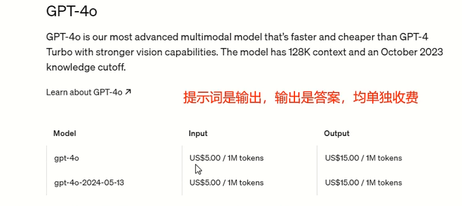
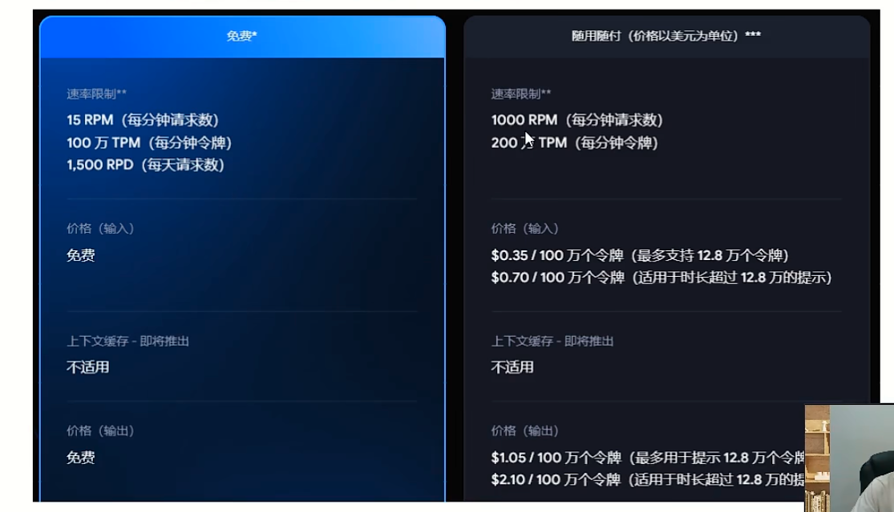
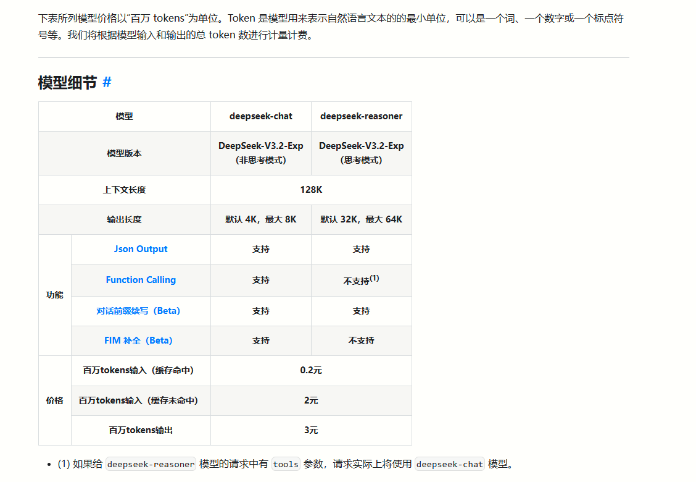
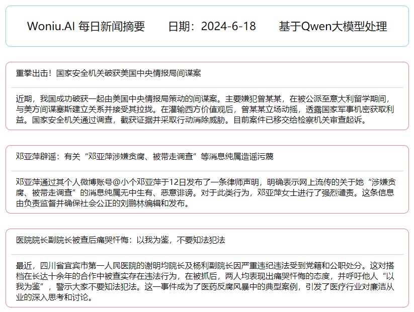

# 大模型部署与开发


## 一、大模型概述

### **1、大模型厂商**

（1）国外厂商：

Google：Gemini/Gemma，微软：AZure/Phi，OpenAI：ChatGPT/Dall-E/Sora，FaceBook/Meta：Llama，Anthropic：Claude，X（前Twitter）：Grok，[Stability.AI](https://stability.ai/)：Stable Diffusion，及其优化版本：Midjourney等，以及各类模型强化版本如Llava，Vicuna，Mistral等。

（2）国内厂商：

百度：文心一言，阿里云：通义千问，目前最新版本是Qwen2，月之暗面：KimiChat（闭源）及Moonshot，零一万物：Yi，智谱AI：ChatGLM/CogVLM，科大讯飞：星火，腾讯：混元，深度求索：DeepSeek，字节跳动：Coze，秘塔：秘塔AI搜索，华为：盘古等。

### 2、商用大模型或开放平台

(1) OpenAl的 ChatGPT 系列 (主要是文本生成) ，另有ChatGPT-4o多模态，可以识别图像内容，Dall-E模型可以实现图片生成，以及语音识别异型，Sora文生视频模型等。目前是价格最贵的商用模型，没有之一。微软的商用模型与OpenAl是一致的。



（2）闭源模型：Google的Gemini Pro，也可以实现文本生成和图像识别，价格为：




（3）DeepSeek



### 3、大模型开放平台

（1）国外的Huggingface：网址为：https://huggingface.co/

（2）国内的ModelScope：网址为：https://modelscope.cn/，由阿里达摩院运营

如果需要下载开源大模型，建议在ModelScope上下载，可以获取最大网速，HuggingFace则需要科学上网才能下载，速度较慢。


## 二、Ollama部署与调用

### 1、Ollama介绍

官网：https://ollama.com/

GitHub：https://github.com/ollama/ollama

支持的模型：https://ollama.com/library

------

### 2、部署和运行大模型

基本命令：

```python
ollama serve
ollama pull qwen2:7b
ollama list
ollama run qwen2:7b
```

在Python中进行API接口调用（以QWen2:7B模型为例）

**普通调用：**

```python
import requests, json
url = "http://127.0.0.1:11434/api/generate"
data = {"model":"qwen2:7b", "prompt":"请简述成都市的历史,答案在100字以内。", "stream":False}
resp = requests.post(url=url, json=data)
print(resp.text)
```

**流式响应（打字机模式）：**

```python
import requests, json
url = "http://127.0.0.1:11434/api/generate"
data = {"model":"qwen2:7b", "prompt":"请简述成都市的历史，不多于100字", "stream":True}
resp = requests.post(url=url, json=data, stream=True)
for line in resp.iter_lines():
    if line:
        print(json.loads(line.decode())["response"], end="")
```

**多轮对话（基于上下文）**

```python
def send_chat(messages):
    url = "http://192.168.55.200:11434/api/chat"
    data = {"model":"qwen:32b", "messages":messages}
    resp = requests.post(url=url, data=json.dumps(data), stream=True)
    history = ""
    for line in resp.iter_lines():
        if line:
            history += json.loads(line)['message']['content']
            print(json.loads(line)['message']['content'], end='')
    print("\n====================")
    return history

if __name__ == '__main__':
    messages = []
    messages.append({"role":"user", "content":"你是一名经验丰富的语文老师，请记住你的角色"})
    history = send_chat(messages)
    messages.append({"role":"assistant", "content": history})
    messages.append({"role":"user", "content":"很好，请用激扬的文字赞美中国人民和抗日战争，100字以内"})
    history = send_chat(messages)
    messages.append({"role":"assistant", "content": history})
    messages.append({"role":"user", "content":"不错，请写一首七言诗来赞扬中华人民共和国的成立"})
    history = send_chat(messages)
    print(messages)
```

> 不同大模型所支持的上下文长度是不一样的，有8K，32K，128K，或1M等，支持的上下文长度越长，意味着模型可以记住的内容越多，比如1M的上下文表示最多可以支持100万个Token，这个文案数量，基本上可以分析几本正常的图书了，所以我们可以对图书进行提问。这也是本地知识库这类应用的基本场景。而如果需要阅读的文件内容的长度超出了上下文长度，则一般需要基于大模型外挂RAG（检索增强生成）技术，通过词向量嵌入和搜索的方式，来完成文件的阅读和分析。
>
> Ollama的Restful API接口说明：https://github.com/ollama/ollama/blob/main/docs/api.md


### 3、使用Ollama的Python库运行

**安装：**

```
pip install ollama
```

**常规调用：**

```python
from ollama import Client
client = Client(host='192.168.55.200')
response = client.chat(model='qwen2:7b', messages=[
    {
        'role': 'user',
        'content': '天空为什么是蓝色的?',
    },
])
print(response['message']['content'])
```

**流式调用：**

```python
from ollama import Client
client = Client(host='192.168.55.200')
response = client.chat(model='qwen2:7b', messages=[{
        'role': 'user',
        'content': '天空为什么是蓝色的?'
    }], stream=True)
for chunk in response:
    print(chunk['message']['content'], end='', flush=True)
```

------

### 4、基于GGUF文件加载大模型

GGUF是一种大模型文件格式，由模型推理框架 Llama.cpp 的开发者Georgi Gerganov提出。

具体来说，GGUF代表的是GPT-Generated Unified Format，这是一种针对大规模机器学习模型设计的二进制格式文件规范。它的主要优势在于能够将原始的大模型预训练结果经过特定优化后转换成这种格式，从而可以更快地被载入使用，并消耗更低的资源。以下是GGUF的一些关键特点：

1、紧凑的二进制编码
 2、优化的数据结构
 3、内存映射
 4、跨硬件平台优化
 5、多种模型格式

> 总的来说，GGUF是为了解决大模型在实际应用中的加载速度慢、资源消耗高等问题而设计的一种优化文件格式。

下载示例：https://modelscope.cn/models/qwen/Qwen1.5-7B-Chat-GGUF/files

部署方法：

```
FROM gemma-2b-it.Q3_K_L.gguf
ollama create gemma:gguf -f model.txt
```

------

### 5、安装Open WebUI并对接Ollama

GitHub: https://github.com/open-webui/open-webui

**Docker运行示例：**

```sh
docker run -d -p 3000:8080 \
--add-host=host.docker.internal:host-gateway \
-v open-webui:/app/backend/data \
--name open-webui --restart always \
ghcr.io/open-webui/open-webui:main
```


## 三、使用ModelScope运行大模型

##### 1、先安装modelscope库：

```sh
pip install modelscope
```

安装完成后，如果在运行模型的过程中，

##### 2、下载大模型文件

```python
from modelscope import snapshot_download

snapshot_download(
    model_id='qwen/Qwen2-7B-Instruct-GPTQ-Int4', 
    cache_dir=r"D:\AIModels"
)
```

使用ModelScope库的snapshot_download方法进行模型下载是最稳定最快速的方式。

```
2024-06-17 23:00:58,750 - modelscope - INFO - PyTorch version 2.2.1+cu121 Found.
2024-06-17 23:00:58,755 - modelscope - INFO - TensorFlow version 2.16.1 Found.
2024-06-17 23:00:58,755 - modelscope - INFO - Loading ast index from C:\Users\Denny\.cache\modelscope\ast_indexer
2024-06-17 23:00:59,165 - modelscope - INFO - No valid ast index found from C:\Users\Denny\.cache\modelscope\ast_indexer, generating ast index from prebuilt!
2024-06-17 23:00:59,372 - modelscope - INFO - Loading done! Current index file version is 1.13.1, with md5 f9abdfb23d8f46119b514ddb89f69c30 and a total number of 972 components indexed
Downloading: 100%|██████████| 1.23k/1.23k [00:00<00:00, 1.26MB/s]
Downloading: 100%|██████████| 73.0/73.0 [00:00<?, ?B/s]
Downloading: 100%|██████████| 243/243 [00:00<?, ?B/s]
Downloading: 100%|██████████| 11.1k/11.1k [00:00<00:00, 5.69MB/s]
Downloading: 100%|██████████| 1.59M/1.59M [00:00<00:00, 5.43MB/s]
Downloading:  63%|██████▎   | 2.34G/3.69G [01:01<00:25, 55.9MB/s]
```

3、运行模型程序

```python
from modelscope import AutoModelForCausalLM, AutoTokenizer

device = "cuda"  # the device to load the model onto

model = AutoModelForCausalLM.from_pretrained(
    r"D:\AIModels\Qwen1.5-4B-Chat-GPTQ-Int4",
    device_map="auto"
)

tokenizer = AutoTokenizer.from_pretrained(
    r"D:\AIModels\Qwen1.5-4B-Chat-GPTQ-Int4"
)

# prompt = "请介绍一下你自己的能力"
prompt = "请推荐一个适合二年级学生的团队科学小实验"

messages = [
    {"role": "system", "content": "You are a helpful assistant."},
    {"role": "user", "content": prompt}
]

text = tokenizer.apply_chat_template(
    messages,
    tokenize=False,
    add_generation_prompt=True
)

model_inputs = tokenizer([text], return_tensors="pt").to(device)

generated_ids = model.generate(
    model_inputs.input_ids,
    max_new_tokens=512,
    pad_token_id=tokenizer.eos_token_id
)

generated_ids = [
    output_ids[len(input_ids):] 
    for input_ids, output_ids in zip(model_inputs.input_ids, generated_ids)
]

response = tokenizer.batch_decode(generated_ids, skip_special_tokens=True)[0]

print(response)

```

> 1、不同的模型其运行方式不同，需要查阅模型供应商提供的手册。
>
> 2、本演示使用 Qwen1.5-4B-Chat-GPTQ-Int4 模型进行处理，如果换成 Qwen2-7B-Instruct-GPTQ-Int4 ，则6G显存无法处理，将会将模型加载到内存中利用CPU运行，大家可以感受一下什么叫慢如蜗牛。
>
> 3、尝试将上述代码运行于显存更大的机器上，并观察其运行效果。

4、使用Python+ModelScope运行ChatGLM模型

```python
from modelscope import AutoTokenizer, AutoModel, snapshot_download

model_dir = "/mnt/data/Models/ZhipuAI/chatglm2-6b-int4"

tokenizer = AutoTokenizer.from_pretrained(model_dir, trust_remote_code=True)

model = AutoModel.from_pretrained(model_dir, trust_remote_code=True).half().cuda()

model = model.eval()

response, history = model.chat(tokenizer, "请问四川为什么称为天府之国?", history=[])
print(response)

response, history = model.chat(tokenizer, "天府之国到底是指四川省还是成都市？", history=history)
print(response)
```


## 四、基于大模型开发每日新闻摘要

### 1、项目效果



### 2、实现思路

1、利用Python的爬虫功能，读取目标见面的数据（比如新浪新闻）。

2、利用大模型的上下文对话的能力，将问题与新闻原文内容一起提交给大模型。

3、针对大模型的输出进行格式化处理（比如生成PDF、生成图片、生成网页）。

### 3、代码实操

```python
import requests
import json
from bs4 import BeautifulSoup

requests.packages.urllib3.disable_warnings()

resp = requests.get(
    "https://top.news.sina.com.cn/ws/GetTopDataList.php?top_type=day&top_cat=www_www_all_suda_suda&top_time=20240618&top_show_num=100&top_order=DESC&js_var=all_1_data01",
    verify=False
)
resp.encoding = 'utf-8'

response = resp.text.replace("var all_1_data01 = ", "")
response = response.replace(";", "")

news = json.loads(response)

for i in range(10):
    title = news["data"][i]["title"]
    url = news["data"][i]["url"]
    
    resp = requests.get(url, verify=False)
    resp.encoding = "utf-8"
    html = BeautifulSoup(resp.text, "lxml")
    
    content = ""
    try:
        content = html.find("div", id="article").text.strip()
    except:
        # content = html.find("div", id="artibody").text.strip()
        pass

    ourl = "http://192.168.55.200:11434/api/generate"
    data = {
        "model": "qwen:32b",
        "prompt": f"请针对以下新闻内容进行不超过150字的信息摘要：{content}",
        "stream": False
    }
    
    resp = requests.post(url=ourl, json=data)
    
    print("新闻标题：" + title)
    print("新闻摘要：" + resp.json()["response"].replace("\n", ""))
    print("")
```

搞定了基础操作之后，便可以利用Python写入HTML，最终生成一份美化后的基于HTML展现的新闻摘要。详情见课程资料包。
