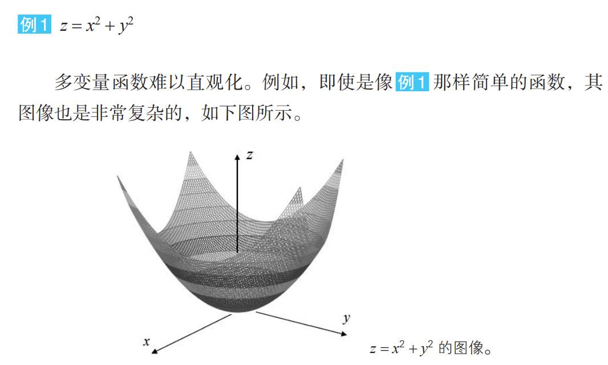
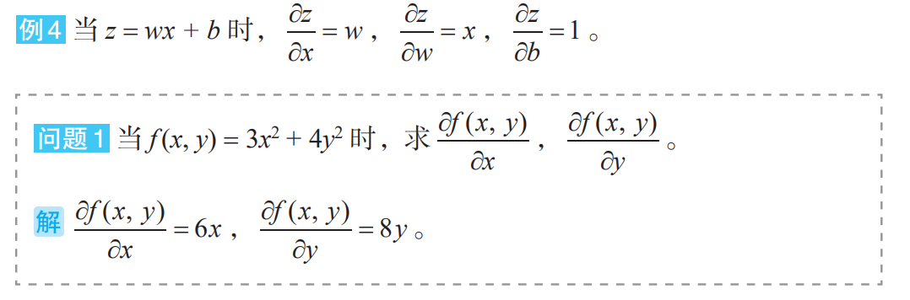
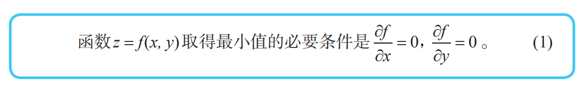
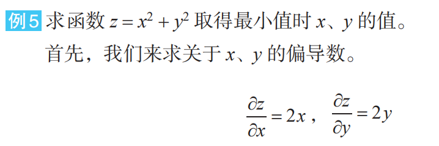

# 导数与偏导

## 导数

函数 $y = f(x)$ 的导函数 $f'(x)$ 定义如下：
$$
f'(x) = \lim_{\Delta x \to 0} \frac{f(x+\Delta x) - f(x)}{\Delta x}
$$
该公式表示：当 Δx 无限接近 0 时，$f'(x)$ 最接近的值。

例如：
当 $f(x) = 3x$​​ 时：
$$
f'(x) = \lim_{\Delta x \to 0} \frac{3(x + \Delta x) - 3x}{\Delta x} = \lim_{\Delta x \to 0} \frac{3\Delta x}{\Delta x} = \lim_{\Delta x \to 0} 3 = 3
$$
当 $f(x) = x^2$​​ 时
$$
f'(x) = \lim_{\Delta x \to 0} \frac{(x + \Delta x)^2 - x^2}{\Delta x} 
       = \lim_{\Delta x \to 0} \frac{2x \Delta x + (\Delta x)^2}{\Delta x} 
       = \lim_{\Delta x \to 0} (2x + \Delta x) 
       = 2x
$$
常用的求导公式有：
$$
(k)' = 0,\quad (kx)' = k,\quad (x^k)' = kx^{k-1},\quad (e^x)' = e^x,\quad (e^{-x})' = -e^{-x} \quad (k \text{ 为常数})
$$
另一种表示方法：
$$
f'(x) = \frac{dy}{dx}
$$

由于导函数 $f'(x)$ 表示切线斜率，故：当函数 $f(x)$ 在 $x = a$ 处取得最小值时，$f'(a) = 0$

## 基本导数与微分表

(1) $ y = c $（常数） 则：$ y' = 0 $，$ dy = 0 $

(2) $ y = x^a $ ($ a $ 为实数) 则：$ y' = ax^{a-1} $，$ dy = ax^{a-1}dx $

(3) $ y = a^x $ 则：$ y' = a^x\ln{a} $，$ dy = a^x\ln{a}\,dx $  
特例: $ (e^x)' = e^x $，$ d(e^x) = e^x dx $

(4) $ y = \log_a{x} $ 则：$ y' = \dfrac{1}{x\ln{a}} $，$ dy = \dfrac{1}{x\ln{a}}dx $  
特例: $ y = \ln{x} $，$ y' = \dfrac{1}{x} $，$ dy = \dfrac{1}{x}dx $

(5) $ y = \sin{x} $ 则：$ y' = \cos{x} $，$ d(\sin{x}) = \cos{x}\,dx $

(6) $ y = \cos{x} $ 则：$ y' = -\sin{x} $，$ d(\cos{x}) = -\sin{x}\,dx $

(7) $ y = \tan{x} $ 则：$ y' = \dfrac{1}{\cos^2{x}} = \sec^2{x} $，$ d(\tan{x}) = \sec^2{x}\,dx $

(8) $ y = \cot{x} $ 则：$ y' = -\dfrac{1}{\sin^2{x}} = -\csc^2{x} $，$ d(\cot{x}) = -\csc^2{x}\,dx $

(9) $ y = \sec{x} $ 则：$ y' = \sec{x}\tan{x} $，$ d(\sec{x}) = \sec{x}\tan{x}\,dx $

(10) $ y = \csc{x} $ 则：$ y' = -\csc{x}\cot{x} $，$ d(\csc{x}) = -\csc{x}\cot{x}\,dx $

(11) $ y = \arcsin{x} $ 则：$ y' = \dfrac{1}{\sqrt{1-x^2}} $，$ d(\arcsin{x}) = \dfrac{1}{\sqrt{1-x^2}}dx $

(12) $ y = \arccos{x} $ 则：$ y' = -\dfrac{1}{\sqrt{1-x^2}} $，$ d(\arccos{x}) = -\dfrac{1}{\sqrt{1-x^2}}dx $

(13) $ y = \arctan{x} $ 则：$ y' = \dfrac{1}{1+x^2} $，$ d(\arctan{x}) = \dfrac{1}{1+x^2}dx $

(14) $ y = \operatorname{arccot}{x} $ 则：$ y' = -\dfrac{1}{1+x^2} $，$ d(\operatorname{arccot}{x}) = -\dfrac{1}{1+x^2}dx $

(15) $ y = \sinh{x} $ 则：$ y' = \cosh{x} $，$ d(\sinh{x}) = \cosh{x}\,dx $

(16) $ y = \cosh{x} $ 则：$ y' = \sinh{x} $，$ d(\cosh{x}) = \sinh{x}\,dx $

## 偏导数

### 多变量函数

有两个以上的自变量的函数称为多变量函数。

### 偏导数

求导的方法也同样适用于多变量函数的情况。但是，由于有多个变量，所以必须指明对哪一个变量进行求导。在这个意义上，关于某个特定变量的导数就称为偏导数。

例如，让我们来考虑有两个变量 x、y 的函数 z = f(x, y)。只看变量 x， 将 y 看作常数来求导，以此求得的导数称为“关于 x 的偏导数”。

### 多变量函数的最小值条件

光滑的单变量函数 y = f (x) 在点 x 处取得最小值的必要条件是导函数在该点取值 0，这个事实对于多变量函数同样适用。例如对于有两个变量的函数，可以如下表示。

根据上述 (1)，函数取得最小值的必要条件是 $ x = 0 $，$ y = 0 $。此时函数值 $ z $ 为 0。由于 $ z = x^2 + y^2 \geq 0 $，所以我们知道这个函数值 0 就是最小值。

