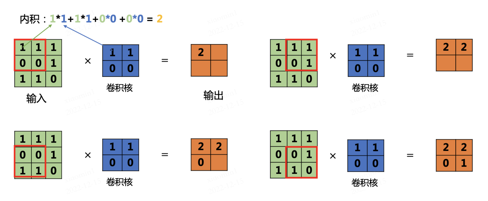

# 机器学习和神经网络（识别手写体数字）


## 一、问题的提出

### 1、问题描述

以下数字是我在Windows的画图软件上手写的数字（这是蜗牛学苑成立的时间），那么机器如何来识别到我的这串数字呢？


机器学习的核心在于学习和训练，要想识别到这类手写数字或文字（包括电脑字体的工整的文字），都需要依赖于大量的模型训练，哪怕是目前识别数字和文字的OCR技术，也同样建议在模型训练的基础之上。这就好比要教会一个小朋友认识这个大千世界，你就得培养TA，教育TA，这个道理是一样的。

### 2、解决思路

我们要通过计算机识别手写体的数字，则主要需要考虑以下三个问题：

（1）需要有大量的训练数据来模拟各种手写体数字（或其他），进而让模型达到泛化的能力。

（2）需要理解计算机在处理图像时是如何进行编码和计算的，众所周知，AI都是靠运算得出结果的。

（3）需要有一个可以评估目标数字与训练数字是否相似的评价体系，比如KNN或CNN。

### 3、需要用到的库

```python
pip install opencv-python
pip install keras
pip install numpy
pip install scikit-learn
pip install tensorflow
pip install joblib
pip install matplotlib
pip install pytesseract
```

如果需要使用GPU进行模型训练，则还需要安装CUDA驱动和cuDNN运算库（英伟达官网下载），以及支持CUDA的Tensorflow版本，需要使用conda进行安装和配置：

```sh
conda create -n TensorFlow python=3.10
conda activate TensorFlow
conda install -c conda-forge cudatoolkit=11.8 cudnn=8.9
```


## 二、AI基础常识

### 1、编码与运算

在AI领域，无论是传统AI，还是大模型，其本质就是对计算机可以支持的数据进行数值化处理。目前计算机能够处理的数据主要可以分为：数字、文字、图片、音频、视频，而无论哪一种数据，最终都需要转换为计算机能够进行运算的 **数值**。

**（1）为什么必须要数值**

在统计学和数学领域，最简单的预测公式为一元线性回归：y=wx+b，既根据历史数据的x和y，来拟合出一个相对来说比较均衡的 w 和 b 的参数（也叫权重），比如 拟合出来为 y = 5x + 3，则要进行预测，就可以根据 x 的值，来预测 y，比如如果 x的值为 10，则 y 的预测结果为 53。是AI领域最基础最简单的一个公式。


上述图中，红点对应的就是 X 和 Y 的分布，这叫训练样本 （有 x 和 y 的值），进而拟合出差异最小的 w 和 b 的值，于是得到一条直线函数：y = 0.66x + 0.17，于是，根据 x 的值就可以预测 y 的值，如下图所示：


所以，在计算机或者AI的眼里，它并不认识文字，图片，语音这些东西，它更不知道哪张图片好看，哪张图片难看，它的眼里，只有数字。所有的AI推理，均是一种基于 输入值 的预测值，它可能简单到只有 y = wx + b (一元线性回归)，也可能复杂到 $y=w_1x_1 + w_2x_2 + w_3x_3 … + b$（多元线性回归），当然也可以是非线性回归预测。

**（2）数字如何运算**

比如销售额，股票价格，利润，气象数据，成绩等等，一般针对数字来说，需要进行**归一化处理**，让数据最终归于`0~1或-1~1`的区间，比如以下是最简单的归一化公式（可以归一化到 0 - 1 区间）：
$$
x' = \frac{x - \min A}{\max A - \min A}
$$
也可以将上述公式的分子中，minA 换成 meanA（即集合的平均值），则可以得到一个 -1 到 1的范围。
$$
x' = \frac{x - \mathrm{mean}A}{\mathrm{max}A - \mathrm{min}A}
$$
**（3）文字如何运算**

文字本身不是数字，计算机无法直接进行运算，则需要将其分词处理后转换为**词向量**，才可以进行关联运算

**（4）图片如何运算**

图片本身在计算机内部存储的就是数字（RGB像素编码，0-255的颜色值），所以只需要做归一化处理即可，确定范围 / 最大值，不确定范围则可以使用softmax进行归一化处理，但是图像颜色值都是 0-255的范围，都是这届 / 255即可实现归一化。

简单了解一下 Softmax 归一化公式，其中 e 为自然对数，值为 2.718：
$$
\huge \sigma(\overrightarrow{z})*i=\frac{e^{z_i}}{\sum*{j=1}^{K}e^{z_j}}
$$


比如针对数据集：[5, 7, 10] 中，7的归一化结果为：
$$
\huge \sigma([5,7,10])_2 = \frac{e^7}{e^5+e^7+e^{10}} = 0.047
$$


**（5）音频**：音频在计算机内部是声道频率的采样数据，本身就是数字，所以处理起来并不复杂。（请看示例）

**（6）视频**：视频是音频和图片，再加时间帧的结合，所以编码方式是三者的共同处理，所以这里也提出来一个新的数据类型：**时序数据**

### 2、文字编码与词向量

比如以下LLama3大模型里面的文字编码格式（称为Token）,这样的编号可以进行运算吗？

```
"RefPtr": 77729,
".globalData": 77730,
"grave": 77731,
"imesteps": 77732,
"foundland": 77733,
"Salir": 77734,
"artists": 77735,
"ĠcreateAction": 77736,
"ĠSanto": 77737,
"ĠнеÑĤ": 77738,
"ĉĉĉĠĠĠĠĠĠĠĠĠĠĠĠĠĠĠ": 77739,
"-song": 77740,
"Ġnuisance": 77741,
"Ġimpover": 77742,
"_)čĊ": 77743,
"Ġcrowdfunding": 77744,
"Ġtimp": 77745,
"Pictures": 77746,
"Ġlodging": 77747,
```

答案是：不能，所以不能说把文字转成了一个数字编号就能参与运算了，这是不行的。词向量才能进行运算。那么什么叫词向量：


人为添加一个维度标识，只是为了便于大家理解，词向量的训练和生成，不需要在意具体是什么标识，只要看得到一堆数值就行了。

使用Python的word2vec（词向量）库给大家进行一下可视化展示，我的电脑上有很多已经训练好的词向量库（基于大量的中英文语料库进行训练，得到的一个库：


现在我们挑选大小相对较小的hanlp-wiki-vec-zh.txt来打开看看，大概长这样（有大约300个数字，也就意味着是300维空间）：


词向量空间在计算机内部是300维空间（没错，就是xyz的三维，对应的三百维），大约长成这个样子：


> 图片来源： https://zhuanlan.zhihu.com/p/48167933?utm_source=qq

事实上，人只能看得懂三维空间的数据，上图只可意会，无法真实表达300维空间的样子，大家意会其概念就行。

上图的意思就是 “金融学” 这个词在向量空间中的坐标，先不管是什么，大家是不是能够直观的感受到，中文被转换成了数字。那么我们也可以使用Python来编程实现这个过程：

```python
from gensim.models.keyedvectors import KeyedVectors
word_vectors = KeyedVectors.load_word2vec_format(r'G:\Other\HanLP\data\hanlp-wiki-vec-zh.txt', binary=False)
print(word_vectors['金融学'])
```

最终也同样可以获得上述结果。接下来我们可以来尝试一下，找到与”金融学“最相似（距离最近）的一个词：

```python
# 找到5个与金融学距离最近的词
similar = word_vectors.most_similar(positive = ['金融学'], topn = 5)
print(similar)
```

输出结果为：

```sh
[('会计学', 0.6112884283065796), ('经济学', 0.5791643261909485), ('管理学', 0.522872269153595), ('管理科学', 0.4868156909942627), ('商学', 0.477636456489563)]
```

当然，我们也可以查看”金融学“与”管理学“和与”大象“之间的距离

```python
# 查看 金融学 与 管理学 和与 大象 之间的距离
distance = word_vectors.similarity("金融学", "管理学")
print(distance)
distance = word_vectors.similarity("金融学", "大象")
print(distance)
```

输出结果为：

```sh
0.52287227 0.013983104
```

### 3、计算机视觉

计算机视觉是一种⽤摄像机和电脑及其他相关设备，对⽣物视觉的模拟。它的主要任务让计算机理解图⽚或者视频中的内容，就像⼈类和许多其他⽣物每天所做的那样。可将其分为三⼤经典任务：图像分类、⽬标检测、图像分割


- 图像分类（Classification）：是指将图像结构化为某⼀类别的信息，⽤事先确定好的类别(category)来描述图⽚。
- ⽬标检测（Detection）：分类任务关⼼整体，给出的是整张图⽚的内容描述，⽽检测则关注特定的物体⽬标，要求同时获得这⼀⽬标的类别信息和位置信息（classification + localization）。
- 图像分割（Segmentation）：分割是对图像的像素级描述，它赋予每个像素类别（实例）意义，适⽤于理解要求较⾼的场景，如⽆⼈驾驶中对道路和⾮道路的分割。

当然，随着大模型的兴起，图像描述和图像生成也可以作为计算机视觉的一个新的领域和分支来考虑。

那么针对一张图片，计算机内部又是如何将其变成数字的呢？我们可以使用OpenCV打开一张图片，就可以看到RGB的色彩像素值了：


```python
import cv2
image = cv2.imread("./woniu_run.jpg")
# 每个像素点的RGB值（红绿蓝），范围是0-255，0代表黑色，255代表白色
print(image)
# 我们也可以打印某一个具体的像素点的值
print(image[0][9])  # 代表第（1，10）这个像素点的颜色值
```

输出的结果类似于：

```sh
[[[107 122 141]  [108 123 142]  [118 133 152]  ...  [198 196 196]  [206 204 204]  [221 219 219]]][114 128 147]     # 该像素点的颜色为 (114, 128 ,147)，代表红色为147, 绿色为128，蓝色为114 (默认为BGR格式打开)
```

当然，我们也可以将图片转换为RGB打开，使用以下代码即可转换完成（但是这个过程不影响AI的运算），所以不是重点

```python
# 将颜色值转换为RGB
image_rgb = cv2.cvtColor(image, cv2.COLOR_BGR2RGB)
print(image_rgb[0][9])
```

重点是，为了减少运算，因为计算机识别图像不需要靠丰富的颜色，而是轮廓和距离等信息，所以通常将彩色图片转换为灰度图（单通道颜色）或进行二值化处理（颜色只有黑和白，即：只有0和255两种颜色），这样可以减少大量的运算量，使用以下代码可以处理灰度化和二值化：

（1）灰度化（颜色不区分RGB，而是在0-255之间取一个值），灰度化使用以下公式完成：

Gray=0.299×*R*+0.587×*G*+0.114×*B

```python
import cv2

image = cv2.imread("./woniu_run.jpg")
image_gray = cv2.cvtColor(image, cv2.COLOR_RGB2GRAY)
print(image_gray[0][9])   # 某个像素点的颜色变成了 126

# 显示灰度图
cv2.imshow("Gray", image_gray)
cv2.waitKey(0)
```


（2）二值化处理

灰度图就是传统意义上的黑白照片，但是这样的运算量还是过多，因为像素值完全分布在0-255之间，特征并不明显，所以通常在进行计算机识别时，还会进一步，转换为纯粹的黑和白两种颜色：

```python
import cv2

image = cv2.imread("./woniu_run.jpg")

# 要二值化，先灰度化，将三通道变成单通道
image_gray = cv2.cvtColor(image, cv2.COLOR_RGB2GRAY)

# 二值化时设定阈值为128，即小于128的变成0（黑色），大于等于128的变成255（白色）
retval, image_thr = cv2.threshold(image_gray, 128, 255, cv2.THRESH_BINARY)

print(image_thr[0])   # 查看某一排像素的颜色值

# 显示二值图
cv2.imshow("Binary", image_thr)
cv2.waitKey(0)

```

二值后，一个像素点的颜色，不仅从RGB的三种变成了一种，同时每一个颜色的聚会只有0和255两种，没有中间灰度，这样在计算距离或相似度时，反差就更加强烈，更便于体现差别：

```sh
[  0   0 255 255 255   0   0   0   0   0 255 255 255   0 255 255 255 255   0   0 255   0 255 255 255 255   0   0   0 255 255 255 255 255   0   0 255 255 255 255 255   0   0   0   0   0   0   0   0 255 255 255 255 255 255 255 255 255 255 255 255 255   0   0   0   0   0   0   0   0 255 255 255   0 255 255 255 255 255 255 255 255 255 255 255 255 255 255 255 255 ]
```


## 三、准备训练模型MNIST

### 1、MNIST数据集介绍

MNIST是一个开源的数据集，非常适合计算机视觉入门用。MNIST 数据集来自美国国家标准与技术研究所, National Institute of Standards and Technology (NIST)，训练集 (training set) 由来自 250 个不同人手写的数字构成，其中 50% 是高中学生，50% 来自人口普查局 (the Census Bureau) 的工作人员，测试集(test set) 也是同样比例的手写数字数据。

MNIST数据集有60000张数字图片的训练集和10000张测试集（每张数字图片以28x28像素进行存储），这个训练量基本上够用了。我们可以使用代码在线加载该数据集，并使用OpenCV显示其中的一些数字图片：

```python
import cv2
from keras.datasets import mnist

# 加载 MNIST 数据集
(x_train, y_train), (x_test, y_test) = mnist.load_data()

# 输出训练集和测试集的形状
print(x_train.shape)  # (60000, 28, 28)
print(x_test.shape)   # (10000, 28, 28)

# 随机挑一张图片进行查看
print(x_train[666])   # 打印该图片的像素值（灰度值 0~255）

# 显示图片
cv2.imshow("Number", x_train[666])
cv2.waitKey(0)
cv2.destroyAllWindows()
```

输出内容（略）

### 2、更加直观的理解MNIST数据集

（1）查看 8 这个数字的10种写法（我们需要用到Matplotlib绘图库）

```python
import matplotlib.pyplot as plt

for i in range(100):
    img = x_train[i]
    num = y_train[i]  # 注意这里应该是标签，不是 x_train[i]
    
    if num == 8:
        plt.imshow(img, cmap='gray')  # MNIST 是灰度图，设置 cmap='gray'
        plt.title(f"Label: {num}")
        plt.show()
```


（2）也可以将这些图片一次平铺并显示出来

```python
import matplotlib.pyplot as plt

figure = plt.figure()
j = 1

for i in range(1000):
    if y_train[i] == 8 and j < 65:
        img = x_train[i]
        ax = figure.add_subplot(8, 8, j)  # 划分为 8*8 网格用于添加子图
        ax.imshow(img, cmap='gray')      # MNIST 是灰度图
        ax.set_title("8")
        ax.axis("off")
        j += 1

plt.show()
```


（3）也可以随机显示一些数字

```python
import matplotlib.pyplot as plt

figure = plt.figure()

for i in range(64):
    img, num = x_train[i], y_train[i]
    ax = figure.add_subplot(8, 8, i + 1)  # 划分为 8*8 网格
    ax.imshow(img, cmap='gray')           # MNIST 是灰度图
    ax.set_title(num)
    ax.axis("off")

plt.show()
```


> 请注意，以上代码只是为了让大家可以可视化的理解这个数据集里面有什么，目前与AI还没有什么关系。


## 四、KNN - K近邻算法

### 1、什么是KNN

**KNN（K Nearest Neighbor）**算法，也叫 **K 近邻算法**，最初是 Cover 在1968年提出，是最简单的机器学习算法。这里 K 近邻，就是 K 个最近的邻居的意思。**KNN 算法的核心思想是，对一个未知样本的标签，可以使用 K 个特征和它最接近的已知样本的标签来推断**。比如，”你的收入等于五个你最亲密朋友的收入的平均值“，这句话，其实就是 KNN 算法的应用，这里 K=5。


**KNN 算法既可用于分类问题，也可用于回归问题**：

- 对于分类问题，是使用和未知样本特征最接近的 K 个已知样本的标签中的占比最多的标签值，作为未知样本的标签值
- 对于回归问题，是使用和未知样本特征最接近的 K 个已知样本的标签的加权平均数，作为位置样本的标签值

**两个样本的特征相似度可以用特征的距离来表示，KNN 算法一般用的欧式距离**。欧式距离可以用勾股定理推导而来，其公式如下，


- 二维平面上的点 a $(x*1, y_1)$ 和 点 b $(x_2, y_2)$ 之间的欧式距离：$d*{ab}=\sqrt{\left(x_1-x_2\right)^2+\left(y_1-y_2\right)^2}$

- 三维平面上的点 a $(x*1, y_1, z_1)$ 和 点 b $(x_2, y_2, z_2)$ 之间的欧式距离：$d*{ab}=\sqrt{\left(x_1-x_2\right)^2+\left(y_1-y_2\right)^2+\left(z_1-z_2\right)^2}$

- n维平面上的点 a $(x*1, x_2,…,x_n)$ 和 点 b $(y_1, y_2, …, y_n)$ 之间的欧式距离：
  $$
  d_{ab}
  = \sqrt{(x_1 - y_1)^2 + (x_2 - y_2)^2 + \cdots + (x_n - y_n)^2}
  = \sqrt{\sum_{i=1}^{n} (x_i - y_i)^2}
  $$
  

### 2、KNN如何识别图片

由于图片灰度化后是一个二维矩阵（有宽和高，比如一张100x50的图片，那么就有5000个像素值），所以需要将图片展平，将其从二维变换成一维，也就是一个大小为5000的一维数组。对于MNIST数据集来说，是28x28的矩阵，展平后变成一个784个数字的一维数组。

然后，我们将这个待识别的数字展平，将目标数字也一个一个展平，全部变成一维数组。展平的过程非常简单，就是二维变一维，比如：

```sh
[[11,12,13,14,15], 
[21,22,23,24,25],
[31,33,33,34,25]]    
上述是一个3行4列的二维数组（也叫矩阵），将其展平后变成一维数组：[11,12,13,14,15,21,22,23,24,25,31,33,33,34,35]
```

举个简单的例子：

待识别数字与8的距离：


待识别数字与7的距离：


所以与8的距离更近，将图片识别为8。

当然，由于我们的训练样本有60000个，我们自己手写代码来一个一个处理，效率极差，了解了上述原理后，我们就可以利用 Scikit-learn 科学计算库内置的KNN算法帮助我们完成一个模型的训练。

> 图片和案例来源：https://blog.csdn.net/hai411741962/article/details/132304448


## 五、训练KNN模型

### 1、独热编码

One-Hot编码，针对分类问题，比如男或女，购买与否，是狗是猫，这叫二分类，二分类的标签通常来说不需要独热编码，因为直接变成0或者1即可数字化。但是对于多分类问题，无法用0或者1来表示，此时就需要独热编码，比如我们不能将标签集变成 ”Dog“或”Cat”这种文字，这是计算机无法识别和运算的，必须变成数字，0和1当然也是可以的。但是针对多分类问题，就不能用0，1，2，3，4来表示了，这样不仅不具备唯一性，更可能让计算机误认为这是有顺序的值，而且通常分类问题，都是离散的，相互之间没有关系。

独热编码有以下优势：

（1）**计算机友好：** 计算机更擅长处理数字而不是文字或标签。使用独热编码，我们可以将分类数据转化为数值型数据，使得计算机能够更轻松地理解和处理。
（2）**防止大小关系误解：** 如果我们直接用数字来表示分类，比如`0`、`1`、`2`等，计算机可能会误以为这些数字之间存在大小或顺序关系。而独热编码可以消除这些误解，每个类别之间都是相互独立的。
（3）**适用于各种算法：** 许多机器学习算法，尤其是涉及距离计算的算法（例如K近邻算法），更适合处理数值型数据。独热编码将分类数据转换为二进制形式，使得这些算法能够更好地处理。
（4）**模型的需求：** 在深度学习等领域，神经网络的输入层通常期望是数值型数据。独热编码也为我们提供了一种有效的方式，将分类数据转换为适用于神经网络的形式。

0 1 2 3 4 5 6 7 8 9
[1 0 0 0 0 0 0 0 0 0] => 0
[0 0 1 0 0 0 0 0 0 0] => 3
[0 0 0 0 0 0 0 1 0 0] => 7

稀疏矩阵

### 2、训练代码

```python
from sklearn.preprocessing import LabelBinarizer
from sklearn.neighbors import KNeighborsClassifier
import joblib, cv2
from keras.datasets import mnist
import matplotlib.pyplot as plt

# 加载数据集
(x_train, y_train), (x_test, y_test) = mnist.load_data()

# 将图片展平为 (样本数, 784) 的格式，并进行归一化（0~1）
x_train = x_train.reshape(x_train.shape[0], 28 * 28)
x_train = x_train.astype("float32") / 255

x_test = x_test.reshape(x_test.shape[0], -1)
x_test = x_test.astype("float32") / 255

print(x_train.shape, x_train[0][300:400])   # 查看形状和部分归一化后的数值

# y 标签是 0~9，需要独热编码（One-Hot Encoding）
# 比如数字 8 -> [0 0 0 0 0 0 0 0 1 0]
print(y_train[100])        # 输出: 5

lb = LabelBinarizer().fit(y_train)
y_train = lb.transform(y_train)
y_test = lb.transform(y_test)

print(y_train[100])       # 输出: [0 0 0 0 0 1 0 0 0 0]

# 使用 KNN 进行训练
estimator = KNeighborsClassifier(n_neighbors=5)
estimator.fit(x_train, y_train)

# 使用测试集预测
y_predict = estimator.predict(x_test)

print("预测结果为:\n", y_predict)
print("比对真实值和预测值：\n", y_predict == y_test)

# 方法2：直接计算准确率
score = estimator.score(x_test, y_test)
print("准确率为：\n", score)

# 保存模型文件
joblib.dump(estimator, "./number-knn.pkl")
```

最终，在CPU狂吹风扇后，我们得到了一个基于60000张数字的训练模型，number-knn.plk 大小约为 180多M。并且经过与测试集进行评估，准确率在 96.6 %。至此，模型训练结束，并且获得了一个还不错的准确率，基本够用。

### 3、n_neighbors=5

n_neighbors 表示计算5个最近的数据，然后从中取出出现次数最多的那一个作为结果。为什么要设置5，设置为3，或者7，或者21是否可以，这个没有严格定义，但是通常来说，需要根据样本数量来决定，比如我们的分类就10个数字，则设置为5相对合理一点。当然，这个不是必须的，最终可以根据模型的预测结果进行调整，找到准确率最高的那一个就行。


## 六、基于模型进行预测

### 1、利用已知的数据集进行简单预测

```python
import joblib
import cv2
import numpy
from keras.datasets import mnist

# 加载数据集
(x_train, y_train), (x_test, y_test) = mnist.load_data()

# 随机从测试集中挑一张图片
img = x_test[199]
cv2.imshow("Number", img)  # 显示该图案
cv2.waitKey(0)

# 归一化
img = img.astype("float32") / 255
print(img.shape)

# 展平为一维
img = img.reshape(1, -1)
print(img.shape)

# 加载模型并进行预测
estimator = joblib.load("./number-knn.plk")
img_pre = estimator.predict(img)
print(img_pre)

# KNN 预测结果就是标签，不需要 argmax
string = "0123456789"
index = img_pre[0]
print(f"预测字符为：{string[index]}")

```

输出结果为：

```sh
(28, 28)(1, 784)[[0 0 1 0 0 0 0 0 0 0]]预测字符为：2
```

### 2、手写一个数字进行预测

在画图软件中手写一个数字5，并截图保存：


```python
import joblib
import cv2
import numpy

# 读取图片
img = cv2.imread("./number.png")

# 灰度化
img = cv2.cvtColor(img, cv2.COLOR_RGB2GRAY)

# 二值化
ret, img = cv2.threshold(img, 128, 255, cv2.THRESH_BINARY)

# 调整为 28x28 大小
img = cv2.resize(img, (28, 28), interpolation=cv2.INTER_AREA)

# 归一化
img = img.astype("float32") / 255

# 展平
img = img.reshape(1, -1)

# 加载模型并预测
estimator = joblib.load("./number-knn.plk")
img_pre = estimator.predict(img)
print(img_pre)

# KNN 直接返回标签，不需要 argmax
string = "0123456789"
index = img_pre[0]
print(f"预测字符为：{string[index]}")

```

输出结果为：

```
[[0 0 0 0 0 1 0 0 0 0]]预测字符为：5
```

那么接下来的问题是什么呢？我们并没有达成我们的最终目标：预测一串连续的手写体：


其实只需要在预处理数据阶段，解决好两个问题即可：

（1）将数字利用OpenCV的findContours函数，将每个数字的提取出来，并反向二值为成白底黑字，类似以下结果：

（2）将每一个提取出来的数字通过填充和缩放变成28x28像素大小，便可以进行预测了。

过程的代码如下：

```python
import cv2
import joblib
import numpy as np
from keras.datasets import mnist

def show(img):
    cv2.imshow("show", img)
    cv2.waitKey(0)

# 图片的预处理
img = cv2.imread('./number.png')
img = cv2.cvtColor(img, cv2.COLOR_BGR2GRAY)

# THRESH_BINARY_INV 反二值化后将白色背景变成黑色，与MNIST相匹配
ret, img = cv2.threshold(img, 127, 255, cv2.THRESH_BINARY_INV)

# 逆时针旋转90度
img = np.rot90(img)

# 膨胀，连接笔画
kernel = np.ones((3, 3), dtype=np.uint8)
img = cv2.dilate(img, kernel, iterations=2)

# 提取每一张图片，并保存到文件夹中
contours, hierarchy = cv2.findContours(img, cv2.RETR_EXTERNAL, cv2.CHAIN_APPROX_NONE)

i = 1
numbers = []

for contour in contours:
    x, y, w, h = cv2.boundingRect(contour)
    print(x, y, w, h)

    digit = img[y:y + h, x:x + w]

    # 正方形填充
    pad = (h - w) // 2
    if pad > 0:
        digit = cv2.copyMakeBorder(digit, 0, 0, pad, pad, cv2.BORDER_CONSTANT, value=0)
    else:
        digit = cv2.copyMakeBorder(digit, -pad, -pad, 0, 0, cv2.BORDER_CONSTANT, value=0)

    # MNIST 边缘留白约 1/4
    pad = digit.shape[0] // 4
    digit = cv2.copyMakeBorder(digit, pad, pad, pad, pad, cv2.BORDER_CONSTANT, value=0)

    # 缩放为 28x28
    digit = cv2.resize(digit, (28, 28), interpolation=cv2.INTER_AREA)

    # 旋转回正
    digit = np.rot90(digit, 3)
    numbers.append(digit)

    cv2.imwrite(f"./numbers/num-{i}.png", digit)
    i += 1

# 遍历每一张图片并进行预测
result = []
estimator = joblib.load("./number-knn.plk")   # 载入knn模型
string = "0123456789"

for img in numbers:
    img = img.astype(np.float32)   # 转为 float32
    img = img.reshape(1, 784)      # 展平
    img = img / 255                # 归一化
    img_pre = estimator.predict(img)  # 预测

    # KNN 直接返回标签，不是概率，不需要 argmax
    index = img_pre[0]
    result.append(string[index])

print(result)

```

过程的变换效果：


```sh
['2', '0', '1', '5', '0', '3', '1', '6']
```


## 七、卷积神经网络

### 1、什么是神经网络


### 2、什么是卷积

从左上角开始在输入矩阵上选择一个与卷积核大小一致（2*2）的“窗口”，然后，将该“窗口”中的数值与卷积核中的数值做**内积**运算（将对应位置的数据相乘，之后相加），最后，依次向右、向下划动窗口，覆盖整个输入矩阵，获得输出矩阵。



动画效果展示


> 图片来源：
>
> https://blog.csdn.net/weixin_40062244/article/details/128560101
>
> https://www.sohu.com/a/353788671_468740
>
> 百度搜索

卷积特别适合处理图片数据，因为卷积天生就是对二维矩阵进行运算用的，图像处理里面的很多操作都是通过卷积完成的，比如：

https://mp.weixin.qq.com/s?__biz=MzUwOTA4MDM2OQ==&mid=2247489853&idx=4&sn=fe512166f97a7f211e731081f23ca723

通过卷积运算，可以将图像一步一步缩小，并保留最重要的特征，用于识别。

## 八、利用卷积神经网络进行识别

### 1、模型训练

```python
from keras import models
from keras.datasets import mnist
from keras.layers import Dense, Dropout, Flatten, Conv2D, MaxPool2D
from keras.utils import to_categorical

# 数据集的预处理
(x_train, y_train), (x_test, y_test) = mnist.load_data()
x_train = x_train.reshape(60000, 28, 28, 1)     # 进行形状变换以适应卷积运算的需要
x_test = x_test.reshape(10000, 28, 28, 1)

y_train = to_categorical(y_train, 10)     # 特征转换为one-hot编码,10位向量，代表数字0-9
y_test = to_categorical(y_test, 10)       # 特征转换为one-hot编码

# 添加神经网络的层
model = models.Sequential()     # 序贯方式建立模型
model.add(Conv2D(32, (3,3), activation='relu', input_shape=(28, 28, 1)))  # 添加Conv2D二维卷积层
model.add(MaxPool2D(pool_size=(2,2)))       # 最大池化层，减少特征图大小，降低参数量，防止过拟合
model.add(Conv2D(64, (3,3), activation='relu'))
model.add(MaxPool2D(pool_size=(2,2)))
model.add(Dropout(0.5))    # Dropout层用于防止过拟合
model.add(Flatten())                  # 展平
model.add(Dense(128, activation='relu'))    # 全连接层
model.add(Dropout(0.5))
model.add(Dense(10, activation='softmax'))  # softmax分类激活，输出10维分类码，就是预测值

# optimizer 优化器
# loss 损失函数：配合softmax做单标签分类
# Softmax 可以使正样本趋近1，负样本趋近0；样本绝对值越大，两极化越明显。
model.compile(optimizer='rmsprop', loss='categorical_crossentropy', metrics=['accuracy'])

# 使用fit方法训练模型：10轮、20%验证集、批量200
model.fit(x_train, y_train, validation_split=0.2, epochs=10, batch_size=200)

# 利用测试集评估模型准确率
score = model.evaluate(x_test, y_test)
print("测试集预测准确率为：", score)

# 保存模型
model.save('./number-cnn.h5')  # 将模型和权重保存在HDF5文件中
```

训练过程的输出：

```python
Epoch 1/10
240/240 ━━━━━━━━━━━━━━━━━━━━ 13s 49ms/step - accuracy: 0.5846 - loss: 5.1604 - val_accuracy: 0.9678 - val_loss: 0.1102

Epoch 2/10
240/240 ━━━━━━━━━━━━━━━━━━━━ 12s 48ms/step - accuracy: 0.9169 - loss: 0.2930 - val_accuracy: 0.9787 - val_loss: 0.0742

Epoch 3/10
240/240 ━━━━━━━━━━━━━━━━━━━━ 12s 48ms/step - accuracy: 0.9423 - loss: 0.2093 - val_accuracy: 0.9828 - val_loss: 0.0606

Epoch 4/10
240/240 ━━━━━━━━━━━━━━━━━━━━ 12s 48ms/step - accuracy: 0.9572 - loss: 0.1548 - val_accuracy: 0.9833 - val_loss: 0.0573

Epoch 5/10
240/240 ━━━━━━━━━━━━━━━━━━━━ 12s 49ms/step - accuracy: 0.9621 - loss: 0.1323 - val_accuracy: 0.9843 - val_loss: 0.0550

Epoch 6/10
240/240 ━━━━━━━━━━━━━━━━━━━━ 12s 48ms/step - accuracy: 0.9655 - loss: 0.1260 - val_accuracy: 0.9864 - val_loss: 0.0529

Epoch 7/10
240/240 ━━━━━━━━━━━━━━━━━━━━ 12s 49ms/step - accuracy: 0.9691 - loss: 0.1144 - val_accuracy: 0.9883 - val_loss: 0.0454

Epoch 8/10
240/240 ━━━━━━━━━━━━━━━━━━━━ 13s 55ms/step - accuracy: 0.9719 - loss: 0.1063 - val_accuracy: 0.9873 - val_loss: 0.0458

Epoch 9/10
240/240 ━━━━━━━━━━━━━━━━━━━━ 14s 58ms/step - accuracy: 0.9733 - loss: 0.0944 - val_accuracy: 0.9876 - val_loss: 0.0469

Epoch 10/10
240/240 ━━━━━━━━━━━━━━━━━━━━ 13s 54ms/step - accuracy: 0.9748 - loss: 0.0922 - val_accuracy: 0.9882 - val_loss: 0.0475

313/313 ━━━━━━━━━━━━━━━━━━━━ 1s 3ms/step - accuracy: 0.9850 - loss: 0.0499

```

可以看到，训练10轮后可以获得一个较高的准确率：98.5，并且在测试集上的测试准确率为 98.75%：

```
测试集预测准确率为： [0.04376203939318657, 0.987500011920929]
```

如果再加大训练轮次，还可以获得更好的效果。并且我们会发现，利用CPU训练是非常慢的，不妨试试使用GPU进行训练：

训练之前，看看GPU的内存占用情况（运行命令：**nvidia-smi**，需要安装CUDA驱动）和本机CPU占用情况（100%）：


```
+-----------------------------------------------------------------------------------------+
| NVIDIA-SMI 551.76                 Driver Version: 551.76         CUDA Version: 12.4     |
|-----------------------------------------+------------------------+----------------------|
| GPU  Name                     TCC/WDDM  | Bus-Id          Disp.A | Volatile Uncorr. ECC |
| Fan  Temp   Perf          Pwr:Usage/Cap |           Memory-Usage | GPU-Util  Compute M. |
|                                         |                        |               MIG M. |
|=========================================+========================+======================|
|   0  NVIDIA GeForce RTX 2060      WDDM  | 00000000:01:00.0   Off |                  N/A |
| N/A   53C    P8             11W /   80W |   826MiB /   6144MiB   |    3%       Default |
|                                         |                        |                  N/A |
+-----------------------------------------+------------------------+----------------------+
```

6G的显存，只占用了826M，这只是正常用于渲染显示环境所占用的内存。那么在训练过程中，我们可以观察内存占用情况和CPU占用情况，以及训练的速度：

```
+-----------------------------------------------------------------------------------------+
| NVIDIA-SMI 551.76                 Driver Version: 551.76         CUDA Version: 12.4     |
|-----------------------------------------+------------------------+----------------------|
| GPU  Name                     TCC/WDDM  | Bus-Id          Disp.A | Volatile Uncorr. ECC |
| Fan  Temp   Perf          Pwr:Usage/Cap |           Memory-Usage | GPU-Util  Compute M. |
|                                         |                        |               MIG M. |
|=========================================+========================+======================|
|   0  NVIDIA GeForce RTX 2060      WDDM  | 00000000:01:00.0   Off |                  N/A |
| N/A   60C    P2             74W /   80W | 4969MiB /   6144MiB    |    61%      Default |
|                                         |                        |                  N/A |
+-----------------------------------------+------------------------+----------------------+
```

接近5个G的显存占用，CPU基本无差别，因为根本没有消耗CPU资源。

### 2、手写体识别

```python
import cv2
import os
import numpy as np
from keras.models import load_model

# 创建空数组存放数字图像
numbers = np.zeros((8, 28, 28))

# 获取数字图片文件列表
files = os.listdir("./numbers")

# 遍历每张数字图片
for i in range(len(files)):
    img = cv2.imread(f"./numbers/{files[i]}")
    img = cv2.cvtColor(img, cv2.COLOR_RGB2GRAY)          # 灰度化
    ret, img = cv2.threshold(img, 128, 255, cv2.THRESH_BINARY)  # 二值化
    numbers[i] = img

# 调整形状以满足CNN输入要求
numbers = numbers.reshape(8, 28, 28, 1)

# 加载训练好的CNN模型
model = load_model('./number-cnn-gpu.h5')

# 预测每张图片对应的数字
predict = []
for number in numbers:
    pred = model.predict(number.reshape(1, 28, 28, 1))
    predict.append(pred.argmax())   # 将独热编码转换为数字

# 输出预测结果
print(predict)
```

最终输出结果为：

```
[2, 0, 1, 5, 0, 3, 1, 6]
```


