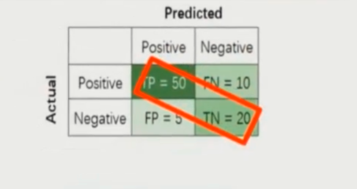
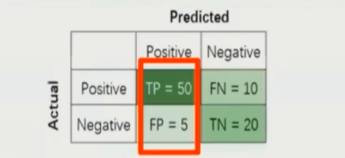
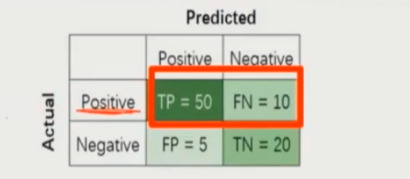
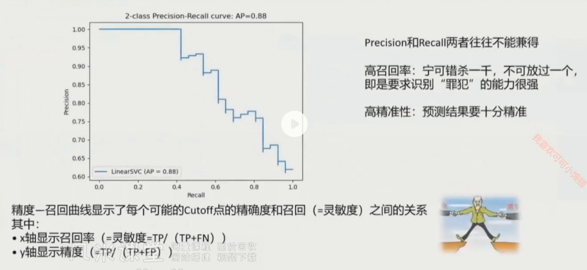
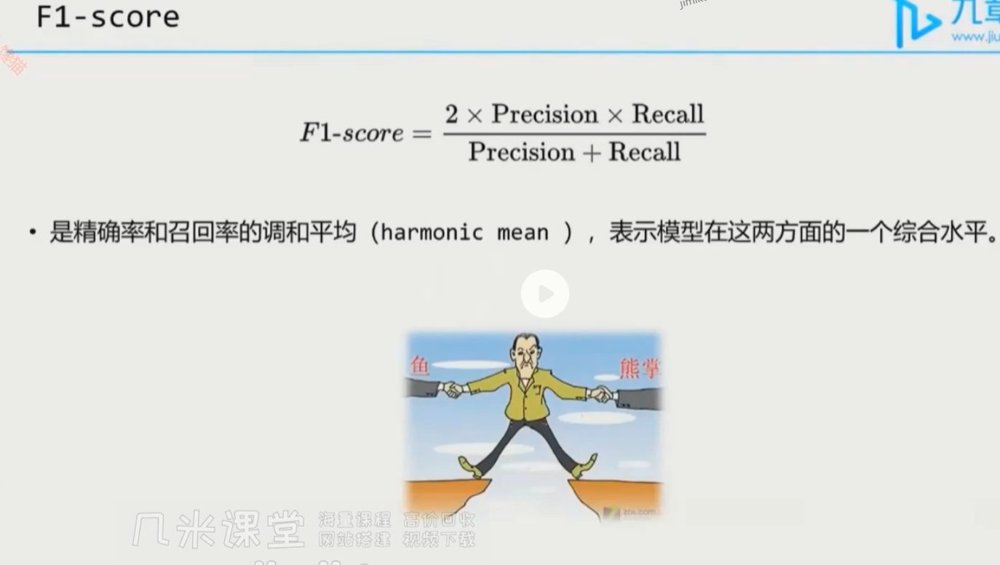

# 模型性能评估

## Accuracy（准确率）

$$
Accuracy = \frac{TP + TN}{TP + TN + FP + FN}
$$

**含义：所有预测中，预测正确的比例。**

- 划分正确的样本数 / 所有的样本数 
- 代表的即是模型对所有样本的分类准确率 
- 对于不平衡数据集而言，Accuracy并不是一个好指标

|              | Predicted 1 | Predicted 0 |
| :----------- | :---------- | :---------- |
| **Actual 1** | 0           | 10          |
| **Actual 0** | 10          | 980         |

**Accuracy = (0+980)/(0+10+10+980) = 980/1000 = 98%**

## Precision（精确率）

>**Precision 和 Recall 着重关注模型在正样本中的分类能力**

$$
Precision = \frac{TP}{TP + FP}
$$

**含义：预测为正类中，真正为正类的比例。**

- Precision关注的是模型在预测结果为Positive的准确率 
- 表示的是模型在预测结果为Positive的可信度 
- 不关心模型能从真正的Positive中识别出多少Positive

|              | Predicted 1 | Predicted 0 |
| :----------- | :---------- | :---------- |
| **Actual 1** | 0           | 10          |
| **Actual 0** | 10          | 980         |

**Precision = 0/(0+10) = 0%**

## Recall（召回率）

$$
Recall = \frac{TP }{TP + FN}
$$

**含义：Label中的所有正类中被预测为正类的比例。**

- Label中的所有正类中被预测为正类的比例
- 衡量的是模型对实际正类的提取能力
- Precision衡量模型预测正类时的准确率，Recall衡量模型识别出正类的能力。

|              | Predicted 1 | Predicted 0 |
| :----------- | :---------- | :---------- |
| **Actual 1** | 9           | 1           |
| **Actual 0** | 10          | 980         |

**Recall = 9/(1+9) = 90%**

## Recall 和 Precision

