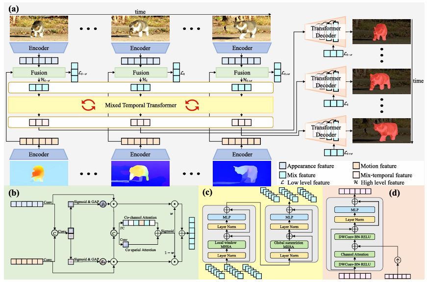
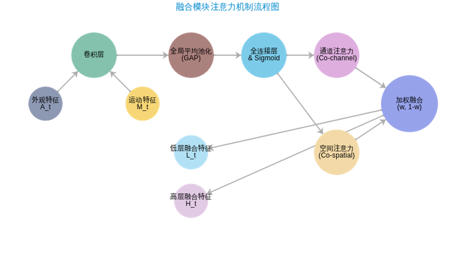

# 目标检测

## **输入数据层 (Input Data Layer)**

**外观数据流**：

- 输入RGB图像序列 `I_t-s`, `I_t`, `I_t+s`...
- 每帧包含目标的视觉外观信息（颜色、纹理、形状）
- 数据格式：通常为 H×W×3 的彩色图像

**运动数据流**：

- 输入深度图序列 `D_t-s`, `D_t`, `D_t+s`...
- 提供三维结构和运动信息
- 数据格式：通常为 H×W×2 的光流图

这两部分数据共同构成了视频序列的多模态输入，分别对应目标的静态外观和动态变化信息。

## 编码器层 (Encoder Layer)

编码器负责从输入数据中提取高层次特征表示。本架构包含两组编码器：一组处理图像（外观编码器），另一组处理光流图（运动编码器）。每组编码器均由多层卷积神经网络组成，逐层提取特征。

### 外观编码器 

**输入：**RGB图像帧 I_t 。

**结构：** 多层卷积神经网络（如ResNet、VGG）。

**操作：** 通过一系列卷积、池化和激活函数，逐步降低特征的空间分辨率，同时增加特征通道数。例如，每经过一层卷积-池化，特征图的高度和宽度减半，通道数翻倍。这种操作使模型能够从像素级数据中提取出语义丰富的高级特征。

**关键技术：**  卷积层、最大池化层、ReLU激活函数。

- **卷积层：**  对输入图像进行卷积操作，学习局部模式。每层卷积层输出一组特征图，其数量等于卷积核的数量。卷积核大小通常为3×3或5×5，步长为1，填充使输出大小与输入一致或减半。卷积操作在保持空间位置信息的同时，引入了平移不变性，有助于模型关注目标的形状和纹理。
-  **最大池化层：**  每隔若干卷积层插入最大池化层（如步长2的2×2池化），将特征图大小减半。池化操作降低了计算量和模型对位置的敏感性，同时保留了主要特征。例如，最大池化取窗口内最大值，使得即使目标在小范围内移动，特征仍能识别。
- **ReLU激活函数：**  在卷积和池化后应用ReLU非线性激活，引入非线性，增强模型的表达能力。ReLU函数 f(x) = max(0, x) 能够有效缓解梯度消失问题，并加速训练收敛。

**输出：**  外观特征 A_t （蓝色方块），维度通常为 H/8×W/8×256 等（具体取决于编码器层数和输出步幅）。例如，输入图像大小为 256×256 ，经过若干卷积和池化层后，外观特征图大小可能为 32×32 ，通道数为256。这些特征包含了每帧图像的高层语义信息，如物体的轮廓、纹理等。

### 运动编码器 

**输入**：光流图帧 D_t。

**结构**：与外观编码器结构类似，但针对光流信息优化。通常也是多层卷积神经网络。

**操作**：提取光流图中的运动模式、边界信息和空间关系。光流图表示像素运动方向和速度，模型会学习运动变化较大的区域作为运动边界。例如，光流图中移动物体与静止背景之间往往有显著的运动差，卷积操作可以检测到这些边界并形成特征。

**关键技术**：卷积层、最大池化层、ReLU激活函数（同外观编码器）。

**输出**：运动特征 M_t（橙色方块），维度与外观特征相似（如 H/8×W/8×256）。运动特征包含了光流图中的关键信息，例如物体的运动轮廓、速度梯度（可间接反映运动方向和强度）等。这些特征为后续的时序建模提供了视频序列的动态变化线索。

**作用**：运动编码器和外观编码器并行工作，分别捕捉视频帧的静态外观和动态运动信息。这两种信息对于目标检测和跟踪都是不可或缺的：外观信息帮助模型识别“是什么”，运动信息帮助模型理解“如何变化”。

## 融合模块 (Fusion Module)

融合模块位于编码器之后，其任务是将同一时间步的**外观特征**和**运动特征**进行有效融合，并产生两种不同粒度的特征：低层特征和高层特征。融合模块在架构中扮演了连接多模态特征和时序建模的桥梁角色，其核心是一个注意力驱动的融合机制。下图展示了融合模块内部的注意力机制流程：

输入： 来自同一时间步 t 的外观特征 A_t（蓝色方块）和运动特征 M_t（橙色方块）。

结构： 融合模块通常由多个子层组成，包括卷积层、注意力机制层和全连接层等。在本架构中，融合模块采用了通道协同注意力和空间协同注意力机制，其内部结构如上图所示。

关键技术： 卷积层、全局平均池化（GAP）、全连接层（FC）、Sigmoid激活函数、元素级乘法（⊗）、注意力权重 w 等。

- 卷积层： 对输入的外观特征和运动特征进行初步处理，通常使用 1×1 卷积核调整通道数或进行特征降维。这有助于在融合前统一特征维度，减少计算复杂度。
- 全局平均池化 (GAP)： 对特征图的每个通道计算平均值，生成一个全局上下文向量。例如，对于特征图 X ∈ R^{H×W×C}，GAP操作得到 X_{avg} ∈ R^C。GAP能够捕捉特征图中各通道的整体分布，用于后续注意力权重的计算。
- 全连接层 (FC) 和 Sigmoid激活函数： 通过全连接层将GAP得到的向量映射为一个标量注意力权重（通常介于0和1之间）。Sigmoid激活确保权重在0到1范围内，可视为“重要性分数”。例如，经过FC层和Sigmoid后得到权重 g_c，表示某特征通道的重要程度。
- 元素级乘法 (⊗)： 将一个特征图与相应的注意力权重进行逐元素相乘。例如，将运动特征 M_t 经过卷积后与通道权重 g_c 相乘，得到加权的运动特征。这相当于让注意力机制动态地强调重要的特征通道。
- 注意力权重 w： 这是一个可学习的标量权重，用于融合不同注意力机制的输出。通过另一个FC层和Sigmoid，生成权重 w 和 1-w，以平衡通道注意力和空间注意力的贡献。例如，w 可能表示更信任通道注意力的程度，而 1-w 则表示信任空间注意力的程度。

输出： 融合模块会输出两种不同层次的融合特征：

- 低层融合特征 L_t（绿色方块）：这部分特征保留了更多的空间细节信息，具有相对较高的空间分辨率。例如，在输出时会进行上采样，使其与原始图像分辨率接近，以确保边界和纹理的准确性。低层特征对于最终的精细分割和定位至关重要。
- 高层融合特征 H_t（深蓝色方块）：这部分特征经过了更深度的融合和降维，语义信息更加丰富但空间分辨率较低。高层特征通常用于捕捉时序上下文和抽象的语义关系，在后续的时序Transformer中被进一步处理。

## 混合时序Transformer (Mixed Temporal Transformer)

## 解码器 (Transformer Decoder)

解码器的任务是利用融合了时序上下文的高层特征，结合低层细节特征，逐步恢复空间分辨率，生成最终的检测结果。在本架构中，解码器采用了标准的Transformer解码器结构，用于从抽象特征中重建出像素级的目标分割掩码。

**输入：**  对于每个时间步 t ，解码器接收两个输入：

- 来自混合时序Transformer的对应混合时序特征 **T_t**（粉色方块），包含了该时间步的时序上下文和语义信息。
-  来自融合模块的对应低层融合特征 **L_t**（绿色方块），包含了该时间步的细节信息和边界信息。

**结构：**  解码器通常由多个解码器层堆叠而成，每个解码器层包含**自注意力**、**交叉注意力**和**前馈网络**等模块。

**关键技术：**  自注意力机制、交叉注意力机制、前馈网络、层归一化、深度可分离卷积 (DWConv)、通道注意力机制等。

-  **自注意力机制：**  解码器可能首先对输入的混合时序特征 T_t 应用自注意力，以在内部整合该时序特征的信息。这有助于模型进一步理解 T_t 中包含的上下文，例如该特征是来自哪个时间步、与其他时间步特征的关系等。
-  **交叉注意力机制：**  这是解码器的核心部分。解码器使用混合时序特征 **T_t**  作为**查询（Query）**，并使用低层融合特征 **L_t**  作为**键（Key）和值（Value）**。通过交叉注意力，解码器能够将高层时序特征所包含的全局语义信息，选择性地与低层特征所包含的局部细节信息进行融合。具体来说，高层特征知道“这里应该有一个物体”，而低层特征提供了像素级的位置和边界信息。交叉注意力机制使得解码器可以将高层语义引导低层细节，从而生成精确的分割。
-  **前馈网络：**  每个注意力层之后通常接一个前馈网络，用于对特征进行非线性变换和增强。这与编码器中的前馈网络类似，进一步提升模型的表达能力。
-  **层归一化：**  解码器各层前后也应用层归一化，以稳定训练过程。
- **深度可分离卷积 (DWConv)：** 为了高效地进行上采样和特征提取，解码器中使用了深度可分离卷积。深度可分离卷积将标准卷积分解为逐通道卷积和逐点卷积，在减少参数和计算量的同时，保持了特征提取能力。例如，使用 3×3 深度卷积对特征进行卷积，然后使用 1×1 卷积调整通道数，实现上采样和特征增强。
-   **通道注意力机制：**  解码器中还引入了通道注意力机制，对低层特征的通道进行加权。这可以视为另一种形式的注意力，使模型动态地关注 L_t 中与 T_t 最相关的通道。例如，通过一个 1×1 卷积和Sigmoid生成通道注意力权重，然后与 L_t 逐通道相乘，从而增强重要通道的信息。

**上采样与精细化：**  解码器通过多层这样的注意力和卷积操作，逐步将特征的空间分辨率提高到原始图像大小，并精细化分割边界。例如，初始的 L_t 可能只有 H/8×W/8 大小，经过若干层深度卷积和上采样，最终输出与输入图像同尺寸的特征图，其中包含了目标物体的精确边界信息。

**数据流向：**  输入 T_t 和 L_t 经过解码器各层处理后，输出是针对时间步 t 的**分割掩码**（Segmentation Mask，通常用红色覆盖表示）。这是最终的检测结果，表示了视频中被分割的目标物体的位置和形状。

**作用：**  解码器将时序Transformer提取的上下文特征与融合模块提供的细节特征相结合，完成从特征空间到像素空间的映射。它负责将高层语义信息转化为实际的目标位置和边界，实现了从抽象表示到具体输出的关键转换。通过解码器的处理，模型能够生成高精度的目标检测结果（如分割掩码），从而满足应用需求。

## 模块

### 蓝色块 (Encoder 编码器)

**技术**：基于卷积神经网络(CNN)的特征编码器

**处理流程**：

- 顶部编码器接收视频帧，通过卷积层、池化层提取高层次外观特征
- 底部编码器接收深度图，提取高层次运动特征
- 输出用于后续处理的高级外观特征和高级运动特征

### 绿色块 (Fusion 融合模块)

**技术**：多模态特征融合模块，包含卷积层、Sigmoid激活函数、全局平均池化(GAP)、协同通道注意力和协同空间注意力

**处理流程**：

- 输入外观特征和运动特征各自通过卷积层和Sigmoid&GAP操作生成通道注意力权重
- 利用协同通道注意力机制在通道维度学习整合两种模态特征重要性
- 通过协同空间注意力机制在空间维度进行特征加权整合
- 输出融合后的高级特征(Mix feature)和低级特征(Low level feature)

### 黄色块 (Mixed Temporal Transformer 混合时序Transformer)

**技术**：用于捕获视频时间依赖关系的Transformer模块，包含MLP、层归一化、局部窗口多头自注意力和全局汇总多头自注意力

**处理流程**：

- 输入融合后的高级特征序列
- 通过局部窗口MHSA捕获短时、精细的动作变化
- 通过全局汇总MHSA捕获长时、宏观的上下文信息
- 利用MLP和层归一化进行特征转换和训练稳定
- 输出混合时序特征，融合了不同时间步的信息

### 橙色块 (Transformer Decoder 解码器)

**技术**：Transformer架构解码器，结合MLP、层归一化、深度可分离卷积、批归一化、ReLU激活和通道注意力

**处理流程**：

- 混合时序特征首先经过MLP和层归一化预处理
- 低级特征通过跳跃连接与处理后的混合时序特征结合
- 利用DWConv-BN-RELU进行高效特征变换和非线性激活
- 通道注意力帮助关注对分割结果更重要的特征通道
- 输出最终的像素级分割掩码

