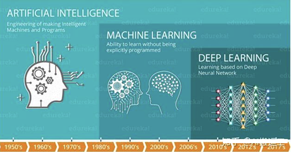
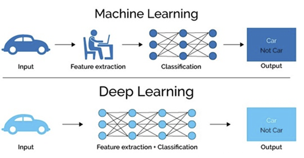
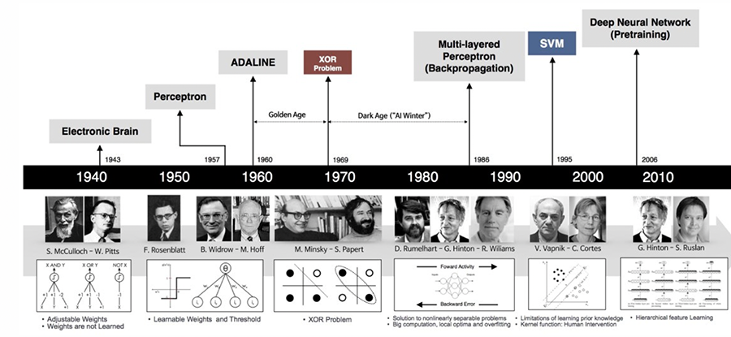
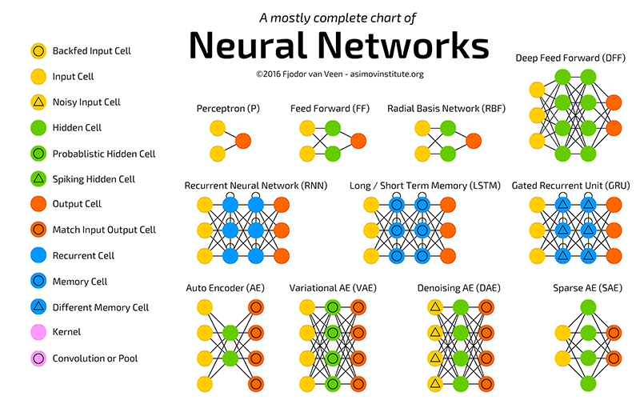
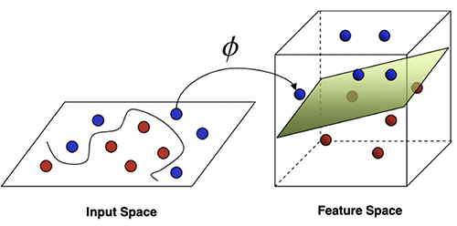
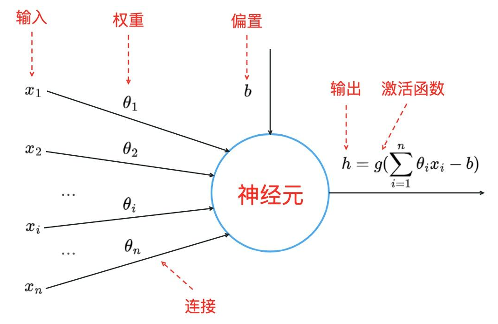
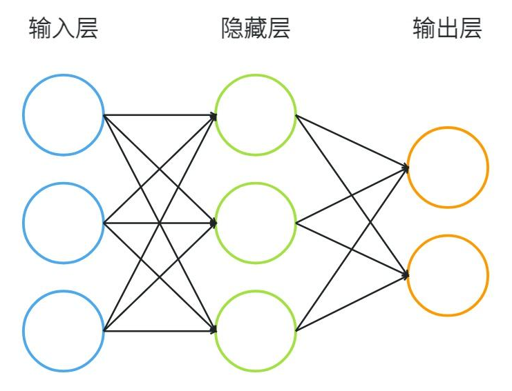
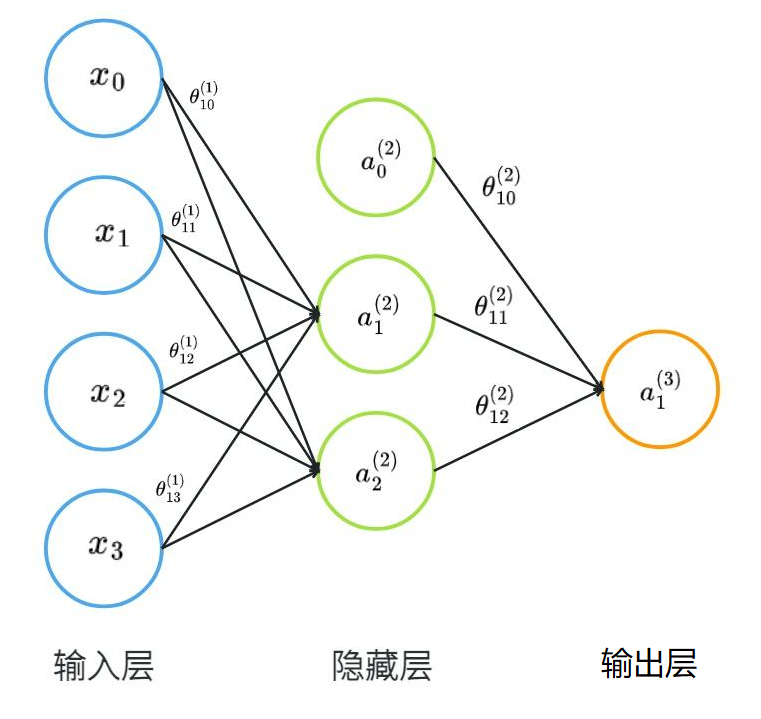

# 深度学习与神经网络

#### 一、深度学习

在介绍深度学习之前，我们先看下⼈⼯智能，机器学习和深度学习之间的关系：

机器学习是实现⼈⼯智能的⼀种途径，深度学习是机器学习的⼀个⼦集。也就是说深度学习是实现机器学习的⼀种⽅法。与机器学习算法的主要区别如下图所示：

传统机器学习算术依赖⼈⼯设计特征，并进⾏特征提取，⽽深度学习⽅法不需要⼈⼯，⽽是依赖算法⾃动提取特征。深度学习模仿⼈类⼤脑的运⾏⽅式，从经验中学习获取知识。这也是深度学习被看做⿊盒⼦，可解释性差的原因。

随着计算机软硬件的⻜速发展，现阶段通过深度学习来模拟⼈脑来解释数据，包括图像，⽂本，⾳频等内容。⽬前深度学习的主要应⽤领域有：

- 智能⼿机
- 语⾳识别，⽐如苹果的智能语⾳助⼿siri
- 机器翻译，⾕歌将深度学习⽅法嵌⼊到⾕歌翻译中，能够⽀持100多种语⾔的即时翻译
- 拍照翻译
- ⾃动驾驶
- 在其他领域也能⻅到深度学习的身影，⽐如⻛控，安防，智能零售，医疗领域，推荐系统等

#### 二、发展历程

- 深度学习其实并不是新的事物，深度学习所需要的神经⽹络技术起源于20世纪50年代，叫做感知机。当时也通常使⽤单层感知机，尽管结构简单，但是能够解决复杂的问题。后来感知机被证明存在严重的问题，因为只能学习线性可分函数，连简单的异或(XOR)等线性不可分问题都⽆能为⼒，1969年Marvin Minsky写了⼀本叫做《Perceptrons》的书，他提出了著名的两个观点：

  1. 单层感知机没⽤，我们需要多层感知机来解决复杂问题

  2. 没有有效的训练算法。

     

- 20世纪80年代末期，⽤于⼈⼯神经⽹络的**反向传播算法**（也叫Back Propagation算法或者BP算法）的发明，给机器学习带来了希望，掀起了基于统计模型的机器学习热潮。这个热潮⼀直持续到今天。⼈们发现，利⽤BP算法可以让⼀个⼈⼯神经⽹络模型从⼤量训练样本中学习统计规律，从⽽对未知事件做预测。这种基于统计的机器学习⽅法⽐起过去基于⼈⼯规则的系统，在很多⽅⾯显出优越性。这个时候的⼈⼯神经⽹络，虽也被称作**多层感知机**（Multi-layer Perceptron），但实际是种只含有⼀层隐层节点的浅层模型。

  

- 20世纪90年代，各种各样的浅层机器学习模型相继被提出，例如⽀撑向量机（SVM，Support Vector Machines）、 Boosting、最⼤熵⽅法（如LR，Logistic Regression）等。这些模型的结构基本上可以看成带有⼀层隐层节点（如SVM、Boosting），或没有隐层节点（如LR）。这些模型⽆论是在理论分析还是应⽤中都获得了巨⼤的成功。相⽐之下，由于理论分析的难度⼤，训练⽅法⼜需要很多经验和技巧，这个时期浅层⼈⼯神经⽹络反⽽相对沉寂。

  

- 2006年，杰弗⾥·⾟顿以及他的学⽣鲁斯兰·萨拉赫丁诺夫**正式提出了深度学习的概念**。他们在世界顶级学术期刊《科学》发表的⼀篇⽂章中详细的**给出了“梯度消失”问题的解决⽅案**——通过⽆监督的学习⽅法逐层训练算法，再使⽤有监督的反向传播算法进⾏调优。该深度学习⽅法的提出，⽴即在学术圈引起了巨⼤的反响，以斯坦福⼤学、多伦多⼤学为代表的众多世界知名⾼校纷纷投⼊巨⼤的⼈⼒、财⼒进⾏深度学习领域的相关研究。⽽后⼜迅速蔓延到⼯业界中。

  

- 2012年，在著名的ImageNet图像识别⼤赛中，杰弗⾥·⾟顿领导的⼩组采⽤深度学习模型AlexNet⼀举夺冠。AlexNet采⽤ReLU激活函数，从根本上解决了梯度消失问题，并采⽤GPU极⼤的提⾼了模型的运算速度。同年，由斯坦福⼤学著名的吴恩达教授和世界顶尖计算机专家Jeff Dean共同主导的深度神经⽹络——DNN技术在图像识别领域取得了惊⼈的成绩，在ImageNet评测中成功的把错误率从26％降低到了15％。深度学习算法在世界⼤赛的脱颖⽽出，也再⼀次吸引了学术界和⼯业界对于深度学习领域的关注。

- 2016年，⾕歌公司基于深度学习开发的AlphaGo以4:1的⽐分战胜了国际顶尖围棋⾼⼿李世⽯，深度学习的热度⼀时⽆两。后来，AlphaGo⼜接连和众多世界级围棋⾼⼿过招，均取得了完胜。这也证明了在围棋界，基于深度学习技术的机器⼈已经超越了⼈类。

  

- 2017年，基于强化学习算法的AlphaGo升级版AlphaGo Zero横空出世。其采⽤“从零开始”、“⽆师⾃通”的学习模式，以100:0的⽐分轻⽽易举打败了之前的AlphaGo。除了围棋，它还精通国际象棋等其它棋类游戏，可以说是真正的棋类“天才”。此外在这⼀年，深度学习的相关算法在医疗、⾦融、艺术、⽆⼈驾驶等多个领域均取得了显著的成果。所以，也有专家把2017年看作是深度学习甚⾄是⼈⼯智能发展最为突⻜猛进的⼀年。

- 2019年，基于 Transformer 的⾃然语⾔模型持续增⻓和扩散，这是⼀种语⾔建模神经⽹络模型，可以在⼏乎所有任务上提⾼NLP的质量。Google甚⾄将其⽤作相关性的主要信号之⼀，这是多年来最重要的更新。

- 2020年，深度学习扩展到更多的应⽤场景，⽐如积⽔识别，路⾯塌陷等，⽽且疫情期间，在智能外呼系统，⼈群测温系统，⼝罩⼈脸识别等都有深度学习的应⽤。

#### 三、神经网络

神经元网络（Neural Network），也称人工神经元网络（Artificial Neural Network，简称ANN），是一种模仿生物大脑神经元之间相互连接和传递信息的计算模型。它由大量的神经元组成，这些神经元通过连接权重相互连接，形成一个复杂的网络结构。

神经元网络通常由以下几个元素组成：

- 神经元（Neuron）：神经元是网络的基本单元，它接收输入信号并产生输出信号。
- 连接（Connection）：连接是神经元之间的路径，通过连接传递信号。
- 权重（Weight）：权重是连接的强度，它决定了信号在神经元之间的传递效果。
- 偏置（Bias）：偏置是神经元的额外输入，用于调整神经元的激活水平。
- 激活函数（Activation Function）：激活函数用于对神经元的输入进行非线性变换，常见的激活函数包括 sigmoid、ReLU 等。

- 输入层（Input Layer）：输入层接收输入数据，并将其传递给后续的神经元。
- 隐藏层（Hidden Layer）：隐藏层位于输入层和输出层之间，用于处理和抽象输入数据。
- 输出层（Output Layer）：输出层产生最终的输出结果。

神经元是神经网络中的基本单元，它接收多个输入信号，通过一定的计算产生输出信号，并将输出信号传递给下一层神经元。神经元的数学模型可以这样来理解：多个输入信号线性加权相加，与b（阈值）相比较，所得结果由激活函数处理，最终产生输出信号。

#### 四、如何训练神经网络

##### 1、定义网络结构

训练神经元网络之前，我们需要先确定神经元网络的层数、每层的神经元数量以及连接方式。输入层和输出层的节点数量都是确定的。通常情况下，输入层的神经元数量等于数据集特征的数量，输出层的神经元的数量等于数据集标签的数量。但是，隐藏层及其神经元的数量是无法简单确定的。

下面是人们常用的隐藏层确定规则：

- 没有隐藏层：仅能够表示线性可分函数或决策。
- 隐藏层数=1：可以拟合任何“包含从一个有限空间到另一个有限空间的连续映射”的函数。
- 隐藏层数=2：搭配适当的激活函数可以表示任意精度的任意决策边界，并且可以拟合任何精度的任何平滑映射。
- 隐藏层数>2：多出来的隐藏层可以学习复杂的描述（某种自动特征工程）。

在一些规模比较大的深度学习模型中，隐藏层数量可能会达到几十或上百。

如何确定隐藏层节点数？

隐藏层节点数的选择对网络性能影响很大，若节点数太少，网络获取的有用信息就少，容错性差，可能出现欠拟合(underfitting)问题；若节点数过多，不仅训练时间和训练难度增加，还可能会出现过拟合(overfitting)问题。

下面是一个国外论文给出的隐藏节点确定规则：
$$
N_h = \frac{N_s}{\alpha \cdot (N_i + N_o)}
$$
其中：Ni表示输入层神经元个数， No 表示输出层神经元个数， Ns 表示训练集的样本数， α 是一个变量，取值范围2-10。

除此以外，还有一些经验方法可以参考，具体情况还得具体分析。

- 隐藏神经元的数量应在输入层的大小和输出层的大小之间。
- 隐藏神经元的数量应为输入层大小的2/3加上输出层大小的2/3。
- 隐藏神经元的数量应小于输入层大小的两倍。

##### 2、前向传播

确定了神经元网络结构，我们就可以计算前向传播系数了。在神经元网络中，前向传播是指信息从输入层开始，依次通过隐藏层和输出层，最终得到输出结果的过程。在这个过程中，每个神经元都会对输入信息进行处理，并将处理结果传递给下一个神经元，直到到达输出层。

上述网络中，$X_1、X_2、X_3$ 为输入值，$X_0$为偏置，$\theta$ 为权重，在隐藏层中，$\alpha_1、\alpha_2$ 为输入层神经元的激活值，$\alpha_0$为偏置，$\theta$ 为权重，最终输出 $\alpha_1^3$，这也是神经网络常用的一种表达方式。在进行首次迭代时，权重值 $\theta$ 通常其值为随机。但是也有一些专用的初始化值的方案，比如：Xavier初始化 或者 He 初始化等（后续单独讲解）。

##### 3、反向传播

前向传播完成后，我们首次计算出了网络中的所有激活值。但是这个激活值不一定能满足要求，毕竟我们的初始权重和偏置用的都是随机值。所以，我们要衡量一下输出误差的大小。衡量误差的方法是将输出结果与真实值进行比较，计算输出误差。
$$
\delta_i^{(3)} = \alpha_i^{(3)} - y_i
$$
其中 ai(3) 为第三层第i个神经元的预测值， yi 为真实值， δi(3) 表示第三层第i个神经元的误差。运用反向传播，计算出除输入层外所有层的误差项。

##### 4、更新权重

计算出每一个神经元的误差后，我们用梯度下降算法使整个神经元网络的总误差值最小或达到最大训练次数。这个过程会不断更新每一层神经元网络的权重和偏置值。当训练过程结束时，此时网络中的权重和偏置值就是最优值。

常用的梯度下降损失函数包括均方误差（MSE）和交叉熵（Cross-entropy）等。
$$
\huge CrossEntropy = -\frac{1}{n} \Sigma_{i=1}^{n} (y_i log(\hat y) + (1-y_i)log(1-\hat y))
$$

#### 五、专业术语

1. 神经元

2. 权重

3. 偏置：用来改变输入的范围。

4. 激活函数 f(x)：将输入信号翻译成输出信号。最常用的激活函数有 Sigmoid、ReLU 和 softmax。

5. 神经网络：训练神经网络，更新偏置值，目标是找到未知函数的一个近似值。

6. 输入层、输出层、隐含层。

7. 多层神经网络 MLP，每一层上的神经元都和下一层上的神经元连接在一起，全互连网络 (fully connected networks)。

8. 正向传播 (forward propagation)。

9. 成本函数 (损失函数) (cost function)：最小化成本函数，即为最优化输出。学习过程就是围绕着如何最小化成本。

10. 梯度下降 (gradient descent)。

11. 学习速率 (learning rate)：学习率指每次迭代中对成本函数的“最小化次数”。

12. 反向传播 (back propagation)：一次迭代后，根据产生的结果计算出整个网络的偏差，然后用偏差结合“成本函数的梯度”，对“权重因子进行调整”，使得下次迭代的过程中偏差变小。这样一个结合成本函数的梯度来调整权重因子的过程就叫做反向传播。

13. 分批 (batches)：当训练一个神经网络时，不应一次性发送全部输入信号，而应把输入信号随机分成几个大小相同的数据块发送。将数据分批发送，建立的模型会更具有一般性。

14. 周期 (epochs)：一个周期表示对所有的数据批次都进行了一次迭代，包括一次正向传播和一次反向传播。往往周期数越高，模型的准确性就越高，但是耗时就越长，同样周期/纪元的次数过高，可能会出现“过拟合”的情况。

15. dropout 方法：训练过程中隐藏的某些特定神经元会被忽略掉 (drop)。

16. 分批标准化 (batch normalization)：为了保证下一层网络得到的数据拥有合适的分布。因此在每一次数据传递前都需要对数据进行一次正则化处理。

17. 过滤器/滤波器 (filters)：将一个权重矩阵乘以输入图像的一个部分，产生相应的卷积输出。

18. 卷积神经网络 CNN (convolutional neural network)：卷积的过程。

19. 池化 (pooling)：最大化池 16->4->1，取最大值。

20. 补白 (padding)：指给图像的边缘增加额外的空白，从而使得卷积后输出的图像跟输入图像在尺寸上一致，这也被称作相同补白 (Same Padding)。

21. 数据增强 (data augmentation)：从已有数据中创造出新的数据，通过增加训练量以期望能够提高预测的准确率。通过“旋转”“照亮”的操作，训练数据的品质得到了提升，这种过程被称作数据增强。

22. 递归神经元：经由自己处理过的数据，会变成自身下一次的输入，这个过程进行 t 次。

23. 递归神经网络 RNN (recurrent neural network)：常被用于处理序列化的数据，即前一项的输出是用来预测下一项的输入。递归神经网络中存在环的结构，这些神经元上的环状结构使得它们能够存储之前的数据一段时间，从而使得能够预测输出。在 RNN 中隐含层的输出会作为下一次的输入，如此往复经历 t 次，再将输出的结果传递到下一层网络中。这样，最终输出的结果会更全面，而且之前训练的信息被保持的时间会更久。隐藏层将反向传递错误以更新权重。这被称为 backpropagation through time (BPTT)。

24. 梯度消失问题：当激活函数的梯度非常小时，在反向传播过程中，权重因子会被多次乘以这些小的梯度。因此会越变越小，随着递归的深入趋于“消失”，出现梯度消失问题。这一问题可通过采用 ReLU 等没有小梯度的激活函数来有效避免。

25. 梯度爆炸问题：激活函数的梯度过大，在反向传播过程中，部分节点的大梯度使得它们的权重变得非常大，从而削弱了其他节点对于结果的影响。这个问题可以通过截断 (即设置一个梯度允许的最大值) 的方式来有效避免。

